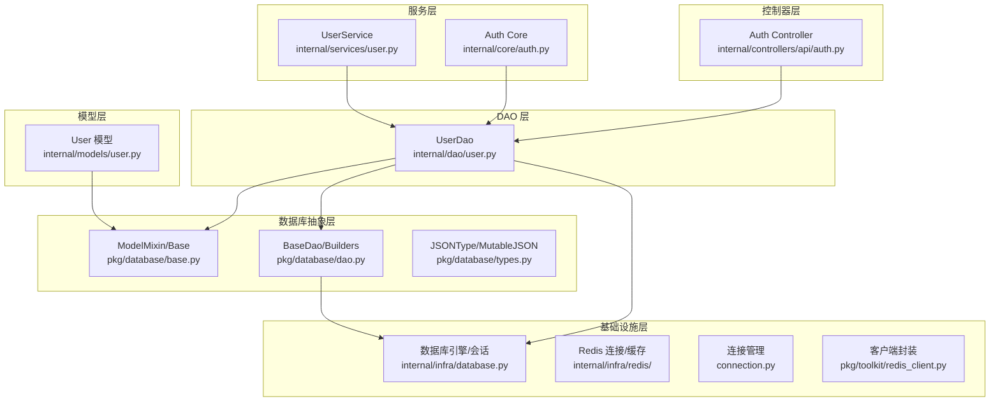
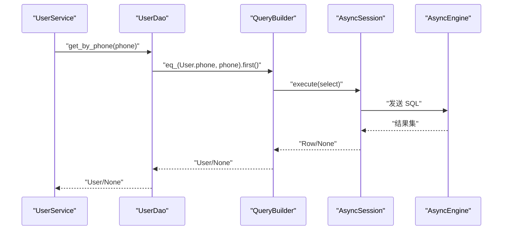
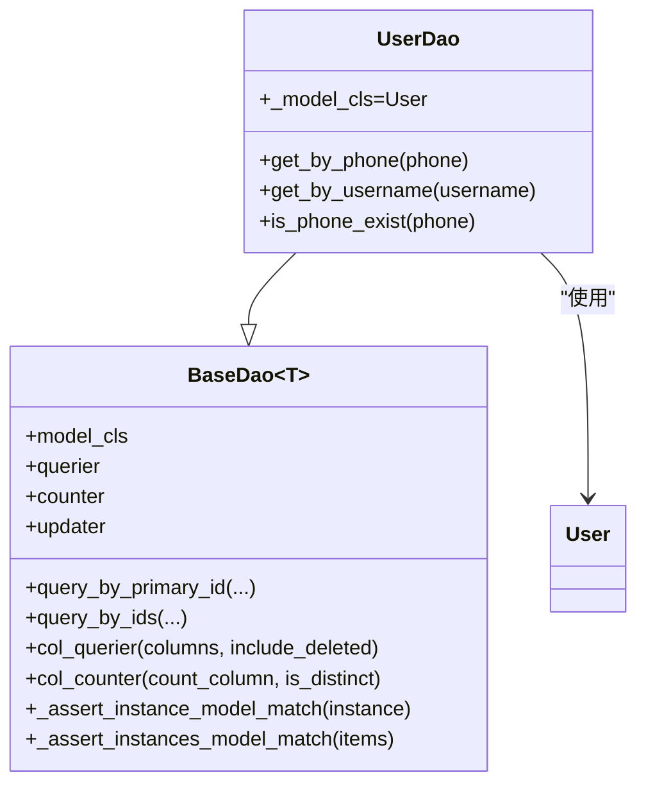
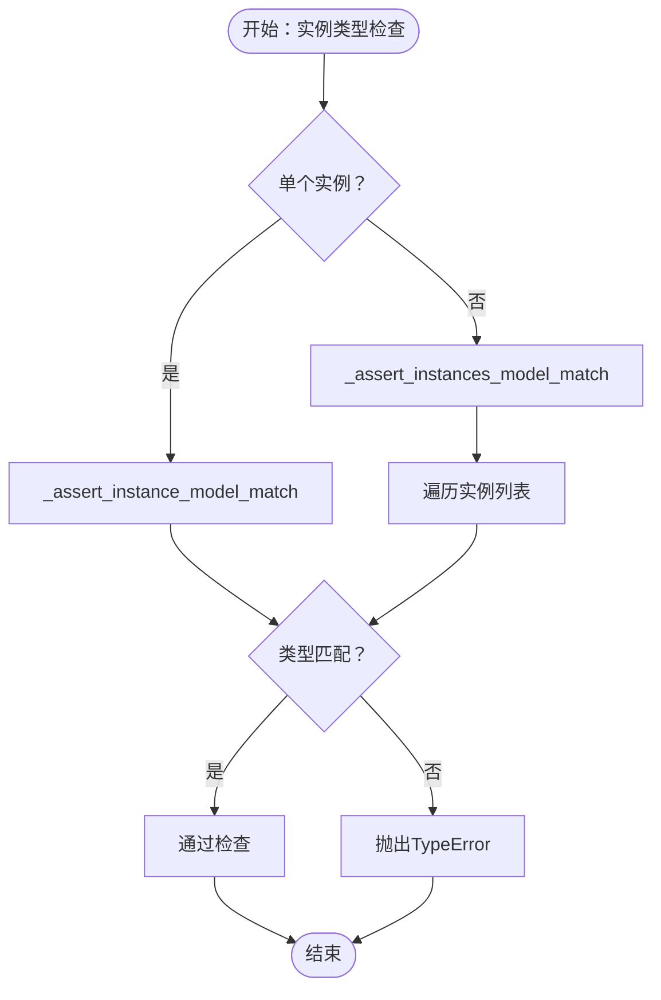
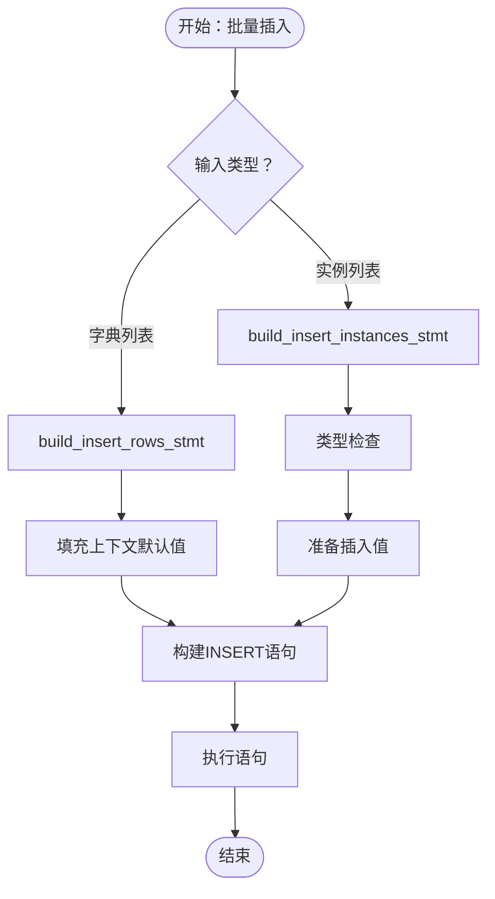
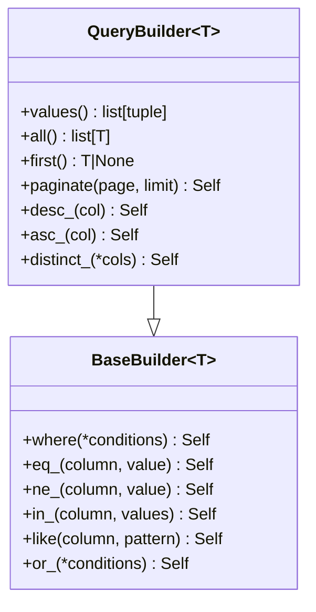
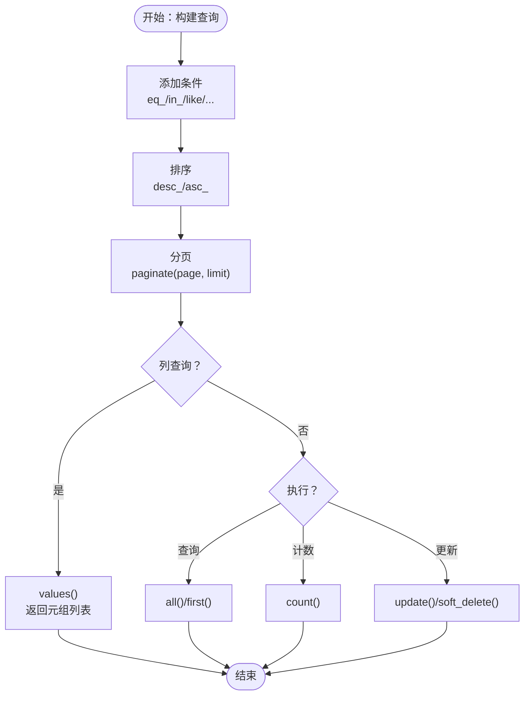
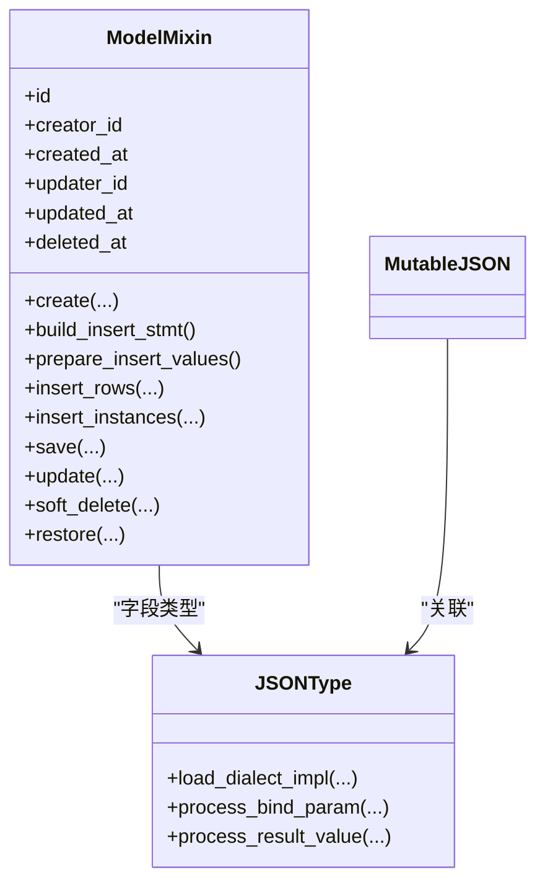
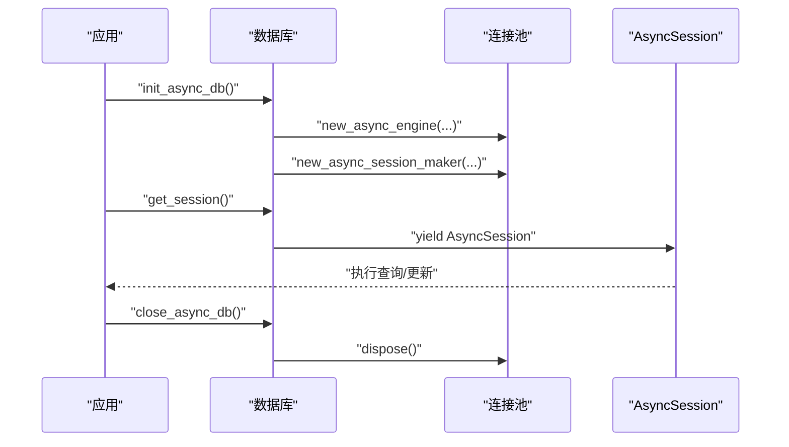
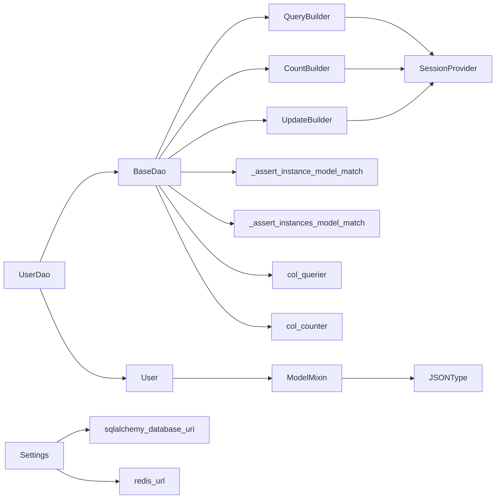

# 数据访问层

<cite>
**本文档引用的文件**
- [internal/dao/user.py](file://internal/dao/user.py)
- [internal/infra/redis/connection.py](file://internal/infra/redis/connection.py)
- [pkg/database/dao.py](file://pkg/database/dao.py)
- [pkg/database/base.py](file://pkg/database/base.py)
- [pkg/database/builder.py](file://pkg/database/builder.py)
- [pkg/toolkit/redis_client.py](file://pkg/toolkit/redis_client.py)
- [internal/models/user.py](file://internal/models/user.py)
- [internal/services/user.py](file://internal/services/user.py)
- [internal/controllers/api/auth.py](file://internal/controllers/api/auth.py)
- [internal/core/auth.py](file://internal/core/auth.py)
- [internal/app.py](file://internal/app.py)
- [internal/config/load_config.py](file://internal/config/load_config.py)
</cite>

## 更新摘要
**所做更改**
- 新增模型实例类型检查方法的详细说明，包括单个实例和批量实例的类型验证
- 新增批量插入能力扩展的完整文档，包括 build_insert_rows_stmt 和 build_insert_instances_stmt 方法
- 增强查询构建器接口说明，补充 values() 方法的列查询功能
- 更新服务层简化说明，反映UserService的精简实现
- 新增 _assert_instance_model_match 和 _assert_instances_model_match 方法的详细说明

## 目录
1. [简介](#简介)
2. [项目结构](#项目结构)
3. [核心组件](#核心组件)
4. [架构总览](#架构总览)
5. [组件详解](#组件详解)
6. [依赖关系分析](#依赖关系分析)
7. [性能与优化](#性能与优化)
8. [故障排查指南](#故障排查指南)
9. [结论](#结论)

## 简介
本文件系统性阐述本项目的"数据访问层"设计与实现，涵盖 DAO 模式、数据库操作封装、事务管理、查询优化、性能调优、错误恢复与并发控制、与数据库抽象层的集成关系、缓存策略与数据一致性保障，以及常见问题与性能瓶颈的解决方案。目标是帮助开发者快速理解并高效使用数据访问层，同时为维护与扩展提供清晰的参考。

**更新** 本次更新重点关注数据访问层的架构改进：新增模型实例类型检查方法、批量插入能力扩展、查询构建器接口增强、服务层简化。这些改进显著提升了数据访问层的安全性、性能和易用性。

## 项目结构
数据访问层主要分布在以下模块：
- DAO 层：面向具体实体的访问接口，如用户 DAO
- 数据库抽象层：统一的会话提供者、模型基类、查询/计数/更新构建器
- 基础设施层：数据库引擎与会话生命周期管理、Redis 连接与缓存客户端
- 模型层：ORM 映射模型，继承统一的模型基类
- 服务层：业务编排，依赖 DAO 完成数据访问

```mermaid
graph TB
subgraph "服务层"
Svc["UserService<br/>internal/services/user.py"]
AuthCore["Auth Core<br/>internal/core/auth.py"]
end
subgraph "DAO 层"
UDao["UserDao<br/>internal/dao/user.py"]
end
subgraph "数据库抽象层"
Base["ModelMixin/Base<br/>pkg/database/base.py"]
DaoCore["BaseDao/Builders<br/>pkg/database/dao.py"]
Types["JSONType/MutableJSON<br/>pkg/database/types.py"]
end
subgraph "基础设施层"
InfraDb["数据库引擎/会话<br/>internal/infra/database.py"]
InfraRedis["Redis 连接/缓存<br/>internal/infra/redis/"]
RedisConn["连接管理<br/>connection.py"]
RedisClient["客户端封装<br/>pkg/toolkit/redis_client.py"]
end
subgraph "模型层"
UserModel["User 模型<br/>internal/models/user.py"]
end
subgraph "控制器层"
AuthCtrl["Auth Controller<br/>internal/controllers/api/auth.py"]
end
Svc --> UDao
AuthCore --> UDao
AuthCtrl --> UDao
UDao --> Base
UDao --> DaoCore
UDao --> InfraDb
DaoCore --> InfraDb
UserModel --> Base
```

**图表来源**
- [internal/services/user.py](file://internal/services/user.py#L1-L173)
- [internal/dao/user.py](file://internal/dao/user.py#L1-L31)
- [pkg/database/base.py](file://pkg/database/base.py#L60-L308)
- [pkg/database/dao.py](file://pkg/database/dao.py#L16-L455)
- [pkg/database/builder.py](file://pkg/database/builder.py#L18-L345)
- [pkg/toolkit/redis_client.py](file://pkg/toolkit/redis_client.py#L1-L261)
- [internal/models/user.py](file://internal/models/user.py#L7-L13)
- [internal/core/auth.py](file://internal/core/auth.py#L1-L24)
- [internal/controllers/api/auth.py](file://internal/controllers/api/auth.py#L1-L299)

**章节来源**
- [internal/dao/user.py](file://internal/dao/user.py#L1-L31)
- [pkg/database/dao.py](file://pkg/database/dao.py#L16-L455)
- [pkg/database/base.py](file://pkg/database/base.py#L60-L308)
- [pkg/database/builder.py](file://pkg/database/builder.py#L18-L345)
- [pkg/toolkit/redis_client.py](file://pkg/toolkit/redis_client.py#L1-L261)
- [internal/models/user.py](file://internal/models/user.py#L7-L13)
- [internal/services/user.py](file://internal/services/user.py#L1-L173)

## 核心组件
- DAO 基类与会话提供者
  - BaseDao：提供统一的查询、计数、更新构建器与常用 CRUD 辅助方法，依赖 SessionProvider 获取会话
  - execute_transaction：手动事务执行器，支持复杂业务在单事务内串行执行
  - **新增** _assert_instance_model_match：单个实例类型检查方法，确保实例类型与DAO模型匹配
  - **新增** _assert_instances_model_match：批量实例类型检查方法，验证实例列表的类型一致性
  - **新增** col_querier：支持指定列查询的专用查询器
  - **新增** col_counter：支持指定列统计的专用计数器
- 查询/计数/更新构建器
  - QueryBuilder：链式条件构造、排序、分页、查询集合/首条记录、**新增** values() 方法支持列查询
  - CountBuilder：链式条件构造、去重计数、聚合统计、**新增** custom_stmt 参数支持自定义计数语句
  - UpdateBuilder：链式更新字段、软删除、自动同步更新时间与操作人
- 模型与类型
  - ModelMixin：统一主键、创建/更新/删除时间与操作人字段，工厂方法与批量插入、**重构** CRUD 操作
  - JSONType/MutableJSON：跨数据库兼容的 JSON 类型与变更追踪
- 基础设施
  - 数据库：new_async_engine/new_async_session_maker、get_session 上下文管理器、SQL 监听与慢查询日志
  - Redis：连接池、RedisClient 封装、分布式锁与批处理

**更新** 服务层现在更加精简，UserService主要负责业务逻辑编排，数据访问完全委托给DAO层。

**章节来源**
- [pkg/database/dao.py](file://pkg/database/dao.py#L66-L76)
- [pkg/database/builder.py](file://pkg/database/builder.py#L106-L209)
- [pkg/database/base.py](file://pkg/database/base.py#L100-L115)
- [pkg/database/dao.py](file://pkg/database/dao.py#L303-L357)
- [pkg/database/builder.py](file://pkg/database/builder.py#L173-L198)
- [pkg/database/dao.py](file://pkg/database/dao.py#L114-L142)
- [pkg/database/dao.py](file://pkg/database/dao.py#L178-L208)

## 架构总览
数据访问层采用"DAO + 构建器 + 抽象模型 + 基础设施"的分层设计，通过会话提供者解耦具体数据库驱动，通过构建器实现链式、可组合的查询/更新逻辑，通过模型基类统一数据结构与默认字段，通过基础设施层集中管理连接池与监控。

```mermaid
sequenceDiagram
participant Svc as "UserService"
participant UDao as "UserDao"
participant Q as "QueryBuilder"
participant DB as "AsyncSession"
participant Engine as "AsyncEngine"
Svc->>UDao : "get_by_phone(phone)"
UDao->>Q : "eq_(User.phone, phone).first()"
Q->>DB : "execute(select)"
DB->>Engine : "发送 SQL"
Engine-->>DB : "结果集"
DB-->>Q : "Row/None"
Q-->>UDao : "User/None"
UDao-->>Svc : "User/None"
```

**图表来源**
- [internal/services/user.py](file://internal/services/user.py#L17-L19)
- [internal/dao/user.py](file://internal/dao/user.py#L9-L21)
- [pkg/database/builder.py](file://pkg/database/builder.py#L155-L171)
- [pkg/database/dao.py](file://pkg/database/dao.py#L246-L250)

## 组件详解

### DAO 层：UserDao
- 角色定位：面向 User 实体的 DAO，继承 BaseDao，提供按手机号查询与存在性检查
- 关键点
  - 通过 session_provider 获取会话，避免在导入阶段建立连接
  - 使用 querier.eq_().first() 实现"按字段精确匹配 + 返回首条"
  - 使用 counter.eq_().count() 实现"存在性检查"
  - 单例 user_dao 便于全局复用

```mermaid
classDiagram
class BaseDao~T~ {
+model_cls
+querier
+counter
+updater
+query_by_primary_id(...)
+query_by_ids(...)
+col_querier(columns, include_deleted)
+col_counter(count_column, is_distinct)
+_assert_instance_model_match(instance)
+_assert_instances_model_match(items)
}
class UserDao {
+_model_cls=User
+get_by_phone(phone)
+get_by_username(username)
+is_phone_exist(phone)
}
class User
UserDao --|> BaseDao
UserDao --> User : "使用"
```

**图表来源**
- [pkg/database/dao.py](file://pkg/database/dao.py#L16-L76)
- [internal/dao/user.py](file://internal/dao/user.py#L6-L31)
- [internal/models/user.py](file://internal/models/user.py#L7-L13)

**章节来源**
- [internal/dao/user.py](file://internal/dao/user.py#L1-L31)
- [internal/services/user.py](file://internal/services/user.py#L17-L19)

### 模型实例类型检查方法

**更新** 新增的类型检查方法确保了DAO操作的安全性和正确性：

#### 单个实例类型检查
- _assert_instance_model_match：验证单个实例的类型是否与DAO期望的模型类型一致
- 当实例类型不匹配时，抛出TypeError异常，防止跨模型操作
- 用于所有基于实例的操作，如insert、update、soft_delete等

#### 批量实例类型检查
- _assert_instances_model_match：验证实例列表中每个实例的类型一致性
- 逐个检查每个实例，确保所有实例都是同一模型类型
- 用于批量操作，如insert_instances

```mermaid
flowchart TD
Start(["开始：实例类型检查"]) --> Single{"单个实例？"}
Single --> |是| CheckSingle["_assert_instance_model_match"]
Single --> |否| CheckBatch["_assert_instances_model_match"]
CheckSingle --> TypeMatch{"类型匹配？"}
CheckBatch --> Loop["遍历实例列表"]
Loop --> TypeMatch
TypeMatch --> |是| Success["通过检查"]
TypeMatch --> |否| Error["抛出TypeError"]
Success --> End(["结束"])
Error --> End
```

**图表来源**
- [pkg/database/dao.py](file://pkg/database/dao.py#L66-L76)

**章节来源**
- [pkg/database/dao.py](file://pkg/database/dao.py#L66-L76)

### 批量插入能力扩展

**更新** 新增的批量插入方法提供了高性能的数据批量操作能力：

#### build_insert_rows_stmt - 批量字典插入
- 接收字典列表作为输入，自动填充插入字段
- 支持上下文默认值的自动应用
- 返回可执行的INSERT语句，不直接执行

#### insert_rows - 批量字典插入执行
- 高性能批量插入字典数据
- 自动构建INSERT语句并执行
- 支持错误上下文信息

#### build_insert_instances_stmt - 批量实例插入
- 接收实例列表作为输入，逐个验证类型
- 调用实例的prepare_insert_values方法
- 返回可执行的INSERT语句

#### insert_instances - 批量实例插入执行
- 高性能批量插入实例数据
- 自动类型检查和值准备
- 支持错误上下文信息

```mermaid
flowchart TD
Start(["开始：批量插入"]) --> Input{"输入类型？"}
Input --> |字典列表| Rows["build_insert_rows_stmt"]
Input --> |实例列表| Instances["build_insert_instances_stmt"]
Rows --> FillDefaults["填充上下文默认值"]
Instances --> TypeCheck["类型检查"]
FillDefaults --> BuildStmt["构建INSERT语句"]
TypeCheck --> PrepareValues["准备插入值"]
PrepareValues --> BuildStmt
BuildStmt --> Execute["执行语句"]
Execute --> End(["结束"])
```

**图表来源**
- [pkg/database/dao.py](file://pkg/database/dao.py#L303-L357)

**章节来源**
- [pkg/database/dao.py](file://pkg/database/dao.py#L303-L357)

### 查询构建器接口增强

**更新** QueryBuilder的values()方法增强了列查询功能：

#### values() 方法 - 列查询支持
- 返回列查询的元组列表
- 支持单列和多列查询
- 用于col_querier场景，减少数据传输量
- 单列查询返回单元素元组列表
- 多列查询返回多元素元组列表

```mermaid
classDiagram
class QueryBuilder~T~ {
+values() list[tuple]
+all() list[T]
+first() T|None
+paginate(page, limit) Self
+desc_(col) Self
+asc_(col) Self
+distinct_(*cols) Self
}
class BaseBuilder~T~ {
+where(*conditions) Self
+eq_(column, value) Self
+ne_(column, value) Self
+in_(column, values) Self
+like(column, pattern) Self
+or_(*conditions) Self
}
QueryBuilder --|> BaseBuilder
```

**图表来源**
- [pkg/database/builder.py](file://pkg/database/builder.py#L106-L209)
- [pkg/database/builder.py](file://pkg/database/builder.py#L19-L104)

**章节来源**
- [pkg/database/builder.py](file://pkg/database/builder.py#L173-L198)

### 数据库抽象层：BaseDao 与构建器
- BaseDao
  - 统一的会话提供者注入，支持构造时或类属性指定模型类型
  - 提供多种 QueryBuilder/CountBuilder/UpdateBuilder 的便捷属性
  - 常用方法：按主键查询、按 ID 列表查询、带软删过滤的查询器
  - **新增** _assert_instance_model_match：单个实例类型检查
  - **新增** _assert_instances_model_match：批量实例类型检查
  - **新增** col_querier：创建只查询指定列的查询器，支持 values() 返回元组列表
  - **新增** col_counter：创建统计指定列的计数器，支持去重统计
  - execute_transaction：在单事务内执行复杂业务逻辑，自动提交/回滚
- QueryBuilder
  - 条件：eq_/ne_/gt_/lt_/ge_/le_/in_/like/is_null/or_
  - 排序：desc_/asc_
  - 分页：paginate(page, limit)
  - 结果：all()/first()
  - **新增** values：返回列查询的元组列表，支持单列和多列查询
  - **新增** custom_stmt：支持自定义SELECT语句
- CountBuilder
  - 条件：eq_/ne_/in_/like/is_null/or_
  - 计数：count()，支持 distinct
  - **新增** custom_stmt：支持自定义计数语句，如 COUNT(DISTINCT column)
- UpdateBuilder
  - 更新字段：update(**kwargs)，自动处理时区与字段合法性
  - 软删除：soft_delete()，同步更新 deleted_at 与 updated_at
  - 自动同步：将更新字典同步到模型实例（当提供实例时）

```mermaid
flowchart TD
Start(["开始：构建查询"]) --> Cond["添加条件<br/>eq_/in_/like/..."]
Cond --> Sort["排序<br/>desc_/asc_"]
Sort --> Pag["分页<br/>paginate(page, limit)"]
Pag --> ColQuery{"列查询？"}
ColQuery --> |是| Values["values()<br/>返回元组列表"]
ColQuery --> |否| Exec{"执行？"}
Exec --> |查询| ExecQ["all()/first()"]
Exec --> |计数| ExecC["count()"]
Exec --> |更新| ExecU["update()/soft_delete()"]
Values --> End(["结束"])
ExecQ --> End
ExecC --> End
ExecU --> End
```

**图表来源**
- [pkg/database/builder.py](file://pkg/database/builder.py#L105-L209)
- [pkg/database/builder.py](file://pkg/database/builder.py#L211-L245)
- [pkg/database/builder.py](file://pkg/database/builder.py#L247-L345)

**章节来源**
- [pkg/database/dao.py](file://pkg/database/dao.py#L66-L76)
- [pkg/database/dao.py](file://pkg/database/dao.py#L114-L142)
- [pkg/database/dao.py](file://pkg/database/dao.py#L178-L208)
- [pkg/database/builder.py](file://pkg/database/builder.py#L106-L209)

### 模型与类型：ModelMixin 与 JSONType
- ModelMixin
  - 统一字段：id、creator_id、created_at、updater_id、updated_at、deleted_at
  - 工厂方法：create() 自动填充默认字段
  - 批量操作：insert_rows()/insert_instances()，支持字典与实例
  - 单例操作：save()/update()/soft_delete()/restore()，自动处理时间与操作人
  - **重构** CRUD 操作：insert/save/update/soft_delete/restore 方法得到增强和优化
  - **新增** build_insert_stmt：严格插入语句构造，防止重复插入
  - **新增** prepare_insert_values：实例插入值准备
  - 反射工具：has_*、get_column_*、get_column_names 等
- JSONType/MutableJSON
  - 跨数据库兼容：PostgreSQL(JSONB)、MySQL(JSON)、SQLite(JSON)、Oracle(Native/CLOB)、其他(TEXT)
  - 自动序列化/反序列化，容错处理
  - 与 MutableJSON 关联，支持 dict/list 的变更追踪

```mermaid
classDiagram
class ModelMixin {
+id
+creator_id
+created_at
+updater_id
+updated_at
+deleted_at
+create(...)
+build_insert_stmt()
+prepare_insert_values()
+insert_rows(...)
+insert_instances(...)
+save(...)
+update(...)
+soft_delete(...)
+restore(...)
}
class JSONType {
+load_dialect_impl(...)
+process_bind_param(...)
+process_result_value(...)
}
class MutableJSON
ModelMixin --> JSONType : "字段类型"
MutableJSON --> JSONType : "关联"
```

**图表来源**
- [pkg/database/base.py](file://pkg/database/base.py#L60-L308)
- [pkg/database/types.py](file://pkg/database/types.py#L12-L183)

**章节来源**
- [pkg/database/base.py](file://pkg/database/base.py#L99-L115)
- [pkg/database/base.py](file://pkg/database/base.py#L210-L227)
- [pkg/database/base.py](file://pkg/database/base.py#L294-L308)
- [pkg/database/types.py](file://pkg/database/types.py#L12-L183)
- [internal/models/user.py](file://internal/models/user.py#L7-L13)

### 基础设施：数据库与 Redis
- 数据库
  - new_async_engine/new_async_session_maker：创建异步引擎与会话工厂
  - get_session：上下文管理器，支持自动回滚与 no_autoflush 控制
  - SQL 监听：before/after 回调计算耗时，结合配置输出慢查询日志
  - 生命周期：init_async_db/close_async_db/reset_async_db
- Redis
  - init_async_redis/close_async_redis/reset_async_redis：连接池与客户端生命周期
  - CacheClient：统一的键值/列表/哈希/锁等操作，异常包装与日志
  - CacheDao：基于 CacheClient 的业务键命名与读取封装

```mermaid
sequenceDiagram
participant App as "应用"
participant DB as "数据库"
participant Pool as "连接池"
participant Sess as "AsyncSession"
App->>DB : "init_async_db()"
DB->>Pool : "new_async_engine(...)"
DB->>Pool : "new_async_session_maker(...)"
App->>DB : "get_session()"
DB->>Sess : "yield AsyncSession"
Sess-->>App : "执行查询/更新"
App->>DB : "close_async_db()"
DB->>Pool : "dispose()"
```

**图表来源**
- [internal/infra/database.py](file://internal/infra/database.py#L26-L111)
- [internal/infra/redis/connection.py](file://internal/infra/redis/connection.py#L32-L92)
- [pkg/toolkit/redis_client.py](file://pkg/toolkit/redis_client.py#L41-L261)

**章节来源**
- [internal/infra/database.py](file://internal/infra/database.py#L26-L154)
- [internal/infra/redis/connection.py](file://internal/infra/redis/connection.py#L1-L92)
- [pkg/toolkit/redis_client.py](file://pkg/toolkit/redis_client.py#L1-L261)

## 依赖关系分析
- DAO 依赖
  - UserDao 依赖 BaseDao、ModelMixin、SessionProvider（来自 get_session）
  - 通过构造函数注入 session_provider，避免在导入阶段建立连接
  - **新增** _assert_instance_model_match/_assert_instances_model_match 依赖类型检查
  - **新增** col_querier/col_counter 依赖 QueryBuilder/CountBuilder
- 构建器依赖
  - QueryBuilder/CountBuilder/UpdateBuilder 依赖 SessionProvider 与模型反射工具
  - BaseDao 提供统一的构建器工厂属性
  - **新增** custom_stmt 支持自定义SQL语句
- 模型与类型
  - User 继承 ModelMixin，使用 JSONType 字段（如适用）
- 基础设施
  - 数据库：Settings.sqlalchemy_database_uri 动态生成连接串
  - Redis：Settings.redis_url 生成连接串，CacheClient 封装 Redis 操作

```mermaid
graph LR
UserDao --> BaseDao
UserDao --> User
BaseDao --> QueryBuilder
BaseDao --> CountBuilder
BaseDao --> UpdateBuilder
BaseDao --> _assert_instance_model_match
BaseDao --> _assert_instances_model_match
BaseDao --> col_querier
BaseDao --> col_counter
QueryBuilder --> SessionProvider
CountBuilder --> SessionProvider
UpdateBuilder --> SessionProvider
User --> ModelMixin
ModelMixin --> JSONType
Settings --> DB_URI["sqlalchemy_database_uri"]
Settings --> Redis_URI["redis_url"]
```

**图表来源**
- [internal/dao/user.py](file://internal/dao/user.py#L1-L3)
- [pkg/database/dao.py](file://pkg/database/dao.py#L16-L76)
- [pkg/database/builder.py](file://pkg/database/builder.py#L18-L27)
- [pkg/database/base.py](file://pkg/database/base.py#L60-L308)
- [internal/models/user.py](file://internal/models/user.py#L7-L13)
- [internal/config/load_config.py](file://internal/config/load_config.py#L119-L173)

**章节来源**
- [internal/dao/user.py](file://internal/dao/user.py#L1-L3)
- [pkg/database/dao.py](file://pkg/database/dao.py#L66-L76)
- [pkg/database/builder.py](file://pkg/database/builder.py#L18-L27)
- [pkg/database/base.py](file://pkg/database/base.py#L60-L308)
- [internal/models/user.py](file://internal/models/user.py#L7-L13)
- [internal/config/load_config.py](file://internal/config/load_config.py#L119-L173)

## 性能与优化
- 连接池与会话
  - 数据库：pool_pre_ping、pool_size、max_overflow、pool_timeout、pool_recycle 等参数优化长连接稳定性与资源占用
  - 会话：expire_on_commit=False，减少对象过期带来的额外开销
- 查询优化
  - 使用 QueryBuilder 的 where/in_/like 等条件组合，避免 N+1 查询
  - 分页 paginate(page, limit) 控制结果规模
  - CountBuilder 支持 distinct 计数，避免不必要的去重
  - **新增** col_querier/values 支持列查询，减少数据传输量
  - **新增** col_counter 支持指定列统计，提升统计查询性能
- 事务与并发
  - execute_transaction：在单事务内串行执行复杂逻辑，确保一致性
  - get_session.autoflush 控制 flush 时机，必要时保持 autoflush=True 以获取自增 ID
- 监控与诊断
  - SQL 监听：before_cursor_execute/after_cursor_execute 计算耗时，慢查询阈值可配置
  - 日志：DEBUG 开启时输出 SQL，慢查询单独告警
- JSON 类型
  - JSONType 在不同数据库上选择最优存储，减少序列化成本
  - MutableJSON 与变更追踪配合，避免无效更新
- **新增** 批量插入优化
  - build_insert_rows_stmt/build_insert_instances_stmt 提供高性能批量插入
  - 自动类型检查减少运行时错误
  - 上下文默认值自动填充提升数据完整性

**章节来源**
- [internal/infra/database.py](file://internal/infra/database.py#L38-L56)
- [pkg/database/builder.py](file://pkg/database/builder.py#L144-L153)
- [pkg/database/dao.py](file://pkg/database/dao.py#L303-L357)
- [pkg/database/types.py](file://pkg/database/types.py#L78-L146)

## 故障排查指南
- 数据库连接
  - 未初始化：调用 init_async_db 后再获取会话；若在 Celery 中使用，注意 reset_async_db 避免事件循环绑定冲突
  - 会话异常：get_session 自动回滚 session.is_active 的异常；检查 autoflush 配置
  - 慢查询：查看慢查询日志，结合 SQL 监听定位热点
- 事务执行
  - execute_transaction：回调异常会自动抛出并包装为 RuntimeError；确认回调内使用传入的 AsyncSession
- **新增** 类型检查错误
  - _assert_instance_model_match：当实例类型不匹配时抛出TypeError，检查DAO模型类型与实例类型
  - _assert_instances_model_match：批量实例类型检查失败，确保所有实例都是同一模型类型
- **新增** 批量插入错误
  - build_insert_rows_stmt：当rows为空时返回None，检查输入数据
  - build_insert_instances_stmt：实例类型检查失败时抛出TypeError
- 模型与类型
  - JSONType：Oracle CLOB 模式需设置 oracle_native_json=False；注意空值与 LOB 对象处理
  - ModelMixin：save/update 前后状态检查，避免对持久化/游离对象误用
- **新增** 列查询问题
  - col_querier/values：确保传入正确的列属性，避免查询不到数据
  - col_counter：注意 is_distinct 参数对统计结果的影响
  - custom_stmt：自定义SQL语句需要确保语法正确性和性能

**章节来源**
- [internal/infra/database.py](file://internal/infra/database.py#L59-L111)
- [pkg/database/dao.py](file://pkg/database/dao.py#L66-L76)
- [pkg/database/dao.py](file://pkg/database/dao.py#L303-L357)
- [pkg/database/types.py](file://pkg/database/types.py#L116-L146)
- [pkg/database/base.py](file://pkg/database/base.py#L156-L201)

## 结论
本数据访问层通过 DAO + 构建器 + 抽象模型 + 基础设施的分层设计，实现了高内聚、低耦合、可扩展且易维护的数据访问能力。其核心优势在于：
- 统一的会话提供者与事务执行器，简化了连接管理与一致性保障
- 链式构建器提供了灵活、可组合的查询/更新能力
- 模型基类与 JSON 类型提升了数据结构的一致性与跨数据库兼容性
- 基础设施层集中管理连接池、监控与 Redis 客户端，便于性能调优与运维
- **新增** 类型检查方法确保了数据操作的安全性
- **新增** 批量插入能力提供了高性能的数据批量操作
- **新增** 查询构建器增强支持了更灵活的列查询功能

**更新** 本次架构改进进一步增强了系统的安全性、性能和易用性：
- **新增模型实例类型检查方法**：通过 _assert_instance_model_match 和 _assert_instances_model_match 确保DAO操作的安全性
- **新增批量插入能力扩展**：提供 build_insert_rows_stmt 和 build_insert_instances_stmt 方法，支持高性能批量数据操作
- **增强查询构建器接口**：values() 方法支持列查询，显著减少数据传输和内存占用
- **服务层简化**：UserService更加精简，专注于业务逻辑编排

建议在实际使用中：
- 优先使用 BaseDao 提供的构建器与常用方法，避免手写复杂 SQL
- 对于批量操作，优先使用 ModelMixin 的批量插入与 UpdateBuilder 的批量更新
- 在复杂业务场景下，使用 execute_transaction 确保事务一致性
- 结合慢查询日志与连接池参数，持续优化性能
- 使用类型检查方法确保数据操作的安全性
- 利用批量插入方法提升大批量数据处理的性能
- 在需要时使用 col_querier/values 进行列查询，使用 col_counter 进行指定列统计
- 利用 custom_stmt 参数构建复杂的自定义查询和统计语句