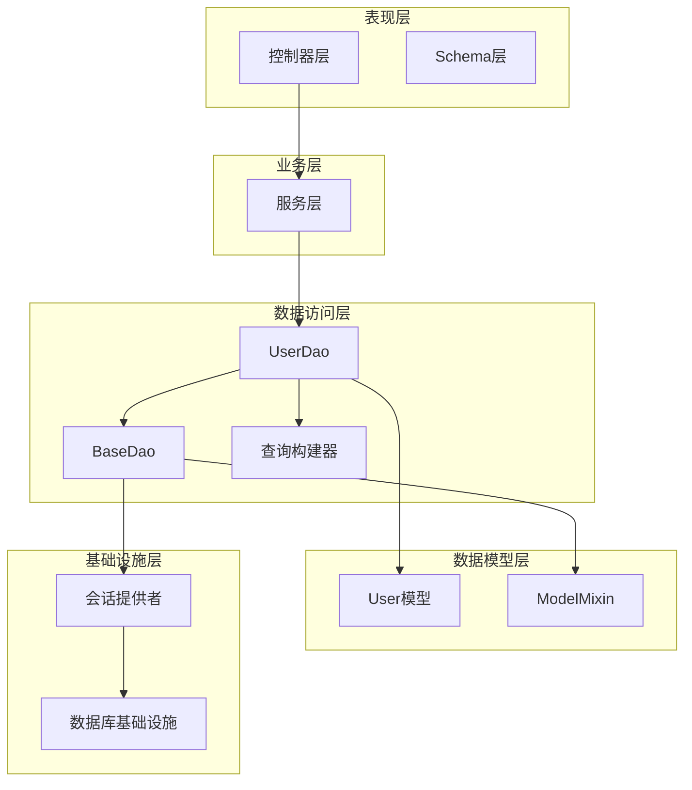
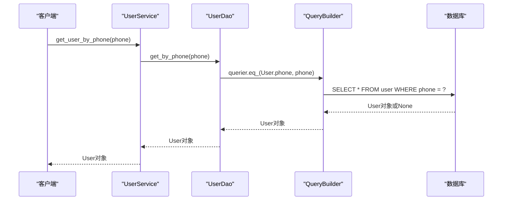
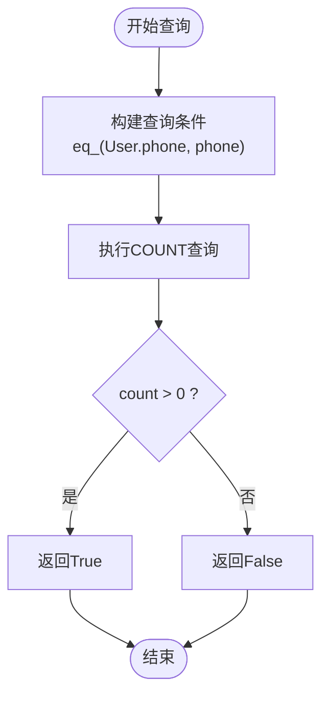
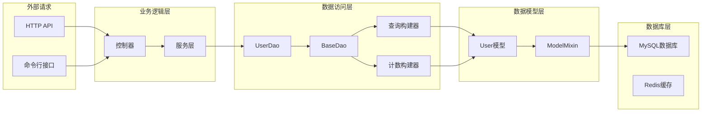
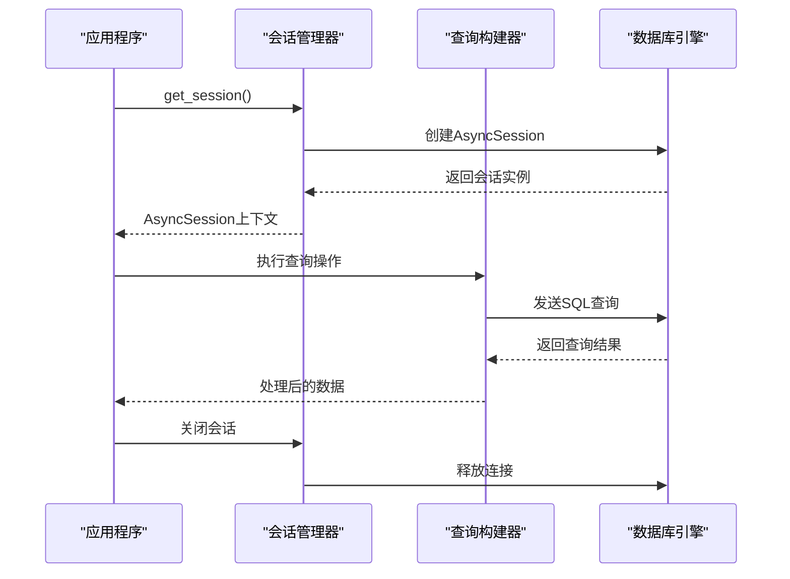
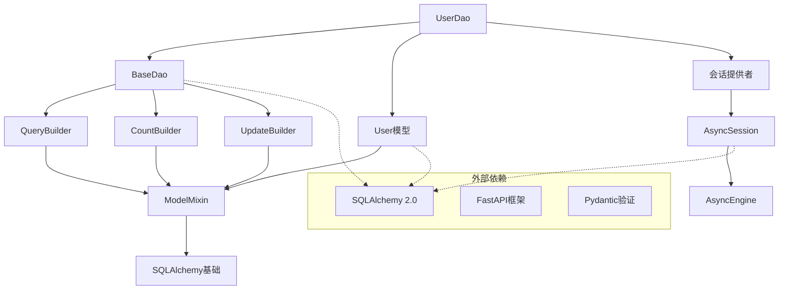

# 用户数据访问对象

<cite>
**本文档引用的文件**
- [internal/dao/user.py](file://internal/dao/user.py)
- [pkg/database/dao.py](file://pkg/database/dao.py)
- [pkg/database/builder.py](file://pkg/database/builder.py)
- [pkg/database/base.py](file://pkg/database/base.py)
- [internal/models/user.py](file://internal/models/user.py)
- [internal/schemas/user.py](file://internal/schemas/user.py)
- [internal/infra/database.py](file://internal/infra/database.py)
- [internal/services/user.py](file://internal/services/user.py)
- [tests/orm/test_orm.py](file://tests/orm/test_orm.py)
</cite>

## 目录
1. [简介](#简介)
2. [项目结构](#项目结构)
3. [核心组件](#核心组件)
4. [架构概览](#架构概览)
5. [详细组件分析](#详细组件分析)
6. [依赖关系分析](#依赖关系分析)
7. [性能考虑](#性能考虑)
8. [故障排除指南](#故障排除指南)
9. [结论](#结论)
10. [附录](#附录)

## 简介

本文档详细介绍了用户数据访问对象（UserDao）的实现和使用方法。UserDao是一个基于泛型设计的数据访问层组件，继承自BaseDao，专门用于处理用户相关的数据库操作。该组件提供了完整的CRUD功能，包括用户查询、存在性检查、以及与用户模型和Schema的深度集成。

## 项目结构

该项目采用分层架构设计，UserDao位于数据访问层，与模型层、服务层和控制器层协同工作：



**图表来源**
- [internal/dao/user.py](file://internal/dao/user.py#L1-L24)
- [pkg/database/dao.py](file://pkg/database/dao.py#L15-L45)
- [pkg/database/base.py](file://pkg/database/base.py#L60-L94)

**章节来源**
- [internal/dao/user.py](file://internal/dao/user.py#L1-L24)
- [pkg/database/dao.py](file://pkg/database/dao.py#L1-L50)
- [pkg/database/base.py](file://pkg/database/base.py#L1-L50)

## 核心组件

### UserDao类设计

UserDao是专门为用户实体设计的数据访问对象，采用了以下关键设计原则：

#### 泛型继承设计
- 继承自`BaseDao[User]`，实现了强类型的泛型约束
- 通过`_model_cls`属性明确指定操作的模型类型
- 支持类型安全的编译时检查和IDE智能提示

#### 单例模式实现
- 提供全局唯一的`user_dao`实例
- 通过`session_provider=get_session`注入会话提供者
- 避免重复创建数据库连接，提高性能

**章节来源**
- [internal/dao/user.py](file://internal/dao/user.py#L6-L24)

### 核心查询方法

#### get_by_phone方法
该方法用于根据手机号码查询用户信息：



**图表来源**
- [internal/dao/user.py](file://internal/dao/user.py#L9-L12)
- [pkg/database/builder.py](file://pkg/database/builder.py#L111-L162)

#### is_phone_exist方法
该方法用于检查手机号码是否存在：



**图表来源**
- [internal/dao/user.py](file://internal/dao/user.py#L14-L17)
- [pkg/database/builder.py](file://pkg/database/builder.py#L164-L189)

**章节来源**
- [internal/dao/user.py](file://internal/dao/user.py#L9-L17)

## 架构概览

### 数据流架构



**图表来源**
- [internal/dao/user.py](file://internal/dao/user.py#L1-L3)
- [pkg/database/dao.py](file://pkg/database/dao.py#L15-L90)

### 异步数据库操作流程



**图表来源**
- [internal/infra/database.py](file://internal/infra/database.py#L85-L111)
- [pkg/database/dao.py](file://pkg/database/dao.py#L106-L120)

## 详细组件分析

### BaseDao泛型设计

BaseDao实现了通用的数据访问模式，支持所有继承自ModelMixin的实体：

#### 泛型约束
- 使用`T: ModelMixin`确保类型安全
- 支持编译时类型检查
- 提供强类型的查询构建器

#### 会话管理
- 通过`session_provider`参数注入会话提供者
- 支持依赖注入模式
- 实现延迟连接建立

**章节来源**
- [pkg/database/dao.py](file://pkg/database/dao.py#L15-L45)

### 查询构建器系统

#### QueryBuilder功能
- 提供链式查询构建
- 支持多种比较操作符（=, !=, >, <, >=, <=）
- 支持IN查询和LIKE模糊匹配
- 提供分页功能

#### CountBuilder功能
- 专门用于统计查询
- 支持DISTINCT计数
- 自动处理软删除过滤

**章节来源**
- [pkg/database/builder.py](file://pkg/database/builder.py#L111-L162)
- [pkg/database/builder.py](file://pkg/database/builder.py#L164-L189)

### 数据模型映射

#### User模型设计
- 继承自ModelMixin，获得通用CRUD能力
- 定义了username、account、phone三个核心字段
- 支持软删除和审计字段

#### 字段类型定义
- username: String(64) - 用户名
- account: String(64) - 账户名
- phone: String(11) - 手机号码

**章节来源**
- [internal/models/user.py](file://internal/models/user.py#L7-L13)

### Schema集成

#### 用户详情Schema
- id: int - 用户ID
- name: str - 用户名
- phone: str - 手机号码

#### 列表响应Schema
- total: int - 总记录数
- items: list[UserDetailSchema] - 用户详情列表

**章节来源**
- [internal/schemas/user.py](file://internal/schemas/user.py#L12-L21)

## 依赖关系分析

### 组件依赖图



**图表来源**
- [internal/dao/user.py](file://internal/dao/user.py#L1-L3)
- [pkg/database/dao.py](file://pkg/database/dao.py#L15-L90)
- [pkg/database/base.py](file://pkg/database/base.py#L60-L94)

### 错误处理机制

#### 异常传播策略
- 查询异常：捕获并重新抛出RuntimeError
- 会话异常：自动回滚事务
- 参数验证：在构建器中进行输入验证

#### 事务管理
- 使用上下文管理器确保资源正确释放
- 支持手动事务执行器execute_transaction
- 自动处理嵌套事务

**章节来源**
- [pkg/database/builder.py](file://pkg/database/builder.py#L145-L161)
- [pkg/database/dao.py](file://pkg/database/dao.py#L106-L120)

## 性能考虑

### 连接池优化

#### 连接池配置
- pool_size: 10 - 连接池大小
- max_overflow: 20 - 超额连接数
- pool_timeout: 30 - 连接超时时间
- pool_recycle: 1800 - 连接回收时间

#### 会话生命周期
- 延迟连接建立：仅在首次使用时创建连接
- 上下文管理：自动管理会话生命周期
- 连接复用：避免频繁创建和销毁连接

### 查询优化策略

#### 索引建议
- phone字段应建立唯一索引
- 常用查询字段建立复合索引
- 软删除字段建立独立索引

#### 查询模式优化
- 使用first()替代limit(1)提高性能
- 避免N+1查询问题
- 合理使用JOIN操作

### 缓存策略

#### 读写分离
- 热点数据缓存到Redis
- 写操作直接写入数据库
- 缓存失效策略

#### 批量操作
- 支持批量插入和更新
- 减少网络往返次数

## 故障排除指南

### 常见问题及解决方案

#### 数据库连接问题
**症状**: "Database is not initialized"错误
**原因**: 未正确初始化数据库连接池
**解决方案**: 
1. 确保调用`init_async_db()`函数
2. 检查环境变量配置
3. 验证数据库URL格式

#### 查询超时问题
**症状**: 查询执行时间过长
**原因**: 缺少适当的索引或查询条件不当
**解决方案**:
1. 为常用查询字段添加索引
2. 优化WHERE条件
3. 使用EXPLAIN分析查询计划

#### 内存泄漏问题
**症状**: 应用程序内存持续增长
**原因**: 会话未正确关闭
**解决方案**:
1. 确保使用上下文管理器
2. 避免长时间持有会话实例
3. 定期检查会话状态

### 调试技巧

#### SQL监控
- 启用DEBUG模式查看SQL执行
- 设置慢查询阈值
- 分析查询性能瓶颈

#### 日志配置
- 配置适当的日志级别
- 记录关键业务操作
- 监控异常情况

**章节来源**
- [internal/infra/database.py](file://internal/infra/database.py#L116-L154)

## 结论

UserDao作为项目中的核心数据访问组件，展现了现代Python异步ORM的最佳实践。其设计特点包括：

1. **类型安全**: 通过泛型设计确保编译时类型检查
2. **性能优化**: 采用连接池和延迟连接策略
3. **易用性**: 提供简洁的API和丰富的查询构建器
4. **可维护性**: 清晰的分层架构和依赖注入模式

该组件为用户管理提供了完整、高效、可靠的解决方案，是构建企业级应用的理想选择。

## 附录

### 使用示例

#### 基本CRUD操作
```python
# 创建用户
user = User.create(username="john", phone="13800001111")
await user.save(get_session)

# 查询用户
user = await user_dao.get_by_phone("13800001111")

# 更新用户
await user.update(get_session, username="john_doe")

# 删除用户
await user.soft_delete(get_session)
```

#### 批量操作
```python
# 批量插入
users = [User.create(username=f"user_{i}") for i in range(100)]
await User.insert_instances(users, get_session)

# 批量更新
await user_dao.updater.eq_(User.id, user_id).update(status="active")
```

### 最佳实践

1. **依赖注入**: 使用依赖注入容器管理UserDao实例
2. **事务边界**: 明确事务范围，避免长事务
3. **错误处理**: 统一异常处理和日志记录
4. **性能监控**: 定期监控查询性能和数据库负载
5. **测试覆盖**: 为UserDao编写充分的单元测试