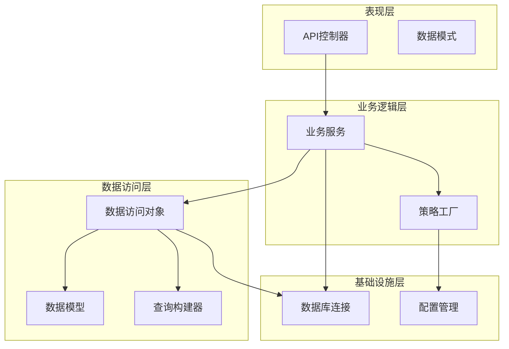
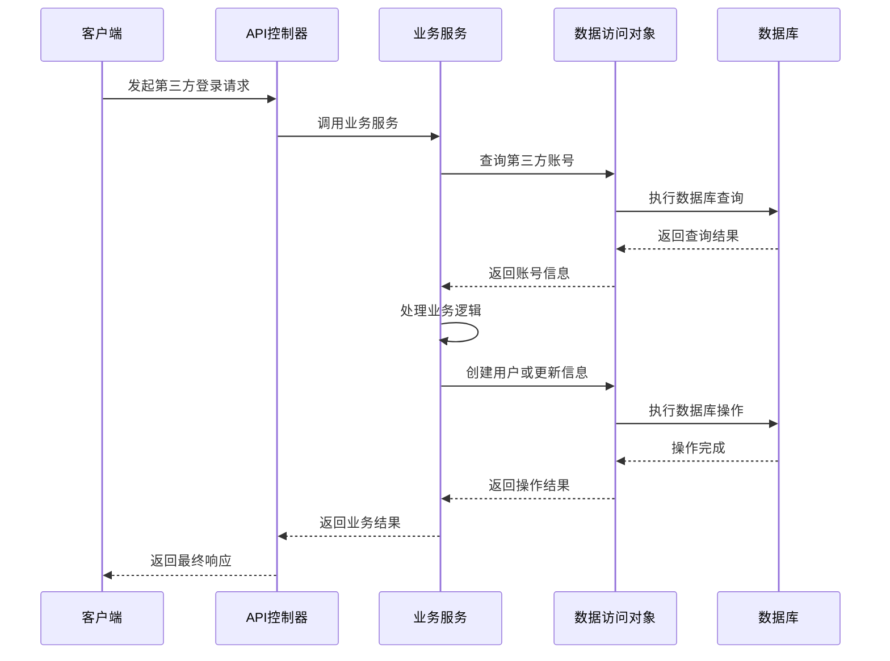
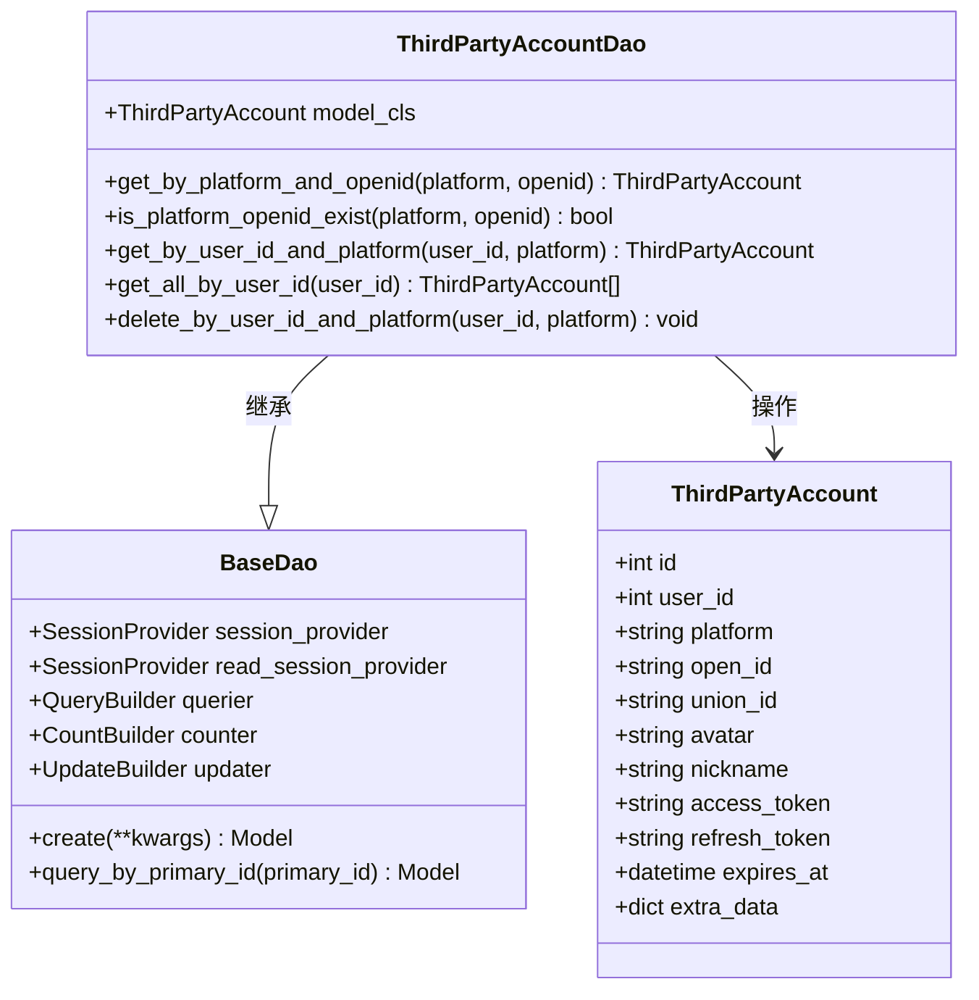
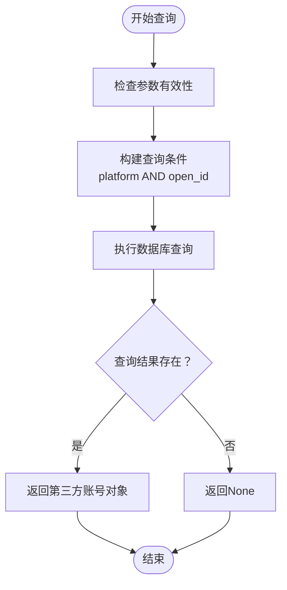
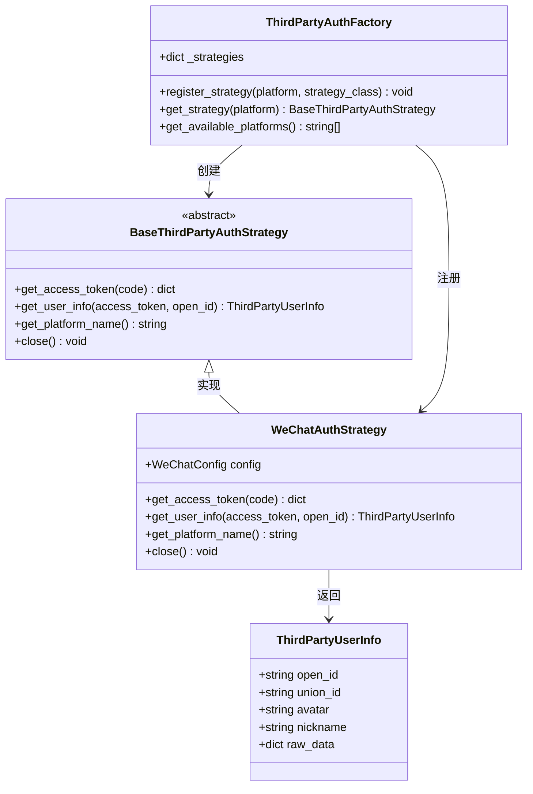
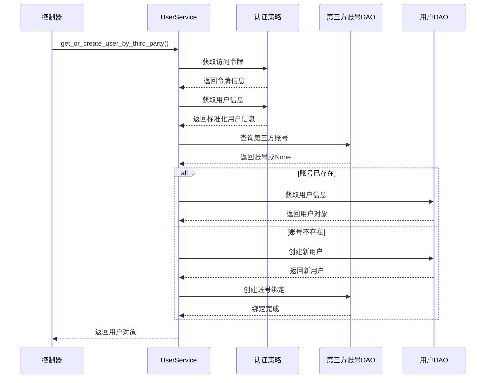
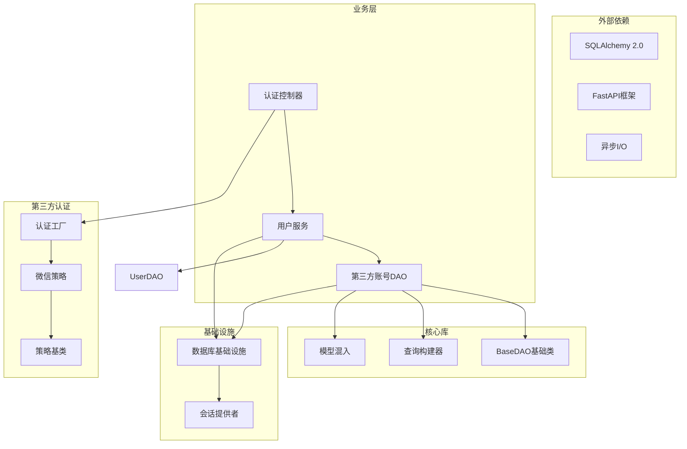

# 第三方账号数据访问对象

<cite>
**本文档引用的文件**
- [internal/dao/third_party_account.py](file://internal/dao/third_party_account.py)
- [internal/models/third_party_account.py](file://internal/models/third_party_account.py)
- [pkg/database/dao.py](file://pkg/database/dao.py)
- [pkg/database/builder.py](file://pkg/database/builder.py)
- [pkg/database/base.py](file://pkg/database/base.py)
- [internal/services/user.py](file://internal/services/user.py)
- [internal/controllers/api/auth.py](file://internal/controllers/api/auth.py)
- [pkg/third_party_auth/base.py](file://pkg/third_party_auth/base.py)
- [pkg/third_party_auth/strategies/wechat.py](file://pkg/third_party_auth/strategies/wechat.py)
- [pkg/third_party_auth/factory.py](file://pkg/third_party_auth/factory.py)
- [internal/infra/database.py](file://internal/infra/database.py)
</cite>

## 目录
1. [简介](#简介)
2. [项目结构](#项目结构)
3. [核心组件](#核心组件)
4. [架构概览](#架构概览)
5. [详细组件分析](#详细组件分析)
6. [依赖关系分析](#依赖关系分析)
7. [性能考虑](#性能考虑)
8. [故障排除指南](#故障排除指南)
9. [结论](#结论)

## 简介

本文档深入分析了FastAPI后端项目中的第三方账号数据访问对象（DAO）实现。该系统实现了完整的第三方账号绑定和管理功能，支持微信、支付宝、Google、GitHub等多种平台的用户认证和数据管理。

系统采用分层架构设计，包括数据访问层、业务服务层、控制器层和第三方认证策略层。核心功能涵盖用户与第三方平台账号的绑定关系管理、用户信息的获取和更新、以及完整的认证流程集成。

## 项目结构

项目采用清晰的分层组织结构，主要分为以下层次：

**图表来源**
- [internal/dao/third_party_account.py](file://internal/dao/third_party_account.py#L1-L44)
- [internal/services/user.py](file://internal/services/user.py#L1-L186)
- [internal/controllers/api/auth.py](file://internal/controllers/api/auth.py#L1-L299)

**章节来源**
- [internal/dao/third_party_account.py](file://internal/dao/third_party_account.py#L1-L44)
- [internal/models/third_party_account.py](file://internal/models/third_party_account.py#L1-L122)

## 核心组件

### 数据访问对象（DAO）

ThirdPartyAccountDao是系统的核心数据访问组件，继承自BaseDao泛型类，专门处理第三方账号的CRUD操作。

**主要特性：**
- 泛型类型安全：使用Python泛型确保类型安全
- 异步操作：基于SQLAlchemy异步引擎
- 多种查询方法：支持按平台、用户ID、OpenID等多种查询方式
- 软删除支持：实现逻辑删除功能
- 单例模式：提供全局唯一的DAO实例

**关键方法：**
- `get_by_platform_and_openid()`: 通过平台和OpenID查询第三方账号
- `is_platform_openid_exist()`: 检查OpenID是否存在
- `get_by_user_id_and_platform()`: 通过用户ID和平台查询
- `get_all_by_user_id()`: 获取用户的所有第三方账号
- `delete_by_user_id_and_platform()`: 删除用户的指定平台账号

### 数据模型

ThirdPartyAccount模型定义了第三方账号关联表的完整结构，支持多种第三方平台的用户信息存储。

**核心字段：**
- `user_id`: 用户ID（逻辑外键）
- `platform`: 平台名称（wechat、alipay、google等）
- `open_id`: 平台唯一标识
- `union_id`: 平台UnionID（可选）
- `avatar`: 头像URL
- `nickname`: 昵称
- `access_token`: 访问令牌
- `refresh_token`: 刷新令牌
- `expires_at`: 令牌过期时间
- `extra_data`: 额外信息（JSON格式）

**数据库约束：**
- 唯一约束：`(platform, open_id)`确保同一平台下OpenID唯一
- 复合索引：`(user_id, platform)`优化用户查询性能
- 多个单列索引：优化各种查询场景

### 基础设施层

系统提供了完整的数据库基础设施支持，包括连接池管理、读写分离、事务处理等功能。

**核心功能：**
- 异步数据库连接：支持高性能异步操作
- 读写分离：主库写入，只读副本查询
- 连接池优化：智能连接池配置和监控
- 事务管理：提供手动事务执行器

**章节来源**
- [pkg/database/dao.py](file://pkg/database/dao.py#L15-L234)
- [pkg/database/builder.py](file://pkg/database/builder.py#L1-L200)
- [pkg/database/base.py](file://pkg/database/base.py#L60-L367)

## 架构概览

系统采用经典的三层架构设计，各层职责明确，耦合度低，易于维护和扩展。

**图表来源**
- [internal/controllers/api/auth.py](file://internal/controllers/api/auth.py#L218-L299)
- [internal/services/user.py](file://internal/services/user.py#L71-L124)
- [internal/dao/third_party_account.py](file://internal/dao/third_party_account.py#L9-L36)

**章节来源**
- [internal/controllers/api/auth.py](file://internal/controllers/api/auth.py#L1-L299)
- [internal/services/user.py](file://internal/services/user.py#L1-L186)

## 详细组件分析

### ThirdPartyAccountDao 类分析

**图表来源**
- [internal/dao/third_party_account.py](file://internal/dao/third_party_account.py#L6-L43)
- [pkg/database/dao.py](file://pkg/database/dao.py#L15-L123)
- [internal/models/third_party_account.py](file://internal/models/third_party_account.py#L10-L122)

#### 查询方法实现

系统提供了多种高效的查询方法来满足不同的业务需求：

**1. 平台和OpenID查询**

**图表来源**
- [internal/dao/third_party_account.py](file://internal/dao/third_party_account.py#L9-L13)

**2. 用户ID和平台查询**
该方法用于查找特定用户在指定平台的绑定关系，支持用户同时绑定多个平台的情况。

**3. 用户所有第三方账号查询**
通过联合索引`(user_id, platform)`实现高效查询，支持用户管理自己的所有第三方账号。

**章节来源**
- [internal/dao/third_party_account.py](file://internal/dao/third_party_account.py#L1-L44)

### 第三方认证策略

系统采用策略模式实现第三方认证，支持动态注册和扩展新的认证平台。

**图表来源**
- [pkg/third_party_auth/base.py](file://pkg/third_party_auth/base.py#L27-L85)
- [pkg/third_party_auth/strategies/wechat.py](file://pkg/third_party_auth/strategies/wechat.py#L12-L138)
- [pkg/third_party_auth/factory.py](file://pkg/third_party_auth/factory.py#L23-L117)

#### 微信认证策略实现

WeChatAuthStrategy展示了如何实现具体的认证策略，包括：

**1. 访问令牌获取流程**
- 构建API请求参数
- 调用微信OAuth2.0接口
- 处理API响应和错误

**2. 用户信息获取流程**
- 调用微信用户信息接口
- 标准化用户信息格式
- 处理可能的API错误

**3. 平台名称标识**
- 统一返回平台标识符
- 支持多平台扩展

**章节来源**
- [pkg/third_party_auth/strategies/wechat.py](file://pkg/third_party_auth/strategies/wechat.py#L1-L138)
- [pkg/third_party_auth/factory.py](file://pkg/third_party_auth/factory.py#L1-L117)

### 业务服务集成

UserService作为业务服务层的核心，协调DAO和第三方认证策略的使用。

**图表来源**
- [internal/services/user.py](file://internal/services/user.py#L71-L124)
- [internal/dao/third_party_account.py](file://internal/dao/third_party_account.py#L87-L89)

**章节来源**
- [internal/services/user.py](file://internal/services/user.py#L1-L186)

## 依赖关系分析

系统采用了清晰的依赖层次结构，确保各组件之间的松耦合和高内聚。

**图表来源**
- [pkg/database/dao.py](file://pkg/database/dao.py#L15-L123)
- [internal/dao/third_party_account.py](file://internal/dao/third_party_account.py#L1-L3)
- [pkg/third_party_auth/base.py](file://pkg/third_party_auth/base.py#L27-L85)

**章节来源**
- [pkg/database/dao.py](file://pkg/database/dao.py#L1-L234)
- [internal/dao/third_party_account.py](file://internal/dao/third_party_account.py#L1-L44)

## 性能考虑

系统在设计时充分考虑了性能优化，采用了多种策略来提升查询效率和系统吞吐量。

### 数据库性能优化

**1. 索引策略**
- 主键索引：`PRIMARY KEY (id)`
- 唯一索引：`UNIQUE (platform, open_id)`确保数据完整性
- 复合索引：`INDEX (user_id, platform)`优化用户查询
- 单列索引：`INDEX (platform)`, `INDEX (open_id)`, `INDEX (union_id)`支持多种查询场景

**2. 查询优化**
- 使用QueryBuilder链式调用构建高效查询
- 支持读写分离，查询操作使用只读副本
- 提供include_deleted参数控制软删除数据的查询

**3. 连接池优化**
- 主库连接池：pool_size=10, max_overflow=20
- 读库连接池：pool_size=20, max_overflow=30
- 连接超时和回收机制，避免连接泄漏

### 缓存策略

**1. 令牌缓存**
- 使用Redis存储认证令牌
- 设置合理的过期时间（30分钟）
- 支持批量令牌管理

**2. 查询结果缓存**
- 只读查询使用只读副本
- 支持查询结果的临时缓存

**章节来源**
- [internal/models/third_party_account.py](file://internal/models/third_party_account.py#L112-L118)
- [internal/infra/database.py](file://internal/infra/database.py#L48-L86)

## 故障排除指南

### 常见问题及解决方案

**1. 数据库连接问题**
- 检查数据库连接字符串配置
- 验证连接池参数设置
- 查看慢查询日志和错误信息

**2. 第三方认证失败**
- 验证平台配置信息（AppID、AppSecret）
- 检查网络连接和API可达性
- 查看第三方平台的错误响应

**3. 数据一致性问题**
- 确认事务边界设置
- 检查软删除逻辑
- 验证数据完整性约束

**4. 性能问题排查**
- 分析慢查询SQL
- 监控数据库连接池使用情况
- 检查索引使用情况

### 调试技巧

**1. 日志分析**
- 启用DEBUG模式查看详细SQL日志
- 监控慢查询阈值（默认0.5秒）
- 分析API响应时间和错误率

**2. 数据库监控**
- 使用SHOW PROCESSLIST查看活跃连接
- 监控查询执行计划
- 分析索引使用效率

**章节来源**
- [internal/infra/database.py](file://internal/infra/database.py#L183-L221)
- [internal/controllers/api/auth.py](file://internal/controllers/api/auth.py#L290-L299)

## 结论

第三方账号数据访问对象系统展现了现代Python Web应用的最佳实践，具有以下特点：

**架构优势：**
- 清晰的分层设计，职责分离明确
- 泛型类型安全，编译时类型检查
- 异步编程模型，高并发性能
- 策略模式支持扩展新平台

**技术亮点：**
- 完整的软删除支持
- 读写分离优化
- 事务一致性保证
- 标准化的第三方认证流程

**扩展性：**
- 支持新增第三方平台
- 灵活的查询构建器
- 可配置的连接池
- 模块化的组件设计

该系统为构建企业级认证服务提供了坚实的基础，能够满足高并发、高可用的应用场景需求。