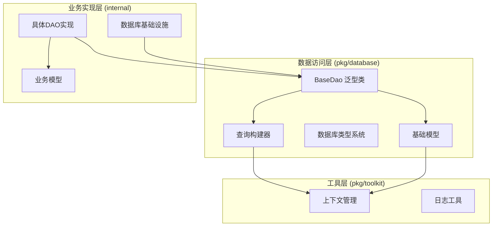
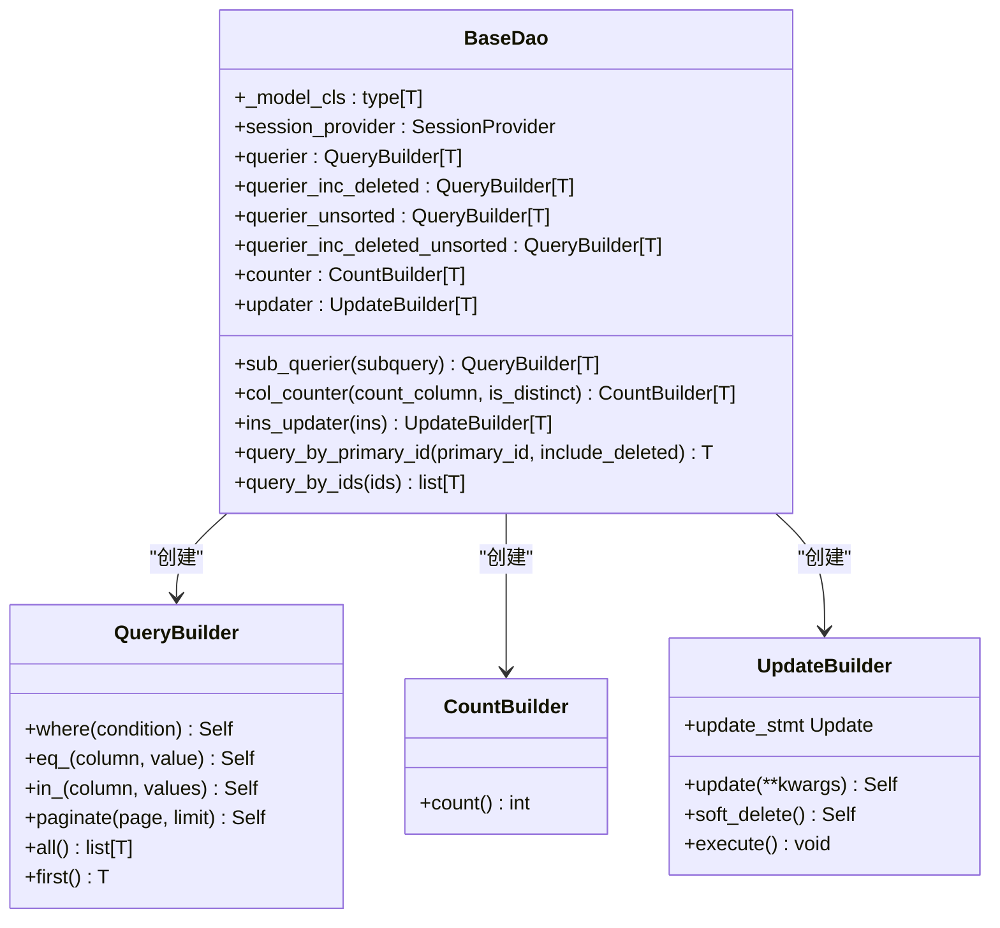
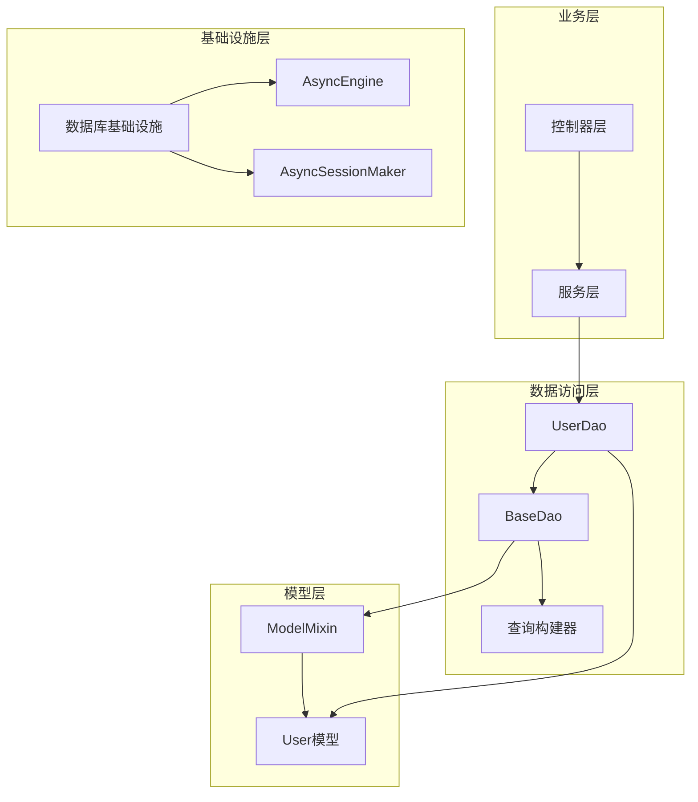
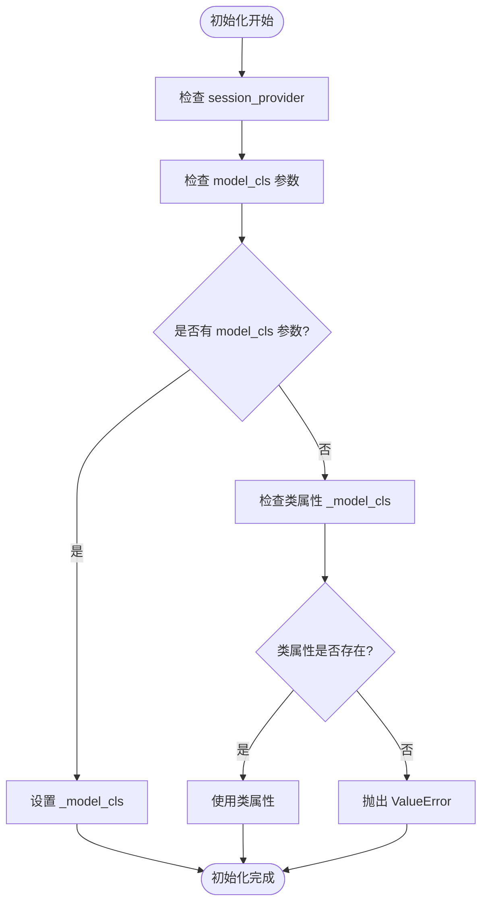
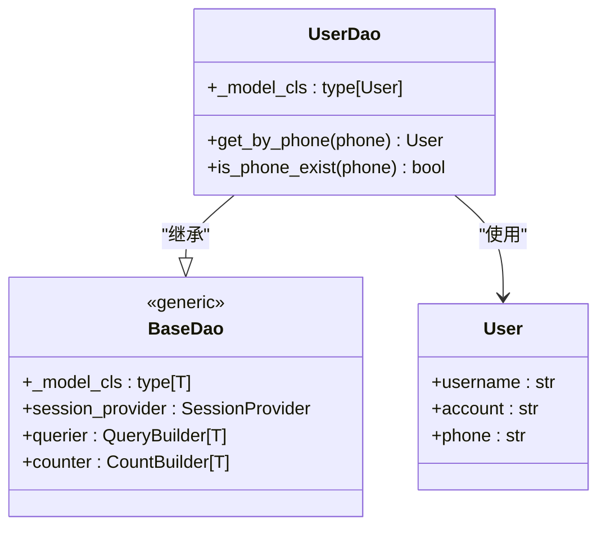
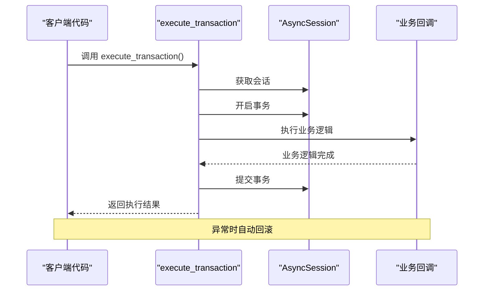
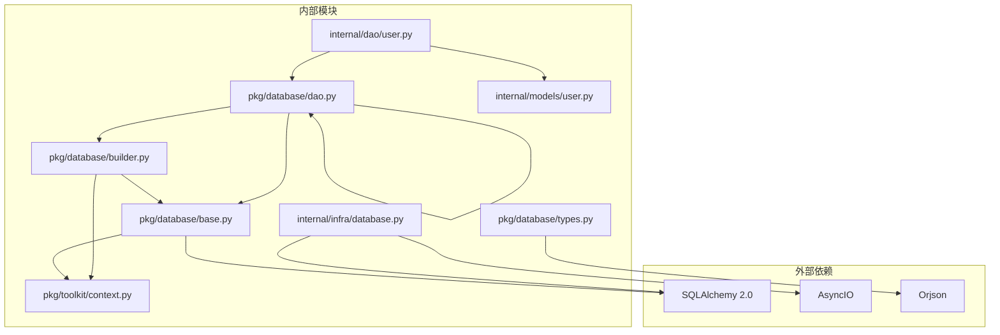

# 通用DAO基类

<cite>
**本文档引用的文件**
- [pkg/database/dao.py](file://pkg/database/dao.py)
- [pkg/database/base.py](file://pkg/database/base.py)
- [pkg/database/builder.py](file://pkg/database/builder.py)
- [pkg/database/types.py](file://pkg/database/types.py)
- [internal/dao/user.py](file://internal/dao/user.py)
- [internal/infra/database.py](file://internal/infra/database.py)
- [internal/models/user.py](file://internal/models/user.py)
- [pkg/toolkit/context.py](file://pkg/toolkit/context.py)
- [tests/orm/test_orm.py](file://tests/orm/test_orm.py)
</cite>

## 目录
1. [简介](#简介)
2. [项目结构](#项目结构)
3. [核心组件](#核心组件)
4. [架构概览](#架构概览)
5. [详细组件分析](#详细组件分析)
6. [依赖关系分析](#依赖关系分析)
7. [性能考虑](#性能考虑)
8. [故障排除指南](#故障排除指南)
9. [结论](#结论)

## 简介

本文档深入解析了FastAPI后端项目中的通用DAO基类设计，重点阐述BaseDao泛型类的设计原理、实现细节和最佳实践。该架构采用类型安全的泛型参数、查询构建器模式和数据库操作封装，提供了完整的数据访问层解决方案。

BaseDao作为所有数据访问对象的基础类，通过泛型约束确保编译时类型安全，结合查询构建器模式实现了流畅的链式API调用。该设计不仅简化了数据库操作，还提供了强大的类型推断和IDE支持。

## 项目结构

该项目采用分层架构设计，DAO层位于`pkg/database/`目录下，包含核心的数据访问抽象和具体实现：



**图表来源**
- [pkg/database/dao.py](file://pkg/database/dao.py#L15-L203)
- [pkg/database/base.py](file://pkg/database/base.py#L48-L364)
- [pkg/database/builder.py](file://pkg/database/builder.py#L18-L273)

**章节来源**
- [pkg/database/dao.py](file://pkg/database/dao.py#L1-L203)
- [pkg/database/base.py](file://pkg/database/base.py#L1-L364)
- [pkg/database/builder.py](file://pkg/database/builder.py#L1-L273)

## 核心组件

### BaseDao 泛型类

BaseDao是整个DAO架构的核心，采用Python 3.12+的泛型语法[T: ModelMixin]，确保类型安全性和编译时检查。

#### 关键特性

1. **类型安全的泛型参数**：通过泛型约束确保DAO只能操作继承自ModelMixin的模型类
2. **灵活的初始化机制**：支持通过构造函数参数或类属性两种方式指定模型类型
3. **查询构建器集成**：提供多个预配置的查询构建器属性
4. **事务处理支持**：内置事务执行器，支持复杂业务逻辑的原子性操作

#### 查询构建器属性详解

BaseDao提供了多种查询构建器属性，每种都有特定的用途和配置：



**图表来源**
- [pkg/database/dao.py](file://pkg/database/dao.py#L15-L91)
- [pkg/database/builder.py](file://pkg/database/builder.py#L111-L162)

**章节来源**
- [pkg/database/dao.py](file://pkg/database/dao.py#L15-L91)

### 查询构建器系统

查询构建器系统由三个核心类组成：BaseBuilder、QueryBuilder、CountBuilder和UpdateBuilder，每个都针对特定的数据库操作类型进行了优化。

#### BaseBuilder 基础功能

BaseBuilder提供了所有构建器共享的基础功能，包括条件构造、排序分组和过滤逻辑：

- **条件操作符**：eq_、ne_、gt_、lt_、ge_、le_、in_、like、is_null、or_
- **排序控制**：distinct_、desc_、asc_
- **过滤机制**：apply_kwargs_filters、_apply_delete_at_is_none

#### QueryBuilder 查询功能

QueryBuilder专门处理SELECT操作，提供了丰富的查询功能：

- **分页支持**：paginate方法实现高效的分页查询
- **结果获取**：all()和first()方法提供不同的查询结果处理
- **软删除过滤**：自动处理软删除记录的过滤逻辑

#### CountBuilder 计数功能

CountBuilder专注于COUNT操作，支持多种计数场景：

- **标准计数**：默认按主键计数
- **去重计数**：支持distinct_参数进行去重统计
- **列级计数**：支持指定特定列进行计数

#### UpdateBuilder 更新功能

UpdateBuilder处理UPDATE操作，提供了智能的更新逻辑：

- **字段验证**：自动验证更新字段的有效性
- **时间戳管理**：自动处理updated_at和deleted_at字段
- **用户标识**：自动设置updater_id字段
- **软删除支持**：内置soft_delete方法

**章节来源**
- [pkg/database/builder.py](file://pkg/database/builder.py#L18-L273)

### 数据库连接管理

项目采用了优雅的数据库连接管理策略，通过SessionProvider抽象实现了连接池管理和生命周期控制。

#### 连接池配置

数据库连接池通过new_async_engine和new_async_session_maker函数进行配置：

- **连接池大小**：pool_size=10，max_overflow=20，pool_timeout=30
- **连接回收**：pool_recycle=1800秒，防止连接过期
- **预检机制**：pool_pre_ping=True，确保连接有效性
- **JSON序列化**：使用orjson进行高性能序列化

#### 会话管理

get_session函数提供了统一的会话获取接口，支持自动回滚和异常处理：

- **自动回滚**：异常时自动回滚事务
- **上下文管理**：支持async with语法
- **flush控制**：可选择是否启用自动flush

**章节来源**
- [pkg/database/base.py](file://pkg/database/base.py#L19-L46)
- [internal/infra/database.py](file://internal/infra/database.py#L85-L111)

## 架构概览

整个DAO架构采用分层设计，从底层的数据库基础设施到上层的业务逻辑，每一层都有明确的职责分工：



**图表来源**
- [internal/dao/user.py](file://internal/dao/user.py#L6-L23)
- [pkg/database/dao.py](file://pkg/database/dao.py#L15-L44)
- [internal/infra/database.py](file://internal/infra/database.py#L26-L56)

## 详细组件分析

### BaseDao 类详细分析

BaseDao类的设计体现了现代Python编程的最佳实践，通过泛型、属性装饰器和链式调用实现了高度的类型安全和易用性。

#### 初始化机制

BaseDao的初始化过程经过精心设计，确保了灵活性和安全性：



**图表来源**
- [pkg/database/dao.py](file://pkg/database/dao.py#L18-L34)

#### 查询构建器属性

BaseDao提供了四个主要的查询构建器属性，每个都有特定的用途：

1. **querier**：默认查询构建器，按updated_at降序排列，过滤软删除记录
2. **querier_inc_deleted**：包含软删除记录的查询构建器
3. **querier_unsorted**：无排序的查询构建器
4. **querier_inc_deleted_unsorted**：包含软删除记录且无排序的查询构建器

#### 计数器属性

BaseDao提供了两个计数器属性，支持不同的计数需求：

1. **counter**：标准计数器，按主键计数
2. **col_counter**：列级计数器，支持指定列和去重选项

#### 更新器属性

BaseDao提供了两个更新器属性：

1. **updater**：基于模型类的更新器
2. **ins_updater**：基于模型实例的更新器

**章节来源**
- [pkg/database/dao.py](file://pkg/database/dao.py#L46-L91)

### 具体DAO实现示例

以UserDao为例，展示了如何继承BaseDao创建特定领域的数据访问对象：

#### UserDao 实现



**图表来源**
- [internal/dao/user.py](file://internal/dao/user.py#L6-L23)
- [internal/models/user.py](file://internal/models/user.py#L7-L13)

#### UserDao 方法实现

UserDao通过继承BaseDao获得了完整的数据访问能力，同时添加了领域特定的方法：

1. **get_by_phone**：通过手机号查询用户，利用querier属性实现类型安全的查询
2. **is_phone_exist**：检查手机号是否存在，使用counter属性进行高效计数

**章节来源**
- [internal/dao/user.py](file://internal/dao/user.py#L6-L23)

### 事务处理机制

项目提供了强大的事务处理能力，通过execute_transaction函数实现了复杂业务逻辑的原子性保证。

#### 事务执行流程



**图表来源**
- [pkg/database/dao.py](file://pkg/database/dao.py#L106-L203)

#### 事务处理特性

1. **自动回滚**：异常发生时自动回滚事务
2. **会话管理**：统一的会话生命周期管理
3. **回调机制**：支持复杂的业务逻辑封装
4. **flush控制**：可配置的自动flush行为

**章节来源**
- [pkg/database/dao.py](file://pkg/database/dao.py#L106-L203)

## 依赖关系分析

项目的依赖关系清晰明确，遵循了单一职责原则和依赖倒置原则：



**图表来源**
- [pkg/database/dao.py](file://pkg/database/dao.py#L1-L12)
- [pkg/database/base.py](file://pkg/database/base.py#L1-L15)
- [pkg/database/builder.py](file://pkg/database/builder.py#L1-L12)

### 依赖注入模式

项目采用了依赖注入的设计模式，通过SessionProvider参数实现了松耦合的架构：

- **SessionProvider**：抽象的会话提供者接口
- **工厂函数**：get_session作为具体的会话提供者实现
- **依赖解耦**：DAO层不直接依赖具体的数据库实现

**章节来源**
- [pkg/database/dao.py](file://pkg/database/dao.py#L18-L25)
- [internal/infra/database.py](file://internal/infra/database.py#L85-L111)

## 性能考虑

项目在设计时充分考虑了性能优化，采用了多种技术和策略来提升数据库操作效率：

### 连接池优化

1. **连接池配置**：合理的pool_size和max_overflow设置
2. **连接回收**：自动连接回收机制防止连接泄漏
3. **预检机制**：pool_pre_ping确保连接有效性

### 查询优化

1. **批量操作**：支持批量插入和批量更新
2. **分页查询**：高效的分页实现
3. **条件优化**：in_方法的空列表检查和去重逻辑

### 内存管理

1. **上下文管理**：自动的资源清理
2. **会话生命周期**：严格的会话管理
3. **事务控制**：精确的事务边界

## 故障排除指南

### 常见问题及解决方案

#### DAO初始化错误

**问题**：ValueError: DAO {name} must define _model_cls or pass it to __init__

**原因**：DAO类没有正确设置_model_cls属性或在初始化时没有传入model_cls参数

**解决方案**：
```python
# 方法1：在类中设置_model_cls
class UserDao(BaseDao[User]):
    _model_cls: type[User] = User

# 方法2：在初始化时传入model_cls
user_dao = UserDao(session_provider=get_session, model_cls=User)
```

#### 会话提供者错误

**问题**：RuntimeError: Database is not initialized. Call init_db() first.

**原因**：数据库连接池未正确初始化

**解决方案**：
```python
# 确保在应用启动时初始化数据库
init_async_db()

# 或者在使用前检查
if _engine is None:
    init_async_db()
```

#### 查询构建器错误

**问题**：ValueError: in_() func values cannot be empty for column {column}

**原因**：向in_方法传入了空列表

**解决方案**：
```python
# 正确的做法
if ids:  # 检查列表是否为空
    results = await dao.querier.in_(Model.id, ids).all()
else:
    results = []  # 返回空结果
```

**章节来源**
- [pkg/database/dao.py](file://pkg/database/dao.py#L33-L34)
- [pkg/database/builder.py](file://pkg/database/builder.py#L74-L75)
- [internal/infra/database.py](file://internal/infra/database.py#L92-L93)

## 结论

通用DAO基类的设计体现了现代Python Web开发的最佳实践，通过类型安全的泛型、优雅的查询构建器模式和完善的事务处理机制，为复杂的数据访问需求提供了强大而灵活的解决方案。

该架构的主要优势包括：

1. **类型安全**：通过泛型确保编译时类型检查
2. **易用性**：流畅的链式API调用
3. **扩展性**：清晰的继承体系支持领域特定的扩展
4. **性能**：优化的连接池和查询策略
5. **可靠性**：完善的异常处理和事务管理

对于开发者而言，继承BaseDao创建特定领域的DAO类是一个简单而强大的模式，既保持了代码的一致性，又提供了足够的灵活性来满足各种业务需求。