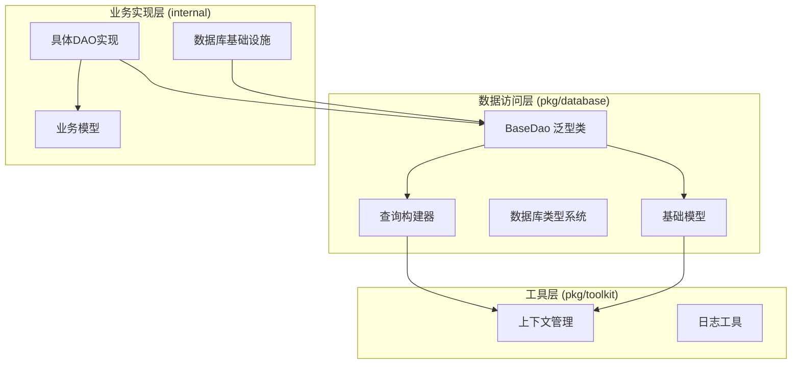
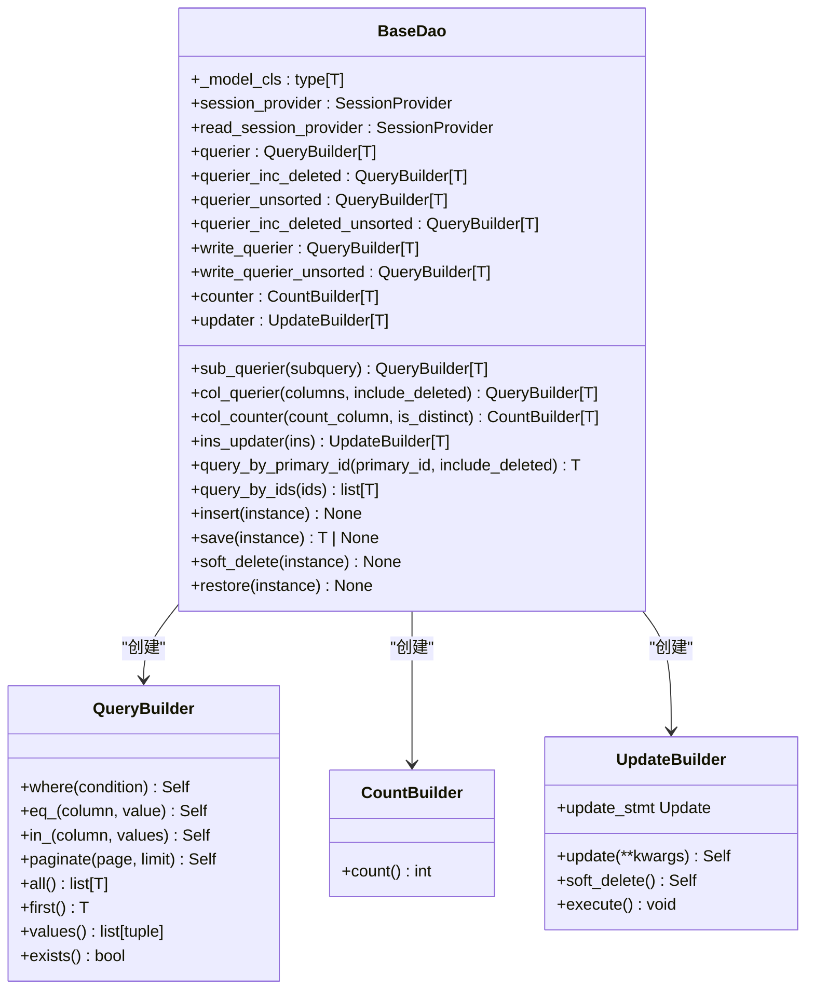
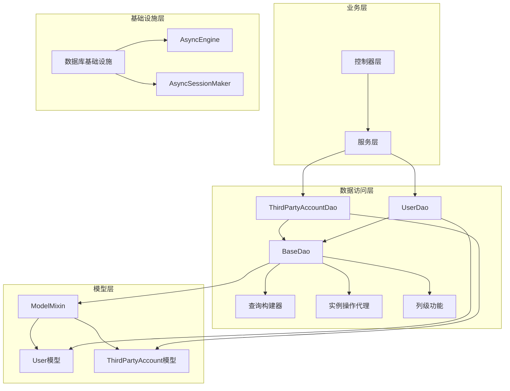
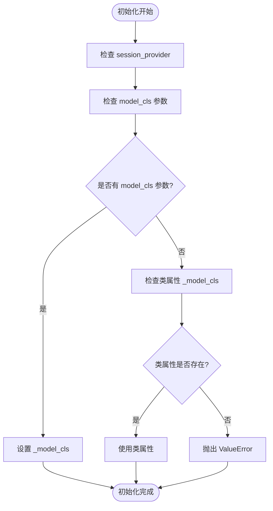
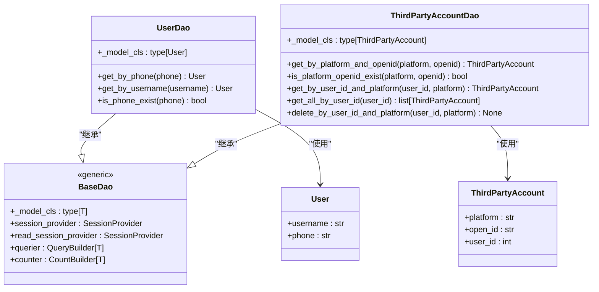
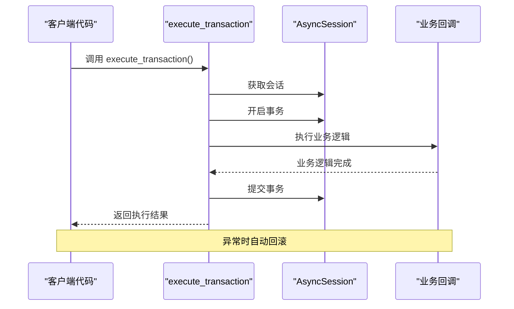
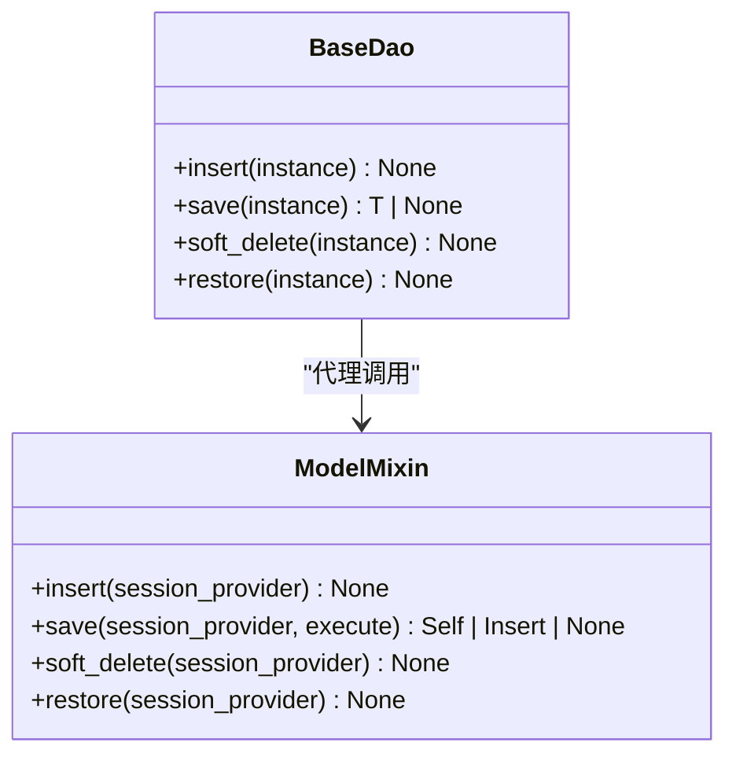
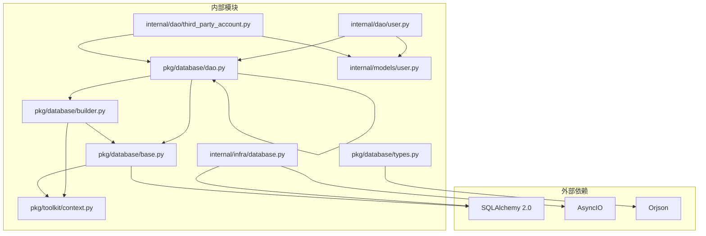

# 通用DAO基类

<cite>
**本文档引用的文件**
- [pkg/database/dao.py](file://pkg/database/dao.py)
- [pkg/database/base.py](file://pkg/database/base.py)
- [pkg/database/builder.py](file://pkg/database/builder.py)
- [pkg/database/types.py](file://pkg/database/types.py)
- [internal/dao/user.py](file://internal/dao/user.py)
- [internal/dao/third_party_account.py](file://internal/dao/third_party_account.py)
- [internal/infra/database.py](file://internal/infra/database.py)
- [internal/models/user.py](file://internal/models/user.py)
- [pkg/toolkit/context.py](file://pkg/toolkit/context.py)
- [tests/orm/test_orm.py](file://tests/orm/test_orm.py)
- [tests/orm/test_orm_json_type.py](file://tests/orm/test_orm_json_type.py)
</cite>

## 更新摘要
**变更内容**
- 新增四个异步代理方法：insert、save、soft_delete、restore，提供便捷的实例操作包装
- 新增列级查询功能：col_querier()和col_counter()方法，支持高效的列级查询和计数
- 新增values()和exists()方法，提升查询灵活性和性能
- 全面的文档字符串注释，显著提升代码可读性和开发者体验
- 增强了实例操作的易用性和一致性
- 更新测试套件以反映新的API使用模式

## 目录
1. [简介](#简介)
2. [项目结构](#项目结构)
3. [核心组件](#核心组件)
4. [架构概览](#架构概览)
5. [详细组件分析](#详细组件分析)
6. [实例操作代理方法](#实例操作代理方法)
7. [列级查询功能](#列级查询功能)
8. [依赖关系分析](#依赖关系分析)
9. [性能考虑](#性能考虑)
10. [故障排除指南](#故障排除指南)
11. [结论](#结论)

## 简介

本文档深入解析了FastAPI后端项目中的通用DAO基类设计，重点阐述BaseDao泛型类的设计原理、实现细节和最佳实践。该架构采用类型安全的泛型参数、查询构建器模式和数据库操作封装，提供了完整的数据访问层解决方案。

BaseDao作为所有数据访问对象的基础类，通过泛型约束确保编译时类型安全，结合查询构建器模式实现了流畅的链式API调用。该设计不仅简化了数据库操作，还提供了强大的类型推断和IDE支持。

**更新** 本次重大更新反映了DAO层的全面增强，新增了列级查询和计数功能，进一步提升了查询的灵活性和性能。同时，新增的实例操作代理方法大幅简化了对象实例的数据库操作，提供了更加直观和一致的API体验。

## 项目结构

该项目采用分层架构设计，DAO层位于`pkg/database/`目录下，包含核心的数据访问抽象和具体实现：


```mermaid
graph TB
subgraph "数据访问层 (pkg/database)"
DAO[BaseDao 泛型类]
Builder[查询构建器]
Types[数据库类型系统]
Base[基础模型]
end
subgraph "业务实现层 (internal)"
Infra[数据库基础设施]
Models[业务模型]
DAOImpl[具体DAO实现]
end
subgraph "工具层 (pkg/toolkit)"
Context[上下文管理]
Logger[日志工具]
end
DAO --> Builder
DAO --> Base
DAOImpl --> DAO
DAOImpl --> Models
Infra --> DAO
Builder --> Context
Base --> Context
```

**图表来源**
- [pkg/database/dao.py](file://pkg/database/dao.py#L15-L329)
- [pkg/database/base.py](file://pkg/database/base.py#L48-L409)
- [pkg/database/builder.py](file://pkg/database/builder.py#L18-L335)

**章节来源**
- [pkg/database/dao.py](file://pkg/database/dao.py#L1-L329)
- [pkg/database/base.py](file://pkg/database/base.py#L1-L409)
- [pkg/database/builder.py](file://pkg/database/builder.py#L1-L335)

## 核心组件

### BaseDao 泛型类

BaseDao是整个DAO架构的核心，采用Python 3.12+的泛型语法[T: ModelMixin]，确保类型安全性和编译时检查。

#### 关键特性

1. **类型安全的泛型参数**：通过泛型约束确保DAO只能操作继承自ModelMixin的模型类
2. **灵活的初始化机制**：支持通过构造函数参数或类属性两种方式指定模型类型
3. **查询构建器集成**：提供多个预配置的查询构建器属性
4. **事务处理支持**：内置事务执行器，支持复杂业务逻辑的原子性操作
5. **列级查询支持**：**新增** col_querier()和col_counter()方法，支持高效的列级查询和计数
6. **实例操作代理**：**新增** 四个异步代理方法，提供便捷的实例操作包装
7. **存在性检查**：**新增** exists()方法，快速判断记录是否存在
8. **元组查询**：**新增** values()方法，返回列查询的元组列表

#### 查询构建器属性详解

BaseDao提供了多种查询构建器属性，每种都有特定的用途和配置：


```mermaid
classDiagram
class BaseDao {
+_model_cls : type[T]
+session_provider : SessionProvider
+read_session_provider : SessionProvider
+querier : QueryBuilder[T]
+querier_inc_deleted : QueryBuilder[T]
+querier_unsorted : QueryBuilder[T]
+querier_inc_deleted_unsorted : QueryBuilder[T]
+write_querier : QueryBuilder[T]
+write_querier_unsorted : QueryBuilder[T]
+counter : CountBuilder[T]
+updater : UpdateBuilder[T]
+sub_querier(subquery) QueryBuilder[T]
+col_querier(columns, include_deleted) QueryBuilder[T]
+col_counter(count_column, is_distinct) CountBuilder[T]
+ins_updater(ins) UpdateBuilder[T]
+query_by_primary_id(primary_id, include_deleted) T
+query_by_ids(ids) list[T]
+insert(instance) None
+save(instance) T | None
+soft_delete(instance) None
+restore(instance) None
}
class QueryBuilder {
+where(condition) Self
+eq_(column, value) Self
+in_(column, values) Self
+paginate(page, limit) Self
+all() list[T]
+first() T
+values() list[tuple]
+exists() bool
}
class CountBuilder {
+count() int
}
class UpdateBuilder {
+update(**kwargs) Self
+soft_delete() Self
+execute() void
+update_stmt Update
}
BaseDao --> QueryBuilder : "创建"
BaseDao --> CountBuilder : "创建"
BaseDao --> UpdateBuilder : "创建"
```

**图表来源**
- [pkg/database/dao.py](file://pkg/database/dao.py#L15-L229)
- [pkg/database/builder.py](file://pkg/database/builder.py#L105-L209)

**章节来源**
- [pkg/database/dao.py](file://pkg/database/dao.py#L15-L229)

### 查询构建器系统

查询构建器系统由三个核心类组成：BaseBuilder、QueryBuilder、CountBuilder和UpdateBuilder，每个都针对特定的数据库操作类型进行了优化。

#### BaseBuilder 基础功能

BaseBuilder提供了所有构建器共享的基础功能，包括条件构造、排序分组和过滤逻辑：

- **条件操作符**：eq_、ne_、gt_、lt_、ge_、le_、in_、like、is_null、or_
- **排序控制**：distinct_、desc_、asc_
- **过滤机制**：apply_kwargs_filters、_apply_delete_at_is_none

#### QueryBuilder 查询功能

QueryBuilder专门处理SELECT操作，提供了丰富的查询功能：

- **分页支持**：paginate方法实现高效的分页查询
- **结果获取**：all()和first()方法提供不同的查询结果处理
- **软删除过滤**：自动处理软删除记录的过滤逻辑
- **列级查询**：**新增** values()方法返回元组列表，支持高效的数据提取
- **存在性检查**：**新增** exists()方法快速判断记录是否存在

#### CountBuilder 计数功能

CountBuilder专注于COUNT操作，支持多种计数场景：

- **标准计数**：默认按主键计数
- **去重计数**：支持distinct_参数进行去重统计
- **列级计数**：支持指定特定列进行计数
- **自定义SQL**：支持通过custom_stmt参数传入自定义COUNT语句

#### UpdateBuilder 更新功能

UpdateBuilder处理UPDATE操作，提供了智能的更新逻辑：

- **字段验证**：自动验证更新字段的有效性
- **时间戳管理**：自动处理updated_at和deleted_at字段
- **用户标识**：自动设置updater_id字段
- **软删除支持**：内置soft_delete方法

**章节来源**
- [pkg/database/builder.py](file://pkg/database/builder.py#L18-L335)

### 数据库连接管理

项目采用了优雅的数据库连接管理策略，通过SessionProvider抽象实现了连接池管理和生命周期控制。

#### 连接池配置

数据库连接池通过new_async_engine和new_async_session_maker函数进行配置：

- **连接池大小**：pool_size=10，max_overflow=20，pool_timeout=30
- **连接回收**：pool_recycle=1800秒，防止连接过期
- **预检机制**：pool_pre_ping=True，确保连接有效性
- **JSON序列化**：使用orjson进行高性能序列化

#### 会话管理

get_session函数提供了统一的会话获取接口，支持自动回滚和异常处理：

- **自动回滚**：异常时自动回滚事务
- **上下文管理**：支持async with语法
- **flush控制**：可选择是否启用自动flush

**章节来源**
- [pkg/database/base.py](file://pkg/database/base.py#L19-L46)
- [internal/infra/database.py](file://internal/infra/database.py#L85-L111)

## 架构概览

整个DAO架构采用分层设计，从底层的数据库基础设施到上层的业务逻辑，每一层都有明确的职责分工：


```mermaid
graph TB
subgraph "业务层"
Service[服务层]
Controller[控制器层]
end
subgraph "数据访问层"
UserDao[UserDao]
ThirdPartyAccountDao[ThirdPartyAccountDao]
BaseDao[BaseDao]
Builders[查询构建器]
InstanceOps[实例操作代理]
ColFeatures[列级功能]
end
subgraph "基础设施层"
DatabaseInfra[数据库基础设施]
Engine[AsyncEngine]
SessionMaker[AsyncSessionMaker]
end
subgraph "模型层"
UserModel[User模型]
ThirdPartyModel[ThirdPartyAccount模型]
ModelMixin[ModelMixin]
end
Service --> UserDao
Service --> ThirdPartyAccountDao
Controller --> Service
UserDao --> BaseDao
ThirdPartyAccountDao --> BaseDao
BaseDao --> Builders
BaseDao --> InstanceOps
BaseDao --> ColFeatures
BaseDao --> ModelMixin
DatabaseInfra --> Engine
DatabaseInfra --> SessionMaker
UserDao --> UserModel
ThirdPartyAccountDao --> ThirdPartyModel
ModelMixin --> UserModel
ModelMixin --> ThirdPartyModel
```

**图表来源**
- [internal/dao/user.py](file://internal/dao/user.py#L6-L31)
- [internal/dao/third_party_account.py](file://internal/dao/third_party_account.py#L6-L44)
- [pkg/database/dao.py](file://pkg/database/dao.py#L15-L44)
- [internal/infra/database.py](file://internal/infra/database.py#L26-L56)

## 详细组件分析

### BaseDao 类详细分析

BaseDao类的设计体现了现代Python编程的最佳实践，通过泛型、属性装饰器和链式调用实现了高度的类型安全和易用性。

#### 初始化机制

BaseDao的初始化过程经过精心设计，确保了灵活性和安全性：


```mermaid
flowchart TD
Start([初始化开始]) --> CheckSession["检查 session_provider"]
CheckSession --> CheckModelCls["检查 model_cls 参数"]
CheckModelCls --> HasModelCls{"是否有 model_cls 参数?"}
HasModelCls --> |是| SetModelCls["设置 _model_cls"]
HasModelCls --> |否| CheckClassAttr["检查类属性 _model_cls"]
CheckClassAttr --> HasClassAttr{"类属性是否存在?"}
HasClassAttr --> |是| UseClassAttr["使用类属性"]
HasClassAttr --> |否| RaiseError["抛出 ValueError"]
SetModelCls --> End([初始化完成])
UseClassAttr --> End
RaiseError --> End
```

**图表来源**
- [pkg/database/dao.py](file://pkg/database/dao.py#L27-L51)

#### 查询构建器属性

BaseDao提供了七个主要的查询构建器属性，每个都有特定的用途：

1. **querier**：默认查询构建器，按updated_at降序排列，过滤软删除记录
2. **querier_inc_deleted**：包含软删除记录的查询构建器
3. **querier_unsorted**：无排序的查询构建器
4. **querier_inc_deleted_unsorted**：包含软删除记录且无排序的查询构建器
5. **write_querier**：强制从主库查询（用于写后读一致性场景）
6. **write_querier_unsorted**：强制从主库查询，不排序
7. **col_querier**：**新增** 支持列级查询的查询构建器

#### 计数器属性

BaseDao提供了三个计数器属性，支持不同的计数需求：

1. **counter**：标准计数器，按主键计数
2. **col_counter**：**新增** 列级计数器，支持指定列和去重选项
3. **sub_querier**：**新增** 支持子查询的查询构建器

#### 更新器属性

BaseDao提供了两个更新器属性：

1. **updater**：基于模型类的更新器
2. **ins_updater**：基于模型实例的更新器

**章节来源**
- [pkg/database/dao.py](file://pkg/database/dao.py#L74-L229)

### 具体DAO实现示例

以UserDao和ThirdPartyAccountDao为例，展示了如何继承BaseDao创建特定领域的数据访问对象：

#### UserDao 实现


```mermaid
classDiagram
class UserDao {
+_model_cls : type[User]
+get_by_phone(phone) User
+get_by_username(username) User
+is_phone_exist(phone) bool
}
class ThirdPartyAccountDao {
+_model_cls : type[ThirdPartyAccount]
+get_by_platform_and_openid(platform, openid) ThirdPartyAccount
+is_platform_openid_exist(platform, openid) bool
+get_by_user_id_and_platform(user_id, platform) ThirdPartyAccount
+get_all_by_user_id(user_id) list[ThirdPartyAccount]
+delete_by_user_id_and_platform(user_id, platform) None
}
class BaseDao {
<<generic>>
+_model_cls : type[T]
+session_provider : SessionProvider
+read_session_provider : SessionProvider
+querier : QueryBuilder[T]
+counter : CountBuilder[T]
}
class User {
+username : str
+phone : str
}
class ThirdPartyAccount {
+platform : str
+open_id : str
+user_id : int
}
UserDao --|> BaseDao : "继承"
ThirdPartyAccountDao --|> BaseDao : "继承"
UserDao --> User : "使用"
ThirdPartyAccountDao --> ThirdPartyAccount : "使用"
```

**图表来源**
- [internal/dao/user.py](file://internal/dao/user.py#L6-L31)
- [internal/dao/third_party_account.py](file://internal/dao/third_party_account.py#L6-L44)
- [internal/models/user.py](file://internal/models/user.py#L7-L13)

#### UserDao 方法实现

UserDao通过继承BaseDao获得了完整的数据访问能力，同时添加了领域特定的方法：

1. **get_by_phone**：通过手机号查询用户，利用querier属性实现类型安全的查询
2. **get_by_username**：通过用户名查询用户
3. **is_phone_exist**：检查手机号是否存在，使用first()方法比count()更高效

#### ThirdPartyAccountDao 方法实现

ThirdPartyAccountDao展示了更多查询构建器的使用场景：

1. **get_by_platform_and_openid**：复合条件查询
2. **is_platform_openid_exist**：存在性检查
3. **get_by_user_id_and_platform**：多条件查询
4. **get_all_by_user_id**：批量查询
5. **delete_by_user_id_and_platform**：软删除操作

**章节来源**
- [internal/dao/user.py](file://internal/dao/user.py#L6-L31)
- [internal/dao/third_party_account.py](file://internal/dao/third_party_account.py#L6-L44)

### 事务处理机制

项目提供了强大的事务处理能力，通过execute_transaction函数实现了复杂业务逻辑的原子性保证。

#### 事务执行流程


```mermaid
sequenceDiagram
participant Client as "客户端代码"
participant Executor as "execute_transaction"
participant Session as "AsyncSession"
participant Callback as "业务回调"
Client->>Executor : 调用 execute_transaction()
Executor->>Session : 获取会话
Executor->>Session : 开启事务
Executor->>Callback : 执行业务逻辑
Callback-->>Executor : 业务逻辑完成
Executor->>Session : 提交事务
Executor-->>Client : 返回执行结果
Note over Client,Callback : 异常时自动回滚
```

**图表来源**
- [pkg/database/dao.py](file://pkg/database/dao.py#L232-L329)

#### 事务处理特性

1. **自动回滚**：异常发生时自动回滚事务
2. **会话管理**：统一的会话生命周期管理
3. **回调机制**：支持复杂的业务逻辑封装
4. **flush控制**：可配置的自动flush行为

**章节来源**
- [pkg/database/dao.py](file://pkg/database/dao.py#L232-L329)

## 实例操作代理方法

**新增** BaseDao类新增了四个异步代理方法，这些方法作为实例操作的便捷包装，自动注入会话提供者，消除了开发者手动传递会话提供者的需要。

### 方法概述


```mermaid
classDiagram
class BaseDao {
+insert(instance) None
+save(instance) T | None
+soft_delete(instance) None
+restore(instance) None
}
class ModelMixin {
+insert(session_provider) None
+save(session_provider, execute) Self | Insert | None
+soft_delete(session_provider) None
+restore(session_provider) None
}
BaseDao --> ModelMixin : "代理调用"
```

**图表来源**
- [pkg/database/dao.py](file://pkg/database/dao.py#L206-L229)
- [pkg/database/base.py](file://pkg/database/base.py#L155-L260)

### insert 方法

**功能**：插入新实例到数据库

**特点**：
- 自动注入会话提供者（self._session_provider）
- 简化调用：无需手动传递会话提供者
- 类型安全：确保只接受正确的模型实例类型

**使用示例**：
```python
# 传统方式
await user.insert(db_session)

# 新增的便捷方式
await user_dao.insert(user_instance)
```

### save 方法

**功能**：保存实例到数据库，支持新对象插入和已存在对象更新

**特点**：
- 自动注入会话提供者
- 智能判断新对象或已存在对象
- 返回类型：已存在对象返回更新后的实例，新对象返回None

**使用示例**：
```python
# 传统方式
result = await user.save(db_session)
# 需要检查返回值类型

# 新增的便捷方式
result = await user_dao.save(user_instance)
# 已存在对象返回更新后的实例，新对象返回None
```

### soft_delete 方法

**功能**：对实例执行软删除操作

**特点**：
- 自动注入会话提供者
- 基于模型的软删除逻辑
- 支持软删除字段的自动设置

**使用示例**：
```python
# 传统方式
await user.soft_delete(db_session)

# 新增的便捷方式
await user_dao.soft_delete(user_instance)
```

### restore 方法

**功能**：恢复已删除的实例

**特点**：
- 自动注入会话提供者
- 恢复软删除状态
- 自动更新相关的时间戳字段

**使用示例**：
```python
# 传统方式
await user.restore(db_session)

# 新增的便捷方式
await user_dao.restore(user_instance)
```

### 优势和改进

1. **简化API调用**：开发者无需记住会话提供者的传递
2. **类型安全**：保持泛型约束，确保类型正确性
3. **一致性**：与ModelMixin的实例方法保持一致的API风格
4. **易用性**：减少样板代码，提高开发效率

**章节来源**
- [pkg/database/dao.py](file://pkg/database/dao.py#L206-L229)
- [pkg/database/base.py](file://pkg/database/base.py#L155-L260)

## 列级查询功能

**新增** BaseDao类新增了列级查询功能，通过col_querier()和col_counter()方法提供了更精确的查询控制，显著提升了查询性能和灵活性。

### col_querier 方法

**功能**：创建只查询指定列的查询器

**特点**：
- 支持单列或多列查询
- 自动注入会话提供者
- 可选择是否包含已删除记录
- 返回元组列表，减少数据传输

**使用示例**：
```python
# 只查询 id 列
ids = await dao.col_querier(Model.id).eq_(Model.org_id, 1).values()
# 返回：[(1,), (2,), (3,)]

# 查询多列
rows = await dao.col_querier(Model.id, Model.name).eq_(Model.org_id, 1).values()
# 返回：[(1, "Alice"), (2, "Bob")]
```

### col_counter 方法

**功能**：创建统计指定列的计数器

**特点**：
- 支持指定要统计的列
- 支持去重统计（COUNT DISTINCT）
- 自动注入会话提供者
- 支持条件过滤

**使用示例**：
```python
# 统计部门数量（去重）
dept_count = await dao.col_counter(Model.dept_id, is_distinct=True).eq_(Model.org_id, 1).count()

# 统计活跃用户数
active_count = await dao.col_counter(Model.id).eq_(Model.status, "active").count()
```

### values 方法

**功能**：返回列查询的元组列表

**特点**：
- 专为col_querier()场景设计
- 单列查询返回单元素元组列表
- 多列查询返回多元素元组列表
- 高效的数据提取方式

**使用示例**：
```python
# 单列查询
ids = await dao.col_querier(Model.id).eq_(Model.org_id, 1).values()

# 多列查询
rows = await dao.col_querier(Model.id, Model.name).eq_(...).values()
```

### exists 方法

**功能**：检查是否存在匹配的记录

**特点**：
- 快速判断记录是否存在
- 比count()更高效
- 返回布尔值

**使用示例**：
```python
has_active = await dao.querier.eq_(Model.status, "active").exists()
```

### 性能优势

1. **减少数据传输**：只查询必要的列，降低网络开销
2. **提高查询速度**：缩小结果集大小，提升查询性能
3. **内存优化**：元组列表比完整对象更节省内存
4. **索引友好**：只查询索引列时性能更好

**章节来源**
- [pkg/database/dao.py](file://pkg/database/dao.py#L81-L183)
- [pkg/database/builder.py](file://pkg/database/builder.py#L172-L208)

## 依赖关系分析

项目的依赖关系清晰明确，遵循了单一职责原则和依赖倒置原则：


```mermaid
graph TB
subgraph "外部依赖"
SQLAlchemy[SQLAlchemy 2.0]
AsyncIO[AsyncIO]
Orjson[Orjson]
end
subgraph "内部模块"
BaseDAO[pkg/database/dao.py]
BaseModel[pkg/database/base.py]
QueryBuilder[pkg/database/builder.py]
JSONTypes[pkg/database/types.py]
Context[pkg/toolkit/context.py]
UserDAO[internal/dao/user.py]
ThirdPartyDAO[internal/dao/third_party_account.py]
UserModel[internal/models/user.py]
DBInfra[internal/infra/database.py]
end
BaseDAO --> BaseDAO
BaseDAO --> QueryBuilder
BaseDAO --> BaseModel
QueryBuilder --> BaseModel
QueryBuilder --> Context
JSONTypes --> Orjson
UserDAO --> BaseDAO
UserDAO --> UserModel
ThirdPartyDAO --> BaseDAO
ThirdPartyDAO --> UserModel
DBInfra --> SQLAlchemy
DBInfra --> AsyncIO
BaseModel --> SQLAlchemy
BaseModel --> Context
```

**图表来源**
- [pkg/database/dao.py](file://pkg/database/dao.py#L1-L12)
- [pkg/database/base.py](file://pkg/database/base.py#L1-L15)
- [pkg/database/builder.py](file://pkg/database/builder.py#L1-L12)

### 依赖注入模式

项目采用了依赖注入的设计模式，通过SessionProvider参数实现了松耦合的架构：

- **SessionProvider**：抽象的会话提供者接口
- **工厂函数**：get_session作为具体的会话提供者实现
- **依赖解耦**：DAO层不直接依赖具体的数据库实现

**章节来源**
- [pkg/database/dao.py](file://pkg/database/dao.py#L27-L33)
- [internal/infra/database.py](file://internal/infra/database.py#L85-L111)

## 性能考虑

项目在设计时充分考虑了性能优化，采用了多种技术和策略来提升数据库操作效率：

### 连接池优化

1. **连接池配置**：合理的pool_size和max_overflow设置
2. **连接回收**：自动连接回收机制防止连接泄漏
3. **预检机制**：pool_pre_ping确保连接有效性

### 查询优化

1. **批量操作**：支持批量插入和批量更新
2. **分页查询**：高效的分页实现
3. **条件优化**：in_方法的空列表检查和去重逻辑
4. **列级查询**：**新增** 的col_querier()支持只查询必要列，减少数据传输
5. **存在性检查**：**新增** exists()方法比count()更高效

### 内存管理

1. **上下文管理**：自动的资源清理
2. **会话生命周期**：严格的会话管理
3. **事务控制**：精确的事务边界

### 实例操作优化

**新增** 实例操作代理方法的性能优势：

1. **减少参数传递**：自动注入会话提供者，避免重复参数传递
2. **类型缓存**：利用泛型缓存，减少类型检查开销
3. **方法调用优化**：减少中间层调用栈深度

### 列级查询优化

**新增** 列级查询功能的性能优势：

1. **数据传输优化**：只查询必要列，减少网络开销
2. **内存使用优化**：元组列表比完整对象更节省内存
3. **索引利用优化**：查询索引列时性能更好
4. **批量处理优化**：values()方法支持高效的批量数据提取

## 故障排除指南

### 常见问题及解决方案

#### DAO初始化错误

**问题**：ValueError: DAO {name} must define _model_cls or pass it to __init__

**原因**：DAO类没有正确设置_model_cls属性或在初始化时没有传入model_cls参数

**解决方案**：
```python
# 方法1：在类中设置_model_cls
class UserDao(BaseDao[User]):
    _model_cls: type[User] = User

# 方法2：在初始化时传入model_cls
user_dao = UserDao(session_provider=get_session, model_cls=User)
```

#### 会话提供者错误

**问题**：RuntimeError: Database is not initialized. Call init_db() first.

**原因**：数据库连接池未正确初始化

**解决方案**：
```python
# 确保在应用启动时初始化数据库
init_async_db()

# 或者在使用前检查
if _engine is None:
    init_async_db()
```

#### 查询构建器错误

**问题**：ValueError: in_() func values cannot be empty for column {column}

**原因**：向in_方法传入了空列表

**解决方案**：
```python
# 正确的做法
if ids:  # 检查列表是否为空
    results = await dao.querier.in_(Model.id, ids).all()
else:
    results = []  # 返回空结果
```

#### 列级查询错误

**问题**：TypeError: col_querier() missing required argument 'columns'

**原因**：调用col_querier()时没有传入任何列参数

**解决方案**：
```python
# 正确的做法
ids = await dao.col_querier(Model.id).eq_(Model.org_id, 1).values()
# 或者
rows = await dao.col_querier(Model.id, Model.name).eq_(...).values()
```

#### 实例操作代理方法错误

**问题**：TypeError: insert() missing 1 required positional argument: 'instance'

**原因**：调用insert方法时没有传入实例参数

**解决方案**：
```python
# 正确的做法
await user_dao.insert(user_instance)
# 而不是
await user_dao.insert()
```

#### values方法错误

**问题**：TypeError: 'NoneType' object is not subscriptable

**原因**：调用values()方法时没有传入任何列参数给col_querier()

**解决方案**：
```python
# 正确的做法
ids = await dao.col_querier(Model.id).eq_(Model.org_id, 1).values()
# 而不是
# ids = await dao.col_querier().eq_(Model.org_id, 1).values()  # 错误！
```

**章节来源**
- [pkg/database/dao.py](file://pkg/database/dao.py#L33-L34)
- [pkg/database/builder.py](file://pkg/database/builder.py#L74-L75)
- [internal/infra/database.py](file://internal/infra/database.py#L92-L93)

## 结论

通用DAO基类的设计体现了现代Python Web开发的最佳实践，通过类型安全的泛型、优雅的查询构建器模式和完善的事务处理机制，为复杂的数据访问需求提供了强大而灵活的解决方案。

**更新** 本次重大增强进一步提升了DAO层的功能性和性能：

1. **类型安全**：通过泛型确保编译时类型检查
2. **易用性**：流畅的链式API调用，**新增**的列级查询功能和实例操作代理方法
3. **扩展性**：清晰的继承体系支持领域特定的扩展
4. **性能**：优化的连接池、查询策略、**新增**的列级查询功能和实例操作优化
5. **可靠性**：完善的异常处理和事务管理

**新增** 的col_querier()、col_counter()、values()和exists()方法显著提升了查询的灵活性和效率，特别是在大数据量场景下的性能表现。这些增强功能使得开发者能够更精确地控制查询范围，减少不必要的数据传输，提高应用的整体性能。

**新增** 实例操作代理方法（insert、save、soft_delete、restore）大幅简化了对象实例的数据库操作，提供了更加直观和一致的API体验。这些方法自动注入会话提供者，消除了开发者手动传递会话提供者的需要，减少了样板代码，提高了开发效率。

**新增** 的全面文档字符串注释显著提升了代码可读性和开发者体验，每个新功能都配有详细的使用示例和最佳实践指导。

对于开发者而言，继承BaseDao创建特定领域的DAO类是一个简单而强大的模式，既保持了代码的一致性，又提供了足够的灵活性来满足各种业务需求。新的查询功能和实例操作代理方法为复杂的数据访问场景提供了更好的解决方案，包括高效的列级数据提取、精确的存在性检查、灵活的计数统计和便捷的实例操作。

这些增强功能共同构成了一个现代化、高性能、易用性强的数据访问层解决方案，为FastAPI后端项目提供了坚实的技术基础。