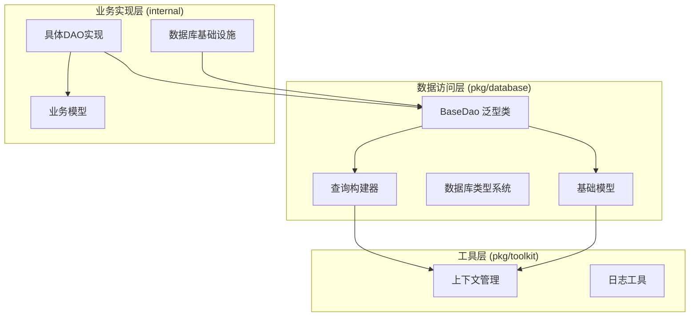
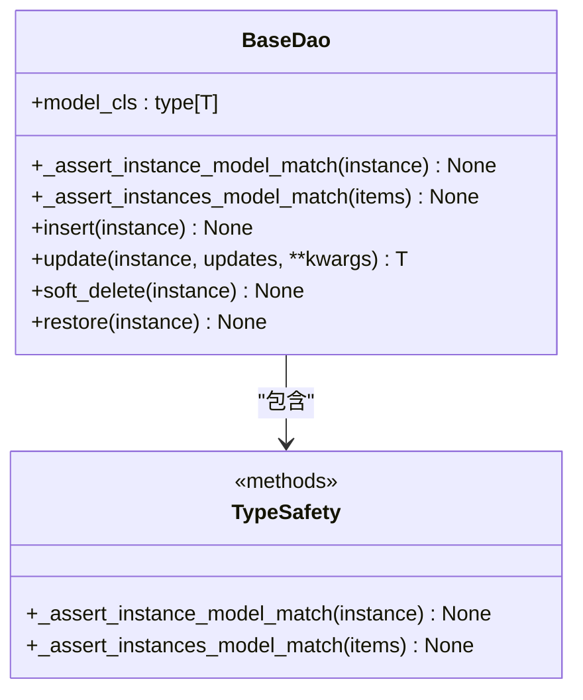
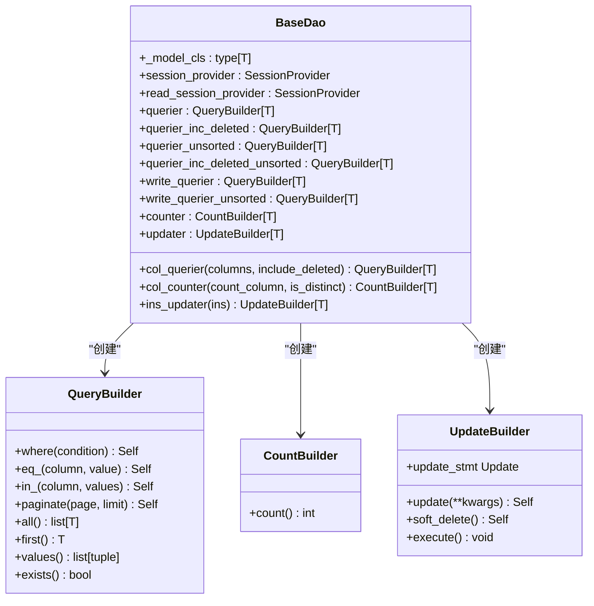
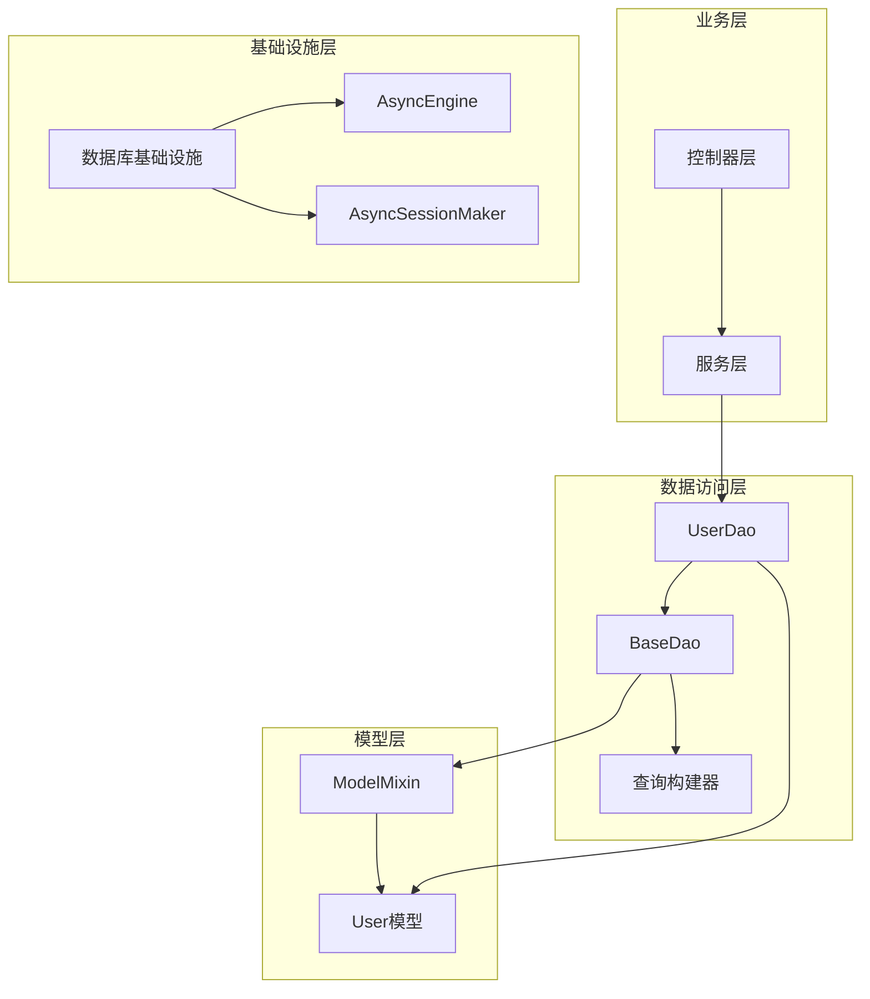
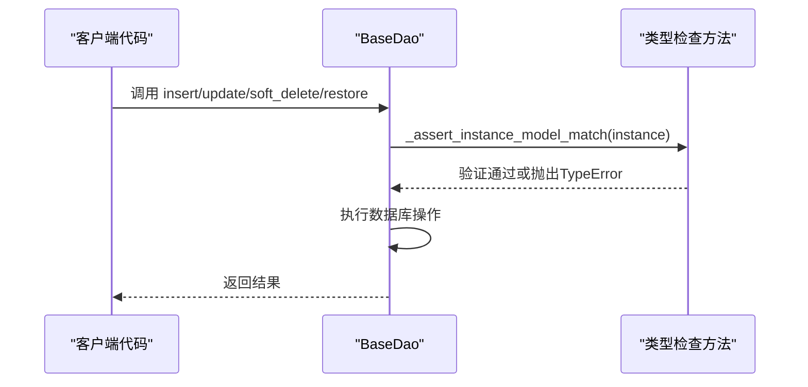
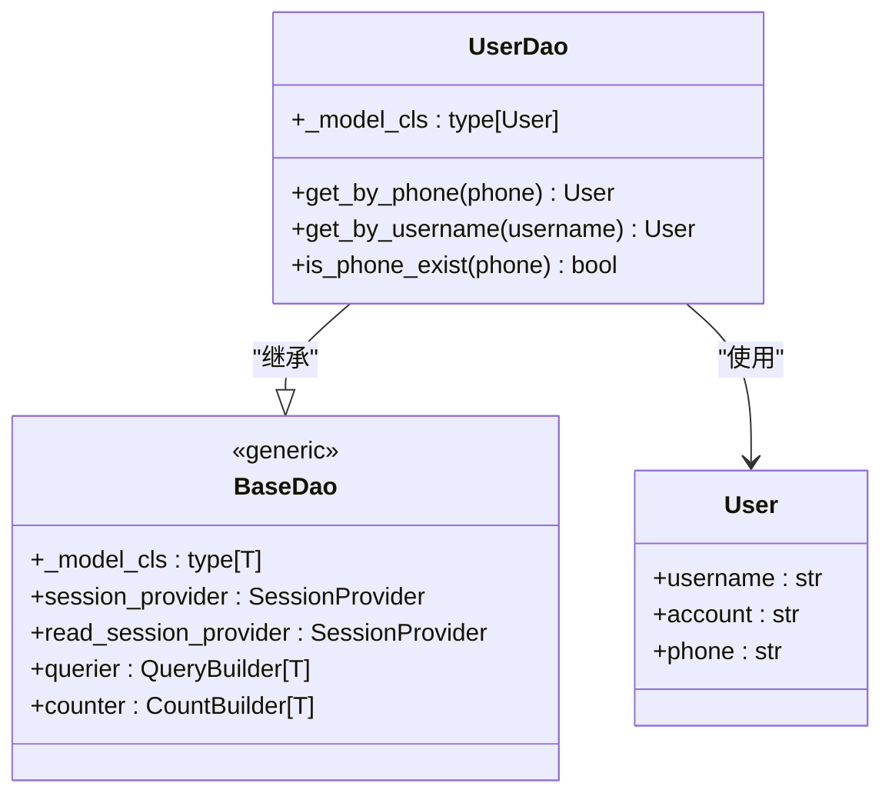
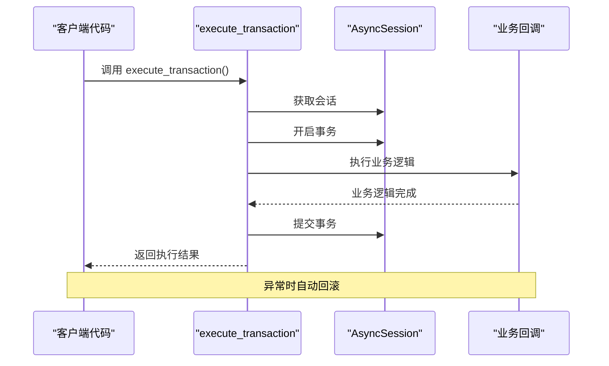
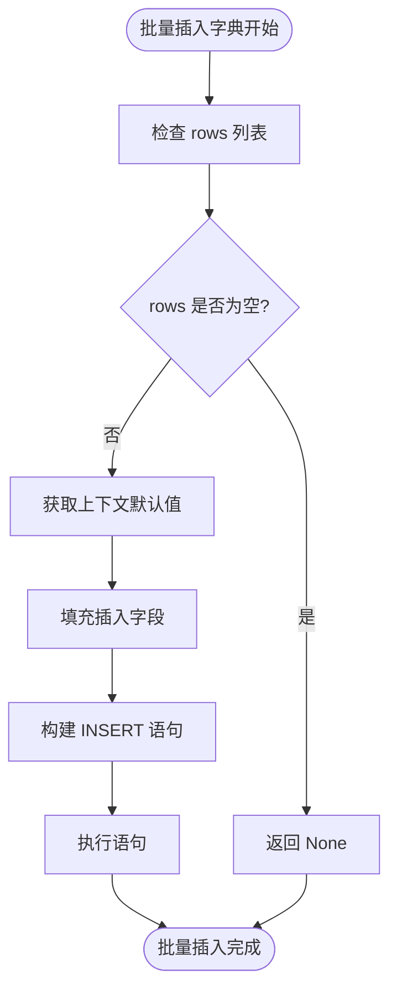
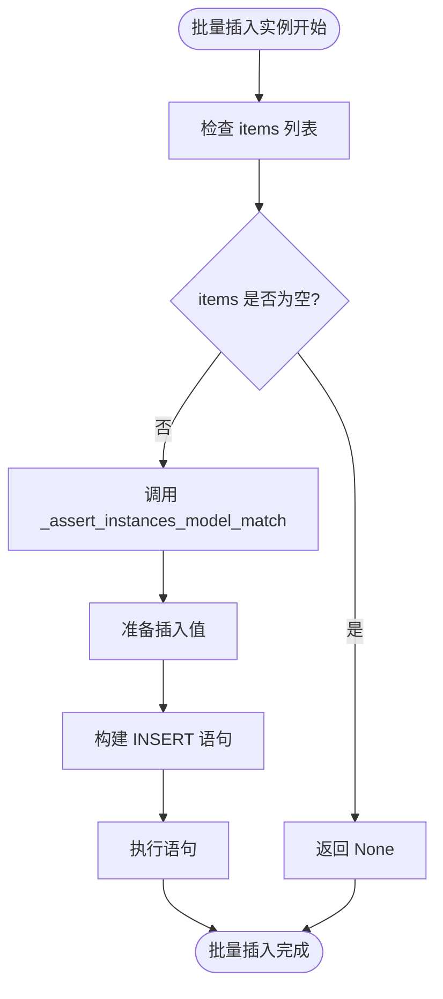
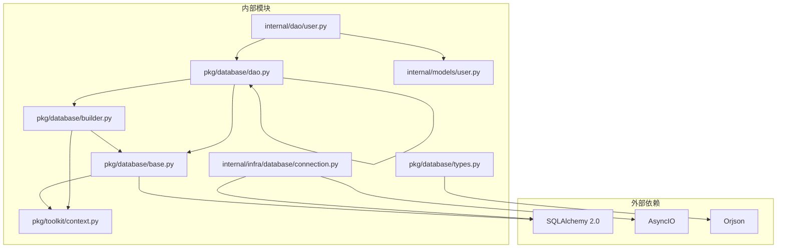

# 通用DAO基类

<cite>
**本文档引用的文件**
- [pkg/database/dao.py](file://pkg/database/dao.py)
- [pkg/database/base.py](file://pkg/database/base.py)
- [pkg/database/builder.py](file://pkg/database/builder.py)
- [pkg/database/types.py](file://pkg/database/types.py)
- [internal/dao/user.py](file://internal/dao/user.py)
- [internal/infra/database/connection.py](file://internal/infra/database/connection.py)
- [internal/models/user.py](file://internal/models/user.py)
- [pkg/toolkit/context.py](file://pkg/toolkit/context.py)
- [tests/orm/test_orm.py](file://tests/orm/test_orm.py)
</cite>

## 更新摘要
**变更内容**
- 新增类型安全检查方法（_assert_instance_model_match、_assert_instances_model_match）
- 增强的查询构建器属性（querier_inc_deleted、querier_unsorted、querier_inc_deleted_unsorted、col_querier）
- 改进的实例操作方法（insert、update、soft_delete、restore）的类型安全
- 批量操作的增强（build_insert_rows_stmt、insert_rows、build_insert_instances_stmt、insert_instances）

## 目录
1. [简介](#简介)
2. [项目结构](#项目结构)
3. [核心组件](#核心组件)
4. [架构概览](#架构概览)
5. [详细组件分析](#详细组件分析)
6. [依赖关系分析](#依赖关系分析)
7. [性能考虑](#性能考虑)
8. [故障排除指南](#故障排除指南)
9. [结论](#结论)

## 简介

本文档深入解析了FastAPI后端项目中的通用DAO基类设计，重点阐述BaseDao泛型类的设计原理、实现细节和最佳实践。该架构采用类型安全的泛型参数、查询构建器模式和数据库操作封装，提供了完整的数据访问层解决方案。

**更新** 基于最新的代码分析，BaseDao类在类型安全和开发者体验方面得到了显著增强，特别是在泛型约束、会话管理和事务处理方面的改进。新增的类型安全检查方法确保了实例操作的正确性，增强了的查询构建器属性提供了更灵活的查询能力。

BaseDao作为所有数据访问对象的基础类，通过泛型约束确保编译时类型安全，结合查询构建器模式实现了流畅的链式API调用。该设计不仅简化了数据库操作，还提供了强大的类型推断和IDE支持。

## 项目结构

该项目采用分层架构设计，DAO层位于`pkg/database/`目录下，包含核心的数据访问抽象和具体实现：


```mermaid
graph TB
subgraph "数据访问层 (pkg/database)"
DAO[BaseDao 泛型类]
Builder[查询构建器]
Types[数据库类型系统]
Base[基础模型]
end
subgraph "业务实现层 (internal)"
Infra[数据库基础设施]
Models[业务模型]
DAOImpl[具体DAO实现]
end
subgraph "工具层 (pkg/toolkit)"
Context[上下文管理]
Logger[日志工具]
end
DAO --> Builder
DAO --> Base
DAOImpl --> DAO
DAOImpl --> Models
Infra --> DAO
Builder --> Context
Base --> Context
```

**图表来源**
- [pkg/database/dao.py:15-456](file://pkg/database/dao.py#L15-L456)
- [pkg/database/base.py:48-309](file://pkg/database/base.py#L48-L309)
- [pkg/database/builder.py:18-351](file://pkg/database/builder.py#L18-L351)

**章节来源**
- [pkg/database/dao.py:1-456](file://pkg/database/dao.py#L1-L456)
- [pkg/database/base.py:1-309](file://pkg/database/base.py#L1-L309)
- [pkg/database/builder.py:1-351](file://pkg/database/builder.py#L1-L351)

## 核心组件

### BaseDao 泛型类

BaseDao是整个DAO架构的核心，采用Python 3.12+的泛型语法[T: ModelMixin]，确保类型安全性和编译时检查。

**更新** 新增了关于泛型约束和类型安全检查方法的详细说明。

#### 关键特性

1. **类型安全的泛型参数**：通过泛型约束确保DAO只能操作继承自ModelMixin的模型类
2. **灵活的初始化机制**：支持通过构造函数参数或类属性两种方式指定模型类型
3. **查询构建器集成**：提供多个预配置的查询构建器属性
4. **事务处理支持**：内置事务执行器，支持复杂业务逻辑的原子性操作
5. **读写分离支持**：独立的读库会话提供者，支持只读副本配置
6. **类型安全检查**：新增的类型安全检查方法确保实例操作的正确性

#### 类型安全检查方法

BaseDao新增了两个重要的类型安全检查方法：


```mermaid
classDiagram
class BaseDao {
+model_cls : type[T]
+_assert_instance_model_match(instance) None
+_assert_instances_model_match(items) None
+insert(instance) None
+update(instance, updates, **kwargs) T
+soft_delete(instance) None
+restore(instance) None
}
class TypeSafety {
<<methods>>
+_assert_instance_model_match(instance) None
+_assert_instances_model_match(items) None
}
BaseDao --> TypeSafety : "包含"
```

**图表来源**
- [pkg/database/dao.py:67-77](file://pkg/database/dao.py#L67-L77)

#### 查询构建器属性详解

BaseDao提供了多种查询构建器属性，每种都有特定的用途和配置：


```mermaid
classDiagram
class BaseDao {
+_model_cls : type[T]
+session_provider : SessionProvider
+read_session_provider : SessionProvider
+querier : QueryBuilder[T]
+querier_inc_deleted : QueryBuilder[T]
+querier_unsorted : QueryBuilder[T]
+querier_inc_deleted_unsorted : QueryBuilder[T]
+write_querier : QueryBuilder[T]
+write_querier_unsorted : QueryBuilder[T]
+col_querier(columns, include_deleted) QueryBuilder[T]
+counter : CountBuilder[T]
+col_counter(count_column, is_distinct) CountBuilder[T]
+updater : UpdateBuilder[T]
+ins_updater(ins) UpdateBuilder[T]
}
class QueryBuilder {
+where(condition) Self
+eq_(column, value) Self
+in_(column, values) Self
+paginate(page, limit) Self
+all() list[T]
+first() T
+values() list[tuple]
+exists() bool
}
class CountBuilder {
+count() int
}
class UpdateBuilder {
+update(**kwargs) Self
+soft_delete() Self
+execute() void
+update_stmt Update
}
BaseDao --> QueryBuilder : "创建"
BaseDao --> CountBuilder : "创建"
BaseDao --> UpdateBuilder : "创建"
```

**图表来源**
- [pkg/database/dao.py:89-144](file://pkg/database/dao.py#L89-L144)
- [pkg/database/builder.py:107-200](file://pkg/database/builder.py#L107-L200)

**章节来源**
- [pkg/database/dao.py:17-144](file://pkg/database/dao.py#L17-L144)

### 查询构建器系统

查询构建器系统由三个核心类组成：BaseBuilder、QueryBuilder、CountBuilder和UpdateBuilder，每个都针对特定的数据库操作类型进行了优化。

#### BaseBuilder 基础功能

BaseBuilder提供了所有构建器共享的基础功能，包括条件构造、排序分组和过滤逻辑：

- **条件操作符**：eq_、ne_、gt_、lt_、ge_、le_、in_、like、is_null、or_
- **排序控制**：distinct_、desc_、asc_
- **过滤机制**：apply_kwargs_filters、_apply_delete_at_is_none

#### QueryBuilder 查询功能

QueryBuilder专门处理SELECT操作，提供了丰富的查询功能：

- **分页支持**：paginate方法实现高效的分页查询
- **结果获取**：all()和first()方法提供不同的查询结果处理
- **软删除过滤**：自动处理软删除记录的过滤逻辑
- **列查询**：values()方法支持只查询指定列的场景
- **存在性检查**：exists()方法提供高效的记录存在性检查
- **读写分离**：支持强制从主库或只读副本查询

#### CountBuilder 计数功能

CountBuilder专注于COUNT操作，支持多种计数场景：

- **标准计数**：默认按主键计数
- **去重计数**：支持distinct_参数进行去重统计
- **列级计数**：支持指定特定列进行计数

#### UpdateBuilder 更新功能

UpdateBuilder处理UPDATE操作，提供了智能的更新逻辑：

- **字段验证**：自动验证更新字段的有效性
- **时间戳管理**：自动处理updated_at和deleted_at字段
- **用户标识**：自动设置updater_id字段
- **软删除支持**：内置soft_delete方法

**章节来源**
- [pkg/database/builder.py:1-351](file://pkg/database/builder.py#L1-L351)

### 数据库连接管理

项目采用了优雅的数据库连接管理策略，通过SessionProvider抽象实现了连接池管理和生命周期控制。

**更新** 新增了关于读写分离和会话提供者的详细说明。

#### 连接池配置

数据库连接池通过new_async_engine和new_async_session_maker函数进行配置：

- **连接池大小**：pool_size=10，max_overflow=20，pool_timeout=30
- **连接回收**：pool_recycle=1800秒，防止连接过期
- **预检机制**：pool_pre_ping=True，确保连接有效性
- **JSON序列化**：使用orjson进行高性能序列化

#### 会话管理

get_session函数提供了统一的会话获取接口，支持自动回滚和异常处理：

- **自动回滚**：异常时自动回滚事务
- **上下文管理**：支持async with语法
- **flush控制**：可选择是否启用自动flush
- **读写分离**：独立的读库会话提供者

**章节来源**
- [pkg/database/base.py:20-47](file://pkg/database/base.py#L20-L47)
- [internal/infra/database/connection.py:124-180](file://internal/infra/database/connection.py#L124-L180)

## 架构概览

整个DAO架构采用分层设计，从底层的数据库基础设施到上层的业务逻辑，每一层都有明确的职责分工：


```mermaid
graph TB
subgraph "业务层"
Service[服务层]
Controller[控制器层]
end
subgraph "数据访问层"
UserDao[UserDao]
BaseDao[BaseDao]
Builders[查询构建器]
end
subgraph "基础设施层"
DatabaseInfra[数据库基础设施]
Engine[AsyncEngine]
SessionMaker[AsyncSessionMaker]
end
subgraph "模型层"
UserModel[User模型]
ModelMixin[ModelMixin]
end
Service --> UserDao
Controller --> Service
UserDao --> BaseDao
BaseDao --> Builders
BaseDao --> ModelMixin
DatabaseInfra --> Engine
DatabaseInfra --> SessionMaker
UserDao --> UserModel
ModelMixin --> UserModel
```

**图表来源**
- [internal/dao/user.py:6-31](file://internal/dao/user.py#L6-L31)
- [pkg/database/dao.py:17-44](file://pkg/database/dao.py#L17-L44)
- [internal/infra/database/connection.py:32-88](file://internal/infra/database/connection.py#L32-L88)

## 详细组件分析

### BaseDao 类详细分析

BaseDao类的设计体现了现代Python编程的最佳实践，通过泛型、属性装饰器和链式调用实现了高度的类型安全和易用性。

**更新** 新增了关于类型安全检查方法和增强查询构建器属性的详细说明。

#### 初始化机制

BaseDao的初始化过程经过精心设计，确保了灵活性和安全性：


```mermaid
flowchart TD
Start([初始化开始]) --> CheckSession["检查 session_provider"]
CheckSession --> CheckModelCls["检查 model_cls 参数"]
CheckModelCls --> HasModelCls{"是否有 model_cls 参数?"}
HasModelCls --> |是| SetModelCls["设置 _model_cls"]
HasModelCls --> |否| CheckClassAttr["检查类属性 _model_cls"]
CheckClassAttr --> HasClassAttr{"类属性是否存在?"}
HasClassAttr --> |是| UseClassAttr["使用类属性"]
HasClassAttr --> |否| RaiseError["抛出 ValueError"]
SetModelCls --> End([初始化完成])
UseClassAttr --> End
RaiseError --> End
```

**图表来源**
- [pkg/database/dao.py:33-55](file://pkg/database/dao.py#L33-L55)

#### 类型安全检查方法

BaseDao新增了两个关键的类型安全检查方法：

1. **_assert_instance_model_match**：验证单个实例的类型匹配
2. **_assert_instances_model_match**：验证实例列表的类型匹配

这些方法在所有实例操作方法中被调用，确保类型安全：


```mermaid
sequenceDiagram
participant Client as "客户端代码"
participant DAO as "BaseDao"
participant Checker as "类型检查方法"
Client->>DAO : 调用 insert/update/soft_delete/restore
DAO->>Checker : _assert_instance_model_match(instance)
Checker-->>DAO : 验证通过或抛出TypeError
DAO->>DAO : 执行数据库操作
DAO-->>Client : 返回结果
```

**图表来源**
- [pkg/database/dao.py:67-77](file://pkg/database/dao.py#L67-L77)

#### 增强的查询构建器属性

BaseDao提供了九个主要的查询构建器属性，每个都有特定的用途：

1. **querier**：默认查询构建器，按updated_at降序排列，过滤软删除记录
2. **querier_inc_deleted**：包含软删除记录的查询构建器
3. **querier_unsorted**：无排序的查询构建器
4. **querier_inc_deleted_unsorted**：包含软删除记录且无排序的查询构建器
5. **col_querier**：只查询指定列的查询构建器
6. **write_querier**：强制从主库查询（用于写后读一致性场景）
7. **write_querier_unsorted**：强制从主库查询，不排序
8. **sub_querier**：基于子查询的查询构建器

#### 计数器属性

BaseDao提供了两个计数器属性，支持不同的计数需求：

1. **counter**：标准计数器，按主键计数
2. **col_counter**：列级计数器，支持指定列和去重选项

#### 更新器属性

BaseDao提供了两个更新器属性：

1. **updater**：基于模型类的更新器
2. **ins_updater**：基于模型实例的更新器

**章节来源**
- [pkg/database/dao.py:89-224](file://pkg/database/dao.py#L89-L224)

### 具体DAO实现示例

以UserDao为例，展示了如何继承BaseDao创建特定领域的数据访问对象：

#### UserDao 实现


```mermaid
classDiagram
class UserDao {
+_model_cls : type[User]
+get_by_phone(phone) User
+get_by_username(username) User
+is_phone_exist(phone) bool
}
class BaseDao {
<<generic>>
+_model_cls : type[T]
+session_provider : SessionProvider
+read_session_provider : SessionProvider
+querier : QueryBuilder[T]
+counter : CountBuilder[T]
}
class User {
+username : str
+account : str
+phone : str
}
UserDao --|> BaseDao : "继承"
UserDao --> User : "使用"
```

**图表来源**
- [internal/dao/user.py:6-31](file://internal/dao/user.py#L6-L31)
- [internal/models/user.py:7-35](file://internal/models/user.py#L7-L35)

#### UserDao 方法实现

UserDao通过继承BaseDao获得了完整的数据访问能力，同时添加了领域特定的方法：

1. **get_by_phone**：通过手机号查询用户，利用querier属性实现类型安全的查询
2. **get_by_username**：根据用户名查询用户
3. **is_phone_exist**：检查手机号是否存在，使用counter属性进行高效计数

**章节来源**
- [internal/dao/user.py:6-31](file://internal/dao/user.py#L6-L31)

### 事务处理机制

项目提供了强大的事务处理能力，通过execute_transaction函数实现了复杂业务逻辑的原子性保证。

**更新** 新增了关于事务执行流程和特性的详细说明。

#### 事务执行流程


```mermaid
sequenceDiagram
participant Client as "客户端代码"
participant Executor as "execute_transaction"
participant Session as "AsyncSession"
participant Callback as "业务回调"
Client->>Executor : 调用 execute_transaction()
Executor->>Session : 获取会话
Executor->>Session : 开启事务
Executor->>Callback : 执行业务逻辑
Callback-->>Executor : 业务逻辑完成
Executor->>Session : 提交事务
Executor-->>Client : 返回执行结果
Note over Client,Callback : 异常时自动回滚
```

**图表来源**
- [pkg/database/dao.py:361-456](file://pkg/database/dao.py#L361-L456)

#### 事务处理特性

1. **自动回滚**：异常发生时自动回滚事务
2. **会话管理**：统一的会话生命周期管理
3. **回调机制**：支持复杂的业务逻辑封装
4. **flush控制**：可配置的自动flush行为

**章节来源**
- [pkg/database/dao.py:361-456](file://pkg/database/dao.py#L361-L456)

### 批量操作增强

BaseDao提供了强大的批量操作能力，支持字典和实例两种批量插入方式：

#### 批量插入字典


```mermaid
flowchart TD
Start([批量插入字典开始]) --> CheckRows["检查 rows 列表"]
CheckRows --> HasRows{"rows 是否为空?"}
HasRows --> |是| ReturnNone["返回 None"]
HasRows --> |否| GetDefaults["获取上下文默认值"]
GetDefaults --> FillValues["填充插入字段"]
FillValues --> BuildStmt["构建 INSERT 语句"]
BuildStmt --> Execute["执行语句"]
Execute --> End([批量插入完成])
ReturnNone --> End
```

**图表来源**
- [pkg/database/dao.py:304-331](file://pkg/database/dao.py#L304-L331)

#### 批量插入实例


```mermaid
flowchart TD
Start([批量插入实例开始]) --> CheckItems["检查 items 列表"]
CheckItems --> HasItems{"items 是否为空?"}
HasItems --> |是| ReturnNone["返回 None"]
HasItems --> |否| AssertMatch["调用 _assert_instances_model_match"]
AssertMatch --> PrepareValues["准备插入值"]
PrepareValues --> BuildStmt["构建 INSERT 语句"]
BuildStmt --> Execute["执行语句"]
Execute --> End([批量插入完成])
ReturnNone --> End
```

**图表来源**
- [pkg/database/dao.py:332-358](file://pkg/database/dao.py#L332-L358)

**章节来源**
- [pkg/database/dao.py:304-358](file://pkg/database/dao.py#L304-L358)

## 依赖关系分析

项目的依赖关系清晰明确，遵循了单一职责原则和依赖倒置原则：


```mermaid
graph TB
subgraph "外部依赖"
SQLAlchemy[SQLAlchemy 2.0]
AsyncIO[AsyncIO]
Orjson[Orjson]
end
subgraph "内部模块"
BaseDAO[pkg/database/dao.py]
BaseModel[pkg/database/base.py]
QueryBuilder[pkg/database/builder.py]
JSONTypes[pkg/database/types.py]
Context[pkg/toolkit/context.py]
UserDAO[internal/dao/user.py]
UserModel[internal/models/user.py]
DBInfra[internal/infra/database/connection.py]
end
BaseDAO --> BaseDAO
BaseDAO --> QueryBuilder
BaseDAO --> BaseModel
QueryBuilder --> BaseModel
QueryBuilder --> Context
JSONTypes --> Orjson
UserDAO --> BaseDAO
UserDAO --> UserModel
DBInfra --> SQLAlchemy
DBInfra --> AsyncIO
BaseModel --> SQLAlchemy
BaseModel --> Context
```

**图表来源**
- [pkg/database/dao.py:1-11](file://pkg/database/dao.py#L1-L11)
- [pkg/database/base.py:1-16](file://pkg/database/base.py#L1-L16)
- [pkg/database/builder.py:1-13](file://pkg/database/builder.py#L1-L13)

### 依赖注入模式

项目采用了依赖注入的设计模式，通过SessionProvider参数实现了松耦合的架构：

- **SessionProvider**：抽象的会话提供者接口
- **工厂函数**：get_session作为具体的会话提供者实现
- **依赖解耦**：DAO层不直接依赖具体的数据库实现

**章节来源**
- [pkg/database/dao.py:33-46](file://pkg/database/dao.py#L33-L46)
- [internal/infra/database/connection.py:124-180](file://internal/infra/database/connection.py#L124-L180)

## 性能考虑

项目在设计时充分考虑了性能优化，采用了多种技术和策略来提升数据库操作效率：

### 连接池优化

1. **连接池配置**：合理的pool_size和max_overflow设置
2. **连接回收**：自动连接回收机制防止连接泄漏
3. **预检机制**：pool_pre_ping确保连接有效性

### 查询优化

1. **批量操作**：支持批量插入和批量更新
2. **分页查询**：高效的分页实现
3. **条件优化**：in_方法的空列表检查和去重逻辑
4. **读写分离**：只读副本减轻主库压力
5. **列查询优化**：col_querier支持只查询必要列

### 内存管理

1. **上下文管理**：自动的资源清理
2. **会话生命周期**：严格的会话管理
3. **事务控制**：精确的事务边界

## 故障排除指南

### 常见问题及解决方案

#### DAO初始化错误

**问题**：ValueError: DAO {name} must define _model_cls or pass it to __init__

**原因**：DAO类没有正确设置_model_cls属性或在初始化时没有传入model_cls参数

**解决方案**：
```python
# 方法1：在类中设置_model_cls
class UserDao(BaseDao[User]):
    _model_cls: type[User] = User

# 方法2：在初始化时传入model_cls
user_dao = UserDao(session_provider=get_session, model_cls=User)
```

#### 类型安全检查错误

**问题**：TypeError: {DAO_NAME} expects instance of {MODEL_NAME}, got {OTHER_MODEL}

**原因**：传递给DAO方法的实例不是预期的模型类型

**解决方案**：
```python
# 确保使用正确的模型实例
user = User.create(username="test")
await user_dao.insert(user)  # 正确

# 错误示例
other_model = SomeOtherModel()
await user_dao.insert(other_model)  # 会抛出TypeError
```

#### 会话提供者错误

**问题**：RuntimeError: Database is not initialized. Call init_db() first.

**原因**：数据库连接池未正确初始化

**解决方案**：
```python
# 确保在应用启动时初始化数据库
init_async_db()

# 或者在使用前检查
if _engine is None:
    init_async_db()
```

#### 查询构建器错误

**问题**：ValueError: in_() func values cannot be empty for column {column}

**原因**：向in_方法传入了空列表

**解决方案**：
```python
# 正确的做法
if ids:  # 检查列表是否为空
    results = await dao.querier.in_(Model.id, ids).all()
else:
    results = []  # 返回空结果
```

**章节来源**
- [pkg/database/dao.py:52-55](file://pkg/database/dao.py#L52-L55)
- [pkg/database/dao.py:67-77](file://pkg/database/dao.py#L67-L77)
- [pkg/database/builder.py:79-92](file://pkg/database/builder.py#L79-L92)
- [internal/infra/database/connection.py:131-132](file://internal/infra/database/connection.py#L131-L132)

## 结论

通用DAO基类的设计体现了现代Python Web开发的最佳实践，通过类型安全的泛型、优雅的查询构建器模式和完善的事务处理机制，为复杂的数据访问需求提供了强大而灵活的解决方案。

**更新** 基于最新的代码分析，BaseDao类在以下方面得到了显著增强：

1. **类型安全**：通过泛型约束和类型安全检查方法确保编译时类型检查
2. **易用性**：流畅的链式API调用和详细的文档说明
3. **扩展性**：清晰的继承体系支持领域特定的扩展
4. **性能**：优化的连接池、查询策略和读写分离
5. **可靠性**：完善的异常处理、事务管理和会话管理
6. **灵活性**：增强的查询构建器属性支持更多查询场景

对于开发者而言，继承BaseDao创建特定领域的DAO类是一个简单而强大的模式，既保持了代码的一致性，又提供了足够的灵活性来满足各种业务需求。新增的类型安全检查方法和增强的查询构建器属性进一步提升了代码的健壮性和开发体验，特别是在类型安全和查询灵活性方面的改进，为新手开发者提供了更好的学习路径和更少的运行时错误。