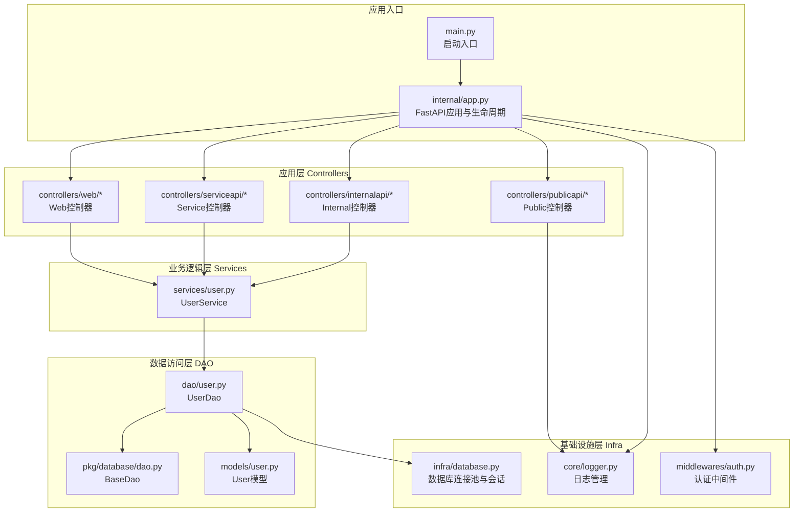
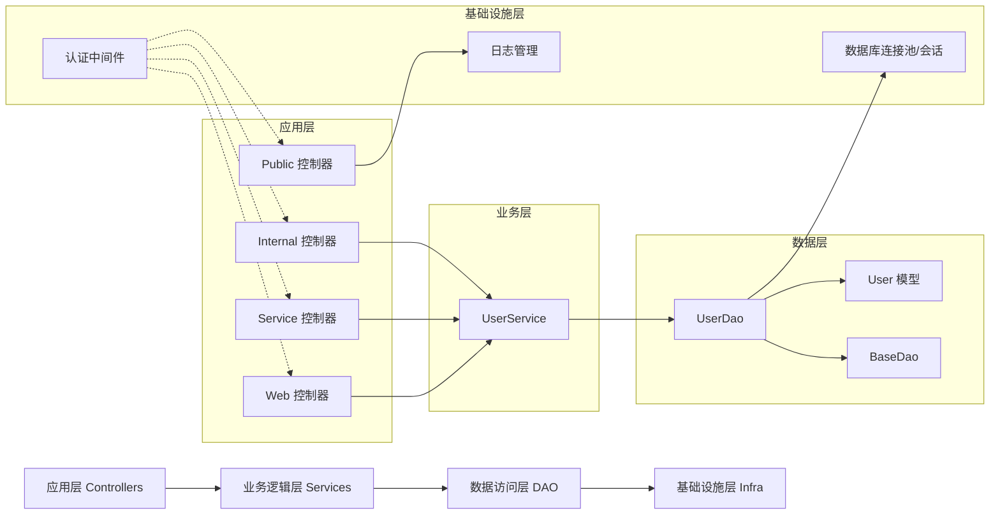
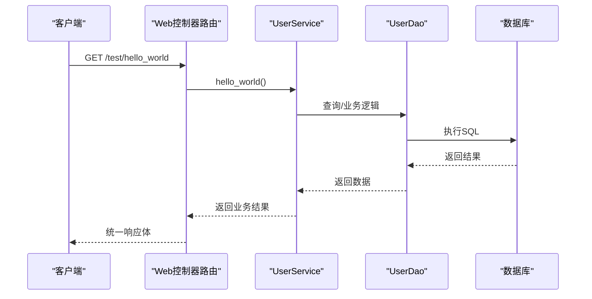
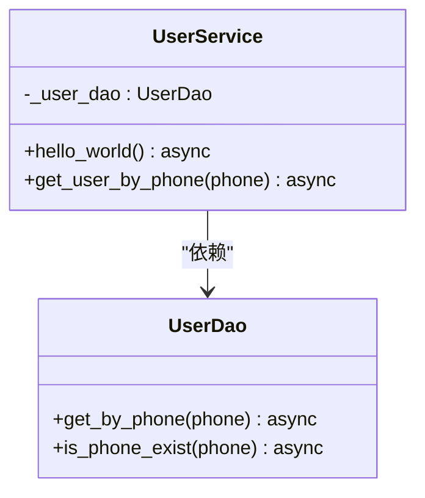
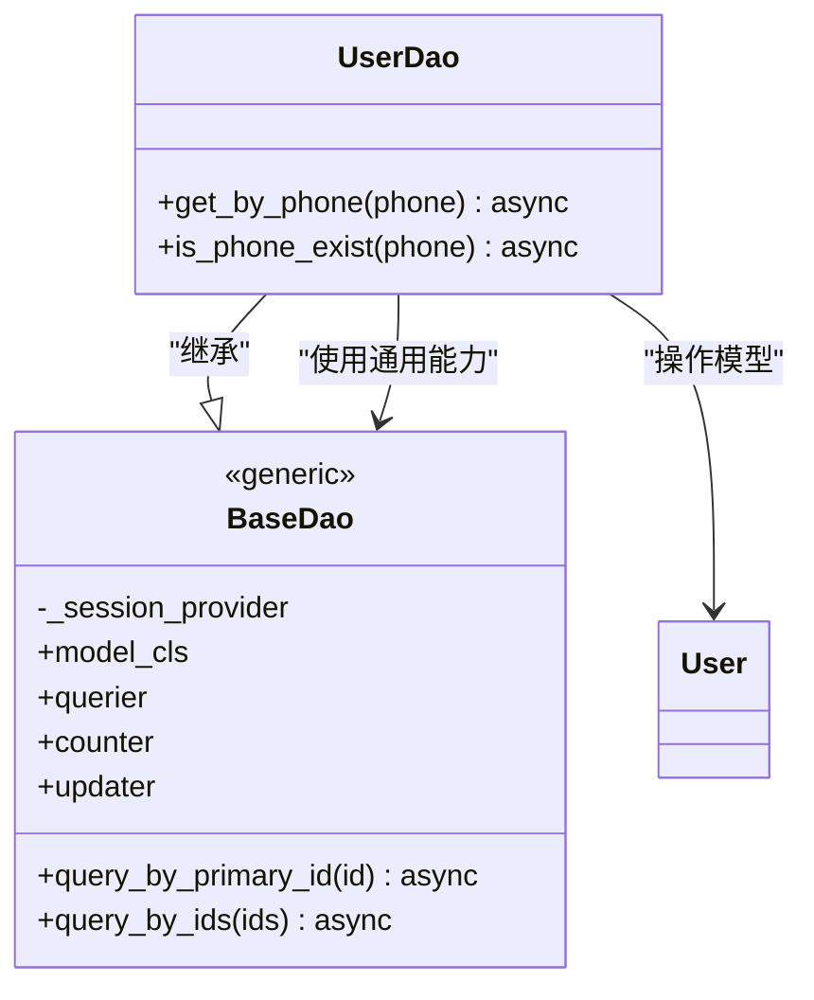
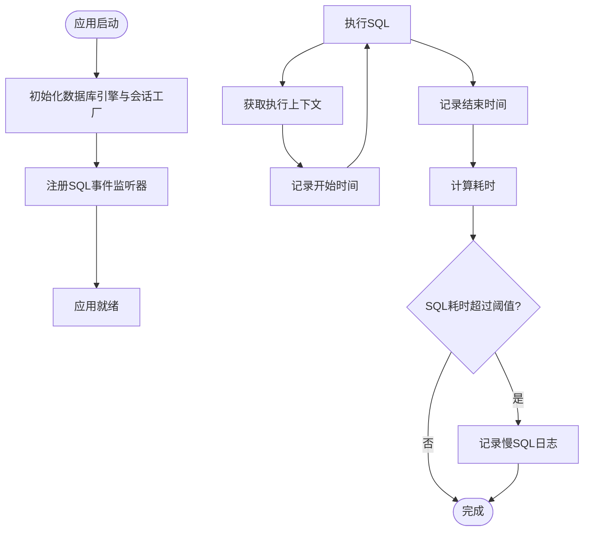
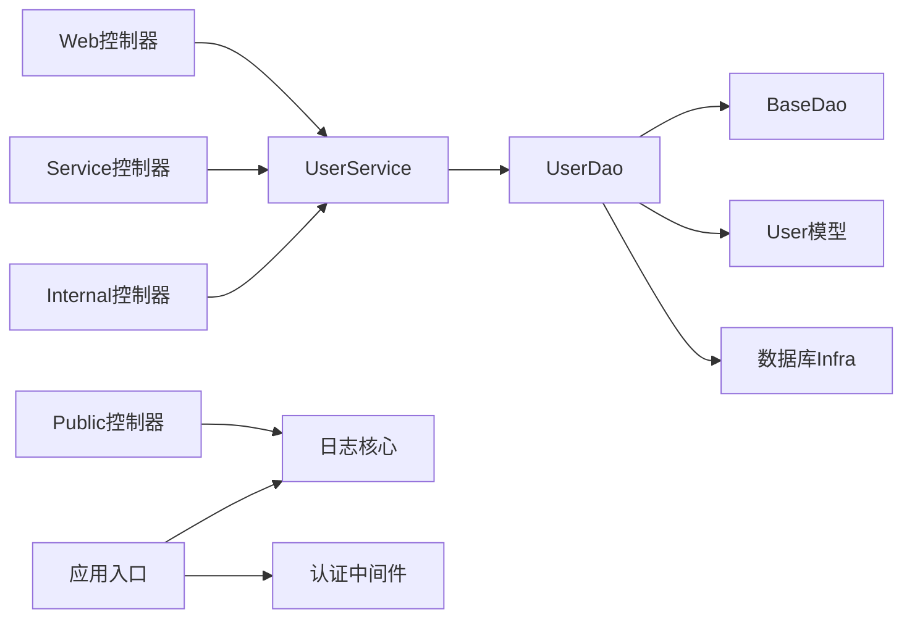

# 分层架构设计

<cite>
**本文档引用的文件**
- [main.py](file://main.py)
- [internal/app.py](file://internal/app.py)
- [internal/controllers/web/user.py](file://internal/controllers/web/user.py)
- [internal/controllers/serviceapi/user.py](file://internal/controllers/serviceapi/user.py)
- [internal/controllers/internalapi/user.py](file://internal/controllers/internalapi/user.py)
- [internal/controllers/publicapi/test.py](file://internal/controllers/publicapi/test.py)
- [internal/services/user.py](file://internal/services/user.py)
- [internal/dao/user.py](file://internal/dao/user.py)
- [pkg/database/dao.py](file://pkg/database/dao.py)
- [internal/models/user.py](file://internal/models/user.py)
- [internal/infra/database.py](file://internal/infra/database.py)
- [pkg/database/base.py](file://pkg/database/base.py)
- [pkg/toolkit/response.py](file://pkg/toolkit/response.py)
- [internal/middlewares/auth.py](file://internal/middlewares/auth.py)
- [internal/core/logger.py](file://internal/core/logger.py)
</cite>

## 目录
1. [引言](#引言)
2. [项目结构](#项目结构)
3. [核心组件](#核心组件)
4. [架构总览](#架构总览)
5. [详细组件分析](#详细组件分析)
6. [依赖关系分析](#依赖关系分析)
7. [性能考量](#性能考量)
8. [故障排查指南](#故障排查指南)
9. [结论](#结论)
10. [附录](#附录)

## 引言
本项目采用经典的四层架构设计：应用层（Controllers）、业务逻辑层（Services）、数据访问层（DAO）、基础设施层（Infra）。该设计遵循“关注点分离”和“依赖倒置”的原则，使系统具备清晰的职责边界、良好的可测试性与可维护性。通过明确的依赖方向（上层依赖下层，下层不依赖上层），配合统一的响应体与异常处理机制，实现高内聚、低耦合的模块化组织。

## 项目结构
项目按功能域与层次划分目录，便于扩展与维护：
- internal：核心业务与基础设施代码
  - app.py：应用入口与生命周期管理
  - controllers：API 控制器（按路由域划分）
  - services：业务服务与依赖注入
  - dao：数据访问对象
  - models：ORM 模型
  - infra：基础设施（数据库、Redis、任务调度等）
  - middlewares：中间件（认证、日志、CORS、GZip）
  - core：核心能力（日志、加密、异常、签名、雪花ID）
- pkg：可复用工具库
  - database：数据库抽象与DAO基类
  - toolkit：通用工具（响应、日志、HTTP客户端、缓存等）
- tests：单元测试与集成测试
- scripts：运行脚本（Celery worker等）

图表来源
- [main.py](file://main.py#L1-L18)
- [internal/app.py](file://internal/app.py#L1-L109)
- [internal/controllers/web/user.py](file://internal/controllers/web/user.py#L1-L17)
- [internal/controllers/serviceapi/user.py](file://internal/controllers/serviceapi/user.py#L1-L21)
- [internal/controllers/internalapi/user.py](file://internal/controllers/internalapi/user.py#L1-L11)
- [internal/controllers/publicapi/test.py](file://internal/controllers/publicapi/test.py#L1-L90)
- [internal/services/user.py](file://internal/services/user.py#L1-L21)
- [internal/dao/user.py](file://internal/dao/user.py#L1-L24)
- [pkg/database/dao.py](file://pkg/database/dao.py#L1-L203)
- [internal/models/user.py](file://internal/models/user.py#L1-L13)
- [internal/infra/database.py](file://internal/infra/database.py#L1-L154)
- [internal/core/logger.py](file://internal/core/logger.py#L1-L59)
- [internal/middlewares/auth.py](file://internal/middlewares/auth.py#L1-L150)

章节来源
- [main.py](file://main.py#L1-L18)
- [internal/app.py](file://internal/app.py#L1-L109)

## 核心组件
- 应用层（Controllers）
  - 负责接收请求、参数校验、调用服务层、返回统一响应体
  - 通过依赖注入获取服务实例，避免硬编码
  - 示例：Web控制器与Service控制器均通过依赖注入获取UserService
- 业务逻辑层（Services）
  - 封装领域业务规则，协调DAO完成业务目标
  - 保持无状态或最小状态，便于测试与并发安全
  - 示例：UserService提供业务方法并委托UserDao执行数据访问
- 数据访问层（DAO）
  - 基于BaseDao封装查询、计数、更新等通用能力
  - 通过会话提供者获取数据库会话，支持事务执行器
  - 示例：UserDao基于BaseDao实现按手机号查询与存在性检查
- 基础设施层（Infra）
  - 提供数据库连接池、会话管理、日志、认证、任务调度等通用能力
  - 通过生命周期钩子在应用启动/关闭时初始化与释放资源
  - 示例：数据库初始化、关闭与慢SQL监控；日志管理器初始化

章节来源
- [internal/controllers/web/user.py](file://internal/controllers/web/user.py#L1-L17)
- [internal/controllers/serviceapi/user.py](file://internal/controllers/serviceapi/user.py#L1-L21)
- [internal/services/user.py](file://internal/services/user.py#L1-L21)
- [internal/dao/user.py](file://internal/dao/user.py#L1-L24)
- [pkg/database/dao.py](file://pkg/database/dao.py#L1-L203)
- [internal/infra/database.py](file://internal/infra/database.py#L1-L154)
- [internal/core/logger.py](file://internal/core/logger.py#L1-L59)

## 架构总览
四层架构的依赖方向自上而下，上层仅依赖下层接口，下层不依赖上层。应用层负责对外暴露API；业务层负责编排与规则；数据层负责持久化；基础设施层提供运行支撑。

图表来源
- [internal/controllers/web/user.py](file://internal/controllers/web/user.py#L1-L17)
- [internal/controllers/serviceapi/user.py](file://internal/controllers/serviceapi/user.py#L1-L21)
- [internal/controllers/internalapi/user.py](file://internal/controllers/internalapi/user.py#L1-L11)
- [internal/controllers/publicapi/test.py](file://internal/controllers/publicapi/test.py#L1-L90)
- [internal/services/user.py](file://internal/services/user.py#L1-L21)
- [internal/dao/user.py](file://internal/dao/user.py#L1-L24)
- [pkg/database/dao.py](file://pkg/database/dao.py#L1-L203)
- [internal/models/user.py](file://internal/models/user.py#L1-L13)
- [internal/infra/database.py](file://internal/infra/database.py#L1-L154)
- [internal/middlewares/auth.py](file://internal/middlewares/auth.py#L1-L150)

## 详细组件分析

### 应用层（Controllers）分析
- 设计原则
  - 职责单一：每个控制器专注于特定API域（Web/Service/Internal/Public）
  - 依赖注入：通过Annotated与Depends获取服务实例，降低耦合
  - 统一响应：返回统一的成功/错误响应体，便于前端处理
- 交互模式
  - 控制器接收请求参数，调用服务层方法，将结果包装为统一响应
  - 认证中间件在进入控制器前完成鉴权与上下文设置
- 示例流程（Web控制器调用UserService）

图表来源
- [internal/controllers/web/user.py](file://internal/controllers/web/user.py#L1-L17)
- [internal/services/user.py](file://internal/services/user.py#L1-L21)
- [internal/dao/user.py](file://internal/dao/user.py#L1-L24)
- [internal/infra/database.py](file://internal/infra/database.py#L1-L154)

章节来源
- [internal/controllers/web/user.py](file://internal/controllers/web/user.py#L1-L17)
- [internal/controllers/serviceapi/user.py](file://internal/controllers/serviceapi/user.py#L1-L21)
- [internal/controllers/internalapi/user.py](file://internal/controllers/internalapi/user.py#L1-L11)
- [internal/controllers/publicapi/test.py](file://internal/controllers/publicapi/test.py#L1-L90)
- [pkg/toolkit/response.py](file://pkg/toolkit/response.py#L1-L233)
- [internal/middlewares/auth.py](file://internal/middlewares/auth.py#L1-L150)

### 业务逻辑层（Services）分析
- 设计原则
  - 无状态或最小状态：便于并发与测试
  - 明确边界：仅编排业务，不直接操作数据库
  - 依赖注入：通过工厂函数提供单例服务
- 交互模式
  - 服务层接收业务参数，调用DAO完成数据访问
  - 可组合多个DAO以实现复杂业务
- 类关系图

图表来源
- [internal/services/user.py](file://internal/services/user.py#L1-L21)
- [internal/dao/user.py](file://internal/dao/user.py#L1-L24)

章节来源
- [internal/services/user.py](file://internal/services/user.py#L1-L21)

### 数据访问层（DAO）分析
- 设计原则
  - 统一基类：BaseDao提供查询、计数、更新等通用能力
  - 会话隔离：通过会话提供者获取会话，避免全局状态
  - 事务支持：提供手动事务执行器，支持复杂业务场景
- 交互模式
  - DAO基于模型类与QueryBuilder/CountBuilder构建SQL
  - 通过Infra层提供的会话管理器执行SQL
- 类关系图

图表来源
- [pkg/database/dao.py](file://pkg/database/dao.py#L1-L203)
- [internal/dao/user.py](file://internal/dao/user.py#L1-L24)
- [internal/models/user.py](file://internal/models/user.py#L1-L13)

章节来源
- [pkg/database/dao.py](file://pkg/database/dao.py#L1-L203)
- [internal/dao/user.py](file://internal/dao/user.py#L1-L24)
- [internal/models/user.py](file://internal/models/user.py#L1-L13)

### 基础设施层（Infra）分析
- 设计原则
  - 生命周期管理：在应用启动时初始化，在关闭时释放
  - 资源池化：数据库连接池、任务管理器等
  - 可观测性：慢SQL监控、日志轮转与归档
- 交互模式
  - 数据库：提供引擎、会话工厂与会话获取上下文
  - 日志：统一日志管理器，支持UTC时间、轮转与保留策略
  - 认证：中间件在请求进入时完成Token/签名校验
- 流程图（数据库初始化与慢SQL监控）

图表来源
- [internal/infra/database.py](file://internal/infra/database.py#L1-L154)

章节来源
- [internal/infra/database.py](file://internal/infra/database.py#L1-L154)
- [internal/core/logger.py](file://internal/core/logger.py#L1-L59)
- [internal/middlewares/auth.py](file://internal/middlewares/auth.py#L1-L150)

## 依赖关系分析
- 层间依赖方向
  - Controllers → Services：控制器依赖服务接口
  - Services → DAO：服务依赖数据访问接口
  - DAO → Infra：DAO依赖数据库会话与连接池
- 内部依赖
  - 控制器内部通过依赖注入获取服务实例
  - DAO通过BaseDao与模型类协作
  - 中间件在应用层统一注册，影响所有控制器
- 依赖图

图表来源
- [internal/app.py](file://internal/app.py#L1-L109)
- [internal/controllers/web/user.py](file://internal/controllers/web/user.py#L1-L17)
- [internal/controllers/serviceapi/user.py](file://internal/controllers/serviceapi/user.py#L1-L21)
- [internal/controllers/internalapi/user.py](file://internal/controllers/internalapi/user.py#L1-L11)
- [internal/controllers/publicapi/test.py](file://internal/controllers/publicapi/test.py#L1-L90)
- [internal/services/user.py](file://internal/services/user.py#L1-L21)
- [internal/dao/user.py](file://internal/dao/user.py#L1-L24)
- [pkg/database/dao.py](file://pkg/database/dao.py#L1-L203)
- [internal/models/user.py](file://internal/models/user.py#L1-L13)
- [internal/infra/database.py](file://internal/infra/database.py#L1-L154)
- [internal/middlewares/auth.py](file://internal/middlewares/auth.py#L1-L150)

章节来源
- [internal/app.py](file://internal/app.py#L1-L109)

## 性能考量
- 响应序列化优化
  - 使用高性能JSON序列化与自定义响应类，减少序列化开销
- 数据库连接池
  - 合理配置连接池大小、超时与回收策略，避免阻塞
- SQL可观测性
  - 慢SQL阈值与日志输出，便于定位性能瓶颈
- 事务与批处理
  - 复杂业务使用事务执行器，保证一致性与性能平衡
- 中间件顺序
  - 认证与日志中间件在路由之前，避免重复计算

## 故障排查指南
- 统一异常处理
  - 应用层注册异常处理器，将验证错误映射为统一响应
- 认证失败
  - 检查中间件白名单、签名头与Token有效性
- 数据库连接问题
  - 确认初始化顺序与会话上下文，避免在未初始化时使用
- 日志与追踪
  - 使用日志管理器与上下文变量，确保请求链路可追踪

章节来源
- [internal/app.py](file://internal/app.py#L48-L53)
- [internal/middlewares/auth.py](file://internal/middlewares/auth.py#L1-L150)
- [internal/infra/database.py](file://internal/infra/database.py#L1-L154)
- [internal/core/logger.py](file://internal/core/logger.py#L1-L59)

## 结论
本项目通过四层架构实现了清晰的职责划分与稳定的依赖方向，结合统一响应体、异常处理与基础设施能力，提升了系统的可维护性、可测试性与可扩展性。建议在新增功能时严格遵循分层边界，优先通过依赖注入与接口抽象实现解耦，持续优化数据库与中间件性能，保持日志与监控体系的完整性。

## 附录
- 代码片段路径参考
  - 应用入口与生命周期：[internal/app.py](file://internal/app.py#L1-L109)
  - Web控制器示例：[internal/controllers/web/user.py](file://internal/controllers/web/user.py#L1-L17)
  - Service控制器示例：[internal/controllers/serviceapi/user.py](file://internal/controllers/serviceapi/user.py#L1-L21)
  - Internal控制器示例：[internal/controllers/internalapi/user.py](file://internal/controllers/internalapi/user.py#L1-L11)
  - Public控制器示例：[internal/controllers/publicapi/test.py](file://internal/controllers/publicapi/test.py#L1-L90)
  - 业务服务示例：[internal/services/user.py](file://internal/services/user.py#L1-L21)
  - DAO基类与UserDao：[pkg/database/dao.py](file://pkg/database/dao.py#L1-L203), [internal/dao/user.py](file://internal/dao/user.py#L1-L24)
  - 数据库基础设施：[internal/infra/database.py](file://internal/infra/database.py#L1-L154)
  - 日志管理：[internal/core/logger.py](file://internal/core/logger.py#L1-L59)
  - 认证中间件：[internal/middlewares/auth.py](file://internal/middlewares/auth.py#L1-L150)
  - 统一响应体：[pkg/toolkit/response.py](file://pkg/toolkit/response.py#L1-L233)