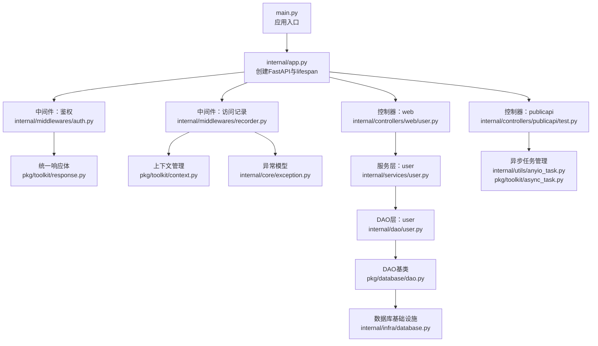
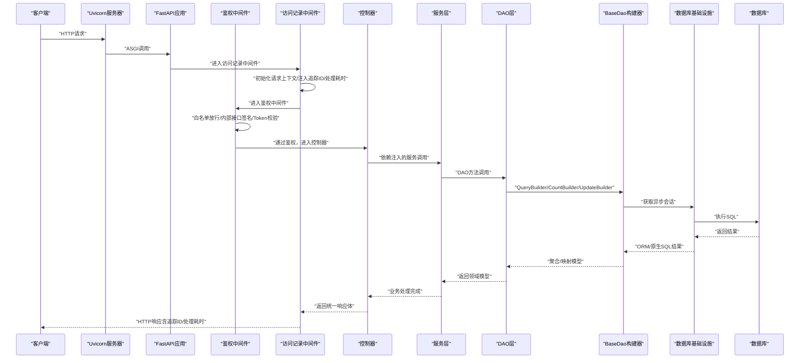
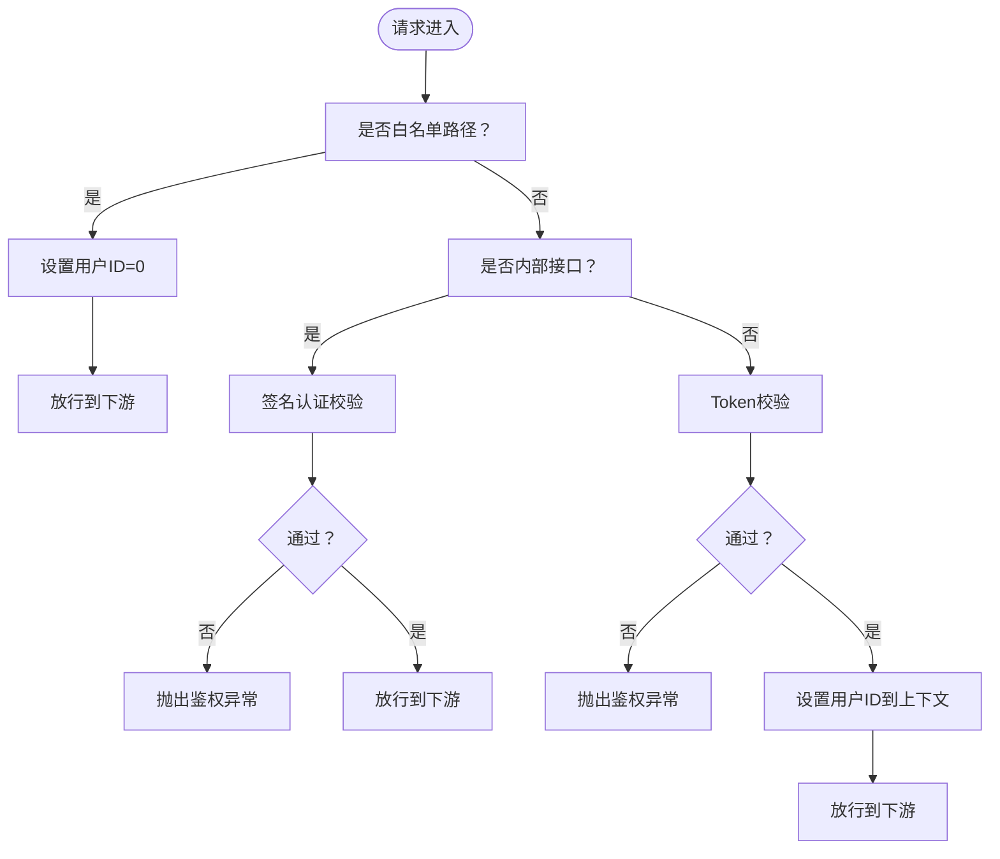
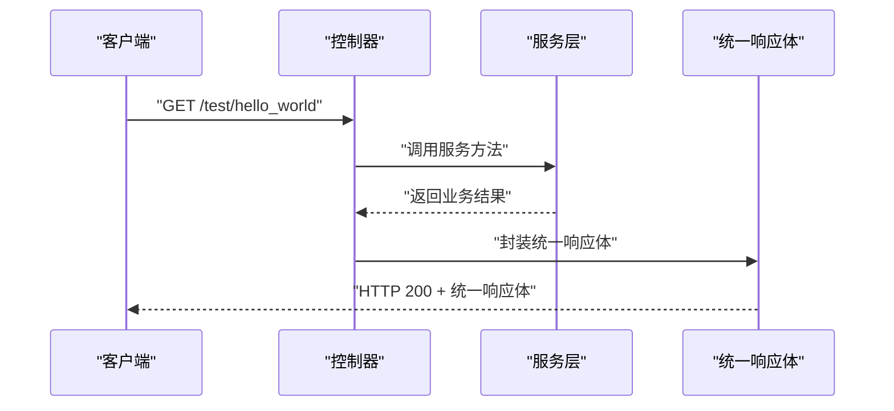
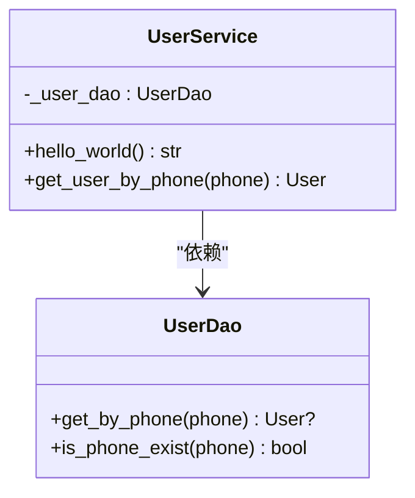
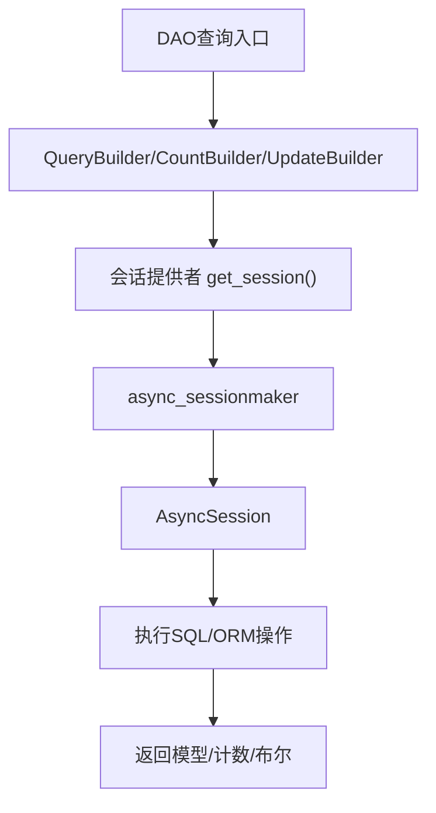
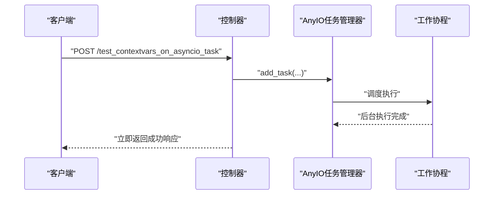
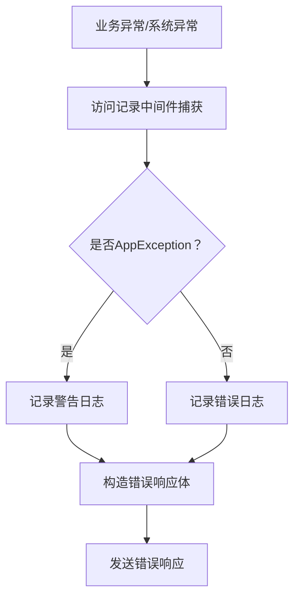
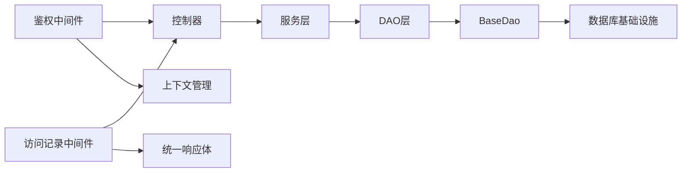

# 数据流设计

<cite>
**本文引用的文件**
- [main.py](file://main.py)
- [internal/app.py](file://internal/app.py)
- [internal/middlewares/auth.py](file://internal/middlewares/auth.py)
- [internal/middlewares/recorder.py](file://internal/middlewares/recorder.py)
- [internal/controllers/publicapi/test.py](file://internal/controllers/publicapi/test.py)
- [internal/controllers/web/user.py](file://internal/controllers/web/user.py)
- [internal/services/user.py](file://internal/services/user.py)
- [internal/dao/user.py](file://internal/dao/user.py)
- [pkg/database/dao.py](file://pkg/database/dao.py)
- [internal/infra/database.py](file://internal/infra/database.py)
- [pkg/toolkit/context.py](file://pkg/toolkit/context.py)
- [internal/core/exception.py](file://internal/core/exception.py)
- [pkg/toolkit/response.py](file://pkg/toolkit/response.py)
- [pkg/toolkit/async_task.py](file://pkg/toolkit/async_task.py)
- [internal/utils/anyio_task.py](file://internal/utils/anyio_task.py)
</cite>

## 目录
1. [引言](#引言)
2. [项目结构](#项目结构)
3. [核心组件](#核心组件)
4. [架构总览](#架构总览)
5. [详细组件分析](#详细组件分析)
6. [依赖关系分析](#依赖关系分析)
7. [性能考量](#性能考量)
8. [故障排查指南](#故障排查指南)
9. [结论](#结论)
10. [附录](#附录)

## 引言
本文件面向“从HTTP请求接收到底层数据库操作”的完整数据流设计，系统性阐述请求在中间件、控制器、服务层、DAO层之间的传递与转换过程，覆盖数据验证、转换、持久化、异步数据流与性能优化、错误传播与异常处理、以及监控与调试方法。目标是帮助开发者与运维人员快速理解并高效维护该数据流。

## 项目结构
该项目采用分层清晰的FastAPI应用结构：
- 应用入口与生命周期：main.py负责启动Uvicorn服务；internal/app.py负责创建FastAPI实例、注册路由、中间件与异常处理器，并在lifespan中初始化数据库、Redis、签名认证、Snowflake ID生成器与AnyIO任务管理器。
- 中间件层：鉴权中间件与访问记录中间件分别负责Token/签名校验与统一日志、追踪ID与处理耗时统计。
- 控制器层：按API域划分（web、internalapi、publicapi、serviceapi），对外暴露REST接口。
- 服务层：封装业务逻辑，依赖DAO层进行数据访问。
- DAO层：基于SQLAlchemy异步会话，提供查询、计数、更新等构建器能力。
- 基础设施与工具：数据库连接池、JSON序列化、响应体结构、上下文管理、异步任务管理等。

图表来源
- [main.py](file://main.py#L1-L18)
- [internal/app.py](file://internal/app.py#L17-L109)
- [internal/middlewares/auth.py](file://internal/middlewares/auth.py#L88-L150)
- [internal/middlewares/recorder.py](file://internal/middlewares/recorder.py#L66-L123)
- [internal/controllers/web/user.py](file://internal/controllers/web/user.py#L1-L17)
- [internal/controllers/publicapi/test.py](file://internal/controllers/publicapi/test.py#L1-L90)
- [internal/services/user.py](file://internal/services/user.py#L1-L21)
- [internal/dao/user.py](file://internal/dao/user.py#L1-L24)
- [pkg/database/dao.py](file://pkg/database/dao.py#L15-L203)
- [internal/infra/database.py](file://internal/infra/database.py#L26-L154)
- [pkg/toolkit/context.py](file://pkg/toolkit/context.py#L1-L107)
- [pkg/toolkit/response.py](file://pkg/toolkit/response.py#L1-L233)
- [internal/core/exception.py](file://internal/core/exception.py#L1-L38)
- [pkg/toolkit/async_task.py](file://pkg/toolkit/async_task.py#L42-L375)
- [internal/utils/anyio_task.py](file://internal/utils/anyio_task.py#L1-L39)

章节来源
- [main.py](file://main.py#L1-L18)
- [internal/app.py](file://internal/app.py#L17-L109)

## 核心组件
- 应用创建与生命周期：创建FastAPI实例、注册路由、中间件与异常处理器，并在lifespan中初始化数据库、Redis、签名认证、Snowflake ID生成器与AnyIO任务管理器。
- 中间件体系：
  - 鉴权中间件：白名单放行、内部接口签名校验、Token校验，并将用户上下文写入全局上下文。
  - 访问记录中间件：初始化请求上下文、注入追踪ID与处理耗时、统一异常捕获与错误响应。
- 控制器：按域划分的API路由，依赖注入服务层，返回统一响应体。
- 服务层：封装业务逻辑，调用DAO层执行数据访问。
- DAO层：基于BaseDao提供查询、计数、更新构建器，使用异步会话执行SQL。
- 数据库基础设施：异步引擎、会话工厂、事件监听（SQL慢查询/调试日志）、会话上下文管理。
- 上下文管理：基于contextvars的请求上下文，支持trace_id、user_id等键值读写。
- 异常与响应：统一的AppException与AppError，统一响应体结构，支持SSE与流式输出。
- 异步任务：AnyIO TaskGroup驱动的任务管理器，支持并发限流、超时、取消与批量执行。

章节来源
- [internal/app.py](file://internal/app.py#L17-L109)
- [internal/middlewares/auth.py](file://internal/middlewares/auth.py#L88-L150)
- [internal/middlewares/recorder.py](file://internal/middlewares/recorder.py#L66-L123)
- [internal/controllers/web/user.py](file://internal/controllers/web/user.py#L1-L17)
- [internal/controllers/publicapi/test.py](file://internal/controllers/publicapi/test.py#L1-L90)
- [internal/services/user.py](file://internal/services/user.py#L1-L21)
- [internal/dao/user.py](file://internal/dao/user.py#L1-L24)
- [pkg/database/dao.py](file://pkg/database/dao.py#L15-L203)
- [internal/infra/database.py](file://internal/infra/database.py#L26-L154)
- [pkg/toolkit/context.py](file://pkg/toolkit/context.py#L1-L107)
- [pkg/toolkit/response.py](file://pkg/toolkit/response.py#L1-L233)
- [internal/core/exception.py](file://internal/core/exception.py#L1-L38)
- [pkg/toolkit/async_task.py](file://pkg/toolkit/async_task.py#L42-L375)
- [internal/utils/anyio_task.py](file://internal/utils/anyio_task.py#L1-L39)

## 架构总览
下图展示一次典型HTTP请求从接收到底层数据库的全链路数据流，包括中间件、控制器、服务层、DAO层与数据库基础设施的交互。

图表来源
- [internal/middlewares/auth.py](file://internal/middlewares/auth.py#L88-L150)
- [internal/middlewares/recorder.py](file://internal/middlewares/recorder.py#L66-L123)
- [internal/controllers/web/user.py](file://internal/controllers/web/user.py#L13-L16)
- [internal/services/user.py](file://internal/services/user.py#L13-L15)
- [internal/dao/user.py](file://internal/dao/user.py#L9-L12)
- [pkg/database/dao.py](file://pkg/database/dao.py#L47-L91)
- [internal/infra/database.py](file://internal/infra/database.py#L85-L111)

## 详细组件分析

### 中间件：鉴权与访问记录
- 鉴权中间件
  - 白名单路径直接放行，设置用户上下文为0。
  - 内部接口走签名认证，校验通过后放行。
  - 普通接口校验Token，解析成功后将用户ID写入上下文。
  - 异常统一抛出业务异常，交由上层中间件处理。
- 访问记录中间件
  - 初始化请求上下文，注入trace_id与处理耗时。
  - 记录访问日志与响应日志。
  - 全局异常捕获：区分业务异常与系统异常，构造统一错误响应。
  - 若响应已开始则不再发送错误响应，避免协议错误。

图表来源
- [internal/middlewares/auth.py](file://internal/middlewares/auth.py#L92-L149)

章节来源
- [internal/middlewares/auth.py](file://internal/middlewares/auth.py#L88-L150)
- [internal/middlewares/recorder.py](file://internal/middlewares/recorder.py#L66-L123)

### 控制器：依赖注入与统一响应
- 控制器按域划分，使用依赖注入获取服务实例。
- 返回统一的成功/错误响应体，确保接口一致性与可观测性。

图表来源
- [internal/controllers/web/user.py](file://internal/controllers/web/user.py#L13-L16)
- [pkg/toolkit/response.py](file://pkg/toolkit/response.py#L181-L200)

章节来源
- [internal/controllers/web/user.py](file://internal/controllers/web/user.py#L1-L17)
- [pkg/toolkit/response.py](file://pkg/toolkit/response.py#L1-L233)

### 服务层：业务逻辑与DAO协作
- 服务层保持纯净，仅编排业务，将具体数据访问委托给DAO。
- 通过依赖注入获取DAO实例，便于测试与替换。

图表来源
- [internal/services/user.py](file://internal/services/user.py#L5-L21)
- [internal/dao/user.py](file://internal/dao/user.py#L6-L24)

章节来源
- [internal/services/user.py](file://internal/services/user.py#L1-L21)
- [internal/dao/user.py](file://internal/dao/user.py#L1-L24)

### DAO层与数据库基础设施：查询、计数、更新与事务
- BaseDao提供QueryBuilder、CountBuilder、UpdateBuilder，支持链式条件与排序。
- UserDao基于BaseDao实现具体查询与存在性检查。
- 数据库基础设施提供异步引擎、会话工厂与事件监听，支持慢SQL日志与调试日志。
- 通过会话上下文管理，确保异常时自动回滚。

图表来源
- [pkg/database/dao.py](file://pkg/database/dao.py#L47-L91)
- [internal/dao/user.py](file://internal/dao/user.py#L9-L17)
- [internal/infra/database.py](file://internal/infra/database.py#L85-L111)

章节来源
- [pkg/database/dao.py](file://pkg/database/dao.py#L15-L203)
- [internal/dao/user.py](file://internal/dao/user.py#L1-L24)
- [internal/infra/database.py](file://internal/infra/database.py#L26-L154)

### 异步数据流与性能优化
- 异步任务管理：AnyIO TaskGroup驱动的任务管理器，支持全局/线程/进程容量限制、超时、取消与批量执行。
- 与控制器结合：控制器可将长时间任务提交到任务管理器，返回即时响应，提升吞吐。
- 数据库连接池：异步引擎配置连接池大小、超时与回收策略，配合事件监听记录慢查询。
- 响应序列化：基于orjson的高性能响应体，减少序列化开销。

图表来源
- [internal/controllers/publicapi/test.py](file://internal/controllers/publicapi/test.py#L33-L36)
- [pkg/toolkit/async_task.py](file://pkg/toolkit/async_task.py#L183-L215)
- [internal/utils/anyio_task.py](file://internal/utils/anyio_task.py#L8-L17)

章节来源
- [internal/controllers/publicapi/test.py](file://internal/controllers/publicapi/test.py#L1-L90)
- [pkg/toolkit/async_task.py](file://pkg/toolkit/async_task.py#L42-L375)
- [internal/utils/anyio_task.py](file://internal/utils/anyio_task.py#L1-L39)

### 错误传播与异常处理
- 自定义异常：AppException携带AppError与消息，支持任意HTTP状态码。
- 中间件捕获：访问记录中间件统一捕获异常，区分业务异常与系统异常，构造统一错误响应。
- 响应体：统一错误响应体结构，包含code/message/data，便于前端与监控系统消费。

图表来源
- [internal/core/exception.py](file://internal/core/exception.py#L4-L17)
- [internal/middlewares/recorder.py](file://internal/middlewares/recorder.py#L104-L122)
- [pkg/toolkit/response.py](file://pkg/toolkit/response.py#L195-L200)

章节来源
- [internal/core/exception.py](file://internal/core/exception.py#L1-L38)
- [internal/middlewares/recorder.py](file://internal/middlewares/recorder.py#L1-L123)
- [pkg/toolkit/response.py](file://pkg/toolkit/response.py#L1-L233)

### 数据验证、转换与持久化
- 数据验证：FastAPI自动进行请求体与路径参数验证；自定义异常处理器将验证错误转为统一错误响应。
- 数据转换：统一响应体对Pydantic模型、列表与原生类型进行转换，保证序列化一致性。
- 持久化：DAO层通过BaseDao构建SQL，数据库基础设施负责会话与事务管理，异常时自动回滚。

章节来源
- [internal/app.py](file://internal/app.py#L48-L53)
- [pkg/toolkit/response.py](file://pkg/toolkit/response.py#L101-L133)
- [internal/infra/database.py](file://internal/infra/database.py#L95-L111)

### 监控与调试
- 追踪ID：中间件注入X-Trace-ID，贯穿请求全链路，便于日志聚合与问题定位。
- 处理耗时：中间件注入X-Process-Time，便于性能分析与瓶颈识别。
- SQL监控：数据库基础设施注册事件监听，慢查询阈值可配置，DEBUG模式下输出SQL明细。
- 日志上下文：基于contextvars的请求上下文，支持trace_id与user_id读取，便于日志结构化。

章节来源
- [internal/middlewares/recorder.py](file://internal/middlewares/recorder.py#L16-L42)
- [internal/infra/database.py](file://internal/infra/database.py#L116-L154)
- [pkg/toolkit/context.py](file://pkg/toolkit/context.py#L78-L107)

## 依赖关系分析
- 组件耦合与内聚：控制器依赖服务层，服务层依赖DAO层，DAO层依赖BaseDao与数据库基础设施，形成清晰的单向依赖。
- 外部依赖：FastAPI、Starlette中间件栈、SQLAlchemy异步引擎、AnyIO任务管理、orjson序列化。
- 循环依赖：未发现循环导入；中间件与控制器通过依赖注入解耦。
- 接口契约：统一响应体与异常模型作为契约，保障前后端与监控系统的稳定性。

图表来源
- [internal/controllers/web/user.py](file://internal/controllers/web/user.py#L10)
- [internal/services/user.py](file://internal/services/user.py#L1-L21)
- [internal/dao/user.py](file://internal/dao/user.py#L1-L24)
- [pkg/database/dao.py](file://pkg/database/dao.py#L15-L203)
- [internal/infra/database.py](file://internal/infra/database.py#L26-L154)
- [internal/middlewares/auth.py](file://internal/middlewares/auth.py#L88-L150)
- [internal/middlewares/recorder.py](file://internal/middlewares/recorder.py#L66-L123)
- [pkg/toolkit/response.py](file://pkg/toolkit/response.py#L1-L233)
- [pkg/toolkit/context.py](file://pkg/toolkit/context.py#L1-L107)

章节来源
- [internal/controllers/web/user.py](file://internal/controllers/web/user.py#L1-L17)
- [internal/services/user.py](file://internal/services/user.py#L1-L21)
- [internal/dao/user.py](file://internal/dao/user.py#L1-L24)
- [pkg/database/dao.py](file://pkg/database/dao.py#L15-L203)
- [internal/infra/database.py](file://internal/infra/database.py#L26-L154)
- [internal/middlewares/auth.py](file://internal/middlewares/auth.py#L88-L150)
- [internal/middlewares/recorder.py](file://internal/middlewares/recorder.py#L66-L123)
- [pkg/toolkit/response.py](file://pkg/toolkit/response.py#L1-L233)
- [pkg/toolkit/context.py](file://pkg/toolkit/context.py#L1-L107)

## 性能考量
- 连接池与超时：异步引擎配置池大小、溢出、超时与回收，降低连接竞争与阻塞。
- 事件监听：慢查询阈值与DEBUG模式日志，辅助定位热点SQL。
- 序列化：orjson高性能序列化，减少响应体体积与CPU消耗。
- 并发控制：AnyIO任务管理器的全局/线程/进程容量限制，避免资源争用导致的抖动。
- 流式输出：SSE与异步生成器，降低内存占用与首字节延迟。

## 故障排查指南
- 追踪ID：通过X-Trace-ID串联请求链路，定位问题模块。
- 处理耗时：查看X-Process-Time，识别慢环节。
- 异常分类：业务异常与系统异常分别记录，优先处理系统异常。
- SQL诊断：慢查询日志与DEBUG SQL输出，结合索引与查询计划优化。
- 任务状态：异步任务管理器记录任务状态与异常，便于后台任务排障。

章节来源
- [internal/middlewares/recorder.py](file://internal/middlewares/recorder.py#L104-L122)
- [internal/infra/database.py](file://internal/infra/database.py#L134-L154)
- [pkg/toolkit/async_task.py](file://pkg/toolkit/async_task.py#L109-L154)

## 结论
该数据流设计以中间件为入口，控制器为门面，服务层为中枢，DAO层为数据通道，配合数据库基础设施与异步任务管理，实现了高内聚、低耦合、可观测、可扩展的请求处理链路。通过统一的响应体与异常模型、上下文追踪与SQL监控，能够有效支撑生产环境的稳定性与性能优化。

## 附录
- 关键流程路径参考
  - 应用创建与生命周期：[internal/app.py](file://internal/app.py#L17-L109)
  - 鉴权中间件：[internal/middlewares/auth.py](file://internal/middlewares/auth.py#L88-L150)
  - 访问记录中间件：[internal/middlewares/recorder.py](file://internal/middlewares/recorder.py#L66-L123)
  - 控制器依赖注入：[internal/controllers/web/user.py](file://internal/controllers/web/user.py#L10)
  - 服务层DAO调用：[internal/services/user.py](file://internal/services/user.py#L13-L15)
  - DAO查询与计数：[internal/dao/user.py](file://internal/dao/user.py#L9-L17)
  - BaseDao构建器：[pkg/database/dao.py](file://pkg/database/dao.py#L47-L91)
  - 数据库会话与事件监听：[internal/infra/database.py](file://internal/infra/database.py#L85-L154)
  - 上下文管理：[pkg/toolkit/context.py](file://pkg/toolkit/context.py#L78-L107)
  - 统一响应体与错误模型：[pkg/toolkit/response.py](file://pkg/toolkit/response.py#L1-L233), [internal/core/exception.py](file://internal/core/exception.py#L1-L38)
  - 异步任务管理：[pkg/toolkit/async_task.py](file://pkg/toolkit/async_task.py#L42-L375), [internal/utils/anyio_task.py](file://internal/utils/anyio_task.py#L1-L39)