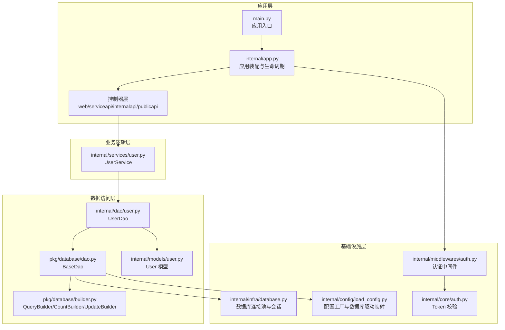
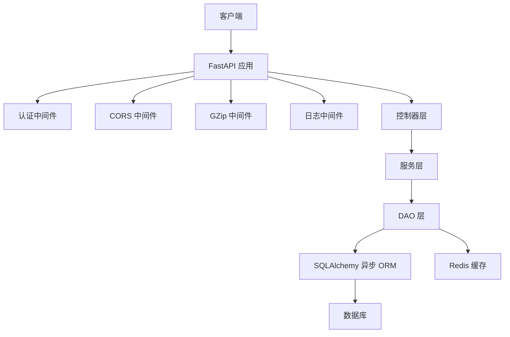
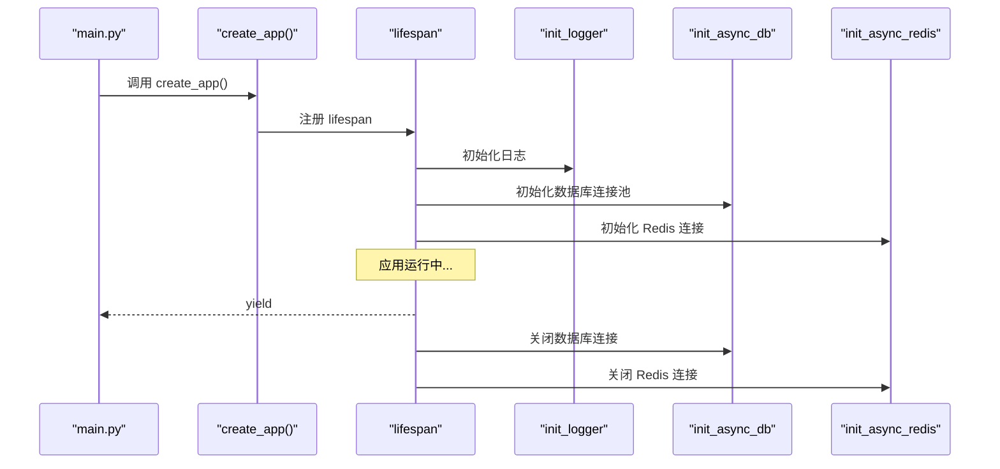
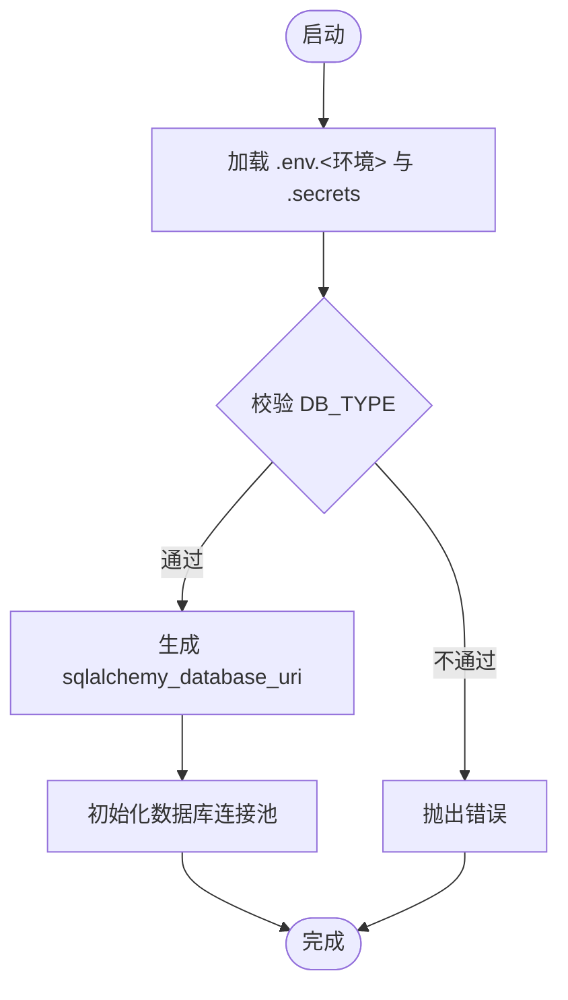
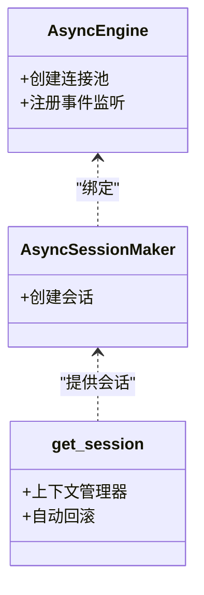
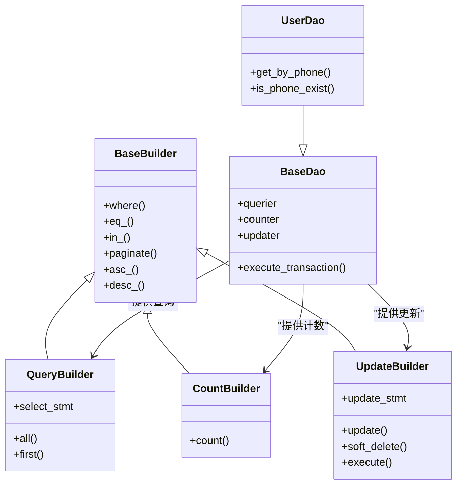
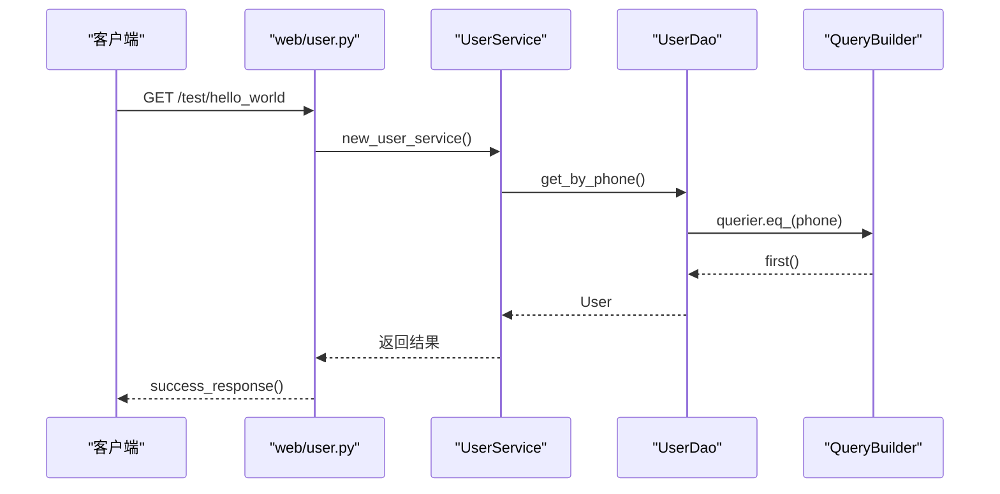
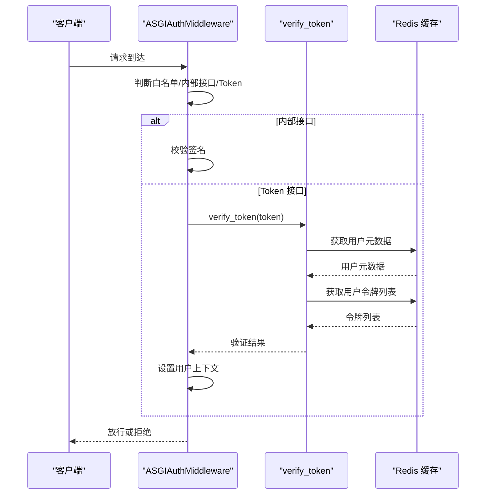
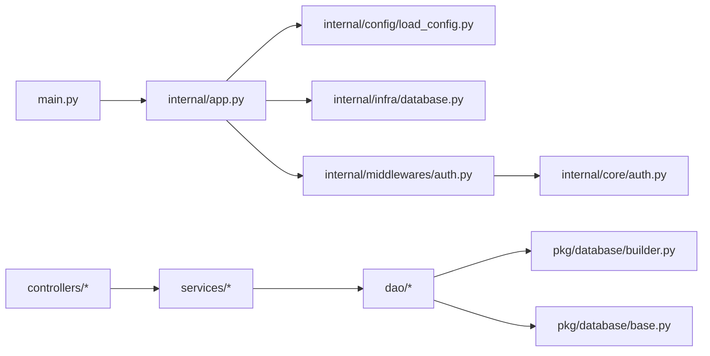

# 架构设计

<cite>
**本文档引用的文件**
- [main.py](file://main.py)
- [internal/app.py](file://internal/app.py)
- [internal/config/load_config.py](file://internal/config/load_config.py)
- [internal/infra/database.py](file://internal/infra/database.py)
- [pkg/database/base.py](file://pkg/database/base.py)
- [pkg/database/builder.py](file://pkg/database/builder.py)
- [pkg/database/dao.py](file://pkg/database/dao.py)
- [internal/controllers/web/user.py](file://internal/controllers/web/user.py)
- [internal/services/user.py](file://internal/services/user.py)
- [internal/dao/user.py](file://internal/dao/user.py)
- [internal/models/user.py](file://internal/models/user.py)
- [internal/middlewares/auth.py](file://internal/middlewares/auth.py)
- [internal/core/auth.py](file://internal/core/auth.py)
- [pyproject.toml](file://pyproject.toml)
- [Dockerfile](file://Dockerfile)
</cite>

## 目录
1. [引言](#引言)
2. [项目结构](#项目结构)
3. [核心组件](#核心组件)
4. [架构总览](#架构总览)
5. [详细组件分析](#详细组件分析)
6. [依赖关系分析](#依赖关系分析)
7. [性能考虑](#性能考虑)
8. [故障排查指南](#故障排查指南)
9. [结论](#结论)
10. [附录](#附录)

## 引言
本项目采用 FastAPI 构建的后端服务，遵循分层架构设计，将应用层、业务逻辑层、数据访问层与基础设施层清晰分离。通过工厂模式统一创建应用实例，结合依赖注入（通过工厂函数）实现松耦合；通过适配器模式（数据库类型适配）支持多数据库驱动；借助中间件体系实现横切关注点（认证、CORS、GZip、日志等）。本文档将深入解析各层职责、组件交互、设计模式应用、依赖关系、数据流以及性能与可扩展性考量。

## 项目结构
项目采用按职责分层的目录组织方式：
- 应用层：入口与应用装配，负责路由注册、中间件与生命周期管理
- 控制器层：API 路由与依赖注入入口
- 业务逻辑层：服务类封装业务规则与流程
- 数据访问层：DAO 与查询构建器，屏蔽底层 ORM 细节
- 基础设施层：数据库、Redis、任务调度、gRPC 等外部集成
- 核心工具与通用能力：认证、加密、日志、雪花 ID 等

**图表来源**
- [main.py](file://main.py#L1-L18)
- [internal/app.py](file://internal/app.py#L1-L109)
- [internal/controllers/web/user.py](file://internal/controllers/web/user.py#L1-L17)
- [internal/services/user.py](file://internal/services/user.py#L1-L21)
- [internal/dao/user.py](file://internal/dao/user.py#L1-L24)
- [pkg/database/dao.py](file://pkg/database/dao.py#L1-L203)
- [pkg/database/builder.py](file://pkg/database/builder.py#L1-L273)
- [internal/models/user.py](file://internal/models/user.py#L1-L13)
- [internal/infra/database.py](file://internal/infra/database.py#L1-L154)
- [internal/config/load_config.py](file://internal/config/load_config.py#L1-L243)
- [internal/middlewares/auth.py](file://internal/middlewares/auth.py#L1-L150)
- [internal/core/auth.py](file://internal/core/auth.py#L1-L20)

**章节来源**
- [main.py](file://main.py#L1-L18)
- [internal/app.py](file://internal/app.py#L1-L109)

## 核心组件
- 应用实例工厂：通过工厂函数创建 FastAPI 实例，集中配置路由、中间件与生命周期
- 配置工厂：基于环境变量与 .env 文件动态加载配置，支持多种数据库驱动映射
- 数据库适配器：通过引擎工厂与 JSON 序列化器适配不同数据库类型
- 查询构建器：提供链式条件构造、分页、计数、软删除等能力
- DAO 层：封装查询、计数、更新与事务执行器
- 服务层：编排业务流程，依赖注入 DAO
- 中间件：认证、CORS、GZip、日志等横切关注点

**章节来源**
- [internal/app.py](file://internal/app.py#L17-L30)
- [internal/config/load_config.py](file://internal/config/load_config.py#L176-L243)
- [pkg/database/base.py](file://pkg/database/base.py#L19-L46)
- [pkg/database/builder.py](file://pkg/database/builder.py#L18-L273)
- [pkg/database/dao.py](file://pkg/database/dao.py#L15-L203)
- [internal/services/user.py](file://internal/services/user.py#L5-L21)
- [internal/middlewares/auth.py](file://internal/middlewares/auth.py#L88-L150)

## 架构总览
系统采用分层架构，严格分离关注点：
- 应用层：负责应用装配、路由注册、中间件与生命周期管理
- 业务层：封装业务规则，协调 DAO 完成业务目标
- 数据访问层：屏蔽 ORM 细节，提供统一的查询、计数、更新与事务能力
- 基础设施层：数据库、缓存、任务调度、gRPC 等外部集成

**图表来源**
- [internal/app.py](file://internal/app.py#L55-L82)
- [internal/middlewares/auth.py](file://internal/middlewares/auth.py#L88-L150)
- [internal/infra/database.py](file://internal/infra/database.py#L26-L57)

## 详细组件分析

### 应用层与生命周期管理
- 工厂函数 create_app：创建 FastAPI 实例，按需开启文档端点，注册路由与异常处理
- 中间件注册：GZip、认证、CORS、日志
- 生命周期：lifespan 中完成日志、数据库、Redis、签名认证、Snowflake ID 生成器、AnyIO 任务管理的初始化与清理

**图表来源**
- [main.py](file://main.py#L6-L17)
- [internal/app.py](file://internal/app.py#L17-L30)
- [internal/app.py](file://internal/app.py#L84-L109)

**章节来源**
- [internal/app.py](file://internal/app.py#L17-L30)
- [internal/app.py](file://internal/app.py#L55-L82)
- [internal/app.py](file://internal/app.py#L84-L109)

### 配置工厂与数据库驱动适配
- 配置工厂：基于环境变量与 .env 文件加载配置，支持敏感字段解密
- 数据库驱动映射：支持 mysql、postgresql、oracle，动态生成 SQLAlchemy URI
- JSON 序列化：统一使用 orjson，提升序列化性能

**图表来源**
- [internal/config/load_config.py](file://internal/config/load_config.py#L176-L243)
- [internal/config/load_config.py](file://internal/config/load_config.py#L118-L174)

**章节来源**
- [internal/config/load_config.py](file://internal/config/load_config.py#L46-L174)
- [internal/config/load_config.py](file://internal/config/load_config.py#L176-L243)

### 数据库连接与会话管理
- 引擎工厂：统一创建 AsyncEngine，配置连接池参数与 JSON 序列化器
- 会话提供者：get_session 上下文管理器，支持自动回滚与异常处理
- SQL 监控：事件监听统计慢查询与调试输出

**图表来源**
- [pkg/database/base.py](file://pkg/database/base.py#L19-L46)
- [internal/infra/database.py](file://internal/infra/database.py#L26-L111)

**章节来源**
- [pkg/database/base.py](file://pkg/database/base.py#L19-L46)
- [internal/infra/database.py](file://internal/infra/database.py#L26-L111)

### 查询构建器与 DAO 层
- 查询构建器：QueryBuilder/CountBuilder/UpdateBuilder 提供链式条件构造、分页、计数、软删除
- BaseDao：统一提供 querier、counter、updater 属性，封装常用查询与事务执行器
- UserDao：面向 User 模型的具体 DAO，使用 querier/counter 简化查询

**图表来源**
- [pkg/database/builder.py](file://pkg/database/builder.py#L18-L273)
- [pkg/database/dao.py](file://pkg/database/dao.py#L15-L203)
- [internal/dao/user.py](file://internal/dao/user.py#L6-L24)

**章节来源**
- [pkg/database/builder.py](file://pkg/database/builder.py#L18-L273)
- [pkg/database/dao.py](file://pkg/database/dao.py#L15-L203)
- [internal/dao/user.py](file://internal/dao/user.py#L6-L24)

### 服务层与依赖注入
- UserService：封装业务逻辑，依赖 UserDao 完成数据访问
- 依赖注入：new_user_service 工厂函数提供单例服务实例，配合 FastAPI Depends 注入

**图表来源**
- [internal/controllers/web/user.py](file://internal/controllers/web/user.py#L13-L17)
- [internal/services/user.py](file://internal/services/user.py#L13-L16)
- [internal/dao/user.py](file://internal/dao/user.py#L9-L12)
- [pkg/database/builder.py](file://pkg/database/builder.py#L111-L162)

**章节来源**
- [internal/controllers/web/user.py](file://internal/controllers/web/user.py#L1-L17)
- [internal/services/user.py](file://internal/services/user.py#L5-L21)
- [internal/dao/user.py](file://internal/dao/user.py#L1-L24)

### 认证中间件与 Token 校验
- ASGIAuthMiddleware：实现白名单放行、内部接口签名认证、Token 校验
- Token 校验：从缓存中获取用户元数据与令牌列表，验证通过后设置用户上下文

**图表来源**
- [internal/middlewares/auth.py](file://internal/middlewares/auth.py#L88-L150)
- [internal/core/auth.py](file://internal/core/auth.py#L5-L20)

**章节来源**
- [internal/middlewares/auth.py](file://internal/middlewares/auth.py#L88-L150)
- [internal/core/auth.py](file://internal/core/auth.py#L5-L20)

## 依赖关系分析
- 应用层依赖配置工厂与基础设施初始化
- 控制器层通过依赖注入获取服务实例
- 服务层依赖 DAO 层，DAO 层依赖查询构建器与数据库连接
- 中间件依赖认证核心模块与上下文

**图表来源**
- [main.py](file://main.py#L6-L8)
- [internal/app.py](file://internal/app.py#L1-L109)
- [internal/config/load_config.py](file://internal/config/load_config.py#L1-L243)
- [internal/infra/database.py](file://internal/infra/database.py#L1-L154)
- [internal/middlewares/auth.py](file://internal/middlewares/auth.py#L1-L150)
- [pkg/database/builder.py](file://pkg/database/builder.py#L1-L273)
- [pkg/database/base.py](file://pkg/database/base.py#L1-L364)
- [internal/core/auth.py](file://internal/core/auth.py#L1-L20)

**章节来源**
- [pyproject.toml](file://pyproject.toml#L9-L70)

## 性能考虑
- 连接池与预检：数据库引擎启用 pool_pre_ping，合理设置 pool_size 与 max_overflow，降低连接失效与拥塞风险
- JSON 序列化：统一使用 orjson，减少序列化开销
- 中间件优化：GZip 压缩响应，降低带宽占用；CORS 仅在需要时启用
- 查询优化：使用查询构建器进行链式条件构造，避免 N+1 查询；对大结果集使用分页
- 事务与回滚：通过 execute_transaction 统一事务边界，异常时自动回滚，保证一致性
- 部署建议：容器镜像使用 uvicorn 的 uvloop 与 httptools，提升并发性能

**章节来源**
- [internal/infra/database.py](file://internal/infra/database.py#L38-L56)
- [pkg/database/base.py](file://pkg/database/base.py#L28-L41)
- [internal/app.py](file://internal/app.py#L55-L82)
- [pkg/database/dao.py](file://pkg/database/dao.py#L106-L203)
- [Dockerfile](file://Dockerfile#L36-L38)

## 故障排查指南
- 配置加载失败：检查 .env.<环境> 与 .secrets 是否存在，确认 APP_ENV 与 DB_TYPE 合法
- 数据库连接异常：确认 sqlalchemy_database_uri 生成正确，连接池参数合理
- 认证失败：核对 Token 是否存在于用户令牌列表，签名头是否完整
- SQL 慢查询：查看慢查询阈值配置，优化查询条件与索引
- 事务执行异常：检查 execute_transaction 回调逻辑，确保异常时自动回滚

**章节来源**
- [internal/config/load_config.py](file://internal/config/load_config.py#L176-L243)
- [internal/infra/database.py](file://internal/infra/database.py#L116-L154)
- [internal/middlewares/auth.py](file://internal/middlewares/auth.py#L119-L149)
- [pkg/database/dao.py](file://pkg/database/dao.py#L106-L203)

## 结论
本项目通过清晰的分层架构与设计模式应用，实现了高内聚、低耦合的系统结构。工厂模式统一应用实例创建，依赖注入简化组件协作，适配器模式支持多数据库驱动。中间件体系有效处理横切关注点，查询构建器与 DAO 层提供一致的数据访问体验。整体架构具备良好的可扩展性与可维护性，适合在生产环境中稳定运行。

## 附录
- 部署拓扑建议：应用容器暴露 8000 端口，使用健康检查；数据库与 Redis 作为独立服务，通过网络策略隔离
- 环境配置：通过 .env.<环境> 与 .secrets 管理敏感信息，支持多环境切换
- 监控与日志：启用 SQL 监控与日志中间件，结合慢查询阈值定位性能瓶颈

**章节来源**
- [Dockerfile](file://Dockerfile#L31-L38)
- [internal/config/load_config.py](file://internal/config/load_config.py#L176-L243)
- [internal/infra/database.py](file://internal/infra/database.py#L134-L143)