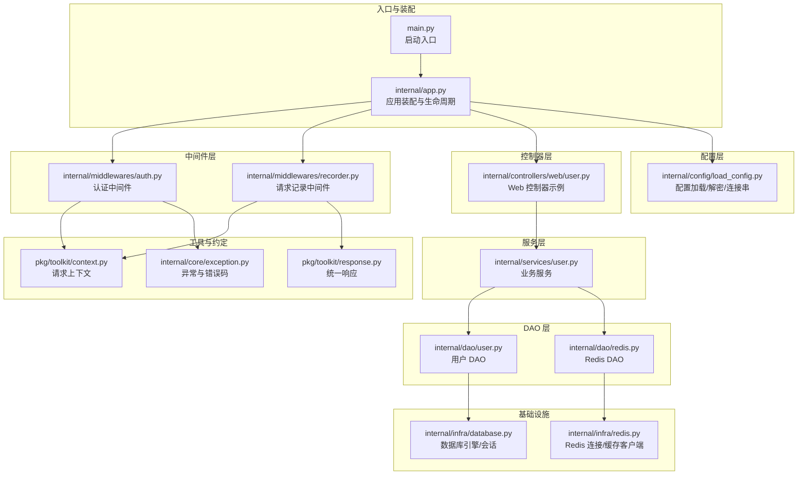
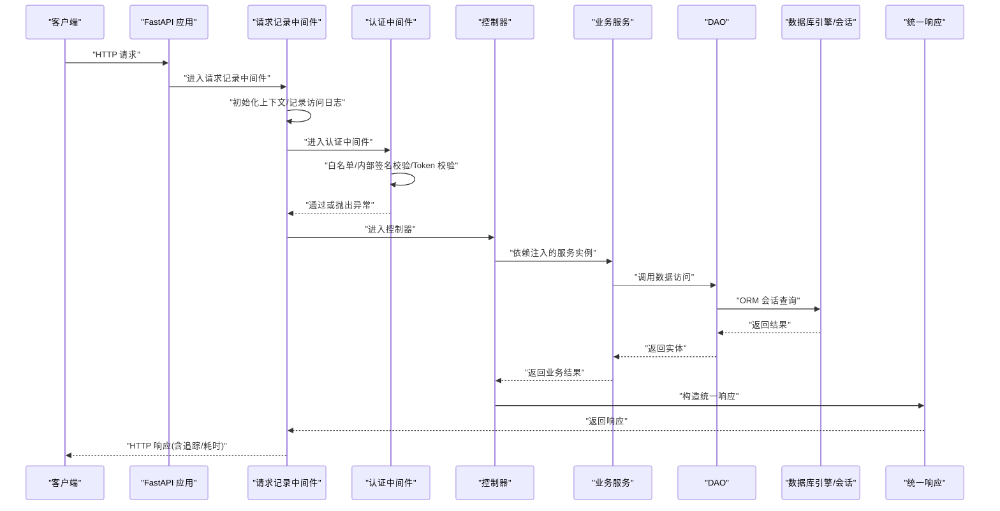
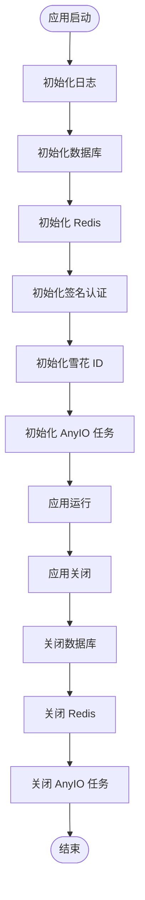
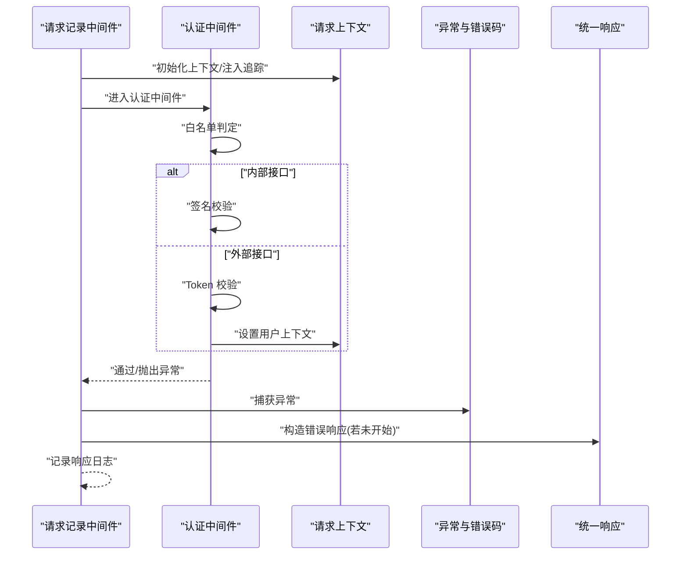
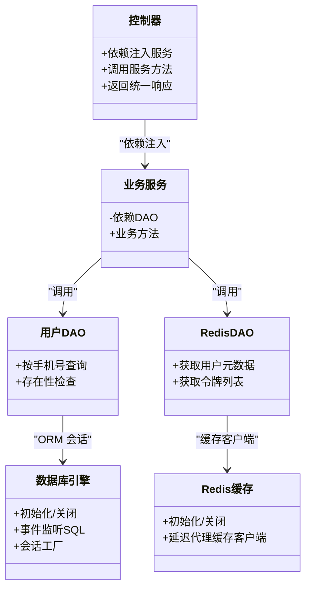
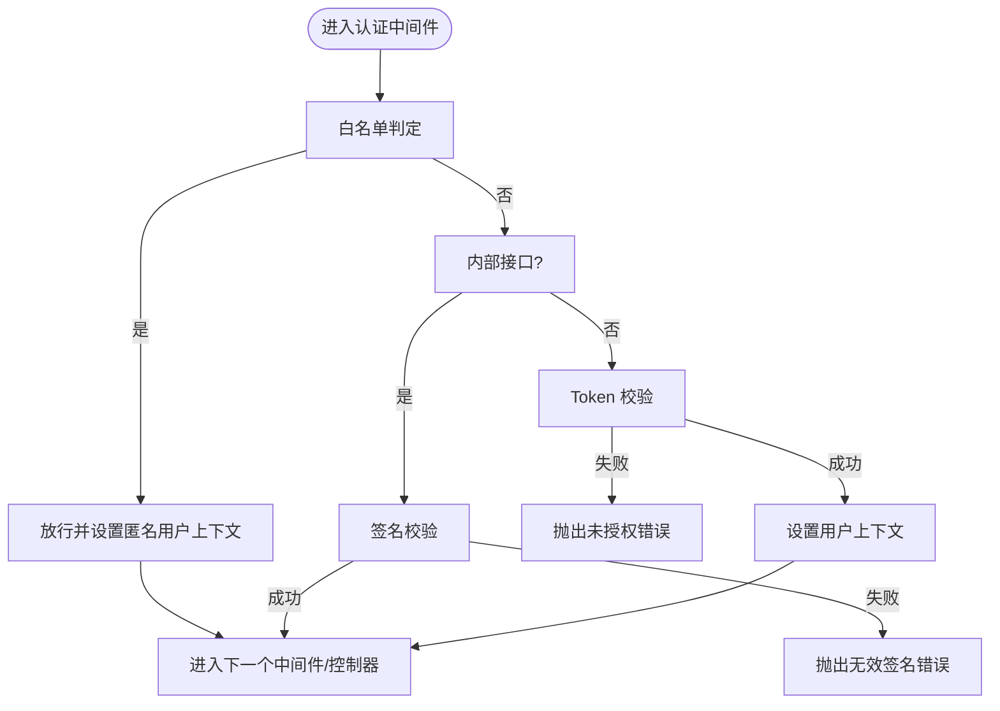
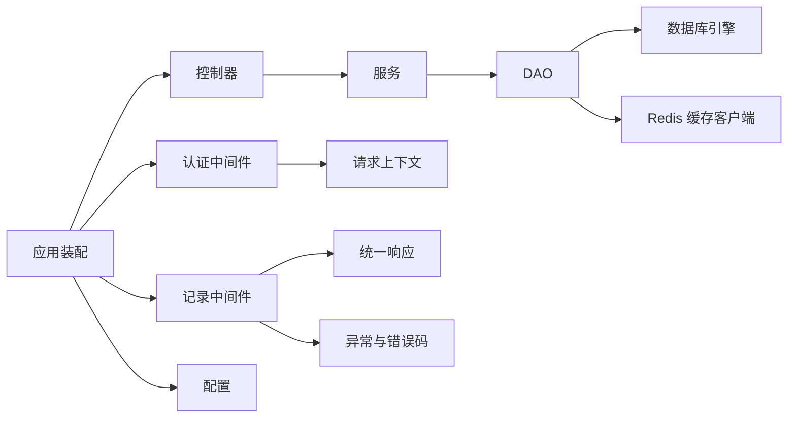

# 组件交互关系

<cite>
**本文引用的文件**
- [main.py](file://main.py)
- [internal/app.py](file://internal/app.py)
- [internal/config/load_config.py](file://internal/config/load_config.py)
- [internal/middlewares/auth.py](file://internal/middlewares/auth.py)
- [internal/middlewares/recorder.py](file://internal/middlewares/recorder.py)
- [internal/controllers/web/user.py](file://internal/controllers/web/user.py)
- [internal/services/user.py](file://internal/services/user.py)
- [internal/dao/user.py](file://internal/dao/user.py)
- [internal/infra/database.py](file://internal/infra/database.py)
- [internal/infra/redis.py](file://internal/infra/redis.py)
- [internal/dao/redis.py](file://internal/dao/redis.py)
- [internal/core/auth.py](file://internal/core/auth.py)
- [internal/core/exception.py](file://internal/core/exception.py)
- [pkg/toolkit/context.py](file://pkg/toolkit/context.py)
- [pkg/toolkit/response.py](file://pkg/toolkit/response.py)
</cite>

## 目录
1. [引言](#引言)
2. [项目结构](#项目结构)
3. [核心组件](#核心组件)
4. [架构总览](#架构总览)
5. [详细组件分析](#详细组件分析)
6. [依赖关系分析](#依赖关系分析)
7. [性能考量](#性能考量)
8. [故障排查指南](#故障排查指南)
9. [结论](#结论)
10. [附录](#附录)

## 引言
本文件聚焦系统中各组件之间的依赖关系与交互模式，围绕控制器、中间件、服务层、数据访问层展开，解释初始化顺序与生命周期管理，给出组件依赖图与交互时序图，阐述解耦设计原则与实现方式，讨论组件间通信协议与错误处理机制，并提供扩展与替换的最佳实践。

## 项目结构
项目采用分层与功能混合组织方式：
- 入口与应用装配：main.py 负责启动；internal/app.py 负责 FastAPI 实例创建、路由注册、中间件注册、异常处理与生命周期管理。
- 配置层：internal/config/load_config.py 提供环境与敏感配置加载、解密与连接串生成。
- 中间件层：认证中间件与请求记录中间件分别负责鉴权与审计。
- 控制器层：按功能域划分 web、internalapi、publicapi、serviceapi，示例位于 internal/controllers/web/user.py。
- 服务层：internal/services/user.py 作为业务服务，依赖 DAO。
- 数据访问层：internal/dao/user.py 通过 ORM 会话访问数据库；Redis 缓存通过 internal/dao/redis.py 与 internal/infra/redis.py 协作。
- 基础设施：数据库连接池与会话管理、Redis 连接池与缓存客户端。
- 工具与约定：pkg/toolkit/context.py 提供请求上下文；pkg/toolkit/response.py 提供统一响应模型；internal/core/exception.py 定义统一异常与错误码。

图表来源
- [main.py](file://main.py#L1-L18)
- [internal/app.py](file://internal/app.py#L17-L109)
- [internal/config/load_config.py](file://internal/config/load_config.py#L46-L243)
- [internal/middlewares/auth.py](file://internal/middlewares/auth.py#L88-L150)
- [internal/middlewares/recorder.py](file://internal/middlewares/recorder.py#L66-L123)
- [internal/controllers/web/user.py](file://internal/controllers/web/user.py#L1-L17)
- [internal/services/user.py](file://internal/services/user.py#L5-L21)
- [internal/dao/user.py](file://internal/dao/user.py#L6-L24)
- [internal/infra/database.py](file://internal/infra/database.py#L26-L154)
- [internal/infra/redis.py](file://internal/infra/redis.py#L18-L98)
- [internal/dao/redis.py](file://internal/dao/redis.py#L6-L37)
- [pkg/toolkit/context.py](file://pkg/toolkit/context.py#L7-L107)
- [pkg/toolkit/response.py](file://pkg/toolkit/response.py#L14-L233)
- [internal/core/exception.py](file://internal/core/exception.py#L4-L38)

章节来源
- [main.py](file://main.py#L1-L18)
- [internal/app.py](file://internal/app.py#L17-L109)

## 核心组件
- 应用装配与生命周期：负责创建 FastAPI 实例、注册路由、中间件、异常处理，以及在 lifespan 中完成日志、数据库、Redis、签名认证、雪花 ID、AnyIO 任务管理的初始化与关闭。
- 中间件：认证中间件负责白名单放行、内部接口签名校验、Token 校验并设置用户上下文；请求记录中间件负责访问/响应日志、耗时统计、统一异常处理与错误响应。
- 控制器：以依赖注入方式获取服务实例，调用服务方法并返回统一响应。
- 服务层：封装业务逻辑，依赖 DAO 访问数据。
- DAO 层：基于 ORM 会话与查询器访问数据库；Redis DAO 通过缓存客户端访问 Redis。
- 基础设施：数据库引擎与会话管理、Redis 连接池与缓存客户端。
- 工具与约定：请求上下文管理、统一响应模型、异常与错误码定义。

章节来源
- [internal/app.py](file://internal/app.py#L17-L109)
- [internal/middlewares/auth.py](file://internal/middlewares/auth.py#L88-L150)
- [internal/middlewares/recorder.py](file://internal/middlewares/recorder.py#L66-L123)
- [internal/controllers/web/user.py](file://internal/controllers/web/user.py#L1-L17)
- [internal/services/user.py](file://internal/services/user.py#L5-L21)
- [internal/dao/user.py](file://internal/dao/user.py#L6-L24)
- [internal/infra/database.py](file://internal/infra/database.py#L26-L154)
- [internal/infra/redis.py](file://internal/infra/redis.py#L18-L98)
- [pkg/toolkit/context.py](file://pkg/toolkit/context.py#L7-L107)
- [pkg/toolkit/response.py](file://pkg/toolkit/response.py#L14-L233)
- [internal/core/exception.py](file://internal/core/exception.py#L4-L38)

## 架构总览
下图展示从请求进入至响应返回的关键交互路径，包括中间件链路、服务调用与数据访问。

图表来源
- [internal/app.py](file://internal/app.py#L55-L82)
- [internal/middlewares/recorder.py](file://internal/middlewares/recorder.py#L70-L123)
- [internal/middlewares/auth.py](file://internal/middlewares/auth.py#L88-L150)
- [internal/controllers/web/user.py](file://internal/controllers/web/user.py#L13-L17)
- [internal/services/user.py](file://internal/services/user.py#L9-L21)
- [internal/dao/user.py](file://internal/dao/user.py#L9-L24)
- [internal/infra/database.py](file://internal/infra/database.py#L85-L111)
- [pkg/toolkit/response.py](file://pkg/toolkit/response.py#L181-L200)

## 详细组件分析

### 组件 A：应用装配与生命周期
- 职责
  - 创建 FastAPI 实例，按需开启文档端点。
  - 注册路由（web/internalapi/publicapi/serviceapi）。
  - 注册中间件（GZip/CORS/记录/认证）。
  - 注册异常处理（请求参数校验失败统一响应）。
  - lifespan 管理：启动时初始化日志、数据库、Redis、签名认证、雪花 ID、AnyIO 任务；关闭时回收资源。
- 初始化顺序
  - 日志 → 数据库 → Redis → 签名认证 → 雪花 ID → AnyIO 任务。
- 生命周期
  - 启动阶段幂等检查，避免重复初始化；关闭阶段统一回收。

图表来源
- [internal/app.py](file://internal/app.py#L85-L109)

章节来源
- [internal/app.py](file://internal/app.py#L17-L109)

### 组件 B：中间件链路
- 请求记录中间件
  - 功能：初始化请求上下文、注入追踪与耗时头、记录访问/响应日志、统一异常捕获与错误响应。
  - 错误处理：区分业务异常与系统异常，按级别记录；若响应尚未开始，构造错误响应。
- 认证中间件
  - 功能：白名单放行、内部接口签名校验、Token 校验；通过后设置用户上下文。
  - 签名认证：从请求头读取签名、时间戳、随机数，交由签名处理器校验。
  - Token 校验：调用核心认证模块验证 Token 并解析用户元数据。

图表来源
- [internal/middlewares/recorder.py](file://internal/middlewares/recorder.py#L70-L123)
- [internal/middlewares/auth.py](file://internal/middlewares/auth.py#L88-L150)
- [pkg/toolkit/context.py](file://pkg/toolkit/context.py#L78-L107)
- [internal/core/exception.py](file://internal/core/exception.py#L4-L38)
- [pkg/toolkit/response.py](file://pkg/toolkit/response.py#L195-L200)

章节来源
- [internal/middlewares/recorder.py](file://internal/middlewares/recorder.py#L66-L123)
- [internal/middlewares/auth.py](file://internal/middlewares/auth.py#L88-L150)
- [pkg/toolkit/context.py](file://pkg/toolkit/context.py#L7-L107)
- [internal/core/exception.py](file://internal/core/exception.py#L4-L38)
- [pkg/toolkit/response.py](file://pkg/toolkit/response.py#L14-L233)

### 组件 C：控制器、服务与 DAO
- 控制器
  - 通过依赖注入获取服务实例，调用服务方法并返回统一响应。
- 服务层
  - 封装业务规则，依赖 DAO 执行数据访问。
- DAO 层
  - 基于 ORM 会话与查询器访问数据库；Redis DAO 通过缓存客户端访问 Redis。
- 数据库与 Redis
  - 数据库：全局引擎与会话工厂，事件监听 SQL 性能；会话上下文管理事务回滚。
  - Redis：连接池与缓存客户端封装，延迟代理获取缓存实例。

图表来源
- [internal/controllers/web/user.py](file://internal/controllers/web/user.py#L1-L17)
- [internal/services/user.py](file://internal/services/user.py#L5-L21)
- [internal/dao/user.py](file://internal/dao/user.py#L6-L24)
- [internal/infra/database.py](file://internal/infra/database.py#L26-L154)
- [internal/infra/redis.py](file://internal/infra/redis.py#L18-L98)
- [internal/dao/redis.py](file://internal/dao/redis.py#L6-L37)

章节来源
- [internal/controllers/web/user.py](file://internal/controllers/web/user.py#L1-L17)
- [internal/services/user.py](file://internal/services/user.py#L5-L21)
- [internal/dao/user.py](file://internal/dao/user.py#L6-L24)
- [internal/infra/database.py](file://internal/infra/database.py#L26-L154)
- [internal/infra/redis.py](file://internal/infra/redis.py#L18-L98)
- [internal/dao/redis.py](file://internal/dao/redis.py#L6-L37)

### 组件 D：认证与 Token 校验
- 认证流程
  - 白名单路径直接放行并设置匿名用户上下文。
  - 内部接口走签名校验，失败抛出无效签名错误。
  - 外部接口走 Token 校验，失败抛出未授权错误。
  - 成功后解析用户元数据并设置用户上下文。
- Token 校验细节
  - 从 Redis 缓存读取用户元数据与令牌列表，校验通过后返回用户元数据与成功标志。

图表来源
- [internal/middlewares/auth.py](file://internal/middlewares/auth.py#L88-L150)
- [internal/core/auth.py](file://internal/core/auth.py#L4-L19)
- [internal/dao/redis.py](file://internal/dao/redis.py#L19-L33)
- [internal/infra/redis.py](file://internal/infra/redis.py#L70-L98)
- [pkg/toolkit/context.py](file://pkg/toolkit/context.py#L78-L107)
- [internal/core/exception.py](file://internal/core/exception.py#L27-L31)

章节来源
- [internal/middlewares/auth.py](file://internal/middlewares/auth.py#L88-L150)
- [internal/core/auth.py](file://internal/core/auth.py#L4-L19)
- [internal/dao/redis.py](file://internal/dao/redis.py#L6-L37)
- [internal/infra/redis.py](file://internal/infra/redis.py#L18-L98)
- [pkg/toolkit/context.py](file://pkg/toolkit/context.py#L7-L107)
- [internal/core/exception.py](file://internal/core/exception.py#L4-L38)

## 依赖关系分析
- 组件耦合与内聚
  - 控制器与服务通过依赖注入解耦；服务与 DAO 通过接口抽象解耦；DAO 与基础设施通过会话/缓存客户端解耦。
  - 中间件与控制器之间通过 ASGI 协议解耦，职责清晰。
- 直接与间接依赖
  - 控制器依赖服务；服务依赖 DAO；DAO 依赖数据库引擎与 Redis 缓存客户端。
  - 中间件依赖上下文与响应工具；异常处理依赖错误码定义。
- 循环依赖
  - 未发现循环导入；组件间通过函数/类接口交互，避免循环依赖。
- 外部依赖与集成点
  - FastAPI、Starlette 中间件栈、SQLAlchemy 异步引擎、Redis 异步客户端、Pydantic 配置体系。

图表来源
- [internal/controllers/web/user.py](file://internal/controllers/web/user.py#L1-L17)
- [internal/services/user.py](file://internal/services/user.py#L5-L21)
- [internal/dao/user.py](file://internal/dao/user.py#L6-L24)
- [internal/infra/database.py](file://internal/infra/database.py#L26-L154)
- [internal/infra/redis.py](file://internal/infra/redis.py#L18-L98)
- [internal/middlewares/auth.py](file://internal/middlewares/auth.py#L88-L150)
- [internal/middlewares/recorder.py](file://internal/middlewares/recorder.py#L66-L123)
- [pkg/toolkit/context.py](file://pkg/toolkit/context.py#L7-L107)
- [pkg/toolkit/response.py](file://pkg/toolkit/response.py#L14-L233)
- [internal/core/exception.py](file://internal/core/exception.py#L4-L38)
- [internal/app.py](file://internal/app.py#L17-L109)

章节来源
- [internal/app.py](file://internal/app.py#L17-L109)
- [internal/controllers/web/user.py](file://internal/controllers/web/user.py#L1-L17)
- [internal/services/user.py](file://internal/services/user.py#L5-L21)
- [internal/dao/user.py](file://internal/dao/user.py#L6-L24)
- [internal/infra/database.py](file://internal/infra/database.py#L26-L154)
- [internal/infra/redis.py](file://internal/infra/redis.py#L18-L98)
- [internal/middlewares/auth.py](file://internal/middlewares/auth.py#L88-L150)
- [internal/middlewares/recorder.py](file://internal/middlewares/recorder.py#L66-L123)
- [pkg/toolkit/context.py](file://pkg/toolkit/context.py#L7-L107)
- [pkg/toolkit/response.py](file://pkg/toolkit/response.py#L14-L233)
- [internal/core/exception.py](file://internal/core/exception.py#L4-L38)

## 性能考量
- 中间件链路开销
  - 认证中间件与记录中间件均在请求路径上执行，建议保持逻辑轻量，避免阻塞。
- 数据库性能
  - SQL 事件监听按阈值输出慢查询日志；连接池参数可按环境调整；会话上下文自动回滚异常，减少脏数据风险。
- Redis 性能
  - 连接池最大连接数可配置；缓存客户端封装减少重复初始化成本。
- 响应序列化
  - 统一使用高性能 JSON 序列化，避免重复编码。

[本节为通用指导，不直接分析具体文件]

## 故障排查指南
- 配置加载失败
  - 确认 .secrets 与环境配置文件存在且可读；检查敏感字段解密密钥与格式。
- 数据库未初始化
  - 确保在 lifespan 中调用初始化；检查连接串生成逻辑与凭据。
- Redis 未初始化
  - 确保在 lifespan 中调用初始化；检查 URL 与连接池参数。
- 认证失败
  - 白名单路径是否正确；内部接口签名参数是否齐全；Token 是否在用户令牌列表中。
- 业务异常与系统异常
  - 记录中间件会区分两类异常并记录不同级别日志；若响应已开始，无法再发送错误响应。

章节来源
- [internal/config/load_config.py](file://internal/config/load_config.py#L179-L243)
- [internal/infra/database.py](file://internal/infra/database.py#L26-L111)
- [internal/infra/redis.py](file://internal/infra/redis.py#L18-L98)
- [internal/middlewares/auth.py](file://internal/middlewares/auth.py#L119-L150)
- [internal/middlewares/recorder.py](file://internal/middlewares/recorder.py#L104-L123)
- [internal/core/exception.py](file://internal/core/exception.py#L4-L38)

## 结论
该系统通过清晰的分层与中间件链路实现了高内聚低耦合的组件交互：控制器专注于接口契约，服务层专注业务规则，DAO 层专注数据访问，中间件负责横切关注点。应用装配与生命周期管理保证了资源的正确初始化与回收。统一响应与异常体系提升了可观测性与一致性。建议在扩展时遵循依赖注入与接口抽象原则，确保替换与扩展的平滑过渡。

[本节为总结性内容，不直接分析具体文件]

## 附录
- 组件扩展与替换最佳实践
  - 依赖注入：通过工厂函数与依赖注入容器替换服务与 DAO 实现。
  - 接口抽象：以抽象类或协议约束 DAO 与缓存客户端，便于替换实现。
  - 配置驱动：通过配置中心或环境变量切换实现（如数据库驱动、缓存后端）。
  - 中间件插拔：新增中间件时注意顺序与职责边界，避免影响现有链路。
  - 测试隔离：通过依赖注入与模拟对象隔离单元测试，提升可维护性。

[本节为通用指导，不直接分析具体文件]