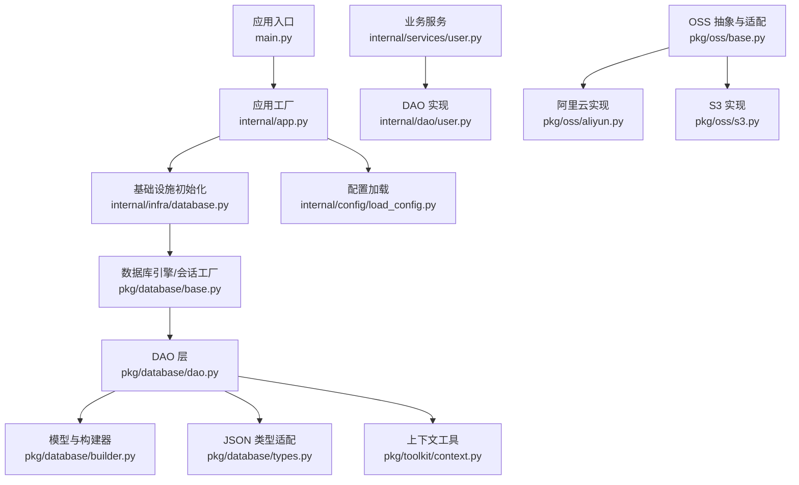
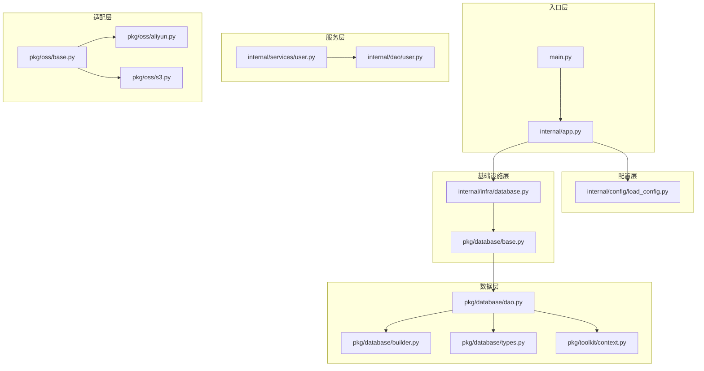
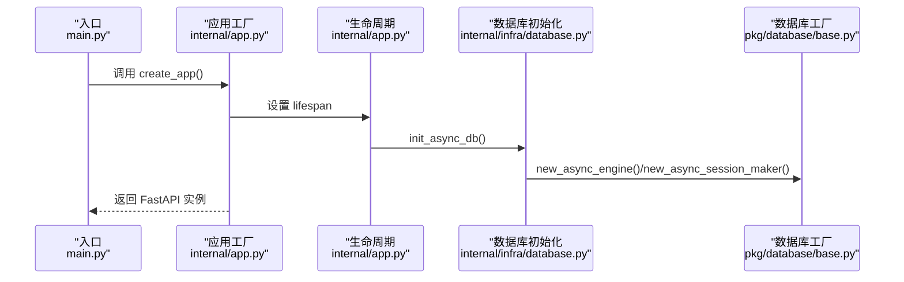
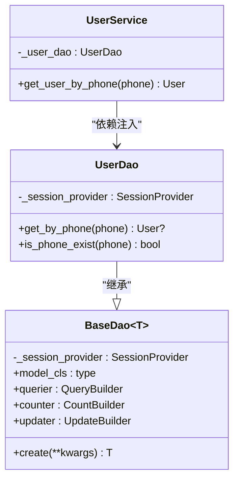
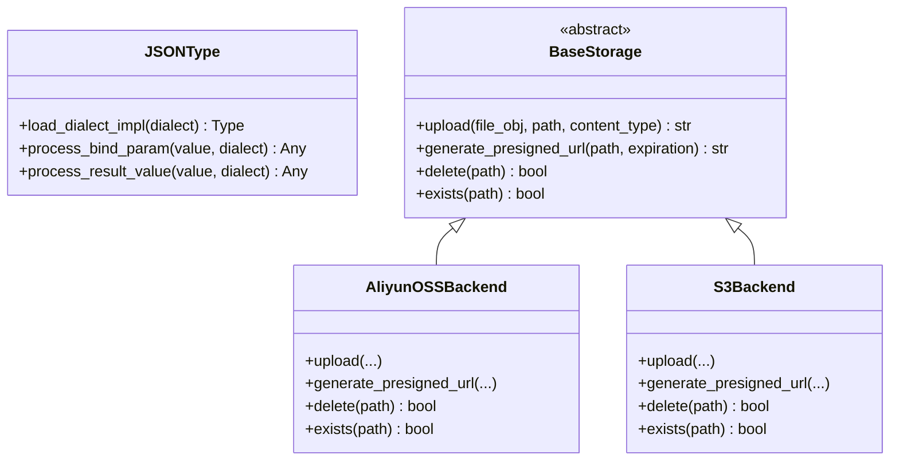
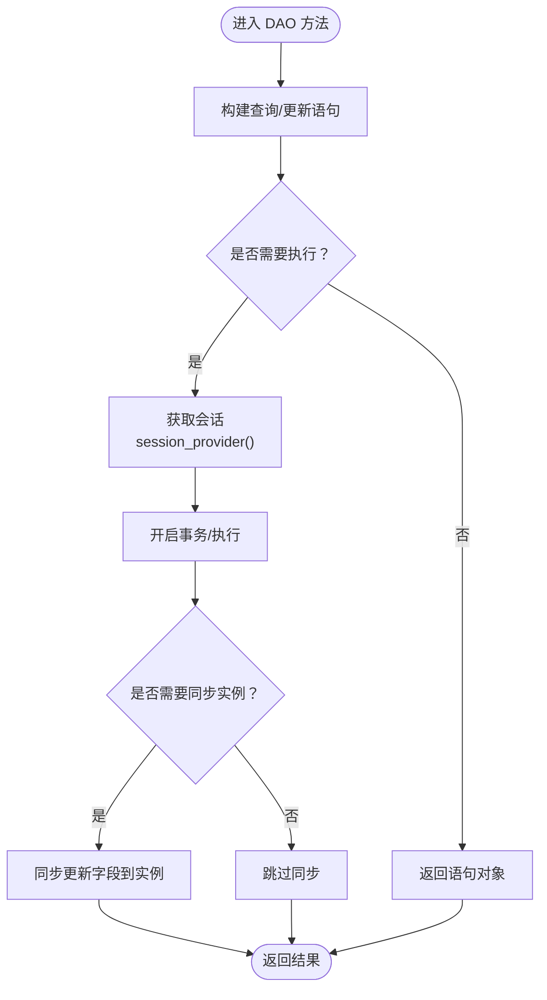
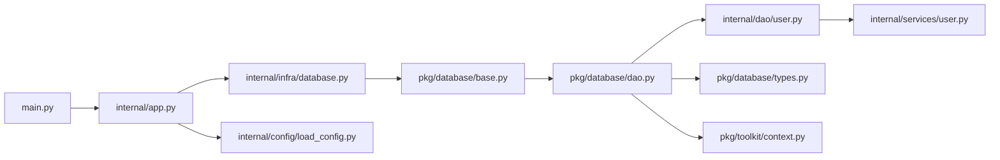

# 设计模式应用

<cite>
**本文引用的文件**
- [internal/app.py](file://internal/app.py)
- [pkg/database/base.py](file://pkg/database/base.py)
- [pkg/database/builder.py](file://pkg/database/builder.py)
- [pkg/database/dao.py](file://pkg/database/dao.py)
- [pkg/database/types.py](file://pkg/database/types.py)
- [internal/infra/database.py](file://internal/infra/database.py)
- [pkg/toolkit/context.py](file://pkg/toolkit/context.py)
- [internal/config/load_config.py](file://internal/config/load_config.py)
- [main.py](file://main.py)
- [internal/dao/user.py](file://internal/dao/user.py)
- [internal/services/user.py](file://internal/services/user.py)
- [pkg/oss/base.py](file://pkg/oss/base.py)
- [pkg/oss/aliyun.py](file://pkg/oss/aliyun.py)
- [pkg/oss/s3.py](file://pkg/oss/s3.py)
</cite>

## 目录
1. [简介](#简介)
2. [项目结构](#项目结构)
3. [核心组件](#核心组件)
4. [架构总览](#架构总览)
5. [详细组件分析](#详细组件分析)
6. [依赖关系分析](#依赖关系分析)
7. [性能考量](#性能考量)
8. [故障排查指南](#故障排查指南)
9. [结论](#结论)
10. [附录](#附录)

## 简介
本文件聚焦于本项目的“设计模式应用”，系统梳理并深入解析以下模式在代码中的落地与协同：
- 工厂模式：在应用实例创建、数据库引擎与会话工厂、配置加载中的使用
- 依赖注入模式：通过“工厂函数”实现的注入，以及服务层对 DAO 的注入
- 适配器/策略模式：在数据库类型适配（JSONType）与对象存储适配（OSS）中的应用

同时，文档给出每种模式解决的问题、带来的优势、潜在权衡，以及它们在整体架构中的角色与协作关系。

## 项目结构
项目采用按职责分层的组织方式：
- 应用入口与生命周期：main.py、internal/app.py
- 配置与环境：internal/config/load_config.py
- 基础设施：internal/infra/database.py（数据库连接池与会话工厂）
- 数据访问层：pkg/database/*（模型基类、构建器、DAO、类型适配）
- 业务服务层：internal/services/user.py
- 数据访问实现：internal/dao/user.py
- 上下文工具：pkg/toolkit/context.py
- 对象存储适配：pkg/oss/*（抽象接口与多实现）

图表来源
- [main.py](file://main.py#L1-L18)
- [internal/app.py](file://internal/app.py#L17-L109)
- [internal/infra/database.py](file://internal/infra/database.py#L26-L154)
- [pkg/database/base.py](file://pkg/database/base.py#L19-L46)
- [pkg/database/dao.py](file://pkg/database/dao.py#L15-L203)
- [pkg/database/builder.py](file://pkg/database/builder.py#L18-L273)
- [pkg/database/types.py](file://pkg/database/types.py#L12-L183)
- [pkg/toolkit/context.py](file://pkg/toolkit/context.py#L1-L107)
- [internal/services/user.py](file://internal/services/user.py#L1-L20)
- [internal/dao/user.py](file://internal/dao/user.py#L1-L24)
- [pkg/oss/base.py](file://pkg/oss/base.py#L1-L42)
- [pkg/oss/aliyun.py](file://pkg/oss/aliyun.py#L1-L66)
- [pkg/oss/s3.py](file://pkg/oss/s3.py#L1-L83)

章节来源
- [internal/app.py](file://internal/app.py#L17-L109)
- [internal/infra/database.py](file://internal/infra/database.py#L26-L154)
- [pkg/database/base.py](file://pkg/database/base.py#L19-L46)
- [pkg/database/dao.py](file://pkg/database/dao.py#L15-L203)
- [pkg/database/builder.py](file://pkg/database/builder.py#L18-L273)
- [pkg/database/types.py](file://pkg/database/types.py#L12-L183)
- [pkg/toolkit/context.py](file://pkg/toolkit/context.py#L1-L107)
- [internal/config/load_config.py](file://internal/config/load_config.py#L46-L243)
- [main.py](file://main.py#L1-L18)
- [internal/dao/user.py](file://internal/dao/user.py#L1-L24)
- [internal/services/user.py](file://internal/services/user.py#L1-L20)
- [pkg/oss/base.py](file://pkg/oss/base.py#L1-L42)
- [pkg/oss/aliyun.py](file://pkg/oss/aliyun.py#L1-L66)
- [pkg/oss/s3.py](file://pkg/oss/s3.py#L1-L83)

## 核心组件
- 应用工厂与生命周期：通过 create_app() 组合路由、中间件、异常处理与 lifespan，集中管理资源初始化与释放
- 数据库工厂与会话提供者：new_async_engine/new_async_session_maker 提供可插拔的引擎与会话工厂；get_session 作为 SessionProvider 工厂函数
- DAO 与构建器：BaseDao/QueryBuilder/UpdateBuilder/CountBuilder 提供统一的数据访问与查询构建能力
- JSON 类型适配：JSONType 适配 PostgreSQL/MySQL/SQLite/Oracle 等方言的 JSON 存储差异
- 依赖注入：通过工厂函数（get_session、get_settings）与构造函数注入（UserService -> UserDao -> BaseDao），实现松耦合
- OSS 适配：BaseStorage 抽象 + 注册表 + 多实现（阿里云、S3），实现存储后端的可替换性

章节来源
- [internal/app.py](file://internal/app.py#L17-L109)
- [pkg/database/base.py](file://pkg/database/base.py#L19-L46)
- [pkg/database/dao.py](file://pkg/database/dao.py#L15-L203)
- [pkg/database/builder.py](file://pkg/database/builder.py#L18-L273)
- [pkg/database/types.py](file://pkg/database/types.py#L12-L183)
- [internal/infra/database.py](file://internal/infra/database.py#L85-L111)
- [internal/services/user.py](file://internal/services/user.py#L5-L20)
- [internal/dao/user.py](file://internal/dao/user.py#L6-L24)
- [pkg/oss/base.py](file://pkg/oss/base.py#L14-L42)

## 架构总览
本项目通过“工厂函数 + 依赖注入 + 抽象适配”的组合，形成清晰的分层与解耦：
- 入口层：main.py 调用 create_app()，内部通过 lifespan 初始化数据库、Redis、签名认证等
- 配置层：get_settings() 作为工厂函数，按环境动态生成配置与连接串
- 数据层：BaseDao 与构建器提供 CRUD 与查询能力；JSONType 保证跨数据库 JSON 存储一致性
- 服务层：UserService 通过构造函数注入 UserDao，实现业务逻辑与数据访问分离
- 适配层：OSS 抽象 + 注册表 + 多实现，支持在运行时选择具体后端

图表来源
- [main.py](file://main.py#L1-L18)
- [internal/app.py](file://internal/app.py#L17-L109)
- [internal/config/load_config.py](file://internal/config/load_config.py#L179-L243)
- [internal/infra/database.py](file://internal/infra/database.py#L26-L111)
- [pkg/database/base.py](file://pkg/database/base.py#L19-L46)
- [pkg/database/dao.py](file://pkg/database/dao.py#L15-L203)
- [pkg/database/builder.py](file://pkg/database/builder.py#L18-L273)
- [pkg/database/types.py](file://pkg/database/types.py#L12-L183)
- [pkg/toolkit/context.py](file://pkg/toolkit/context.py#L1-L107)
- [internal/services/user.py](file://internal/services/user.py#L1-L20)
- [internal/dao/user.py](file://internal/dao/user.py#L1-L24)
- [pkg/oss/base.py](file://pkg/oss/base.py#L1-L42)
- [pkg/oss/aliyun.py](file://pkg/oss/aliyun.py#L1-L66)
- [pkg/oss/s3.py](file://pkg/oss/s3.py#L1-L83)

## 详细组件分析

### 工厂模式：应用实例创建与数据库工厂
- 应用工厂：create_app() 负责装配路由、中间件、异常处理与 lifespan，集中管理资源生命周期
- 数据库工厂：new_async_engine/new_async_session_maker 提供可配置的引擎与会话工厂；get_session 作为 SessionProvider 工厂函数，供 DAO 注入
- 配置工厂：get_settings() 作为工厂函数，按环境加载配置并生成连接串，支持缓存与解密

图表来源
- [main.py](file://main.py#L1-L18)
- [internal/app.py](file://internal/app.py#L17-L109)
- [internal/infra/database.py](file://internal/infra/database.py#L26-L56)
- [pkg/database/base.py](file://pkg/database/base.py#L19-L46)

章节来源
- [internal/app.py](file://internal/app.py#L17-L109)
- [internal/infra/database.py](file://internal/infra/database.py#L26-L111)
- [pkg/database/base.py](file://pkg/database/base.py#L19-L46)
- [internal/config/load_config.py](file://internal/config/load_config.py#L179-L243)

优势
- 统一入口与生命周期管理，降低资源泄漏风险
- 工厂函数隔离配置细节，便于测试与替换

权衡
- 工厂函数过多可能增加调用链复杂度，需配合清晰的模块边界

### 依赖注入模式：通过工厂函数实现注入
- 会话注入：UserDAO 构造时注入 SessionProvider（get_session），DAO 内部通过 session_provider() 获取会话
- 服务注入：UserService 构造时注入 UserDao，实现业务与数据访问解耦
- 配置注入：get_settings() 作为工厂函数，被上层模块按需调用

图表来源
- [internal/services/user.py](file://internal/services/user.py#L5-L20)
- [internal/dao/user.py](file://internal/dao/user.py#L6-L24)
- [pkg/database/dao.py](file://pkg/database/dao.py#L15-L91)

章节来源
- [internal/services/user.py](file://internal/services/user.py#L5-L20)
- [internal/dao/user.py](file://internal/dao/user.py#L6-L24)
- [pkg/database/dao.py](file://pkg/database/dao.py#L15-L91)

优势
- 降低模块间耦合，提升可测试性与可替换性
- 易于在测试中注入 Mock

权衡
- 需要明确注入点与生命周期，避免重复创建昂贵对象

### 适配器/策略模式：数据库类型适配与对象存储适配
- 数据库 JSON 类型适配：JSONType 根据方言选择最优存储方式（PostgreSQL JSONB、MySQL JSON、SQLite JSON、Oracle 原生/LOB），并在 bind/result 阶段进行序列化/反序列化与容错处理
- 对象存储适配：BaseStorage 抽象 + register_storage 装饰器 + 注册表，实现阿里云 OSS 与 S3 的可替换性

图表来源
- [pkg/database/types.py](file://pkg/database/types.py#L12-L183)
- [pkg/oss/base.py](file://pkg/oss/base.py#L26-L42)
- [pkg/oss/aliyun.py](file://pkg/oss/aliyun.py#L9-L66)
- [pkg/oss/s3.py](file://pkg/oss/s3.py#L11-L83)

章节来源
- [pkg/database/types.py](file://pkg/database/types.py#L12-L183)
- [pkg/oss/base.py](file://pkg/oss/base.py#L14-L42)
- [pkg/oss/aliyun.py](file://pkg/oss/aliyun.py#L9-L66)
- [pkg/oss/s3.py](file://pkg/oss/s3.py#L11-L83)

优势
- 跨平台/跨供应商能力，提升可移植性与扩展性
- 通过注册表/装饰器实现声明式注册，降低耦合

权衡
- 适配器数量增多时需维护注册表与配置，注意命名与版本兼容

### 复杂逻辑流程：DAO 查询与更新
- 查询流程：QueryBuilder 通过链式条件构建 SQL，最终在 session_provider 上下文中执行
- 更新流程：UpdateBuilder 收集更新字段，自动同步 updated_at/updater_id/deleted_at 等字段，并在执行时同步到实例

图表来源
- [pkg/database/builder.py](file://pkg/database/builder.py#L111-L162)
- [pkg/database/builder.py](file://pkg/database/builder.py#L192-L261)
- [pkg/database/dao.py](file://pkg/database/dao.py#L106-L203)

章节来源
- [pkg/database/builder.py](file://pkg/database/builder.py#L111-L162)
- [pkg/database/builder.py](file://pkg/database/builder.py#L192-L261)
- [pkg/database/dao.py](file://pkg/database/dao.py#L106-L203)

## 依赖关系分析
- 应用层依赖配置与基础设施；基础设施依赖数据库工厂；DAO 依赖会话提供者；服务层依赖 DAO；适配层通过注册表实现多实现可替换
- 关键依赖链：main.py -> internal/app.py -> internal/infra/database.py -> pkg/database/base.py -> pkg/database/dao.py -> internal/dao/user.py -> internal/services/user.py

图表来源
- [main.py](file://main.py#L1-L18)
- [internal/app.py](file://internal/app.py#L17-L109)
- [internal/infra/database.py](file://internal/infra/database.py#L26-L111)
- [pkg/database/base.py](file://pkg/database/base.py#L19-L46)
- [pkg/database/dao.py](file://pkg/database/dao.py#L15-L203)
- [internal/dao/user.py](file://internal/dao/user.py#L1-L24)
- [internal/services/user.py](file://internal/services/user.py#L1-L20)
- [internal/config/load_config.py](file://internal/config/load_config.py#L179-L243)
- [pkg/database/types.py](file://pkg/database/types.py#L12-L183)
- [pkg/toolkit/context.py](file://pkg/toolkit/context.py#L1-L107)

章节来源
- [main.py](file://main.py#L1-L18)
- [internal/app.py](file://internal/app.py#L17-L109)
- [internal/infra/database.py](file://internal/infra/database.py#L26-L111)
- [pkg/database/base.py](file://pkg/database/base.py#L19-L46)
- [pkg/database/dao.py](file://pkg/database/dao.py#L15-L203)
- [internal/dao/user.py](file://internal/dao/user.py#L1-L24)
- [internal/services/user.py](file://internal/services/user.py#L1-L20)
- [internal/config/load_config.py](file://internal/config/load_config.py#L179-L243)
- [pkg/database/types.py](file://pkg/database/types.py#L12-L183)
- [pkg/toolkit/context.py](file://pkg/toolkit/context.py#L1-L107)

## 性能考量
- 工厂函数幂等与缓存：get_settings() 使用缓存减少重复解析；数据库引擎与会话工厂一次性创建，避免频繁重建
- 会话与事务：DAO 通过 session_provider 获取会话，统一在事务上下文中执行，减少连接开销
- JSON 类型序列化：JSONType 在不同方言下选择最优序列化策略，避免不必要的转换
- 异步与线程：OSS 上传通过 anyio.to_thread.run_sync 将阻塞操作移至线程池，避免阻塞事件循环

## 故障排查指南
- 配置加载失败：检查 .secrets 与环境配置文件是否存在，确认 APP_ENV 与 DB_TYPE 合法
- 数据库未初始化：确保 lifespan 中调用 init_async_db，get_session 在初始化后使用
- 事务执行异常：execute_transaction 会在回调异常时自动回滚，查看具体回调逻辑与异常栈
- JSON 类型读取异常：JSONType 对非 JSON 文本具备容错，若出现异常请检查存储值与方言实现

章节来源
- [internal/config/load_config.py](file://internal/config/load_config.py#L179-L243)
- [internal/infra/database.py](file://internal/infra/database.py#L85-L111)
- [pkg/database/dao.py](file://pkg/database/dao.py#L106-L203)
- [pkg/database/types.py](file://pkg/database/types.py#L116-L146)

## 结论
本项目通过工厂模式、依赖注入与适配器/策略模式，实现了高内聚、低耦合、可扩展的后端架构：
- 工厂模式统一了实例创建与资源配置，降低了初始化成本与错误率
- 依赖注入提升了模块间的解耦与可测试性
- 适配器/策略模式增强了跨数据库与跨存储的可移植性
建议在后续演进中持续完善注册表与工厂函数的文档与测试，确保模式的一致性与可维护性。

## 附录
- 术语
  - 工厂函数：负责创建与配置对象的函数，常用于依赖注入与资源管理
  - 会话提供者：一种可调用对象，用于获取数据库会话上下文
  - 适配器/策略：通过抽象接口与多实现，实现运行时可替换的算法或组件