# 上下文与追踪

<cite>
**本文档中引用的文件**
- [pkg/ctx.py](file://pkg/ctx.py)
- [internal/middleware/recorder.py](file://internal/middleware/recorder.py)
- [internal/middleware/auth.py](file://internal/middleware/auth.py)
- [pkg/logger_tool.py](file://pkg/logger_tool.py)
- [internal/app.py](file://internal/app.py)
- [tests/test_context.py](file://tests/test_context.py)
- [pkg/anyio_task.py](file://pkg/anyio_task.py)
</cite>

## 目录
1. [简介](#简介)
2. [项目结构概览](#项目结构概览)
3. [核心组件分析](#核心组件分析)
4. [架构设计](#架构设计)
5. [详细组件分析](#详细组件分析)
6. [中间件执行流程](#中间件执行流程)
7. [全链路追踪机制](#全链路追踪机制)
8. [上下文隔离与传播](#上下文隔离与传播)
9. [常见问题与调试](#常见问题与调试)
10. [最佳实践](#最佳实践)
11. [总结](#总结)

## 简介

本文档详细阐述了 FastAPI 后端项目中基于 Python `contextvars` 实现的异步上下文管理机制。该系统通过 `_RequestCtxManager` 类提供了完整的请求上下文生命周期管理，支持全链路追踪和用户身份传递，确保在复杂的异步调用链中能够正确传递和维护关键业务数据。

核心特性包括：
- 基于 Python `contextvars` 的异步上下文隔离
- 自动化的全链路追踪 ID 管理
- 安全的用户身份传递机制
- 防御性的错误处理和日志记录
- 并发场景下的上下文隔离保证

## 项目结构概览

项目的上下文管理功能分布在以下关键模块中：

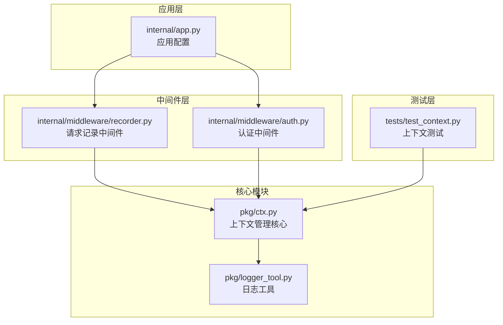

**图表来源**
- [pkg/ctx.py](file://pkg/ctx.py#L1-L106)
- [internal/middleware/recorder.py](file://internal/middleware/recorder.py#L1-L74)
- [internal/middleware/auth.py](file://internal/middleware/auth.py#L1-L93)

## 核心组件分析

### ContextVar 基础结构

系统的核心是基于 Python 标准库的 `contextvars.ContextVar`，它提供了线程安全的上下文变量管理能力：

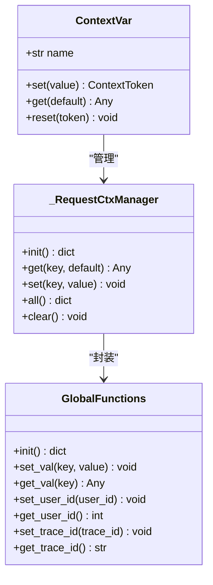

**图表来源**
- [pkg/ctx.py](file://pkg/ctx.py#L6-L60)

**章节来源**
- [pkg/ctx.py](file://pkg/ctx.py#L1-L106)

## 架构设计

### 整体架构图

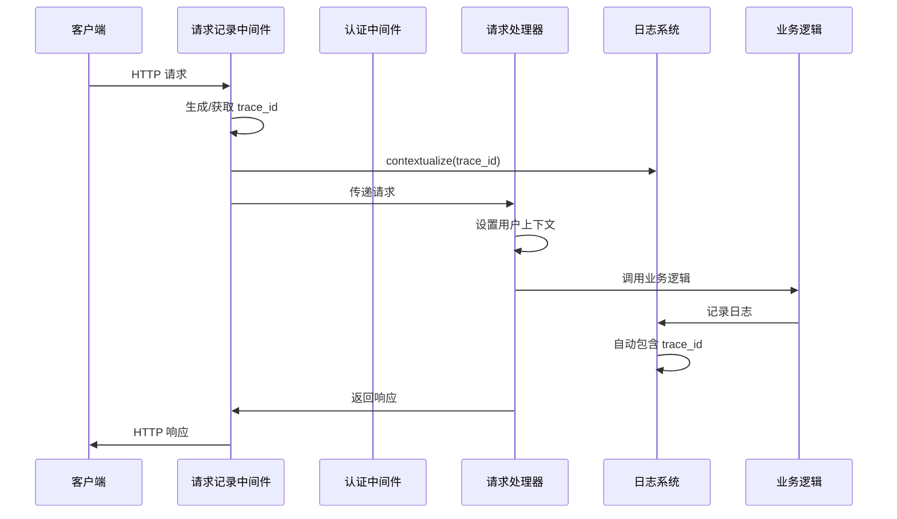

**图表来源**
- [internal/middleware/recorder.py](file://internal/middleware/recorder.py#L16-L74)
- [internal/middleware/auth.py](file://internal/middleware/auth.py#L26-L93)

## 详细组件分析

### _RequestCtxManager 类设计

`_RequestCtxManager` 是上下文管理的核心类，提供了完整的上下文生命周期管理：

#### 初始化机制 (`init()` 方法)

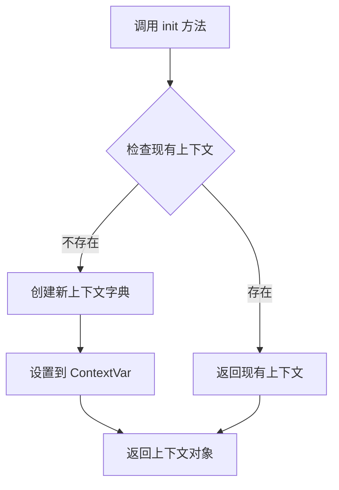

**图表来源**
- [pkg/ctx.py](file://pkg/ctx.py#L14-L24)

#### 数据存储与检索 (`set()` 和 `get()` 方法)

系统实现了智能的上下文管理策略：

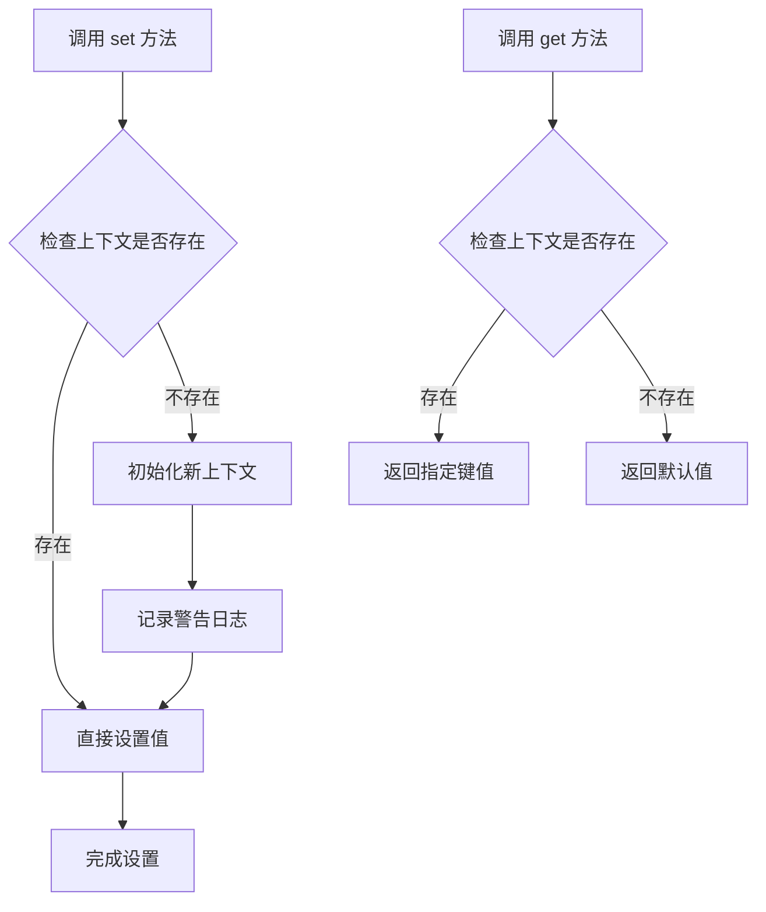

**图表来源**
- [pkg/ctx.py](file://pkg/ctx.py#L35-L58)

#### 特定字段管理

系统为 `trace_id` 和 `user_id` 提供了专门的方法：

| 方法 | 功能 | 参数类型 | 返回类型 | 验证规则 |
|------|------|----------|----------|----------|
| `set_trace_id()` | 设置追踪标识 | `str` | `void` | 必须非空字符串 |
| `get_trace_id()` | 获取追踪标识 | 无 | `str` | 抛出异常时未知或未设置 |
| `set_user_id()` | 设置用户标识 | `int` | `void` | 直接存储 |
| `get_user_id()` | 获取用户标识 | 无 | `int` | 抛出异常时未设置 |

**章节来源**
- [pkg/ctx.py](file://pkg/ctx.py#L76-L105)

### 日志系统集成

日志系统通过 `contextualize` 方法与上下文管理紧密集成：

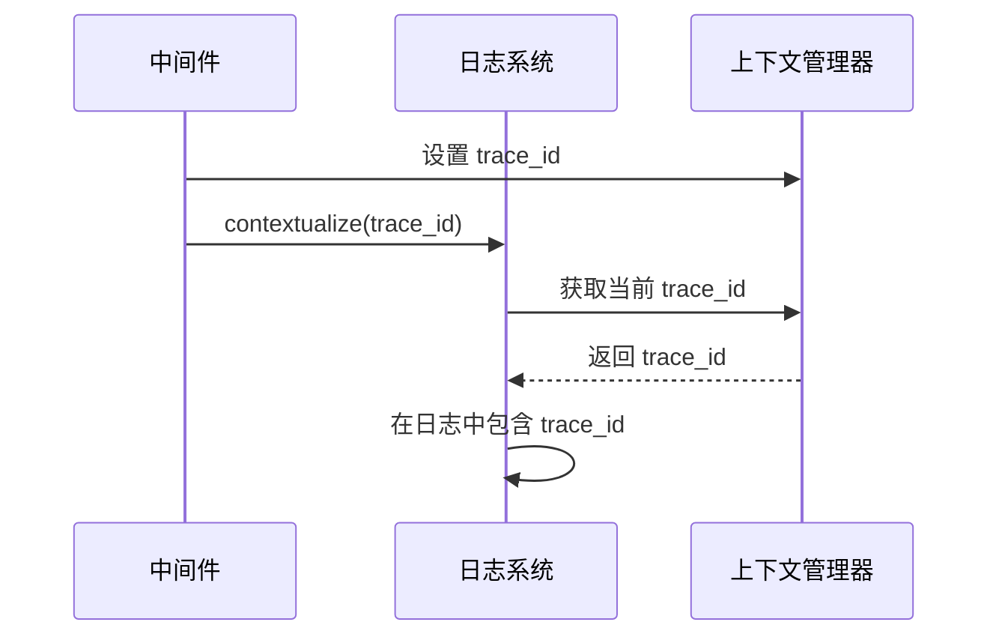

**图表来源**
- [internal/middleware/recorder.py](file://internal/middleware/recorder.py#L26-L28)
- [pkg/logger_tool.py](file://pkg/logger_tool.py#L190-L204)

**章节来源**
- [pkg/logger_tool.py](file://pkg/logger_tool.py#L190-L204)

## 中间件执行流程

### 请求处理管道

系统通过两个关键中间件实现完整的上下文管理：

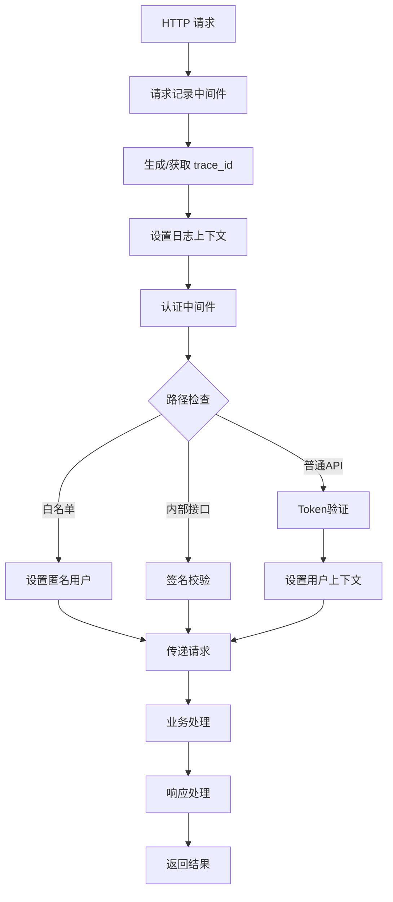

**图表来源**
- [internal/middleware/recorder.py](file://internal/middleware/recorder.py#L16-L74)
- [internal/middleware/auth.py](file://internal/middleware/auth.py#L26-L93)

### 认证中间件流程

认证中间件负责在用户成功验证后设置用户上下文：

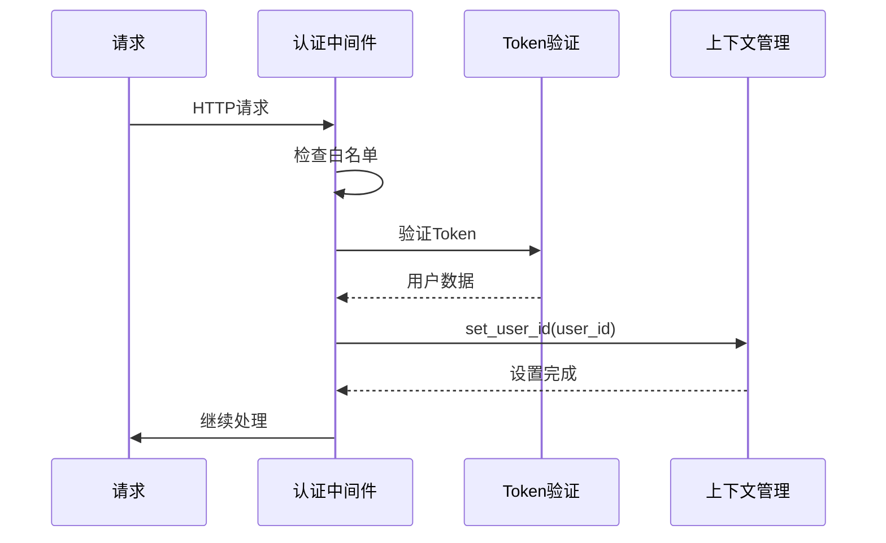

**图表来源**
- [internal/middleware/auth.py](file://internal/middleware/auth.py#L88-L91)

**章节来源**
- [internal/middleware/auth.py](file://internal/middleware/auth.py#L26-L93)

## 全链路追踪机制

### Trace ID 生命周期

系统通过 `trace_id` 实现全链路追踪：

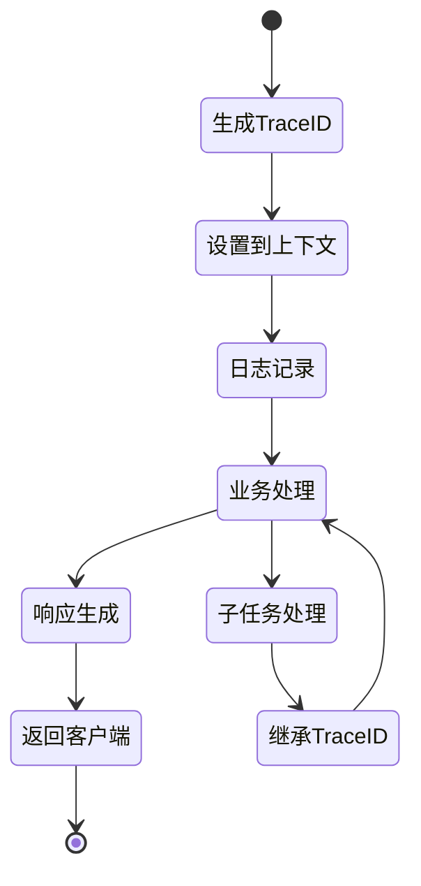

### Trace ID 管理策略

| 场景 | 处理方式 | 结果 |
|------|----------|------|
| 请求首次到达 | 自动生成 UUID | 确保唯一性 |
| 请求头携带 | 使用请求头值 | 支持分布式追踪 |
| 上下文丢失 | 初始化新上下文 | 防御性编程 |
| 日志输出 | 自动附加到每条日志 | 完整追踪链 |

**章节来源**
- [internal/middleware/recorder.py](file://internal/middleware/recorder.py#L22-L25)

## 上下文隔离与传播

### 异步上下文隔离

系统通过 `contextvars` 确保并发请求的上下文隔离：

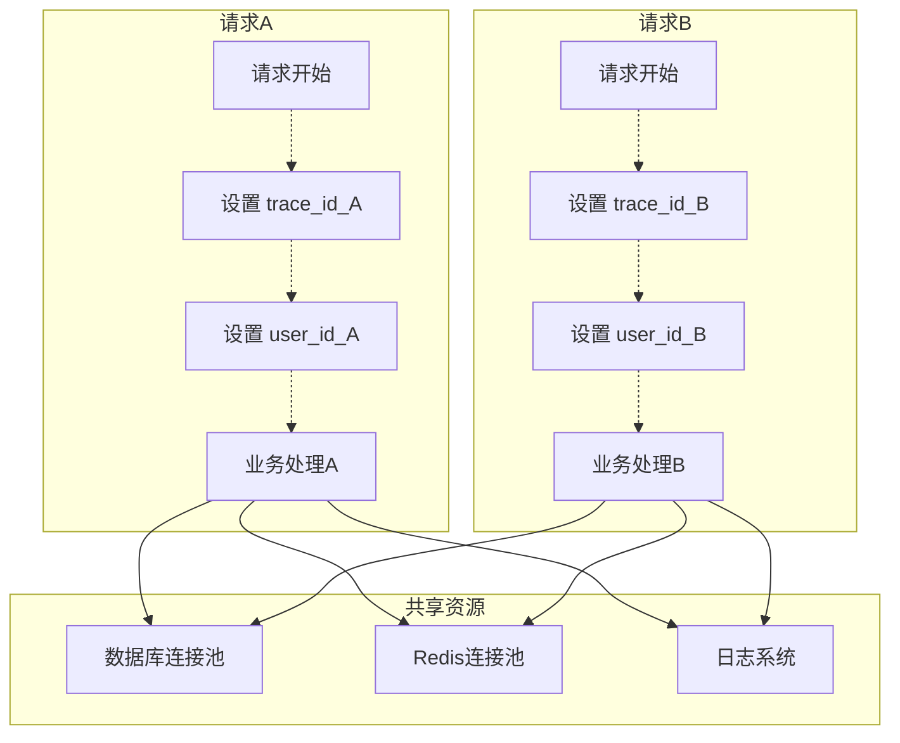

**图表来源**
- [tests/test_context.py](file://tests/test_context.py#L91-L108)

### AnyIO 任务上下文传播

系统通过 `AnyioTaskManager` 确保异步任务中的上下文传播：

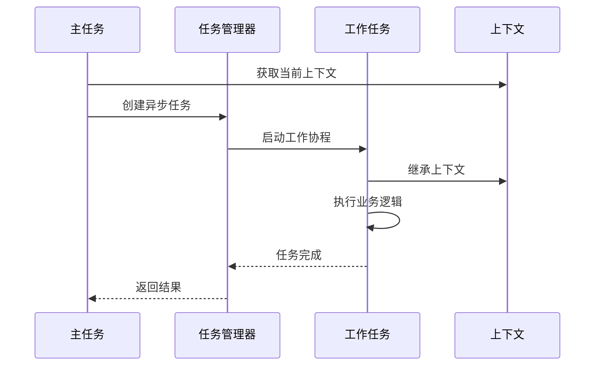

**图表来源**
- [pkg/anyio_task.py](file://pkg/anyio_task.py#L180-L194)

**章节来源**
- [tests/test_context.py](file://tests/test_context.py#L91-L108)
- [pkg/anyio_task.py](file://pkg/anyio_task.py#L180-L194)

## 常见问题与调试

### 上下文丢失的常见原因

1. **中间件配置错误**
   - 中间件加载顺序不正确
   - 中间件未正确注册

2. **异步上下文传播中断**
   - 直接调用同步函数
   - 使用线程池或进程池

3. **上下文初始化缺失**
   - 直接调用业务函数而未初始化上下文

### 调试方法

#### 日志监控

系统会在上下文丢失时记录警告日志：

```python
# 示例：上下文丢失时的日志
logger.warning("RequestContext used without initialization! Check Middleware.")
```

#### 单元测试验证

通过测试用例验证上下文管理的正确性：

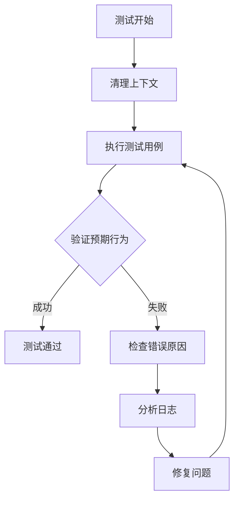

**图表来源**
- [tests/test_context.py](file://tests/test_context.py#L63-L89)

### 问题排查清单

| 问题类型 | 检查点 | 解决方案 |
|----------|--------|----------|
| 上下文未初始化 | 中间件是否正确加载 | 检查中间件注册顺序 |
| Trace ID丢失 | 日志中是否包含正确的trace_id | 验证中间件处理逻辑 |
| 用户ID为空 | 认证中间件是否正常工作 | 检查Token验证逻辑 |
| 并发冲突 | 异步任务是否正确继承上下文 | 验证任务管理器配置 |

**章节来源**
- [tests/test_context.py](file://tests/test_context.py#L63-L89)

## 最佳实践

### 开发规范

1. **始终初始化上下文**
   ```python
   # 错误做法
   user_id = get_user_id()  # 可能抛出异常
   
   # 正确做法
   ctx_manager.init()
   user_id = get_user_id()
   ```

2. **合理使用特定方法**
   ```python
   # 使用专门的方法而非通用方法
   set_trace_id("custom-trace-id")  # 而不是 set_val("trace_id", "custom-trace-id")
   ```

3. **异常处理**
   ```python
   try:
       user_id = get_user_id()
   except LookupError:
       # 处理用户ID未设置的情况
       user_id = 0  # 匿名用户
   ```

### 性能优化

1. **避免频繁的上下文切换**
2. **合理设置超时时间**
3. **使用批量操作减少上下文开销**

### 安全考虑

1. **敏感数据保护**
   - 不要在上下文中存储敏感信息
   - 使用适当的权限控制

2. **追踪数据验证**
   - 验证 `trace_id` 的格式和来源
   - 防止追踪数据伪造

## 总结

FastAPI 后端项目的上下文管理机制通过 Python `contextvars` 实现了完整的异步上下文管理解决方案。该系统具有以下核心优势：

1. **可靠性**：通过防御性编程和错误处理确保系统的稳定性
2. **可扩展性**：模块化设计支持功能扩展和定制
3. **可观测性**：完整的全链路追踪支持问题诊断和性能监控
4. **安全性**：合理的权限控制和数据保护机制

通过中间件的协同工作和全局函数的封装，系统为开发者提供了一个简洁而强大的上下文管理 API，有效解决了异步应用中的上下文传递难题。同时，完善的测试覆盖和调试机制确保了系统的质量和可维护性。

该上下文管理机制不仅满足了当前的业务需求，也为未来的功能扩展奠定了坚实的基础，是现代异步 Web 应用开发的最佳实践之一。