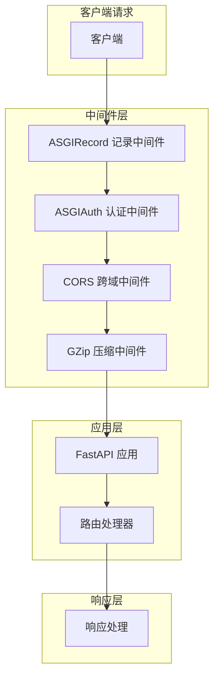
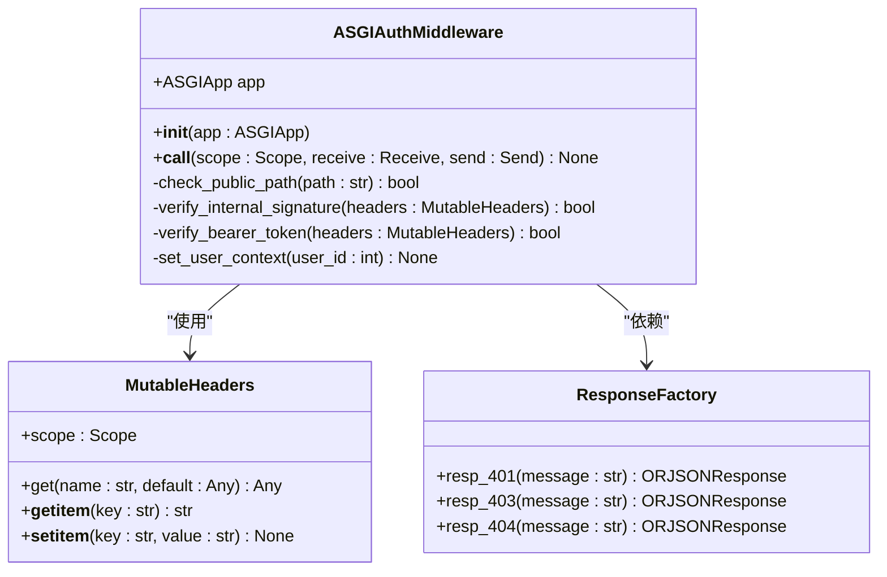
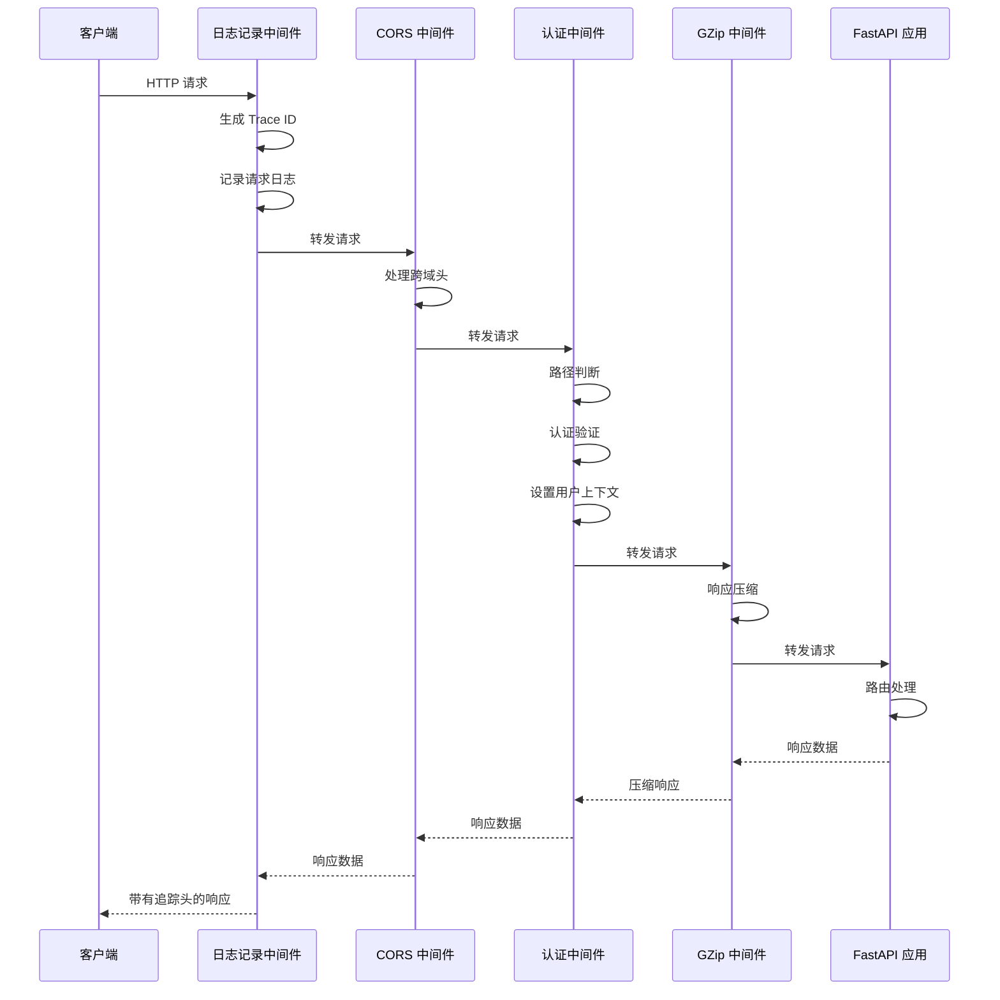
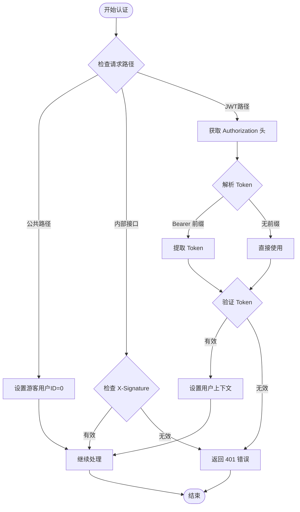
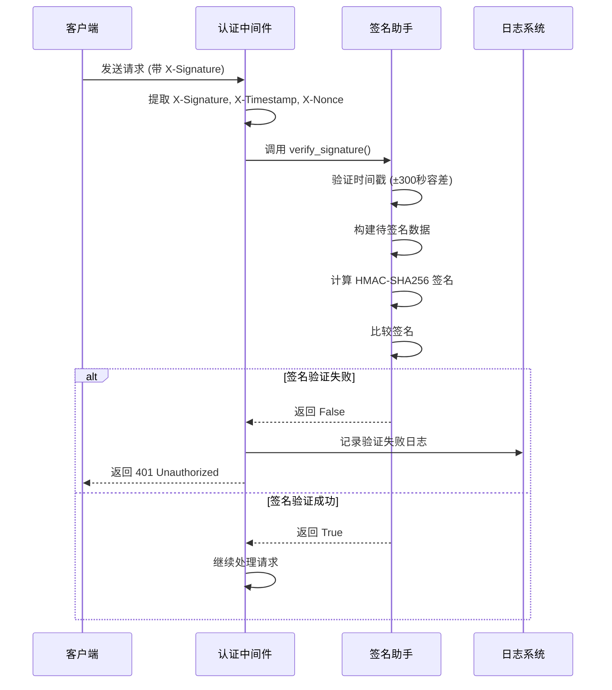
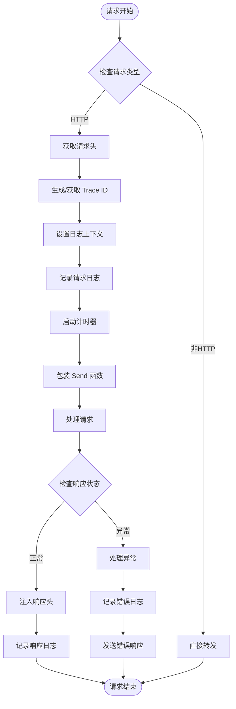
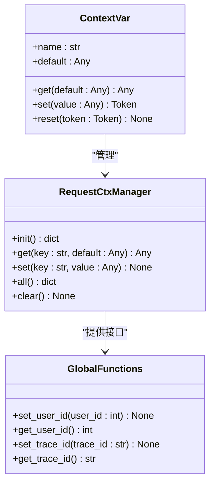

# 中间件机制

<cite>
**本文档中引用的文件**
- [internal/middleware/auth.py](file://internal/middleware/auth.py)
- [internal/middleware/recorder.py](file://internal/middleware/recorder.py)
- [internal/app.py](file://internal/app.py)
- [pkg/jwt.py](file://pkg/jwt.py)
- [pkg/signature.py](file://pkg/signature.py)
- [internal/core/auth_token.py](file://internal/core/auth_token.py)
- [pkg/ctx.py](file://pkg/ctx.py)
- [pkg/logger_tool.py](file://pkg/logger_tool.py)
- [pkg/resp_tool.py](file://pkg/resp_tool.py)
- [main.py](file://main.py)
</cite>

## 目录
1. [简介](#简介)
2. [中间件架构概览](#中间件架构概览)
3. [ASGIAuthMiddleware 核心实现](#asgiauthmiddleware-核心实现)
4. [中间件执行顺序与协同工作](#中间件执行顺序与协同工作)
5. [认证机制详解](#认证机制详解)
6. [日志记录中间件](#日志记录中间件)
7. [上下文管理机制](#上下文管理机制)
8. [安全边界与异常处理](#安全边界与异常处理)
9. [性能考虑与最佳实践](#性能考虑与最佳实践)
10. [故障排除指南](#故障排除指南)

## 简介

本项目采用基于 ASGI 协议的中间件架构，实现了多层次的安全验证和请求处理机制。中间件系统作为 FastAPI 应用程序的核心组件，负责处理认证、授权、日志记录、性能监控等横切关注点，确保系统的安全性、可维护性和可观测性。

中间件链按照特定顺序执行，每个中间件承担不同的职责：
- **日志记录中间件**：负责请求响应日志记录和性能监控
- **认证中间件**：处理各种类型的认证和授权验证
- **CORS 中间件**：处理跨域请求
- **GZip 中间件**：提供响应压缩功能

## 中间件架构概览

**图表来源**
- [internal/app.py](file://internal/app.py#L54-L76)
- [internal/middleware/auth.py](file://internal/middleware/auth.py#L22-L93)
- [internal/middleware/recorder.py](file://internal/middleware/recorder.py#L12-L74)

**章节来源**
- [internal/app.py](file://internal/app.py#L54-L76)

## ASGIAuthMiddleware 核心实现

### 类结构设计

ASGIAuthMiddleware 是项目中的核心认证中间件，采用 ASGI 协议规范实现，具备以下特点：

**图表来源**
- [internal/middleware/auth.py](file://internal/middleware/auth.py#L22-L93)
- [pkg/resp_tool.py](file://pkg/resp_tool.py#L75-L209)

### 路径判断与放行机制

ASGIAuthMiddleware 通过 `scope['path']` 判断请求路径，并实施分层放行策略：

#### 1. 公共路径放行
- **前缀匹配**：`/v1/public` 路径下的所有请求
- **白名单匹配**：预定义的公开接口路径集合
- **测试路径**：`/test` 开头的路径

#### 2. 内部接口签名校验
- **路径前缀**：`/v1/internal` 路径下的请求
- **头部验证**：检查 `X-Signature`、`X-Timestamp`、`X-Nonce` 头部
- **签名算法**：使用 HMAC-SHA256 算法验证请求完整性

#### 3. JWT Token 验证
- **认证头部**：从 `Authorization` 头部提取 Bearer Token
- **Token 校验**：验证 JWT Token 的有效性
- **用户上下文**：设置用户身份信息到上下文中

**章节来源**
- [internal/middleware/auth.py](file://internal/middleware/auth.py#L33-L92)

## 中间件执行顺序与协同工作

### 中间件注册顺序

根据 [internal/app.py](file://internal/app.py#L54-L76) 中的注册顺序，中间件按以下优先级执行：

1. **日志记录中间件** (`ASGIRecordMiddleware`)
2. **CORS 中间件** (Starlette 内置)
3. **认证中间件** (`ASGIAuthMiddleware`)
4. **GZip 中间件** (Starlette 内置)

### 执行流程图

**图表来源**
- [internal/app.py](file://internal/app.py#L54-L76)
- [internal/middleware/auth.py](file://internal/middleware/auth.py#L26-L92)
- [internal/middleware/recorder.py](file://internal/middleware/recorder.py#L16-L73)

### 协同工作机制

#### 1. 上下文传递
- **Trace ID 传播**：从日志中间件开始，Trace ID 在整个中间件链中传递
- **用户上下文**：认证中间件将用户信息注入到请求上下文中
- **响应头注入**：日志中间件在响应阶段注入性能指标和追踪信息

#### 2. 错误处理协作
- **早期拦截**：认证中间件在发现无效认证时立即返回 401 响应
- **异常捕获**：日志中间件捕获并处理中间件层的异常
- **响应标准化**：统一的响应工厂确保错误响应格式一致性

**章节来源**
- [internal/middleware/recorder.py](file://internal/middleware/recorder.py#L21-L73)
- [pkg/ctx.py](file://pkg/ctx.py#L60-L106)

## 认证机制详解

### Bearer Token 解析逻辑

ASGIAuthMiddleware 实现了灵活的 Token 解析机制：

**图表来源**
- [internal/middleware/auth.py](file://internal/middleware/auth.py#L33-L92)

### JWT Token 验证流程

#### 1. Token 提取与验证
- **头部解析**：从 `Authorization` 头部提取 Token
- **格式检查**：兼容 `Bearer <token>` 和 `<token>` 两种格式
- **空值检测**：确保 Token 存在且非空

#### 2. Token 校验机制
- **Redis 缓存查询**：从 Redis 缓存中获取 Token 对应的用户数据
- **Token 列表验证**：检查 Token 是否存在于用户的活跃 Token 列表中
- **用户数据提取**：从缓存中提取用户 ID 和其他相关信息

#### 3. 用户上下文设置
- **上下文变量**：使用 `set_user_id()` 将用户 ID 注入到请求上下文中
- **全局可用**：后续的业务逻辑可以通过上下文获取当前用户信息
- **类型安全**：确保用户 ID 的类型正确性和有效性

**章节来源**
- [internal/middleware/auth.py](file://internal/middleware/auth.py#L60-L92)
- [internal/core/auth_token.py](file://internal/core/auth_token.py#L6-L20)

### X-Signature 签名校验

#### 签名验证流程

**图表来源**
- [pkg/signature.py](file://pkg/signature.py#L84-L101)
- [internal/middleware/auth.py](file://internal/middleware/auth.py#L44-L58)

#### 签名算法细节

- **哈希算法**：支持 SHA256、SHA1、MD5 三种算法
- **时间戳验证**：允许 ±300 秒的时间偏差
- **数据排序**：对请求参数进行字典序排序后拼接
- **安全比较**：使用 `hmac.compare_digest()` 防止时序攻击

**章节来源**
- [pkg/signature.py](file://pkg/signature.py#L1-102)

## 日志记录中间件

### 功能特性

ASGIRecordMiddleware 提供了全面的日志记录和性能监控功能：

#### 1. 请求追踪
- **Trace ID 生成**：为每个请求生成唯一的追踪标识
- **上下文绑定**：将 Trace ID 绑定到日志上下文中
- **跨中间件传播**：确保追踪信息在整个请求生命周期中保持一致

#### 2. 性能监控
- **响应时间测量**：精确计算请求处理时间
- **响应头注入**：在响应中添加性能指标
- **实时监控**：提供实时的性能数据

#### 3. 异常处理
- **异常捕获**：捕获中间件层的未处理异常
- **错误响应**：生成标准化的错误响应
- **日志记录**：记录详细的错误堆栈信息

### 实现机制

**图表来源**
- [internal/middleware/recorder.py](file://internal/middleware/recorder.py#L16-L73)

**章节来源**
- [internal/middleware/recorder.py](file://internal/middleware/recorder.py#L12-L74)

## 上下文管理机制

### ContextVar 实现

项目使用 Python 的 `contextvars` 模块实现线程安全的请求上下文管理：

**图表来源**
- [pkg/ctx.py](file://pkg/ctx.py#L1-106)

### 上下文操作流程

#### 1. 上下文初始化
- **自动初始化**：首次访问时自动创建上下文
- **默认值设置**：为缺失的键提供默认值
- **防御性编程**：防止未初始化的访问导致异常

#### 2. 数据存储与检索
- **类型安全**：确保数据类型的一致性
- **快速访问**：使用内存中的字典实现 O(1) 查找
- **命名空间隔离**：不同请求的上下文完全隔离

#### 3. 上下文清理
- **自动清理**：请求结束后自动清理上下文
- **内存管理**：及时释放不再需要的内存
- **资源回收**：确保没有内存泄漏

**章节来源**
- [pkg/ctx.py](file://pkg/ctx.py#L9-L106)

## 安全边界与异常处理

### 认证安全边界

#### 1. 路径级别的安全控制
- **公共接口保护**：明确区分公开和私有接口
- **权限最小化**：只对必要的接口实施严格认证
- **白名单机制**：预定义的白名单减少重复验证逻辑

#### 2. 认证方式的层次化
- **无认证路径**：开放的 API 接口无需认证
- **签名认证**：内部服务间的请求验证
- **Token 认证**：面向最终用户的认证机制

#### 3. 异常处理策略
- **早期返回**：认证失败时立即终止请求处理
- **标准化响应**：统一的错误响应格式
- **安全信息隐藏**：不泄露具体的认证失败原因

### 中间件异常处理

#### 1. 异常捕获范围
- **认证中间件**：处理 Token 验证和签名验证异常
- **日志中间件**：捕获并处理中间件层的所有异常
- **应用层**：交由 FastAPI 的全局异常处理器处理

#### 2. 异常响应机制
- **401 Unauthorized**：认证失败的标准响应
- **403 Forbidden**：授权失败的响应
- **500 Internal Server Error**：系统内部错误的响应

#### 3. 日志记录策略
- **错误级别**：将异常记录为 ERROR 级别
- **上下文信息**：包含 Trace ID 和请求详情
- **堆栈跟踪**：记录完整的异常堆栈信息

**章节来源**
- [internal/middleware/auth.py](file://internal/middleware/auth.py#L49-L92)
- [internal/middleware/recorder.py](file://internal/middleware/recorder.py#L55-L73)

## 性能考虑与最佳实践

### 中间件性能优化

#### 1. 缓存策略
- **Token 缓存**：Redis 缓存用户 Token 信息
- **白名单优化**：使用 set 数据结构加速路径匹配
- **签名缓存**：对频繁验证的签名进行缓存

#### 2. 异步处理
- **异步认证**：使用 `await` 处理耗时的认证操作
- **非阻塞 I/O**：避免在中间件中执行同步 I/O 操作
- **并发控制**：合理控制并发请求数量

#### 3. 内存管理
- **上下文清理**：及时清理请求上下文
- **响应流处理**：避免加载整个响应体到内存
- **连接池管理**：合理配置数据库和缓存连接池

### 最佳实践建议

#### 1. 中间件开发
- **单一职责**：每个中间件只负责一个特定的功能
- **错误处理**：完善的错误处理和日志记录
- **性能监控**：内置性能指标收集

#### 2. 安全配置
- **HTTPS 强制**：生产环境强制使用 HTTPS
- **CORS 限制**：严格限制 CORS 配置
- **速率限制**：实施适当的请求频率限制

#### 3. 监控告警
- **健康检查**：定期检查中间件的健康状态
- **性能指标**：监控中间件的响应时间和错误率
- **安全审计**：记录和审计认证相关的操作

## 故障排除指南

### 常见问题诊断

#### 1. 认证失败问题
- **Token 格式错误**：检查 Token 是否包含正确的前缀
- **Token 过期**：验证 Token 的过期时间
- **Redis 连接**：确认 Redis 服务正常运行
- **缓存失效**：检查 Token 缓存是否被意外清除

#### 2. 签名验证失败
- **时间同步**：确认服务器时间与客户端时间同步
- **密钥配置**：检查签名密钥是否正确配置
- **算法匹配**：验证使用的哈希算法是否一致

#### 3. 中间件性能问题
- **响应时间**：监控中间件的平均响应时间
- **内存使用**：检查中间件的内存占用情况
- **并发处理**：评估中间件的并发处理能力

### 调试技巧

#### 1. 日志分析
- **Trace ID 追踪**：使用 Trace ID 关联整个请求链路
- **层级日志**：启用详细的中间件日志输出
- **性能日志**：记录关键操作的执行时间

#### 2. 网络调试
- **请求头检查**：验证请求头是否包含必要的认证信息
- **响应头分析**：检查响应头是否包含预期的追踪信息
- **网络延迟**：测量网络传输的延迟时间

#### 3. 状态监控
- **健康检查**：定期检查中间件的健康状态
- **错误率统计**：监控各类错误的发生频率
- **资源使用**：跟踪 CPU、内存、网络等资源使用情况

**章节来源**
- [pkg/logger_tool.py](file://pkg/logger_tool.py#L1-275)
- [internal/middleware/auth.py](file://internal/middleware/auth.py#L70-L92)

## 结论

本项目的中间件体系通过精心设计的架构和实现，提供了完整而高效的安全验证和请求处理机制。ASGIAuthMiddleware 作为核心认证组件，通过分层的认证策略和灵活的路径判断，确保了系统的安全性和可扩展性。

中间件链的有序执行和良好的协作机制，使得系统能够在保证安全性的同时，提供优秀的性能和可观测性。完善的异常处理和日志记录机制，为系统的运维和故障排查提供了强有力的支持。

通过遵循本文档中的最佳实践和故障排除指南，开发者可以更好地理解和维护这个中间件系统，确保其在生产环境中的稳定运行。