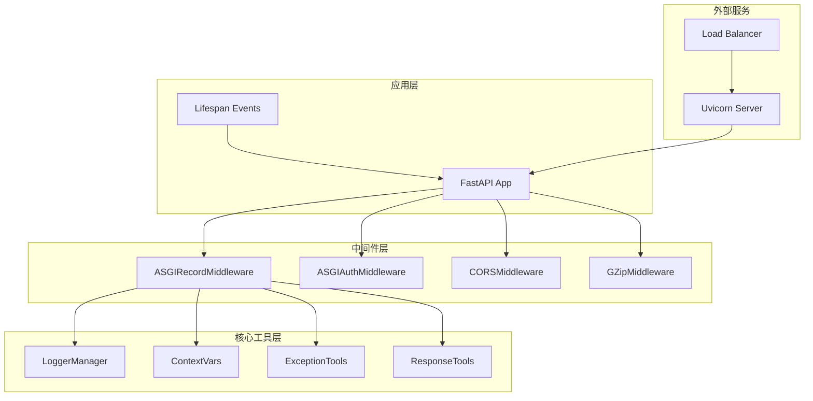
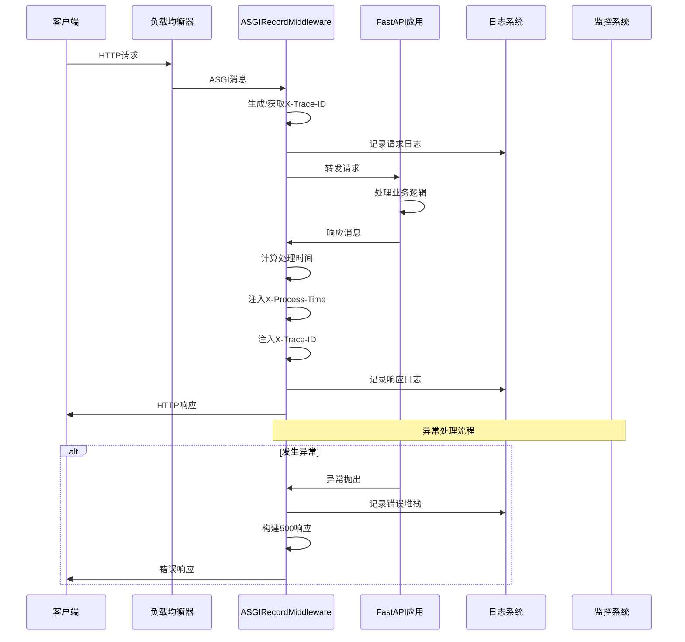
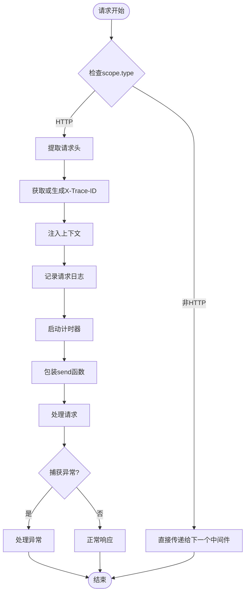
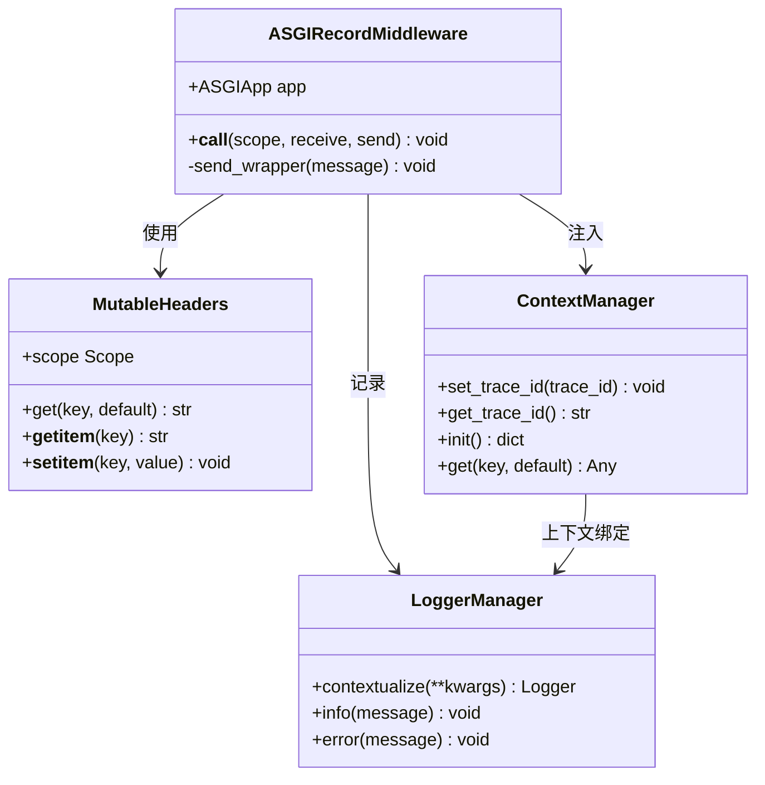
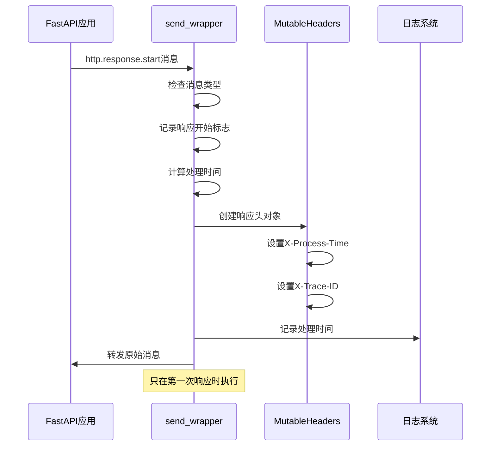
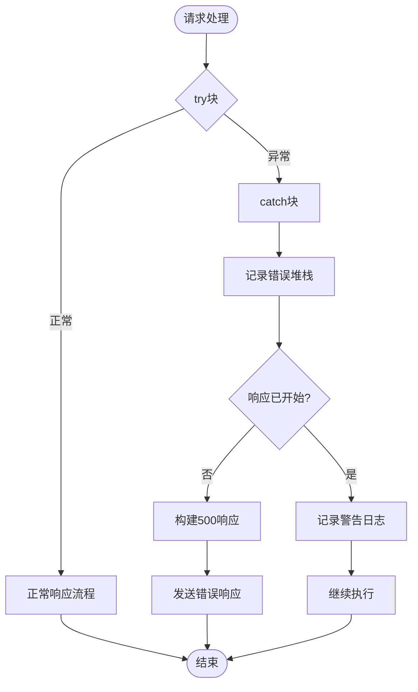
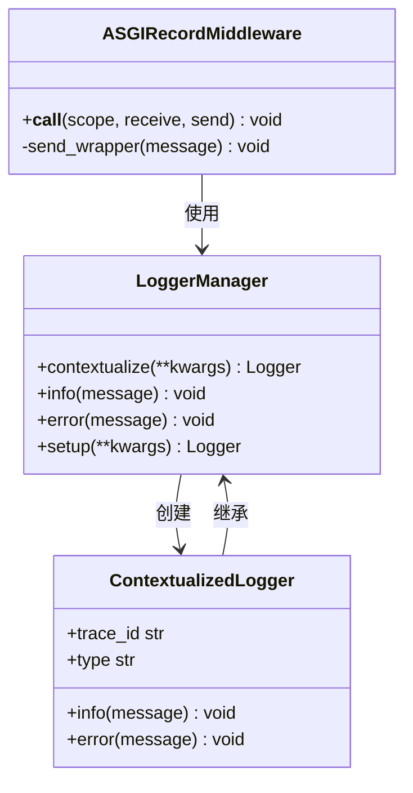
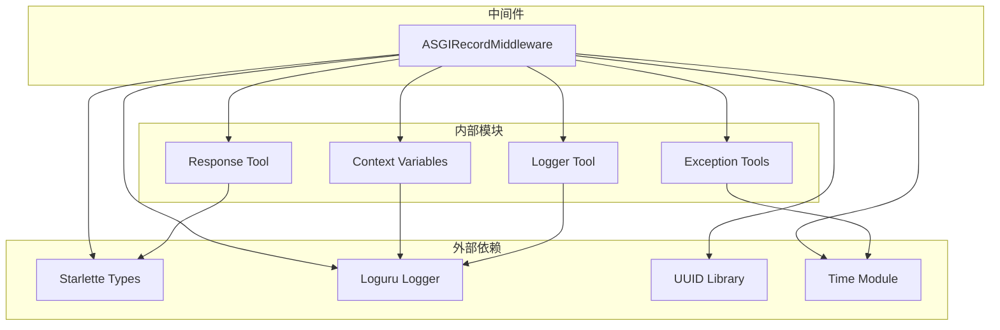

# 日志与监控中间件

<cite>
**本文档中引用的文件**
- [recorder.py](file://internal/middleware/recorder.py)
- [logger_tool.py](file://pkg/logger_tool.py)
- [ctx.py](file://pkg/ctx.py)
- [app.py](file://internal/app.py)
- [exception.py](file://internal/core/exception.py)
- [resp_tool.py](file://pkg/resp_tool.py)
- [main.py](file://main.py)
</cite>

## 目录
1. [简介](#简介)
2. [项目结构](#项目结构)
3. [核心组件](#核心组件)
4. [架构概览](#架构概览)
5. [详细组件分析](#详细组件分析)
6. [依赖关系分析](#依赖关系分析)
7. [性能考虑](#性能考虑)
8. [故障排除指南](#故障排除指南)
9. [结论](#结论)

## 简介

`ASGIRecordMiddleware` 是 FastAPI 后端系统中的核心可观测性中间件，负责在请求生命周期中实现全面的日志记录、性能监控和异常捕获功能。该中间件采用 ASGI 协议规范，深度集成到 FastAPI 应用程序中，为系统提供了完整的链路追踪能力。

该中间件的主要职责包括：
- **全链路追踪**：通过 `X-Trace-ID` 实现请求在整个系统中的可追溯性
- **性能监控**：精确测量请求处理时间并提供性能指标
- **异常处理**：捕获未处理异常并提供结构化的错误响应
- **日志记录**：记录请求和响应的关键信息，支持实时监控和问题排查

## 项目结构

**图表来源**
- [recorder.py](file://internal/middleware/recorder.py#L12-L74)
- [app.py](file://internal/app.py#L54-L76)

**章节来源**
- [recorder.py](file://internal/middleware/recorder.py#L1-L74)
- [app.py](file://internal/app.py#L1-L105)

## 核心组件

### ASGIRecordMiddleware 类

`ASGIRecordMiddleware` 是整个可观测性系统的核心组件，实现了以下关键功能：

#### 初始化机制
- 接收 ASGI 应用实例作为参数
- 支持 ASGI 协议的所有类型（HTTP、WebSocket 等）
- 提供优雅的异常处理和资源清理

#### 请求生命周期管理
- 在请求开始时生成或获取 `X-Trace-ID`
- 注入上下文信息到日志系统
- 记录请求元数据和客户端信息
- 拦截响应消息并注入性能指标

#### 异常处理机制
- 捕获未处理的异常并记录完整堆栈信息
- 在响应未开始前返回结构化的 500 错误响应
- 确保 ASGI 协议状态的一致性

**章节来源**
- [recorder.py](file://internal/middleware/recorder.py#L12-L74)

## 架构概览

**图表来源**
- [recorder.py](file://internal/middleware/recorder.py#L16-L73)
- [logger_tool.py](file://pkg/logger_tool.py#L15-L275)

## 详细组件分析

### __call__ 方法深度解析

`__call__` 方法是中间件的核心入口，实现了完整的请求处理流程：

#### HTTP 类型检查

**图表来源**
- [recorder.py](file://internal/middleware/recorder.py#L16-L73)

#### Trace ID 管理机制

中间件通过 `MutableHeaders` 和 `pkg.ctx.set_trace_id()` 实现高效的 Trace ID 管理：

**图表来源**
- [recorder.py](file://internal/middleware/recorder.py#L22-L28)
- [ctx.py](file://pkg/ctx.py#L88-L106)
- [logger_tool.py](file://pkg/logger_tool.py#L79-L92)

#### 请求日志记录

请求日志记录包含以下关键信息：

| 字段名称 | 数据类型 | 描述 | 示例值 |
|---------|---------|------|--------|
| client_host | str | 客户端IP地址 | "192.168.1.100" |
| method | str | HTTP方法 | "GET", "POST", "PUT", "DELETE" |
| path | str | 请求路径 | "/api/users/123" |
| query_string | str | 查询参数字符串 | "page=1&limit=10" |

日志格式遵循统一的标准，确保监控系统的可解析性。

**章节来源**
- [recorder.py](file://internal/middleware/recorder.py#L30-L33)

### send_wrapper 函数分析

`send_wrapper` 是中间件的核心拦截器，负责在响应阶段注入性能指标：

#### 响应拦截机制

**图表来源**
- [recorder.py](file://internal/middleware/recorder.py#L38-L52)

#### 性能指标注入

响应头注入的性能指标包括：

| 响应头名称 | 数据类型 | 描述 | 示例值 |
|-----------|---------|------|--------|
| X-Process-Time | float | 请求处理时间（秒） | "0.123" |
| X-Trace-ID | str | 全局追踪标识符 | "a1b2c3d4-e5f6-7890-abcd-ef1234567890" |

这些指标为监控系统提供了实时的性能洞察。

**章节来源**
- [recorder.py](file://internal/middleware/recorder.py#L42-L48)

### 异常处理机制

中间件实现了完善的异常处理逻辑，确保系统的稳定性和可观测性：

#### 异常捕获流程

**图表来源**
- [recorder.py](file://internal/middleware/recorder.py#L55-L72)

#### 错误响应构建

当捕获到未处理异常时，中间件会：

1. **记录完整错误堆栈**：使用 `get_last_exec_tb()` 获取异常详情
2. **检查响应状态**：确保在响应开始前处理错误
3. **构建标准化响应**：使用 `response_factory.response()` 创建结构化错误响应
4. **保持协议一致性**：确保 ASGI 协议状态的正确性

**章节来源**
- [recorder.py](file://internal/middleware/recorder.py#L58-L71)
- [exception.py](file://internal/core/exception.py#L19-L22)
- [resp_tool.py](file://pkg/resp_tool.py#L177-L182)

### 日志系统集成

中间件与 `LoggerManager` 深度集成，提供强大的日志记录能力：

#### 上下文化日志

**图表来源**
- [logger_tool.py](file://pkg/logger_tool.py#L79-L92)
- [recorder.py](file://internal/middleware/recorder.py#L27-L28)

#### 日志格式化

日志系统支持多种格式化选项：

| 格式类型 | 输出示例 | 用途 |
|---------|---------|------|
| 控制台格式 | `[2024-01-15 10:30:45.123] | INFO     | middleware.recorder:__call__ - access log, ip=192.168.1.100, method=GET, path=/api/users, query_string=` | 开发环境调试 |
| 文件格式 | `2024-01-15 10:30:45.123 \| INFO     \| middleware.recorder:__call__:32 - access log, ip=192.168.1.100, method=GET, path=/api/users, query_string=` | 生产环境存储 |
| JSON格式 | `{"time":"2024-01-15 10:30:45.123","level":"INFO","name":"middleware.recorder","function":"__call__","line":32,"message":"access log, ip=192.168.1.100, method=GET, path=/api/users, query_string="}` | 结构化日志分析 |

**章节来源**
- [logger_tool.py](file://pkg/logger_tool.py#L189-L252)

## 依赖关系分析

**图表来源**
- [recorder.py](file://internal/middleware/recorder.py#L1-L9)
- [logger_tool.py](file://pkg/logger_tool.py#L1-L9)

### 核心依赖说明

| 依赖模块 | 版本要求 | 用途 | 关键特性 |
|---------|---------|------|---------|
| starlette.types | 最新版本 | ASGI 协议支持 | Scope、Receive、Send 类型定义 |
| loguru | 最新版本 | 日志记录 | 结构化日志、异步写入、轮转策略 |
| uuid | 标准库 | Trace ID 生成 | 唯一标识符生成 |
| time | 标准库 | 性能计时 | 高精度时间测量 |

**章节来源**
- [recorder.py](file://internal/middleware/recorder.py#L1-L9)

## 性能考虑

### 时间测量精度

中间件使用 `time.perf_counter()` 进行高精度时间测量：

- **精度级别**：纳秒级
- **适用场景**：短时间跨度测量
- **优势**：不受系统时钟调整影响

### 内存使用优化

- **惰性加载**：只在需要时创建日志记录器
- **上下文隔离**：使用 `contextvars` 避免全局状态污染
- **响应头缓存**：复用 `MutableHeaders` 对象减少内存分配

### 并发安全性

- **线程安全**：基于 `contextvars` 的上下文变量
- **异步兼容**：完全支持异步请求处理
- **资源清理**：确保异常情况下的资源正确释放

## 故障排除指南

### 常见问题及解决方案

#### Trace ID 丢失问题

**症状**：日志中缺少 `X-Trace-ID` 信息
**原因**：中间件未正确初始化或被其他中间件覆盖
**解决方案**：
1. 检查中间件注册顺序
2. 验证 `ASGIRecordMiddleware` 是否在应用中正确添加
3. 确认 `pkg.ctx.set_trace_id()` 调用位置

#### 性能指标异常

**症状**：`X-Process-Time` 显示不合理的时间值
**原因**：时间测量基准不准确或并发请求干扰
**解决方案**：
1. 检查系统时钟同步
2. 验证并发处理逻辑
3. 调整时间测量策略

#### 异常处理失效

**症状**：未处理异常导致服务器崩溃
**原因**：异常被捕获但未正确转发
**解决方案**：
1. 检查异常捕获逻辑
2. 验证响应状态检查
3. 确认错误响应构建过程

**章节来源**
- [recorder.py](file://internal/middleware/recorder.py#L55-L73)

### 监控指标建议

基于中间件提供的指标，建议监控以下关键指标：

| 指标名称 | 类型 | 监控目的 | 告警阈值 |
|---------|------|---------|---------|
| 请求处理时间 | 分布图 | 性能监控 | >2秒 |
| 错误率 | 百分比 | 系统健康度 | >5% |
| Trace ID 唯一性 | 计数器 | 链路追踪有效性 | 重复率>0.1% |
| 日志记录频率 | 速率 | 系统负载 | >1000 req/s |

## 结论

`ASGIRecordMiddleware` 作为 FastAPI 后端系统的核心可观测性组件，成功实现了以下目标：

### 技术成就

1. **全链路追踪**：通过 `X-Trace-ID` 实现了请求在整个系统中的可追溯性
2. **高性能监控**：精确测量请求处理时间并提供实时性能指标
3. **健壮异常处理**：捕获未处理异常并提供结构化的错误响应
4. **结构化日志**：支持多种日志格式和输出目标

### 架构优势

- **模块化设计**：清晰的职责分离和依赖管理
- **扩展性强**：易于添加新的监控指标和日志格式
- **性能优化**：最小化对请求处理性能的影响
- **兼容性好**：完全符合 ASGI 协议规范

### 实际价值

该中间件在生产环境中为系统运维提供了重要的支撑：
- **问题定位**：通过 Trace ID 快速定位问题请求
- **性能分析**：基于处理时间分布进行性能优化
- **容量规划**：通过请求量和响应时间趋势进行容量评估
- **SLA 监控**：验证系统服务水平协议的达成情况

通过深入理解和正确使用 `ASGIRecordMiddleware`，开发团队可以显著提升系统的可观测性和运维效率，为构建高质量的生产系统奠定坚实基础。