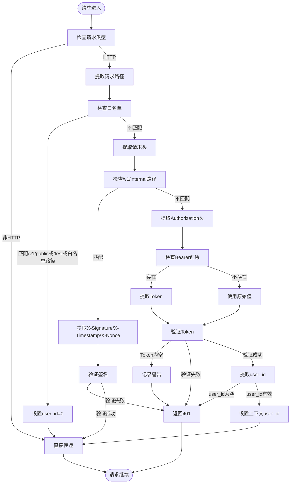
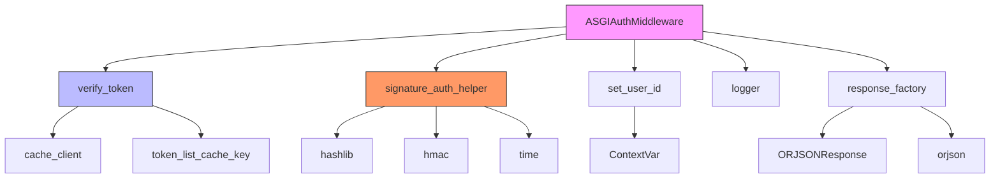

# 认证中间件

<cite>
**本文档中引用的文件**   
- [auth.py](file://internal/middleware/auth.py)
- [auth_token.py](file://internal/core/auth_token.py)
- [signature.py](file://pkg/signature.py)
- [ctx.py](file://pkg/ctx.py)
- [resp_tool.py](file://pkg/resp_tool.py)
- [app.py](file://internal/app.py)
</cite>

## 目录
1. [简介](#简介)
2. [项目结构](#项目结构)
3. [核心组件](#核心组件)
4. [认证流程架构](#认证流程架构)
5. [详细组件分析](#详细组件分析)
6. [依赖分析](#依赖分析)
7. [性能考虑](#性能考虑)
8. [故障排除指南](#故障排除指南)
9. [结论](#结论)

## 简介
本文档深入解析 `ASGIAuthMiddleware` 的实现机制，详细说明其作为 ASGI 中间件在请求处理链中的执行流程。重点阐述路径匹配逻辑、签名校验流程和 JWT Token 验证机制，全面解释该中间件在安全边界控制中的作用。

## 项目结构
本项目采用分层架构设计，主要分为 `internal` 和 `pkg` 两个核心目录。`internal` 目录包含应用内部逻辑，包括配置、常量、控制器、核心功能、数据访问对象、数据传输对象、基础设施、中间件、模型、服务等模块。`pkg` 目录则包含通用工具包，如数据库操作、日志工具、JWT 处理、签名验证等跨领域功能。认证相关的核心逻辑分布在 `internal/middleware/auth.py` 中，依赖于 `pkg` 目录下的各种工具类。

**Section sources**
- [app.py](file://internal/app.py#L1-L105)

## 核心组件
`ASGIAuthMiddleware` 是系统的核心安全组件，负责在请求进入业务逻辑前进行身份验证。该中间件实现了多层级的认证策略：对公开接口进行白名单放行，对内部接口实施 X-Signature 签名校验，对其他接口执行 JWT Token 验证。通过 `MutableHeaders` 解析请求头，利用 `signature_auth_helper` 进行签名校验，并通过 `verify_token` 函数完成 JWT 验证，最终将用户 ID 注入上下文供后续处理使用。

**Section sources**
- [auth.py](file://internal/middleware/auth.py#L1-L93)
- [auth_token.py](file://internal/core/auth_token.py#L1-L20)
- [signature.py](file://pkg/signature.py#L1-L102)

## 认证流程架构

**Diagram sources**
- [auth.py](file://internal/middleware/auth.py#L1-L93)

## 详细组件分析

### 路径匹配与白名单处理
中间件首先通过 `scope['path']` 获取请求路径，然后进行多条件判断。对于以 `/v1/public` 开头的路径、以 `/test` 开头的路径，以及在预定义白名单 `auth_token_white` 中的路径（如登录、注册、文档等接口），中间件会直接放行。这些路径被认为是公开或测试接口，不需要进行复杂的认证。放行前会调用 `set_user_id(0)` 将用户 ID 设置为 0，表示匿名用户。

**Section sources**
- [auth.py](file://internal/middleware/auth.py#L31-L38)

### 内部接口签名校验
对于以 `/v1/internal` 开头的路径，中间件会启动 X-Signature 签名校验流程。首先从请求头中提取 `X-Signature`、`X-Timestamp` 和 `X-Nonce` 三个关键参数。然后调用 `signature_auth_helper.verify()` 方法进行验证。该方法会先校验时间戳是否在允许的误差范围内（防止重放攻击），然后使用 HMAC 算法对 `timestamp` 和 `nonce` 进行签名验证。如果验证失败，立即返回 401 未授权响应。

**Section sources**
- [auth.py](file://internal/middleware/auth.py#L43-L58)
- [signature.py](file://pkg/signature.py#L84-L101)

### JWT Token 验证机制
对于其他路径，中间件会执行 JWT Token 验证。首先通过 `MutableHeaders` 获取 `Authorization` 头部，支持 `Bearer ` 前缀的 Token 提取。如果 Token 为空，则返回 401 响应。然后调用 `verify_token()` 函数进行解码与有效性校验。该函数会从 Redis 缓存中获取 Token 对应的用户数据，并验证该 Token 是否在用户的有效 Token 列表中。验证成功后，从中提取 `user_id` 并通过 `set_user_id()` 注入到请求上下文中，供后续的业务逻辑使用。

**Section sources**
- [auth.py](file://internal/middleware/auth.py#L60-L92)
- [auth_token.py](file://internal/core/auth_token.py#L6-L20)
- [ctx.py](file://pkg/ctx.py#L76-L85)

## 依赖分析

**Diagram sources**
- [auth.py](file://internal/middleware/auth.py#L1-L93)
- [auth_token.py](file://internal/core/auth_token.py#L1-L20)
- [signature.py](file://pkg/signature.py#L1-L102)
- [ctx.py](file://pkg/ctx.py#L1-L106)
- [resp_tool.py](file://pkg/resp_tool.py#L1-L209)

## 性能考虑
中间件的设计充分考虑了性能因素。白名单路径使用 `set` 数据结构存储，确保 O(1) 时间复杂度的快速查找。签名校验和 Token 验证都依赖于高效的加密算法和缓存机制。通过将用户上下文存储在 `ContextVar` 中，避免了全局状态的竞争问题，保证了在异步环境下的线程安全。异常处理流程简洁高效，能够在验证失败时立即返回响应，避免不必要的计算开销。

## 故障排除指南
当认证出现问题时，可以按照以下步骤进行排查：
1. 检查请求路径是否被正确匹配，确认是否应该被白名单放行
2. 对于内部接口，检查 `X-Signature`、`X-Timestamp`、`X-Nonce` 头部是否正确提供
3. 对于普通接口，检查 `Authorization` 头部格式是否正确，是否包含有效的 Bearer Token
4. 查看日志输出，`logger` 会记录详细的验证过程和错误信息
5. 确认 `signature_auth_helper` 的密钥配置是否正确
6. 检查 Redis 缓存中是否存在对应的 Token 数据

**Section sources**
- [auth.py](file://internal/middleware/auth.py#L7-L8)
- [auth_token.py](file://internal/core/auth_token.py#L3-L4)
- [signature.py](file://pkg/signature.py#L6-L7)

## 结论
`ASGIAuthMiddleware` 实现了一个多层次、高安全性的认证体系，能够有效保护系统的各个接口。通过清晰的路径匹配逻辑、严格的签名校验和可靠的 JWT 验证机制，该中间件为整个应用提供了坚实的安全边界。其模块化的设计和对性能的优化，使其成为一个高效、可靠的认证解决方案。