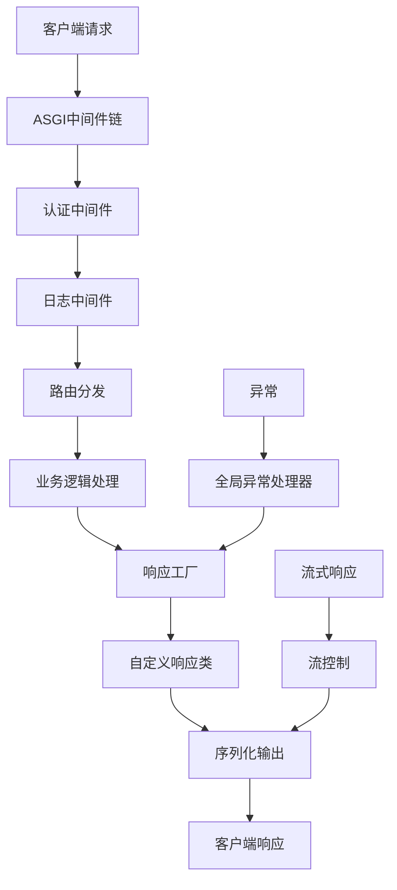
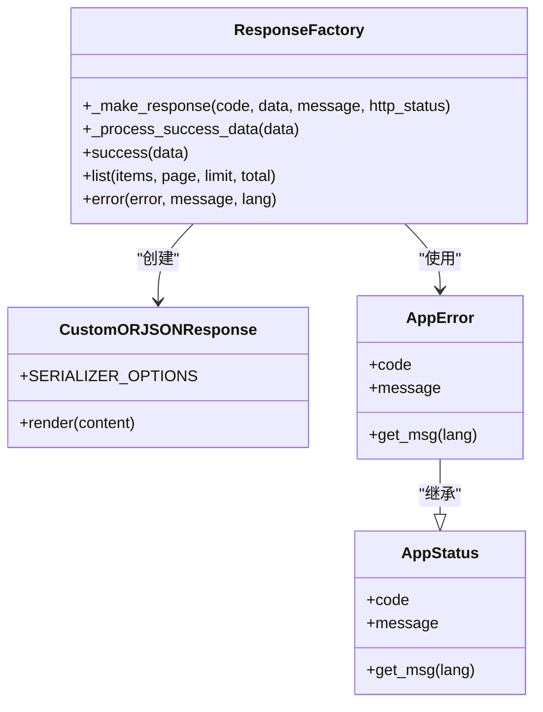
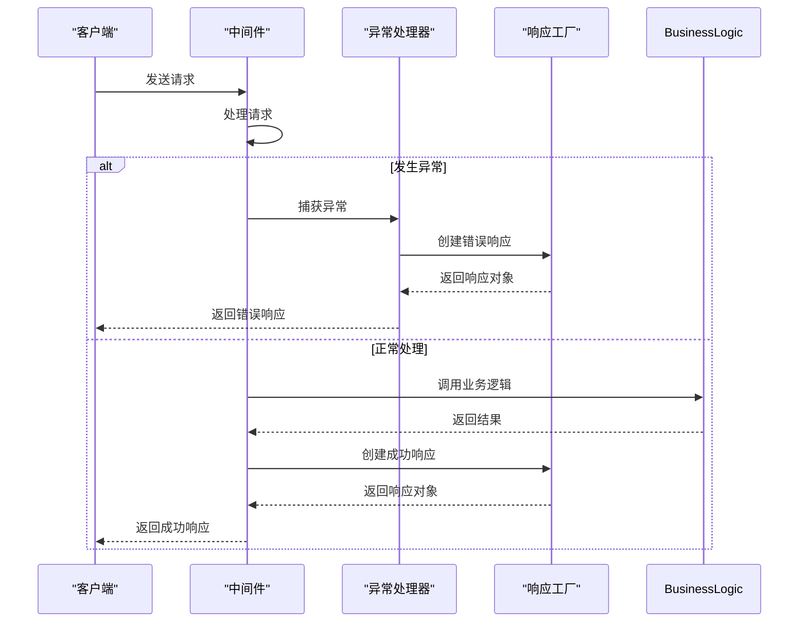
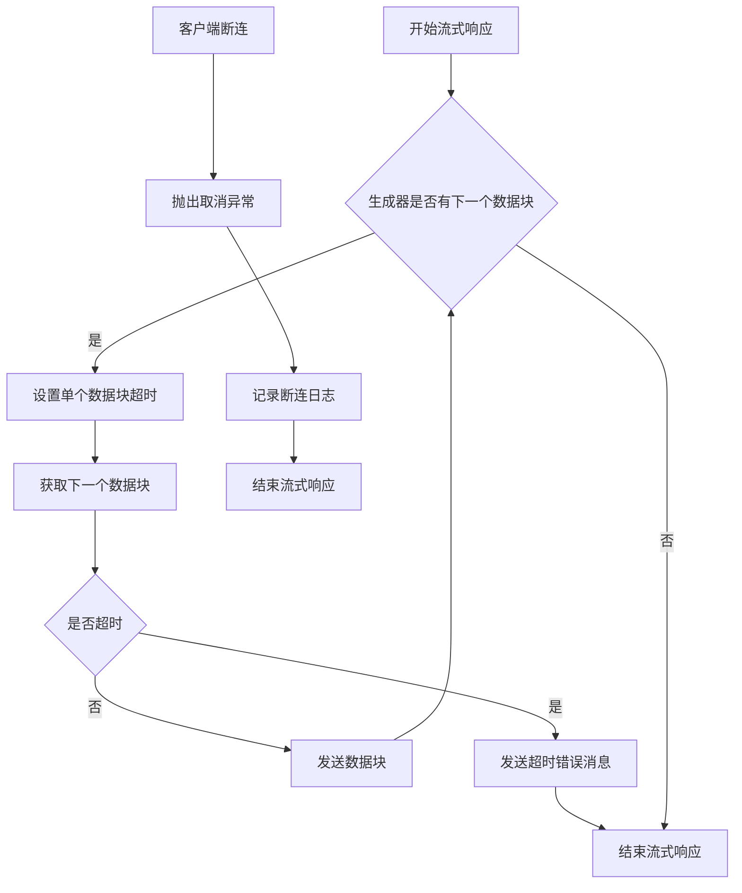
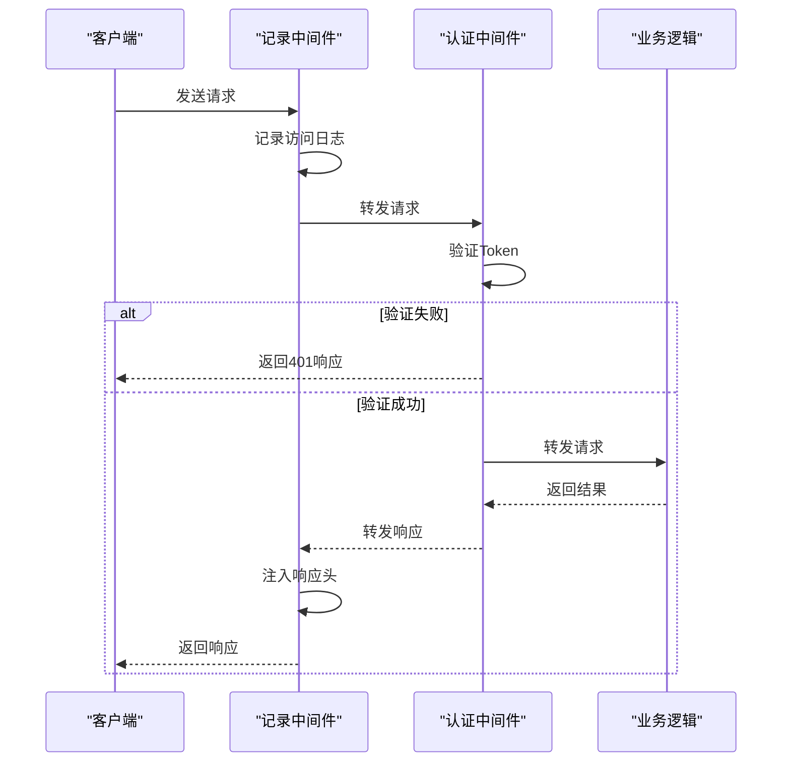

# 响应处理机制

<cite>
**本文档引用的文件**
- [main.py](file://main.py)
- [internal/app.py](file://internal/app.py)
- [pkg/response.py](file://pkg/response.py)
- [internal/middleware/recorder.py](file://internal/middleware/recorder.py)
- [internal/middleware/auth.py](file://internal/middleware/auth.py)
- [internal/core/exception.py](file://internal/core/exception.py)
- [internal/controllers/publicapi/test.py](file://internal/controllers/publicapi/test.py)
- [pkg/stream_control.py](file://pkg/stream_control.py)
- [internal/config/load_config.py](file://internal/config/load_config.py)
- [pkg/async_context.py](file://pkg/async_context.py)
</cite>

## 目录
1. [简介](#简介)
2. [响应处理架构](#响应处理架构)
3. [核心响应组件](#核心响应组件)
4. [异常处理机制](#异常处理机制)
5. [流式响应处理](#流式响应处理)
6. [中间件中的响应处理](#中间件中的响应处理)

## 简介
本项目采用FastAPI框架构建后端服务，其响应处理机制设计精巧，旨在提供高性能、高可靠性的API响应。系统通过自定义响应类、全局异常处理器和中间件链，实现了统一的响应格式、高效的序列化性能和全面的错误处理。响应处理流程贯穿整个请求生命周期，从路由分发到最终响应生成，确保了API接口的一致性和可维护性。

## 响应处理架构
系统响应处理架构采用分层设计，由响应工厂、自定义响应类和全局异常处理器构成核心。响应工厂提供统一的接口来创建成功和错误响应，自定义响应类基于orjson实现高性能JSON序列化，全局异常处理器则确保所有未捕获的异常都能被妥善处理并返回标准化的错误信息。该架构通过中间件链与FastAPI框架紧密集成，实现了从请求接收、业务处理到响应生成的完整闭环。

**图示来源**
- [internal/app.py](file://internal/app.py#L18-L31)
- [pkg/response.py](file://pkg/response.py#L52-L95)
- [internal/middleware/auth.py](file://internal/middleware/auth.py#L23-L95)
- [internal/middleware/recorder.py](file://internal/middleware/recorder.py#L13-L76)

**本节来源**
- [internal/app.py](file://internal/app.py#L1-L116)
- [pkg/response.py](file://pkg/response.py#L1-L245)

## 核心响应组件
系统的核心响应组件由`pkg/response.py`文件中的`ResponseFactory`和`CustomORJSONResponse`类构成。`ResponseFactory`作为响应工厂，提供了`success`、`error`和`list`等方法，用于创建标准化的成功和错误响应。`CustomORJSONResponse`继承自FastAPI的`ORJSONResponse`，通过优化序列化过程，支持处理Decimal、bytes、set等特殊数据类型，确保了响应数据的完整性和准确性。

**图示来源**
- [pkg/response.py](file://pkg/response.py#L103-L184)
- [pkg/response.py](file://pkg/response.py#L52-L95)
- [pkg/response.py](file://pkg/response.py#L17-L44)

**本节来源**
- [pkg/response.py](file://pkg/response.py#L1-L245)

## 异常处理机制
系统的异常处理机制通过FastAPI的异常处理器和自定义异常类实现。`internal/core/exception.py`文件定义了`AppException`类和`GlobalErrors`枚举，用于表示应用级别的错误。在`internal/app.py`中，通过`register_exception`函数注册了全局异常处理器，能够捕获`RequestValidationError`等异常，并将其转换为标准化的错误响应。此外，中间件层也实现了异常捕获，确保即使在中间件处理过程中发生异常，也能返回适当的错误信息。

**图示来源**
- [internal/core/exception.py](file://internal/core/exception.py#L27-L46)
- [internal/app.py](file://internal/app.py#L49-L57)
- [internal/middleware/recorder.py](file://internal/middleware/recorder.py#L56-L75)

**本节来源**
- [internal/core/exception.py](file://internal/core/exception.py#L1-L46)
- [internal/app.py](file://internal/app.py#L49-L57)

## 流式响应处理
对于需要长时间处理或实时数据推送的场景，系统提供了流式响应处理能力。通过`pkg/stream_control.py`文件中的`stream_with_chunk_control`函数，实现了对流式响应的超时控制和错误处理。该函数利用anyio库的`fail_after`上下文管理器，为每个数据块的生成设置超时限制，确保流式响应不会无限期挂起。同时，函数能够处理客户端断连和总超时等情况，保证了流式响应的健壮性。

**图示来源**
- [pkg/stream_control.py](file://pkg/stream_control.py#L13-L62)
- [internal/controllers/publicapi/test.py](file://internal/controllers/publicapi/test.py#L139-L182)

**本节来源**
- [pkg/stream_control.py](file://pkg/stream_control.py#L1-L62)
- [internal/controllers/publicapi/test.py](file://internal/controllers/publicapi/test.py#L139-L182)

## 中间件中的响应处理
中间件在响应处理流程中扮演着关键角色，不仅负责请求的预处理，还参与响应的后处理。`ASGIRecordMiddleware`在响应生成前记录请求日志，在响应生成后注入`X-Process-Time`和`X-Trace-ID`等头部信息，便于性能监控和问题追踪。`ASGIAuthMiddleware`则在请求处理前进行身份验证，对于未通过验证的请求，直接返回错误响应，阻止其进入业务逻辑层。这些中间件通过拦截和修改请求/响应流程，增强了系统的安全性和可观测性。

**图示来源**
- [internal/middleware/recorder.py](file://internal/middleware/recorder.py#L13-L76)
- [internal/middleware/auth.py](file://internal/middleware/auth.py#L23-L95)

**本节来源**
- [internal/middleware/recorder.py](file://internal/middleware/recorder.py#L1-L76)
- [internal/middleware/auth.py](file://internal/middleware/auth.py#L1-L95)