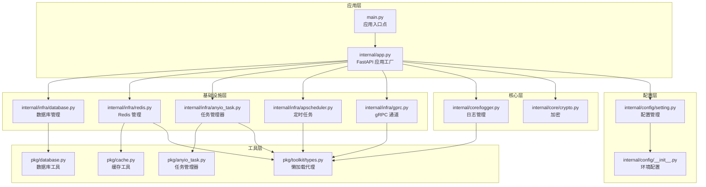
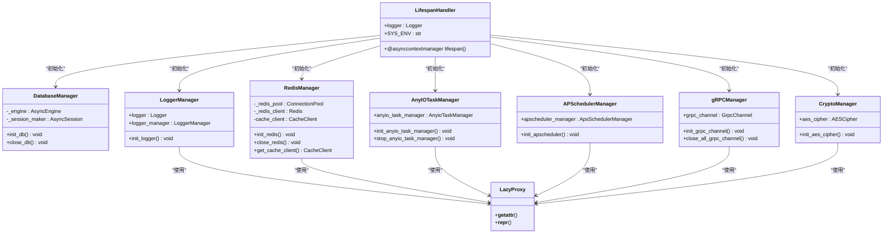
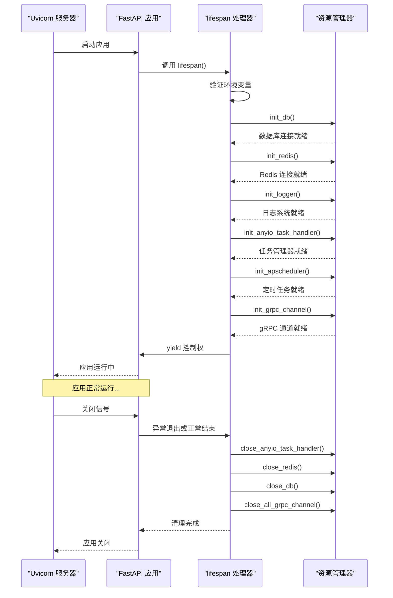
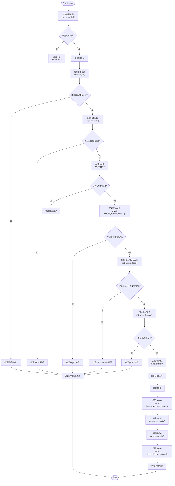
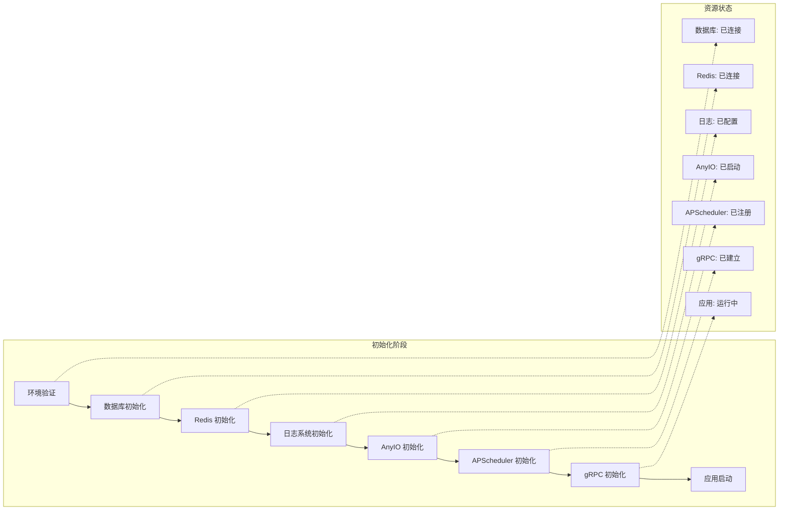
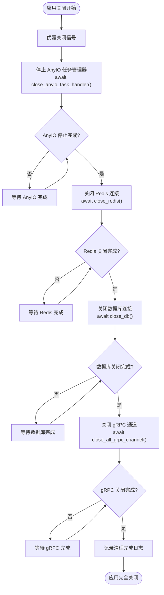
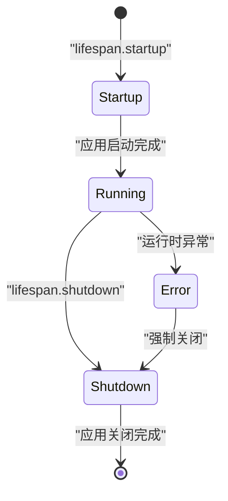
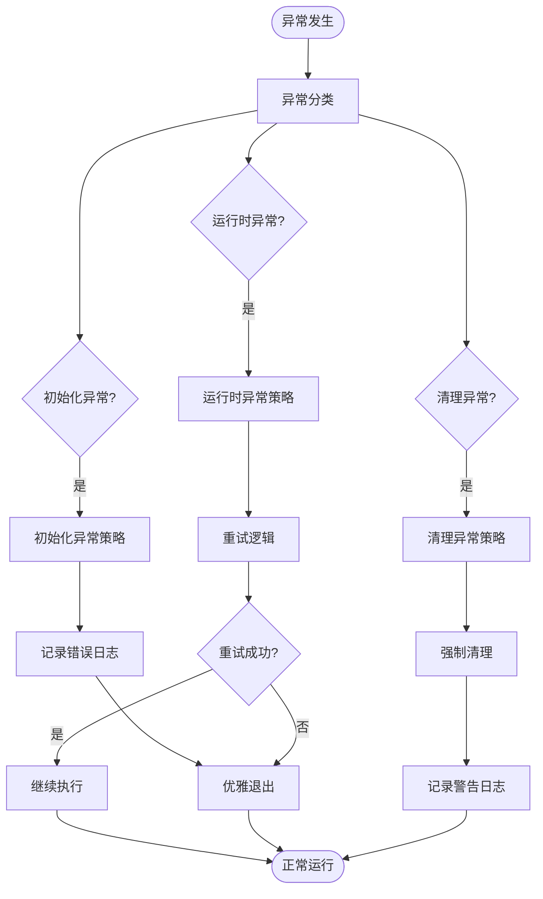
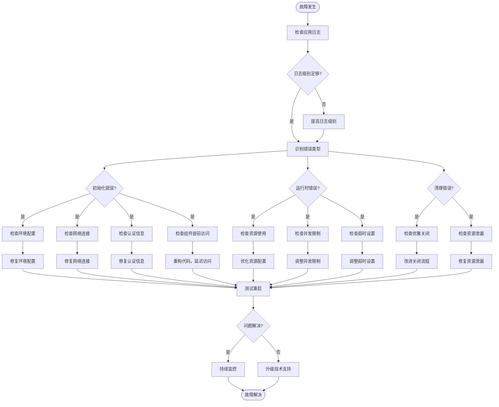

# 应用生命周期管理

<cite>
**本文档中引用的文件**
- [main.py](file://main.py)
- [internal/app.py](file://internal/app.py)
- [internal/infra/database.py](file://internal/infra/database.py)
- [internal/infra/redis.py](file://internal/infra/redis.py)
- [internal/infra/anyio_task.py](file://internal/infra/anyio_task.py)
- [internal/infra/apscheduler.py](file://internal/infra/apscheduler.py)
- [internal/infra/gprc.py](file://internal/infra/gprc.py)
- [internal/core/logger.py](file://internal/core/logger.py)
- [internal/core/crypto.py](file://internal/core/crypto.py)
- [pkg/toolkit/types.py](file://pkg/toolkit/types.py)
- [pkg/async_logger.py](file://pkg/async_logger.py)
</cite>

## 更新摘要
**变更内容**
- 在“资源初始化流程”章节中新增了 **LazyProxy 懒加载机制** 的详细说明，涵盖日志、Redis、gRPC、AnyIO 任务管理器和 APScheduler 的实现。
- 新增 **“LazyProxy 初始化安全机制”** 专门章节，深入解析其设计原理、实现方式与核心优势。
- 更新了 **“故障排查指南”**，增加了因组件提前访问导致初始化失败的排查方法。
- 所有相关代码示例和架构图均已更新以反映 LazyProxy 的集成。

## 目录
1. [概述](#概述)
2. [项目架构](#项目架构)
3. [lifespan 事件处理器核心机制](#lifespan-事件处理器核心机制)
4. [@asynccontextmanager 装饰器详解](#asynccontextmanager-装饰器详解)
5. [资源初始化流程](#资源初始化流程)
6. [LazyProxy 初始化安全机制](#lazyproxy-初始化安全机制)
7. [资源清理流程](#资源清理流程)
8. [ASGI 生命周期钩子](#asgi-生命周期钩子)
9. [异常处理机制](#异常处理机制)
10. [性能优化与最佳实践](#性能优化与最佳实践)
11. [故障排查指南](#故障排查指南)
12. [总结](#总结)

## 概述

FastAPI 的 lifespan 事件处理器是现代异步应用生命周期管理的核心组件，它提供了优雅的应用启动和关闭机制。本文档深入分析了一个典型 FastAPI 后端项目中 lifespan 事件处理器的实现，重点阐述了 `@asynccontextmanager` 装饰器的作用、资源初始化顺序、异常处理机制以及 ASGI 生命周期钩子的执行流程。

该系统通过精心设计的资源管理策略，确保数据库连接、Redis 客户端和 AnyIO 任务管理器能够按照正确的顺序初始化和清理，同时提供完善的异常处理和资源回收保障。**本次更新重点引入了 `LazyProxy` 懒加载代理机制**，解决了在模块导入阶段因组件未初始化而导致的提前访问问题，为日志、Redis、gRPC、AnyIO 任务和 APScheduler 等关键组件提供了统一的安全初始化方案。

## 项目架构

### 整体架构图



**图表来源**
- [main.py](file://main.py#L1-L18)
- [internal/app.py](file://internal/app.py#L1-L116)

### 核心组件关系



**图表来源**
- [internal/app.py](file://internal/app.py#L89-L105)
- [internal/infra/database.py](file://internal/infra/database.py#L26-L65)
- [internal/infra/redis.py](file://internal/infra/redis.py#L18-L91)
- [internal/infra/anyio_task.py](file://internal/infra/anyio_task.py#L8-L38)
- [internal/infra/apscheduler.py](file://internal/infra/apscheduler.py#L9-L27)
- [internal/infra/gprc.py](file://internal/infra/gprc.py#L8-L34)
- [internal/core/logger.py](file://internal/core/logger.py#L30-L58)
- [internal/core/crypto.py](file://internal/core/crypto.py#L7-L18)
- [pkg/toolkit/types.py](file://pkg/toolkit/types.py#L193-L230)

**章节来源**
- [main.py](file://main.py#L1-L18)
- [internal/app.py](file://internal/app.py#L1-L116)

## lifespan 事件处理器核心机制

### @asynccontextmanager 装饰器的作用

`@asynccontextmanager` 是 Python 异步上下文管理器的核心装饰器，它使得函数能够作为异步上下文管理器使用。在 FastAPI 的 lifespan 事件处理器中，它提供了以下关键功能：

#### 1. 异步资源管理
```python
@asynccontextmanager
async def lifespan(_app: FastAPI):
    # 资源初始化逻辑
    yield
    # 资源清理逻辑
```

#### 2. 自动异常处理
当 lifespan 函数中发生异常时，系统会自动执行清理逻辑，确保资源得到正确释放。

#### 3. 生命周期钩子
lifespan 提供了应用启动前后的钩子点，允许开发者在特定时刻执行自定义逻辑。

### 执行流程图



**图表来源**
- [internal/app.py](file://internal/app.py#L89-L115)

**章节来源**
- [internal/app.py](file://internal/app.py#L89-L115)

## @asynccontextmanager 装饰器详解

### 装饰器的工作原理

`@asynccontextmanager` 装饰器将普通的异步函数转换为异步上下文管理器，其核心工作机制包括：

#### 1. 上下文管理器协议
- **进入上下文**: 执行装饰器函数的主体部分
- **退出上下文**: 执行 `yield` 之后的所有代码

#### 2. 异常传播机制
- 如果 `yield` 之前发生异常，不会执行 `yield` 之后的代码
- 如果 `yield` 之后发生异常，会正常执行清理逻辑

#### 3. 自动资源管理
- 确保即使发生异常，资源也能得到正确清理
- 提供统一的错误处理和日志记录机制

### 在项目中的具体应用

在本项目中，`@asynccontextmanager` 装饰器被用于 `lifespan` 函数，实现了以下功能：



**图表来源**
- [internal/app.py](file://internal/app.py#L89-L115)

**章节来源**
- [internal/app.py](file://internal/app.py#L89-L115)

## 资源初始化流程

### 初始化顺序的重要性

资源初始化遵循严格的顺序，确保依赖关系得到正确处理：

#### 1. 数据库初始化 (init_db)
- **目的**: 建立数据库连接池和会话管理器
- **关键步骤**: 创建 AsyncEngine、注册事件监听器、创建 SessionMaker
- **幂等性**: 支持重复调用而不产生副作用

#### 2. Redis 初始化 (init_redis)
- **目的**: 建立 Redis 连接池和缓存客户端
- **关键步骤**: 创建连接池、初始化 Redis 客户端、包装为 CacheClient
- **依赖关系**: 依赖于数据库初始化完成后的配置加载

#### 3. 日志系统初始化 (init_logger)
- **目的**: 初始化日志管理器和全局日志实例
- **关键步骤**: 创建 LoggerManager、配置日志输出、设置轮转策略
- **依赖关系**: 通常在数据库和 Redis 之后，为后续组件提供日志支持

#### 4. AnyIO 任务管理器初始化 (init_anyio_task_handler)
- **目的**: 启动异步任务调度和管理
- **关键步骤**: 创建 TaskGroup、启动任务管理器、设置容量限制
- **依赖关系**: 独立于其他资源，但需要在应用启动后立即可用

#### 5. APScheduler 初始化 (init_apscheduler)
- **目的**: 初始化定时任务调度器
- **关键步骤**: 创建 ApsSchedulerManager、注册定时任务
- **依赖关系**: 依赖于日志系统进行任务执行日志记录

#### 6. gRPC 通道初始化 (init_grpc_channel)
- **目的**: 建立与远程服务的 gRPC 连接
- **关键步骤**: 创建 GrpcChannel 实例、添加到通道列表
- **依赖关系**: 依赖于配置系统获取服务地址

### 初始化流程图



**图表来源**
- [internal/app.py](file://internal/app.py#L95-L105)
- [internal/infra/database.py](file://internal/infra/database.py#L26-L65)
- [internal/infra/redis.py](file://internal/infra/redis.py#L18-L91)
- [internal/core/logger.py](file://internal/core/logger.py#L30-L58)
- [internal/infra/anyio_task.py](file://internal/infra/anyio_task.py#L8-L38)
- [internal/infra/apscheduler.py](file://internal/infra/apscheduler.py#L9-L27)
- [internal/infra/gprc.py](file://internal/infra/gprc.py#L8-L34)

### 各组件初始化细节

#### 数据库初始化特性
- **连接池配置**: 支持预连接检查、动态扩容、超时控制
- **SQL 监控**: 自动注册事件监听器，提供慢查询检测
- **会话管理**: 提供上下文管理器，支持自动事务管理

#### Redis 初始化特性
- **连接池管理**: 支持最大连接数控制、连接复用
- **缓存封装**: 提供高级缓存操作接口
- **分布式锁**: 支持原子性锁操作

#### AnyIO 任务管理器特性
- **并发控制**: 支持线程池、进程池、全局任务限制
- **任务监控**: 提供任务状态跟踪和异常处理
- **超时管理**: 支持任务级别和全局级别的超时控制

**章节来源**
- [internal/infra/database.py](file://internal/infra/database.py#L26-L65)
- [internal/infra/redis.py](file://internal/infra/redis.py#L18-L91)
- [internal/infra/anyio_task.py](file://internal/infra/anyio_task.py#L8-L38)

## LazyProxy 初始化安全机制

### 问题背景

在 Python 模块导入过程中，如果一个模块尝试访问另一个尚未完成初始化的全局对象，会引发 `RuntimeError`。例如，在 `internal/core/crypto.py` 中，`aes_cipher` 对象在模块导入时即被引用，但此时 `init_aes_cipher()` 尚未调用，`_aes_cipher` 变量为 `None`。

### 解决方案：LazyProxy 懒加载代理

`LazyProxy` 类提供了一种优雅的解决方案，它通过代理模式延迟了对真实对象的访问，直到对象被实际使用时才进行初始化检查。

#### LazyProxy 类定义

```python
class LazyProxy:
    """
    通用懒加载代理，用于延迟初始化的单例对象。

    解决问题：
    - 模块导入时对象还未初始化 (None)
    - 需要在运行时动态获取实际对象

    用法示例:
        _redis_client: Redis | None = None

        def init_redis():
            global _redis_client
            _redis_client = Redis(...)

        def _get_redis() -> Redis:
            if _redis_client is None:
                raise RuntimeError("Redis not initialized")
            return _redis_client

        redis = LazyProxy(_get_redis)  # 导出代理对象

        # 使用时自动转发到真实对象
        redis.get("key")  # 等价于 _get_redis().get("key")
    """
    __slots__ = ("_getter",)

    def __init__(self, getter: "Callable[[], Any]"):
        object.__setattr__(self, "_getter", getter)

    def __getattr__(self, name: str) -> Any:
        return getattr(self._getter(), name)

    def __repr__(self) -> str:
        try:
            return repr(self._getter())
        except RuntimeError:
            return "<LazyProxy: uninitialized>"
```

**图表来源**
- [pkg/toolkit/types.py](file://pkg/toolkit/types.py#L193-L230)

### 在各组件中的应用

#### 1. 日志系统 (internal/core/logger.py)

```python
# 内部持有真实对象
_logger_manager: "LoggerManager | None" = None
_logger: "Logger | None" = None

def _get_logger() -> "Logger":
    if _logger is None:
        raise RuntimeError("Logger not initialized. Call init_logger() first.")
    return _logger

# 导出代理对象
logger = LazyProxy(_get_logger)
```

#### 2. Redis 客户端 (internal/infra/redis.py)

```python
_cache: CacheClient | None = None

def _get_cache() -> CacheClient:
    if _cache is None:
        raise RuntimeError("Redis/Cache is not initialized. Call init_redis() first.")
    return _cache

cache = LazyProxy(_get_cache)
```

#### 3. gRPC 通道 (internal/infra/gprc.py)

```python
_grpc_channel: GrpcChannel | None = None

def _get_grpc_channel():
    if not _grpc_channel:
        raise RuntimeError("gRPC channel not initialized.")
    return _grpc_channel

grpc_channel = LazyProxy(_get_grpc_channel)
```

#### 4. AnyIO 任务管理器 (internal/infra/anyio_task.py)

```python
_anyio_task_manager: AnyioTaskHandler | None = None

def _get_anyio_task_manager() -> AnyioTaskHandler:
    if _anyio_task_manager is None:
        raise RuntimeError("Anyio task manager not initialized. Call init_anyio_task_handler() first.")
    return _anyio_task_manager

anyio_task_manager = LazyProxy(_get_anyio_task_manager)
```

#### 5. APScheduler (internal/infra/apscheduler.py)

```python
_apscheduler_manager: ApsSchedulerManager | None = None

def _get_apscheduler_manager() -> ApsSchedulerManager:
    if _apscheduler_manager is None:
        raise RuntimeError("APScheduler not initialized. Call init_apscheduler() first.")
    return _apscheduler_manager

apscheduler_manager = LazyProxy(_get_apscheduler_manager)
```

#### 6. 加密组件 (internal/core/crypto.py)

```python
_aes_cipher: AESCipher | None = None

def _get_aes_cipher() -> AESCipher:
    if _aes_cipher is None:
        raise RuntimeError("AES Cipher is not initialized")
    return _aes_cipher

aes_cipher = LazyProxy(_get_aes_cipher)
```

**章节来源**
- [internal/core/logger.py](file://internal/core/logger.py#L13-L58)
- [internal/infra/redis.py](file://internal/infra/redis.py#L11-L91)
- [internal/infra/gprc.py](file://internal/infra/gprc.py#L4-L34)
- [internal/infra/anyio_task.py](file://internal/infra/anyio_task.py#L5-L38)
- [internal/infra/apscheduler.py](file://internal/infra/apscheduler.py#L6-L27)
- [internal/core/crypto.py](file://internal/core/crypto.py#L4-L18)

### 核心优势

1. **安全访问**: 防止在组件初始化前被访问，避免 `None` 引用错误。
2. **延迟初始化**: 真实对象的获取被推迟到第一次使用时，符合懒加载原则。
3. **统一接口**: 为所有需要延迟初始化的单例组件提供了统一的访问模式。
4. **清晰错误**: 当未初始化时访问，会抛出明确的 `RuntimeError`，便于调试。

## 资源清理流程

### 清理顺序与策略

资源清理采用逆序执行策略，确保依赖关系得到正确处理：

#### 1. AnyIO 任务管理器清理 (close_anyio_task_handler)
- **目的**: 停止所有正在运行的任务，等待任务完成或取消
- **关键步骤**: 取消所有活跃任务、等待 TaskGroup 退出、清理资源引用

#### 2. Redis 清理 (close_redis)
- **目的**: 关闭 Redis 连接，释放连接池资源
- **关键步骤**: 关闭 Redis 客户端、清理全局引用、释放连接池

#### 3. 数据库清理 (close_db)
- **目的**: 关闭数据库连接池，释放数据库资源
- **关键步骤**: 关闭 AsyncEngine、清理会话工厂、释放连接资源

#### 4. gRPC 通道清理 (close_all_grpc_channel)
- **目的**: 关闭所有 gRPC 通道，释放网络资源
- **关键步骤**: 遍历通道列表并异步关闭每个通道

### 清理流程图



**图表来源**
- [internal/app.py](file://internal/app.py#L112-L114)

### 异常处理与恢复策略

#### 清理过程中的异常处理
- **部分失败**: 如果某个资源清理失败，继续清理其他资源
- **资源泄漏防护**: 确保即使清理失败，也不会导致资源泄漏
- **日志记录**: 详细记录清理过程中的异常信息

#### 恢复策略
- **幂等性**: 清理操作具有幂等性，可以安全重复执行
- **状态检查**: 在清理前检查资源状态，避免不必要的操作
- **超时控制**: 设置合理的清理超时时间，防止无限等待

**章节来源**
- [internal/app.py](file://internal/app.py#L112-L114)
- [internal/infra/database.py](file://internal/infra/database.py#L59-L66)
- [internal/infra/redis.py](file://internal/infra/redis.py#L50-L61)
- [internal/infra/anyio_task.py](file://internal/infra/anyio_task.py#L20-L29)
- [internal/infra/gprc.py](file://internal/infra/gprc.py#L17-L22)

## ASGI 生命周期钩子

### ASGI 协议规范

ASGI (Asynchronous Server Gateway Interface) 是 Python 异步 Web 服务器的标准接口，lifespan 事件是 ASGI 协议的重要组成部分。

#### ASGI 生命周期阶段
1. **Protocol Negotiation**: 协议协商阶段
2. **HTTP/WS Handshake**: HTTP/WebSocket 握手阶段
3. **Lifespan Events**: 生命周期事件阶段
4. **Request/Response**: 请求响应阶段
5. **Disconnect**: 断开连接阶段

### 生命周期事件类型



**图表来源**
- [internal/app.py](file://internal/app.py#L89-L115)

### Uvicorn 服务器集成

#### 服务器启动流程
1. **配置解析**: 解析 uvicorn.Config 对象
2. **服务器实例化**: 创建 uvicorn.Server 实例
3. **事件循环管理**: 使用 `asyncio.run()` 管理事件循环
4. **lifespan 调用**: 调用 FastAPI 应用的 lifespan 处理器

#### 关闭流程
1. **信号捕获**: 捕获系统关闭信号
2. **优雅关闭**: 发送 lifespan.shutdown 事件
3. **资源清理**: 执行清理逻辑
4. **进程退出**: 安全退出进程

### 事件钩子的执行顺序

根据 ASGI 协议规范，事件钩子的执行顺序如下：

| 阶段 | 事件类型 | 执行时机 | 用途 |
|------|----------|----------|------|
| 1 | startup | 应用启动前 | 初始化全局资源 |
| 2 | shutdown | 应用关闭前 | 清理全局资源 |
| 3 | receive | 接收请求时 | 处理请求数据 |
| 4 | send | 发送响应时 | 构造响应数据 |

**章节来源**
- [main.py](file://main.py#L1-L18)
- [internal/app.py](file://internal/app.py#L89-L115)

## 异常处理机制

### 异常分类与处理策略

#### 1. 初始化异常
- **数据库连接失败**: 重试机制、降级策略
- **Redis 连接失败**: 本地缓存替代、延迟初始化
- **任务管理器启动失败**: 记录错误、跳过任务调度
- **组件提前访问**: 通过 `LazyProxy` 抛出 `RuntimeError`，阻止非法访问

#### 2. 运行时异常
- **资源访问异常**: 自动重试、熔断保护
- **网络超时**: 超时重试、降级处理
- **内存不足**: 资源回收、紧急清理

#### 3. 清理异常
- **资源释放失败**: 强制清理、日志记录
- **超时异常**: 强制终止、状态恢复

### 异常处理流程图



**图表来源**
- [internal/app.py](file://internal/app.py#L92-L93)

### 错误恢复机制

#### 1. 自动重试
- **指数退避**: 采用指数退避算法减少重试频率
- **最大重试次数**: 防止无限重试导致资源耗尽
- **重试条件**: 仅对可恢复的临时异常进行重试

#### 2. 降级策略
- **功能降级**: 在资源不可用时禁用非关键功能
- **数据降级**: 使用本地缓存或默认值替代远程数据
- **服务降级**: 提供基础服务而非完整功能

#### 3. 熔断保护
- **失败阈值**: 当失败率达到一定阈值时暂停服务
- **恢复机制**: 定期尝试恢复服务
- **状态监控**: 实时监控服务状态

**章节来源**
- [internal/app.py](file://internal/app.py#L92-L93)

## 性能优化与最佳实践

### 资源初始化优化

#### 1. 并行初始化
虽然本项目采用顺序初始化，但在某些场景下可以考虑并行初始化：

```python
# 伪代码示例：并行初始化
async def parallel_init():
    async with TaskGroup() as tg:
        db_task = tg.create_task(init_db())
        redis_task = tg.create_task(init_redis())
        anyio_task = tg.create_task(init_anyio_task_handler())
    
    await db_task
    await redis_task
    await anyio_task
```

#### 2. 延迟初始化
对于非关键资源，可以采用延迟初始化策略：

```python
# 伪代码示例：延迟初始化
async def lazy_init_redis():
    if not redis_initialized:
        await init_redis()
        redis_initialized = True
```

#### 3. 预热机制
在应用启动后，预先建立关键连接以减少首次请求延迟。

### 内存管理优化

#### 1. 连接池配置
- **最小连接数**: 设置合理的最小连接数
- **最大连接数**: 根据系统负载调整最大连接数
- **连接超时**: 设置合适的连接超时时间

#### 2. 缓存策略
- **本地缓存**: 减少对远程服务的频繁访问
- **缓存过期**: 设置合理的缓存过期时间
- **缓存淘汰**: 实现 LRU 或 LFU 缓存淘汰策略

### 监控与告警

#### 1. 关键指标监控
- **连接成功率**: 监控数据库和 Redis 连接的成功率
- **响应时间**: 监控各资源的响应时间
- **资源使用率**: 监控连接池使用情况

#### 2. 告警机制
- **异常告警**: 当资源初始化失败时发送告警
- **性能告警**: 当响应时间超过阈值时发送告警
- **容量告警**: 当连接池接近上限时发送告警

**章节来源**
- [internal/infra/database.py](file://internal/infra/database.py#L38-L54)
- [internal/infra/redis.py](file://internal/infra/redis.py#L27-L43)

## 故障排查指南

### 常见初始化失败场景

#### 1. 环境变量配置错误
**症状**: 应用启动时抛出 `Invalid ENV` 异常
**原因**: `SYS_ENV` 环境变量设置不正确
**解决方案**:
- 检查 `.env.local`、`.env.dev`、`.env.prod` 文件
- 确认 `SYS_ENV` 变量值为 `local`、`dev`、`test` 或 `prod`
- 验证环境变量文件路径和权限

#### 2. 数据库连接失败
**症状**: `init_db()` 调用失败，出现连接超时或认证错误
**排查步骤**:
1. 检查数据库服务是否运行
2. 验证数据库连接字符串格式
3. 确认网络连通性
4. 检查防火墙设置
5. 验证数据库凭据

#### 3. Redis 连接失败
**症状**: `init_redis()` 调用失败
**排查步骤**:
1. 检查 Redis 服务状态
2. 验证 Redis 配置参数
3. 检查网络连接
4. 确认 Redis 密码配置

#### 4. 组件提前访问导致的初始化失败
**症状**: 在 `lifespan` 初始化完成前，访问 `logger`、`redis`、`anyio_task_manager` 等组件时抛出 `RuntimeError: <组件名> not initialized`
**原因**: 代码在模块导入或应用启动早期阶段直接使用了这些全局代理对象，而 `lifespan` 尚未执行。
**解决方案**:
- **检查调用栈**: 确定是哪个模块或函数在过早地访问了这些组件。
- **延迟执行**: 将对这些组件的访问逻辑移至 FastAPI 路由处理函数、依赖注入或后台任务中，确保它们在应用启动后才被调用。
- **使用 `init_xxx` 函数**: 在非 `lifespan` 的上下文中，确保先调用相应的 `init_xxx()` 函数（如 Celery worker 中）。

### 调试技巧

#### 1. 日志分析
```bash
# 查看应用启动日志
tail -f logs/application.log | grep "lifespan\|init_db\|init_redis\|init_anyio_task_handler"

# 查找异常信息
grep -i "error\|exception\|fail\|not initialized" logs/application.log
```

#### 2. 网络诊断
```bash
# 测试数据库连接
telnet <db-host> <db-port>

# 测试 Redis 连接
redis-cli -h <redis-host> -p <redis-port> ping
```

#### 3. 资源监控
```bash
# 监控系统资源使用
htop
iotop

# 监控网络连接
ss -tuln | grep -E "(3306|6379)"
```

### 故障排除流程图



**章节来源**
- [internal/app.py](file://internal/app.py#L92-L93)
- [internal/config/setting.py](file://internal/config/setting.py#L14-L28)

## 总结

FastAPI 的 lifespan 事件处理器通过 `@asynccontextmanager` 装饰器提供了强大而灵活的应用生命周期管理能力。本文档详细分析了该项目中 lifespan 事件处理器的实现，涵盖了以下关键方面：

### 核心优势

1. **资源管理**: 通过严格的初始化和清理顺序，确保资源得到正确管理
2. **异常处理**: 完善的异常处理机制，保证应用稳定性和资源安全性
3. **性能优化**: 合理的资源初始化策略和监控机制
4. **可维护性**: 清晰的代码结构和详细的日志记录
5. **初始化安全**: 引入 `LazyProxy` 机制，有效防止组件提前访问，提升系统健壮性

### 最佳实践要点

1. **顺序初始化**: 按照依赖关系顺序初始化资源
2. **异常隔离**: 确保单个组件的异常不会影响整体系统
3. **优雅关闭**: 提供完整的资源清理机制
4. **监控告警**: 建立完善的监控和告警体系
5. **懒加载**: 对全局单例组件使用 `LazyProxy`，实现安全的延迟初始化

### 技术创新

1. **异步上下文管理**: 利用 `@asynccontextmanager` 实现优雅的资源管理
2. **多层抽象**: 通过多层抽象简化复杂系统的资源管理
3. **配置驱动**: 基于环境变量的配置驱动架构
4. **通用代理模式**: `LazyProxy` 为多个组件提供了统一的懒加载解决方案

该实现为 FastAPI 应用提供了生产级别的生命周期管理解决方案，具备良好的扩展性和维护性，是现代异步应用开发的优秀实践范例。