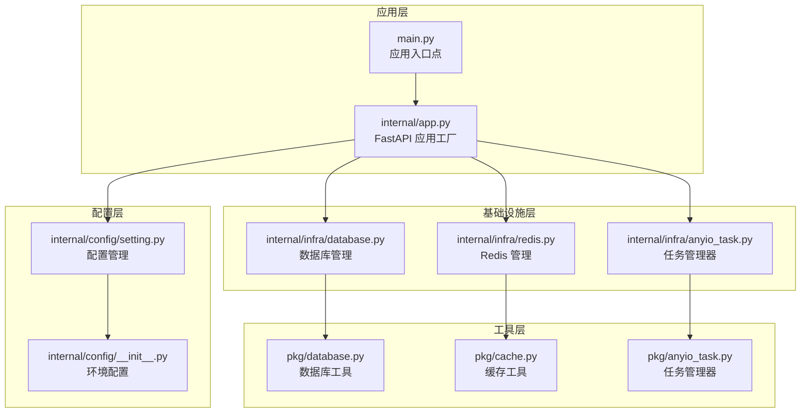
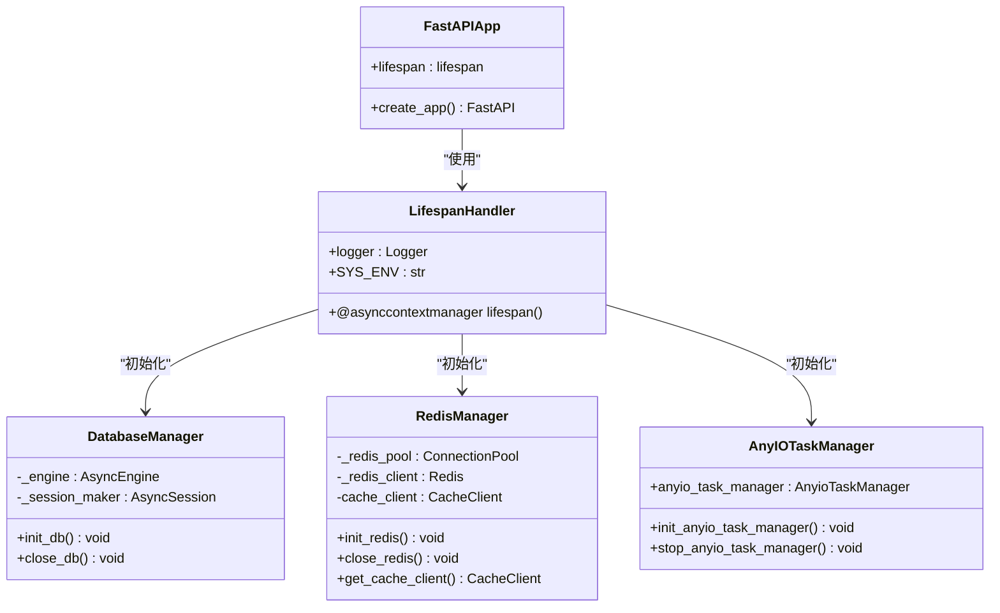
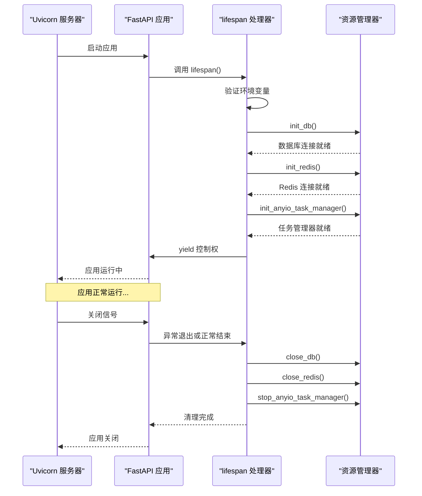
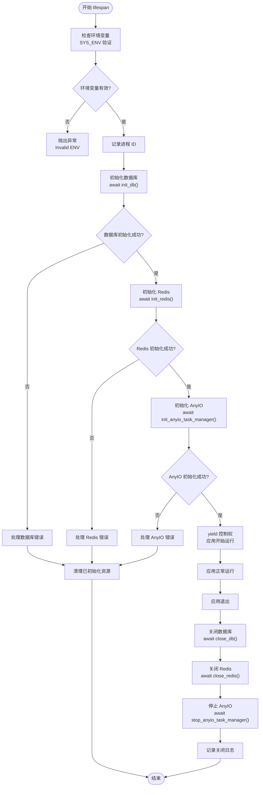
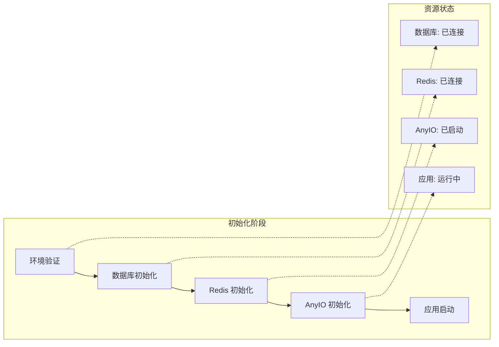
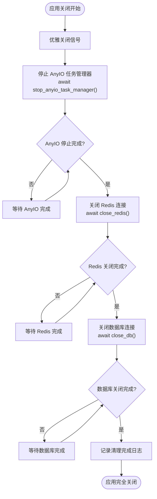
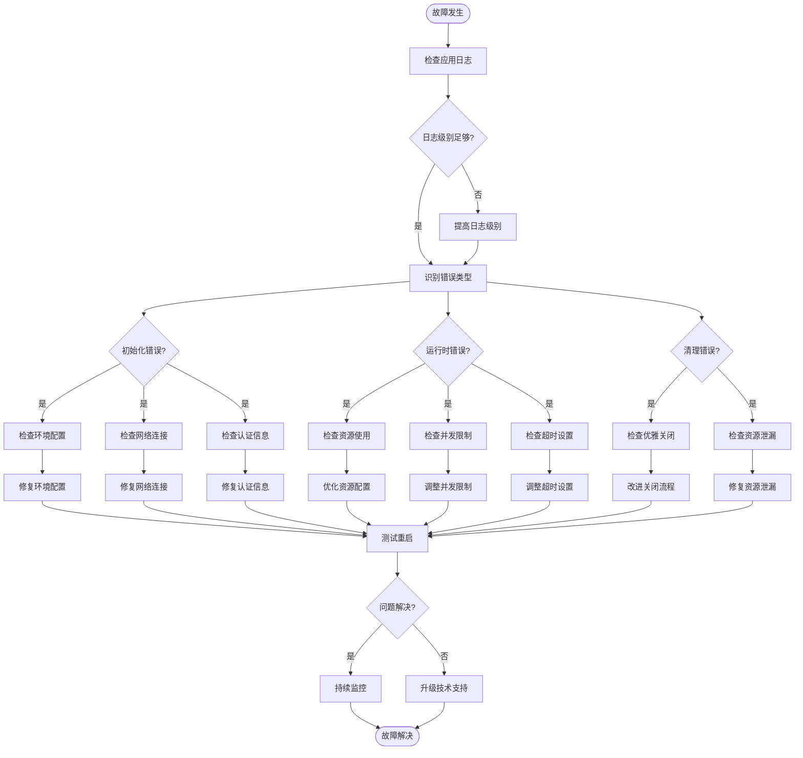

# 应用生命周期管理

<cite>
**本文档中引用的文件**
- [main.py](file://main.py)
- [internal/app.py](file://internal/app.py)
- [internal/infra/database.py](file://internal/infra/database.py)
- [internal/infra/redis.py](file://internal/infra/redis.py)
- [internal/infra/anyio_task.py](file://internal/infra/anyio_task.py)
- [pkg/anyio_task.py](file://pkg/anyio_task.py)
- [pkg/database.py](file://pkg/database.py)
- [pkg/cache.py](file://pkg/cache.py)
- [internal/config/setting.py](file://internal/config/setting.py)
- [internal/config/__init__.py](file://internal/config/__init__.py)
</cite>

## 目录
1. [概述](#概述)
2. [项目架构](#项目架构)
3. [lifespan 事件处理器核心机制](#lifespan-事件处理器核心机制)
4. [@asynccontextmanager 装饰器详解](#asynccontextmanager-装饰器详解)
5. [资源初始化流程](#资源初始化流程)
6. [资源清理流程](#资源清理流程)
7. [ASGI 生命周期钩子](#asgi-生命周期钩子)
8. [异常处理机制](#异常处理机制)
9. [性能优化与最佳实践](#性能优化与最佳实践)
10. [故障排查指南](#故障排查指南)
11. [总结](#总结)

## 概述

FastAPI 的 lifespan 事件处理器是现代异步应用生命周期管理的核心组件，它提供了优雅的应用启动和关闭机制。本文档深入分析了一个典型 FastAPI 后端项目中 lifespan 事件处理器的实现，重点阐述了 `@asynccontextmanager` 装饰器的作用、资源初始化顺序、异常处理机制以及 ASGI 生命周期钩子的执行流程。

该系统通过精心设计的资源管理策略，确保数据库连接、Redis 客户端和 AnyIO 任务管理器能够按照正确的顺序初始化和清理，同时提供完善的异常处理和资源回收保障。

## 项目架构

### 整体架构图



**图表来源**
- [main.py](file://main.py#L1-L19)
- [internal/app.py](file://internal/app.py#L1-L105)

### 核心组件关系



**图表来源**
- [internal/app.py](file://internal/app.py#L80-L105)
- [internal/infra/database.py](file://internal/infra/database.py#L24-L65)
- [internal/infra/redis.py](file://internal/infra/redis.py#L17-L45)
- [internal/infra/anyio_task.py](file://internal/infra/anyio_task.py#L7-L29)

**章节来源**
- [main.py](file://main.py#L1-L19)
- [internal/app.py](file://internal/app.py#L1-L105)

## lifespan 事件处理器核心机制

### @asynccontextmanager 装饰器的作用

`@asynccontextmanager` 是 Python 异步上下文管理器的核心装饰器，它使得函数能够作为异步上下文管理器使用。在 FastAPI 的 lifespan 事件处理器中，它提供了以下关键功能：

#### 1. 异步资源管理
```python
@asynccontextmanager
async def lifespan(_app: FastAPI):
    # 资源初始化逻辑
    yield
    # 资源清理逻辑
```

#### 2. 自动异常处理
当 lifespan 函数中发生异常时，系统会自动执行清理逻辑，确保资源得到正确释放。

#### 3. 生命周期钩子
lifespan 提供了应用启动前后的钩子点，允许开发者在特定时刻执行自定义逻辑。

### 执行流程图



**图表来源**
- [internal/app.py](file://internal/app.py#L80-L105)

**章节来源**
- [internal/app.py](file://internal/app.py#L80-L105)

## @asynccontextmanager 装饰器详解

### 装饰器的工作原理

`@asynccontextmanager` 装饰器将普通的异步函数转换为异步上下文管理器，其核心工作机制包括：

#### 1. 上下文管理器协议
- **进入上下文**: 执行装饰器函数的主体部分
- **退出上下文**: 执行 `yield` 之后的所有代码

#### 2. 异常传播机制
- 如果 `yield` 之前发生异常，不会执行 `yield` 之后的代码
- 如果 `yield` 之后发生异常，会正常执行清理逻辑

#### 3. 自动资源管理
- 确保即使发生异常，资源也能得到正确清理
- 提供统一的错误处理和日志记录机制

### 在项目中的具体应用

在本项目中，`@asynccontextmanager` 装饰器被用于 `lifespan` 函数，实现了以下功能：



**图表来源**
- [internal/app.py](file://internal/app.py#L80-L105)

**章节来源**
- [internal/app.py](file://internal/app.py#L80-L105)

## 资源初始化流程

### 初始化顺序的重要性

资源初始化遵循严格的顺序，确保依赖关系得到正确处理：

#### 1. 数据库初始化 (init_db)
- **目的**: 建立数据库连接池和会话管理器
- **关键步骤**: 创建 AsyncEngine、注册事件监听器、创建 SessionMaker
- **幂等性**: 支持重复调用而不产生副作用

#### 2. Redis 初始化 (init_redis)
- **目的**: 建立 Redis 连接池和缓存客户端
- **关键步骤**: 创建连接池、初始化 Redis 客户端、包装为 CacheClient
- **依赖关系**: 依赖于数据库初始化完成后的配置加载

#### 3. AnyIO 任务管理器初始化 (init_anyio_task_manager)
- **目的**: 启动异步任务调度和管理
- **关键步骤**: 创建 TaskGroup、启动任务管理器、设置容量限制
- **依赖关系**: 独立于其他资源，但需要在应用启动后立即可用

### 初始化流程图



**图表来源**
- [internal/app.py](file://internal/app.py#L89-L94)
- [internal/infra/database.py](file://internal/infra/database.py#L24-L65)
- [internal/infra/redis.py](file://internal/infra/redis.py#L17-L45)
- [internal/infra/anyio_task.py](file://internal/infra/anyio_task.py#L7-L29)

### 各组件初始化细节

#### 数据库初始化特性
- **连接池配置**: 支持预连接检查、动态扩容、超时控制
- **SQL 监控**: 自动注册事件监听器，提供慢查询检测
- **会话管理**: 提供上下文管理器，支持自动事务管理

#### Redis 初始化特性
- **连接池管理**: 支持最大连接数控制、连接复用
- **缓存封装**: 提供高级缓存操作接口
- **分布式锁**: 支持原子性锁操作

#### AnyIO 任务管理器特性
- **并发控制**: 支持线程池、进程池、全局任务限制
- **任务监控**: 提供任务状态跟踪和异常处理
- **超时管理**: 支持任务级别和全局级别的超时控制

**章节来源**
- [internal/infra/database.py](file://internal/infra/database.py#L24-L65)
- [internal/infra/redis.py](file://internal/infra/redis.py#L17-L45)
- [internal/infra/anyio_task.py](file://internal/infra/anyio_task.py#L7-L29)

## 资源清理流程

### 清理顺序与策略

资源清理采用逆序执行策略，确保依赖关系得到正确处理：

#### 1. AnyIO 任务管理器清理 (stop_anyio_task_manager)
- **目的**: 停止所有正在运行的任务，等待任务完成或取消
- **关键步骤**: 取消所有活跃任务、等待 TaskGroup 退出、清理资源引用

#### 2. Redis 清理 (close_redis)
- **目的**: 关闭 Redis 连接，释放连接池资源
- **关键步骤**: 关闭 Redis 客户端、清理全局引用、释放连接池

#### 3. 数据库清理 (close_db)
- **目的**: 关闭数据库连接池，释放数据库资源
- **关键步骤**: 关闭 AsyncEngine、清理会话工厂、释放连接资源

### 清理流程图



**图表来源**
- [internal/app.py](file://internal/app.py#L101-L104)

### 异常处理与恢复策略

#### 清理过程中的异常处理
- **部分失败**: 如果某个资源清理失败，继续清理其他资源
- **资源泄漏防护**: 确保即使清理失败，也不会导致资源泄漏
- **日志记录**: 详细记录清理过程中的异常信息

#### 恢复策略
- **幂等性**: 清理操作具有幂等性，可以安全重复执行
- **状态检查**: 在清理前检查资源状态，避免不必要的操作
- **超时控制**: 设置合理的清理超时时间，防止无限等待

**章节来源**
- [internal/app.py](file://internal/app.py#L101-L104)
- [internal/infra/database.py](file://internal/infra/database.py#L57-L65)
- [internal/infra/redis.py](file://internal/infra/redis.py#L47-L59)
- [internal/infra/anyio_task.py](file://internal/infra/anyio_task.py#L19-L29)

## ASGI 生命周期钩子

### ASGI 协议规范

ASGI (Asynchronous Server Gateway Interface) 是 Python 异步 Web 服务器的标准接口，lifespan 事件是 ASGI 协议的重要组成部分。

#### ASGI 生命周期阶段
1. **Protocol Negotiation**: 协议协商阶段
2. **HTTP/WS Handshake**: HTTP/WebSocket 握手阶段
3. **Lifespan Events**: 生命周期事件阶段
4. **Request/Response**: 请求响应阶段
5. **Disconnect**: 断开连接阶段

### 生命周期事件类型


**图表来源**
- [internal/app.py](file://internal/app.py#L17-L24)

### Uvicorn 服务器集成

#### 服务器启动流程
1. **配置解析**: 解析 uvicorn.Config 对象
2. **服务器实例化**: 创建 uvicorn.Server 实例
3. **事件循环管理**: 使用 `asyncio.run()` 管理事件循环
4. **lifespan 调用**: 调用 FastAPI 应用的 lifespan 处理器

#### 关闭流程
1. **信号捕获**: 捕获系统关闭信号
2. **优雅关闭**: 发送 lifespan.shutdown 事件
3. **资源清理**: 执行清理逻辑
4. **进程退出**: 安全退出进程

### 事件钩子的执行顺序

根据 ASGI 协议规范，事件钩子的执行顺序如下：

| 阶段 | 事件类型 | 执行时机 | 用途 |
|------|----------|----------|------|
| 1 | startup | 应用启动前 | 初始化全局资源 |
| 2 | shutdown | 应用关闭前 | 清理全局资源 |
| 3 | receive | 接收请求时 | 处理请求数据 |
| 4 | send | 发送响应时 | 构造响应数据 |

**章节来源**
- [main.py](file://main.py#L1-L19)
- [internal/app.py](file://internal/app.py#L17-L24)

## 异常处理机制

### 异常分类与处理策略

#### 1. 初始化异常
- **数据库连接失败**: 重试机制、降级策略
- **Redis 连接失败**: 本地缓存替代、延迟初始化
- **任务管理器启动失败**: 记录错误、跳过任务调度

#### 2. 运行时异常
- **资源访问异常**: 自动重试、熔断保护
- **网络超时**: 超时重试、降级处理
- **内存不足**: 资源回收、紧急清理

#### 3. 清理异常
- **资源释放失败**: 强制清理、日志记录
- **超时异常**: 强制终止、状态恢复

### 异常处理流程图


**图表来源**
- [internal/app.py](file://internal/app.py#L84-L86)

### 错误恢复机制

#### 1. 自动重试
- **指数退避**: 采用指数退避算法减少重试频率
- **最大重试次数**: 防止无限重试导致资源耗尽
- **重试条件**: 仅对可恢复的临时异常进行重试

#### 2. 降级策略
- **功能降级**: 在资源不可用时禁用非关键功能
- **数据降级**: 使用本地缓存或默认值替代远程数据
- **服务降级**: 提供基础服务而非完整功能

#### 3. 熔断保护
- **失败阈值**: 当失败率达到一定阈值时暂停服务
- **恢复机制**: 定期尝试恢复服务
- **状态监控**: 实时监控服务状态

**章节来源**
- [internal/app.py](file://internal/app.py#L84-L86)

## 性能优化与最佳实践

### 资源初始化优化

#### 1. 并行初始化
虽然本项目采用顺序初始化，但在某些场景下可以考虑并行初始化：

```python
# 伪代码示例：并行初始化
async def parallel_init():
    async with TaskGroup() as tg:
        db_task = tg.create_task(init_db())
        redis_task = tg.create_task(init_redis())
        anyio_task = tg.create_task(init_anyio_task_manager())
    
    await db_task
    await redis_task
    await anyio_task
```

#### 2. 延迟初始化
对于非关键资源，可以采用延迟初始化策略：

```python
# 伪代码示例：延迟初始化
async def lazy_init_redis():
    if not redis_initialized:
        await init_redis()
        redis_initialized = True
```

#### 3. 预热机制
在应用启动后，预先建立关键连接以减少首次请求延迟。

### 内存管理优化

#### 1. 连接池配置
- **最小连接数**: 设置合理的最小连接数
- **最大连接数**: 根据系统负载调整最大连接数
- **连接超时**: 设置合适的连接超时时间

#### 2. 缓存策略
- **本地缓存**: 减少对远程服务的频繁访问
- **缓存过期**: 设置合理的缓存过期时间
- **缓存淘汰**: 实现 LRU 或 LFU 缓存淘汰策略

### 监控与告警

#### 1. 关键指标监控
- **连接成功率**: 监控数据库和 Redis 连接的成功率
- **响应时间**: 监控各资源的响应时间
- **资源使用率**: 监控连接池使用情况

#### 2. 告警机制
- **异常告警**: 当资源初始化失败时发送告警
- **性能告警**: 当响应时间超过阈值时发送告警
- **容量告警**: 当连接池接近上限时发送告警

**章节来源**
- [internal/infra/database.py](file://internal/infra/database.py#L36-L54)
- [internal/infra/redis.py](file://internal/infra/redis.py#L26-L43)

## 故障排查指南

### 常见初始化失败场景

#### 1. 环境变量配置错误
**症状**: 应用启动时抛出 `Invalid ENV` 异常
**原因**: `SYS_ENV` 环境变量设置不正确
**解决方案**:
- 检查 `.env.local`、`.env.dev`、`.env.prod` 文件
- 确认 `SYS_ENV` 变量值为 `local`、`dev`、`test` 或 `prod`
- 验证环境变量文件路径和权限

#### 2. 数据库连接失败
**症状**: `init_db()` 调用失败，出现连接超时或认证错误
**排查步骤**:
1. 检查数据库服务是否运行
2. 验证数据库连接字符串格式
3. 确认网络连通性
4. 检查防火墙设置
5. 验证数据库凭据

#### 3. Redis 连接失败
**症状**: `init_redis()` 调用失败
**排查步骤**:
1. 检查 Redis 服务状态
2. 验证 Redis 配置参数
3. 检查网络连接
4. 确认 Redis 密码配置

#### 4. 任务管理器启动失败
**症状**: `init_anyio_task_manager()` 失败
**排查步骤**:
1. 检查系统资源可用性
2. 验证 AnyIO 版本兼容性
3. 检查并发限制配置

### 调试技巧

#### 1. 日志分析
```bash
# 查看应用启动日志
tail -f logs/application.log | grep "lifespan\|init_db\|init_redis\|init_anyio_task_manager"

# 查找异常信息
grep -i "error\|exception\|fail" logs/application.log
```

#### 2. 网络诊断
```bash
# 测试数据库连接
telnet <db-host> <db-port>

# 测试 Redis 连接
redis-cli -h <redis-host> -p <redis-port> ping
```

#### 3. 资源监控
```bash
# 监控系统资源使用
htop
iotop

# 监控网络连接
ss -tuln | grep -E "(3306|6379)"
```

### 故障排除流程图



**章节来源**
- [internal/app.py](file://internal/app.py#L84-L86)
- [internal/config/setting.py](file://internal/config/setting.py#L14-L28)

## 总结

FastAPI 的 lifespan 事件处理器通过 `@asynccontextmanager` 装饰器提供了强大而灵活的应用生命周期管理能力。本文档详细分析了该项目中 lifespan 事件处理器的实现，涵盖了以下关键方面：

### 核心优势

1. **资源管理**: 通过严格的初始化和清理顺序，确保资源得到正确管理
2. **异常处理**: 完善的异常处理机制，保证应用稳定性和资源安全性
3. **性能优化**: 合理的资源初始化策略和监控机制
4. **可维护性**: 清晰的代码结构和详细的日志记录

### 最佳实践要点

1. **顺序初始化**: 按照依赖关系顺序初始化资源
2. **异常隔离**: 确保单个组件的异常不会影响整体系统
3. **优雅关闭**: 提供完整的资源清理机制
4. **监控告警**: 建立完善的监控和告警体系

### 技术创新

1. **异步上下文管理**: 利用 `@asynccontextmanager` 实现优雅的资源管理
2. **多层抽象**: 通过多层抽象简化复杂系统的资源管理
3. **配置驱动**: 基于环境变量的配置驱动架构

该实现为 FastAPI 应用提供了生产级别的生命周期管理解决方案，具备良好的扩展性和维护性，是现代异步应用开发的优秀实践范例。