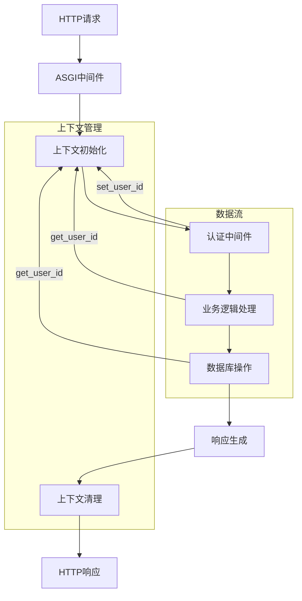
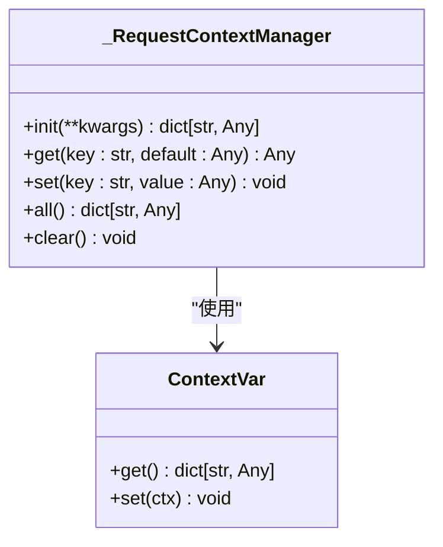
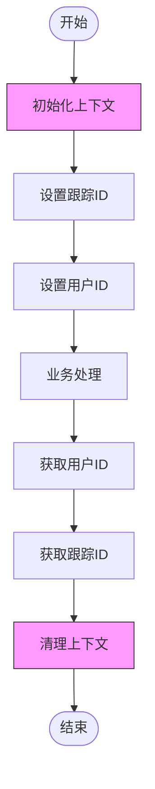
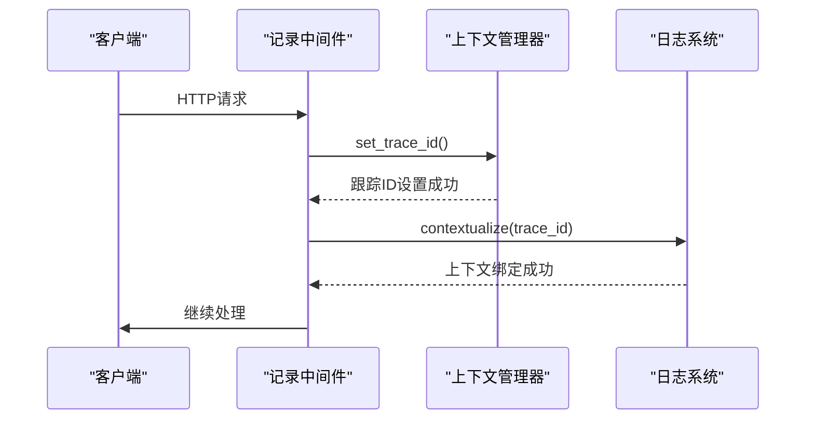
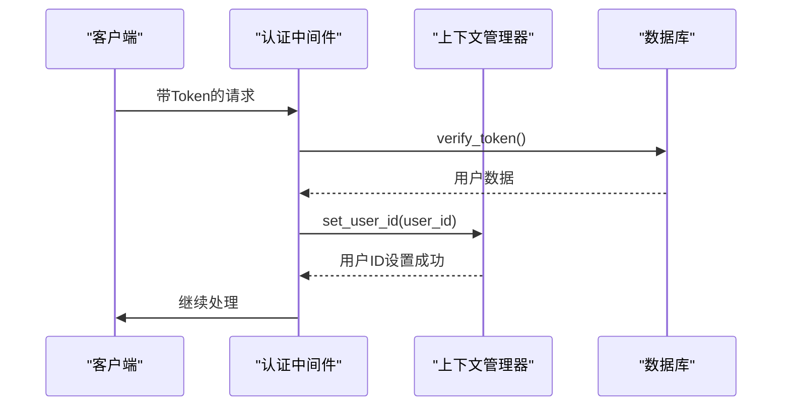
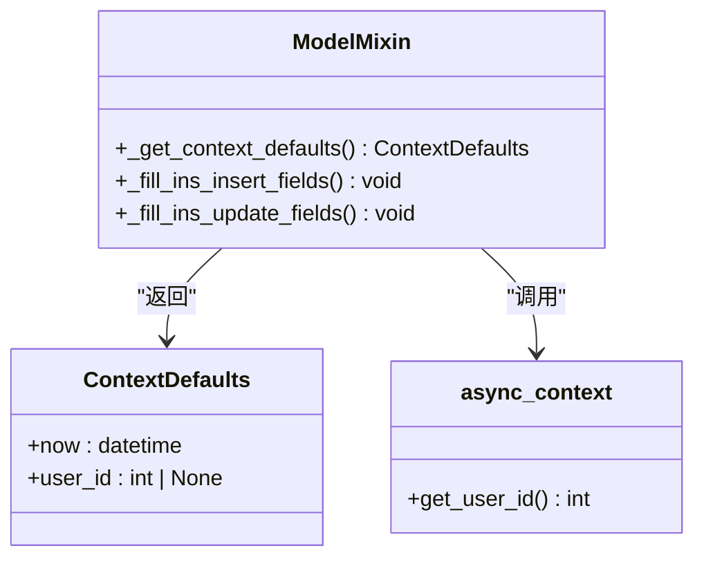

# 异步上下文管理器

<cite>
**本文档引用的文件**  
- [async_context.py](file://pkg/async_context.py)
- [recorder.py](file://internal/middleware/recorder.py)
- [auth.py](file://internal/middleware/auth.py)
- [base.py](file://pkg/database/base.py)
- [test_context.py](file://tests/test_context.py)
- [app.py](file://internal/app.py)
</cite>

## 目录
1. [简介](#简介)
2. [核心组件](#核心组件)
3. [架构概述](#架构概述)
4. [详细组件分析](#详细组件分析)
5. [依赖分析](#依赖分析)
6. [性能考虑](#性能考虑)
7. [故障排除指南](#故障排除指南)
8. [结论](#结论)

## 简介
异步上下文管理器是本FastAPI后端项目中的核心基础设施组件，用于在异步请求处理过程中维护和传递请求级别的上下文信息。该系统基于Python的`contextvars`模块构建，确保了在高并发异步环境下的数据隔离和线程安全。通过统一的上下文管理，系统能够跨中间件、服务层和数据访问层传递关键信息，如用户ID、跟踪ID等，为日志记录、权限验证和数据审计提供了基础支持。

## 核心组件

异步上下文管理器的核心实现位于`pkg/async_context.py`文件中，提供了一套完整的API用于初始化、读取、写入和清理请求上下文。该组件与日志系统、认证中间件和数据库操作紧密集成，构成了整个应用的上下文生命周期管理基础。

**Section sources**
- [async_context.py](file://pkg/async_context.py#L1-L110)

## 架构概述

异步上下文管理器在整个应用架构中扮演着中枢角色，连接了请求入口、中间件层、业务逻辑和数据访问层。其工作流程始于请求进入时的初始化，贯穿整个请求处理周期，并在响应返回后进行清理。



**Diagram sources**
- [async_context.py](file://pkg/async_context.py#L1-L110)
- [recorder.py](file://internal/middleware/recorder.py#L1-L75)
- [auth.py](file://internal/middleware/auth.py#L1-L92)

## 详细组件分析

### 异步上下文管理器实现分析

异步上下文管理器的实现基于单例模式和静态方法设计，通过`_RequestContextManager`类封装了所有上下文操作。该类使用`contextvars.ContextVar`来存储每个请求的独立上下文字典，确保了异步任务间的隔离性。

#### 类结构图


**Diagram sources**
- [async_context.py](file://pkg/async_context.py#L9-L61)

#### 上下文生命周期管理
上下文管理器提供了完整的生命周期控制方法，包括初始化、读取、写入和清理操作。初始化必须在中间件中调用，确保上下文在请求处理开始前已准备就绪。



**Diagram sources**
- [async_context.py](file://pkg/async_context.py#L14-L58)
- [test_context.py](file://tests/test_context.py#L36-L46)

### 中间件集成分析

异步上下文管理器与ASGI中间件深度集成，通过`recorder.py`和`auth.py`两个中间件实现了上下文的自动初始化和填充。

#### 请求记录中间件
`ASGIRecordMiddleware`负责在请求进入时初始化上下文并设置跟踪ID，为后续的日志记录和性能监控提供基础。



**Diagram sources**
- [recorder.py](file://internal/middleware/recorder.py#L22-L25)
- [async_context.py](file://pkg/async_context.py#L93-L100)

#### 认证中间件
`ASGIAuthMiddleware`在完成用户身份验证后，将用户ID写入上下文，供后续的业务逻辑和数据访问层使用。



**Diagram sources**
- [auth.py](file://internal/middleware/auth.py#L89-L90)
- [async_context.py](file://pkg/async_context.py#L81-L83)

### 数据库集成分析

异步上下文管理器与数据库层的集成体现在`pkg/database/base.py`文件中，通过`_get_context_defaults`方法从上下文中提取用户ID，用于填充数据模型的创建者和更新者字段。

#### 数据模型上下文填充


**Diagram sources**
- [base.py](file://pkg/database/base.py#L210-L214)
- [async_context.py](file://pkg/async_context.py#L85-L90)

## 依赖分析

异步上下文管理器作为核心基础设施，被多个关键组件所依赖，形成了一个以它为中心的依赖网络。

```mermaid
graph TD
async_context[异步上下文管理器] --> logger[日志系统]
async_context --> auth[认证中间件]
async_context --> recorder[记录中间件]
async_context --> database[数据库层]
async_context --> tests[测试套件]
logger --> async_context : "日志上下文化"
auth --> async_context : "用户ID管理"
recorder --> async_context : "跟踪ID管理"
database --> async_context : "审计字段填充"
tests --> async_context : "上下文隔离测试"
```

**Diagram sources**
- [async_context.py](file://pkg/async_context.py)
- [async_logger.py](file://pkg/async_logger.py)
- [auth.py](file://internal/middleware/auth.py)
- [recorder.py](file://internal/middleware/recorder.py)
- [base.py](file://pkg/database/base.py)
- [test_context.py](file://tests/test_context.py)

**Section sources**
- [go.mod](file://go.mod#L1-L30)
- [go.sum](file://go.sum#L1-L50)

## 性能考虑

异步上下文管理器的设计充分考虑了性能因素，通过以下机制确保了高效运行：

1. **轻量级操作**：所有上下文操作都是内存中的字典操作，时间复杂度为O(1)
2. **避免重复初始化**：通过严格的初始化检查，防止不必要的上下文创建
3. **异常处理优化**：对未初始化的上下文访问采用快速失败策略，减少性能开销
4. **并发安全**：基于`contextvars`的天然并发安全特性，无需额外的锁机制

这些设计确保了上下文管理不会成为系统性能瓶颈，即使在高并发场景下也能保持稳定性能。

## 故障排除指南

在使用异步上下文管理器时可能遇到的常见问题及解决方案：

1. **上下文未初始化错误**：当调用`set_val`等方法时抛出`RuntimeError`，表明上下文未初始化。解决方案是在中间件中确保调用`init()`方法。
2. **用户ID获取失败**：当调用`get_user_id()`时抛出`LookupError`，表明用户ID未设置。解决方案是在认证成功后调用`set_user_id()`。
3. **跟踪ID为空**：当调用`get_trace_id()`时抛出`LookupError`，表明跟踪ID未设置或为"unknown"。解决方案是在请求记录中间件中确保正确设置跟踪ID。
4. **并发隔离问题**：在异步任务中上下文数据混乱。解决方案是确保每个异步任务都有独立的上下文初始化。

**Section sources**
- [async_context.py](file://pkg/async_context.py#L39-L44)
- [async_context.py](file://pkg/async_context.py#L87-L90)
- [async_context.py](file://pkg/async_context.py#L107-L109)
- [test_context.py](file://tests/test_context.py#L97-L114)

## 结论

异步上下文管理器是本FastAPI后端项目的关键基础设施，为整个应用提供了可靠的上下文管理能力。通过基于`contextvars`的实现，系统能够在异步环境中安全地传递请求级别的上下文信息，支持了日志记录、权限验证和数据审计等关键功能。该组件的设计充分考虑了性能、安全性和易用性，通过清晰的API和严格的错误处理机制，为开发者提供了稳定可靠的上下文管理解决方案。未来可以考虑增加更多上下文属性的类型安全检查和更详细的性能监控指标，进一步提升系统的可靠性和可维护性。