# 核心架构设计

<cite>
**本文档中引用的文件**
- [main.py](file://main.py)
- [internal/app.py](file://internal/app.py)
- [internal/config/setting.py](file://internal/config/setting.py)
- [internal/config/__init__.py](file://internal/config/__init__.py)
- [pkg/ctx.py](file://pkg/ctx.py)
- [internal/middleware/auth.py](file://internal/middleware/auth.py)
- [internal/middleware/recorder.py](file://internal/middleware/recorder.py)
- [internal/infra/database.py](file://internal/infra/database.py)
- [internal/infra/redis.py](file://internal/infra/redis.py)
- [internal/infra/anyio_task.py](file://internal/infra/anyio_task.py)
- [internal/controllers/publicapi/test.py](file://internal/controllers/publicapi/test.py)
- [internal/controllers/serviceapi/user.py](file://internal/controllers/serviceapi/user.py)
</cite>

## 目录
1. [引言](#引言)
2. [项目结构概览](#项目结构概览)
3. [应用工厂模式与生命周期管理](#应用工厂模式与生命周期管理)
4. [配置系统设计](#配置系统设计)
5. [上下文管理机制](#上下文管理机制)
6. [中间件架构](#中间件架构)
7. [依赖注入与服务管理](#依赖注入与服务管理)
8. [分层架构设计](#分层架构设计)
9. [性能优化策略](#性能优化策略)
10. [总结](#总结)

## 引言

本项目采用现代化的 FastAPI 架构设计，通过精心的分层架构和设计模式实现了高度可扩展、可维护的企业级后端服务。项目的核心设计理念包括：

- **工厂模式**：通过 `create_app()` 函数统一应用初始化流程
- **生命周期管理**：基于 ASGI lifespan 事件的资源管理
- **配置驱动**：基于 Pydantic 的环境配置系统
- **上下文传递**：异步调用链中的状态管理
- **中间件管道**：有序的请求处理流水线

## 项目结构概览

项目采用清晰的分层架构，主要包含以下核心模块：

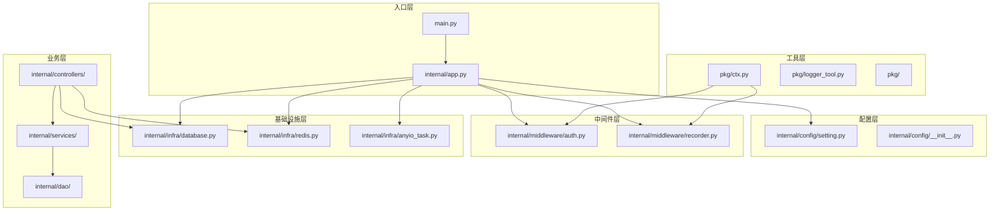

**图表来源**
- [main.py](file://main.py#L1-L19)
- [internal/app.py](file://internal/app.py#L1-L105)
- [internal/config/setting.py](file://internal/config/setting.py#L1-L59)

**章节来源**
- [main.py](file://main.py#L1-L19)
- [internal/app.py](file://internal/app.py#L1-L105)

## 应用工厂模式与生命周期管理

### 工厂模式实现

项目采用经典的工厂模式来创建和配置 FastAPI 应用实例。`create_app()` 函数作为应用的唯一入口点，负责：

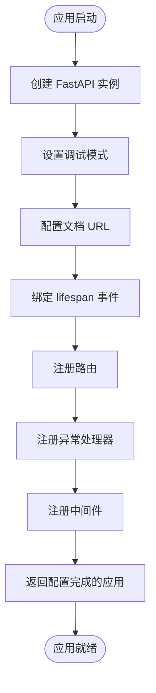

**图表来源**
- [internal/app.py](file://internal/app.py#L17-L30)

### Lifespan 生命周期管理

项目通过 ASGI lifespan 事件实现优雅的资源生命周期管理：

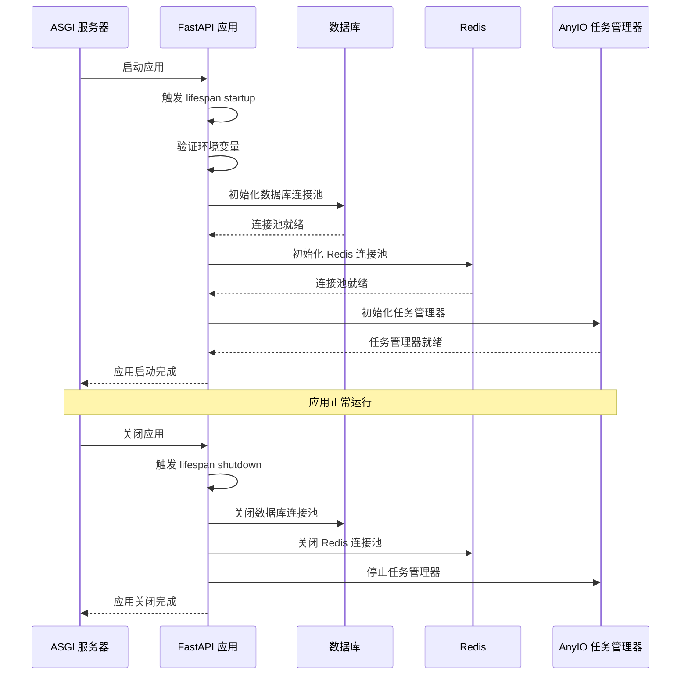

**图表来源**
- [internal/app.py](file://internal/app.py#L79-L104)
- [internal/infra/database.py](file://internal/infra/database.py#L24-L54)
- [internal/infra/redis.py](file://internal/infra/redis.py#L17-L44)
- [internal/infra/anyio_task.py](file://internal/infra/anyio_task.py#L7-L28)

### 资源初始化与清理

每个基础设施组件都提供了完整的初始化和清理机制：

| 组件 | 初始化方法 | 清理方法 | 特点 |
|------|------------|----------|------|
| 数据库 | `init_db()` | `close_db()` | 支持连接池配置，SQL 监控集成 |
| Redis | `init_redis()` | `close_redis()` | 连接池管理，缓存客户端封装 |
| AnyIO 任务 | `init_anyio_task_manager()` | `stop_anyio_task_manager()` | 异步任务调度，优雅关闭 |

**章节来源**
- [internal/app.py](file://internal/app.py#L79-L104)
- [internal/infra/database.py](file://internal/infra/database.py#L24-L64)
- [internal/infra/redis.py](file://internal/infra/redis.py#L17-L58)
- [internal/infra/anyio_task.py](file://internal/infra/anyio_task.py#L7-L28)

## 配置系统设计

### Pydantic 配置架构

项目采用基于 Pydantic 的配置系统，实现了类型安全的环境配置管理：

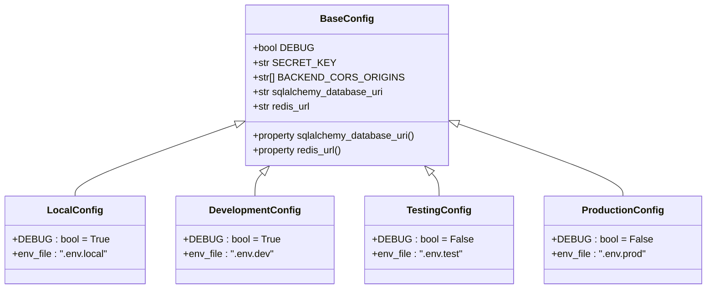

**图表来源**
- [internal/config/__init__.py](file://internal/config/__init__.py#L10-L87)

### 策略模式配置加载

配置系统采用策略模式，根据环境变量动态选择配置类：

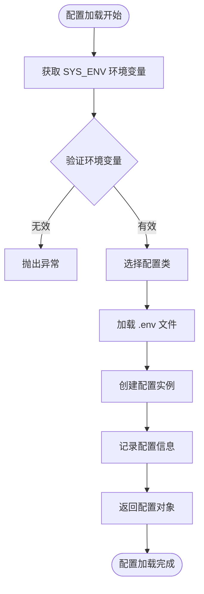

**图表来源**
- [internal/config/setting.py](file://internal/config/setting.py#L9-L52)

### 单例模式配置暴露

配置系统通过单例模式确保全局唯一性：

| 特性 | 实现方式 | 优势 |
|------|----------|------|
| 延迟初始化 | 模块导入时执行 | 避免不必要的配置加载 |
| 类型安全 | Pydantic BaseSettings | 自动类型转换和验证 |
| 环境隔离 | 多环境配置文件 | 开发、测试、生产环境分离 |
| 动态加载 | 策略模式选择 | 根据环境自动适配 |

**章节来源**
- [internal/config/setting.py](file://internal/config/setting.py#L9-L59)
- [internal/config/__init__.py](file://internal/config/__init__.py#L10-L87)

## 上下文管理机制

### ContextVars 异步上下文

项目使用 Python 的 `contextvars` 模块实现异步调用链中的上下文传递：

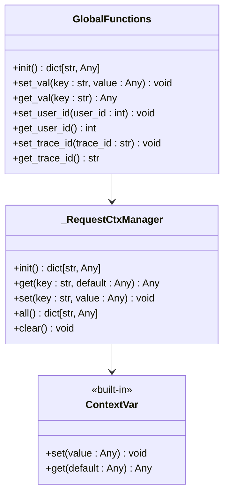

**图表来源**
- [pkg/ctx.py](file://pkg/ctx.py#L9-L106)

### Trace ID 与用户 ID 管理

上下文系统提供完整的分布式追踪支持：

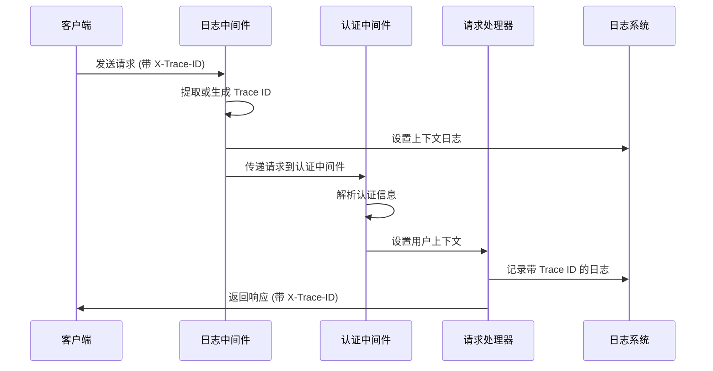

**图表来源**
- [pkg/ctx.py](file://pkg/ctx.py#L14-L106)
- [internal/middleware/recorder.py](file://internal/middleware/recorder.py#L21-L33)
- [internal/middleware/auth.py](file://internal/middleware/auth.py#L88-L91)

### 上下文安全性

系统提供了多层次的安全保障：

| 安全特性 | 实现方式 | 作用 |
|----------|----------|------|
| 防御性编程 | LookupError 捕获 | 避免未初始化的上下文访问 |
| 类型验证 | 参数类型检查 | 确保 trace_id 为字符串 |
| 状态检查 | 上下文存在性验证 | 防止空上下文操作 |
| 错误处理 | 优雅降级 | 提供默认值而非崩溃 |

**章节来源**
- [pkg/ctx.py](file://pkg/ctx.py#L1-L106)

## 中间件架构

### 中间件执行顺序

项目实现了严格的中间件执行顺序，确保请求处理的正确性和性能：

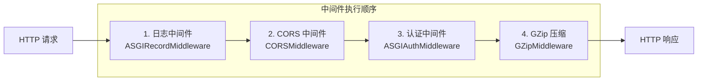

**图表来源**
- [internal/app.py](file://internal/app.py#L54-L76)

### 中间件功能详解

#### 1. 日志中间件 (ASGIRecordMiddleware)

负责请求响应日志记录和性能监控：

| 功能 | 实现细节 | 作用 |
|------|----------|------|
| Trace ID 管理 | 自动生成或提取 X-Trace-ID | 分布式追踪 |
| 请求日志记录 | 记录 IP、方法、路径 | 请求监控 |
| 响应时间计算 | 使用 perf_counter | 性能监控 |
| 响应头注入 | 添加 X-Process-Time | 性能指标 |

#### 2. CORS 中间件

处理跨域请求，支持动态配置：

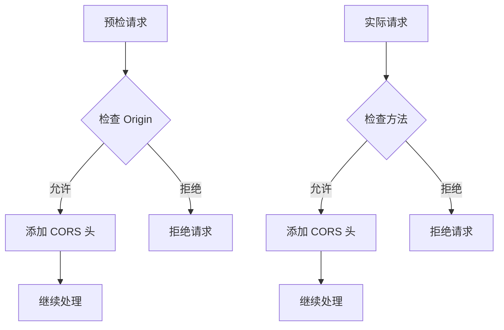

**图表来源**
- [internal/app.py](file://internal/app.py#L63-L72)
- [internal/middleware/recorder.py](file://internal/middleware/recorder.py#L12-L74)

#### 3. 认证中间件 (ASGIAuthMiddleware)

实现复杂的认证策略，支持多种路径前缀：

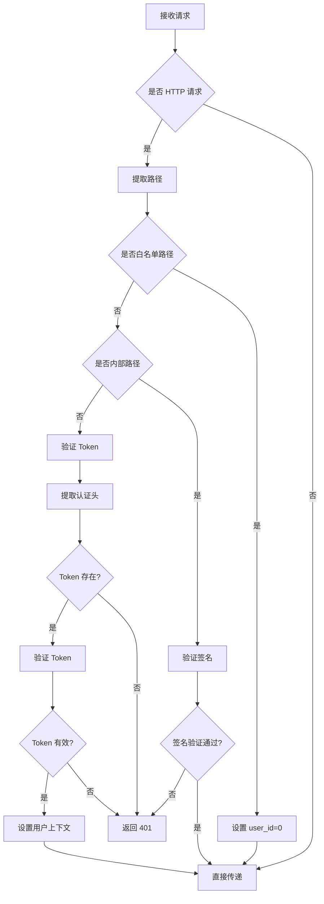

**图表来源**
- [internal/middleware/auth.py](file://internal/middleware/auth.py#L22-L93)

#### 4. GZip 压缩中间件

提供响应压缩，提高传输效率：

| 配置项 | 默认值 | 说明 |
|--------|--------|------|
| compression_level | 6 | 压缩级别 |
| minimum_size | 1024 | 压缩阈值（字节） |
| encoding | gzip | 编码格式 |

**章节来源**
- [internal/app.py](file://internal/app.py#L54-L76)
- [internal/middleware/recorder.py](file://internal/middleware/recorder.py#L12-L74)
- [internal/middleware/auth.py](file://internal/middleware/auth.py#L22-L93)

## 依赖注入与服务管理

### 数据库连接管理

项目实现了完整的数据库连接池管理：

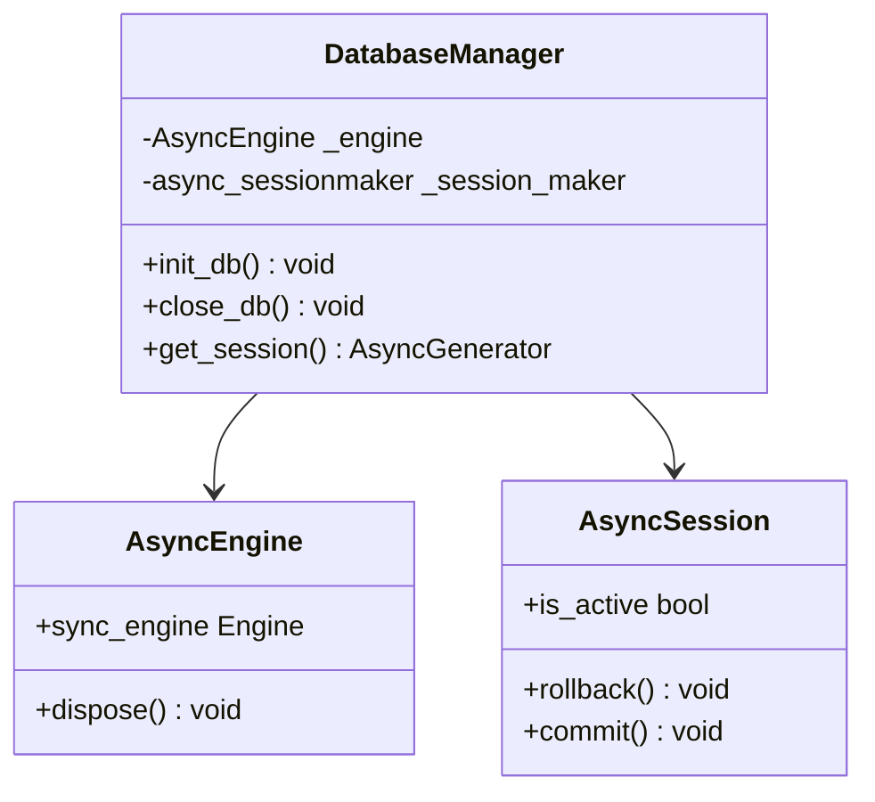

**图表来源**
- [internal/infra/database.py](file://internal/infra/database.py#L17-L140)

### Redis 缓存管理

Redis 服务提供了完整的缓存解决方案：

| 组件 | 功能 | 配置 |
|------|------|------|
| ConnectionPool | 连接池管理 | max_connections=20 |
| Redis Client | 异步客户端 | 支持所有 Redis 命令 |
| CacheClient | 缓存抽象层 | 统一缓存接口 |
| Session Provider | 会话提供者 | 支持上下文管理 |

### 任务调度管理

AnyIO 任务管理器提供异步任务调度能力：

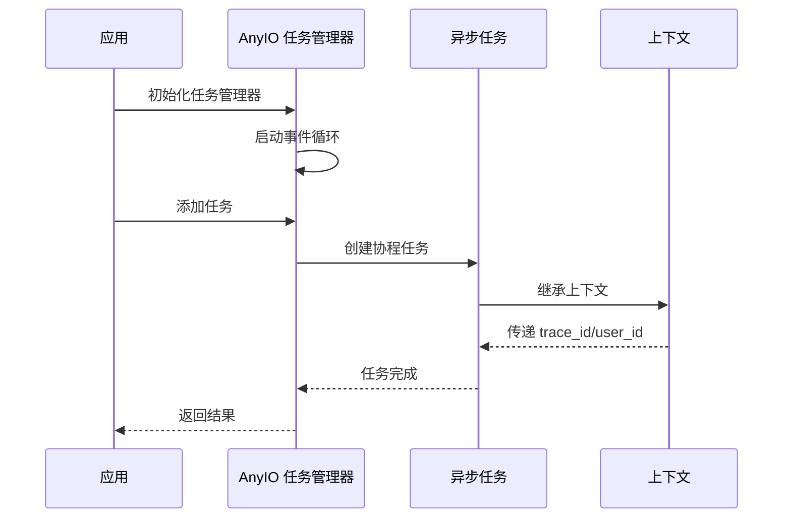

**图表来源**
- [internal/infra/anyio_task.py](file://internal/infra/anyio_task.py#L7-L28)

**章节来源**
- [internal/infra/database.py](file://internal/infra/database.py#L17-L140)
- [internal/infra/redis.py](file://internal/infra/redis.py#L10-L86)
- [internal/infra/anyio_task.py](file://internal/infra/anyio_task.py#L7-L28)

## 分层架构设计

### 控制器层 (Controllers)

控制器层负责 HTTP 请求的路由和处理：

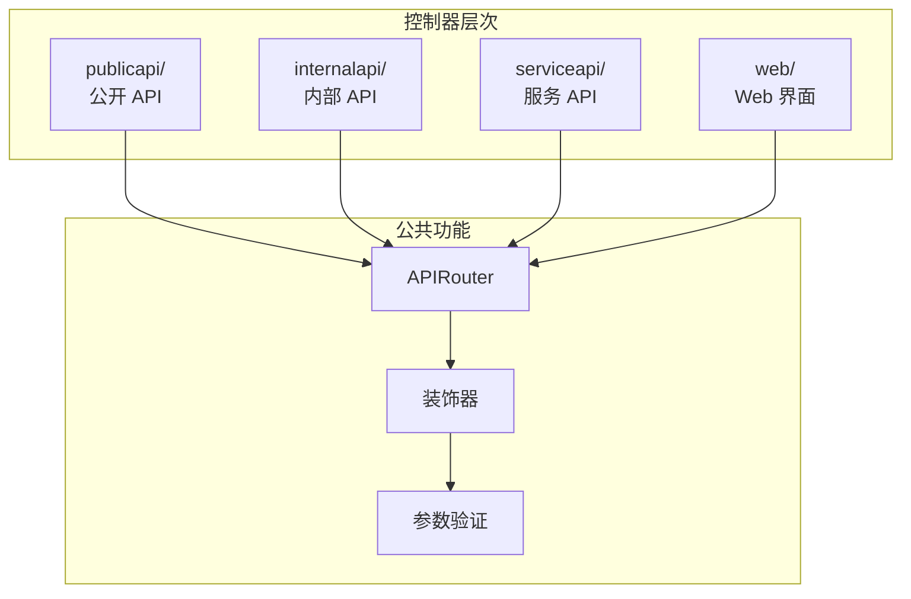

**图表来源**
- [internal/app.py](file://internal/app.py#L33-L41)
- [internal/controllers/publicapi/test.py](file://internal/controllers/publicapi/test.py#L18-L301)

### 服务层 (Services)

服务层提供业务逻辑封装：

| 层次 | 职责 | 实现特点 |
|------|------|----------|
| 业务逻辑 | 核心业务规则 | 独立于框架 |
| 数据访问 | DAO 调用 | 事务管理 |
| 外部集成 | 第三方服务 | 异常处理 |
| 缓存策略 | 性能优化 | 缓存更新 |

### 数据访问层 (DAO)

数据访问对象提供统一的数据操作接口：

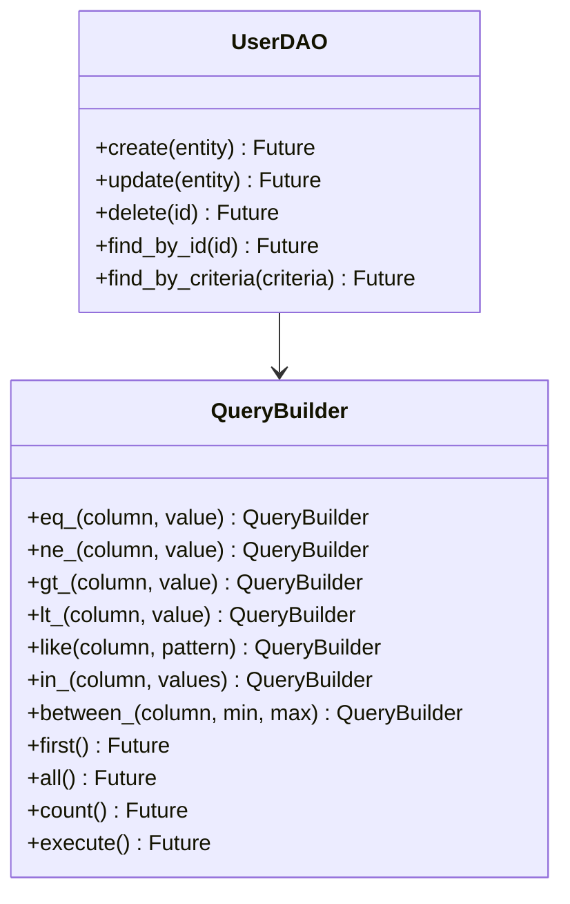

**章节来源**
- [internal/controllers/publicapi/test.py](file://internal/controllers/publicapi/test.py#L18-L301)
- [internal/controllers/serviceapi/user.py](file://internal/controllers/serviceapi/user.py#L1-L11)

## 性能优化策略

### 连接池优化

| 组件 | 连接池配置 | 优化效果 |
|------|------------|----------|
| 数据库 | pool_size=10, max_overflow=20 | 支持高并发查询 |
| Redis | max_connections=20 | 高效缓存访问 |
| HTTP 客户端 | 连接复用 | 减少连接开销 |

### 缓存策略

项目实现了多层次的缓存策略：

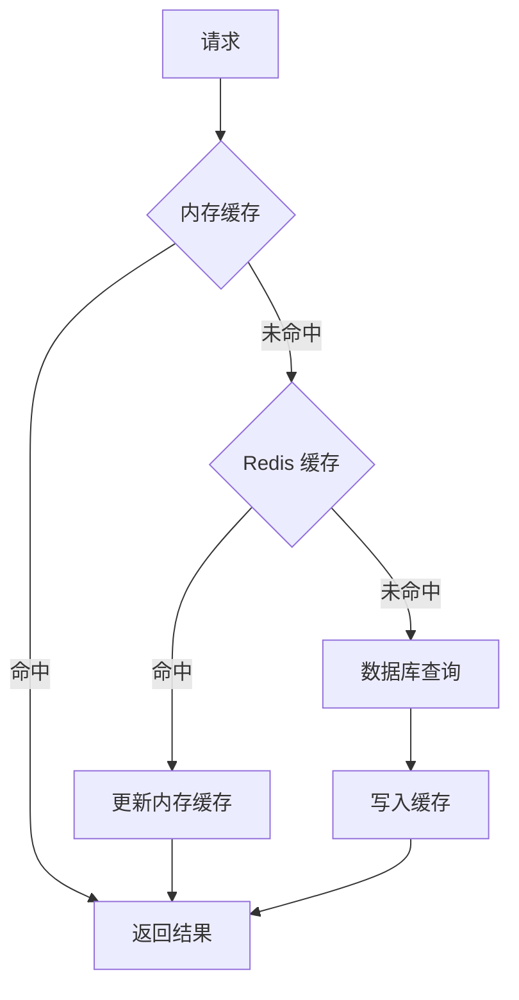

### 异步处理优化

| 优化技术 | 应用场景 | 性能提升 |
|----------|----------|----------|
| 异步数据库操作 | CRUD 操作 | 避免阻塞主线程 |
| 连接池管理 | 数据库连接 | 减少连接建立开销 |
| 任务队列 | 后台任务 | 提升用户体验 |
| 流式响应 | 大数据传输 | 减少内存占用 |

## 总结

本项目通过精心设计的架构实现了以下核心目标：

### 架构优势

1. **模块化设计**：清晰的分层架构便于维护和扩展
2. **生命周期管理**：基于 ASGI lifespan 的资源管理确保应用稳定性
3. **配置驱动**：灵活的配置系统支持多环境部署
4. **上下文传递**：完整的异步上下文管理支持分布式追踪
5. **中间件管道**：有序的中间件执行确保请求处理的正确性

### 设计模式应用

- **工厂模式**：`create_app()` 统一应用初始化
- **策略模式**：配置类的选择和环境切换
- **单例模式**：配置对象和缓存客户端的全局唯一性
- **中间件模式**：请求处理流水线
- **依赖注入**：数据库连接和缓存服务的管理

### 技术特色

- **异步优先**：全面采用异步编程模型
- **类型安全**：Pydantic 配置系统提供编译时类型检查
- **性能优化**：连接池、缓存、压缩等多重优化
- **可观测性**：完整的日志、监控和追踪体系

这种架构设计不仅满足了当前的功能需求，还为未来的扩展和演进奠定了坚实的基础，体现了现代企业级应用开发的最佳实践。