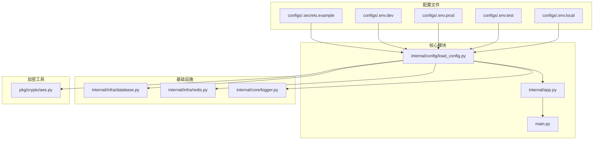
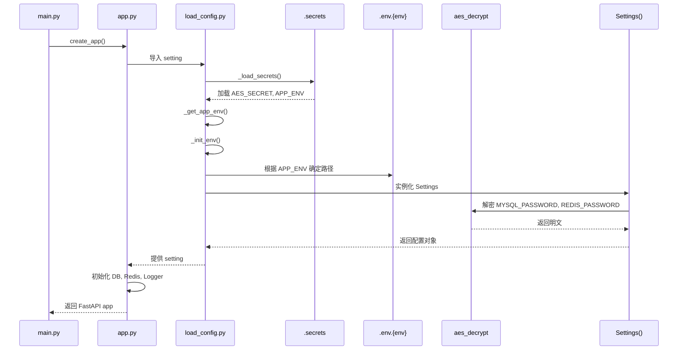
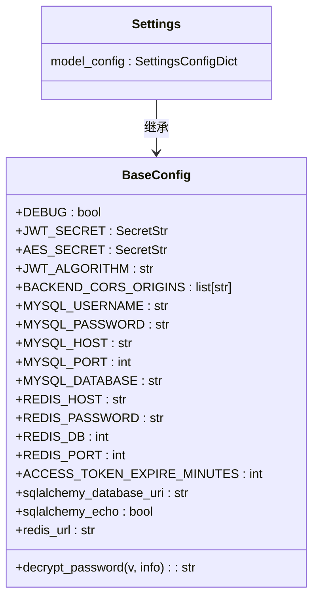
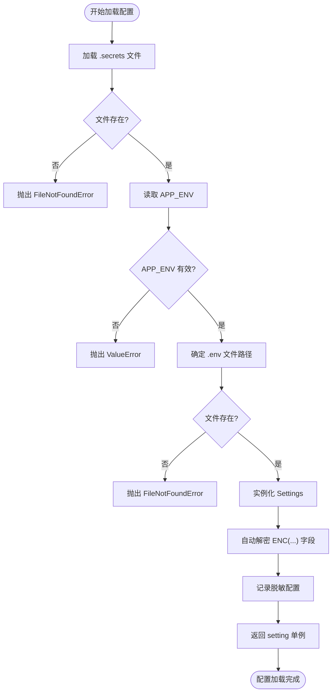
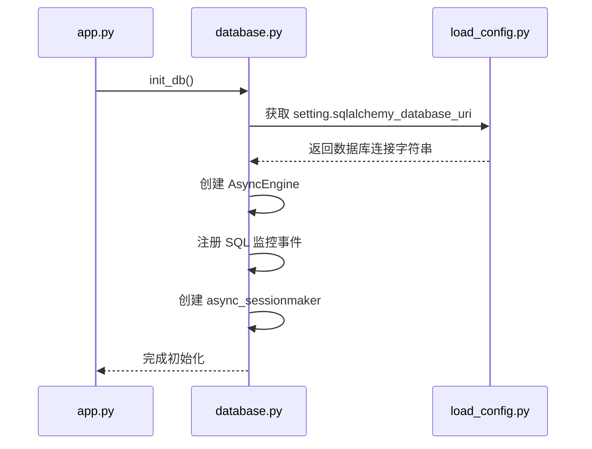
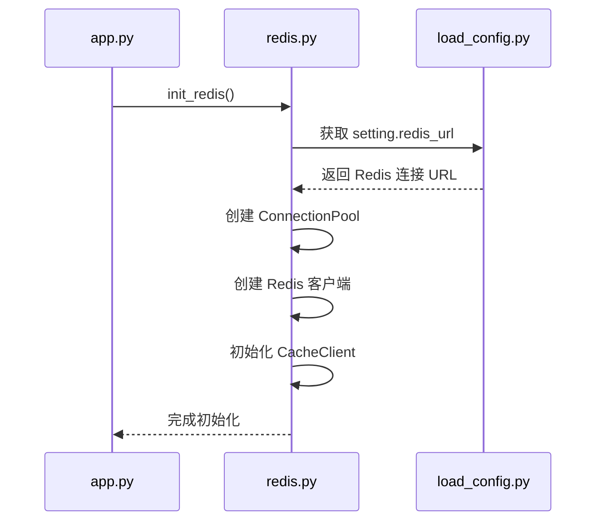
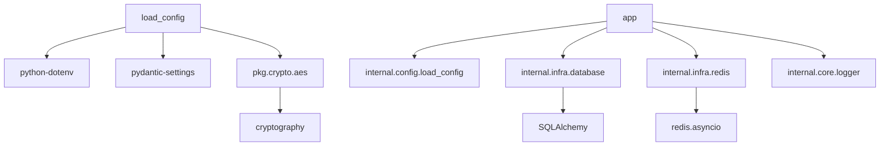

# 配置加载器

<cite>
**本文档中引用的文件**  
- [load_config.py](file://internal/config/load_config.py)
- [.env.dev](file://configs/.env.dev)
- [.env.prod](file://configs/.env.prod)
- [.env.test](file://configs/.env.test)
- [.env.local](file://configs/.env.local)
- [.secrets.example](file://configs/.secrets.example)
- [app.py](file://internal/app.py)
- [main.py](file://main.py)
- [aes.py](file://pkg/crypto/aes.py)
- [database.py](file://internal/infra/database.py)
- [redis.py](file://internal/infra/redis.py)
- [logger.py](file://internal/core/logger.py)
- [pyproject.toml](file://pyproject.toml)
</cite>

## 目录
1. [简介](#简介)
2. [项目结构](#项目结构)
3. [核心组件](#核心组件)
4. [架构概述](#架构概述)
5. [详细组件分析](#详细组件分析)
6. [依赖分析](#依赖分析)
7. [性能考虑](#性能考虑)
8. [故障排除指南](#故障排除指南)
9. [结论](#结论)

## 简介
本项目是一个基于 FastAPI 的后端服务，采用模块化设计，支持多环境配置管理。其核心特性之一是灵活且安全的配置加载机制，通过 `.env` 文件与 `.secrets` 密钥文件分离敏感信息，并结合 Pydantic Settings 实现类型安全的配置解析。系统支持开发、测试、生产等多种环境，通过 `APP_ENV` 环境变量动态加载对应配置。此外，项目集成了数据库、Redis、日志、加密等基础设施，具备良好的可维护性和扩展性。

## 项目结构

**图示来源**  
- [load_config.py](file://internal/config/load_config.py)
- [configs/.env.dev](file://configs/.env.dev)
- [configs/.env.prod](file://configs/.env.prod)
- [configs/.env.test](file://configs/.env.test)
- [configs/.env.local](file://configs/.env.local)
- [configs/.secrets.example](file://configs/.secrets.example)

**章节来源**  
- [load_config.py](file://internal/config/load_config.py)
- [main.py](file://main.py)

## 核心组件

配置加载器是整个系统启动的基础，负责在应用初始化前加载并验证所有必要的环境变量和配置项。它采用单例模式，在模块导入时自动执行初始化流程，确保全局配置对象 `setting` 的唯一性和一致性。该组件不仅支持明文配置，还支持通过 AES 加密敏感字段（如密码），并在运行时自动解密，提升了配置的安全性。

**章节来源**  
- [load_config.py](file://internal/config/load_config.py#L1-L222)
- [app.py](file://internal/app.py#L8)

## 架构概述

**图示来源**  
- [load_config.py](file://internal/config/load_config.py#L1-L222)
- [app.py](file://internal/app.py#L1-L121)
- [main.py](file://main.py#L1-L18)

## 详细组件分析

### 配置加载流程分析

配置加载器实现了分阶段、高安全性的配置初始化流程。首先加载 `.secrets` 文件获取环境标识和解密密钥，然后根据环境标识加载对应的 `.env` 文件，最后通过 Pydantic 模型进行类型验证和自动解密。

#### 配置类结构

**图示来源**  
- [load_config.py](file://internal/config/load_config.py#L77-L185)

#### 加载与解密流程

**图示来源**  
- [load_config.py](file://internal/config/load_config.py#L1-L222)
- [aes.py](file://pkg/crypto/aes.py#L51-L53)

**章节来源**  
- [load_config.py](file://internal/config/load_config.py#L1-L222)
- [aes.py](file://pkg/crypto/aes.py#L1-L59)

### 基础设施集成分析

配置加载器为其他基础设施模块提供必要的连接参数和配置信息，确保系统各组件能够正确初始化。

#### 数据库连接初始化

**图示来源**  
- [app.py](file://internal/app.py#L100)
- [database.py](file://internal/infra/database.py#L24-L54)
- [load_config.py](file://internal/config/load_config.py#L165-L167)

#### Redis 连接初始化

**图示来源**  
- [app.py](file://internal/app.py#L102)
- [redis.py](file://internal/infra/redis.py#L17-L47)
- [load_config.py](file://internal/config/load_config.py#L174-L179)

**章节来源**  
- [database.py](file://internal/infra/database.py#L1-L140)
- [redis.py](file://internal/infra/redis.py#L1-L88)
- [app.py](file://internal/app.py#L1-L121)

## 依赖分析

**图示来源**  
- [pyproject.toml](file://pyproject.toml#L9-L68)
- [load_config.py](file://internal/config/load_config.py#L5-L7)
- [app.py](file://internal/app.py#L8-L15)

**章节来源**  
- [pyproject.toml](file://pyproject.toml#L1-L144)
- [load_config.py](file://internal/config/load_config.py#L1-L222)

## 性能考虑
配置加载器在应用启动时执行，其性能直接影响系统冷启动时间。当前实现中，文件读取和环境变量加载均为同步操作，但由于仅在启动时执行一次，对整体性能影响较小。建议在生产环境中避免频繁重启服务以减少配置加载开销。此外，SQLAlchemy 的 `echo` 参数根据 `DEBUG` 配置动态开启，避免在生产环境记录过多 SQL 日志影响性能。

## 故障排除指南

常见配置相关问题及解决方案：

- **问题：启动时报错 "Secrets file not found"**  
  **原因**：`.secrets` 文件缺失  
  **解决**：复制 `.secrets.example` 为 `.secrets` 并填写正确值

- **问题：启动时报错 "APP_ENV is not set"**  
  **原因**：`.secrets` 文件中未定义 `APP_ENV`  
  **解决**：在 `.secrets` 文件中添加 `APP_ENV=dev` 等有效值

- **问题：数据库连接失败**  
  **原因**：`.env.{env}` 文件中数据库配置错误或密码加密格式不正确  
  **解决**：检查配置项，若使用加密密码，确保格式为 `ENC(encrypted_string)` 且 `AES_SECRET` 正确

- **问题：日志未按预期输出**  
  **原因**：日志配置未正确初始化  
  **解决**：检查 `init_logger()` 调用顺序，确保在配置加载完成后执行

**章节来源**  
- [load_config.py](file://internal/config/load_config.py#L36-L49)
- [logger.py](file://internal/core/logger.py#L27-L37)
- [.secrets.example](file://configs/.secrets.example#L7)

## 结论
该项目的配置加载器设计合理，安全性高，支持多环境管理和敏感信息加密。通过 Pydantic Settings 实现了类型安全的配置管理，并与 FastAPI 生命周期良好集成。建议在团队协作中统一 `.secrets` 文件管理流程，避免敏感信息泄露。整体架构清晰，便于维护和扩展。