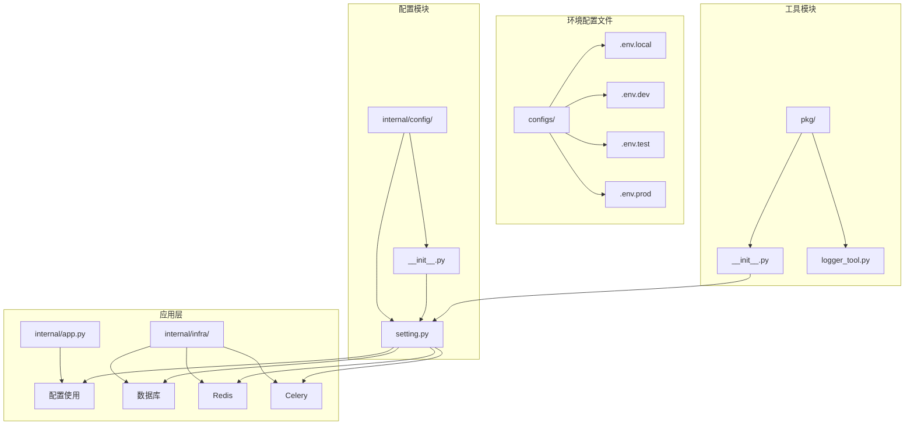
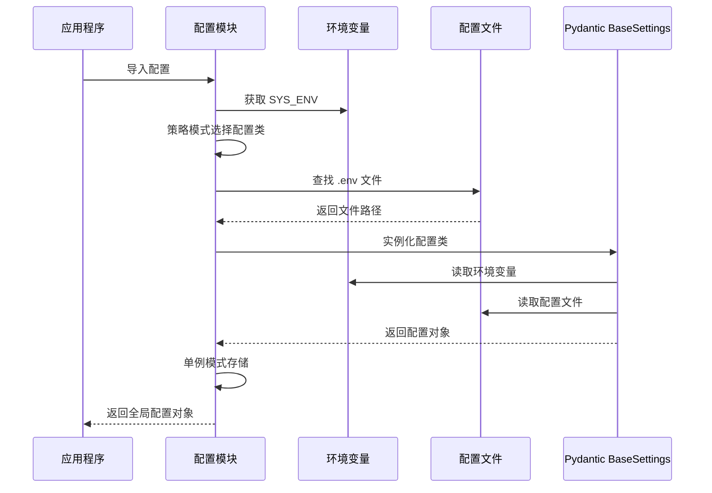
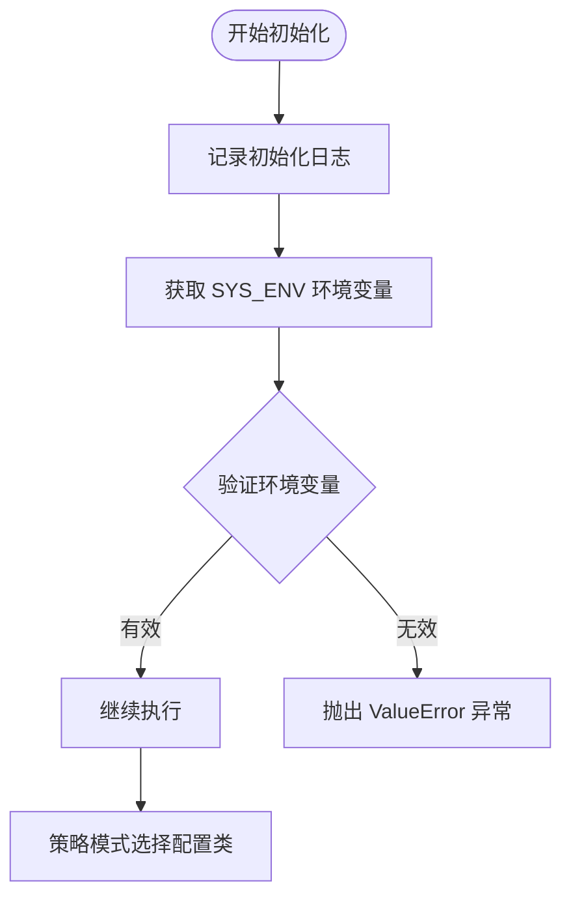
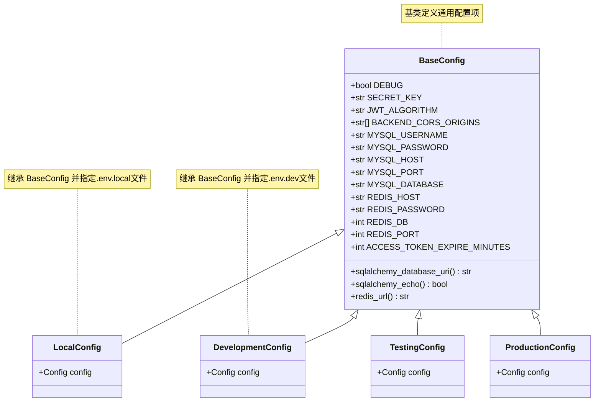
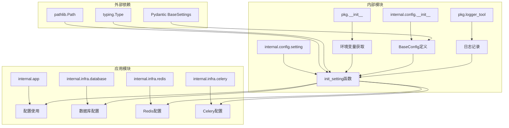

# 配置系统设计

<cite>
**本文档中引用的文件**
- [internal/config/setting.py](file://internal/config/setting.py)
- [internal/config/__init__.py](file://internal/config/__init__.py)
- [pkg/__init__.py](file://pkg/__init__.py)
- [pkg/logger_tool.py](file://pkg/logger_tool.py)
- [configs/.env.local](file://configs/.env.local)
- [configs/.env.dev](file://configs/.env.dev)
- [configs/.env.test](file://configs/.env.test)
- [configs/.env.prod](file://configs/.env.prod)
- [internal/app.py](file://internal/app.py)
- [internal/infra/database.py](file://internal/infra/database.py)
- [internal/infra/redis.py](file://internal/infra/redis.py)
- [internal/infra/celery.py](file://internal/infra/celery.py)
</cite>

## 目录
1. [概述](#概述)
2. [项目结构](#项目结构)
3. [核心组件](#核心组件)
4. [架构概览](#架构概览)
5. [详细组件分析](#详细组件分析)
6. [依赖关系分析](#依赖关系分析)
7. [性能考虑](#性能考虑)
8. [故障排除指南](#故障排除指南)
9. [结论](#结论)

## 概述

本文档深入解析基于 Pydantic BaseSettings 的多环境配置架构，该系统采用策略模式和单例模式，通过环境变量 `SYS_ENV` 动态加载对应的配置文件，实现灵活的多环境配置管理。系统支持本地开发（local）、开发环境（dev）、测试环境（test）和生产环境（prod）四种配置模式，每种模式对应不同的 `.env` 文件和配置参数。

## 项目结构

配置系统的核心文件组织结构如下：

**图表来源**
- [internal/config/__init__.py](file://internal/config/__init__.py#L1-L87)
- [internal/config/setting.py](file://internal/config/setting.py#L1-L58)
- [pkg/__init__.py](file://pkg/__init__.py#L358-L362)

**章节来源**
- [internal/config/__init__.py](file://internal/config/__init__.py#L1-L87)
- [internal/config/setting.py](file://internal/config/setting.py#L1-L58)

## 核心组件

### BaseConfig 基类

`BaseConfig` 是所有配置类的基础，定义了通用的配置项和属性：

- **基础配置**：DEBUG、SECRET_KEY
- **JWT 配置**：JWT_ALGORITHM
- **CORS 配置**：BACKEND_CORS_ORIGINS
- **数据库配置**：MySQL 用户名、密码、主机、端口、数据库
- **Redis 配置**：Redis 主机、密码、数据库、端口
- **Token 配置**：ACCESS_TOKEN_EXPIRE_MINUTES

### 配置类层次结构

系统定义了四个具体的配置类，每个对应不同的运行环境：

- **LocalConfig**：本地开发环境配置
- **DevelopmentConfig**：开发环境配置  
- **TestingConfig**：测试环境配置
- **ProductionConfig**：生产环境配置

### 环境变量系统

环境变量系统通过以下模块实现：

- **SYS_ENV**：当前运行环境标识
- **SYS_NAMESPACE**：环境命名空间映射
- **BASE_DIR**：项目根目录路径

**章节来源**
- [internal/config/__init__.py](file://internal/config/__init__.py#L10-L87)
- [pkg/__init__.py](file://pkg/__init__.py#L29-L40)

## 架构概览

配置系统采用分层架构设计，结合策略模式和单例模式：

**图表来源**
- [internal/config/setting.py](file://internal/config/setting.py#L9-L58)
- [pkg/__init__.py](file://pkg/__init__.py#L29-L40)

## 详细组件分析

### init_setting() 函数执行流程

`init_setting()` 函数是配置系统的核心入口，执行以下步骤：

#### 1. 环境校验

**图表来源**
- [internal/config/setting.py](file://internal/config/setting.py#L14-L27)

#### 2. 配置类选择
系统使用策略模式根据 `SYS_ENV` 选择对应的配置类：

| 环境标识 | 配置类 | 描述 |
|---------|--------|------|
| dev | DevelopmentConfig | 开发环境配置 |
| test | TestingConfig | 测试环境配置 |
| prod | ProductionConfig | 生产环境配置 |
| local | LocalConfig | 本地开发配置 |

#### 3. 文件路径解析
系统根据 `SYS_NAMESPACE` 构建配置文件路径：
- `SYS_NAMESPACE` 为 "local" 时映射为 "dev"
- 其他环境直接使用 `SYS_ENV` 值
- 最终路径格式：`BASE_DIR/configs/.env.{namespace}`

#### 4. 实例化与日志输出
Pydantic BaseSettings 自动处理环境变量覆盖逻辑，系统会：
- 记录配置加载成功信息
- 打印关键配置参数
- 显示数据库连接 URI 和 Redis URL
- 实现敏感信息脱敏（日志中不显示明文密码）

### 单例模式实现

配置系统通过模块级变量 `setting` 确保全局配置对象的唯一性：

**图表来源**
- [internal/config/__init__.py](file://internal/config/__init__.py#L10-L87)

### 配置覆盖优先级

系统遵循以下配置覆盖优先级（从高到低）：

1. **环境变量**：最高优先级，直接覆盖所有配置
2. **.env 文件**：按文件顺序加载，后加载的覆盖前面的
3. **配置类默认值**：最低优先级，作为最终兜底

### 敏感信息脱敏最佳实践

系统在日志输出中实现了敏感信息脱敏：

- **密码字段**：在日志中显示为 `[REDACTED]` 或部分隐藏
- **密钥字段**：显示为简短摘要形式
- **连接字符串**：隐藏用户名和密码部分
- **调试模式控制**：通过 `DEBUG` 控制详细程度

**章节来源**
- [internal/config/setting.py](file://internal/config/setting.py#L9-L58)
- [pkg/logger_tool.py](file://pkg/logger_tool.py#L1-L275)

## 依赖关系分析

配置系统的依赖关系图展示了各模块间的交互：

**图表来源**
- [internal/config/setting.py](file://internal/config/setting.py#L1-L8)
- [pkg/__init__.py](file://pkg/__init__.py#L1-L362)

### 模块耦合度分析

- **低耦合**：配置模块与其他业务模块松耦合
- **高内聚**：配置相关功能集中在配置模块内部
- **单向依赖**：业务模块依赖配置模块，反之不成立

**章节来源**
- [internal/config/setting.py](file://internal/config/setting.py#L1-L8)
- [internal/app.py](file://internal/app.py#L1-L105)

## 性能考虑

### 配置加载优化

1. **延迟加载**：配置在模块首次导入时加载，避免重复初始化
2. **幂等性**：多次导入不会重复创建配置实例
3. **内存优化**：单例模式减少内存占用
4. **快速失败**：环境变量无效时立即抛出异常

### 运行时性能

- **属性访问**：通过@property装饰器提供计算属性
- **连接池**：数据库和Redis连接采用连接池模式
- **异步支持**：所有数据库和缓存操作支持异步

## 故障排除指南

### 常见问题及解决方案

#### 1. 环境变量未正确设置
**症状**：`ValueError: Invalid APP_ENV value: unknown`
**解决**：检查 `APP_ENV` 环境变量设置，确保值为 `local`、`dev`、`test` 或 `prod`

#### 2. 配置文件不存在
**症状**：日志显示 `Env file not found: ...`
**解决**：确认对应环境的 `.env` 文件存在于 `configs/` 目录下

#### 3. 配置加载失败
**症状**：配置对象属性为空或默认值
**解决**：检查环境变量和配置文件语法，确保格式正确

#### 4. 数据库连接失败
**症状**：数据库初始化时连接错误
**解决**：验证数据库配置参数，检查网络连接

### 调试技巧

1. **启用调试模式**：设置 `DEBUG=True` 查看详细配置信息
2. **检查日志输出**：关注配置加载过程中的日志信息
3. **验证环境变量**：使用 `print(SYS_ENV)` 检查环境识别
4. **测试配置访问**：直接访问 `setting.MYSQL_HOST` 等属性验证

**章节来源**
- [internal/config/setting.py](file://internal/config/setting.py#L26-L35)
- [pkg/logger_tool.py](file://pkg/logger_tool.py#L120-L130)

## 结论

该配置系统通过 Pydantic BaseSettings 提供了强大而灵活的配置管理能力，主要特点包括：

1. **多环境支持**：通过策略模式支持多种运行环境
2. **类型安全**：利用 Pydantic 的类型验证确保配置正确性
3. **单例模式**：确保全局配置对象的唯一性和一致性
4. **灵活覆盖**：支持环境变量和配置文件的灵活组合
5. **性能优化**：延迟加载和幂等性设计提升系统性能
6. **安全考虑**：敏感信息脱敏和调试模式控制

该系统为 FastAPI 应用提供了稳定可靠的配置管理基础，支持从本地开发到生产部署的全生命周期需求。通过合理的架构设计和最佳实践，确保了配置系统的可维护性和扩展性。