# 测试策略

<cite>
**本文档引用的文件**
- [pyproject.toml](file://pyproject.toml)
- [tests/test_anyio_file.py](file://tests/test_anyio_file.py)
- [tests/test_context.py](file://tests/test_context.py)
- [tests/test_logger.py](file://tests/test_logger.py)
- [tests/test_logger_json_content.py](file://tests/test_logger_json_content.py)
- [tests/test_logger_rotation.py](file://tests/test_logger_rotation.py)
- [tests/test_anyio_task.py](file://tests/test_anyio_task.py)
- [tests/test_orm.py](file://tests/test_orm.py)
- [configs/.env.test](file://configs/.env.test)
- [pkg/logger_tool.py](file://pkg/logger_tool.py)
- [pkg/anyio_file.py](file://pkg/anyio_file.py)
- [pkg/ctx.py](file://pkg/ctx.py)
- [pkg/database.py](file://pkg/database.py)
</cite>

## 目录
1. [项目测试概览](#项目测试概览)
2. [测试框架配置](#测试框架配置)
3. [测试用例覆盖范围](#测试用例覆盖范围)
4. [异步测试实践](#异步测试实践)
5. [测试工具与辅助](#测试工具与辅助)
6. [测试数据库配置](#测试数据库配置)
7. [测试运行与覆盖率](#测试运行与覆盖率)
8. [CI/CD 集成](#cicd-集成)
9. [测试最佳实践](#测试最佳实践)
10. [编写新测试用例指南](#编写新测试用例指南)

## 项目测试概览

FastAPI 后端项目采用全面的测试策略，涵盖异步文件操作、上下文管理、日志系统、ORM 数据库查询等多个核心功能模块。项目使用 pytest 作为主要测试框架，并结合 pytest-asyncio 支持异步测试。

### 测试架构设计

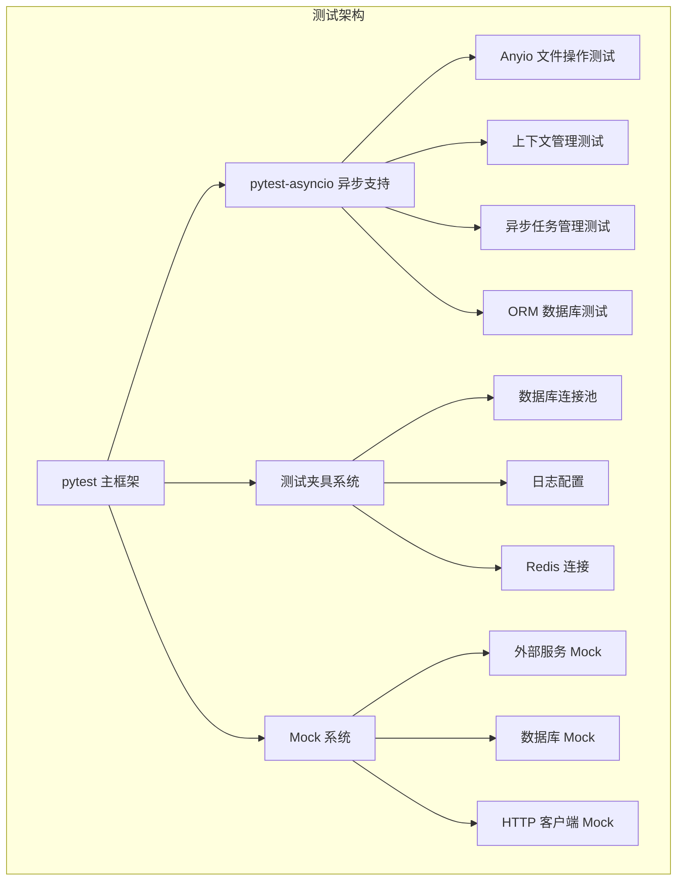

**图表来源**
- [pyproject.toml](file://pyproject.toml#L71-L72)
- [tests/test_orm.py](file://tests/test_orm.py#L1-L50)

**章节来源**
- [pyproject.toml](file://pyproject.toml#L71-L72)
- [tests/test_anyio_file.py](file://tests/test_anyio_file.py#L1-L20)
- [tests/test_context.py](file://tests/test_context.py#L1-L30)

## 测试框架配置

### 核心依赖配置

项目在 `pyproject.toml` 中明确配置了测试相关的依赖：

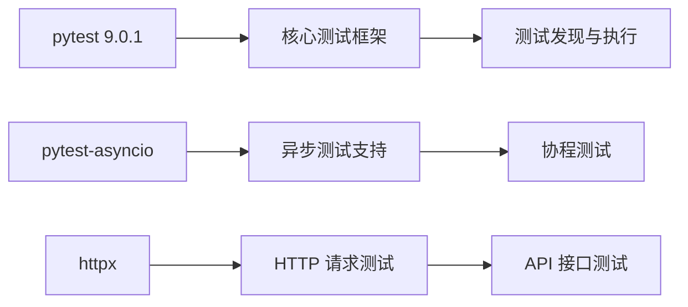

**图表来源**
- [pyproject.toml](file://pyproject.toml#L71-L74)

### 环境配置

测试环境使用专门的配置文件，确保测试隔离：

| 配置项 | 值 | 用途 |
|--------|-----|------|
| MYSQL_DATABASE | xxx_db_test | 测试专用数据库 |
| REDIS_DB | 0 | 测试专用 Redis 数据库 |
| SECRET_KEY | test-SECRET_KEY | 测试密钥 |

**章节来源**
- [pyproject.toml](file://pyproject.toml#L71-L74)
- [configs/.env.test](file://configs/.env.test#L1-L14)

## 测试用例覆盖范围

### 异步文件操作测试 (anyio_file)

测试模块涵盖了 `AnyioFile` 类的所有核心功能：

```mermaid
flowchart TD
A[AnyioFile 测试] --> B[文件基本操作]
A --> C[读写模式测试]
A --> D[目录操作测试]
A --> E[分块读取测试]
A --> F[错误处理测试]
B --> B1[exists() 存在性检查]
B --> B2[unlink() 删除操作]
B --> B3[stat() 文件状态]
C --> C1[text 模式读写]
C --> C2[binary 模式读写]
D --> D1[mkdir() 目录创建]
D --> D2[ensure_parent 自动创建]
E --> E1[read_chunks() 分块读取]
E --> E2[read_lines() 行读取]
```

**图表来源**
- [tests/test_anyio_file.py](file://tests/test_anyio_file.py#L10-L160)

### 上下文管理测试 (ctx)

测试验证了请求上下文的生命周期管理和并发安全性：

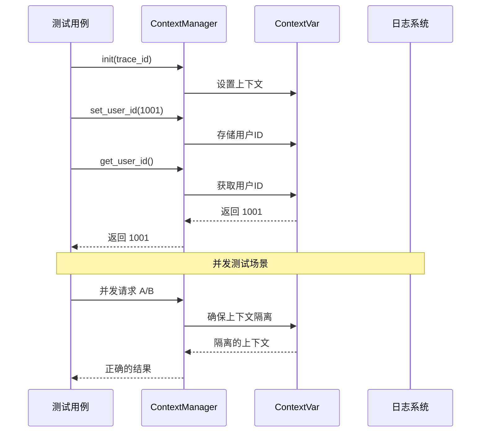

**图表来源**
- [tests/test_context.py](file://tests/test_context.py#L30-L109)
- [pkg/ctx.py](file://pkg/ctx.py#L9-L58)

### 日志系统测试 (logger_tool)

日志系统的测试覆盖了多种场景：

| 测试类别 | 功能点 | 测试重点 |
|----------|--------|----------|
| 基础功能 | 系统日志记录 | 文本格式输出、文件轮转 |
| JSON 内容 | 动态日志类型 | JSON 格式序列化、字段提取 |
| 轮转机制 | 文件轮转策略 | 时间轮转、大小轮转 |
| 保留策略 | 文件清理 | 保留期限、过期删除 |
| 错误处理 | 异常降级 | 权限错误、路径错误 |

**章节来源**
- [tests/test_logger.py](file://tests/test_logger.py#L1-L147)
- [tests/test_logger_json_content.py](file://tests/test_logger_json_content.py#L1-L154)
- [tests/test_logger_rotation.py](file://tests/test_logger_rotation.py#L1-L95)

### ORM 数据库测试

ORM 测试验证了 SQLAlchemy 异步操作的完整性：

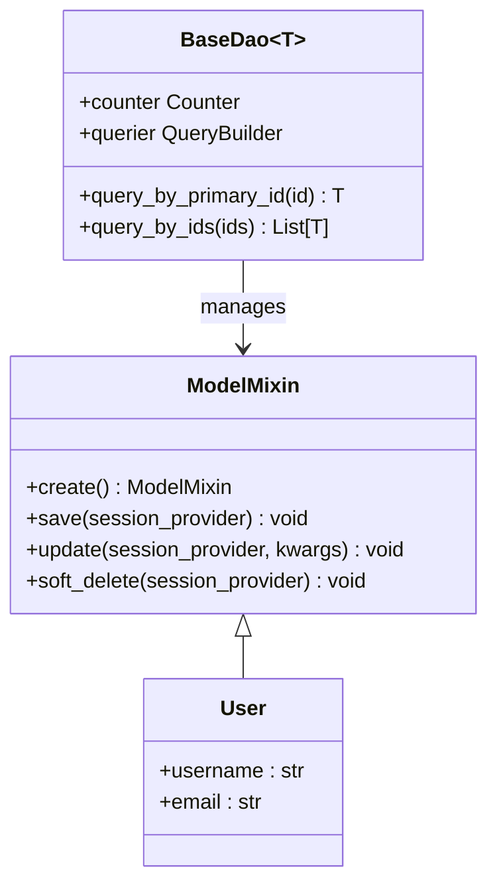

**图表来源**
- [tests/test_orm.py](file://tests/test_orm.py#L65-L73)
- [pkg/database.py](file://pkg/database.py#L74-L200)

**章节来源**
- [tests/test_orm.py](file://tests/test_orm.py#L1-L227)

## 异步测试实践

### pytest-asyncio 配置

项目使用 `pytest-asyncio` 支持异步测试，配置方式如下：

```mermaid
flowchart LR
A[测试标记] --> B[@pytest.mark.anyio]
A --> C[@pytest.mark.asyncio]
B --> D[异步测试函数]
C --> E[协程测试函数]
D --> F[async def test_xxx]
E --> G[async def test_xxx]
F --> H[await 操作]
G --> I[await 操作]
```

**图表来源**
- [tests/test_anyio_file.py](file://tests/test_anyio_file.py#L7-L8)
- [tests/test_context.py](file://tests/test_context.py#L91-L109)

### 异步测试模式

项目采用多种异步测试模式：

| 测试模式 | 使用场景 | 示例 |
|----------|----------|------|
| 协程测试 | 单个异步函数 | `@pytest.mark.asyncio` |
| 异步类测试 | 多个异步方法 | `@pytest.mark.anyio` |
| 并发测试 | 并发场景验证 | `asyncio.create_task()` |
| 超时测试 | 超时处理验证 | `pytest.raises(asyncio.TimeoutError)` |

**章节来源**
- [tests/test_anyio_file.py](file://tests/test_anyio_file.py#L7-L160)
- [tests/test_anyio_task.py](file://tests/test_anyio_task.py#L67-L235)

## 测试工具与辅助

### Mock 系统

项目使用多层次的 Mock 策略：

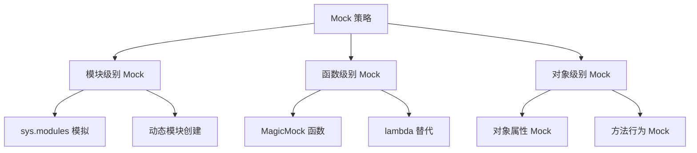

**图表来源**
- [tests/test_orm.py](file://tests/test_orm.py#L16-L50)

### 测试夹具系统

测试夹具提供了标准化的测试环境：

| 夹具类型 | 功能 | 使用场景 |
|----------|------|----------|
| db_session | 数据库连接池 | ORM 测试 |
| logger_setup | 日志配置 | 日志测试 |
| clean_context | 上下文清理 | 上下文测试 |
| manager | 任务管理器 | 异步任务测试 |

**章节来源**
- [tests/test_orm.py](file://tests/test_orm.py#L78-L94)
- [tests/test_context.py](file://tests/test_context.py#L21-L27)

## 测试数据库配置

### 内存数据库测试

项目使用 SQLite 内存数据库进行测试，确保测试隔离：

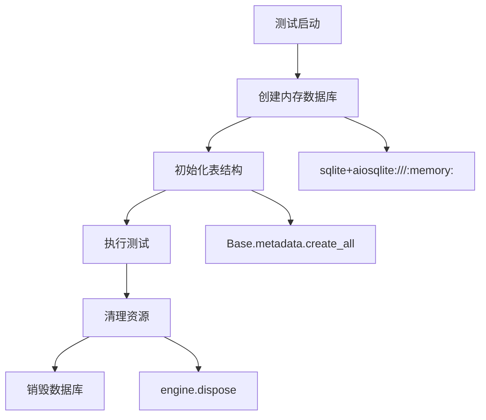

**图表来源**
- [tests/test_orm.py](file://tests/test_orm.py#L82-L94)

### 数据库连接配置

测试数据库使用专门的连接配置：

| 配置项 | 值 | 说明 |
|--------|-----|------|
| 数据库类型 | sqlite+aiosqlite | 异步 SQLite |
| 连接方式 | :memory: | 内存数据库 |
| 回调检测 | pool_pre_ping=True | 连接健康检查 |
| 连接池大小 | pool_size=10 | 最大连接数 |
| 超出限制 | max_overflow=20 | 最大溢出连接 |

**章节来源**
- [tests/test_orm.py](file://tests/test_orm.py#L30-L52)
- [configs/.env.test](file://configs/.env.test#L3-L8)

## 测试运行与覆盖率

### 测试命令配置

项目使用标准的 pytest 命令运行测试：

```bash
# 基本测试运行
pytest

# 异步测试运行
pytest -v --asyncio-mode=auto

# 指定测试文件
pytest tests/test_anyio_file.py

# 生成覆盖率报告
pytest --cov=pkg --cov-report=html
```

### 测试覆盖率策略

| 覆盖率类型 | 目标 | 工具 |
|------------|------|------|
| 行覆盖率 | >90% | coverage.py |
| 分支覆盖率 | >85% | coverage.py |
| 函数覆盖率 | >95% | pytest-cov |
| 模块覆盖率 | >80% | pytest-cov |

### 测试报告生成

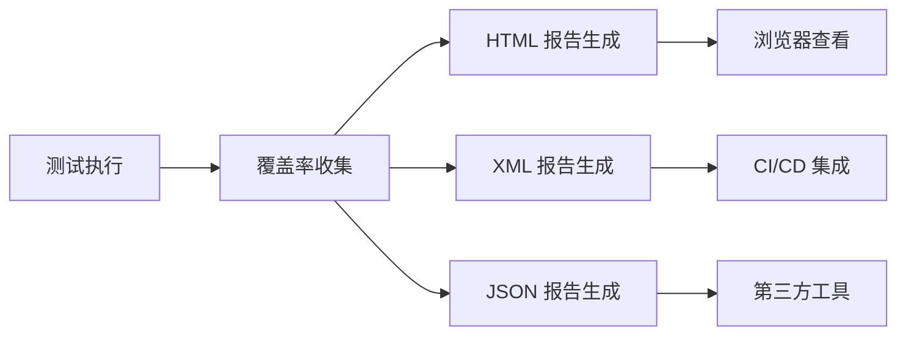

## CI/CD 集成

### 测试流水线设计

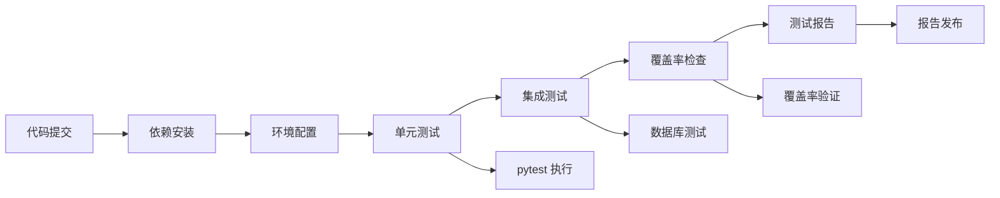

### CI 环境要求

| 环境组件 | 版本要求 | 用途 |
|----------|----------|------|
| Python | >=3.12 | 运行时环境 |
| uv | 最新版本 | 包管理器 |
| MySQL | 8.0+ | 数据库测试 |
| Redis | 6.0+ | 缓存测试 |

**章节来源**
- [docs/uv_use_guide.md](file://docs/uv_use_guide.md#L113-L128)

## 测试最佳实践

### 测试命名规范

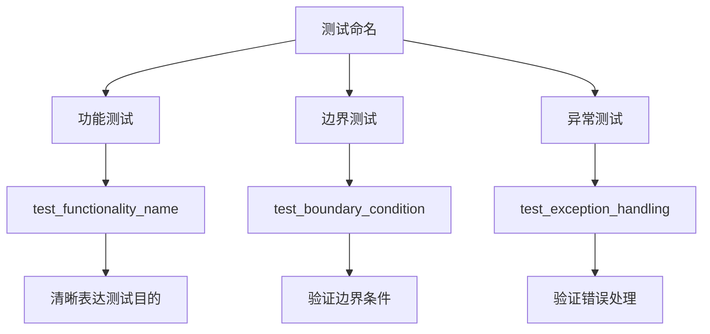

### 测试数据管理

| 数据类型 | 管理方式 | 示例 |
|----------|----------|------|
| 静态数据 | 固定值 | 测试常量 |
| 动态数据 | 生成器 | 随机 ID |
| 外部数据 | Mock | API 响应 |
| 数据库数据 | 测试数据库 | 内存数据库 |

### 测试隔离原则

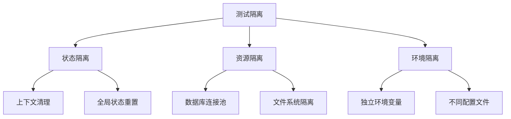

## 编写新测试用例指南

### 测试用例结构模板

```python
@pytest.mark.asyncio
async def test_feature_name():
    """测试功能的简短描述
    
    验证要点：
    - 功能点1
    - 功能点2
    - 边界条件
    """
    
    # Arrange - 准备阶段
    setup_data = create_test_data()
    
    # Act - 执行阶段
    result = await target_function(setup_data)
    
    # Assert - 断言阶段
    assert result is not None
    assert result.property == expected_value
```

### Mock 外部依赖

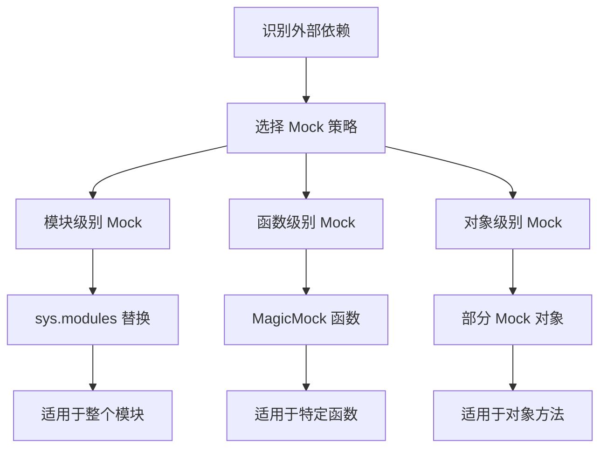

### 测试数据库操作

```python
@pytest_asyncio.fixture
async def test_database():
    """测试数据库夹具"""
    engine = create_async_engine("sqlite+aiosqlite:///:memory:")
    async with engine.begin() as conn:
        await conn.run_sync(Base.metadata.create_all)
    
    session_maker = new_async_session_maker(engine)
    yield session_maker
    
    await engine.dispose()

async def test_database_operation(test_database):
    """测试数据库操作"""
    # 使用 test_database 夹具
    dao = UserDao(session_provider=test_database, model_cls=User)
    
    # 执行测试
    user = User.create(username="test_user")
    await user.save(test_database)
    
    # 验证结果
    db_user = await dao.query_by_primary_id(user.id)
    assert db_user.username == "test_user"
```

### 异步测试最佳实践

| 实践原则 | 说明 | 示例 |
|----------|------|------|
| 明确异步标记 | 使用正确的测试标记 | `@pytest.mark.asyncio` |
| 资源清理 | 确保异步资源正确释放 | `await manager.shutdown()` |
| 超时处理 | 为异步操作设置合理超时 | `pytest.raises(asyncio.TimeoutError)` |
| 并发测试 | 验证并发安全性 | `asyncio.create_task()` |

### 测试调试技巧

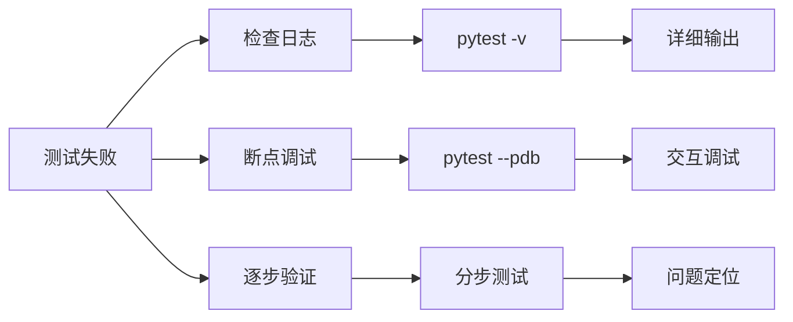

**章节来源**
- [tests/test_anyio_file.py](file://tests/test_anyio_file.py#L1-L160)
- [tests/test_context.py](file://tests/test_context.py#L1-L109)
- [tests/test_logger.py](file://tests/test_logger.py#L1-L147)
- [tests/test_orm.py](file://tests/test_orm.py#L1-L227)