# 单元测试

<cite>
**本文引用的文件**
- [tests/toolkit/test_context.py](file://tests/toolkit/test_context.py)
- [tests/toolkit/test_crypto.py](file://tests/toolkit/test_crypto.py)
- [tests/toolkit/test_jwt.py](file://tests/toolkit/test_jwt.py)
- [tests/toolkit/test_smart_types.py](file://tests/toolkit/test_smart_types.py)
- [tests/logger/test_logger.py](file://tests/logger/test_logger.py)
- [tests/logger/test_logger_rotation.py](file://tests/logger/test_logger_rotation.py)
- [tests/orm/test_orm.py](file://tests/orm/test_orm.py)
- [tests/orm/test_orm_json_type.py](file://tests/orm/test_orm_json_type.py)
- [tests/test_json_response.py](file://tests/test_json_response.py)
- [tests/test_anyio_file.py](file://tests/test_anyio_file.py)
- [tests/test_anyio_task.py](file://tests/test_anyio_task.py)
- [tests/test_celery_tasks.py](file://tests/test_celery_tasks.py)
- [tests/test_http_cli.py](file://tests/test_http_cli.py)
- [tests/test_json_type.py](file://tests/test_json_type.py)
- [tests/__init__.py](file://tests/__init__.py)
</cite>

## 目录
1. [简介](#简介)
2. [项目结构](#项目结构)
3. [核心组件](#核心组件)
4. [架构总览](#架构总览)
5. [详细组件分析](#详细组件分析)
6. [依赖关系分析](#依赖关系分析)
7. [性能考量](#性能考量)
8. [故障排查指南](#故障排查指南)
9. [结论](#结论)
10. [附录](#附录)

## 简介
本文件系统化梳理并文档化本仓库中的单元测试实现，重点覆盖工具包模块的测试：上下文管理器、加密工具、JWT 令牌、智能类型等；同时涵盖日志、ORM、JSON 响应、异步文件与任务、Celery 任务、HTTP 客户端、JSON 类型适配等测试。文档内容包括：
- 测试框架与断言技巧
- 测试数据准备、模拟对象与隔离策略
- 测试覆盖率与质量保证建议
- 单测最佳实践与常见陷阱
- 具体测试用例与调试方法

## 项目结构
测试文件主要位于 tests 目录下，按功能域划分：
- 工具包测试：tests/toolkit 下的上下文、加密、JWT、智能类型
- 日志测试：tests/logger 下的日志与轮转
- ORM 测试：tests/orm 下的通用 ORM 与 JSON 类型
- 响应与 JSON 工具：tests/test_json_response.py
- 异步文件与任务：tests/test_anyio_file.py、tests/test_anyio_task.py
- Celery 任务：tests/test_celery_tasks.py
- HTTP 客户端：tests/test_http_cli.py
- JSON 类型跨数据库适配：tests/test_json_type.py
- 通用测试入口：tests/__init__.py

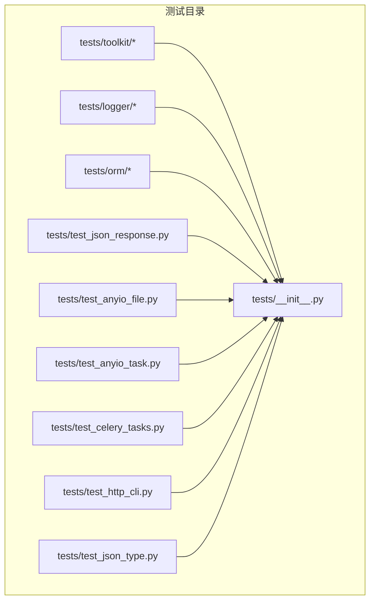

**图表来源**
- [tests/toolkit/test_context.py](file://tests/toolkit/test_context.py#L1-L115)
- [tests/logger/test_logger.py](file://tests/logger/test_logger.py#L1-L141)
- [tests/orm/test_orm.py](file://tests/orm/test_orm.py#L1-L238)
- [tests/test_json_response.py](file://tests/test_json_response.py#L1-L346)
- [tests/test_anyio_file.py](file://tests/test_anyio_file.py#L1-L161)
- [tests/test_anyio_task.py](file://tests/test_anyio_task.py#L1-L235)
- [tests/test_celery_tasks.py](file://tests/test_celery_tasks.py#L1-L362)
- [tests/test_http_cli.py](file://tests/test_http_cli.py#L1-L266)
- [tests/test_json_type.py](file://tests/test_json_type.py#L1-L330)
- [tests/__init__.py](file://tests/__init__.py#L1-L18)

**章节来源**
- [tests/toolkit/test_context.py](file://tests/toolkit/test_context.py#L1-L115)
- [tests/toolkit/test_crypto.py](file://tests/toolkit/test_crypto.py#L1-L211)
- [tests/toolkit/test_jwt.py](file://tests/toolkit/test_jwt.py#L1-L113)
- [tests/toolkit/test_smart_types.py](file://tests/toolkit/test_smart_types.py#L1-L141)
- [tests/logger/test_logger.py](file://tests/logger/test_logger.py#L1-L141)
- [tests/logger/test_logger_rotation.py](file://tests/logger/test_logger_rotation.py#L1-L95)
- [tests/orm/test_orm.py](file://tests/orm/test_orm.py#L1-L238)
- [tests/orm/test_orm_json_type.py](file://tests/orm/test_orm_json_type.py#L1-L217)
- [tests/test_json_response.py](file://tests/test_json_response.py#L1-L346)
- [tests/test_anyio_file.py](file://tests/test_anyio_file.py#L1-L161)
- [tests/test_anyio_task.py](file://tests/test_anyio_task.py#L1-L235)
- [tests/test_celery_tasks.py](file://tests/test_celery_tasks.py#L1-L362)
- [tests/test_http_cli.py](file://tests/test_http_cli.py#L1-L266)
- [tests/test_json_type.py](file://tests/test_json_type.py#L1-L330)
- [tests/__init__.py](file://tests/__init__.py#L1-L18)

## 核心组件
- 上下文管理器测试：验证生命周期、参数校验、并发隔离与异常路径
- 加密工具测试：密码哈希、AES 加解密、工厂与便捷函数
- JWT 令牌测试：签发、校验、过期、格式与密钥校验
- 智能类型测试：JS 安全整数、高精度小数、日期时间的序列化策略
- 日志测试：动态日志器、系统日志、降级逻辑与轮转保留
- ORM 测试：模型创建/保存、严格更新/插入、批量插入、查询构建器、软删除、更新构建器
- JSON 响应测试：orjson 工具链、响应封装、FastAPI 集成与错误处理
- 异步文件与任务：AnyioFile 文件操作、AnyioTaskHandler 任务编排
- Celery 任务：同步/异步执行、重试、路由、链式/组式/回调、撤销
- HTTP 客户端：AsyncHttpClient 请求封装、流式下载、进度回调
- JSON 类型跨数据库：方言适配、序列化/反序列化、变更追踪

**章节来源**
- [tests/toolkit/test_context.py](file://tests/toolkit/test_context.py#L36-L115)
- [tests/toolkit/test_crypto.py](file://tests/toolkit/test_crypto.py#L29-L211)
- [tests/toolkit/test_jwt.py](file://tests/toolkit/test_jwt.py#L20-L113)
- [tests/toolkit/test_smart_types.py](file://tests/toolkit/test_smart_types.py#L22-L141)
- [tests/logger/test_logger.py](file://tests/logger/test_logger.py#L63-L141)
- [tests/logger/test_logger_rotation.py](file://tests/logger/test_logger_rotation.py#L8-L95)
- [tests/orm/test_orm.py](file://tests/orm/test_orm.py#L119-L238)
- [tests/orm/test_orm_json_type.py](file://tests/orm/test_orm_json_type.py#L117-L213)
- [tests/test_json_response.py](file://tests/test_json_response.py#L73-L341)
- [tests/test_anyio_file.py](file://tests/test_anyio_file.py#L10-L161)
- [tests/test_anyio_task.py](file://tests/test_anyio_task.py#L67-L235)
- [tests/test_celery_tasks.py](file://tests/test_celery_tasks.py#L19-L362)
- [tests/test_http_cli.py](file://tests/test_http_cli.py#L10-L262)
- [tests/test_json_type.py](file://tests/test_json_type.py#L49-L330)

## 架构总览
测试体系采用 pytest 驱动，结合多种隔离与模拟策略：
- 模块级 mock：对外部依赖（如日志、上下文、雪花 ID 等）进行 sys.modules 或 types.ModuleType 模拟
- 临时文件系统：利用 tmp_path 提供隔离的磁盘环境
- 内存数据库：SQLite in-memory 用于 ORM 测试，确保快速与隔离
- 异步测试：pytest-asyncio 与 pytest-anyio 驱动协程与并发
- 参数化与夹具：pytest.mark.parametrize 与 @pytest.fixture 提升覆盖面与可维护性

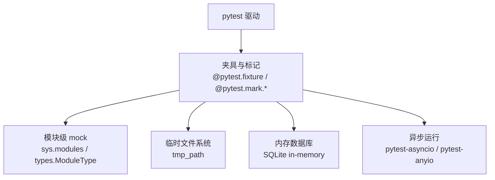

**图表来源**
- [tests/orm/test_orm.py](file://tests/orm/test_orm.py#L92-L106)
- [tests/logger/test_logger.py](file://tests/logger/test_logger.py#L11-L31)
- [tests/test_anyio_file.py](file://tests/test_anyio_file.py#L9-L9)
- [tests/test_anyio_task.py](file://tests/test_anyio_task.py#L51-L63)

**章节来源**
- [tests/orm/test_orm.py](file://tests/orm/test_orm.py#L92-L106)
- [tests/logger/test_logger.py](file://tests/logger/test_logger.py#L11-L31)
- [tests/test_anyio_file.py](file://tests/test_anyio_file.py#L9-L9)
- [tests/test_anyio_task.py](file://tests/test_anyio_task.py#L51-L63)

## 详细组件分析

### 上下文管理器测试
- 生命周期与参数校验：init/set/get/清空，trace_id 用户 ID 设置与校验
- 无初始化访问：get 与 set 的异常路径
- 并发隔离：多任务并发请求，验证 contextvar 隔离
- 模拟策略：对异步日志模块进行 sys.modules 模拟，确保导入顺序正确

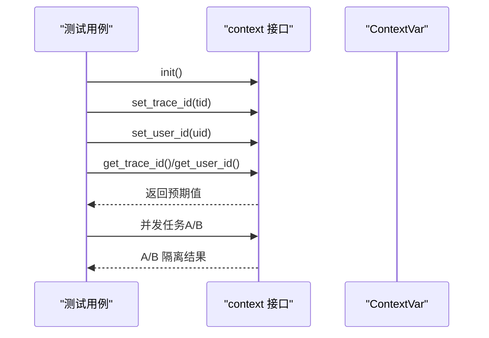

**图表来源**
- [tests/toolkit/test_context.py](file://tests/toolkit/test_context.py#L36-L115)

**章节来源**
- [tests/toolkit/test_context.py](file://tests/toolkit/test_context.py#L25-L115)

### 加密工具测试
- 密码哈希：bcrypt rounds、空密码、验证正确/错误、格式校验
- AES 加密：Key 生成与格式、字符串/字节 Key、加密解密往返、IV 随机性、错误 Key/篡改数据
- 工厂与便捷函数：算法选择、辅助函数往返

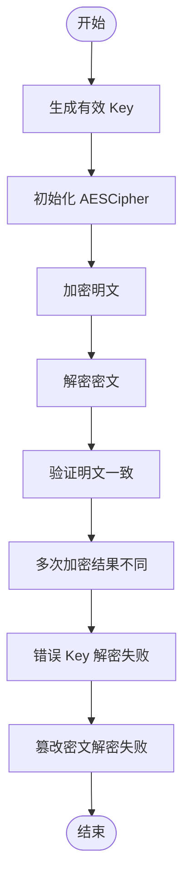

**图表来源**
- [tests/toolkit/test_crypto.py](file://tests/toolkit/test_crypto.py#L101-L183)

**章节来源**
- [tests/toolkit/test_crypto.py](file://tests/toolkit/test_crypto.py#L29-L211)

### JWT 令牌测试
- 成功签发与负载校验、过期时间控制
- 校验失败路径：无前缀、空、过期、密钥错误、缺失用户字段、非法格式

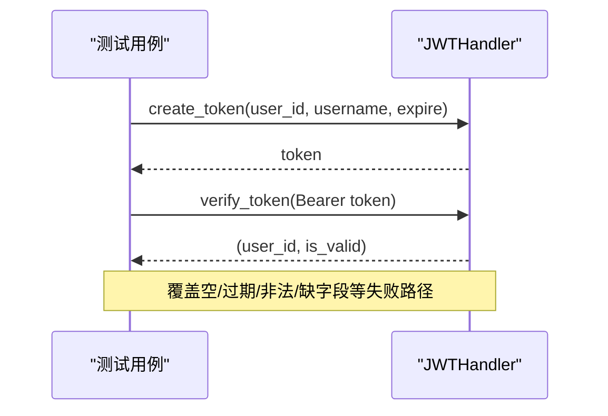

**图表来源**
- [tests/toolkit/test_jwt.py](file://tests/toolkit/test_jwt.py#L20-L113)

**章节来源**
- [tests/toolkit/test_jwt.py](file://tests/toolkit/test_jwt.py#L14-L113)

### 智能类型测试
- SmartInt：JS 安全范围与越界、字符串输入、非法输入
- SmartDecimal：低精度 float、高精度/大数字符串、JSON 序列化策略
- SmartDatetime：ISO 字符串、datetime 对象、非法格式

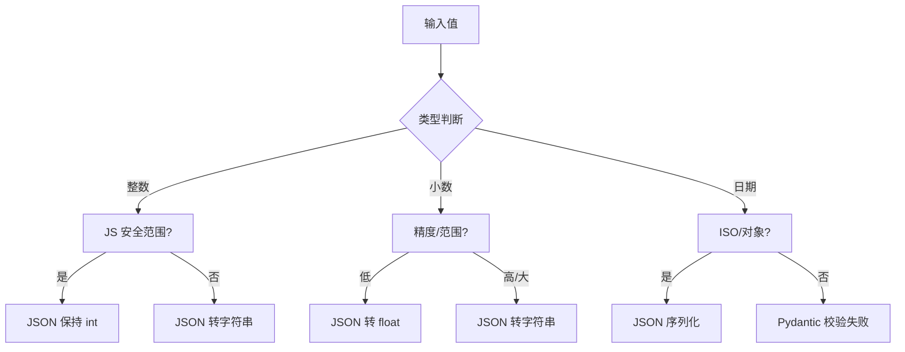

**图表来源**
- [tests/toolkit/test_smart_types.py](file://tests/toolkit/test_smart_types.py#L22-L141)

**章节来源**
- [tests/toolkit/test_smart_types.py](file://tests/toolkit/test_smart_types.py#L12-L141)

### 日志与轮转测试
- 动态日志器：按设备 ID 创建日志器，落盘路径与内容验证
- 系统日志：默认命名空间与文本格式
- 降级逻辑：目录创建失败时降级到 system 命名空间
- 轮转与保留：基于大小/时间的轮转、过期文件清理
- 时区设置：构造函数对 rotation 时区的处理

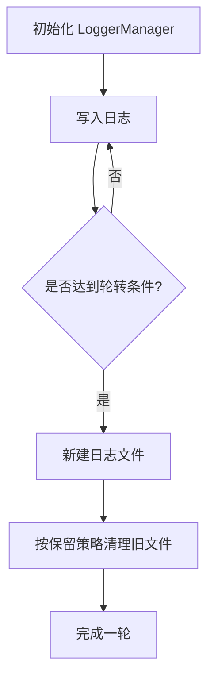

**图表来源**
- [tests/logger/test_logger_rotation.py](file://tests/logger/test_logger_rotation.py#L10-L48)

**章节来源**
- [tests/logger/test_logger.py](file://tests/logger/test_logger.py#L63-L141)
- [tests/logger/test_logger_rotation.py](file://tests/logger/test_logger_rotation.py#L8-L95)

### ORM 与 JSON 类型测试
- ORM：严格插入/更新检查、批量插入、查询构建器、软删除、更新构建器
- JSON 类型：方言适配、序列化/反序列化、Oracle LOB/CLOB 处理、变更追踪

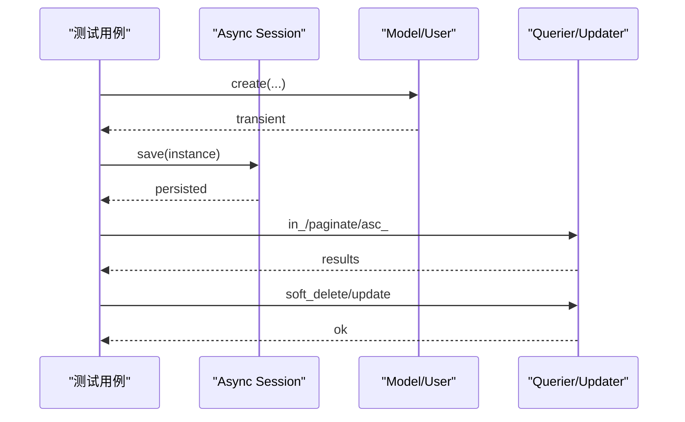

**图表来源**
- [tests/orm/test_orm.py](file://tests/orm/test_orm.py#L119-L238)
- [tests/orm/test_orm_json_type.py](file://tests/orm/test_orm_json_type.py#L117-L213)

**章节来源**
- [tests/orm/test_orm.py](file://tests/orm/test_orm.py#L119-L238)
- [tests/orm/test_orm_json_type.py](file://tests/orm/test_orm_json_type.py#L117-L213)

### JSON 响应与 FastAPI 集成
- orjson 工具：基本类型、Decimal、datetime、numpy 支持、错误处理
- 响应封装：success/error/list/SSE
- FastAPI 集成：TestClient 端到端验证、错误处理与编码

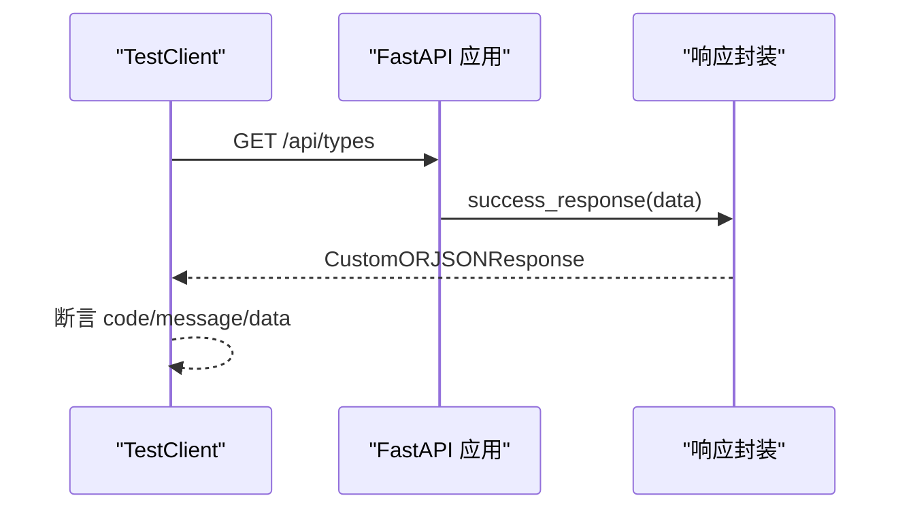

**图表来源**
- [tests/test_json_response.py](file://tests/test_json_response.py#L238-L341)

**章节来源**
- [tests/test_json_response.py](file://tests/test_json_response.py#L73-L341)

### 异步文件与任务测试
- AnyioFile：路径、存在性、文本/二进制读写、分块读取、目录/删除、统计、类型校验
- AnyioTaskHandler：任务添加/去重/超时、取消、并发 gather、线程/进程执行、异常处理、关闭

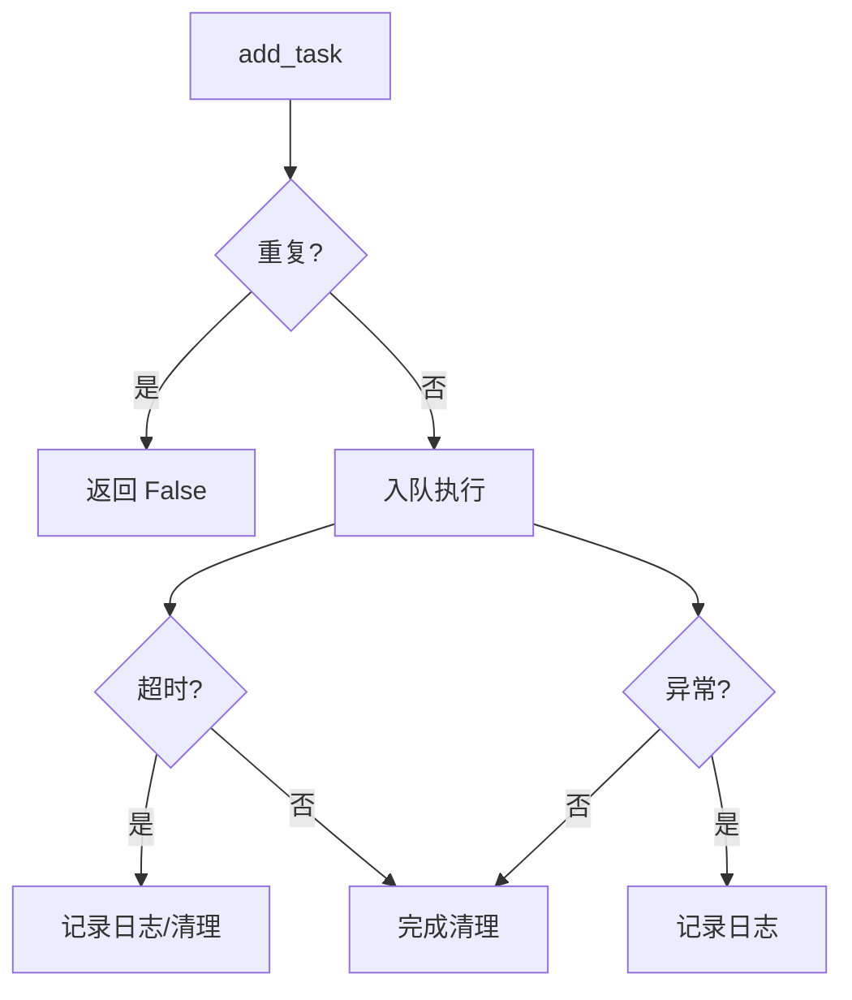

**图表来源**
- [tests/test_anyio_task.py](file://tests/test_anyio_task.py#L95-L142)

**章节来源**
- [tests/test_anyio_file.py](file://tests/test_anyio_file.py#L10-L161)
- [tests/test_anyio_task.py](file://tests/test_anyio_task.py#L67-L235)

### Celery 任务测试
- 同步/异步执行、apply_async、重试、路由、链式/组式/回调、撤销、状态查询、自定义 task_id、延时执行
- 集成测试：Broker 连接、批量执行

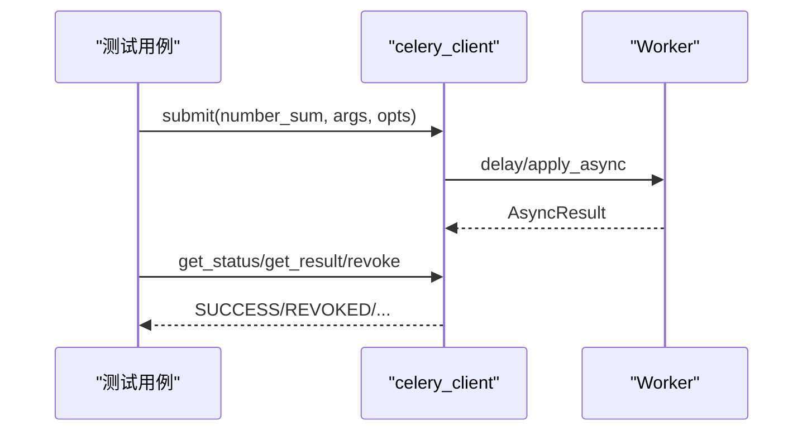

**图表来源**
- [tests/test_celery_tasks.py](file://tests/test_celery_tasks.py#L109-L184)

**章节来源**
- [tests/test_celery_tasks.py](file://tests/test_celery_tasks.py#L19-L362)

### HTTP 客户端测试
- RequestResult：success 判定、JSON 缓存、解析异常
- AsyncHttpClient：初始化、上下文管理、HTTP 方法、错误响应、网络异常、文件下载、流式请求

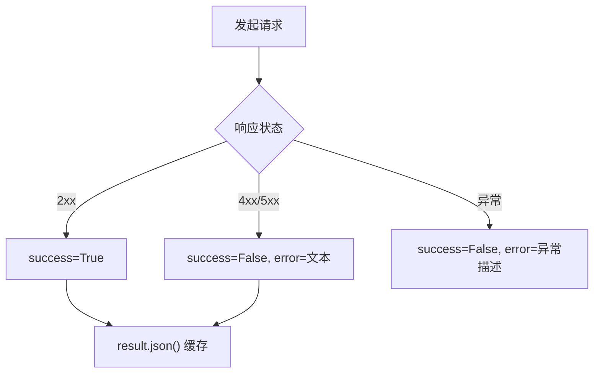

**图表来源**
- [tests/test_http_cli.py](file://tests/test_http_cli.py#L101-L185)

**章节来源**
- [tests/test_http_cli.py](file://tests/test_http_cli.py#L10-L262)

### JSON 类型跨数据库适配测试
- 方言适配：PostgreSQL(JSONB)、MySQL(JSON)、SQLite(JSON)、Oracle(原生/降级)
- 绑定与结果：原生数据库直传、CLOB 模式序列化/反序列化、LOB 对象读取、空字符串与非法 JSON 容错

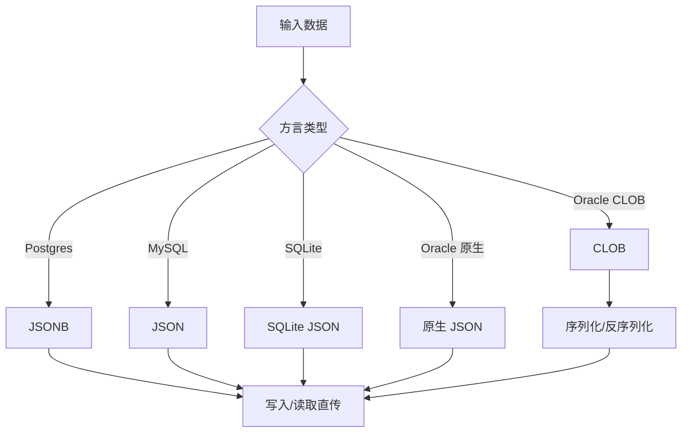

**图表来源**
- [tests/test_json_type.py](file://tests/test_json_type.py#L52-L100)

**章节来源**
- [tests/test_json_type.py](file://tests/test_json_type.py#L49-L330)

## 依赖关系分析
- 测试隔离：tmp_path、内存数据库、模块级 mock、上下文变量隔离
- 外部依赖：pytest、pytest-asyncio、pytest-anyio、httpx、sqlalchemy、loguru、jwt、cryptography、celery、fastapi、pydantic
- 模块耦合：工具包测试依赖 pkg.toolkit.* 与 pkg.crypter.*；ORM 测试依赖 pkg.database.*；日志测试依赖 pkg.toolkit.logger

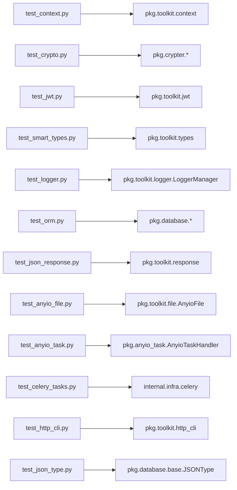

**图表来源**
- [tests/toolkit/test_context.py](file://tests/toolkit/test_context.py#L14-L22)
- [tests/toolkit/test_crypto.py](file://tests/toolkit/test_crypto.py#L4-L10)
- [tests/toolkit/test_jwt.py](file://tests/toolkit/test_jwt.py#L6-L6)
- [tests/toolkit/test_smart_types.py](file://tests/toolkit/test_smart_types.py#L9-L9)
- [tests/logger/test_logger.py](file://tests/logger/test_logger.py#L8-L8)
- [tests/orm/test_orm.py](file://tests/orm/test_orm.py#L66-L70)
- [tests/test_json_response.py](file://tests/test_json_response.py#L23-L31)
- [tests/test_anyio_file.py](file://tests/test_anyio_file.py#L5-L5)
- [tests/test_anyio_task.py](file://tests/test_anyio_task.py#L17-L17)
- [tests/test_celery_tasks.py](file://tests/test_celery_tasks.py#L12-L13)
- [tests/test_http_cli.py](file://tests/test_http_cli.py#L7-L7)
- [tests/test_json_type.py](file://tests/test_json_type.py#L21-L21)

**章节来源**
- [tests/toolkit/test_context.py](file://tests/toolkit/test_context.py#L14-L22)
- [tests/toolkit/test_crypto.py](file://tests/toolkit/test_crypto.py#L4-L10)
- [tests/toolkit/test_jwt.py](file://tests/toolkit/test_jwt.py#L6-L6)
- [tests/toolkit/test_smart_types.py](file://tests/toolkit/test_smart_types.py#L9-L9)
- [tests/logger/test_logger.py](file://tests/logger/test_logger.py#L8-L8)
- [tests/orm/test_orm.py](file://tests/orm/test_orm.py#L66-L70)
- [tests/test_json_response.py](file://tests/test_json_response.py#L23-L31)
- [tests/test_anyio_file.py](file://tests/test_anyio_file.py#L5-L5)
- [tests/test_anyio_task.py](file://tests/test_anyio_task.py#L17-L17)
- [tests/test_celery_tasks.py](file://tests/test_celery_tasks.py#L12-L13)
- [tests/test_http_cli.py](file://tests/test_http_cli.py#L7-L7)
- [tests/test_json_type.py](file://tests/test_json_type.py#L21-L21)

## 性能考量
- 内存数据库：SQLite in-memory 提升 ORM 测试速度，避免磁盘 IO
- 异步并发：pytest-asyncio/pytest-anyio 降低阻塞等待，提升吞吐
- 临时文件：tmp_path 避免磁盘污染，减少 IO 开销
- 模块级 mock：避免真实外部依赖，缩短测试时长
- 参数化与夹具：减少重复代码，提高用例覆盖面与执行效率

[本节为通用指导，无需“章节来源”]

## 故障排查指南
- 日志降级：当动态日志目录创建失败时，验证 system 命名空间日志是否生成
- ORM 严格检查：新对象 save/update、持久化对象再次 save/update 的异常提示
- JWT 校验：确认密钥、过期时间、Bearer 前缀、payload 字段完整性
- AES 解密：错误 Key 与篡改数据均应抛出异常
- HTTP 客户端：区分网络异常与 HTTP 错误，关注 RequestError 与 HTTPStatusError
- Celery：Worker 未启动时跳过异步相关用例，核对 Broker 连接与队列配置
- JSON 类型：Oracle CLOB 模式需序列化/反序列化，LOB 对象需 read()

**章节来源**
- [tests/logger/test_logger.py](file://tests/logger/test_logger.py#L103-L141)
- [tests/orm/test_orm.py](file://tests/orm/test_orm.py#L135-L159)
- [tests/toolkit/test_jwt.py](file://tests/toolkit/test_jwt.py#L85-L113)
- [tests/toolkit/test_crypto.py](file://tests/toolkit/test_crypto.py#L154-L175)
- [tests/test_http_cli.py](file://tests/test_http_cli.py#L176-L185)
- [tests/test_celery_tasks.py](file://tests/test_celery_tasks.py#L40-L84)
- [tests/test_json_type.py](file://tests/test_json_type.py#L210-L227)

## 结论
本仓库的单元测试覆盖了核心工具包与基础设施的关键路径，采用模块级 mock、临时文件系统与内存数据库实现高隔离与高效率。测试用例围绕断言技巧、异常路径、并发隔离与跨平台兼容展开，形成较为完善的质量保障体系。建议持续补充覆盖率报告与自动化门禁，以进一步提升稳定性与可维护性。

[本节为总结，无需“章节来源”]

## 附录
- 测试运行入口：tests/__init__.py 支持直接运行单个测试文件进行调试
- 调试建议：启用 pytest -s/-v/--log-cli-level=INFO，结合 tmp_path 与日志定位问题

**章节来源**
- [tests/__init__.py](file://tests/__init__.py#L15-L18)