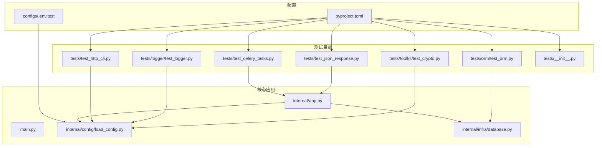
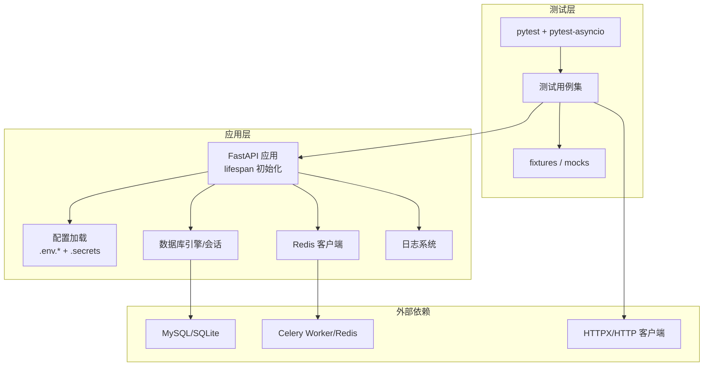
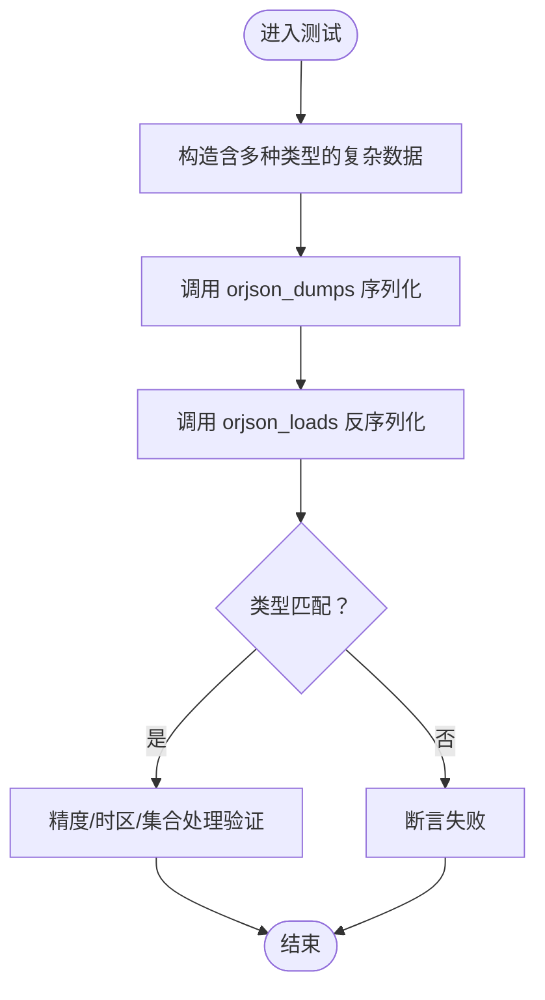
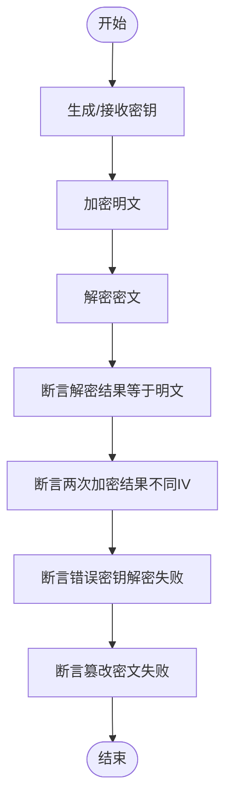
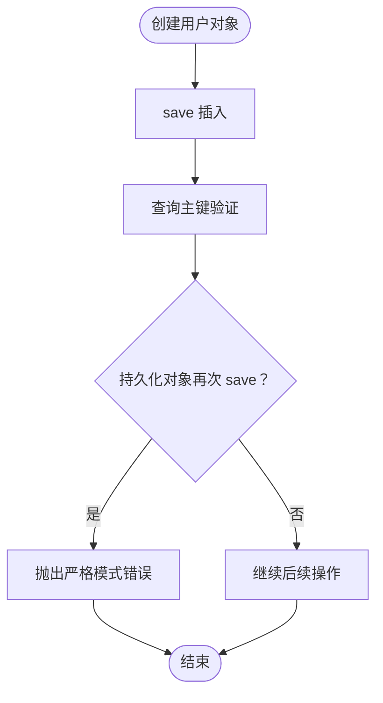
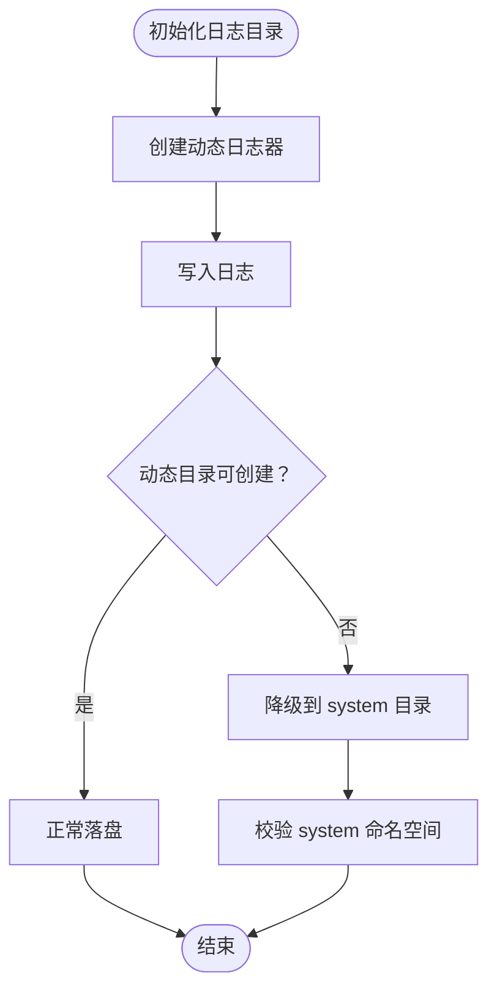
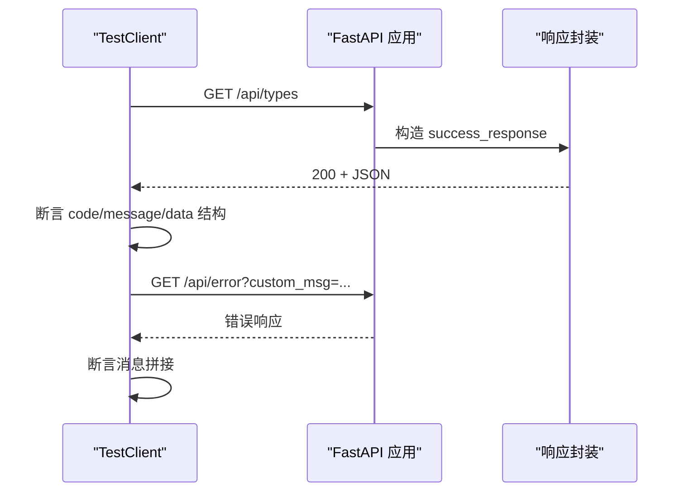
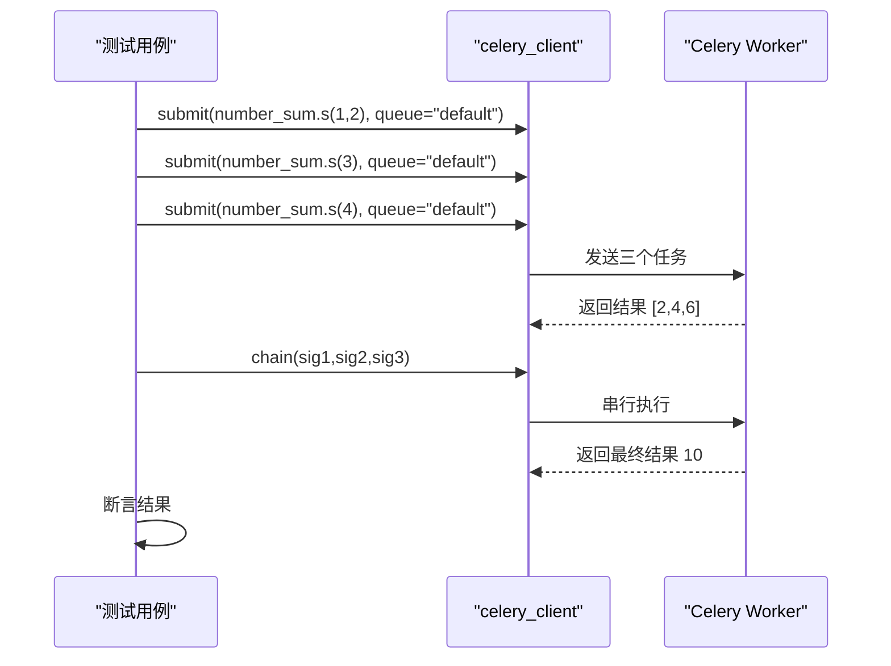
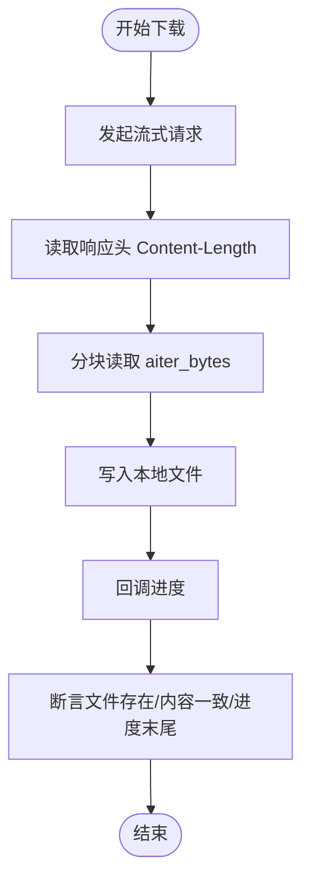
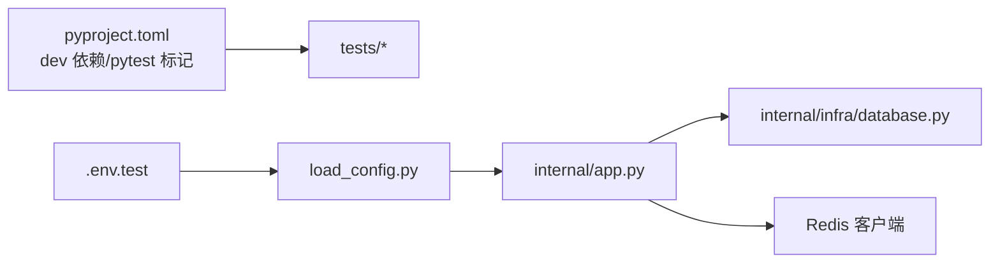

# 测试策略

<cite>
**本文引用的文件**
- [pyproject.toml](file://pyproject.toml)
- [tests/__init__.py](file://tests/__init__.py)
- [configs/.env.test](file://configs/.env.test)
- [internal/app.py](file://internal/app.py)
- [main.py](file://main.py)
- [internal/infra/database.py](file://internal/infra/database.py)
- [internal/config/load_config.py](file://internal/config/load_config.py)
- [tests/test_json_response.py](file://tests/test_json_response.py)
- [tests/toolkit/test_crypto.py](file://tests/toolkit/test_crypto.py)
- [tests/orm/test_orm.py](file://tests/orm/test_orm.py)
- [tests/logger/test_logger.py](file://tests/logger/test_logger.py)
- [tests/test_celery_tasks.py](file://tests/test_celery_tasks.py)
- [tests/test_http_cli.py](file://tests/test_http_cli.py)
</cite>

## 目录
1. [引言](#引言)
2. [项目结构](#项目结构)
3. [核心组件](#核心组件)
4. [架构总览](#架构总览)
5. [详细组件分析](#详细组件分析)
6. [依赖分析](#依赖分析)
7. [性能考量](#性能考量)
8. [故障排查指南](#故障排查指南)
9. [结论](#结论)
10. [附录](#附录)

## 引言
本测试策略文档面向该 FastAPI 后端项目的测试体系，系统阐述单元测试、集成测试与测试配置的实施方法；解释测试框架选择与配置（pytest 等）；给出测试用例设计原则与编写规范；覆盖 API 测试、数据库测试、工具包测试的具体示例；明确测试覆盖率与质量标准；说明持续集成与自动化测试流程；并提供测试数据管理、模拟对象使用与测试环境配置的最佳实践，以及常见问题与调试技巧。

## 项目结构
该项目采用“分层+功能模块”组织方式，测试覆盖工具包、ORM、日志、HTTP 客户端、Celery 任务与 FastAPI 应用层。测试目录与核心模块关系如下：

图表来源
- [tests/test_json_response.py](file://tests/test_json_response.py#L1-L346)
- [tests/toolkit/test_crypto.py](file://tests/toolkit/test_crypto.py#L1-L211)
- [tests/orm/test_orm.py](file://tests/orm/test_orm.py#L1-L238)
- [tests/logger/test_logger.py](file://tests/logger/test_logger.py#L1-L141)
- [tests/test_celery_tasks.py](file://tests/test_celery_tasks.py#L1-L362)
- [tests/test_http_cli.py](file://tests/test_http_cli.py#L1-L266)
- [internal/app.py](file://internal/app.py#L1-L109)
- [main.py](file://main.py#L1-L18)
- [internal/config/load_config.py](file://internal/config/load_config.py#L1-L243)
- [internal/infra/database.py](file://internal/infra/database.py#L1-L154)
- [configs/.env.test](file://configs/.env.test#L1-L20)
- [pyproject.toml](file://pyproject.toml#L151-L155)

章节来源
- [pyproject.toml](file://pyproject.toml#L151-L155)
- [configs/.env.test](file://configs/.env.test#L1-L20)
- [internal/app.py](file://internal/app.py#L1-L109)
- [internal/infra/database.py](file://internal/infra/database.py#L1-L154)
- [internal/config/load_config.py](file://internal/config/load_config.py#L1-L243)

## 核心组件
- 测试框架与标记
  - 使用 pytest 与 pytest-asyncio；在配置中声明集成测试标记 integration，便于区分需要完整环境（如 Celery Worker、Redis）的测试。
- 测试入口与运行
  - tests/__init__.py 支持直接运行单个测试文件进行调试，便于快速定位问题。
- 配置加载与测试环境
  - 通过 .env.test 提供测试环境的数据库与 Redis 连接参数；配置加载模块负责从 .secrets 与 .env.* 组合加载环境变量，并支持敏感字段解密。
- 应用生命周期与中间件
  - internal/app.py 定义 FastAPI 应用创建、路由注册、异常处理与中间件；lifespan 负责初始化数据库、Redis、日志等资源。
- 数据库与 ORM
  - internal/infra/database.py 提供异步数据库引擎与会话管理；tests/orm/test_orm.py 使用内存 SQLite 与异步 fixture 进行 ORM 单元测试。
- 工具包测试
  - JSON/响应封装、密码哈希、AES 加解密、HTTP 客户端、日志管理、Celery 客户端等均有独立测试用例。

章节来源
- [pyproject.toml](file://pyproject.toml#L80-L93)
- [pyproject.toml](file://pyproject.toml#L151-L155)
- [tests/__init__.py](file://tests/__init__.py#L15-L18)
- [configs/.env.test](file://configs/.env.test#L1-L20)
- [internal/config/load_config.py](file://internal/config/load_config.py#L179-L243)
- [internal/app.py](file://internal/app.py#L17-L109)
- [internal/infra/database.py](file://internal/infra/database.py#L26-L111)
- [tests/orm/test_orm.py](file://tests/orm/test_orm.py#L88-L113)

## 架构总览
下图展示测试策略在系统中的位置与交互关系，包括测试框架、配置加载、应用生命周期、数据库与外部依赖（Redis/Celery）的关系。

图表来源
- [pyproject.toml](file://pyproject.toml#L80-L93)
- [internal/app.py](file://internal/app.py#L85-L109)
- [internal/config/load_config.py](file://internal/config/load_config.py#L179-L243)
- [internal/infra/database.py](file://internal/infra/database.py#L26-L111)
- [tests/test_celery_tasks.py](file://tests/test_celery_tasks.py#L1-L362)
- [tests/test_http_cli.py](file://tests/test_http_cli.py#L1-L266)

## 详细组件分析

### 单元测试：JSON 工具与响应封装
- 目标
  - 验证 JSON 序列化/反序列化、Decimal/时间/集合/NumPy 等类型处理；验证响应封装结构与错误消息渲染；验证 SSE 数据包装。
- 设计要点
  - 使用 parametrize 覆盖多种输入；使用 fixtures 生成复杂嵌套数据；对异常路径进行断言；对 HTTP 传输链路进行端到端验证。
- 关键流程（序列化回环）

图表来源
- [tests/test_json_response.py](file://tests/test_json_response.py#L73-L159)
- [tests/test_json_response.py](file://tests/test_json_response.py#L166-L229)
- [tests/test_json_response.py](file://tests/test_json_response.py#L275-L341)

章节来源
- [tests/test_json_response.py](file://tests/test_json_response.py#L73-L159)
- [tests/test_json_response.py](file://tests/test_json_response.py#L166-L229)
- [tests/test_json_response.py](file://tests/test_json_response.py#L275-L341)

### 单元测试：密码哈希与 AES 加解密
- 目标
  - 验证密码哈希算法正确性、盐值与轮数控制；验证 AES 加解密一致性、IV 机制、错误密钥与篡改检测；验证工厂与便捷函数。
- 设计要点
  - 使用 anyio 标记进行异步测试；对空明文/空哈希、非法格式等边界条件进行断言；对重复加密结果进行差异化验证。
- 关键流程（AES 加解密循环）

图表来源
- [tests/toolkit/test_crypto.py](file://tests/toolkit/test_crypto.py#L90-L183)
- [tests/toolkit/test_crypto.py](file://tests/toolkit/test_crypto.py#L190-L211)

章节来源
- [tests/toolkit/test_crypto.py](file://tests/toolkit/test_crypto.py#L28-L83)
- [tests/toolkit/test_crypto.py](file://tests/toolkit/test_crypto.py#L90-L183)
- [tests/toolkit/test_crypto.py](file://tests/toolkit/test_crypto.py#L190-L211)

### 单元测试：ORM 与数据库访问层
- 目标
  - 验证 ModelMixin/BaseDao 的创建/保存/更新/批量插入/查询构建/软删除/更新器构建等行为；验证严格模式与异常提示。
- 设计要点
  - 使用内存 SQLite 引擎与异步 fixture；通过 sys.modules mock 部分 pkg 工具模块；对空 IN 列表等边界条件断言。
- 关键流程（异步会话与严格保存）

图表来源
- [tests/orm/test_orm.py](file://tests/orm/test_orm.py#L119-L139)
- [tests/orm/test_orm.py](file://tests/orm/test_orm.py#L141-L159)

章节来源
- [tests/orm/test_orm.py](file://tests/orm/test_orm.py#L88-L113)
- [tests/orm/test_orm.py](file://tests/orm/test_orm.py#L119-L139)
- [tests/orm/test_orm.py](file://tests/orm/test_orm.py#L141-L159)
- [tests/orm/test_orm.py](file://tests/orm/test_orm.py#L162-L186)
- [tests/orm/test_orm.py](file://tests/orm/test_orm.py#L188-L212)
- [tests/orm/test_orm.py](file://tests/orm/test_orm.py#L214-L238)

### 单元测试：日志工具
- 目标
  - 验证系统日志与动态日志的落盘路径与内容；验证目录创建失败时的降级逻辑与命名空间切换。
- 设计要点
  - 使用 tmp_path 与 monkeypatch 模拟文件系统与内部方法；对 JSON 文本格式差异进行适配解析。
- 关键流程（动态日志降级）

图表来源
- [tests/logger/test_logger.py](file://tests/logger/test_logger.py#L103-L141)

章节来源
- [tests/logger/test_logger.py](file://tests/logger/test_logger.py#L63-L82)
- [tests/logger/test_logger.py](file://tests/logger/test_logger.py#L84-L101)
- [tests/logger/test_logger.py](file://tests/logger/test_logger.py#L103-L141)

### 集成测试：FastAPI 应用与 TestClient
- 目标
  - 使用 TestClient 对应用端点进行 HTTP 级别验证，覆盖复杂类型传输、统一响应结构、错误处理与编码。
- 设计要点
  - 定义测试应用与端点；对响应体结构、Content-Type、编码与错误消息进行断言；对 NaN/Infinity 等非标准值进行健壮性验证。
- 关键序列（HTTP 端到端）

图表来源
- [tests/test_json_response.py](file://tests/test_json_response.py#L234-L272)
- [tests/test_json_response.py](file://tests/test_json_response.py#L275-L341)

章节来源
- [tests/test_json_response.py](file://tests/test_json_response.py#L234-L272)
- [tests/test_json_response.py](file://tests/test_json_response.py#L275-L341)

### 集成测试：Celery 任务与客户端
- 目标
  - 验证任务同步/异步执行、重试、路由、客户端提交、状态查询、链式/并发/回调模式、撤销与延迟执行；集成标记 integration 需要完整环境。
- 设计要点
  - 使用 pytest.skip 处理 Worker 不可用场景；对超时与状态进行断言；对自定义 task_id/countdown 等选项进行验证。
- 关键序列（链式调用）

图表来源
- [tests/test_celery_tasks.py](file://tests/test_celery_tasks.py#L208-L241)
- [tests/test_celery_tasks.py](file://tests/test_celery_tasks.py#L321-L351)

章节来源
- [tests/test_celery_tasks.py](file://tests/test_celery_tasks.py#L22-L84)
- [tests/test_celery_tasks.py](file://tests/test_celery_tasks.py#L85-L141)
- [tests/test_celery_tasks.py](file://tests/test_celery_tasks.py#L208-L241)
- [tests/test_celery_tasks.py](file://tests/test_celery_tasks.py#L321-L351)

### 单元测试：HTTP 客户端
- 目标
  - 验证异步 HTTP 客户端的请求封装、错误消息提取、JSON 缓存、文件下载与流式请求。
- 设计要点
  - 使用 AsyncMock/patch 模拟 HTTPX；对 2xx/4xx/5xx 与异常路径分别断言；对下载进度回调进行验证。
- 关键流程（文件下载）

图表来源
- [tests/test_http_cli.py](file://tests/test_http_cli.py#L187-L223)

章节来源
- [tests/test_http_cli.py](file://tests/test_http_cli.py#L10-L68)
- [tests/test_http_cli.py](file://tests/test_http_cli.py#L121-L144)
- [tests/test_http_cli.py](file://tests/test_http_cli.py#L161-L185)
- [tests/test_http_cli.py](file://tests/test_http_cli.py#L187-L223)
- [tests/test_http_cli.py](file://tests/test_http_cli.py#L245-L262)

## 依赖分析
- 测试框架与工具
  - pytest、pytest-asyncio、httpx、pytest-tornasync、pytest-trio、pytest-twisted 等在 dev 依赖中声明，支持多运行时与异步测试。
- 标记与分组
  - 在 pytest.ini_options 中定义 integration 标记，用于标识需要完整环境的测试。
- 配置加载
  - 通过 .env.test 与 .secrets 组合加载配置；配置模块支持敏感字段解密与数据库/Redis URL 动态生成。
- 应用生命周期
  - FastAPI lifespan 负责初始化数据库、Redis、日志、签名认证、Snowflake ID 生成器与 AnyIO 任务管理器。

图表来源
- [pyproject.toml](file://pyproject.toml#L80-L93)
- [pyproject.toml](file://pyproject.toml#L151-L155)
- [configs/.env.test](file://configs/.env.test#L1-L20)
- [internal/config/load_config.py](file://internal/config/load_config.py#L179-L243)
- [internal/app.py](file://internal/app.py#L85-L109)
- [internal/infra/database.py](file://internal/infra/database.py#L26-L111)

章节来源
- [pyproject.toml](file://pyproject.toml#L80-L93)
- [pyproject.toml](file://pyproject.toml#L151-L155)
- [configs/.env.test](file://configs/.env.test#L1-L20)
- [internal/config/load_config.py](file://internal/config/load_config.py#L179-L243)
- [internal/app.py](file://internal/app.py#L85-L109)
- [internal/infra/database.py](file://internal/infra/database.py#L26-L111)

## 性能考量
- 异步测试与事件循环
  - 使用 pytest-asyncio 与 @pytest_asyncio.fixture，确保异步测试稳定；对内存数据库（SQLite）进行批量插入与查询，减少 IO 延迟。
- 日志与慢 SQL 监控
  - 数据库层注册事件监听，基于配置阈值输出慢查询日志，有助于定位性能瓶颈。
- HTTP 客户端缓存
  - RequestResult 对 JSON 解析进行缓存，避免重复解析带来的开销。
- 建议
  - 在集成测试中尽量使用内存数据库与本地 Redis；对耗时操作（如 Celery）使用 skip 降级，保证测试稳定性与速度。

## 故障排查指南
- 配置加载失败
  - 确认 .secrets 与 .env.test 存在且 APP_ENV 正确；检查敏感字段是否以 ENC(...) 包裹并可被 AES_SECRET 解密。
- 数据库连接异常
  - 检查 .env.test 中 DB_* 与 REDIS_* 参数；确认数据库驱动与连接字符串生成逻辑；关注 Slow SQL 日志。
- Celery Worker 不可用
  - 对异步/链式/并发/回调等测试使用 pytest.skip；确保 Redis Broker 可达；核对队列与任务路由配置。
- 日志路径与降级
  - 若动态日志目录创建失败，应降级至 system 目录；验证 system 命名空间与文本格式日志。
- HTTP 客户端错误
  - 对 JSON 解析失败、网络错误、HTTP 状态错误进行分类断言；检查缓存与错误消息提取逻辑。

章节来源
- [internal/config/load_config.py](file://internal/config/load_config.py#L184-L243)
- [internal/infra/database.py](file://internal/infra/database.py#L116-L154)
- [tests/test_celery_tasks.py](file://tests/test_celery_tasks.py#L328-L351)
- [tests/logger/test_logger.py](file://tests/logger/test_logger.py#L103-L141)
- [tests/test_http_cli.py](file://tests/test_http_cli.py#L59-L68)

## 结论
本测试策略以 pytest 为核心，结合单元测试与集成测试，覆盖工具包、ORM、日志、HTTP 客户端与 Celery 任务等关键模块。通过配置加载与应用生命周期管理，确保测试环境与生产一致。建议在持续集成中区分轻量单元测试与需要完整环境的集成测试，配合覆盖率与质量门禁，保障代码质量与交付效率。

## 附录

### 测试用例设计原则与编写规范
- 原则
  - 单一职责：每个测试聚焦一个功能点或边界条件。
  - 可重复性：使用 fixtures 与临时目录，避免副作用。
  - 可维护性：参数化与分层组织，减少重复代码。
  - 可观测性：对关键路径输出日志与断言，便于定位问题。
- 规范
  - 使用 @pytest.mark.asyncio/@pytest_asyncio.fixture 标注异步测试。
  - 对异常路径使用 pytest.raises 或 skip，避免阻塞流水线。
  - 对外部依赖使用 patch/mocks，隔离系统状态。

### API 测试示例
- 使用 TestClient 对端点进行 HTTP 级别验证，断言统一响应结构与错误消息拼接。

章节来源
- [tests/test_json_response.py](file://tests/test_json_response.py#L275-L341)

### 数据库测试示例
- 使用内存 SQLite 与异步 fixture；验证严格模式、批量插入、查询构建、软删除与更新器逻辑。

章节来源
- [tests/orm/test_orm.py](file://tests/orm/test_orm.py#L88-L113)
- [tests/orm/test_orm.py](file://tests/orm/test_orm.py#L119-L139)
- [tests/orm/test_orm.py](file://tests/orm/test_orm.py#L162-L186)
- [tests/orm/test_orm.py](file://tests/orm/test_orm.py#L188-L212)
- [tests/orm/test_orm.py](file://tests/orm/test_orm.py#L214-L238)

### 工具包测试示例
- JSON/响应封装、密码哈希、AES 加解密、HTTP 客户端、日志管理均有独立测试用例。

章节来源
- [tests/test_json_response.py](file://tests/test_json_response.py#L73-L159)
- [tests/toolkit/test_crypto.py](file://tests/toolkit/test_crypto.py#L28-L83)
- [tests/test_http_cli.py](file://tests/test_http_cli.py#L10-L68)

### 测试覆盖率与质量标准
- 建议
  - 单元测试行覆盖率不低于 80%，关键路径不低于 90%。
  - 对异常分支与边界条件进行 100% 覆盖。
  - 集成测试中对核心业务流程进行端到端验证。
  - 在 CI 中设置覆盖率阈值与质量门禁。

### 持续集成与自动化测试流程
- 建议
  - 分离轻量单元测试与集成测试；集成测试使用标记 integration 并在专用阶段运行。
  - 使用容器化 Redis/数据库，确保环境一致性。
  - 对 Celery 测试在 Worker 可用时执行，否则跳过。

章节来源
- [pyproject.toml](file://pyproject.toml#L151-L155)
- [tests/test_celery_tasks.py](file://tests/test_celery_tasks.py#L328-L351)

### 测试数据管理与模拟对象
- 测试数据
  - 使用 fixtures 生成最小化、可复用的数据；对复杂场景使用 parametrize。
- 模拟对象
  - 使用 unittest.mock/pytest.patch/mocks；对 pkg 工具模块进行 sys.modules 替换，隔离外部依赖。

章节来源
- [tests/orm/test_orm.py](file://tests/orm/test_orm.py#L25-L61)
- [tests/test_http_cli.py](file://tests/test_http_cli.py#L1-L7)

### 测试环境配置
- 环境变量
  - 使用 .env.test 提供数据库与 Redis 连接参数；通过 .secrets 与 .env.* 组合加载配置。
- 应用初始化
  - FastAPI lifespan 负责初始化数据库、Redis、日志等；确保测试与生产一致。

章节来源
- [configs/.env.test](file://configs/.env.test#L1-L20)
- [internal/config/load_config.py](file://internal/config/load_config.py#L179-L243)
- [internal/app.py](file://internal/app.py#L85-L109)