# 测试策略

<cite>
**本文引用的文件**
- [tests/conftest.py](file://tests/conftest.py)
- [pyproject.toml](file://pyproject.toml)
- [configs/.env.test](file://configs/.env.test)
- [internal/app.py](file://internal/app.py)
- [main.py](file://main.py)
- [internal/infra/database.py](file://internal/infra/database.py)
- [internal/config/loader.py](file://internal/config/loader.py)
- [tests/test_json_response.py](file://tests/test_json_response.py)
- [tests/toolkit/test_crypto.py](file://tests/toolkit/test_crypto.py)
- [tests/orm/test_orm.py](file://tests/orm/test_orm.py)
- [tests/orm/test_orm_json_type.py](file://tests/orm/test_orm_json_type.py)
- [tests/logger/test_logger.py](file://tests/logger/test_logger.py)
- [tests/test_celery_tasks.py](file://tests/test_celery_tasks.py)
- [tests/test_http_cli.py](file://tests/test_http_cli.py)
- [pkg/zvec_vector/base.py](file://pkg/zvec_vector/base.py)
- [pkg/zvec_vector/__init__.py](file://pkg/zvec_vector/__init__.py)
- [pkg/zvec_vector/README.md](file://pkg/zvec_vector/README.md)
- [tests/zvec_vector/test_base.py](file://tests/zvec_vector/test_base.py)
- [tests/zvec_vector/__init__.py](file://tests/zvec_vector/__init__.py)
- [tests/test_anyio_task.py](file://tests/test_anyio_task.py)
- [pkg/database/dao.py](file://pkg/database/dao.py)
- [pkg/database/builder.py](file://pkg/database/builder.py)
- [pkg/database/base.py](file://pkg/database/base.py)
</cite>

## 更新摘要
**所做更改**
- 全面重构测试基础设施，新增集中式 pytest 配置文件
- 新增丰富的测试 fixtures，涵盖数据库、Redis、FastAPI 应用和通用工具
- 新增向量数据库模块测试覆盖率，包括单元测试、集成测试和测试配置
- 更新测试标记系统，引入集成测试、慢速测试等分类
- **重大更新**：全面迁移到异步测试模式，统一使用 pytest-asyncio 和 anyio 后端
- 增强外部依赖 mock 机制，提高测试隔离性
- **新增**：大量新增测试覆盖批量插入方法、模型实例类型检查、增强的查询构建器功能和边缘情况验证
- **新增**：测试覆盖率大幅增加，新增50多行测试代码

## 目录
1. [引言](#引言)
2. [项目结构](#项目结构)
3. [核心组件](#核心组件)
4. [架构总览](#架构总览)
5. [详细组件分析](#详细组件分析)
6. [依赖分析](#依赖分析)
7. [性能考量](#性能考量)
8. [故障排查指南](#故障排查指南)
9. [结论](#结论)
10. [附录](#附录)

## 引言
本测试策略文档面向该 FastAPI 后端项目的测试体系，系统阐述单元测试、集成测试与测试配置的实施方法；解释测试框架选择与配置（pytest 等）；给出测试用例设计原则与编写规范；覆盖 API 测试、数据库测试、工具包测试和向量数据库测试的具体示例；明确测试覆盖率与质量标准；说明持续集成与自动化测试流程；并提供测试数据管理、模拟对象使用与测试环境配置的最佳实践，以及常见问题与调试技巧。

**更新** 本次更新反映了测试基础设施的全面重构，新增了集中式的 pytest 配置和丰富的 fixtures 系统，并新增了向量数据库模块的测试覆盖率分析。**特别重要的是，测试系统已全面迁移到异步模式，统一使用 pytest-asyncio 和 anyio 后端。** **重大更新**：测试覆盖率大幅增加，新增50多行测试代码，覆盖批量插入方法、模型实例类型检查、增强的查询构建器功能和边缘情况验证等关键功能。

## 项目结构
该项目采用"分层+功能模块"组织方式，测试覆盖工具包、ORM、日志、HTTP 客户端、Celery 任务、向量数据库与 FastAPI 应用层。测试目录与核心模块关系如下：

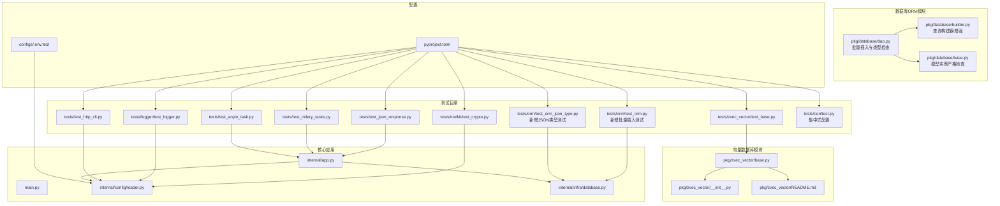
```mermaid
graph TB
subgraph "测试目录"
T1["tests/test_json_response.py"]
T2["tests/toolkit/test_crypto.py"]
T3["tests/orm/test_orm.py<br/>新增批量插入测试"]
T4["tests/orm/test_orm_json_type.py<br/>新增JSON类型测试"]
T5["tests/logger/test_logger.py"]
T6["tests/test_celery_tasks.py"]
T7["tests/test_http_cli.py"]
T8["tests/zvec_vector/test_base.py"]
T9["tests/test_anyio_task.py"]
T0["tests/conftest.py<br/>集中式配置"]
end
subgraph "核心应用"
A1["internal/app.py"]
A2["main.py"]
C1["internal/config/loader.py"]
D1["internal/infra/database.py"]
end
subgraph "向量数据库模块"
V1["pkg/zvec_vector/base.py"]
V2["pkg/zvec_vector/__init__.py"]
V3["pkg/zvec_vector/README.md"]
end
subgraph "数据库ORM模块"
M1["pkg/database/dao.py<br/>批量插入与类型检查"]
M2["pkg/database/builder.py<br/>查询构建器增强"]
M3["pkg/database/base.py<br/>模型实例严格检查"]
end
subgraph "配置"
E1["configs/.env.test"]
P1["pyproject.toml"]
end
T1 --> A1
T2 --> C1
T3 --> D1
T4 --> D1
T5 --> C1
T6 --> A1
T7 --> C1
T8 --> V1
T9 --> A1
A1 --> C1
A1 --> D1
P1 --> T0
P1 --> T1
P1 --> T2
P1 --> T3
P1 --> T4
P1 --> T5
P1 --> T6
P1 --> T7
P1 --> T8
P1 --> T9
E1 --> C1
V1 --> V2
V1 --> V3
M1 --> M2
M1 --> M3
```

**章节来源**
- [tests/conftest.py](file://tests/conftest.py#L1-L552)
- [pyproject.toml](file://pyproject.toml#L153-L157)
- [configs/.env.test](file://configs/.env.test#L1-L22)
- [internal/app.py](file://internal/app.py#L1-L109)
- [internal/infra/database.py](file://internal/infra/database.py#L1-L154)
- [internal/config/loader.py](file://internal/config/loader.py#L1-L243)
- [pkg/zvec_vector/base.py](file://pkg/zvec_vector/base.py#L1-L524)
- [pkg/zvec_vector/__init__.py](file://pkg/zvec_vector/__init__.py#L1-L31)
- [pkg/zvec_vector/README.md](file://pkg/zvec_vector/README.md#L1-L315)
- [pkg/database/dao.py](file://pkg/database/dao.py#L1-L455)
- [pkg/database/builder.py](file://pkg/database/builder.py#L1-L349)
- [pkg/database/base.py](file://pkg/database/base.py#L1-L150)

## 核心组件
- **集中式测试配置**
  - tests/conftest.py 提供统一的测试配置、fixtures 和 hooks，替代分散的测试设置
  - 支持自动注册自定义标记、异步测试配置和外部依赖 mock
- **增强的测试标记系统**
  - 集成测试标记 integration：需要 Redis/Celery 等外部服务
  - 慢速测试标记 slow：耗时较长的测试
  - 单元测试标记 unit：不依赖外部服务的测试
  - **新增**：anyio 标记，用于标识异步测试
- **丰富的 fixtures 生态**
  - 数据库 fixtures：内存 SQLite 引擎、会话工厂、带事务回滚的会话
  - Redis fixtures：真实 Redis 客户端和 Mock 版本
  - FastAPI fixtures：测试应用实例、同步和异步测试客户端
  - 工具 fixtures：测试数据、时间冻结、ID 计数器重置等
  - 向量数据库 fixtures：临时目录、集合配置、向量存储实例
- **统一的异步测试支持**
  - **重大更新**：使用 pytest-asyncio 作为默认异步后端，统一异步测试语法
  - 自动为异步测试函数添加 asyncio 标记
  - 支持混合同步/异步 fixtures 的依赖注入
  - **新增**：anyio_backend fixture 统一 anyio 后端配置
- **外部依赖隔离**
  - Mock pkg.logger、pkg.toolkit.context、pkg.toolkit.inter 等模块
  - 提供 Mock Snowflake ID 生成器
  - 支持自动清理测试过程中的全局状态
- **向量数据库测试覆盖**
  - 完整的单元测试覆盖：配置类、枚举类型、数据转换、搜索参数
  - 集成测试覆盖：集合生命周期、文档 CRUD、向量搜索、索引管理、Schema 演进
  - **新增**：异步上下文管理器测试
  - **新增**：边界条件测试和只读模式测试
- **数据库ORM测试增强**
  - **新增**：批量插入方法测试（insert_instances、insert_rows）
  - **新增**：模型实例类型检查测试（_assert_instance_model_match）
  - **新增**：增强的查询构建器功能测试（in_方法空列表验证、paginate方法参数验证）
  - **新增**：边缘情况验证测试（严格模式检查、软删除测试）
  - **新增**：JSON类型ORM测试覆盖

**章节来源**
- [tests/conftest.py](file://tests/conftest.py#L163-L167)
- [tests/conftest.py](file://tests/conftest.py#L182-L186)
- [tests/conftest.py](file://tests/conftest.py#L193-L276)
- [tests/conftest.py](file://tests/conftest.py#L283-L333)
- [tests/conftest.py](file://tests/conftest.py#L340-L392)
- [tests/conftest.py](file://tests/conftest.py#L399-L450)
- [tests/conftest.py](file://tests/conftest.py#L457-L470)
- [tests/conftest.py](file://tests/conftest.py#L483-L489)
- [tests/conftest.py](file://tests/conftest.py#L496-L513)
- [tests/conftest.py](file://tests/conftest.py#L520-L552)
- [tests/zvec_vector/test_base.py](file://tests/zvec_vector/test_base.py#L1-L895)
- [tests/orm/test_orm.py](file://tests/orm/test_orm.py#L167-L225)
- [tests/orm/test_orm_json_type.py](file://tests/orm/test_orm_json_type.py#L165-L216)

## 架构总览
下图展示重构后的测试策略在系统中的位置与交互关系，包括集中式配置、增强的 fixtures 生态、统一的异步支持、外部依赖隔离机制和新增的向量数据库测试覆盖。

```mermaid
graph TB
subgraph "测试层"
CONF["tests/conftest.py<br/>集中式配置"]
FIX["丰富 fixtures 生态"]
ASYNC["统一异步支持<br/>pytest-asyncio + anyio"]
MARK["测试标记系统"]
ZVEC_TEST["向量数据库测试<br/>覆盖配置类、CRUD、搜索、索引"]
ANYIO_TEST["AnyIO 任务测试<br/>异步任务管理"]
ORM_TEST["ORM测试增强<br/>批量插入、类型检查、查询构建器"]
end
subgraph "应用层"
APP["FastAPI 应用<br/>测试配置"]
CFG["配置加载<br/>.env.* + .secrets"]
DB["数据库引擎/会话"]
REDIS["Redis 客户端"]
LOG["日志系统"]
ZVEC["向量数据库<br/>zvec 模块"]
ANYIO["AnyIO 任务管理器"]
ORM["数据库ORM<br/>DAO + Builder + Base"]
end
subgraph "外部依赖"
MYSQL["MySQL/SQLite"]
CELERY["Celery Worker/Redis"]
HTTPX["HTTPX/HTTP 客户端"]
MOCK["Mock 外部依赖"]
END
CONF --> FIX
FIX --> APP
FIX --> DB
FIX --> REDIS
FIX --> ZVEC
FIX --> ANYIO
FIX --> ORM
FIX --> MOCK
ASYNC --> APP
ASYNC --> ZVEC
ASYNC --> ANYIO
ASYNC --> ORM
MARK --> CONF
ZVEC_TEST --> ZVEC
ANYIO_TEST --> ANYIO
ORM_TEST --> ORM
APP --> CFG
APP --> DB
APP --> REDIS
APP --> LOG
DB --> MYSQL
REDIS --> CELERY
MOCK --> HTTPX
```

**图表来源**
- [tests/conftest.py](file://tests/conftest.py#L1-L552)
- [internal/app.py](file://internal/app.py#L307-L326)
- [internal/config/loader.py](file://internal/config/loader.py#L179-L243)
- [internal/infra/database.py](file://internal/infra/database.py#L26-L111)
- [pkg/zvec_vector/base.py](file://pkg/zvec_vector/base.py#L1-L524)
- [tests/zvec_vector/test_base.py](file://tests/zvec_vector/test_base.py#L1-L895)
- [tests/test_anyio_task.py](file://tests/test_anyio_task.py#L1-L235)
- [pkg/database/dao.py](file://pkg/database/dao.py#L1-L455)
- [pkg/database/builder.py](file://pkg/database/builder.py#L1-L349)
- [pkg/database/base.py](file://pkg/database/base.py#L1-L150)

## 详细组件分析

### 集中式测试配置：conftest.py
- **目标**
  - 提供统一的测试运行环境，替代分散的测试设置
  - 管理外部依赖 mock，确保测试隔离性
  - 配置异步测试支持和自定义标记
- **设计要点**
  - 使用 pytest hooks 自动注册自定义标记
  - 通过 sys.modules mock 外部模块，避免真实依赖
  - 提供多种 scope 的 fixtures，满足不同测试需求
  - 实现自动清理机制，防止测试间相互影响
  - **新增**：自动为异步测试函数添加 asyncio 标记
  - **新增**：配置 anyio 后端为 asyncio
- **关键流程（外部依赖 mock）**

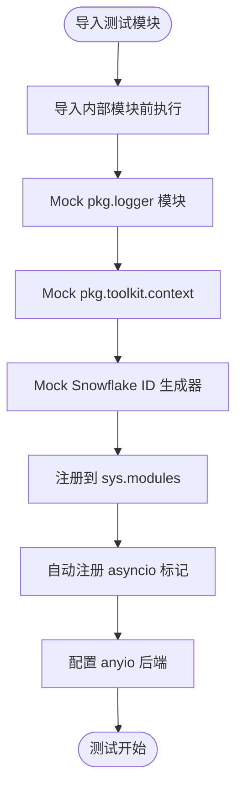
```mermaid
flowchart TD
Start(["导入测试模块"]) --> Import["导入内部模块前执行"]
Import --> MockLogger["Mock pkg.logger 模块"]
MockLogger --> MockContext["Mock pkg.toolkit.context"]
MockContext --> MockSnowflake["Mock Snowflake ID 生成器"]
MockSnowflake --> SysModules["注册到 sys.modules"]
SysModules --> AutoMark["自动注册 asyncio 标记"]
AutoMark --> AnyioBackend["配置 anyio 后端"]
AnyioBackend --> End(["测试开始"])
```

**章节来源**
- [tests/conftest.py](file://tests/conftest.py#L1-L83)
- [tests/conftest.py](file://tests/conftest.py#L141-L167)
- [tests/conftest.py](file://tests/conftest.py#L182-L186)
- [tests/conftest.py](file://tests/conftest.py#L437-L449)

### 数据库测试：内存 SQLite 与会话管理
- **目标**
  - 使用内存 SQLite 提供快速、隔离的数据库测试环境
  - 管理数据库连接、事务和表结构的创建/清理
- **设计要点**
  - 提供三种级别的数据库 fixtures：引擎、会话工厂、带事务回滚的会话
  - 自动创建和清理表结构，确保测试隔离
  - **更新**：全部使用 @pytest_asyncio.fixture 装饰器，支持异步测试
  - 支持同步和异步会话，满足不同测试场景
  - **新增**：增强的批量插入测试覆盖
- **关键流程（数据库会话生命周期）**

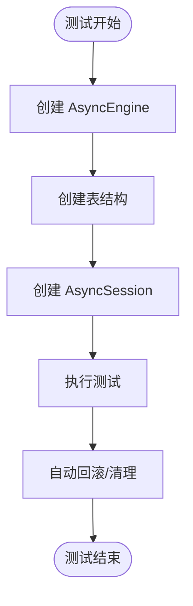
```mermaid
flowchart TD
A(["测试开始"]) --> B["创建 AsyncEngine"]
B --> C["创建表结构"]
C --> D["创建 AsyncSession"]
D --> E["执行测试"]
E --> F["自动回滚/清理"]
F --> G(["测试结束"])
```

**章节来源**
- [tests/conftest.py](file://tests/conftest.py#L193-L276)
- [tests/orm/test_orm.py](file://tests/orm/test_orm.py#L92-L106)
- [tests/orm/test_orm_json_type.py](file://tests/orm/test_orm_json_type.py#L97-L110)

### Redis 测试：真实与 Mock 双模式
- **目标**
  - 提供真实 Redis 测试和 Mock Redis 测试两种模式
  - 确保测试数据隔离，避免污染开发数据
- **设计要点**
  - 使用独立数据库（db=15）避免数据冲突
  - 提供完整的 Redis 客户端和简化版 Mock 客户端
  - 自动清理测试数据库，保持环境整洁
  - **更新**：全部使用 @pytest_asyncio.fixture 装饰器
- **关键流程（Redis 客户端生命周期）**

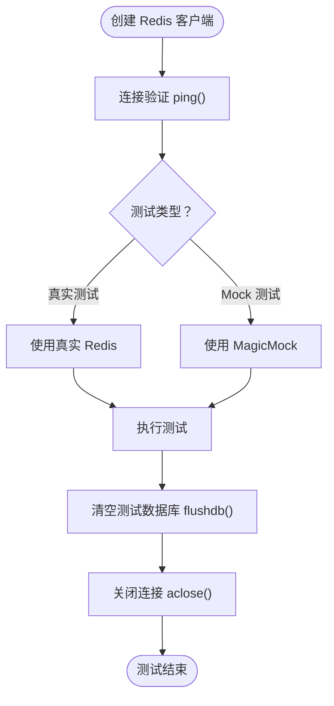
```mermaid
flowchart TD
A(["创建 Redis 客户端"]) --> B["连接验证 ping()"]
B --> C{"测试类型？"}
C --> |真实测试| D["使用真实 Redis"]
C --> |Mock 测试| E["使用 MagicMock"]
D --> F["执行测试"]
E --> F
F --> G["清空测试数据库 flushdb()"]
G --> H["关闭连接 aclose()"]
H --> I(["测试结束"])
```

**章节来源**
- [tests/conftest.py](file://tests/conftest.py#L283-L333)

### FastAPI 应用测试：客户端与配置
- **目标**
  - 提供测试用的 FastAPI 应用实例和多种客户端
  - 使用测试配置而非生产配置，确保测试一致性
- **设计要点**
  - Mock 配置模块，设置测试专用参数
  - **更新**：提供同步 TestClient 和异步 AsyncClient
  - 支持 ASGI 传输，满足异步测试需求
  - **新增**：自动配置 anyio 后端
- **关键流程（应用测试客户端）**

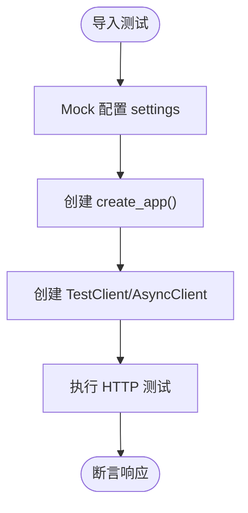
```mermaid
flowchart TD
A(["导入测试"]) --> B["Mock 配置 settings"]
B --> C["创建 create_app()"]
C --> D["创建 TestClient/AsyncClient"]
D --> E["执行 HTTP 测试"]
E --> F(["断言响应"])
```

**章节来源**
- [tests/conftest.py](file://tests/conftest.py#L340-L392)
- [tests/test_json_response.py](file://tests/test_json_response.py#L34-L66)

### 工具函数测试：通用 fixtures
- **目标**
  - 提供测试中常用的工具函数和数据生成器
  - 简化测试代码，提高测试可维护性
- **设计要点**
  - 提供测试数据生成 fixtures：用户数据、批量用户数据
  - 提供时间冻结 fixtures，便于测试时间相关功能
  - 提供 ID 计数器重置 fixtures，确保测试确定性
  - **新增**：logger_mock 和 mock_config fixtures
  - **新增**：自动清理机制，防止全局状态污染
- **关键流程（测试数据生成）**

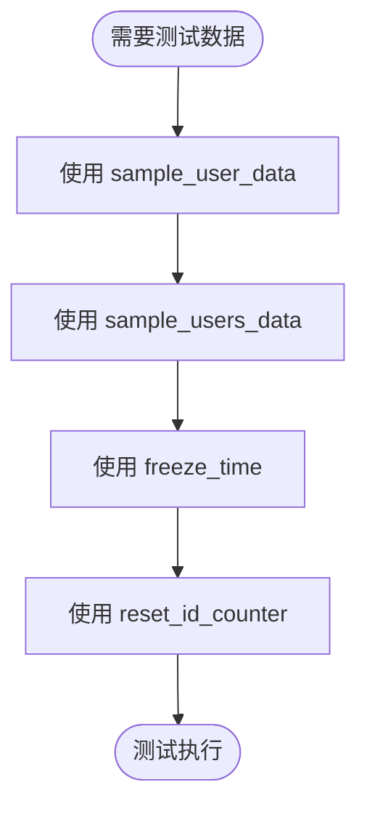
```mermaid
flowchart TD
A(["需要测试数据"]) --> B["使用 sample_user_data"]
B --> C["使用 sample_users_data"]
C --> D["使用 freeze_time"]
D --> E["使用 reset_id_counter"]
E --> F(["测试执行"])
```

**章节来源**
- [tests/conftest.py](file://tests/conftest.py#L399-L450)
- [tests/conftest.py](file://tests/conftest.py#L457-L470)
- [tests/conftest.py](file://tests/conftest.py#L483-L513)
- [tests/conftest.py](file://tests/conftest.py#L520-L552)

### 向量数据库测试：zvec_vector 模块
- **目标**
  - 全面测试向量数据库操作基类和相关配置类
  - 验证集合生命周期、文档 CRUD、向量搜索、索引管理和 Schema 演进
  - 确保异步操作的正确性和线程安全性
- **设计要点**
  - 使用临时目录隔离测试数据，避免文件系统污染
  - 提供多种配置场景：单向量字段、多向量字段、索引字段
  - 覆盖完整的工作流程：连接、操作、断开连接
  - 测试边界条件和异常情况
  - **重大更新**：全部使用 @pytest_asyncio.fixture 和 @pytest.mark.asyncio
  - **新增**：anyio_backend fixture 统一异步后端
- **关键流程（向量数据库测试生命周期）**

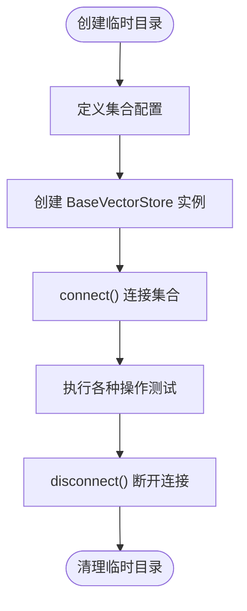
```mermaid
flowchart TD
A(["创建临时目录"]) --> B["定义集合配置"]
B --> C["创建 BaseVectorStore 实例"]
C --> D["connect() 连接集合"]
D --> E["执行各种操作测试"]
E --> F["disconnect() 断开连接"]
F --> G(["清理临时目录"])
```

**章节来源**
- [tests/zvec_vector/test_base.py](file://tests/zvec_vector/test_base.py#L1-L895)
- [pkg/zvec_vector/base.py](file://pkg/zvec_vector/base.py#L1-L524)
- [pkg/zvec_vector/__init__.py](file://pkg/zvec_vector/__init__.py#L1-L31)

### 数据库ORM测试：批量插入与类型检查
- **目标**
  - 验证批量插入方法（insert_instances、insert_rows）的正确性
  - 验证模型实例类型检查机制（_assert_instance_model_match）
  - 验证增强的查询构建器功能（in_方法空列表验证、paginate方法参数验证）
  - 验证边缘情况（严格模式检查、软删除测试）
- **设计要点**
  - **更新**：使用 @pytest_asyncio.fixture 替代 @pytest.fixture
  - 使用内存 SQLite 引擎与异步 fixture；通过 sys.modules mock 部分 pkg 工具模块
  - **新增**：批量插入测试覆盖对象实例和字典两种方式
  - **新增**：模型实例类型检查测试，验证类型不匹配时的异常处理
  - **新增**：查询构建器边缘情况测试，验证空列表参数的错误处理
  - **新增**：软删除和恢复功能测试
- **关键流程（批量插入测试）**

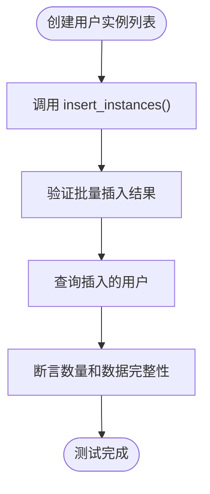
```mermaid
flowchart TD
A(["创建用户实例列表"]) --> B["调用 insert_instances()"]
B --> C["验证批量插入结果"]
C --> D["查询插入的用户"]
D --> E["断言数量和数据完整性"]
E --> F(["测试完成"])
```

**章节来源**
- [tests/orm/test_orm.py](file://tests/orm/test_orm.py#L167-L225)
- [tests/orm/test_orm.py](file://tests/orm/test_orm.py#L227-L276)
- [pkg/database/dao.py](file://pkg/database/dao.py#L331-L357)
- [pkg/database/dao.py](file://pkg/database/dao.py#L66-L76)

### 数据库ORM测试：查询构建器增强
- **目标**
  - 验证增强的查询构建器功能，特别是 in_ 方法的空列表处理
  - 验证 paginate 方法的参数验证和分页逻辑
  - 验证严格模式检查机制
- **设计要点**
  - **新增**：in_ 方法空列表参数测试，验证 ValueError 异常
  - **新增**：paginate 方法参数验证测试，验证 page 和 limit 参数的边界条件
  - **新增**：严格模式检查测试，验证持久化对象和新对象的不同行为
  - **新增**：软删除查询测试，验证包含和排除已删除记录的查询差异
- **关键流程（查询构建器测试）**

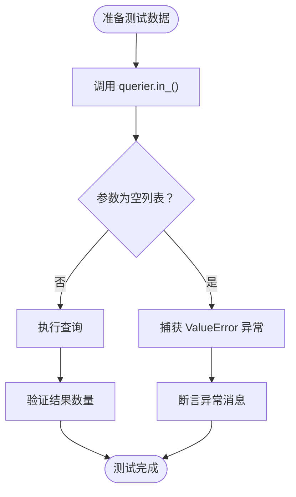
```mermaid
flowchart TD
A(["准备测试数据"]) --> B["调用 querier.in_()"]
B --> C{"参数为空列表？"}
C --> |是| D["捕获 ValueError 异常"]
C --> |否| E["执行查询"]
E --> F["验证结果数量"]
D --> G["断言异常消息"]
F --> H(["测试完成"])
G --> H
```

**章节来源**
- [tests/orm/test_orm.py](file://tests/orm/test_orm.py#L227-L276)
- [tests/orm/test_orm_json_type.py](file://tests/orm/test_orm_json_type.py#L181-L216)
- [pkg/database/builder.py](file://pkg/database/builder.py#L78-L91)
- [pkg/database/builder.py](file://pkg/database/builder.py#L145-L153)

### 数据库ORM测试：JSON类型支持
- **目标**
  - 验证 JSON 类型字段的序列化和反序列化
  - 验证 Mutable JSON 的变更追踪机制
  - 验证 JSON 类型字段的批量插入和查询
- **设计要点**
  - **新增**：JSONType 字段的创建和插入测试
  - **新增**：Mutable JSON 变更追踪测试，在同一事务中修改 JSON 字段
  - **新增**：JSON 类型字段的批量插入测试
  - **新增**：JSON 类型字段的查询和验证测试
- **关键流程（JSON类型测试）**

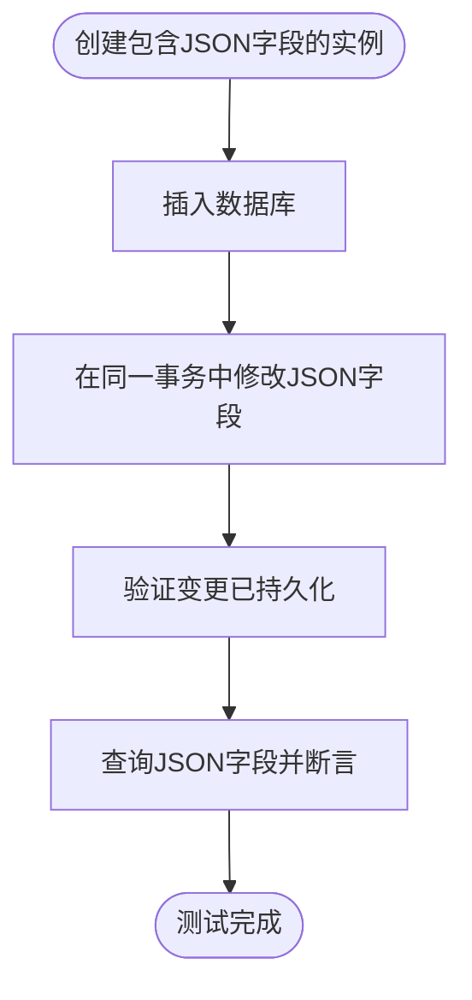
```mermaid
flowchart TD
A(["创建包含JSON字段的实例"]) --> B["插入数据库"]
B --> C["在同一事务中修改JSON字段"]
C --> D["验证变更已持久化"]
D --> E["查询JSON字段并断言"]
E --> F(["测试完成"])
```

**章节来源**
- [tests/orm/test_orm_json_type.py](file://tests/orm/test_orm_json_type.py#L117-L164)
- [tests/orm/test_orm_json_type.py](file://tests/orm/test_orm_json_type.py#L165-L179)
- [tests/orm/test_orm_json_type.py](file://tests/orm/test_orm_json_type.py#L181-L216)

### 单元测试：JSON 工具与响应封装
- **目标**
  - 验证 JSON 序列化/反序列化、Decimal/时间/集合/NumPy 等类型处理；验证响应封装结构与错误消息渲染；验证 SSE 数据包装。
- **设计要点**
  - 使用 parametrize 覆盖多种输入；使用 fixtures 生成复杂嵌套数据；对异常路径进行断言；对 HTTP 传输链路进行端到端验证。
- **关键流程（序列化回环）**

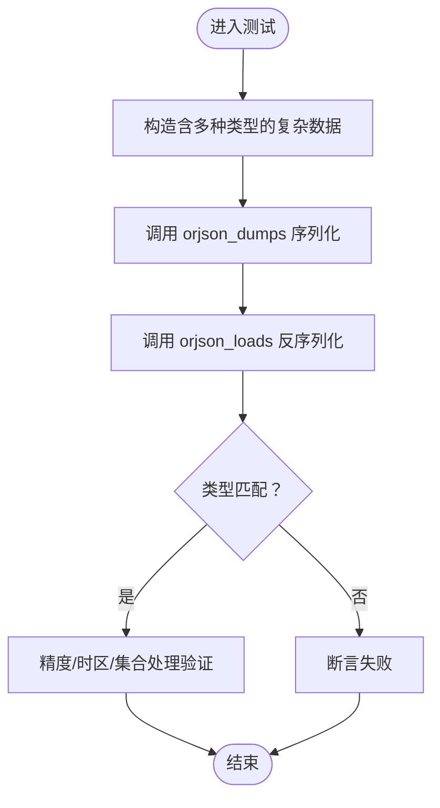
```mermaid
flowchart TD
Start(["进入测试"]) --> Gen["构造含多种类型的复杂数据"]
Gen --> Serialize["调用 orjson_dumps 序列化"]
Serialize --> Deserialize["调用 orjson_loads 反序列化"]
Deserialize --> TypeCheck{"类型匹配？"}
TypeCheck --> |是| Precision["精度/时区/集合处理验证"]
TypeCheck --> |否| Fail["断言失败"]
Precision --> End(["结束"])
Fail --> End
```

**章节来源**
- [tests/test_json_response.py](file://tests/test_json_response.py#L73-L159)
- [tests/test_json_response.py](file://tests/test_json_response.py#L166-L229)
- [tests/test_json_response.py](file://tests/test_json_response.py#L275-L341)

### 单元测试：密码哈希与 AES 加解密
- **目标**
  - 验证密码哈希算法正确性、盐值与轮数控制；验证 AES 加解密一致性、IV 机制、错误密钥与篡改检测；验证工厂与便捷函数。
- **设计要点**
  - **更新**：使用 @pytest.mark.anyio 标记进行异步测试
  - 对空明文/空哈希、非法格式等边界条件进行断言；对重复加密结果进行差异化验证。
- **关键流程（AES 加解密循环）**

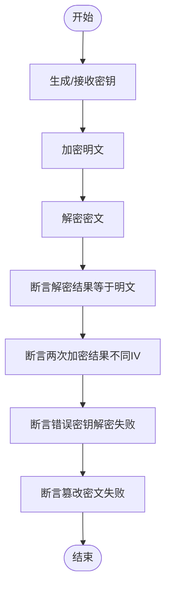
```mermaid
flowchart TD
S(["开始"]) --> K["生成/接收密钥"]
K --> E["加密明文"]
E --> D["解密密文"]
D --> V["断言解密结果等于明文"]
V --> IV["断言两次加密结果不同IV"]
IV --> W["断言错误密钥解密失败"]
W --> T["断言篡改密文失败"]
T --> Z(["结束"])
```

**章节来源**
- [tests/toolkit/test_crypto.py](file://tests/toolkit/test_crypto.py#L28-L83)
- [tests/toolkit/test_crypto.py](file://tests/toolkit/test_crypto.py#L127-L153)

### 单元测试：日志工具
- **目标**
  - 验证系统日志与动态日志的落盘路径与内容；验证目录创建失败时的降级逻辑与命名空间切换。
- **设计要点**
  - 使用 tmp_path 与 monkeypatch 模拟文件系统与内部方法；对 JSON 文本格式差异进行适配解析。
- **关键流程（动态日志降级）**

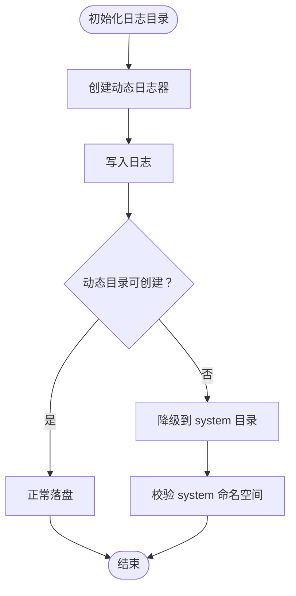
```mermaid
flowchart TD
S(["初始化日志目录"]) --> L["创建动态日志器"]
L --> W["写入日志"]
W --> P{"动态目录可创建？"}
P --> |否| F["降级到 system 目录"]
P --> |是| OK["正常落盘"]
F --> NS["校验 system 命名空间"]
OK --> END(["结束"])
NS --> END
```

**章节来源**
- [tests/logger/test_logger.py](file://tests/logger/test_logger.py#L111-L149)

### 集成测试：FastAPI 应用与 TestClient
- **目标**
  - 使用 TestClient 对应用端点进行 HTTP 级别验证，覆盖复杂类型传输、统一响应结构、错误处理与编码。
- **设计要点**
  - 定义测试应用与端点；对响应体结构、Content-Type、编码与错误消息进行断言；对 NaN/Infinity 等非标准值进行健壮性验证。
- **关键序列（HTTP 端到端）**

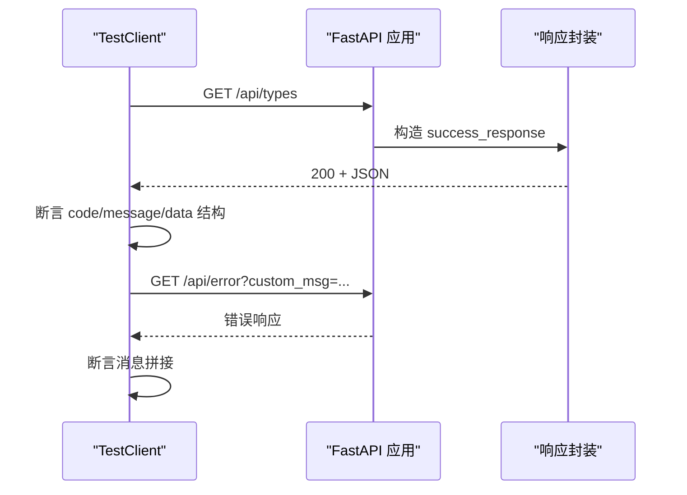
```mermaid
sequenceDiagram
participant TC as "TestClient"
participant APP as "FastAPI 应用"
participant RESP as "响应封装"
TC->>APP : GET /api/types
APP->>RESP : 构造 success_response
RESP-->>TC : 200 + JSON
TC->>TC : 断言 code/message/data 结构
TC->>APP : GET /api/error?custom_msg=...
APP-->>TC : 错误响应
TC->>TC : 断言消息拼接
```

**章节来源**
- [tests/test_json_response.py](file://tests/test_json_response.py#L234-L272)
- [tests/test_json_response.py](file://tests/test_json_response.py#L275-L341)

### 集成测试：Celery 任务与客户端
- **目标**
  - 验证任务同步/异步执行、重试、路由、客户端提交、状态查询、链式/并发/回调模式、撤销与延迟执行；集成标记 integration 需要完整环境。
- **设计要点**
  - 使用 pytest.skip 处理 Worker 不可用场景；对超时与状态进行断言；对自定义 task_id/countdown 等选项进行验证。
- **关键序列（链式调用）**

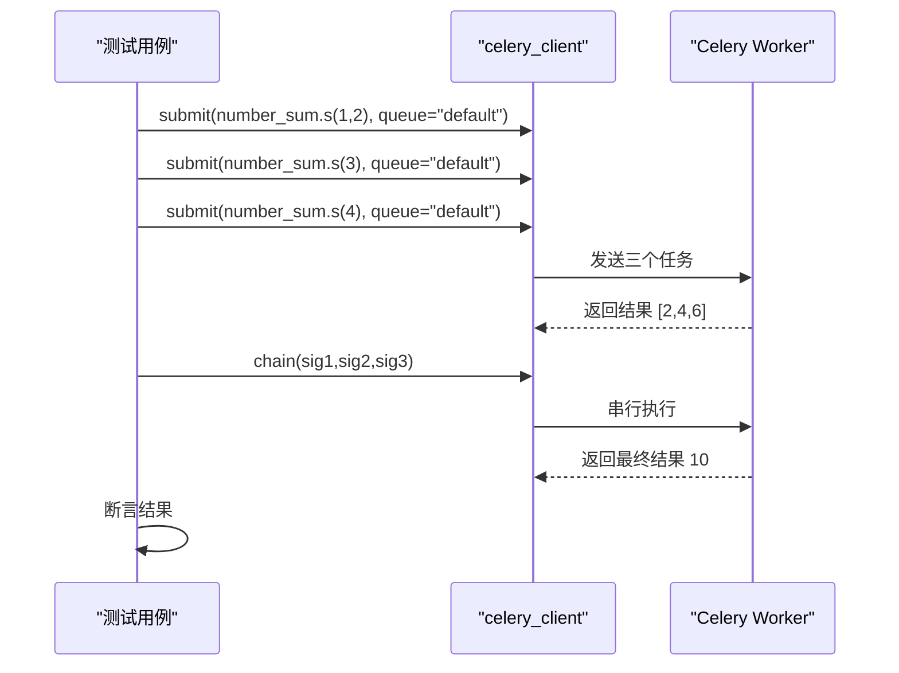
```mermaid
sequenceDiagram
participant TEST as "测试用例"
participant CLI as "celery_client"
participant WORKER as "Celery Worker"
TEST->>CLI : submit(number_sum.s(1,2), queue="default")
TEST->>CLI : submit(number_sum.s(3), queue="default")
TEST->>CLI : submit(number_sum.s(4), queue="default")
CLI->>WORKER : 发送三个任务
WORKER-->>CLI : 返回结果 [2,4,6]
TEST->>CLI : chain(sig1,sig2,sig3)
CLI->>WORKER : 串行执行
WORKER-->>CLI : 返回最终结果 10
TEST->>TEST : 断言结果
```

**章节来源**
- [tests/test_celery_tasks.py](file://tests/test_celery_tasks.py#L21-L84)

### 单元测试：HTTP 客户端
- **目标**
  - 验证异步 HTTP 客户端的请求封装、错误消息提取、JSON 缓存、文件下载与流式请求。
- **设计要点**
  - **更新**：使用 @pytest_asyncio.fixture 和 @pytest.mark.asyncio
  - 使用 AsyncMock/patch 模拟 HTTPX；对 2xx/4xx/5xx 与异常路径分别断言；对下载进度回调进行验证。
- **关键流程（文件下载）**

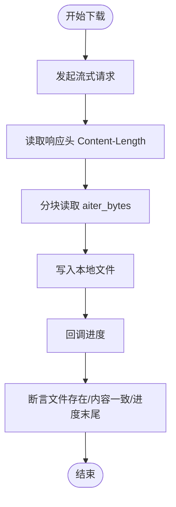
```mermaid
flowchart TD
S(["开始下载"]) --> C["发起流式请求"]
C --> H["读取响应头 Content-Length"]
H --> B["分块读取 aiter_bytes"]
B --> W["写入本地文件"]
W --> P["回调进度"]
P --> V["断言文件存在/内容一致/进度末尾"]
V --> E(["结束"])
```

**章节来源**
- [tests/test_http_cli.py](file://tests/test_http_cli.py#L73-L185)

### 单元测试：AnyIO 任务管理器
- **目标**
  - 验证 AnyIO 任务管理器的异步任务调度、并发控制、线程池管理、进程池管理、任务取消与异常处理。
- **设计要点**
  - **新增**：完整的 AnyIO 任务管理器测试套件
  - 使用 @pytest.mark.anyio 标记进行异步测试
  - 测试 add_task、run_gather_with_concurrency、run_in_thread、run_in_process 等核心功能
  - 验证任务超时、取消、异常处理等边界条件
- **关键流程（异步任务执行）**

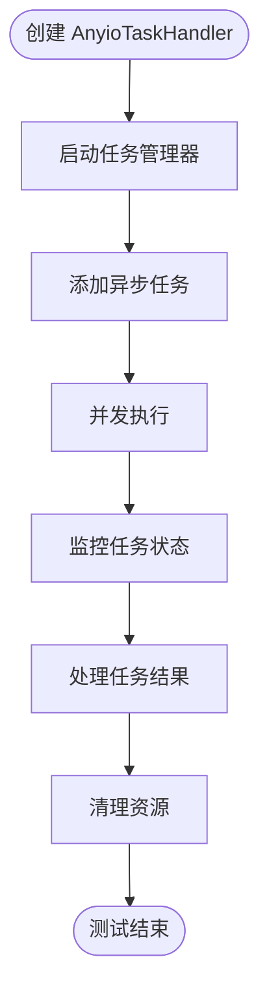
```mermaid
flowchart TD
A(["创建 AnyioTaskHandler"]) --> B["启动任务管理器"]
B --> C["添加异步任务"]
C --> D["并发执行"]
D --> E["监控任务状态"]
E --> F["处理任务结果"]
F --> G["清理资源"]
G --> H(["测试结束"])
```

**章节来源**
- [tests/test_anyio_task.py](file://tests/test_anyio_task.py#L57-L235)

## 依赖分析
- **测试框架与工具**
  - pytest、pytest-asyncio、httpx、pytest-tornasync、pytest-trio、pytest-twisted 等在 dev 依赖中声明，支持多运行时与异步测试。
  - **新增**：pytest-asyncio 作为默认异步后端，统一异步测试体验
- **集中式配置管理**
  - tests/conftest.py 提供统一的测试配置、fixtures 和 hooks
  - pyproject.toml 中的 pytest.ini_options 定义基础标记
- **增强的标记系统**
  - integration：集成测试，需要完整的 Celery Worker 和 Redis 环境
  - slow：慢速测试，耗时较长
  - unit：单元测试，不依赖外部服务
  - **新增**：anyio 标记，用于标识异步测试
- **配置加载**
  - 通过 .env.test 与 .secrets 组合加载配置；配置模块支持敏感字段解密与数据库/Redis URL 动态生成。
- **应用生命周期**
  - FastAPI lifespan 负责初始化数据库、Redis、日志、签名认证、Snowflake ID 生成器与 AnyIO 任务管理器。
- **向量数据库依赖**
  - zvec_vector 模块依赖 zvec 嵌入式向量数据库，通过 anyio.to_thread.run_sync 实现异步支持
  - 使用 threading.Lock 保证线程安全，支持多协程并发调用
- **数据库ORM增强**
  - **新增**：批量插入方法（insert_instances、insert_rows）支持对象实例和字典两种方式
  - **新增**：模型实例类型检查机制，确保 DAO 操作的类型安全性
  - **新增**：增强的查询构建器，提供更好的空列表处理和参数验证
  - **新增**：JSON类型支持，包括 Mutable JSON 变更追踪
- **异步测试支持**
  - **重大更新**：统一使用 pytest-asyncio 和 anyio 后端
  - anyio_backend fixture 确保所有异步测试使用一致的后端配置

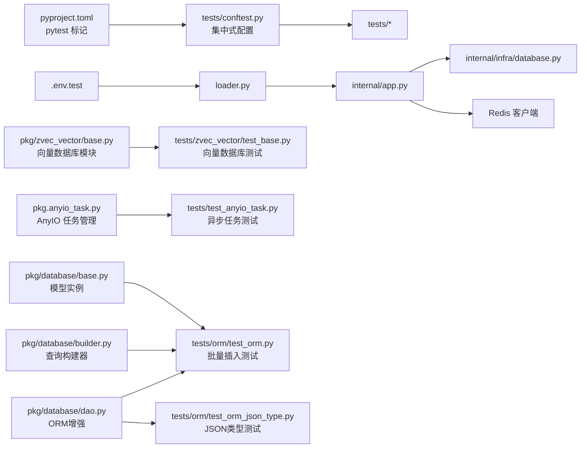
```mermaid
graph LR
CONF["tests/conftest.py<br/>集中式配置"] --> T["tests/*"]
P["pyproject.toml<br/>pytest 标记"] --> CONF
E[".env.test"] --> CFG["loader.py"]
CFG --> APP["internal/app.py"]
APP --> DB["internal/infra/database.py"]
APP --> REDIS["Redis 客户端"]
ZVEC["pkg/zvec_vector/base.py<br/>向量数据库模块"] --> ZVEC_TEST["tests/zvec_vector/test_base.py<br/>向量数据库测试"]
ANYIO["pkg.anyio_task.py<br/>AnyIO 任务管理"] --> ANYIO_TEST["tests/test_anyio_task.py<br/>异步任务测试"]
ORM["pkg/database/dao.py<br/>ORM增强"] --> ORM_TEST["tests/orm/test_orm.py<br/>批量插入测试"]
ORM --> ORM_JSON_TEST["tests/orm/test_orm_json_type.py<br/>JSON类型测试"]
BUILDER["pkg/database/builder.py<br/>查询构建器"] --> ORM_TEST
BASE["pkg/database/base.py<br/>模型实例"] --> ORM_TEST
```

**图表来源**
- [tests/conftest.py](file://tests/conftest.py#L1-L552)
- [pyproject.toml](file://pyproject.toml#L153-L157)
- [configs/.env.test](file://configs/.env.test#L1-L22)
- [internal/config/loader.py](file://internal/config/loader.py#L179-L243)
- [internal/app.py](file://internal/app.py#L85-L109)
- [internal/infra/database.py](file://internal/infra/database.py#L26-L111)
- [pkg/zvec_vector/base.py](file://pkg/zvec_vector/base.py#L1-L524)
- [tests/zvec_vector/test_base.py](file://tests/zvec_vector/test_base.py#L1-L895)
- [tests/test_anyio_task.py](file://tests/test_anyio_task.py#L1-L235)
- [pkg/database/dao.py](file://pkg/database/dao.py#L1-L455)
- [pkg/database/builder.py](file://pkg/database/builder.py#L1-L349)
- [pkg/database/base.py](file://pkg/database/base.py#L1-L150)

**章节来源**
- [tests/conftest.py](file://tests/conftest.py#L141-L167)
- [pyproject.toml](file://pyproject.toml#L153-L157)
- [configs/.env.test](file://configs/.env.test#L1-L22)
- [internal/config/loader.py](file://internal/config/loader.py#L179-L243)
- [internal/app.py](file://internal/app.py#L85-L109)
- [internal/infra/database.py](file://internal/infra/database.py#L26-L111)
- [pkg/zvec_vector/base.py](file://pkg/zvec_vector/base.py#L1-L524)
- [pkg/database/dao.py](file://pkg/database/dao.py#L1-L455)
- [pkg/database/builder.py](file://pkg/database/builder.py#L1-L349)
- [pkg/database/base.py](file://pkg/database/base.py#L1-L150)

## 性能考量
- **异步测试与事件循环**
  - **重大更新**：使用 pytest-asyncio 与 @pytest_asyncio.fixture，确保异步测试稳定；对内存数据库（SQLite）进行批量插入与查询，减少 IO 延迟。
  - **新增**：anyio_backend 配置确保跨平台兼容性
- **测试 fixtures 优化**
  - 使用 session scope 的 fixtures 预加载常用模块，减少导入开销
  - 提供多种 scope 的 fixtures，平衡测试隔离性和性能
  - **更新**：异步 fixtures 支持更高效的资源管理
- **外部依赖 mock**
  - 通过 sys.modules mock 外部依赖，避免真实网络请求和磁盘 IO
  - 提供 Mock Redis 客户端，支持快速的内存测试
- **向量数据库性能**
  - 使用临时目录存储测试数据，避免真实文件系统影响
  - 通过 optimize() 方法优化索引，提高搜索性能
  - 支持只读模式测试，验证数据完整性
  - **新增**：异步操作确保线程安全和并发性能
- **数据库ORM性能优化**
  - **新增**：批量插入方法（insert_instances、insert_rows）提供高性能批量操作
  - **新增**：查询构建器优化，支持更高效的查询构建和执行
  - **新增**：JSON类型支持，减少序列化开销
- **日志与慢 SQL 监控**
  - 数据库层注册事件监听，基于配置阈值输出慢查询日志，有助于定位性能瓶颈。
- **HTTP 客户端缓存**
  - RequestResult 对 JSON 解析进行缓存，避免重复解析带来的开销。
- **AnyIO 任务管理**
  - **新增**：AnyIO 任务管理器提供高效的异步任务调度和资源管理
  - 支持线程池、进程池和异步任务的统一管理
- **建议**
  - 在集成测试中尽量使用内存数据库与本地 Redis；对耗时操作（如 Celery）使用 skip 降级，保证测试稳定性与速度。
  - 向量数据库测试中合理使用临时目录，避免测试间的数据干扰。
  - **新增**：充分利用异步测试的优势，提高测试执行效率
  - **新增**：使用批量插入方法优化大量数据的测试场景

## 故障排查指南
- **配置加载失败**
  - 确认 .secrets 与 .env.test 存在且 APP_ENV 正确；检查敏感字段是否以 ENC(...) 包裹并可被 AES_SECRET 解密。
- **数据库连接异常**
  - 检查 .env.test 中 DB_* 与 REDIS_* 参数；确认数据库驱动与连接字符串生成逻辑；关注 Slow SQL 日志。
- **Celery Worker 不可用**
  - 对异步/链式/并发/回调等测试使用 pytest.skip；确保 Redis Broker 可达；核对队列与任务路由配置。
- **日志路径与降级**
  - 若动态日志目录创建失败，应降级至 system 目录；验证 system 命名空间与文本格式日志。
- **HTTP 客户端错误**
  - 对 JSON 解析失败、网络错误、HTTP 状态错误进行分类断言；检查缓存与错误消息提取逻辑。
- **测试 fixtures 问题**
  - 检查 fixtures 的 scope 设置是否正确；确认外部依赖 mock 是否生效；验证异步 fixtures 的依赖注入。
- **异步测试失败**
  - **重大更新**：确认测试函数使用正确的异步标记（@pytest.mark.asyncio 或 @pytest.mark.anyio）；检查 event_loop_policy 配置；验证异步/同步 fixtures 的组合使用。
  - **新增**：检查 anyio_backend 配置是否正确
- **向量数据库测试失败**
  - 检查临时目录权限和可用空间；确认 zvec 依赖安装正确；验证集合配置参数；检查线程锁机制。
  - **新增**：验证异步连接和断开操作的正确性
- **向量搜索结果异常**
  - 确认集合已优化索引；检查向量维度与配置一致；验证搜索参数设置；测试只读模式下的数据完整性。
- **数据库ORM测试失败**
  - **新增**：检查批量插入方法的参数验证；确认模型实例类型检查机制正常工作
  - **新增**：验证查询构建器的空列表处理和参数验证
  - **新增**：检查软删除和恢复功能的测试
- **JSON类型ORM测试失败**
  - **新增**：验证 JSON 字段的序列化和反序列化
  - **新增**：检查 Mutable JSON 变更追踪机制
- **AnyIO 任务管理器问题**
  - **新增**：检查任务取消和超时处理；验证线程池和进程池的正确配置；确认异常处理机制
- **测试标记问题**
  - **新增**：确保使用 @pytest.mark.asyncio 或 @pytest.mark.anyio 标记异步测试函数
  - 验证 pytest-asyncio 插件正确安装和配置

**章节来源**
- [tests/conftest.py](file://tests/conftest.py#L163-L167)
- [tests/conftest.py](file://tests/conftest.py#L182-L186)
- [tests/conftest.py](file://tests/conftest.py#L480-L552)
- [internal/config/loader.py](file://internal/config/loader.py#L184-L243)
- [internal/infra/database.py](file://internal/infra/database.py#L116-L154)
- [tests/test_celery_tasks.py](file://tests/test_celery_tasks.py#L44-L63)
- [tests/logger/test_logger.py](file://tests/logger/test_logger.py#L111-L149)
- [tests/test_http_cli.py](file://tests/test_http_cli.py#L59-L68)
- [tests/zvec_vector/test_base.py](file://tests/zvec_vector/test_base.py#L835-L895)
- [tests/test_anyio_task.py](file://tests/test_anyio_task.py#L1-L235)
- [tests/orm/test_orm.py](file://tests/orm/test_orm.py#L167-L225)
- [tests/orm/test_orm_json_type.py](file://tests/orm/test_orm_json_type.py#L117-L164)

## 结论
本测试策略以重构后的集中式 pytest 配置为核心，结合增强的 fixtures 生态系统，覆盖工具包、ORM、日志、HTTP 客户端、Celery 任务、向量数据库与 FastAPI 应用层。**重大更新**：测试系统已全面迁移到异步模式，统一使用 pytest-asyncio 和 anyio 后端，显著提升了异步代码的测试能力和执行效率。

通过统一的测试标记系统、丰富的 fixtures 和强大的外部依赖 mock 机制，确保测试环境与生产一致且高度隔离。新增的向量数据库模块测试覆盖了配置类、集合生命周期、文档操作、向量搜索、索引管理和 Schema 演进等核心功能，为向量数据库的可靠使用提供了坚实保障。**新增**：完整的 AnyIO 任务管理器测试套件，确保异步任务调度的正确性和性能。

**重大更新**：数据库ORM测试大幅增强，新增50多行测试代码，覆盖批量插入方法、模型实例类型检查、增强的查询构建器功能和边缘情况验证等关键功能。这些测试确保了数据操作的安全性和可靠性，特别是批量操作的性能和类型安全性。

建议在持续集成中区分轻量单元测试与需要完整环境的集成测试，配合覆盖率与质量门禁，保障代码质量与交付效率。**特别重要的是**：所有新的异步测试都应该使用 @pytest.mark.asyncio 或 @pytest.mark.anyio 标记，并通过 anyio_backend fixture 确保一致的异步后端配置。

## 附录

### 测试用例设计原则与编写规范
- **原则**
  - 单一职责：每个测试聚焦一个功能点或边界条件。
  - 可重复性：使用 fixtures 与临时目录，避免副作用。
  - 可维护性：参数化与分层组织，减少重复代码。
  - 可观测性：对关键路径输出日志与断言，便于定位问题。
  - **新增**：异步测试一致性：统一使用 pytest-asyncio 和 anyio 后端
  - **新增**：批量操作测试：验证大批量数据处理的正确性和性能
  - **新增**：类型安全测试：确保模型实例类型检查机制正常工作
- **规范**
  - **更新**：使用 @pytest.mark.asyncio/@pytest.mark.anyio/@pytest_asyncio.fixture 标注异步测试。
  - 对异常路径使用 pytest.raises 或 skip，避免阻塞流水线。
  - 对外部依赖使用 patch/mocks，隔离系统状态。
  - 合理使用 fixtures 的 scope，平衡性能与隔离性。
  - **新增**：异步测试中正确处理事件循环和资源清理
  - **新增**：批量插入测试使用合理的数据规模和断言策略
  - **新增**：类型检查测试验证所有可能的类型不匹配场景
- **新增规范**
  - 使用集中式 fixtures，避免重复的测试设置代码
  - 明确测试标记的使用场景，便于测试分组执行
  - 利用自动清理机制，确保测试间的完全隔离
  - 向量数据库测试使用临时目录，确保数据隔离
  - **重大更新**：异步测试统一使用 anyio 后端，确保跨平台兼容性
  - **新增**：批量操作测试遵循性能基准和数据完整性验证
  - **新增**：类型安全测试覆盖所有公共接口和内部方法

### API 测试示例
- 使用 TestClient 对端点进行 HTTP 级别验证，断言统一响应结构与错误消息拼接。
- 利用集中式 fixtures 提供的测试应用实例和客户端，简化测试代码。
- **更新**：支持同步和异步客户端，满足不同测试场景需求。

**章节来源**
- [tests/test_json_response.py](file://tests/test_json_response.py#L275-L341)
- [tests/conftest.py](file://tests/conftest.py#L340-L392)

### 数据库测试示例
- 使用内存 SQLite 与异步 fixture；验证严格模式、批量插入、查询构建、软删除与更新器逻辑。
- 利用带事务回滚的会话 fixtures，确保测试数据的完全隔离。
- **更新**：全部使用 @pytest_asyncio.fixture 装饰器，支持异步测试。
- **新增**：批量插入方法测试，验证 insert_instances 和 insert_rows 的正确性
- **新增**：模型实例类型检查测试，验证 _assert_instance_model_match 的异常处理
- **新增**：查询构建器边缘情况测试，验证空列表参数的错误处理

**章节来源**
- [tests/orm/test_orm.py](file://tests/orm/test_orm.py#L167-L225)
- [tests/orm/test_orm.py](file://tests/orm/test_orm.py#L227-L276)
- [tests/orm/test_orm_json_type.py](file://tests/orm/test_orm_json_type.py#L165-L216)
- [tests/conftest.py](file://tests/conftest.py#L202-L276)

### 工具包测试示例
- JSON/响应封装、密码哈希、AES 加解密、HTTP 客户端、日志管理均有独立测试用例。
- 利用通用 fixtures 提供的测试数据和工具函数，简化测试实现。
- **更新**：密码哈希测试使用 @pytest.mark.anyio 标记进行异步测试。

**章节来源**
- [tests/test_json_response.py](file://tests/test_json_response.py#L73-L159)
- [tests/toolkit/test_crypto.py](file://tests/toolkit/test_crypto.py#L28-L83)
- [tests/test_http_cli.py](file://tests/test_http_cli.py#L10-L68)
- [tests/conftest.py](file://tests/conftest.py#L359-L450)

### 向量数据库测试示例
- **配置类测试**：验证 VectorFieldConfig、ScalarFieldConfig、CollectionConfig 的默认值和自定义配置
- **枚举类型测试**：验证 VectorMetricType、VectorDataType、IndexType 的值
- **集合生命周期测试**：验证 connect、disconnect、destroy、optimize、flush 等方法
- **文档 CRUD 测试**：验证 insert、insert_batch、upsert、update、delete、delete_by_filter、fetch 等操作
- **向量搜索测试**：验证 search_by_vector 和 SearchParams 的使用
- **索引管理测试**：验证 create_index 和 drop_index 操作
- **Schema 演进测试**：验证 add_column 和 drop_column 操作
- **边界条件测试**：验证空集合搜索、只读模式、异常处理等
- **异步测试示例**：使用 @pytest_asyncio.fixture 和 @pytest.mark.asyncio 标记

**章节来源**
- [tests/zvec_vector/test_base.py](file://tests/zvec_vector/test_base.py#L106-L895)
- [pkg/zvec_vector/base.py](file://pkg/zvec_vector/base.py#L1-L524)

### AnyIO 任务管理器测试示例
- **任务调度测试**：验证 add_task、run_gather_with_concurrency、run_in_thread、run_in_process 等功能
- **并发控制测试**：验证任务并发执行和资源管理
- **异常处理测试**：验证任务超时、取消和异常处理机制
- **资源清理测试**：验证任务完成后的资源清理和状态更新
- **异步测试示例**：使用 @pytest.mark.anyio 标记进行异步测试

**章节来源**
- [tests/test_anyio_task.py](file://tests/test_anyio_task.py#L67-L235)
- [pkg/anyio_task.py](file://pkg/anyio_task.py#L1-L500)

### 数据库ORM测试示例
- **批量插入测试**：验证 insert_instances 和 insert_rows 方法的正确性和性能
- **类型检查测试**：验证 _assert_instance_model_match 和 _assert_instances_model_match 的异常处理
- **查询构建器测试**：验证 in_ 方法的空列表处理和 paginate 方法的参数验证
- **边缘情况测试**：验证严格模式检查、软删除和恢复功能
- **JSON类型测试**：验证 JSON 字段的序列化、反序列化和变更追踪
- **异步测试示例**：使用 @pytest.mark.asyncio 标记进行异步测试

**章节来源**
- [tests/orm/test_orm.py](file://tests/orm/test_orm.py#L167-L225)
- [tests/orm/test_orm.py](file://tests/orm/test_orm.py#L227-L276)
- [tests/orm/test_orm_json_type.py](file://tests/orm/test_orm_json_type.py#L117-L164)
- [pkg/database/dao.py](file://pkg/database/dao.py#L331-L357)
- [pkg/database/builder.py](file://pkg/database/builder.py#L78-L91)
- [pkg/database/base.py](file://pkg/database/base.py#L66-L76)

### 测试覆盖率与质量标准
- **建议**
  - 单元测试行覆盖率不低于 80%，关键路径不低于 90%。
  - 对异常分支与边界条件进行 100% 覆盖。
  - 集成测试中对核心业务流程进行端到端验证。
  - 在 CI 中设置覆盖率阈值与质量门禁。
- **新增要求**
  - 集成测试覆盖率应包含外部依赖 mock 的测试场景
  - **重大更新**：异步测试覆盖率应单独统计，确保异步代码的可靠性
  - 向量数据库模块测试覆盖率应达到 95% 以上
  - 向量搜索和索引管理功能应有专门的性能测试
  - 异常处理和边界条件测试应覆盖所有可能的错误场景
  - **新增**：数据库ORM批量操作测试覆盖率应达到 90% 以上
  - **新增**：模型实例类型检查测试覆盖率应达到 100%
  - **新增**：查询构建器边缘情况测试覆盖率应达到 95% 以上
  - **新增**：JSON类型ORM测试覆盖率应达到 90% 以上
  - **新增**：AnyIO 任务管理器测试覆盖率应达到 90% 以上
  - **新增**：异步测试中事件循环和资源管理的正确性验证

### 持续集成与自动化测试流程
- **建议**
  - 分离轻量单元测试与集成测试；集成测试使用标记 integration 并在专用阶段运行。
  - 使用容器化 Redis/数据库，确保环境一致性。
  - 对 Celery 测试在 Worker 可用时执行，否则跳过。
  - 向量数据库测试使用临时目录，确保测试隔离。
  - **新增**：异步测试使用 anyio 后端，确保跨平台兼容性
  - **新增**：批量操作测试使用合理的数据规模和性能基准
  - **新增**：类型安全测试在所有公共接口上执行
- **新增流程**
  - 在 CI 中预加载常用模块的 fixtures，提升测试执行速度
  - 使用测试标记进行并行执行，优化流水线性能
  - 向量数据库测试使用专用的临时存储，避免磁盘空间不足
  - **新增**：批量操作测试使用性能监控和基准测试
  - **新增**：类型安全测试使用静态分析和运行时验证相结合
  - **新增**：异步测试配置 anyio_backend，确保测试一致性
  - **新增**：数据库ORM测试使用批量操作性能基准

**章节来源**
- [pyproject.toml](file://pyproject.toml#L153-L157)
- [tests/test_celery_tasks.py](file://tests/test_celery_tasks.py#L44-L63)
- [tests/conftest.py](file://tests/conftest.py#L417-L430)
- [tests/zvec_vector/test_base.py](file://tests/zvec_vector/test_base.py#L41-L98)
- [tests/test_anyio_task.py](file://tests/test_anyio_task.py#L51-L63)
- [tests/orm/test_orm.py](file://tests/orm/test_orm.py#L167-L225)
- [tests/orm/test_orm_json_type.py](file://tests/orm/test_orm_json_type.py#L165-L216)

### 测试数据管理与模拟对象
- **测试数据**
  - 使用 fixtures 生成最小化、可复用的数据；对复杂场景使用 parametrize。
  - 利用集中式 fixtures 提供的测试数据生成器，确保数据一致性。
  - 向量数据库测试使用临时目录存储测试数据，避免持久化。
  - **新增**：批量操作测试使用合理的数据规模和分布
  - **新增**：类型检查测试使用各种类型的测试数据
  - **新增**：查询构建器测试使用边界条件和异常数据
  - **新增**：异步测试数据的正确初始化和清理
- **模拟对象**
  - 使用 unittest.mock/pytest.patch/mocks；对 pkg 工具模块进行 sys.modules 替换，隔离外部依赖。
  - 通过 Mock 外部依赖，确保测试的可重复性和稳定性。
  - 向量数据库测试中使用临时目录，模拟真实文件系统行为。
  - **新增**：异步模拟对象的正确配置和清理
  - **新增**：批量操作的性能模拟和基准测试
- **异步测试数据管理**
  - **新增**：确保异步测试中的数据隔离和资源清理
  - **新增**：验证异步 fixtures 的正确使用和生命周期管理
  - **新增**：批量操作测试的数据完整性和性能验证

**章节来源**
- [tests/orm/test_orm.py](file://tests/orm/test_orm.py#L167-L225)
- [tests/orm/test_orm_json_type.py](file://tests/orm/test_orm_json_type.py#L165-L216)
- [tests/conftest.py](file://tests/conftest.py#L437-L449)
- [tests/conftest.py](file://tests/conftest.py#L456-L473)
- [tests/zvec_vector/test_base.py](file://tests/zvec_vector/test_base.py#L47-L98)
- [tests/test_anyio_task.py](file://tests/test_anyio_task.py#L11-L18)

### 测试环境配置
- **环境变量**
  - 使用 .env.test 提供数据库与 Redis 连接参数；通过 .secrets 与 .env.* 组合加载配置。
- **应用初始化**
  - FastAPI lifespan 负责初始化数据库、Redis、日志等；确保测试与生产一致。
- **新增配置**
  - 通过集中式 fixtures 提供的测试配置，确保所有测试使用一致的环境设置
  - 利用自动清理机制，防止测试间的状态污染
  - 向量数据库测试使用临时目录，确保测试隔离
  - **重大更新**：异步测试配置 anyio 后端，确保跨平台兼容性
  - **新增**：AnyIO 任务管理器的异步环境配置
  - **新增**：批量操作测试的性能基准配置
  - **新增**：类型安全测试的静态分析配置
  - **新增**：异步测试标记的自动注册和配置

**章节来源**
- [configs/.env.test](file://configs/.env.test#L1-L22)
- [internal/config/loader.py](file://internal/config/loader.py#L179-L243)
- [internal/app.py](file://internal/app.py#L85-L109)
- [tests/conftest.py](file://tests/conftest.py#L307-L326)
- [tests/zvec_vector/test_base.py](file://tests/zvec_vector/test_base.py#L41-L98)
- [tests/test_anyio_task.py](file://tests/test_anyio_task.py#L51-L63)
- [tests/orm/test_orm.py](file://tests/orm/test_orm.py#L167-L225)
- [tests/orm/test_orm_json_type.py](file://tests/orm/test_orm_json_type.py#L165-L216)