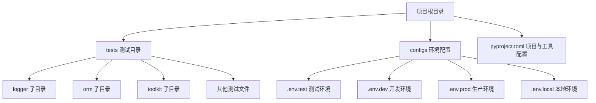
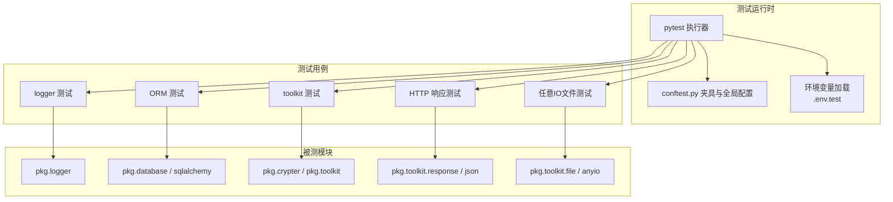
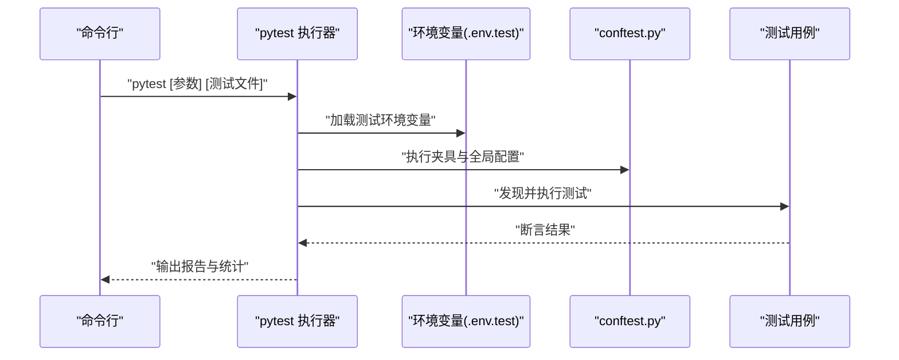
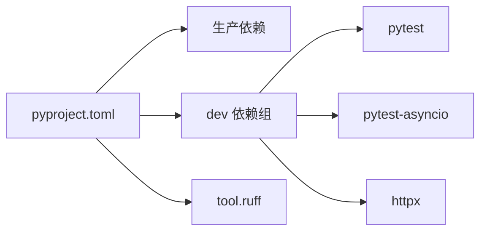

# 测试配置

<cite>
**本文引用的文件**
- [pyproject.toml](file://pyproject.toml)
- [tests/__init__.py](file://tests/__init__.py)
- [configs/.env.test](file://configs/.env.test)
- [configs/.env.dev](file://configs/.env.dev)
- [configs/.env.prod](file://configs/.env.prod)
- [configs/.env.local](file://configs/.env.local)
- [tests/conftest.py](file://tests/conftest.py)
- [tests/test_anyio_file.py](file://tests/test_anyio_file.py)
- [tests/test_json_response.py](file://tests/test_json_response.py)
- [tests/toolkit/test_crypto.py](file://tests/toolkit/test_crypto.py)
- [tests/orm/test_orm.py](file://tests/orm/test_orm.py)
- [tests/logger/test_logger.py](file://tests/logger/test_logger.py)
</cite>

## 目录
1. [简介](#简介)
2. [项目结构](#项目结构)
3. [核心组件](#核心组件)
4. [架构总览](#架构总览)
5. [详细组件分析](#详细组件分析)
6. [依赖分析](#依赖分析)
7. [性能考量](#性能考量)
8. [故障排除指南](#故障排除指南)
9. [结论](#结论)
10. [附录](#附录)

## 简介
本文件面向测试配置与管理，围绕该 FastAPI 后端项目的测试体系进行系统化梳理，覆盖以下主题：
- pytest 配置项、测试发现规则与运行参数
- 测试依赖管理、虚拟环境与 CI/CD 集成建议
- 测试报告生成、覆盖率统计与结果分析
- 测试配置文件编写规范与最佳实践
- 测试隔离、并发执行与资源管理策略
- 故障排除与性能调优指南

## 项目结构
该项目采用“按功能域分层 + 测试用例分层”的组织方式：
- 根目录下包含主应用与内部模块，测试集中在 tests 目录，按功能域进一步细分（如 logger、orm、toolkit 等）
- 测试配置与环境变量分离：pytest 配置位于 pyproject.toml；测试环境变量位于 configs/.env.test
- 测试入口与运行方式：tests/__init__.py 支持直接运行某测试文件进行调试；同时可通过 pytest 命令行统一执行

图表来源
- [pyproject.toml](file://pyproject.toml#L151-L155)
- [configs/.env.test](file://configs/.env.test#L1-L20)
- [configs/.env.dev](file://configs/.env.dev#L1-L20)
- [configs/.env.prod](file://configs/.env.prod#L1-L20)
- [configs/.env.local](file://configs/.env.local#L1-L20)

章节来源
- [pyproject.toml](file://pyproject.toml#L1-L155)
- [tests/__init__.py](file://tests/__init__.py#L1-L18)
- [configs/.env.test](file://configs/.env.test#L1-L20)

## 核心组件
- pytest 配置与标记
  - 在 pyproject.toml 中通过 tool.pytest.ini_options 定义测试标记，例如 integration 标记用于标识需要完整集成环境（如 Celery Worker、Redis）的测试
- 测试环境变量
  - configs/.env.test 提供测试阶段所需的数据库、缓存与 JWT 等配置键值，确保测试与生产/开发环境隔离
- 测试入口与运行
  - tests/__init__.py 支持直接运行某个测试文件进行调试，便于快速定位问题
- 测试夹具与异步支持
  - 各测试文件中广泛使用 pytest fixtures 与 pytest-asyncio 标记，保证异步测试的稳定执行
- 工具链与依赖
  - pyproject.toml 中 dev 组包含 pytest、pytest-asyncio、httpx 等测试相关依赖，满足单元、集成与异步测试需求

章节来源
- [pyproject.toml](file://pyproject.toml#L151-L155)
- [configs/.env.test](file://configs/.env.test#L1-L20)
- [tests/__init__.py](file://tests/__init__.py#L15-L18)
- [tests/test_anyio_file.py](file://tests/test_anyio_file.py#L9-L9)
- [tests/test_json_response.py](file://tests/test_json_response.py#L343-L346)

## 架构总览
测试架构围绕“配置隔离 + 测试发现 + 异步执行 + 环境变量”展开，如下图所示：

图表来源
- [tests/conftest.py](file://tests/conftest.py#L1-L1)
- [configs/.env.test](file://configs/.env.test#L1-L20)
- [tests/logger/test_logger.py](file://tests/logger/test_logger.py#L1-L150)
- [tests/orm/test_orm.py](file://tests/orm/test_orm.py#L1-L238)
- [tests/toolkit/test_crypto.py](file://tests/toolkit/test_crypto.py#L1-L211)
- [tests/test_json_response.py](file://tests/test_json_response.py#L1-L346)
- [tests/test_anyio_file.py](file://tests/test_anyio_file.py#L1-L161)

## 详细组件分析

### pytest 配置与标记
- 标记定义
  - 在 pyproject.toml 的 tool.pytest.ini_options 下定义 markers，如 integration，用于区分需要完整集成环境的测试
- 运行参数
  - tests/__init__.py 展示了通过命令行传参的方式启动 pytest，包括输出级别、日志级别等
- 测试发现规则
  - pytest 默认按 tests 目录下的命名规则发现测试文件与测试类/函数；结合标记可选择性运行特定类别测试

章节来源
- [pyproject.toml](file://pyproject.toml#L151-L155)
- [tests/__init__.py](file://tests/__init__.py#L15-L18)

### 测试环境变量与隔离
- 测试环境变量
  - configs/.env.test 提供数据库、Redis、JWT 等测试所需配置，确保测试与其它环境隔离
- 环境切换
  - 通过加载不同 .env 文件实现环境切换，建议在 CI/CD 中通过环境变量覆盖或注入对应文件

章节来源
- [configs/.env.test](file://configs/.env.test#L1-L20)
- [configs/.env.dev](file://configs/.env.dev#L1-L20)
- [configs/.env.prod](file://configs/.env.prod#L1-L20)
- [configs/.env.local](file://configs/.env.local#L1-L20)

### 测试夹具与异步支持
- 异步夹具
  - tests/orm/test_orm.py 使用 pytest-asyncio.fixture 并显式声明 loop_scope，确保异步引擎与会话生命周期可控
- 同步/异步夹具组合
  - 通过 db_session（异步）与 user_dao（同步）的依赖关系，验证 pytest-asyncio 对混合场景的支持
- 通用夹具
  - tests/logger/test_logger.py 使用 tmp_path 等内置夹具，保障测试隔离与临时文件清理

章节来源
- [tests/orm/test_orm.py](file://tests/orm/test_orm.py#L92-L106)
- [tests/logger/test_logger.py](file://tests/logger/test_logger.py#L14-L37)

### 日志测试
- 动态日志器创建与落盘
  - 通过 LoggerManager 创建动态日志器，验证日志文件按日期落盘与内容解析
- 降级逻辑
  - 模拟目录创建失败，验证日志自动降级至系统日志目录，确保测试鲁棒性

章节来源
- [tests/logger/test_logger.py](file://tests/logger/test_logger.py#L69-L150)

### ORM 测试
- 内存数据库与模型映射
  - 使用 sqlite+aiosqlite 内存引擎与 SQLAlchemy 异步引擎，创建表结构并执行 CRUD、批量插入、查询构建器等测试
- 严格保存/更新约束
  - 验证持久化对象与新对象在 save/update 上的不同行为，确保业务一致性
- 软删除与分页
  - 验证软删除与分页查询的正确性

章节来源
- [tests/orm/test_orm.py](file://tests/orm/test_orm.py#L92-L106)
- [tests/orm/test_orm.py](file://tests/orm/test_orm.py#L119-L238)

### 工具包测试
- 密码哈希与 AES 加解密
  - 使用 Hasher 与 AESCipher 进行加密/解密往返测试，覆盖空输入、错误密钥、篡改密文等边界条件
- 工厂与便捷函数
  - 验证算法工厂与便捷函数的正确性与一致性

章节来源
- [tests/toolkit/test_crypto.py](file://tests/toolkit/test_crypto.py#L28-L211)

### HTTP 响应与 JSON 序列化测试
- ORJSON 工具链
  - 验证 orjson_dumps/orjson_loads 的类型回环、Decimal 策略、Numpy 支持、错误处理等
- 响应封装与 FastAPI 集成
  - 使用 TestClient 验证自定义响应封装、SSE 数据格式、多语言错误消息、Unicode 编码等

章节来源
- [tests/test_json_response.py](file://tests/test_json_response.py#L73-L160)
- [tests/test_json_response.py](file://tests/test_json_response.py#L166-L229)
- [tests/test_json_response.py](file://tests/test_json_response.py#L275-L342)

### 任意 IO 文件测试
- anyio 文件操作
  - 使用 @pytest.mark.anyio 标记，覆盖文件读写、二进制/文本模式、目录创建、分块读取、按行读取、状态查询与类型错误校验等

章节来源
- [tests/test_anyio_file.py](file://tests/test_anyio_file.py#L9-L9)
- [tests/test_anyio_file.py](file://tests/test_anyio_file.py#L11-L161)

### 测试运行流程（序列图）
以下序列图展示从命令行到测试执行的关键步骤，涵盖环境变量加载、夹具初始化与测试执行：

图表来源
- [tests/__init__.py](file://tests/__init__.py#L15-L18)
- [configs/.env.test](file://configs/.env.test#L1-L20)
- [tests/conftest.py](file://tests/conftest.py#L1-L1)

## 依赖分析
- 依赖分组
  - 生产依赖与开发依赖明确分离；dev 组包含 pytest、pytest-asyncio、httpx 等测试相关工具
- 工具链
  - ruff 作为 lint/format 工具，配合 pytest 形成“质量门禁”
- 外部服务
  - 测试依赖 MySQL 与 Redis（由 .env.test 指定），建议在 CI/CD 中通过服务编排提供

图表来源
- [pyproject.toml](file://pyproject.toml#L72-L93)
- [pyproject.toml](file://pyproject.toml#L118-L146)

章节来源
- [pyproject.toml](file://pyproject.toml#L72-L93)
- [pyproject.toml](file://pyproject.toml#L118-L146)
- [configs/.env.test](file://configs/.env.test#L5-L17)

## 性能考量
- 异步测试优化
  - 使用 pytest-asyncio 与内存数据库（sqlite+aiosqlite）减少 IO 延迟，提升 ORM 测试吞吐
- 并发与隔离
  - 利用 tmp_path 等夹具与独立日志目录，避免并发测试间的共享状态干扰
- 资源管理
  - 在夹具中显式释放资源（如 dispose 引擎），防止资源泄漏
- 运行参数
  - 通过命令行参数控制并发度与日志级别，平衡速度与可观测性

章节来源
- [tests/orm/test_orm.py](file://tests/orm/test_orm.py#L92-L106)
- [tests/logger/test_logger.py](file://tests/logger/test_logger.py#L14-L37)

## 故障排除指南
- 环境变量未生效
  - 确认测试运行时已加载 .env.test；在 CI/CD 中通过环境变量覆盖或注入对应文件
- 异步测试失败
  - 检查是否正确使用 @pytest.mark.asyncio 或 pytest-asyncio.fixture，并确保 loop_scope 设置合理
- 数据库连接问题
  - 确认 .env.test 中 DB_* 配置正确；若使用外部服务，确保网络连通与凭据正确
- 日志落盘异常
  - 若动态日志目录创建失败，验证权限与磁盘配额；确认降级逻辑触发后日志落入系统目录
- 标记过滤无效
  - 确认 pyproject.toml 中 markers 已定义；运行时使用 --markers 与 -m 选项进行筛选

章节来源
- [configs/.env.test](file://configs/.env.test#L1-L20)
- [pyproject.toml](file://pyproject.toml#L151-L155)
- [tests/logger/test_logger.py](file://tests/logger/test_logger.py#L111-L150)
- [tests/orm/test_orm.py](file://tests/orm/test_orm.py#L92-L106)

## 结论
本测试配置以“隔离环境 + 明确标记 + 异步夹具 + 工具链协同”为核心，覆盖日志、ORM、工具包、HTTP 响应与文件操作等关键领域。建议在 CI/CD 中固定测试环境变量、引入覆盖率统计与报告归档，并持续优化异步测试并发与资源回收策略。

## 附录

### 测试运行参数与最佳实践
- 常用运行参数
  - -v：详细输出
  - -s：禁用捕获输出
  - --log-cli-level：设置日志级别
  - -m 标记：按标记过滤测试
  - --tb：设置回溯样式
- 最佳实践
  - 使用夹具管理资源生命周期
  - 对异步代码使用 pytest-asyncio 标记与夹具
  - 将集成测试标记为 integration，便于在 CI 中选择性运行
  - 使用 tmp_path 等夹具保障测试隔离

章节来源
- [tests/__init__.py](file://tests/__init__.py#L15-L18)
- [pyproject.toml](file://pyproject.toml#L151-L155)

### 测试报告与覆盖率
- 报告生成
  - 建议在 CI 中启用 junitxml 或其它报告格式，便于归档与趋势分析
- 覆盖率统计
  - 建议引入覆盖率工具（如 coverage.py），在 CI 中生成并上报覆盖率报告
- 结果分析
  - 结合日志与报告，定期复盘失败用例，优化标记与运行策略

[本节为通用指导，无需特定文件引用]

### CI/CD 集成建议
- 环境准备
  - 在流水线中拉起 MySQL 与 Redis 服务，或使用容器编排
- 依赖安装
  - 使用 dev 组依赖进行测试执行
- 运行策略
  - 分层运行：先运行 unit，再运行 integration；对慢测试使用并行与标记过滤

章节来源
- [pyproject.toml](file://pyproject.toml#L72-L93)
- [configs/.env.test](file://configs/.env.test#L5-L17)