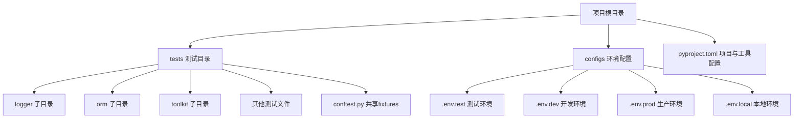
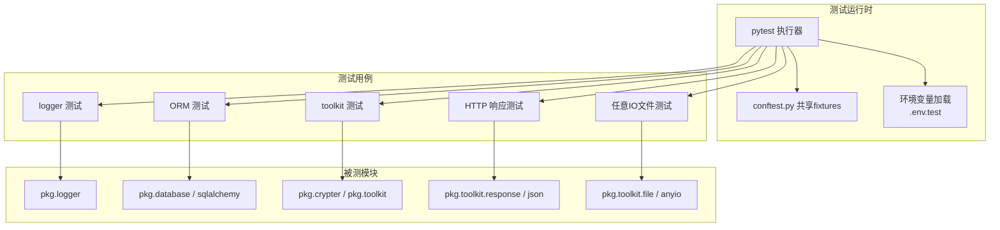
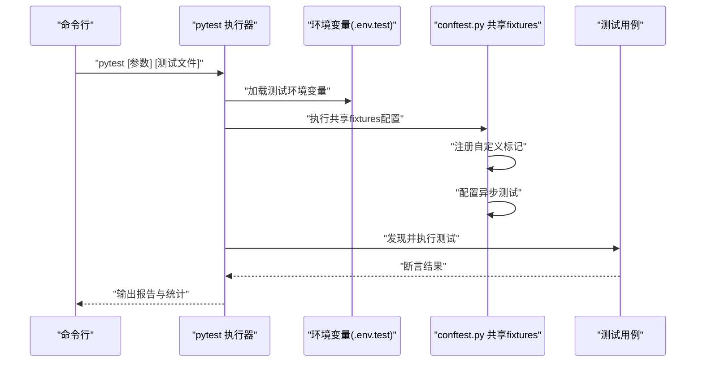
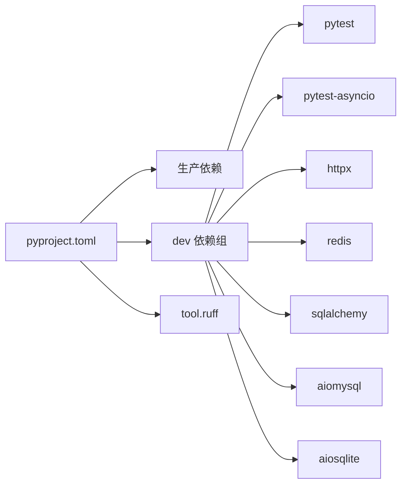

# 测试配置

<cite>
**本文引用的文件**
- [pyproject.toml](file://pyproject.toml)
- [tests/__init__.py](file://tests/__init__.py)
- [configs/.env.test](file://configs/.env.test)
- [configs/.env.dev](file://configs/.env.dev)
- [configs/.env.prod](file://configs/.env.prod)
- [configs/.env.local](file://configs/.env.local)
- [tests/conftest.py](file://tests/conftest.py)
- [tests/test_anyio_file.py](file://tests/test_anyio_file.py)
- [tests/test_json_response.py](file://tests/test_json_response.py)
- [tests/toolkit/test_crypto.py](file://tests/toolkit/test_crypto.py)
- [tests/orm/test_orm.py](file://tests/orm/test_orm.py)
- [tests/logger/test_logger.py](file://tests/logger/test_logger.py)
</cite>

## 更新摘要
**变更内容**
- 新增全面的pytest配置和共享fixtures系统
- 添加tests/conftest.py中的Mock实现、内存SQLite数据库、Redis测试客户端等测试基础设施
- 新增pytest配置hooks和自定义标记系统
- 新增异步测试配置和数据库fixtures
- 新增Redis fixtures和FastAPI测试客户端fixtures
- 增强测试隔离和资源管理策略

## 目录
1. [简介](#简介)
2. [项目结构](#项目结构)
3. [核心组件](#核心组件)
4. [架构总览](#架构总览)
5. [详细组件分析](#详细组件分析)
6. [依赖分析](#依赖分析)
7. [性能考量](#性能考量)
8. [故障排除指南](#故障排除指南)
9. [结论](#结论)
10. [附录](#附录)

## 简介
本文件面向测试配置与管理，围绕该 FastAPI 后端项目的测试体系进行系统化梳理，覆盖以下主题：
- pytest 配置项、测试发现规则与运行参数
- 测试依赖管理、虚拟环境与 CI/CD 集成建议
- 测试报告生成、覆盖率统计与结果分析
- 测试配置文件编写规范与最佳实践
- 测试隔离、并发执行与资源管理策略
- 故障排除与性能调优指南

**更新** 本版本新增了全面的pytest配置和共享fixtures系统，提供了Mock实现、内存数据库、Redis客户端等完整的测试基础设施。

## 项目结构
该项目采用"按功能域分层 + 测试用例分层 + 共享fixtures"的组织方式：
- 根目录下包含主应用与内部模块，测试集中在 tests 目录，按功能域进一步细分（如 logger、orm、toolkit 等）
- 测试配置与环境变量分离：pytest 配置位于 pyproject.toml；测试环境变量位于 configs/.env.test
- **新增** 共享fixtures系统：tests/conftest.py 提供全局可用的测试基础设施
- 测试入口与运行方式：tests/__init__.py 支持直接运行某测试文件进行调试；同时可通过 pytest 命令行统一执行

```mermaid
graph TB
A["项目根目录"] --> B["tests 测试目录"]
B --> B1["logger 子目录"]
B --> B2["orm 子目录"]
B --> B3["toolkit 子目录"]
B --> B4["其他测试文件"]
B --> B5["conftest.py 共享fixtures"]
A --> C["configs 环境配置"]
C --> C1[".env.test 测试环境"]
C --> C2[".env.dev 开发环境"]
C --> C3[".env.prod 生产环境"]
C --> C4[".env.local 本地环境"]
A --> D["pyproject.toml 项目与工具配置"]
```

**图表来源**
- [pyproject.toml](file://pyproject.toml#L151-L155)
- [configs/.env.test](file://configs/.env.test#L1-L22)
- [configs/.env.dev](file://configs/.env.dev#L1-L20)
- [configs/.env.prod](file://configs/.env.prod#L1-L20)
- [configs/.env.local](file://configs/.env.local#L1-L20)
- [tests/conftest.py](file://tests/conftest.py#L1-L512)

**章节来源**
- [pyproject.toml](file://pyproject.toml#L1-L156)
- [tests/__init__.py](file://tests/__init__.py#L1-L18)
- [configs/.env.test](file://configs/.env.test#L1-L22)
- [tests/conftest.py](file://tests/conftest.py#L1-L512)

## 核心组件
- **新增** 共享fixtures系统
  - tests/conftest.py 提供全局可用的测试基础设施，包括Mock实现、数据库连接、Redis客户端、FastAPI应用等
  - 所有fixtures在测试文件中可直接使用，无需重复导入
- pytest 配置与标记
  - 在 pyproject.toml 中通过 tool.pytest.ini_options 定义测试标记，例如 integration 标记用于标识需要完整集成环境（如 Celery Worker、Redis）的测试
  - **新增** pytest配置hooks：自动注册自定义标记、为异步测试添加标记等
- 测试环境变量
  - configs/.env.test 提供测试阶段所需的数据库、缓存与 JWT 等配置键值，确保测试与生产/开发环境隔离
- 测试入口与运行
  - tests/__init__.py 支持直接运行某个测试文件进行调试，便于快速定位问题
- **增强** 测试夹具与异步支持
  - 各测试文件中广泛使用 pytest fixtures 与 pytest-asyncio 标记，保证异步测试的稳定执行
  - **新增** 内存数据库、Redis客户端、FastAPI应用等高级fixtures
- 工具链与依赖
  - pyproject.toml 中 dev 组包含 pytest、pytest-asyncio、httpx 等测试相关依赖，满足单元、集成与异步测试需求

**章节来源**
- [tests/conftest.py](file://tests/conftest.py#L1-L512)
- [pyproject.toml](file://pyproject.toml#L151-L155)
- [configs/.env.test](file://configs/.env.test#L1-L22)
- [tests/__init__.py](file://tests/__init__.py#L15-L18)
- [tests/test_anyio_file.py](file://tests/test_anyio_file.py#L9-L9)
- [tests/test_json_response.py](file://tests/test_json_response.py#L343-L346)

## 架构总览
测试架构围绕"配置隔离 + 共享fixtures + 测试发现 + 异步执行 + 环境变量"展开，如下图所示：

```mermaid
graph TB
subgraph "测试运行时"
P["pytest 执行器"]
CF["conftest.py 共享fixtures"]
ENV["环境变量加载<br/>.env.test"]
end
subgraph "测试用例"
T1["logger 测试"]
T2["ORM 测试"]
T3["toolkit 测试"]
T4["HTTP 响应测试"]
T5["任意IO文件测试"]
end
subgraph "被测模块"
M1["pkg.logger"]
M2["pkg.database / sqlalchemy"]
M3["pkg.crypter / pkg.toolkit"]
M4["pkg.toolkit.response / json"]
M5["pkg.toolkit.file / anyio"]
end
P --> CF
P --> ENV
P --> T1
P --> T2
P --> T3
P --> T4
P --> T5
T1 --> M1
T2 --> M2
T3 --> M3
T4 --> M4
T5 --> M5
```

**图表来源**
- [tests/conftest.py](file://tests/conftest.py#L1-L512)
- [configs/.env.test](file://configs/.env.test#L1-L22)
- [tests/logger/test_logger.py](file://tests/logger/test_logger.py#L1-L150)
- [tests/orm/test_orm.py](file://tests/orm/test_orm.py#L1-L238)
- [tests/toolkit/test_crypto.py](file://tests/toolkit/test_crypto.py#L1-L211)
- [tests/test_json_response.py](file://tests/test_json_response.py#L1-L346)
- [tests/test_anyio_file.py](file://tests/test_anyio_file.py#L1-L161)

## 详细组件分析

### **新增** 共享fixtures系统
- **Mock实现**
  - Mock logger模块，提供info、error、warning、success、debug、critical等方法
  - Mock pkg.toolkit.context模块，提供get_user_id等上下文方法
  - Mock snowflake ID生成器，提供确定性的ID序列
- **数据库测试fixtures**
  - 内存SQLite数据库引擎，每个测试函数独立创建和销毁
  - 数据库会话工厂，自动建表和事务回滚
  - 带自动回滚的数据库会话，确保测试隔离
- **Redis测试fixtures**
  - Redis客户端，使用独立数据库避免污染开发数据
  - Mock Redis客户端，适用于不需要真实Redis的单元测试
- **FastAPI测试客户端fixtures**
  - 测试用FastAPI应用实例，使用测试配置
  - 同步和异步测试客户端，支持不同类型的API测试
- **通用测试数据fixtures**
  - 用户数据模板，支持单个和批量用户数据
- **工具函数fixtures**
  - ID计数器重置、时间冻结等实用工具

**章节来源**
- [tests/conftest.py](file://tests/conftest.py#L45-L83)
- [tests/conftest.py](file://tests/conftest.py#L153-L236)
- [tests/conftest.py](file://tests/conftest.py#L243-L293)
- [tests/conftest.py](file://tests/conftest.py#L300-L352)
- [tests/conftest.py](file://tests/conftest.py#L359-L376)
- [tests/conftest.py](file://tests/conftest.py#L383-L410)

### pytest 配置与标记
- **新增** 配置hooks
  - pytest_configure：注册自定义markers（integration、slow、unit）
  - pytest_collection_modifyitems：自动为异步测试添加asyncio标记
- 标记定义
  - 在 pyproject.toml 的 tool.pytest.ini_options 下定义 markers，如 integration，用于区分需要完整集成环境的测试
- 运行参数
  - tests/__init__.py 展示了通过命令行传参的方式启动 pytest，包括输出级别、日志级别等
- 测试发现规则
  - pytest 默认按 tests 目录下的命名规则发现测试文件与测试类/函数；结合标记可选择性运行特定类别测试

**章节来源**
- [tests/conftest.py](file://tests/conftest.py#L101-L127)
- [pyproject.toml](file://pyproject.toml#L151-L155)
- [tests/__init__.py](file://tests/__init__.py#L15-L18)

### 测试环境变量与隔离
- 测试环境变量
  - configs/.env.test 提供数据库、Redis、JWT 等测试所需配置，确保测试与其它环境隔离
  - 支持MySQL数据库配置和Redis连接配置
- 环境切换
  - 通过加载不同 .env 文件实现环境切换，建议在 CI/CD 中通过环境变量覆盖或注入对应文件

**章节来源**
- [configs/.env.test](file://configs/.env.test#L1-L22)
- [configs/.env.dev](file://configs/.env.dev#L1-L20)
- [configs/.env.prod](file://configs/.env.prod#L1-L20)
- [configs/.env.local](file://configs/.env.local#L1-L20)

### **增强** 测试夹具与异步支持
- **新增** 异步夹具配置
  - event_loop_policy：配置事件循环策略
  - anyio_backend：配置anyio后端为asyncio
- **增强** 异步夹具
  - tests/orm/test_orm.py 使用 pytest-asyncio.fixture 并显式声明 loop_scope，确保异步引擎与会话生命周期可控
  - **新增** 通过共享fixtures提供统一的异步测试配置
- 同步/异步夹具组合
  - 通过 db_session（异步）与 user_dao（同步）的依赖关系，验证 pytest-asyncio 对混合场景的支持
- 通用夹具
  - tests/logger/test_logger.py 使用 tmp_path 等内置夹具，保障测试隔离与临时文件清理

**章节来源**
- [tests/conftest.py](file://tests/conftest.py#L134-L146)
- [tests/orm/test_orm.py](file://tests/orm/test_orm.py#L92-L106)
- [tests/logger/test_logger.py](file://tests/logger/test_logger.py#L14-L37)

### 日志测试
- 动态日志器创建与落盘
  - 通过 LoggerManager 创建动态日志器，验证日志文件按日期落盘与内容解析
- 降级逻辑
  - 模拟目录创建失败，验证日志自动降级至系统日志目录，确保测试鲁棒性

**章节来源**
- [tests/logger/test_logger.py](file://tests/logger/test_logger.py#L69-L150)

### ORM 测试
- **增强** 内存数据库与模型映射
  - 使用 sqlite+aiosqlite 内存引擎与 SQLAlchemy 异步引擎，创建表结构并执行 CRUD、批量插入、查询构建器等测试
  - **新增** 通过共享fixtures提供统一的内存数据库配置
- 严格保存/更新约束
  - 验证持久化对象与新对象在 save/update 上的不同行为，确保业务一致性
- 软删除与分页
  - 验证软删除与分页查询的正确性

**章节来源**
- [tests/conftest.py](file://tests/conftest.py#L153-L236)
- [tests/orm/test_orm.py](file://tests/orm/test_orm.py#L92-L106)
- [tests/orm/test_orm.py](file://tests/orm/test_orm.py#L119-L238)

### 工具包测试
- 密码哈希与 AES 加解密
  - 使用 Hasher 与 AESCipher 进行加密/解密往返测试，覆盖空输入、错误密钥、篡改密文等边界条件
- 工厂与便捷函数
  - 验证算法工厂与便捷函数的正确性与一致性

**章节来源**
- [tests/toolkit/test_crypto.py](file://tests/toolkit/test_crypto.py#L28-L211)

### HTTP 响应与 JSON 序列化测试
- ORJSON 工具链
  - 验证 orjson_dumps/orjson_loads 的类型回环、Decimal 策略、Numpy 支持、错误处理等
- 响应封装与 FastAPI 集成
  - 使用 TestClient 验证自定义响应封装、SSE 数据格式、多语言错误消息、Unicode 编码等

**章节来源**
- [tests/test_json_response.py](file://tests/test_json_response.py#L73-L160)
- [tests/test_json_response.py](file://tests/test_json_response.py#L166-L229)
- [tests/test_json_response.py](file://tests/test_json_response.py#L275-L342)

### 任意 IO 文件测试
- anyio 文件操作
  - 使用 @pytest.mark.anyio 标记，覆盖文件读写、二进制/文本模式、目录创建、分块读取、按行读取、状态查询与类型错误校验等

**章节来源**
- [tests/test_anyio_file.py](file://tests/test_anyio_file.py#L9-L9)
- [tests/test_anyio_file.py](file://tests/test_anyio_file.py#L11-L161)

### **新增** 测试运行流程（序列图）
以下序列图展示从命令行到测试执行的关键步骤，涵盖环境变量加载、共享fixtures初始化与测试执行：

```mermaid
sequenceDiagram
participant CLI as "命令行"
participant PY as "pytest 执行器"
participant ENV as "环境变量(.env.test)"
participant CONF as "conftest.py 共享fixtures"
participant TEST as "测试用例"
CLI->>PY : "pytest [参数] [测试文件]"
PY->>ENV : "加载测试环境变量"
PY->>CONF : "执行共享fixtures配置"
CONF->>CONF : "注册自定义标记"
CONF->>CONF : "配置异步测试"
PY->>TEST : "发现并执行测试"
TEST-->>PY : "断言结果"
PY-->>CLI : "输出报告与统计"
```

**图表来源**
- [tests/__init__.py](file://tests/__init__.py#L15-L18)
- [configs/.env.test](file://configs/.env.test#L1-L22)
- [tests/conftest.py](file://tests/conftest.py#L101-L127)

## 依赖分析
- 依赖分组
  - 生产依赖与开发依赖明确分离；dev 组包含 pytest、pytest-asyncio、httpx 等测试相关工具
- 工具链
  - ruff 作为 lint/format 工具，配合 pytest 形成"质量门禁"
- 外部服务
  - 测试依赖 MySQL 与 Redis（由 .env.test 指定），建议在 CI/CD 中通过服务编排提供
- **新增** 测试依赖
  - 新增redis、sqlalchemy、aiomysql、aiosqlite等数据库相关依赖
  - 新增pytest-asyncio、httpx等异步测试支持依赖

```mermaid
graph LR
A["pyproject.toml"] --> B["生产依赖"]
A --> C["dev 依赖组"]
C --> C1["pytest"]
C --> C2["pytest-asyncio"]
C --> C3["httpx"]
C --> C4["redis"]
C --> C5["sqlalchemy"]
C --> C6["aiomysql"]
C --> C7["aiosqlite"]
A --> D["tool.ruff"]
```

**图表来源**
- [pyproject.toml](file://pyproject.toml#L72-L94)
- [pyproject.toml](file://pyproject.toml#L118-L146)

**章节来源**
- [pyproject.toml](file://pyproject.toml#L72-L94)
- [pyproject.toml](file://pyproject.toml#L118-L146)
- [configs/.env.test](file://configs/.env.test#L5-L20)

## 性能考量
- **新增** 异步测试优化
  - 使用 pytest-asyncio 与内存数据库（sqlite+aiosqlite）减少 IO 延迟，提升 ORM 测试吞吐
  - **新增** 通过共享fixtures预加载常用模块，加速测试执行
- 并发与隔离
  - 利用 tmp_path 等夹具与独立日志目录，避免并发测试间的共享状态干扰
  - **新增** 通过Redis测试客户端的独立数据库避免数据污染
- 资源管理
  - 在夹具中显式释放资源（如dispose引擎、flushdb、aclose），防止资源泄漏
  - **新增** 自动清理fixture，在每个测试后重置全局状态
- 运行参数
  - 通过命令行参数控制并发度与日志级别，平衡速度与可观测性

**章节来源**
- [tests/conftest.py](file://tests/conftest.py#L153-L236)
- [tests/conftest.py](file://tests/conftest.py#L243-L293)
- [tests/conftest.py](file://tests/conftest.py#L480-L512)
- [tests/logger/test_logger.py](file://tests/logger/test_logger.py#L14-L37)

## 故障排除指南
- 环境变量未生效
  - 确认测试运行时已加载 .env.test；在 CI/CD 中通过环境变量覆盖或注入对应文件
- **新增** 共享fixtures相关问题
  - 确认conftest.py中的Mock模块正确导入；检查sys.modules的替换是否生效
  - 验证数据库URL和Redis URL配置正确；确保内存数据库连接正常
- 异步测试失败
  - 检查是否正确使用 @pytest.mark.asyncio 或 pytest-asyncio.fixture，并确保 loop_scope 设置合理
  - **新增** 验证共享fixtures中的anyio_backend配置
- 数据库连接问题
  - 确认 .env.test 中 DB_* 配置正确；若使用外部服务，确保网络连通与凭据正确
  - **新增** 验证内存数据库引擎的创建和销毁过程
- Redis连接问题
  - 确认TEST_REDIS_URL配置正确；验证Redis服务可用性
  - **新增** 检查Redis测试客户端的连接池和数据库清理
- 日志落盘异常
  - 若动态日志目录创建失败，验证权限与磁盘配额；确认降级逻辑触发后日志落入系统目录
- 标记过滤无效
  - 确认 pyproject.toml 中 markers 已定义；运行时使用 --markers 与 -m 选项进行筛选

**章节来源**
- [configs/.env.test](file://configs/.env.test#L1-L22)
- [tests/conftest.py](file://tests/conftest.py#L88-L94)
- [pyproject.toml](file://pyproject.toml#L151-L155)
- [tests/logger/test_logger.py](file://tests/logger/test_logger.py#L111-L150)
- [tests/orm/test_orm.py](file://tests/orm/test_orm.py#L92-L106)

## 结论
本测试配置以"隔离环境 + 共享fixtures + 明确标记 + 异步夹具 + 工具链协同"为核心，覆盖日志、ORM、工具包、HTTP 响应与文件操作等关键领域。**新增的共享fixtures系统提供了完整的测试基础设施，包括Mock实现、内存数据库、Redis客户端、FastAPI应用等，大大简化了测试代码的编写和维护。** 建议在 CI/CD 中固定测试环境变量、引入覆盖率统计与报告归档，并持续优化异步测试并发与资源回收策略。

## 附录

### **新增** 共享fixtures使用指南
- **Mock实现**
  - logger_mock：用于验证日志调用，自动重置状态
  - mock_config：提供可自定义的配置对象
  - reset_logger_mock：每个测试前自动重置logger mock
- **数据库fixtures**
  - db_engine：内存数据库引擎，自动创建和销毁
  - db_session：数据库会话工厂，自动建表和清理
  - db_session_with_rollback：带事务回滚的会话
- **Redisfixtures**
  - redis_client：Redis测试客户端，自动清理数据库
  - mock_redis：Mock Redis客户端，适用于单元测试
- **FastAPIfixtures**
  - app：测试用FastAPI应用实例
  - client：同步测试客户端
  - async_client：异步测试客户端

**章节来源**
- [tests/conftest.py](file://tests/conftest.py#L437-L473)
- [tests/conftest.py](file://tests/conftest.py#L153-L236)
- [tests/conftest.py](file://tests/conftest.py#L243-L293)
- [tests/conftest.py](file://tests/conftest.py#L300-L352)

### 测试运行参数与最佳实践
- 常用运行参数
  - -v：详细输出
  - -s：禁用捕获输出
  - --log-cli-level：设置日志级别
  - -m 标记：按标记过滤测试
  - --tb：设置回溯样式
- **新增** 最佳实践
  - 优先使用共享fixtures，减少重复代码
  - 对异步代码使用pytest-asyncio标记与夹具
  - 将集成测试标记为 integration，便于在 CI 中选择性运行
  - 使用 tmp_path 等夹具保障测试隔离
  - **新增** 利用Mock实现隔离外部依赖，提高测试稳定性

**章节来源**
- [tests/__init__.py](file://tests/__init__.py#L15-L18)
- [pyproject.toml](file://pyproject.toml#L151-L155)
- [tests/conftest.py](file://tests/conftest.py#L45-L83)

### 测试报告与覆盖率
- 报告生成
  - 建议在 CI 中启用 junitxml 或其它报告格式，便于归档与趋势分析
- 覆盖率统计
  - 建议引入覆盖率工具（如 coverage.py），在 CI 中生成并上报覆盖率报告
- 结果分析
  - 结合日志与报告，定期复盘失败用例，优化标记与运行策略

### CI/CD 集成建议
- 环境准备
  - 在流水线中拉起 MySQL 与 Redis 服务，或使用容器编排
- 依赖安装
  - 使用 dev 组依赖进行测试执行
- 运行策略
  - 分层运行：先运行 unit，再运行 integration；对慢测试使用并行与标记过滤
- **新增** 测试基础设施
  - 确保Redis服务可用，配置TEST_REDIS_URL环境变量
  - 预热内存数据库，提高测试执行效率

**章节来源**
- [pyproject.toml](file://pyproject.toml#L72-L94)
- [configs/.env.test](file://configs/.env.test#L5-L20)
- [tests/conftest.py](file://tests/conftest.py#L91-L94)