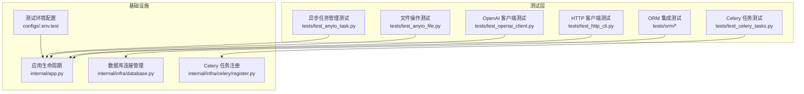
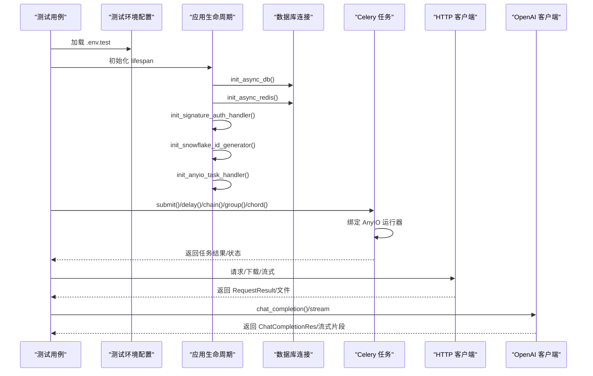
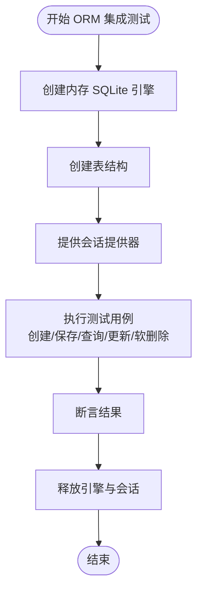
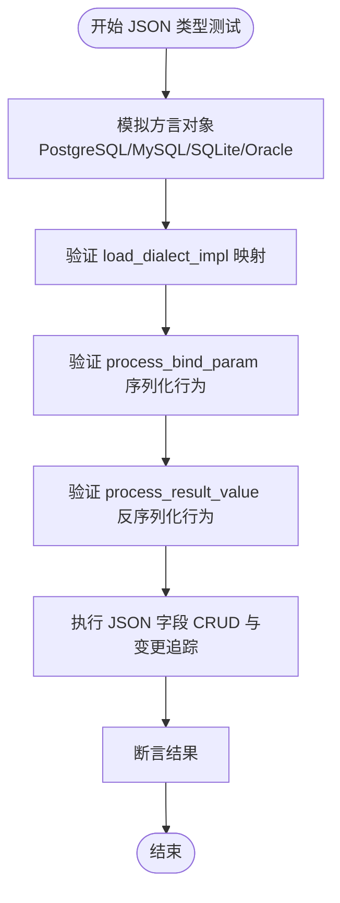
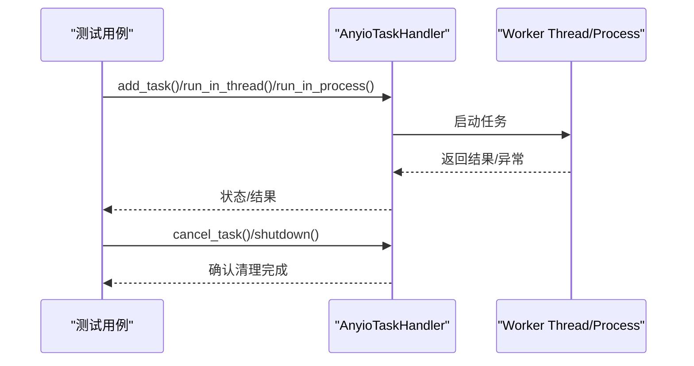
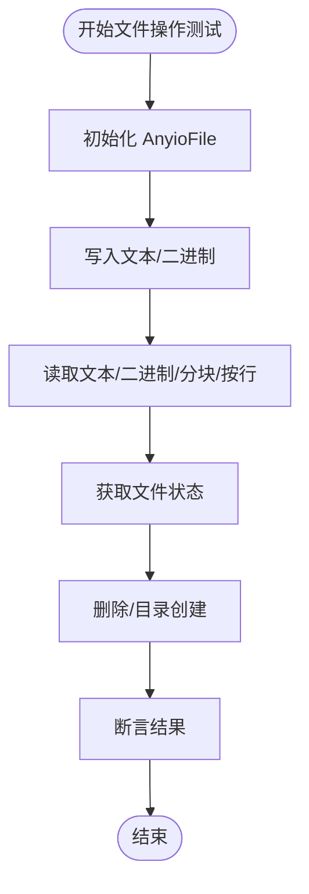
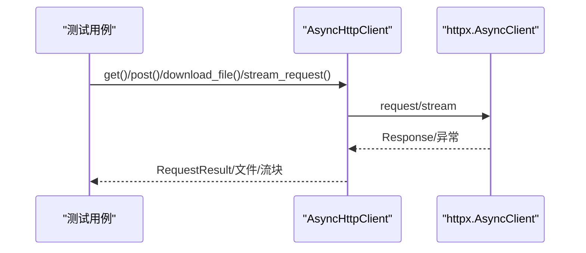
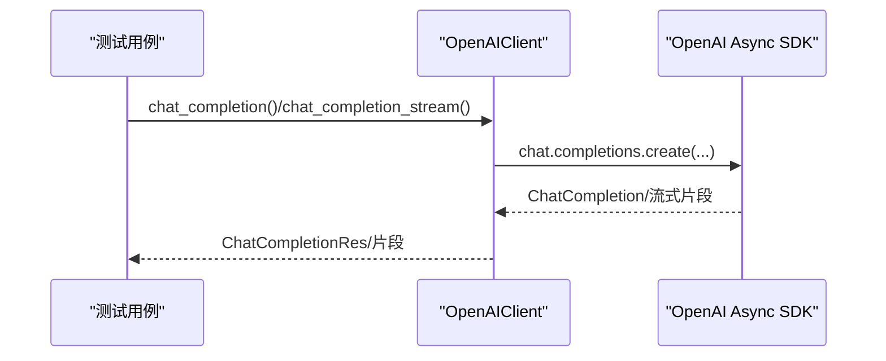
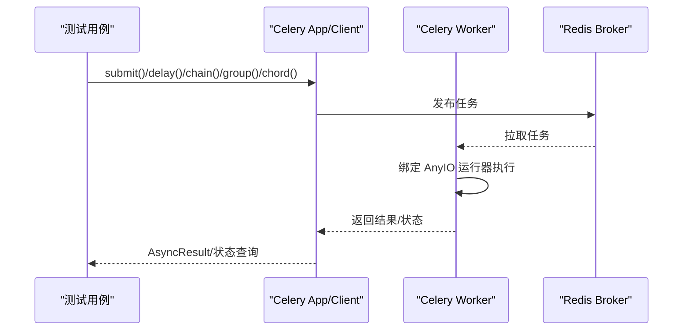
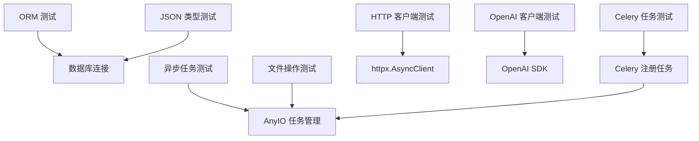

# 集成测试

<cite>
**本文引用的文件**
- [tests/__init__.py](file://tests/__init__.py)
- [configs/.env.test](file://configs/.env.test)
- [internal/app.py](file://internal/app.py)
- [internal/infra/database.py](file://internal/infra/database.py)
- [internal/infra/celery/register.py](file://internal/infra/celery/register.py)
- [tests/test_celery_tasks.py](file://tests/test_celery_tasks.py)
- [tests/test_http_cli.py](file://tests/test_http_cli.py)
- [pkg/toolkit/openai_cli.py](file://pkg/toolkit/openai_cli.py)
- [tests/test_openai_client.py](file://tests/test_openai_client.py)
- [tests/test_anyio_task.py](file://tests/test_anyio_task.py)
- [tests/test_anyio_file.py](file://tests/test_anyio_file.py)
- [tests/orm/test_orm.py](file://tests/orm/test_orm.py)
- [tests/orm/test_orm_json_type.py](file://tests/orm/test_orm_json_type.py)
- [tests/test_json_type.py](file://tests/test_json_type.py)
</cite>

## 目录
1. [简介](#简介)
2. [项目结构](#项目结构)
3. [核心组件](#核心组件)
4. [架构总览](#架构总览)
5. [详细组件分析](#详细组件分析)
6. [依赖关系分析](#依赖关系分析)
7. [性能考量](#性能考量)
8. [故障排查指南](#故障排查指南)
9. [结论](#结论)
10. [附录](#附录)

## 简介
本文件面向本项目的集成测试，系统化阐述数据库集成测试、异步任务测试、HTTP 客户端测试与外部服务集成测试的实施方法。重点覆盖 ORM 集成测试、JSON 类型测试、文件操作测试；文档化 Celery 任务测试与 OpenAI 客户端测试的配置与执行流程；并提供测试环境搭建、数据库连接管理、异步操作测试技巧、最佳实践与性能优化建议，以及测试数据清理与状态重置策略。

## 项目结构
本项目采用分层与功能模块化组织，测试用例集中在 tests 目录下，分别覆盖：
- 数据库与 ORM：tests/orm
- 工具与客户端：tests/test_http_cli.py、tests/test_openai_client.py、tests/test_anyio_task.py、tests/test_anyio_file.py
- 异步任务与 Celery：tests/test_celery_tasks.py
- 环境配置：configs/.env.test

**图表来源**
- [configs/.env.test](file://configs/.env.test#L1-L20)
- [internal/app.py](file://internal/app.py#L17-L109)
- [internal/infra/database.py](file://internal/infra/database.py#L26-L111)
- [internal/infra/celery/register.py](file://internal/infra/celery/register.py#L8-L28)

**章节来源**
- [configs/.env.test](file://configs/.env.test#L1-L20)
- [internal/app.py](file://internal/app.py#L17-L109)

## 核心组件
- 数据库连接与生命周期管理：负责初始化/关闭数据库连接池，提供会话获取上下文，SQL 监控与慢查询日志。
- 应用生命周期：在 FastAPI lifespan 中初始化数据库、Redis、签名认证、雪花 ID 生成器与 AnyIO 任务管理器。
- Celery 任务注册与执行：定义任务函数，绑定 AnyIO 运行器，支持重试与链式/并发/回调模式。
- HTTP 客户端：基于 httpx 的异步客户端，统一封装请求、错误处理、流式下载与进度回调。
- OpenAI 客户端：封装聊天补全与流式补全，统一消息格式转换与参数构建，带超时与错误处理。
- 文件与异步任务管理：AnyioFile 提供异步文件读写、分块读取、目录操作；AnyioTaskHandler 提供任务调度、并发控制、取消与超时。

**章节来源**
- [internal/infra/database.py](file://internal/infra/database.py#L26-L111)
- [internal/app.py](file://internal/app.py#L85-L109)
- [internal/infra/celery/register.py](file://internal/infra/celery/register.py#L8-L28)
- [pkg/toolkit/http_cli.py](file://pkg/toolkit/http_cli.py#L38-L232)
- [pkg/toolkit/openai_cli.py](file://pkg/toolkit/openai_cli.py#L28-L217)
- [tests/test_anyio_file.py](file://tests/test_anyio_file.py#L10-L161)
- [tests/test_anyio_task.py](file://tests/test_anyio_task.py#L67-L235)

## 架构总览
集成测试围绕“测试环境—应用生命周期—基础设施—业务组件”展开，测试用例通过独立的内存数据库或外部服务（Redis/Celery/OpenAI）进行端到端验证。

**图表来源**
- [configs/.env.test](file://configs/.env.test#L1-L20)
- [internal/app.py](file://internal/app.py#L85-L109)
- [internal/infra/database.py](file://internal/infra/database.py#L26-L56)
- [internal/infra/celery/register.py](file://internal/infra/celery/register.py#L8-L28)
- [pkg/toolkit/http_cli.py](file://pkg/toolkit/http_cli.py#L114-L156)
- [pkg/toolkit/openai_cli.py](file://pkg/toolkit/openai_cli.py#L124-L163)

## 详细组件分析

### 数据库集成测试（ORM）
- 测试策略
  - 使用内存 SQLite 引擎，创建测试表结构，构造会话提供器，确保每个测试隔离。
  - 验证对象创建、保存、严格 INSERT/UPDATE 规则、批量插入、查询构建器、分页、软删除与更新构建器逻辑。
- 关键点
  - 通过 pytest-asyncio 的异步 fixture 提供会话，避免跨事件循环问题。
  - 使用 Mock 模块替换 JSON 序列化/反序列化与上下文用户 ID，保证测试稳定性。
- 数据清理
  - 测试结束后释放引擎与会话，确保无连接泄漏。

**图表来源**
- [tests/orm/test_orm.py](file://tests/orm/test_orm.py#L92-L105)
- [tests/orm/test_orm.py](file://tests/orm/test_orm.py#L119-L238)
- [tests/orm/test_orm_json_type.py](file://tests/orm/test_orm_json_type.py#L97-L110)
- [tests/orm/test_orm_json_type.py](file://tests/orm/test_orm_json_type.py#L117-L213)

**章节来源**
- [tests/orm/test_orm.py](file://tests/orm/test_orm.py#L92-L105)
- [tests/orm/test_orm.py](file://tests/orm/test_orm.py#L119-L238)
- [tests/orm/test_orm_json_type.py](file://tests/orm/test_orm_json_type.py#L97-L110)
- [tests/orm/test_orm_json_type.py](file://tests/orm/test_orm_json_type.py#L117-L213)

### JSON 类型测试（跨数据库方言）
- 测试策略
  - 验证不同数据库方言（PostgreSQL/MySQL/SQLite/Oracle）对 JSON 类型的适配。
  - 验证序列化/反序列化、原生 JSON 透传、CLOB 模式序列化、空字符串回退、LOB 对象读取、MutableDict/MutableList 变更追踪。
- 关键点
  - 通过模拟方言对象，覆盖各数据库的类型实现差异。
  - 在 SQLite 内存数据库上执行完整 CRUD 与变更追踪，确保 ORM 层正确工作。

**图表来源**
- [tests/test_json_type.py](file://tests/test_json_type.py#L49-L100)
- [tests/test_json_type.py](file://tests/test_json_type.py#L105-L157)
- [tests/test_json_type.py](file://tests/test_json_type.py#L162-L227)
- [tests/test_json_type.py](file://tests/test_json_type.py#L246-L330)

**章节来源**
- [tests/test_json_type.py](file://tests/test_json_type.py#L49-L100)
- [tests/test_json_type.py](file://tests/test_json_type.py#L105-L157)
- [tests/test_json_type.py](file://tests/test_json_type.py#L162-L227)
- [tests/test_json_type.py](file://tests/test_json_type.py#L246-L330)

### 异步任务测试（AnyIO 任务管理）
- 测试策略
  - 验证任务添加、去重、超时、取消、并发执行、线程/进程执行、批量执行与异常处理。
  - 使用 anyio backend 与轮询等待任务清理，确保状态一致性。
- 关键点
  - 通过 Mock 日志与线程/进程 ID 验证执行环境切换。
  - 超时与全局超时参数组合，验证部分任务失败与整体超时场景。

**图表来源**
- [tests/test_anyio_task.py](file://tests/test_anyio_task.py#L67-L235)

**章节来源**
- [tests/test_anyio_task.py](file://tests/test_anyio_task.py#L67-L235)

### 文件操作测试（AnyioFile）
- 测试策略
  - 验证文本/二进制读写、自动创建父目录、删除、目录创建、分块读取、按行读取、文件状态、类型错误校验。
- 关键点
  - 使用临时目录与异步上下文，确保文件系统操作可重复与可清理。

**图表来源**
- [tests/test_anyio_file.py](file://tests/test_anyio_file.py#L10-L161)

**章节来源**
- [tests/test_anyio_file.py](file://tests/test_anyio_file.py#L10-L161)

### HTTP 客户端测试（AsyncHttpClient）
- 测试策略
  - 验证 RequestResult 成功判定、JSON 缓存、错误消息提取、HTTP 方法封装、错误响应、HTTPStatusError、RequestError。
  - 文件下载成功/失败、进度回调、流式请求。
- 关键点
  - 使用 httpx.AsyncClient 与流式上下文，统一异常转换为 RequestResult。
  - 下载文件时自动创建父目录，支持进度回调。

**图表来源**
- [pkg/toolkit/http_cli.py](file://pkg/toolkit/http_cli.py#L114-L156)
- [pkg/toolkit/http_cli.py](file://pkg/toolkit/http_cli.py#L169-L232)
- [tests/test_http_cli.py](file://tests/test_http_cli.py#L70-L262)

**章节来源**
- [pkg/toolkit/http_cli.py](file://pkg/toolkit/http_cli.py#L114-L156)
- [pkg/toolkit/http_cli.py](file://pkg/toolkit/http_cli.py#L169-L232)
- [tests/test_http_cli.py](file://tests/test_http_cli.py#L70-L262)

### 外部服务集成测试（OpenAI 客户端）
- 测试策略
  - 非流式与流式聊天补全，错误处理（无效消息结构、空消息列表），时间戳与响应内容断言。
- 关键点
  - 统一消息格式转换，参数构建与超时控制，错误捕获与日志记录。

**图表来源**
- [pkg/toolkit/openai_cli.py](file://pkg/toolkit/openai_cli.py#L124-L163)
- [pkg/toolkit/openai_cli.py](file://pkg/toolkit/openai_cli.py#L165-L217)
- [tests/test_openai_client.py](file://tests/test_openai_client.py#L36-L134)

**章节来源**
- [pkg/toolkit/openai_cli.py](file://pkg/toolkit/openai_cli.py#L124-L163)
- [pkg/toolkit/openai_cli.py](file://pkg/toolkit/openai_cli.py#L165-L217)
- [tests/test_openai_client.py](file://tests/test_openai_client.py#L36-L134)

### Celery 任务测试
- 测试策略
  - 同步/异步执行、apply_async、重试机制、配置与路由、submit/状态查询、自定义 task_id、延迟执行、链式/并发/回调模式、撤销任务。
- 关键点
  - 任务函数绑定 AnyIO 运行器，兼容 Chord 回调列表聚合；失败时自动重试。
  - 集成测试验证 Broker（Redis）连通性与批量任务执行。

**图表来源**
- [internal/infra/celery/register.py](file://internal/infra/celery/register.py#L8-L28)
- [tests/test_celery_tasks.py](file://tests/test_celery_tasks.py#L19-L362)

**章节来源**
- [internal/infra/celery/register.py](file://internal/infra/celery/register.py#L8-L28)
- [tests/test_celery_tasks.py](file://tests/test_celery_tasks.py#L19-L362)

## 依赖关系分析
- 测试用例与基础设施的耦合度低，通过环境配置与生命周期初始化解耦。
- 数据库连接管理与应用生命周期强关联，确保测试前后资源正确释放。
- Celery 任务与 AnyIO 运行器耦合，保证在任务内可安全运行异步代码。
- HTTP 与 OpenAI 客户端均提供统一错误封装与日志记录，便于测试断言与排障。

**图表来源**
- [internal/infra/database.py](file://internal/infra/database.py#L26-L111)
- [tests/test_anyio_task.py](file://tests/test_anyio_task.py#L67-L235)
- [tests/test_anyio_file.py](file://tests/test_anyio_file.py#L10-L161)
- [pkg/toolkit/http_cli.py](file://pkg/toolkit/http_cli.py#L38-L232)
- [pkg/toolkit/openai_cli.py](file://pkg/toolkit/openai_cli.py#L28-L217)
- [internal/infra/celery/register.py](file://internal/infra/celery/register.py#L8-L28)

**章节来源**
- [internal/infra/database.py](file://internal/infra/database.py#L26-L111)
- [tests/test_anyio_task.py](file://tests/test_anyio_task.py#L67-L235)
- [tests/test_anyio_file.py](file://tests/test_anyio_file.py#L10-L161)
- [pkg/toolkit/http_cli.py](file://pkg/toolkit/http_cli.py#L38-L232)
- [pkg/toolkit/openai_cli.py](file://pkg/toolkit/openai_cli.py#L28-L217)
- [internal/infra/celery/register.py](file://internal/infra/celery/register.py#L8-L28)

## 性能考量
- 数据库连接池
  - 使用连接池参数（大小、溢出、超时、回收周期）平衡吞吐与资源占用；慢查询阈值与日志输出有助于定位热点。
- 异步任务
  - 合理设置任务超时与全局超时，避免长时间阻塞；并发执行时注意 CPU/IO 密集型任务分离。
- HTTP 客户端
  - 合理设置超时与重试策略；大文件下载启用分块与进度回调，减少内存峰值。
- OpenAI 客户端
  - 控制温度、最大令牌数与流式响应，避免不必要的长连接；统一错误处理降低重试成本。

[本节为通用指导，无需特定文件来源]

## 故障排查指南
- 数据库连接
  - 若初始化失败，检查环境变量与数据库可达性；确认连接池参数合理；关注慢查询日志。
- Celery 任务
  - 任务失败自动重试，若 Worker 不可用，测试将跳过；检查 Broker（Redis）连通性与队列配置。
- HTTP 客户端
  - 统一通过 RequestResult 错误字段与状态码判断；网络错误与状态码错误均有明确标识。
- OpenAI 客户端
  - 消息格式错误会抛出异常；流式响应异常需在外部处理；记录起止时间戳辅助定位耗时。

**章节来源**
- [internal/infra/database.py](file://internal/infra/database.py#L26-L56)
- [tests/test_celery_tasks.py](file://tests/test_celery_tasks.py#L328-L350)
- [pkg/toolkit/http_cli.py](file://pkg/toolkit/http_cli.py#L146-L155)
- [pkg/toolkit/openai_cli.py](file://pkg/toolkit/openai_cli.py#L146-L155)

## 结论
本项目的集成测试体系覆盖数据库、异步任务、HTTP 客户端与外部服务，通过内存数据库、Mock 与真实外部服务（Redis/Celery/OpenAI）相结合的方式，实现了高覆盖率与可维护性。遵循本文的最佳实践与性能优化建议，可在保证质量的同时提升测试效率与稳定性。

[本节为总结，无需特定文件来源]

## 附录

### 测试环境搭建与数据库连接管理
- 环境变量
  - 使用测试环境配置文件加载数据库、Redis 等连接参数。
- 应用生命周期
  - 在 FastAPI lifespan 中初始化数据库与 Redis，确保测试期间资源可用。
- 数据库连接
  - 通过统一的初始化/关闭/重置接口管理连接池，避免事件循环绑定冲突。

**章节来源**
- [configs/.env.test](file://configs/.env.test#L1-L20)
- [internal/app.py](file://internal/app.py#L85-L109)
- [internal/infra/database.py](file://internal/infra/database.py#L26-L80)

### 异步操作测试技巧
- 使用 anyio backend 与轮询等待任务清理，避免固定 sleep 导致不稳定。
- 对超时与全局超时组合场景进行参数化测试，覆盖部分失败与整体超时。
- 通过 Mock 日志与线程/进程 ID 验证执行环境切换。

**章节来源**
- [tests/test_anyio_task.py](file://tests/test_anyio_task.py#L67-L235)

### 测试数据清理与状态重置策略
- ORM 测试
  - 使用内存数据库与会话提供器，测试结束后释放引擎与会话。
- 数据库连接
  - 在测试类/模块结束后调用关闭接口，确保连接池重置。
- Celery
  - 集成测试阶段验证 Broker 连通性与批量任务执行，失败时跳过并提示原因。

**章节来源**
- [tests/orm/test_orm.py](file://tests/orm/test_orm.py#L92-L105)
- [internal/infra/database.py](file://internal/infra/database.py#L59-L80)
- [tests/test_celery_tasks.py](file://tests/test_celery_tasks.py#L328-L350)