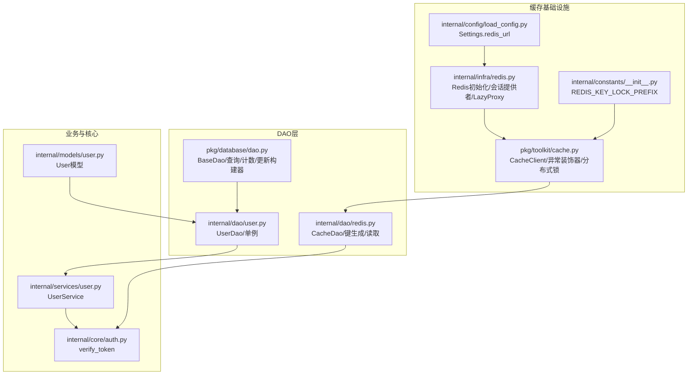
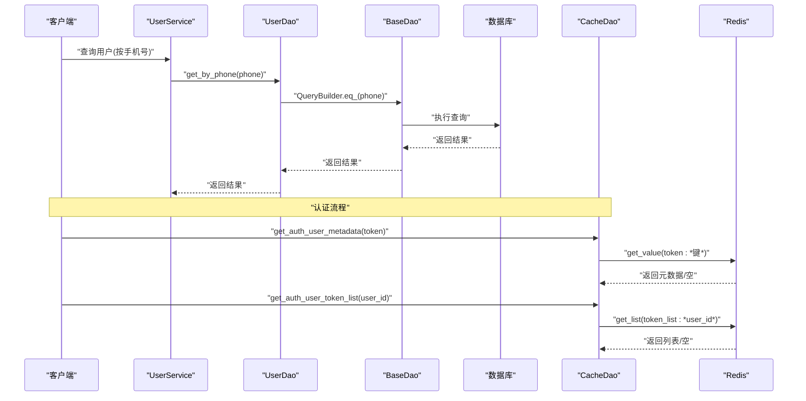
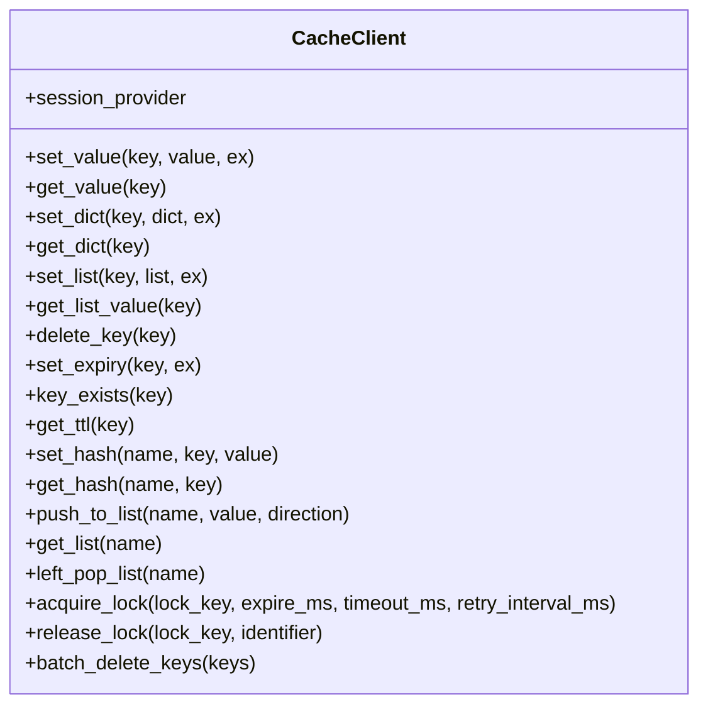
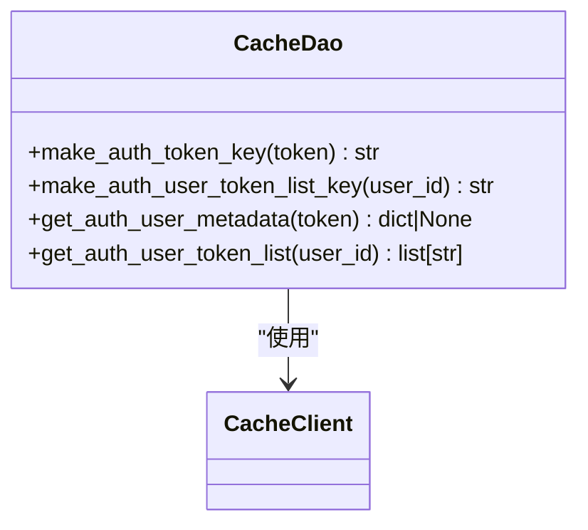
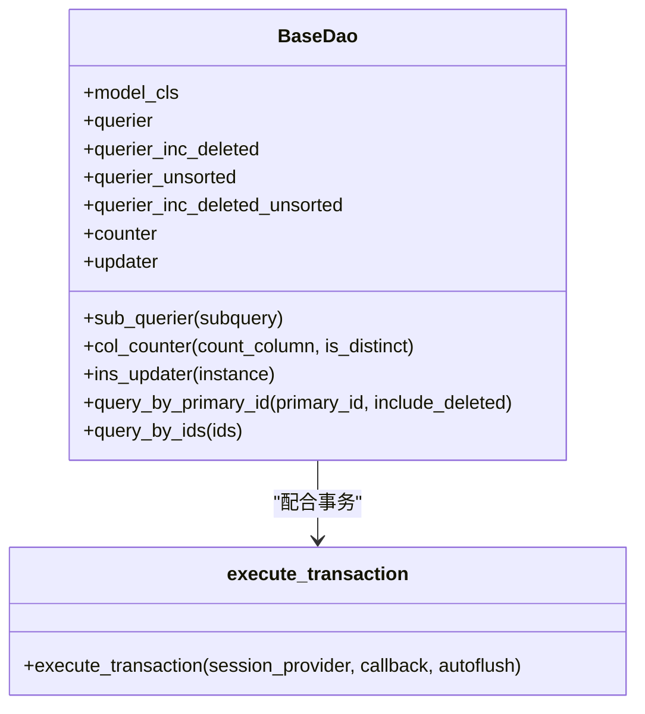
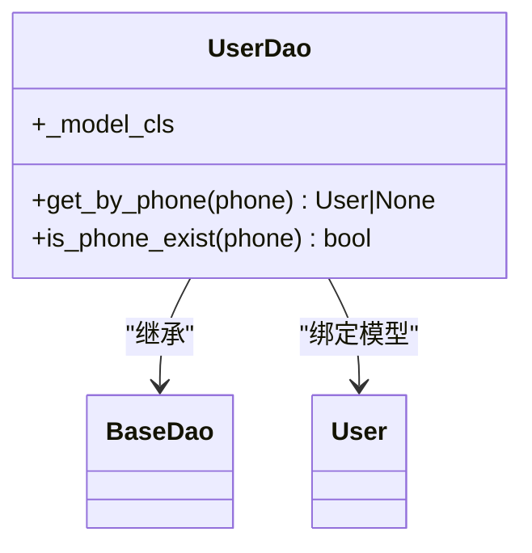
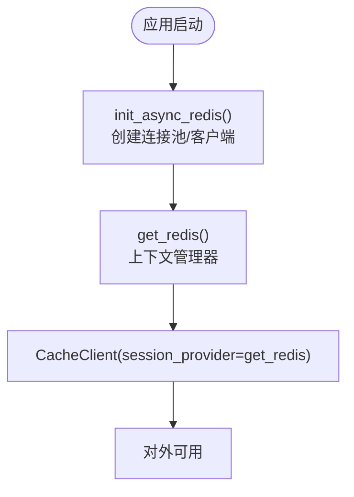
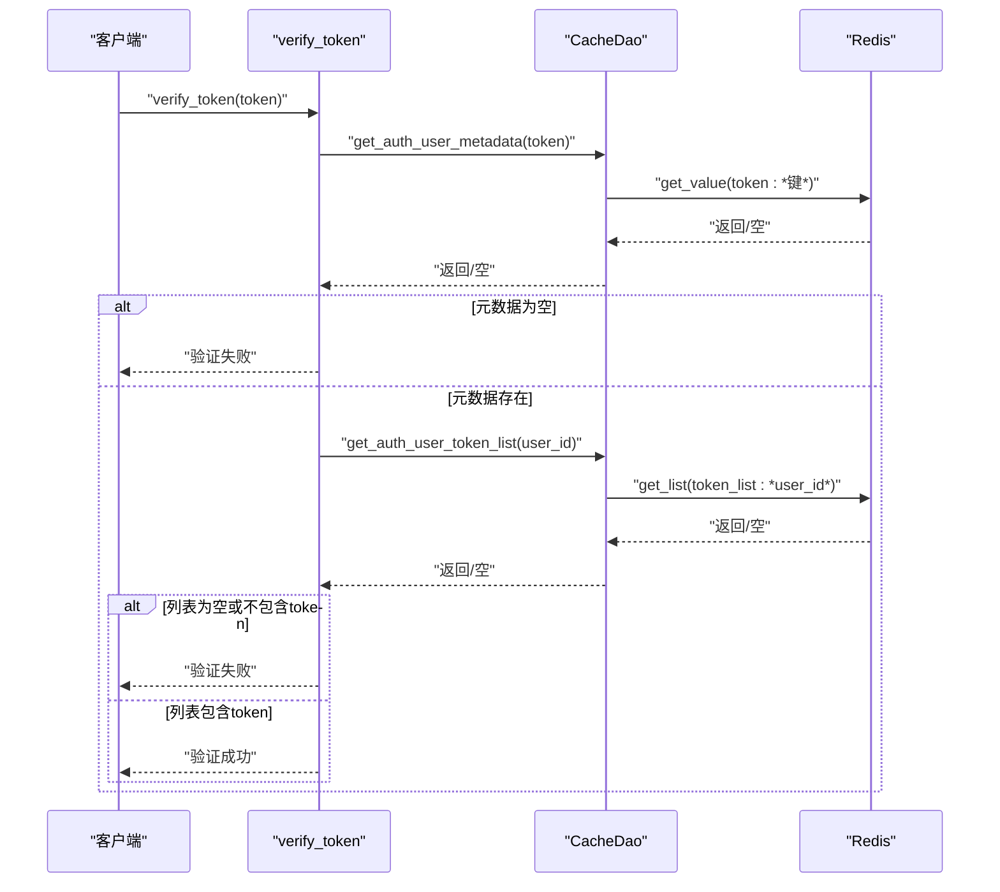
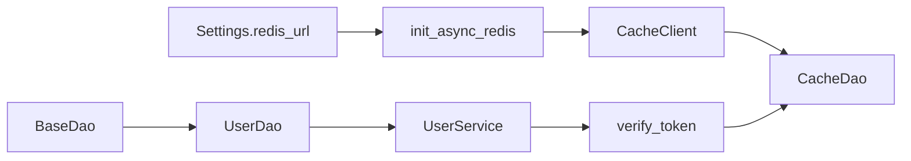

# DAO层缓存

<cite>
**本文引用的文件**
- [internal/dao/user.py](file://internal/dao/user.py)
- [pkg/database/dao.py](file://pkg/database/dao.py)
- [internal/dao/redis.py](file://internal/dao/redis.py)
- [internal/core/auth.py](file://internal/core/auth.py)
- [internal/infra/redis.py](file://internal/infra/redis.py)
- [pkg/toolkit/cache.py](file://pkg/toolkit/cache.py)
- [internal/constants/__init__.py](file://internal/constants/__init__.py)
- [internal/config/load_config.py](file://internal/config/load_config.py)
- [internal/models/user.py](file://internal/models/user.py)
- [internal/services/user.py](file://internal/services/user.py)
</cite>

## 目录
1. [引言](#引言)
2. [项目结构](#项目结构)
3. [核心组件](#核心组件)
4. [架构总览](#架构总览)
5. [组件详解](#组件详解)
6. [依赖关系分析](#依赖关系分析)
7. [性能考量](#性能考量)
8. [故障排查指南](#故障排查指南)
9. [结论](#结论)
10. [附录](#附录)

## 引言
本文件聚焦于数据访问层（DAO）中的缓存实现与策略，结合现有代码，系统阐述缓存键命名规范、缓存层级设计、读写与更新的同步策略、缓存失效与一致性保障、缓存穿透防护、与数据库事务的协调以及缓存回退机制，并提供性能优化与热点处理建议，以及调试与监控方法。

## 项目结构
围绕DAO层缓存的关键模块与职责如下：
- 缓存基础设施：Redis连接池、会话提供者、缓存客户端封装
- DAO层：基础DAO抽象、用户DAO、缓存DAO
- 业务与核心：认证流程中对缓存的使用
- 配置与常量：Redis连接串、锁前缀等

图表来源
- [internal/infra/redis.py](file://internal/infra/redis.py#L18-L97)
- [pkg/toolkit/cache.py](file://pkg/toolkit/cache.py#L41-L249)
- [internal/config/load_config.py](file://internal/config/load_config.py#L162-L173)
- [internal/constants/__init__.py](file://internal/constants/__init__.py#L1-L1)
- [pkg/database/dao.py](file://pkg/database/dao.py#L15-L203)
- [internal/dao/user.py](file://internal/dao/user.py#L6-L24)
- [internal/dao/redis.py](file://internal/dao/redis.py#L6-L36)
- [internal/core/auth.py](file://internal/core/auth.py#L4-L18)
- [internal/services/user.py](file://internal/services/user.py#L5-L21)
- [internal/models/user.py](file://internal/models/user.py#L7-L13)

章节来源
- [internal/infra/redis.py](file://internal/infra/redis.py#L18-L97)
- [pkg/toolkit/cache.py](file://pkg/toolkit/cache.py#L41-L249)
- [internal/config/load_config.py](file://internal/config/load_config.py#L162-L173)
- [internal/constants/__init__.py](file://internal/constants/__init__.py#L1-L1)
- [pkg/database/dao.py](file://pkg/database/dao.py#L15-L203)
- [internal/dao/user.py](file://internal/dao/user.py#L6-L24)
- [internal/dao/redis.py](file://internal/dao/redis.py#L6-L36)
- [internal/core/auth.py](file://internal/core/auth.py#L4-L18)
- [internal/services/user.py](file://internal/services/user.py#L5-L21)
- [internal/models/user.py](file://internal/models/user.py#L7-L13)

## 核心组件
- 缓存客户端封装：提供键值、字典、列表、哈希、TTL、过期、分布式锁等能力，并统一异常处理
- 缓存DAO：面向认证场景的键命名与读取，提供令牌元数据与令牌列表的缓存访问
- 基础DAO：提供查询、计数、更新构建器与事务执行器，支撑DAO层的读写一致性
- 用户DAO：基于基础DAO，提供按手机号查询与存在性检查
- Redis基础设施：连接池、会话提供者、懒加载代理，保证初始化时机与线程安全
- 认证服务：在认证流程中使用缓存DAO进行令牌校验

章节来源
- [pkg/toolkit/cache.py](file://pkg/toolkit/cache.py#L41-L249)
- [internal/dao/redis.py](file://internal/dao/redis.py#L6-L36)
- [pkg/database/dao.py](file://pkg/database/dao.py#L15-L203)
- [internal/dao/user.py](file://internal/dao/user.py#L6-L24)
- [internal/infra/redis.py](file://internal/infra/redis.py#L18-L97)
- [internal/core/auth.py](file://internal/core/auth.py#L4-L18)

## 架构总览
下图展示DAO层缓存的整体交互：业务层通过服务调用DAO，DAO通过基础DAO构建查询/更新，缓存通过缓存客户端与Redis交互；认证流程直接使用缓存DAO读取令牌元数据与令牌列表。

图表来源
- [internal/services/user.py](file://internal/services/user.py#L13-L15)
- [internal/dao/user.py](file://internal/dao/user.py#L9-L17)
- [pkg/database/dao.py](file://pkg/database/dao.py#L47-L100)
- [internal/dao/redis.py](file://internal/dao/redis.py#L19-L33)
- [pkg/toolkit/cache.py](file://pkg/toolkit/cache.py#L54-L64)

## 组件详解

### 缓存客户端（CacheClient）
- 能力范围：键值、字典、列表、哈希、TTL、过期、存在性、批量删除、分布式锁（获取/释放）
- 异常处理：统一装饰器包装，将底层异常转为可识别的缓存异常
- 分布式锁：基于SET NX PX的获取与Lua脚本释放，支持超时与重试间隔控制
- 会话提供者：通过上下文管理器提供稳定Redis会话，避免导入时未初始化问题

图表来源
- [pkg/toolkit/cache.py](file://pkg/toolkit/cache.py#L41-L249)

章节来源
- [pkg/toolkit/cache.py](file://pkg/toolkit/cache.py#L41-L249)

### 缓存DAO（CacheDao）
- 用途：认证场景下的令牌元数据与令牌列表缓存访问
- 键命名：令牌键与令牌列表键，便于快速定位与批量失效
- 读取策略：若缓存缺失，返回空值，交由上层决定是否回源或降级

图表来源
- [internal/dao/redis.py](file://internal/dao/redis.py#L6-L36)
- [pkg/toolkit/cache.py](file://pkg/toolkit/cache.py#L54-L64)

章节来源
- [internal/dao/redis.py](file://internal/dao/redis.py#L6-L36)

### 基础DAO（BaseDao）
- 查询构建器：提供排序、过滤、IN、分页等常用查询组合
- 计数构建器：支持普通计数与去重计数
- 更新构建器：支持按条件批量更新，支持在事务中执行
- 事务执行器：统一事务开启、提交、回滚，支持复杂业务逻辑

图表来源
- [pkg/database/dao.py](file://pkg/database/dao.py#L15-L203)

章节来源
- [pkg/database/dao.py](file://pkg/database/dao.py#L15-L203)

### 用户DAO（UserDao）
- 继承基础DAO，绑定User模型
- 提供按手机号查询与存在性检查
- 单例实例，便于全局复用

图表来源
- [internal/dao/user.py](file://internal/dao/user.py#L6-L24)
- [pkg/database/dao.py](file://pkg/database/dao.py#L15-L203)
- [internal/models/user.py](file://internal/models/user.py#L7-L13)

章节来源
- [internal/dao/user.py](file://internal/dao/user.py#L6-L24)
- [internal/models/user.py](file://internal/models/user.py#L7-L13)

### Redis基础设施
- 初始化：创建连接池与Redis客户端，封装为缓存客户端
- 会话提供者：上下文管理器提供稳定Redis会话
- 懒加载代理：避免模块导入时缓存未初始化导致的None问题
- 配置来源：从Settings动态拼装Redis URL

图表来源
- [internal/infra/redis.py](file://internal/infra/redis.py#L18-L97)
- [internal/config/load_config.py](file://internal/config/load_config.py#L162-L173)

章节来源
- [internal/infra/redis.py](file://internal/infra/redis.py#L18-L97)
- [internal/config/load_config.py](file://internal/config/load_config.py#L162-L173)

### 认证流程中的缓存使用
- 令牌元数据：从缓存读取用户元数据，缺失则判定为验证失败
- 令牌列表：按用户ID读取令牌列表，确认令牌是否仍在有效集合内
- 流程：先取元数据，再取列表，两者任一缺失即失败

图表来源
- [internal/core/auth.py](file://internal/core/auth.py#L4-L18)
- [internal/dao/redis.py](file://internal/dao/redis.py#L19-L33)
- [pkg/toolkit/cache.py](file://pkg/toolkit/cache.py#L54-L64)

章节来源
- [internal/core/auth.py](file://internal/core/auth.py#L4-L18)
- [internal/dao/redis.py](file://internal/dao/redis.py#L19-L33)

## 依赖关系分析
- 缓存客户端依赖Redis会话提供者，通过上下文管理器确保生命周期可控
- 缓存DAO依赖全局缓存客户端，采用懒加载代理避免导入时未初始化
- 用户DAO依赖基础DAO，提供具体模型的查询能力
- 认证流程依赖缓存DAO，形成“缓存命中优先”的读路径

图表来源
- [internal/config/load_config.py](file://internal/config/load_config.py#L162-L173)
- [internal/infra/redis.py](file://internal/infra/redis.py#L18-L97)
- [pkg/toolkit/cache.py](file://pkg/toolkit/cache.py#L41-L249)
- [internal/dao/redis.py](file://internal/dao/redis.py#L6-L36)
- [pkg/database/dao.py](file://pkg/database/dao.py#L15-L203)
- [internal/dao/user.py](file://internal/dao/user.py#L6-L24)
- [internal/services/user.py](file://internal/services/user.py#L5-L21)
- [internal/core/auth.py](file://internal/core/auth.py#L4-L18)

章节来源
- [internal/config/load_config.py](file://internal/config/load_config.py#L162-L173)
- [internal/infra/redis.py](file://internal/infra/redis.py#L18-L97)
- [pkg/toolkit/cache.py](file://pkg/toolkit/cache.py#L41-L249)
- [internal/dao/redis.py](file://internal/dao/redis.py#L6-L36)
- [pkg/database/dao.py](file://pkg/database/dao.py#L15-L203)
- [internal/dao/user.py](file://internal/dao/user.py#L6-L24)
- [internal/services/user.py](file://internal/services/user.py#L5-L21)
- [internal/core/auth.py](file://internal/core/auth.py#L4-L18)

## 性能考量
- 连接池与会话管理：通过连接池与上下文管理器减少连接开销，避免阻塞
- 序列化选择：统一使用高性能JSON序列化，降低编解码成本
- TTL与过期：对热点键设置合理TTL，避免长期占用内存；对冷数据及时清理
- 批量操作：利用列表与哈希结构存储聚合数据，减少键数量
- 分布式锁：在高并发写入时保护缓存与DB的一致性，避免缓存击穿
- 读写分离：读路径优先走缓存，写路径同步更新缓存与DB，必要时延迟双删

[本节为通用性能建议，不直接分析具体文件]

## 故障排查指南
- 缓存异常：统一异常装饰器将底层错误包装为可识别的缓存异常，便于定位
- 会话未初始化：Redis未初始化时会抛出运行时错误，需确保在应用生命周期中先初始化
- 键不存在：读取返回空值属正常行为，需在上层区分“未命中”与“无数据”
- 分布式锁：获取/释放失败时检查锁键、标识符与过期时间，避免误删

章节来源
- [pkg/toolkit/cache.py](file://pkg/toolkit/cache.py#L23-L38)
- [internal/infra/redis.py](file://internal/infra/redis.py#L75-L84)

## 结论
本项目在DAO层实现了清晰的缓存基础设施与认证场景的缓存DAO，结合基础DAO提供的查询/更新/事务能力，形成了“缓存优先、回源兜底”的数据访问模式。通过统一的异常处理、分布式锁与懒加载代理，提升了系统的稳定性与可维护性。后续可在热点键治理、缓存预热、延迟双删与更细粒度的失效策略方面进一步优化。

[本节为总结性内容，不直接分析具体文件]

## 附录

### 缓存键命名规范
- 令牌元数据键：基于令牌生成唯一键，便于快速定位与失效
- 令牌列表键：基于用户ID生成列表键，便于批量清理与校验
- 锁键前缀：统一使用锁前缀，避免与其他键冲突

章节来源
- [internal/dao/redis.py](file://internal/dao/redis.py#L12-L17)
- [internal/constants/__init__.py](file://internal/constants/__init__.py#L1-L1)

### 缓存穿透防护机制
- 短路返回：缓存未命中时，直接回源数据库，避免缓存穿透
- 空值缓存：对不存在的数据设置短暂TTL，降低热点击穿风险
- 校验前置：认证流程中先取元数据，再取列表，任一缺失即失败，减少无效请求

章节来源
- [internal/core/auth.py](file://internal/core/auth.py#L4-L18)
- [internal/dao/redis.py](file://internal/dao/redis.py#L19-L33)

### 数据读取、写入与更新的缓存同步策略
- 读取：优先从缓存读取，未命中再回源数据库
- 写入/更新：先更新数据库，再更新或删除缓存；对列表类数据可采用追加/替换策略
- 删除：按用户维度批量删除令牌列表，同时删除元数据键

章节来源
- [pkg/database/dao.py](file://pkg/database/dao.py#L106-L203)
- [internal/dao/redis.py](file://internal/dao/redis.py#L19-L33)

### 缓存失效与更新机制
- TTL控制：对短期有效的令牌设置TTL，到期自动失效
- 主动失效：在用户登出/变更时主动删除相关键
- 批量失效：通过列表键批量清理同一用户的令牌集合

章节来源
- [pkg/toolkit/cache.py](file://pkg/toolkit/cache.py#L107-L122)
- [pkg/toolkit/cache.py](file://pkg/toolkit/cache.py#L243-L249)

### 缓存层级设计
- L1：进程内缓存（如应用内内存缓存，可选）
- L2：Redis缓存（本项目实现）
- L3：数据库（最终一致性的数据源）

[本节为概念性描述，不直接分析具体文件]

### 缓存热点处理方案
- 热点键拆分：将单一键拆分为多个子键，分散压力
- 多副本与分片：对列表类数据采用分片存储
- 本地缓存与LRU：对热点数据增加本地缓存与淘汰策略

[本节为通用建议，不直接分析具体文件]

### 与数据库事务的协调与缓存回退机制
- 事务执行器：在事务中执行复杂逻辑，保证DB一致性
- 写后缓存：在事务提交后更新缓存，失败时回滚缓存
- 回退策略：缓存操作失败时记录日志并降级，保证业务可用

章节来源
- [pkg/database/dao.py](file://pkg/database/dao.py#L106-L203)
- [pkg/toolkit/cache.py](file://pkg/toolkit/cache.py#L23-L38)

### 缓存调试与监控方法
- 异常日志：统一异常包装，便于定位缓存操作失败原因
- TTL与存在性：通过TTL与存在性接口监控键状态
- 分布式锁：记录锁获取/释放过程，排查并发问题

章节来源
- [pkg/toolkit/cache.py](file://pkg/toolkit/cache.py#L17-L38)
- [pkg/toolkit/cache.py](file://pkg/toolkit/cache.py#L119-L122)
- [pkg/toolkit/cache.py](file://pkg/toolkit/cache.py#L205-L241)