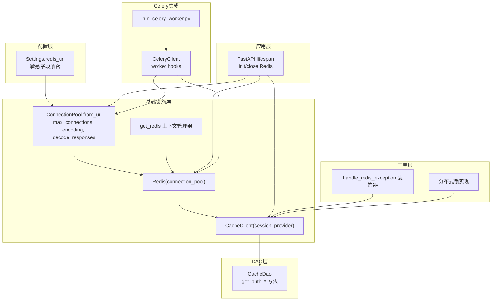
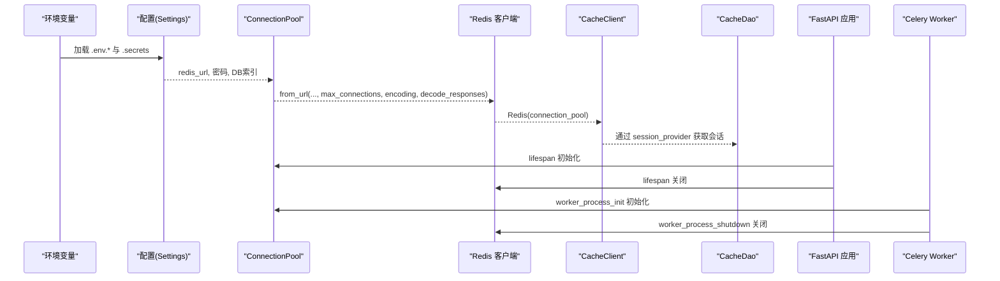
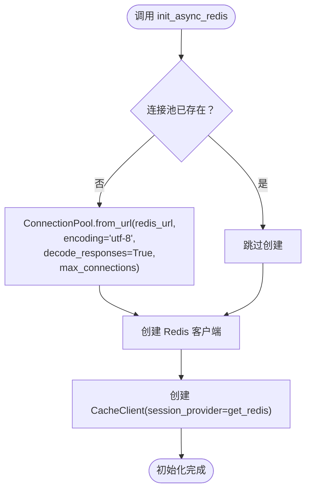
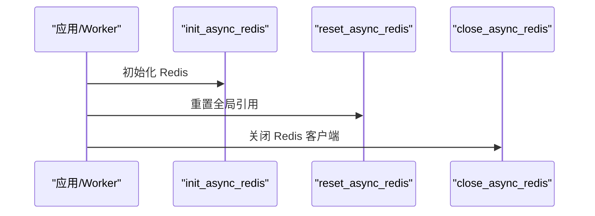
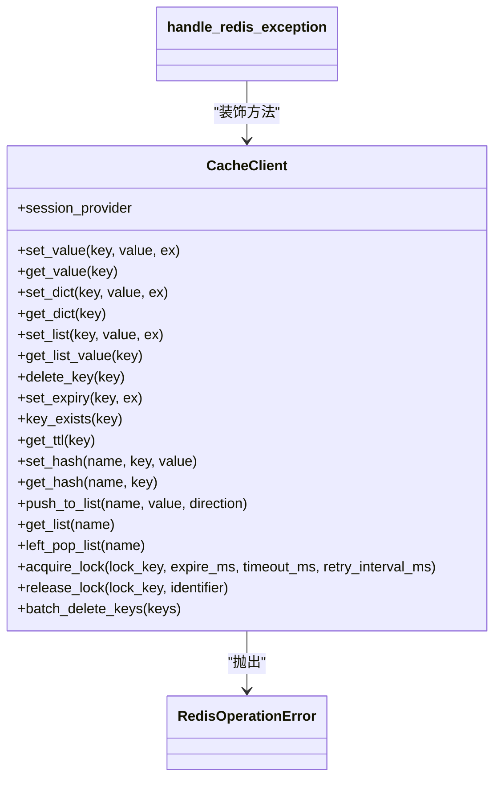
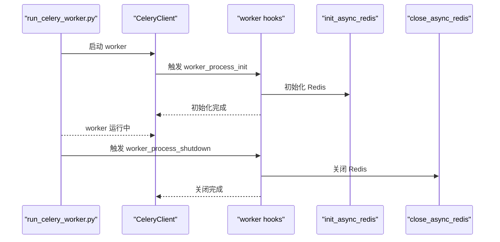
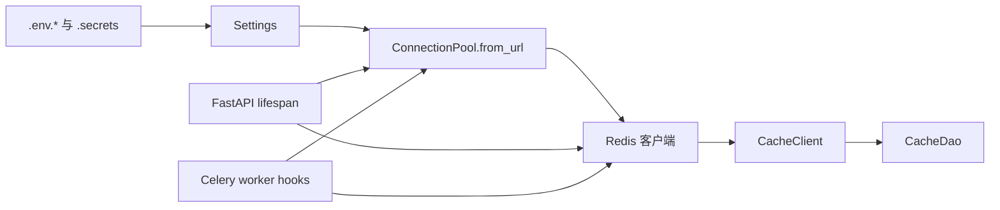

# Redis集成

<cite>
**本文档引用的文件**
- [internal/infra/redis.py](file://internal/infra/redis.py)
- [pkg/toolkit/cache.py](file://pkg/toolkit/cache.py)
- [internal/dao/redis.py](file://internal/dao/redis.py)
- [internal/app.py](file://internal/app.py)
- [internal/config/load_config.py](file://internal/config/load_config.py)
- [internal/infra/celery/__init__.py](file://internal/infra/celery/__init__.py)
- [pkg/toolkit/celery.py](file://pkg/toolkit/celery.py)
- [scripts/run_celery_worker.py](file://scripts/run_celery_worker.py)
- [configs/.env.dev](file://configs/.env.dev)
- [configs/.env.local](file://configs/.env.local)
- [configs/.env.prod](file://configs/.env.prod)
</cite>

## 目录
1. [简介](#简介)
2. [项目结构](#项目结构)
3. [核心组件](#核心组件)
4. [架构总览](#架构总览)
5. [组件详细分析](#组件详细分析)
6. [依赖关系分析](#依赖关系分析)
7. [性能考量](#性能考量)
8. [故障排查指南](#故障排查指南)
9. [结论](#结论)
10. [附录](#附录)

## 简介
本文件系统性阐述本项目的Redis集成方案，涵盖连接池初始化与配置、异步客户端创建流程、连接生命周期管理（初始化、重置、关闭）、URL与编码设置、最大连接数限制、异常处理与恢复策略、以及与FastAPI应用生命周期的集成方式和在Celery worker中的使用方法。文档同时提供可视化图示帮助理解整体数据流与控制流。

## 项目结构
Redis相关能力由以下模块协同实现：
- 配置层：负责从环境变量构建Redis URL与密码等敏感配置
- 基础设施层：负责连接池与客户端的创建、上下文管理、生命周期管理
- 工具层：提供统一的缓存客户端封装与异常装饰器
- DAO层：面向业务的数据访问对象，通过缓存客户端进行读写
- 应用层：在FastAPI生命周期中初始化与关闭Redis
- Celery集成：在worker进程启动/关闭时初始化与释放Redis资源

图表来源
- [internal/config/load_config.py](file://internal/config/load_config.py#L161-L173)
- [internal/infra/redis.py](file://internal/infra/redis.py#L29-L43)
- [pkg/toolkit/cache.py](file://pkg/toolkit/cache.py#L23-L38)
- [internal/dao/redis.py](file://internal/dao/redis.py#L19-L33)
- [internal/app.py](file://internal/app.py#L84-L109)
- [internal/infra/celery/__init__.py](file://internal/infra/celery/__init__.py#L54-L88)
- [scripts/run_celery_worker.py](file://scripts/run_celery_worker.py#L6-L34)

章节来源
- [internal/infra/redis.py](file://internal/infra/redis.py#L1-L98)
- [pkg/toolkit/cache.py](file://pkg/toolkit/cache.py#L1-L249)
- [internal/dao/redis.py](file://internal/dao/redis.py#L1-L37)
- [internal/app.py](file://internal/app.py#L1-L109)
- [internal/config/load_config.py](file://internal/config/load_config.py#L1-L243)
- [internal/infra/celery/__init__.py](file://internal/infra/celery/__init__.py#L54-L108)
- [pkg/toolkit/celery.py](file://pkg/toolkit/celery.py#L15-L198)
- [scripts/run_celery_worker.py](file://scripts/run_celery_worker.py#L1-L38)

## 核心组件
- 连接池与客户端
  - 通过配置层提供的Redis URL创建连接池，并设置编码、解码响应、最大连接数等参数
  - 基于连接池创建异步Redis客户端实例
- 缓存客户端封装
  - 以“会话提供器”模式注入Redis客户端，统一对外提供键值、哈希、列表、分布式锁等操作
  - 使用装饰器统一捕获并包装Redis操作异常
- DAO层
  - 通过缓存客户端进行认证令牌与用户令牌列表的读取
- 应用生命周期集成
  - 在FastAPI lifespan中初始化Redis并在关闭时释放
- Celery worker集成
  - 在worker进程启动/关闭钩子中初始化/关闭Redis；支持在任务执行前后进行资源管理

章节来源
- [internal/infra/redis.py](file://internal/infra/redis.py#L18-L45)
- [pkg/toolkit/cache.py](file://pkg/toolkit/cache.py#L41-L249)
- [internal/dao/redis.py](file://internal/dao/redis.py#L6-L37)
- [internal/app.py](file://internal/app.py#L84-L109)
- [internal/infra/celery/__init__.py](file://internal/infra/celery/__init__.py#L54-L88)

## 架构总览
下图展示Redis在系统中的关键交互路径：配置生成URL → 连接池创建 → 客户端实例化 → 缓存客户端封装 → DAO使用 → 应用/任务生命周期管理。

图表来源
- [internal/config/load_config.py](file://internal/config/load_config.py#L161-L173)
- [internal/infra/redis.py](file://internal/infra/redis.py#L29-L43)
- [internal/app.py](file://internal/app.py#L84-L109)
- [internal/infra/celery/__init__.py](file://internal/infra/celery/__init__.py#L54-L88)

## 组件详细分析

### 连接池与客户端初始化
- 初始化入口
  - FastAPI应用生命周期：在lifespan中调用初始化函数
  - Celery worker：在worker进程启动钩子中调用初始化函数
- 连接池参数
  - 从配置生成的URL传入连接池
  - 编码设置为UTF-8，解码响应开启
  - 最大连接数可通过配置项设置，默认值为20
- 客户端与缓存封装
  - 基于连接池创建Redis客户端
  - 以“会话提供器”注入到缓存客户端，统一管理Redis会话

图表来源
- [internal/infra/redis.py](file://internal/infra/redis.py#L18-L45)

章节来源
- [internal/infra/redis.py](file://internal/infra/redis.py#L18-L45)
- [internal/app.py](file://internal/app.py#L84-L109)
- [internal/infra/celery/__init__.py](file://internal/infra/celery/__init__.py#L54-L68)

### 连接生命周期管理
- 初始化
  - 在应用启动与worker进程启动时分别调用初始化函数
- 重置
  - 提供重置函数，清空全局引用，便于在worker内部切换事件循环或重新初始化
- 关闭
  - 在应用关闭与worker进程关闭时异步关闭Redis客户端，确保连接安全释放

图表来源
- [internal/infra/redis.py](file://internal/infra/redis.py#L48-L68)
- [internal/app.py](file://internal/app.py#L84-L109)
- [internal/infra/celery/__init__.py](file://internal/infra/celery/__init__.py#L71-L88)

章节来源
- [internal/infra/redis.py](file://internal/infra/redis.py#L48-L68)
- [internal/app.py](file://internal/app.py#L84-L109)
- [internal/infra/celery/__init__.py](file://internal/infra/celery/__init__.py#L71-L88)

### Redis URL、编码与最大连接数
- URL生成
  - 由配置类根据主机、端口、密码、DB索引动态拼装
  - 密码字段支持解密（ENC(...)格式），解密失败将抛出异常
- 编码设置
  - 连接池设置为UTF-8编码，解码响应开启，保证字符串一致性
- 最大连接数
  - 通过配置项设置，未设置时采用默认值20

章节来源
- [internal/config/load_config.py](file://internal/config/load_config.py#L161-L173)
- [internal/config/load_config.py](file://internal/config/load_config.py#L97-L116)
- [internal/infra/redis.py](file://internal/infra/redis.py#L29-L34)

### 缓存客户端与异常处理
- 会话提供器
  - 通过上下文管理器提供稳定的Redis会话引用
- 操作方法
  - 键值、字典、列表、哈希、TTL、过期、存在性、批量删除等
  - 自动JSON序列化/反序列化，统一异常包装
- 分布式锁
  - 原生SET NX PX实现，带超时与重试间隔配置
  - Lua脚本释放锁，仅允许持有者释放
- 异常处理
  - 装饰器统一捕获Redis操作异常，包装为领域异常类型，保留原始错误信息

图表来源
- [pkg/toolkit/cache.py](file://pkg/toolkit/cache.py#L41-L249)

章节来源
- [pkg/toolkit/cache.py](file://pkg/toolkit/cache.py#L17-L38)
- [pkg/toolkit/cache.py](file://pkg/toolkit/cache.py#L41-L249)

### DAO层使用示例
- 认证令牌键构造与用户令牌列表键构造
- 通过缓存客户端读取令牌元数据与令牌列表
- 读取失败时记录告警并返回空结果

章节来源
- [internal/dao/redis.py](file://internal/dao/redis.py#L6-L37)

### FastAPI应用生命周期集成
- 应用启动
  - 初始化日志、数据库、Redis、签名认证、雪花ID生成器、AnyIO任务管理器
- 应用关闭
  - 逆序关闭数据库、Redis、AnyIO任务管理器

章节来源
- [internal/app.py](file://internal/app.py#L84-L109)

### Celery worker中的使用
- worker进程启动钩子
  - 初始化日志、数据库、Redis
- worker进程关闭钩子
  - 并发关闭Redis与数据库，提升关闭效率
- Celery客户端
  - 以Redis作为消息代理与结果后端
  - 注册worker生命周期钩子
- worker启动脚本
  - 提供worker主程序入口与常用参数

图表来源
- [scripts/run_celery_worker.py](file://scripts/run_celery_worker.py#L6-L34)
- [internal/infra/celery/__init__.py](file://internal/infra/celery/__init__.py#L54-L88)
- [pkg/toolkit/celery.py](file://pkg/toolkit/celery.py#L159-L198)

章节来源
- [internal/infra/celery/__init__.py](file://internal/infra/celery/__init__.py#L54-L108)
- [pkg/toolkit/celery.py](file://pkg/toolkit/celery.py#L15-L198)
- [scripts/run_celery_worker.py](file://scripts/run_celery_worker.py#L1-L38)

## 依赖关系分析
- 配置层依赖dotenv与Pydantic Settings，负责从环境文件与密钥文件加载并校验配置
- 基础设施层依赖redis.asyncio，负责连接池与客户端创建
- 工具层依赖redis.asyncio与JSON编解码工具，提供统一异常与分布式锁
- DAO层依赖缓存客户端，实现业务读写
- 应用层与Celery层分别在生命周期钩子中调用基础设施层初始化/关闭

图表来源
- [internal/config/load_config.py](file://internal/config/load_config.py#L161-L173)
- [internal/infra/redis.py](file://internal/infra/redis.py#L29-L43)
- [internal/app.py](file://internal/app.py#L84-L109)
- [internal/infra/celery/__init__.py](file://internal/infra/celery/__init__.py#L54-L88)

章节来源
- [internal/config/load_config.py](file://internal/config/load_config.py#L1-L243)
- [internal/infra/redis.py](file://internal/infra/redis.py#L1-L98)
- [internal/app.py](file://internal/app.py#L1-L109)
- [internal/infra/celery/__init__.py](file://internal/infra/celery/__init__.py#L1-L198)

## 性能考量
- 连接池复用
  - 通过连接池减少TCP握手与认证开销，提升并发性能
- 最大连接数
  - 根据工作负载调整最大连接数，避免过度占用系统资源
- 编码与解码
  - UTF-8编码与解码响应开启，减少额外转换成本
- 并发关闭
  - 在worker关闭阶段并发关闭数据库与Redis，缩短停机时间

章节来源
- [internal/infra/redis.py](file://internal/infra/redis.py#L29-L34)
- [internal/infra/celery/__init__.py](file://internal/infra/celery/__init__.py#L83-L87)

## 故障排查指南
- 初始化失败
  - 检查Redis URL生成是否正确（主机、端口、密码、DB索引）
  - 确认敏感字段解密是否成功
- 连接异常
  - 查看连接池参数是否合理（最大连接数、编码、解码响应）
  - 检查网络连通性与防火墙策略
- 操作异常
  - 使用装饰器包装的异常类型定位具体方法与参数
  - 检查JSON序列化/反序列化是否正确
- 分布式锁问题
  - 确认锁键命名规范与标识符一致性
  - 检查超时与重试间隔配置是否合理
- 生命周期问题
  - 确保在应用关闭与worker关闭时调用关闭函数
  - 避免在关闭后继续使用已释放的客户端

章节来源
- [internal/config/load_config.py](file://internal/config/load_config.py#L97-L116)
- [pkg/toolkit/cache.py](file://pkg/toolkit/cache.py#L17-L38)
- [internal/infra/redis.py](file://internal/infra/redis.py#L48-L68)

## 结论
本项目通过清晰的分层设计实现了Redis的稳定集成：配置层统一生成URL，基础设施层负责连接池与客户端管理，工具层提供统一的缓存封装与异常处理，DAO层聚焦业务读写，应用与Celery层在生命周期中完成资源的初始化与释放。该方案具备良好的可维护性与扩展性，适合在生产环境中部署与演进。

## 附录
- 环境配置示例
  - 开发/本地/生产环境的Redis配置示例文件
- 启动与运行
  - FastAPI应用启动与Celery worker启动脚本说明

章节来源
- [configs/.env.dev](file://configs/.env.dev#L14-L17)
- [configs/.env.local](file://configs/.env.local#L14-L17)
- [configs/.env.prod](file://configs/.env.prod#L14-L17)
- [scripts/run_celery_worker.py](file://scripts/run_celery_worker.py#L6-L34)