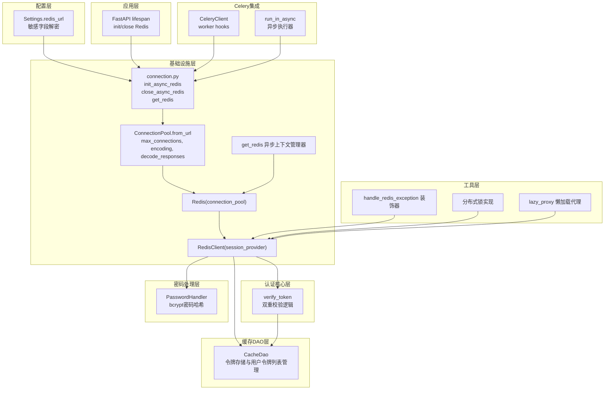
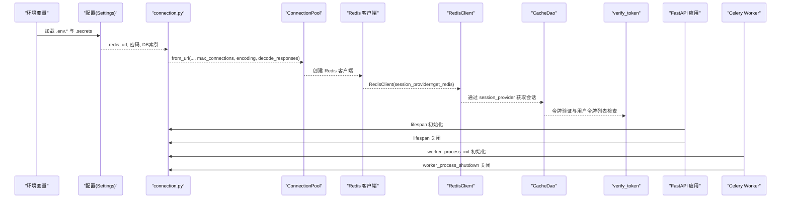
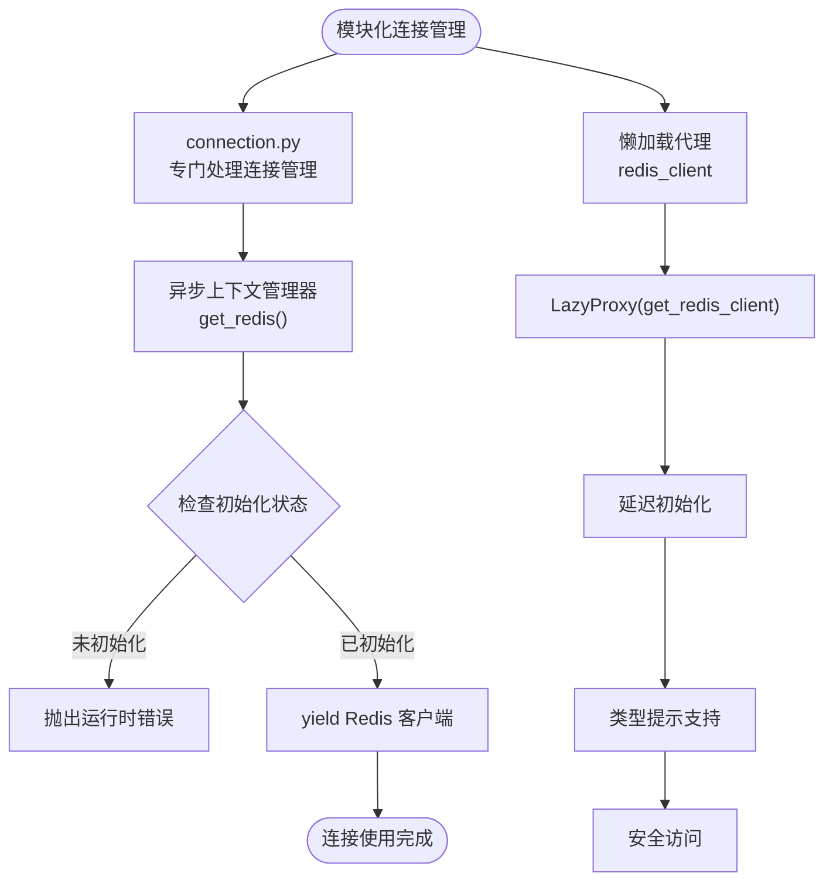
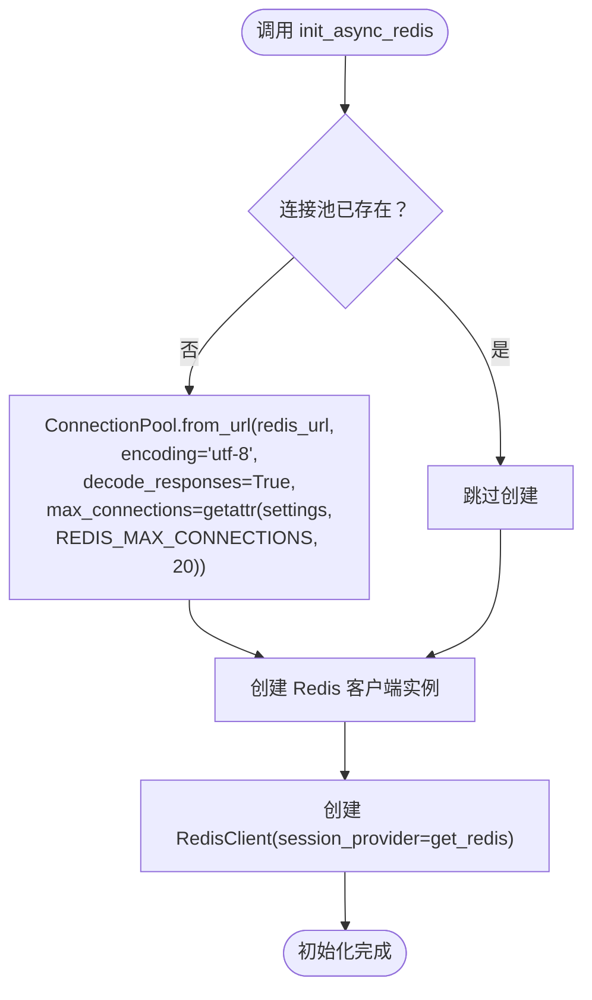
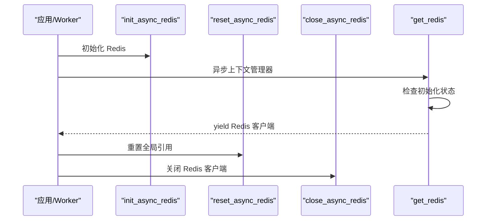
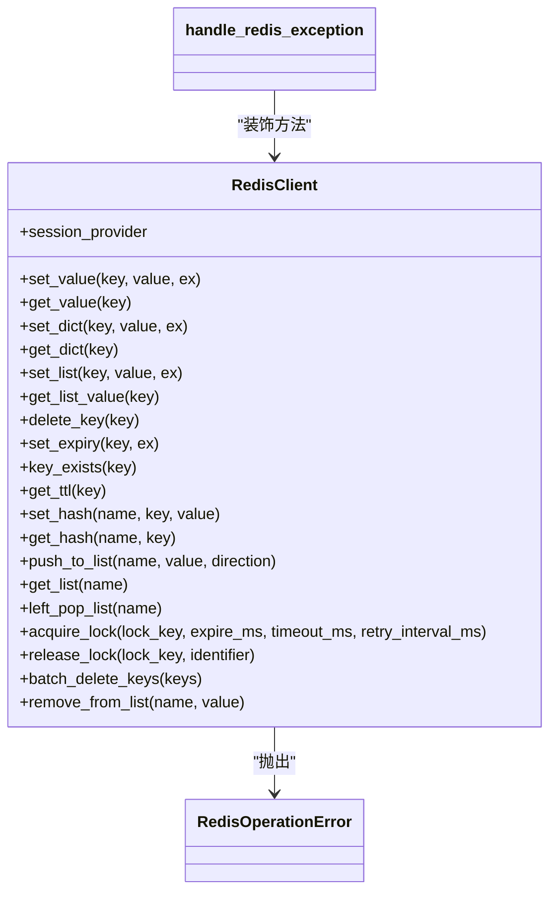
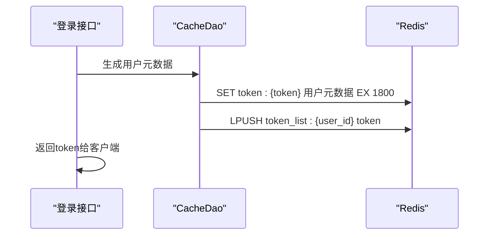
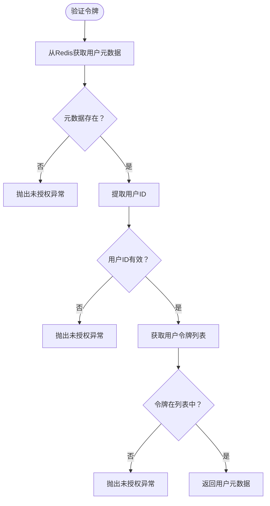
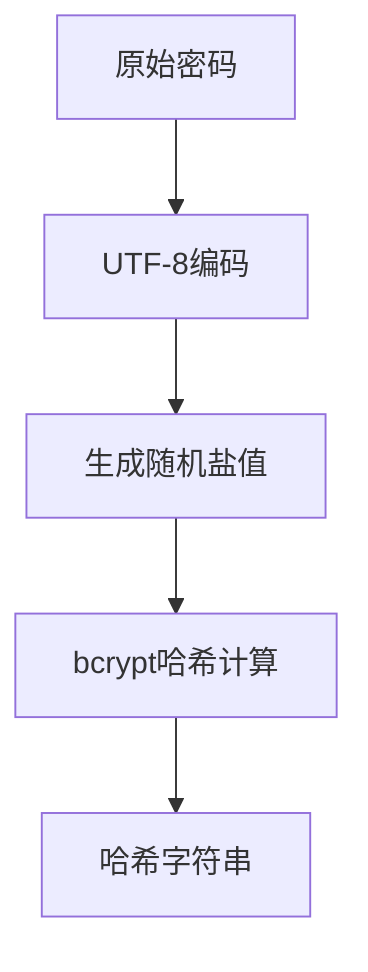
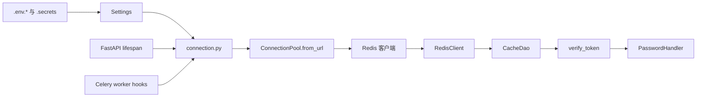

# Redis集成

<cite>
**本文档引用的文件**
- [internal/infra/redis/connection.py](file://internal/infra/redis/connection.py)
- [internal/infra/redis/__init__.py](file://internal/infra/redis/__init__.py)
- [pkg/toolkit/redis_client.py](file://pkg/toolkit/redis_client.py)
- [internal/dao/cache.py](file://internal/dao/cache.py)
- [internal/app.py](file://internal/app.py)
- [internal/config.py](file://internal/config.py)
- [internal/utils/celery/__init__.py](file://internal/utils/celery/__init__.py)
- [pkg/toolkit/types.py](file://pkg/toolkit/types.py)
</cite>

## 更新摘要
**所做更改**
- 更新Redis连接管理架构：从单一模块迁移至模块化设计
- 新增异步上下文管理器支持，提供更好的连接生命周期管理
- 引入懒加载代理模式，解决模块导入时的初始化问题
- 更新连接池管理机制，支持动态最大连接数配置
- 完善Redis客户端封装，增强异常处理和分布式锁功能

## 目录
1. [简介](#简介)
2. [项目结构](#项目结构)
3. [核心组件](#核心组件)
4. [架构总览](#架构总览)
5. [组件详细分析](#组件详细分析)
6. [Redis认证系统](#redis认证系统)
7. [密码哈希存储](#密码哈希存储)
8. [依赖关系分析](#依赖关系分析)
9. [性能考量](#性能考量)
10. [故障排查指南](#故障排查指南)
11. [结论](#结论)
12. [附录](#附录)

## 简介
本文件系统性阐述本项目的Redis集成方案，涵盖现代化的连接管理架构、异步客户端创建流程、连接生命周期管理（初始化、重置、关闭）、URL与编码设置、最大连接数限制、异常处理与恢复策略、以及与FastAPI应用生命周期的集成方式和在Celery worker中的使用方法。特别强调Redis在用户认证系统中的关键作用，包括令牌存储、用户令牌列表管理、密码哈希存储等增强功能。文档同时提供可视化图示帮助理解整体数据流与控制流。

## 项目结构
Redis相关能力现已重构为模块化架构，由以下模块协同实现：
- 配置层：负责从环境变量构建Redis URL与密码等敏感配置
- 基础设施层：新的connection.py模块负责连接池与客户端的创建、上下文管理、生命周期管理
- 工具层：提供统一的缓存客户端封装与异常装饰器
- 缓存DAO层：专门处理认证相关的Redis数据访问，包括令牌存储与用户令牌列表管理
- 认证核心层：实现令牌验证逻辑，结合Redis进行双重校验
- 密码处理层：提供密码哈希与验证功能
- 应用层：在FastAPI生命周期中初始化与关闭Redis
- Celery集成：在worker进程启动/关闭时初始化与释放Redis资源

```mermaid
graph TB
subgraph "配置层"
CFG["Settings.redis_url<br/>敏感字段解密"]
end
subgraph "基础设施层"
CONN["connection.py<br/>init_async_redis<br/>close_async_redis<br/>get_redis"]
POOL["ConnectionPool.from_url<br/>max_connections, encoding, decode_responses"]
CLIENT["Redis(connection_pool)"]
CTX["get_redis 异步上下文管理器"]
CACHE["RedisClient(session_provider)"]
end
subgraph "工具层"
DEC["handle_redis_exception 装饰器"]
LOCK["分布式锁实现"]
LAZY["lazy_proxy 懒加载代理"]
end
subgraph "缓存DAO层"
CACHE_DAO["CacheDao<br/>令牌存储与用户令牌列表管理"]
end
subgraph "认证核心层"
AUTH_CORE["verify_token<br/>双重校验逻辑"]
end
subgraph "密码处理层"
PWD_HANDLER["PasswordHandler<br/>bcrypt密码哈希"]
end
subgraph "应用层"
LIFE["FastAPI lifespan<br/>init/close Redis"]
end
subgraph "Celery集成"
CEL["CeleryClient<br/>worker hooks"]
RUN["run_in_async<br/>异步执行器"]
end
CFG --> CONN
CONN --> POOL
POOL --> CLIENT
CLIENT --> CACHE
CTX --> CLIENT
CACHE --> CACHE_DAO
CACHE --> AUTH_CORE
CACHE --> PWD_HANDLER
AUTH_CORE --> CACHE_DAO
LIFE --> CONN
CEL --> CONN
RUN --> CONN
DEC --> CACHE
LOCK --> CACHE
LAZY --> CACHE
```

**图表来源**
- [internal/config.py](file://internal/config.py#L223-L234)
- [internal/infra/redis/connection.py](file://internal/infra/redis/connection.py#L32-L58)
- [pkg/toolkit/redis_client.py](file://pkg/toolkit/redis_client.py#L41-L261)
- [internal/dao/cache.py](file://internal/dao/cache.py#L9-L68)
- [internal/app.py](file://internal/app.py#L94-L108)
- [internal/utils/celery/__init__.py](file://internal/utils/celery/__init__.py#L119-L150)
- [pkg/toolkit/types.py](file://pkg/toolkit/types.py#L226-L270)

**章节来源**
- [internal/infra/redis/connection.py](file://internal/infra/redis/connection.py#L1-L92)
- [internal/infra/redis/__init__.py](file://internal/infra/redis/__init__.py#L1-L28)
- [pkg/toolkit/redis_client.py](file://pkg/toolkit/redis_client.py#L1-L261)
- [internal/dao/cache.py](file://internal/dao/cache.py#L1-L68)
- [internal/app.py](file://internal/app.py#L1-L111)
- [internal/config.py](file://internal/config.py#L1-L401)
- [internal/utils/celery/__init__.py](file://internal/utils/celery/__init__.py#L1-L175)
- [pkg/toolkit/types.py](file://pkg/toolkit/types.py#L1-L270)

## 核心组件
- **现代化连接管理**
  - 新的connection.py模块提供集中化的Redis连接管理
  - 支持异步上下文管理器，提供更好的连接生命周期控制
  - 引入懒加载代理模式，解决模块导入时的初始化问题
- **连接池与客户端**
  - 通过配置层提供的Redis URL创建连接池，并设置编码、解码响应、最大连接数等参数
  - 基于连接池创建异步Redis客户端实例
- **缓存客户端封装**
  - 以"会话提供器"模式注入Redis客户端，统一对外提供键值、哈希、列表、分布式锁等操作
  - 使用装饰器统一捕获并包装Redis操作异常
- **缓存DAO层**
  - 专门处理认证相关的Redis数据访问，包括令牌存储、用户令牌列表管理、令牌元数据读取
- **认证核心层**
  - 实现令牌验证逻辑，结合Redis进行双重校验：令牌存在性检查和用户令牌列表验证
- **密码处理层**
  - 提供bcrypt算法的密码哈希与验证功能，确保密码安全存储
- **应用生命周期集成**
  - 在FastAPI lifespan中初始化Redis并在关闭时释放
- **Celery worker集成**
  - 在worker进程启动/关闭钩子中初始化/关闭Redis；支持在任务执行前后进行资源管理

**章节来源**
- [internal/infra/redis/connection.py](file://internal/infra/redis/connection.py#L13-L92)
- [pkg/toolkit/redis_client.py](file://pkg/toolkit/redis_client.py#L41-L261)
- [internal/dao/cache.py](file://internal/dao/cache.py#L9-L68)
- [internal/app.py](file://internal/app.py#L94-L108)
- [internal/utils/celery/__init__.py](file://internal/utils/celery/__init__.py#L119-L150)

## 架构总览
下图展示现代化Redis在系统中的关键交互路径：配置生成URL → 连接池创建 → 客户端实例化 → 缓存客户端封装 → 缓存DAO使用 → 认证核心验证 → 应用/任务生命周期管理。

```mermaid
sequenceDiagram
participant ENV as "环境变量"
participant CFG as "配置(Settings)"
participant CONN as "connection.py"
participant POOL as "ConnectionPool"
participant R as "Redis 客户端"
participant CC as "RedisClient"
participant CACHE_DAO as "CacheDao"
participant AUTH_CORE as "verify_token"
participant APP as "FastAPI 应用"
participant CEL as "Celery Worker"
ENV->>CFG : 加载 .env.* 与 .secrets
CFG-->>CONN : redis_url, 密码, DB索引
CONN-->>POOL : from_url(..., max_connections, encoding, decode_responses)
POOL-->>R : 创建 Redis 客户端
R-->>CC : RedisClient(session_provider=get_redis)
CC-->>CACHE_DAO : 通过 session_provider 获取会话
CACHE_DAO-->>AUTH_CORE : 令牌验证与用户令牌列表检查
APP->>CONN : lifespan 初始化
APP->>CONN : lifespan 关闭
CEL->>CONN : worker_process_init 初始化
CEL->>CONN : worker_process_shutdown 关闭
```

**图表来源**
- [internal/config.py](file://internal/config.py#L223-L234)
- [internal/infra/redis/connection.py](file://internal/infra/redis/connection.py#L32-L58)
- [internal/app.py](file://internal/app.py#L94-L108)
- [internal/utils/celery/__init__.py](file://internal/utils/celery/__init__.py#L119-L150)

## 组件详细分析

### 现代化连接管理架构
**更新** 连接管理从单一模块迁移至模块化设计，新增异步上下文管理器和懒加载代理支持

- **模块化设计**
  - 新增connection.py专门处理Redis连接管理
  - __init__.py提供向后兼容的重新导出
  - 支持从internal/infra/redis.connection直接导入
- **异步上下文管理器**
  - get_redis提供异步上下文管理器，确保连接正确获取和释放
  - 自动检查初始化状态，防止未初始化使用
- **懒加载代理模式**
  - redis_client使用lazy_proxy解决模块导入时的初始化问题
  - 提供完整的类型提示支持
  - 延迟初始化，按需创建实际对象

```mermaid
flowchart TD
START(["模块化连接管理"]) --> MODULAR["connection.py<br/>专门处理连接管理"]
MODULAR --> CTX["异步上下文管理器<br/>get_redis()"]
CTX --> CHECK_INIT{"检查初始化状态"}
CHECK_INIT --> |未初始化| ERROR["抛出运行时错误"]
CHECK_INIT --> |已初始化| YIELD["yield Redis 客户端"]
YIELD --> END(["连接使用完成"])
START --> LAZY["懒加载代理<br/>redis_client"]
LAZY --> PROXY["LazyProxy(get_redis_client)"]
PROXY --> DEFERRED["延迟初始化"]
DEFERRED --> TYPE_CHECK["类型提示支持"]
TYPE_CHECK --> SAFE_ACCESS["安全访问"]
```

**图表来源**
- [internal/infra/redis/connection.py](file://internal/infra/redis/connection.py#L83-L92)
- [pkg/toolkit/types.py](file://pkg/toolkit/types.py#L226-L270)

**章节来源**
- [internal/infra/redis/connection.py](file://internal/infra/redis/connection.py#L1-L92)
- [internal/infra/redis/__init__.py](file://internal/infra/redis/__init__.py#L9-L15)
- [pkg/toolkit/types.py](file://pkg/toolkit/types.py#L226-L270)

### 连接池与客户端初始化
**更新** 初始化流程更加完善，支持动态最大连接数配置和更好的错误处理

- **初始化入口**
  - FastAPI应用生命周期：在lifespan中调用init_async_redis
  - Celery worker：在worker进程启动钩子中调用init_async_redis
- **连接池参数**
  - 从配置生成的URL传入连接池
  - 编码设置为UTF-8，解码响应开启
  - 最大连接数通过REDIS_MAX_CONNECTIONS配置项设置，默认值为20
- **客户端与缓存封装**
  - 基于连接池创建Redis客户端
  - 以"会话提供器"注入到RedisClient，统一管理Redis会话

```mermaid
flowchart TD
START(["调用 init_async_redis"]) --> CHECK_POOL{"连接池已存在？"}
CHECK_POOL --> |否| CREATE_POOL["ConnectionPool.from_url(redis_url,<br/>encoding='utf-8',<br/>decode_responses=True,<br/>max_connections=getattr(settings,<br/>REDIS_MAX_CONNECTIONS, 20))"]
CHECK_POOL --> |是| SKIP_POOL["跳过创建"]
CREATE_POOL --> INIT_RAW["创建 Redis 客户端实例"]
SKIP_POOL --> INIT_RAW
INIT_RAW --> INIT_WRAPPER["创建 RedisClient(session_provider=get_redis)"]
INIT_WRAPPER --> END(["初始化完成"])
```

**图表来源**
- [internal/infra/redis/connection.py](file://internal/infra/redis/connection.py#L32-L58)

**章节来源**
- [internal/infra/redis/connection.py](file://internal/infra/redis/connection.py#L32-L58)
- [internal/app.py](file://internal/app.py#L94-L94)
- [internal/utils/celery/__init__.py](file://internal/utils/celery/__init__.py#L135-L136)

### 连接生命周期管理
**更新** 新增异步上下文管理器，提供更精确的连接生命周期控制

- **初始化**
  - 在应用启动与worker进程启动时分别调用init_async_redis
- **重置**
  - 提供reset_async_redis函数，清空全局引用，便于在worker内部切换事件循环或重新初始化
- **关闭**
  - 在应用关闭与worker进程关闭时调用close_async_redis，异步关闭Redis客户端
- **异步上下文管理器**
  - get_redis提供异步上下文管理器，确保连接正确获取和释放
  - 自动检查初始化状态，防止未初始化使用

```mermaid
sequenceDiagram
participant APP as "应用/Worker"
participant INIT as "init_async_redis"
participant RESET as "reset_async_redis"
participant CLOSE as "close_async_redis"
participant CTX as "get_redis"
APP->>INIT : 初始化 Redis
APP->>CTX : 异步上下文管理器
CTX->>CTX : 检查初始化状态
CTX-->>APP : yield Redis 客户端
APP->>RESET : 重置全局引用
APP->>CLOSE : 关闭 Redis 客户端
```

**图表来源**
- [internal/infra/redis/connection.py](file://internal/infra/redis/connection.py#L61-L92)
- [internal/app.py](file://internal/app.py#L94-L108)
- [internal/utils/celery/__init__.py](file://internal/utils/celery/__init__.py#L147-L148)

**章节来源**
- [internal/infra/redis/connection.py](file://internal/infra/redis/connection.py#L61-L92)
- [internal/app.py](file://internal/app.py#L94-L108)
- [internal/utils/celery/__init__.py](file://internal/utils/celery/__init__.py#L147-L148)

### Redis URL、编码与最大连接数
**更新** 配置系统更加完善，支持动态最大连接数配置

- **URL生成**
  - 由Settings类根据REDIS_HOST、REDIS_PORT、REDIS_PASSWORD、REDIS_DB动态拼装
  - 密码字段支持解密（ENC(...)格式），解密失败将抛出异常
- **编码设置**
  - 连接池设置为UTF-8编码，解码响应开启，保证字符串一致性
- **最大连接数**
  - 通过REDIS_MAX_CONNECTIONS配置项设置，未设置时采用默认值20
  - 支持运行时动态调整连接池大小

**章节来源**
- [internal/config.py](file://internal/config.py#L223-L234)
- [internal/config.py](file://internal/config.py#L98-L118)
- [internal/infra/redis/connection.py](file://internal/infra/redis/connection.py#L43-L48)

### 缓存客户端与异常处理
**更新** RedisClient类功能更加完善，增强异常处理和分布式锁功能

- **会话提供器**
  - 通过异步上下文管理器提供稳定的Redis会话引用
  - 支持自动JSON序列化/反序列化
- **操作方法**
  - 键值、字典、列表、哈希、TTL、过期、存在性、批量删除等
  - 自动JSON序列化/反序列化，统一异常包装
- **分布式锁**
  - 原生SET NX PX实现，带超时与重试间隔配置
  - Lua脚本释放锁，仅允许持有者释放
- **异常处理**
  - handle_redis_exception装饰器统一捕获Redis操作异常
  - 包装为RedisOperationError，保留原始错误信息

```mermaid
classDiagram
class RedisClient {
+session_provider
+set_value(key, value, ex)
+get_value(key)
+set_dict(key, value, ex)
+get_dict(key)
+set_list(key, value, ex)
+get_list_value(key)
+delete_key(key)
+set_expiry(key, ex)
+key_exists(key)
+get_ttl(key)
+set_hash(name, key, value)
+get_hash(name, key)
+push_to_list(name, value, direction)
+get_list(name)
+left_pop_list(name)
+acquire_lock(lock_key, expire_ms, timeout_ms, retry_interval_ms)
+release_lock(lock_key, identifier)
+batch_delete_keys(keys)
+remove_from_list(name, value)
}
class RedisOperationError {
}
class handle_redis_exception {
}
RedisClient --> RedisOperationError : "抛出"
handle_redis_exception --> RedisClient : "装饰方法"
```

**图表来源**
- [pkg/toolkit/redis_client.py](file://pkg/toolkit/redis_client.py#L41-L261)

**章节来源**
- [pkg/toolkit/redis_client.py](file://pkg/toolkit/redis_client.py#L17-L261)

## Redis认证系统

### 令牌存储机制
Redis在认证系统中承担双重角色：令牌存储和用户令牌列表管理。

- **令牌键构造**
  - 使用`token:{token}`格式存储用户元数据
  - 用户元数据包含用户ID、用户名、手机号、创建时间等信息
  - 支持设置过期时间，默认30分钟有效期

- **用户令牌列表管理**
  - 使用`token_list:{user_id}`格式存储用户的所有有效令牌
  - 采用Redis列表结构，支持快速添加和移除令牌
  - 便于批量令牌管理和登出操作

```mermaid
sequenceDiagram
participant LOGIN as "登录接口"
participant CACHE_DAO as "CacheDao"
participant REDIS as "Redis"
LOGIN->>CACHE_DAO : 生成用户元数据
CACHE_DAO->>REDIS : SET token : {token} 用户元数据 EX 1800
CACHE_DAO->>REDIS : LPUSH token_list : {user_id} token
LOGIN->>LOGIN : 返回token给客户端
```

**图表来源**
- [internal/dao/cache.py](file://internal/dao/cache.py#L22-L48)
- [internal/controllers/api/auth.py](file://internal/controllers/api/auth.py#L80-L86)

### 令牌验证流程
认证系统采用双重验证机制，确保令牌的有效性和安全性。

- **验证步骤**
  1. 从Redis获取令牌对应的用户元数据
  2. 检查用户元数据中的用户ID有效性
  3. 从用户令牌列表中确认令牌存在性
  4. 返回完整的用户元数据

- **错误处理**
  - 令牌不存在：抛出未授权异常
  - 用户ID为空：抛出未授权异常
  - 令牌不在用户列表中：抛出未授权异常

```mermaid
flowchart TD
START(["验证令牌"]) --> GET_METADATA["从Redis获取用户元数据"]
GET_METADATA --> CHECK_METADATA{"元数据存在？"}
CHECK_METADATA --> |否| ERROR1["抛出未授权异常"]
CHECK_METADATA --> |是| GET_USER_ID["提取用户ID"]
GET_USER_ID --> CHECK_USER_ID{"用户ID有效？"}
CHECK_USER_ID --> |否| ERROR2["抛出未授权异常"]
CHECK_USER_ID --> |是| GET_TOKEN_LIST["获取用户令牌列表"]
GET_TOKEN_LIST --> CHECK_IN_LIST{"令牌在列表中？"}
CHECK_IN_LIST --> |否| ERROR3["抛出未授权异常"]
CHECK_IN_LIST --> |是| SUCCESS["返回用户元数据"]
```

**图表来源**
- [internal/dao/cache.py](file://internal/dao/cache.py#L29-L43)
- [internal/controllers/api/auth.py](file://internal/controllers/api/auth.py#L47-L93)

**章节来源**
- [internal/dao/cache.py](file://internal/dao/cache.py#L9-L68)
- [internal/controllers/api/auth.py](file://internal/controllers/api/auth.py#L47-L93)

### 登录和登出流程
- **登录流程**
  1. 验证用户凭据（用户名/密码）
  2. 生成安全的随机token
  3. 存储用户元数据到Redis
  4. 将token添加到用户令牌列表
  5. 返回token给客户端

- **登出流程**
  1. 从Redis删除令牌键
  2. 从用户令牌列表中移除对应token
  3. 使该token立即失效

**章节来源**
- [internal/controllers/api/auth.py](file://internal/controllers/api/auth.py#L47-L131)

## 密码哈希存储

### bcrypt密码加密
系统采用bcrypt算法进行密码哈希存储，提供强大的安全保护。

- **加密特性**
  - 自动加盐：每次加密都生成随机盐值
  - 可调整成本因子：默认12轮，可根据硬件性能调整
  - 不可逆性：无法从哈希值还原原始密码
  - 防暴力破解：计算成本高，有效抵御暴力攻击

- **加密流程**
  1. 将原始密码转换为字节
  2. 生成随机盐值
  3. 使用bcrypt进行哈希计算
  4. 返回UTF-8编码的哈希字符串

```mermaid
flowchart TD
INPUT["原始密码"] --> ENCODE["UTF-8编码"]
ENCODE --> GENERATE_SALT["生成随机盐值"]
GENERATE_SALT --> HASH["bcrypt哈希计算"]
HASH --> OUTPUT["哈希字符串"]
```

**图表来源**
- [internal/utils/password.py](file://internal/utils/password.py#L17-L39)

### 密码验证机制
- **验证流程**
  1. 将输入密码和存储的哈希都转换为字节
  2. 使用bcrypt自动提取盐值进行验证
  3. 返回布尔结果表示验证成功与否

- **安全特性**
  - 自动处理盐值提取，无需手动管理
  - 异常情况返回False，避免信息泄露
  - 支持哈希格式验证和重新加密检测

**章节来源**
- [internal/utils/password.py](file://internal/utils/password.py#L42-L83)
- [internal/services/user.py](file://internal/services/user.py#L22-L36)
- [internal/models/user.py](file://internal/models/user.py#L12-L13)

## 依赖关系分析
**更新** 依赖关系更加清晰，模块化设计降低耦合度

- **配置层依赖dotenv与Pydantic Settings，负责从环境文件与密钥文件加载并校验配置**
- **基础设施层依赖redis.asyncio，负责连接池与客户端创建**
- **工具层依赖redis.asyncio与JSON编解码工具，提供统一异常与分布式锁**
- **缓存DAO层依赖RedisClient，实现认证相关的Redis操作**
- **认证核心层依赖缓存DAO，实现令牌验证逻辑**
- **密码处理层独立提供bcrypt功能，与Redis认证系统配合使用**
- **应用层与Celery层分别在生命周期钩子中调用基础设施层初始化/关闭**

```mermaid
graph LR
ENV[".env.* 与 .secrets"] --> CFG["Settings"]
CFG --> CONN["connection.py"]
CONN --> POOL["ConnectionPool.from_url"]
POOL --> R["Redis 客户端"]
R --> CC["RedisClient"]
CC --> CACHE_DAO["CacheDao"]
CACHE_DAO --> AUTH_CORE["verify_token"]
AUTH_CORE --> PWD_HANDLER["PasswordHandler"]
LIFE["FastAPI lifespan"] --> CONN
CEL["Celery worker hooks"] --> CONN
```

**图表来源**
- [internal/config.py](file://internal/config.py#L223-L234)
- [internal/infra/redis/connection.py](file://internal/infra/redis/connection.py#L32-L58)
- [internal/app.py](file://internal/app.py#L94-L108)
- [internal/utils/celery/__init__.py](file://internal/utils/celery/__init__.py#L135-L136)

**章节来源**
- [internal/config.py](file://internal/config.py#L1-L401)
- [internal/infra/redis/connection.py](file://internal/infra/redis/connection.py#L1-L92)
- [internal/app.py](file://internal/app.py#L1-L111)
- [internal/utils/celery/__init__.py](file://internal/utils/celery/__init__.py#L1-L175)

## 性能考量
**更新** 现代化架构带来更好的性能表现

- **连接池复用**
  - 通过连接池减少TCP握手与认证开销，提升并发性能
- **最大连接数**
  - 根据工作负载调整REDIS_MAX_CONNECTIONS，避免过度占用系统资源
- **编码与解码**
  - UTF-8编码与解码响应开启，减少额外转换成本
- **并发关闭**
  - 在worker关闭阶段并发关闭数据库与Redis，缩短停机时间
- **认证优化**
  - Redis存储令牌元数据，避免频繁数据库查询
  - 用户令牌列表采用列表结构，支持高效的令牌管理操作
- **懒加载优化**
  - lazy_proxy减少模块导入时的初始化开销
  - 按需创建Redis客户端实例

**章节来源**
- [internal/infra/redis/connection.py](file://internal/infra/redis/connection.py#L43-L48)
- [pkg/toolkit/types.py](file://pkg/toolkit/types.py#L226-L270)
- [internal/utils/celery/__init__.py](file://internal/utils/celery/__init__.py#L147-L148)

## 故障排查指南
**更新** 新增模块化架构相关的故障排查指导

- **初始化失败**
  - 检查REDIS_MAX_CONNECTIONS配置是否合理
  - 确认模块导入路径是否正确（从internal/infra/redis.connection导入）
  - 验证懒加载代理是否正常工作
- **连接异常**
  - 查看连接池参数是否合理（最大连接数、编码、解码响应）
  - 检查网络连通性与防火墙策略
  - 确认异步上下文管理器使用是否正确
- **操作异常**
  - 使用装饰器包装的异常类型定位具体方法与参数
  - 检查JSON序列化/反序列化是否正确
- **分布式锁问题**
  - 确认锁键命名规范与标识符一致性
  - 检查超时与重试间隔配置是否合理
- **生命周期问题**
  - 确保在应用关闭与worker关闭时调用close_async_redis
  - 避免在关闭后继续使用已释放的客户端
  - 检查异步上下文管理器的正确使用
- **认证问题**
  - 检查Redis中令牌数据是否正确存储
  - 验证用户令牌列表是否包含有效令牌
  - 确认bcrypt哈希格式是否正确
- **密码验证失败**
  - 检查密码哈希是否使用正确的bcrypt格式
  - 验证成本因子设置是否一致
  - 确认密码输入是否正确

**章节来源**
- [internal/infra/redis/connection.py](file://internal/infra/redis/connection.py#L83-L92)
- [pkg/toolkit/redis_client.py](file://pkg/toolkit/redis_client.py#L23-L38)
- [internal/app.py](file://internal/app.py#L107-L108)
- [internal/utils/celery/__init__.py](file://internal/utils/celery/__init__.py#L147-L148)

## 结论
本项目通过现代化的分层设计实现了Redis的稳定集成：配置层统一生成URL，基础设施层负责连接池与客户端管理，工具层提供统一的缓存封装与异常处理，缓存DAO层专注于认证相关的Redis操作，认证核心层实现双重验证机制，密码处理层提供安全的哈希存储。新的模块化架构（connection.py）提供了更好的连接管理、异步上下文管理器支持和懒加载代理模式，显著提升了系统的可维护性与扩展性。该方案具备良好的可维护性与扩展性，适合在生产环境中部署与演进。新增的Redis认证系统进一步增强了系统的安全性，通过令牌存储、用户令牌列表管理和密码哈希存储等机制，提供了完整的用户认证解决方案。

## 附录
- **环境配置示例**
  - 开发/本地/生产环境的Redis配置示例文件
- **启动与运行**
  - FastAPI应用启动与Celery worker启动脚本说明
- **测试用例**
  - 认证模块的测试用例，验证登录、登出和用户信息获取功能
- **模块化迁移指南**
  - 从旧模块到新模块的迁移步骤和注意事项

**章节来源**
- [internal/infra/redis/connection.py](file://internal/infra/redis/connection.py#L1-L92)
- [internal/infra/redis/__init__.py](file://internal/infra/redis/__init__.py#L1-L28)
- [internal/app.py](file://internal/app.py#L1-L111)
- [internal/utils/celery/__init__.py](file://internal/utils/celery/__init__.py#L153-L174)