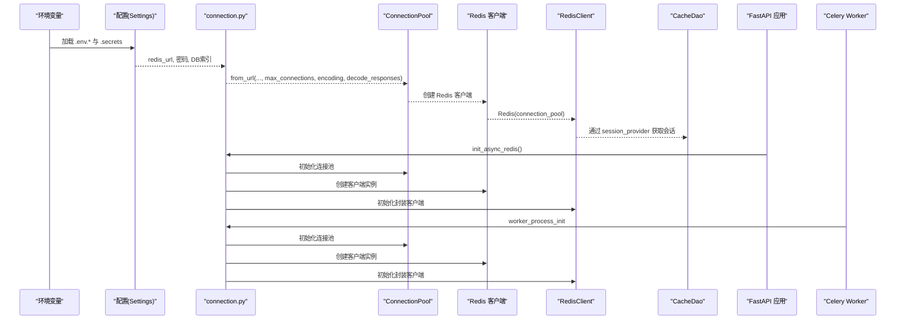
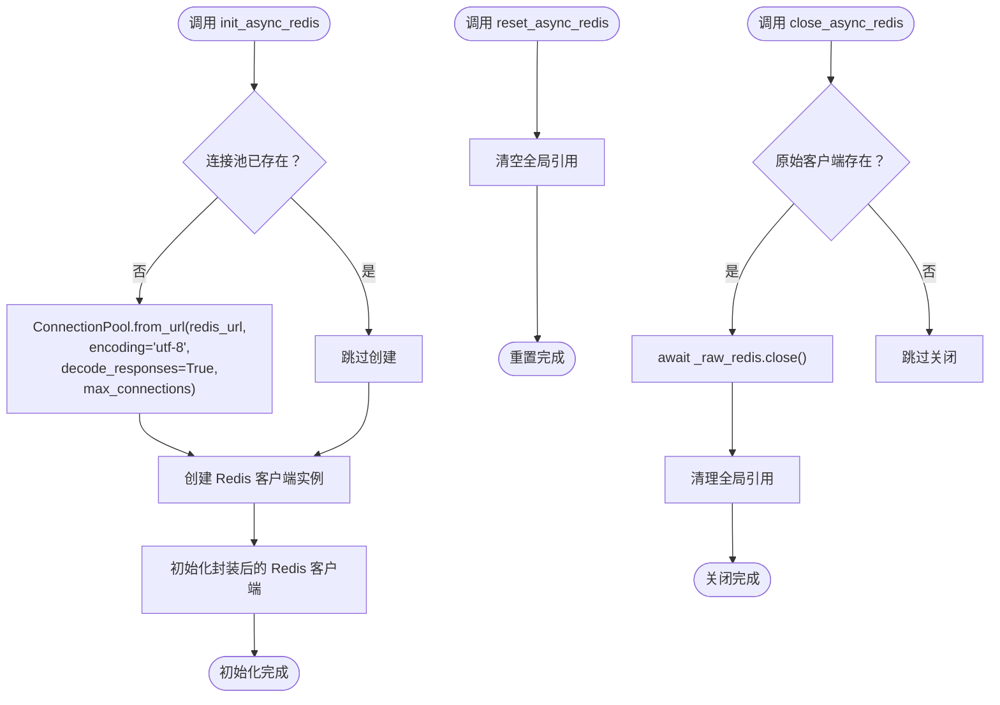
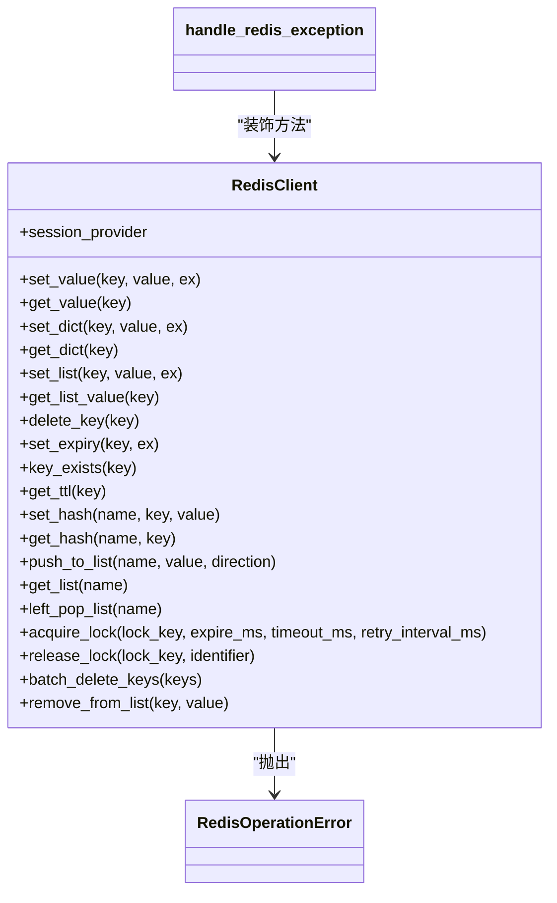
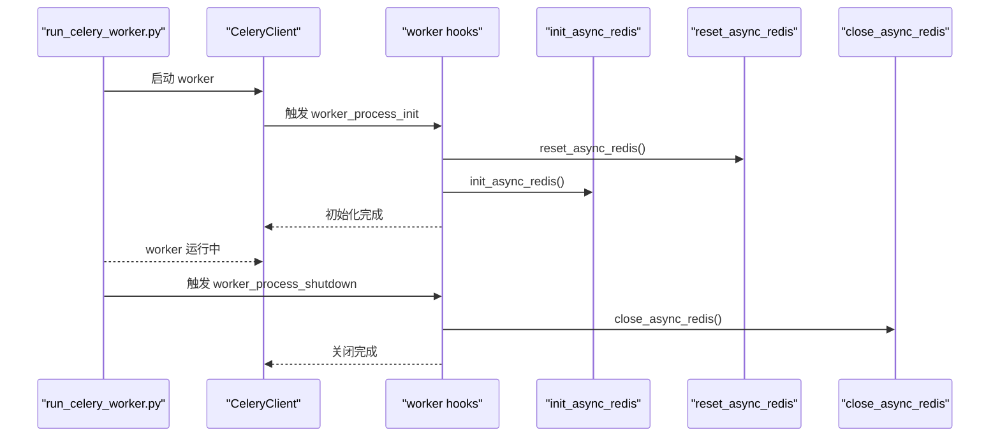
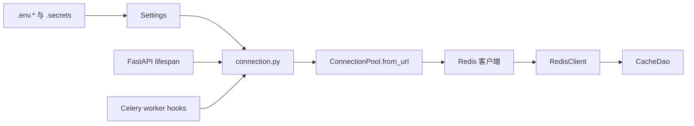

# Redis集成

<cite>
**本文档引用的文件**
- [internal/infra/redis/connection.py](file://internal/infra/redis/connection.py)
- [internal/infra/redis/dao.py](file://internal/infra/redis/dao.py)
- [internal/infra/redis/__init__.py](file://internal/infra/redis/__init__.py)
- [pkg/toolkit/redis_client.py](file://pkg/toolkit/redis_client.py)
- [internal/app.py](file://internal/app.py)
- [internal/utils/celery/__init__.py](file://internal/utils/celery/__init__.py)
- [pkg/toolkit/celery.py](file://pkg/toolkit/celery.py)
- [scripts/run_celery_worker.py](file://scripts/run_celery_worker.py)
- [configs/.env.dev](file://configs/.env.dev)
- [configs/.env.local](file://configs/.env.local)
- [configs/.env.prod](file://configs/.env.prod)
</cite>

## 更新摘要
**所做更改**
- 新增专门的Redis基础设施模块，包含连接管理和DAO层重构
- 更新连接池初始化和客户端管理机制
- 重构DAO层为独立的CacheDao类
- 增强Redis客户端封装和异常处理机制
- 完善FastAPI应用生命周期集成
- 优化Celery worker中的Redis资源管理

## 目录
1. [简介](#简介)
2. [项目结构](#项目结构)
3. [核心组件](#核心组件)
4. [架构总览](#架构总览)
5. [组件详细分析](#组件详细分析)
6. [依赖关系分析](#依赖关系分析)
7. [性能考量](#性能考量)
8. [故障排查指南](#故障排查指南)
9. [结论](#结论)
10. [附录](#附录)

## 简介
本文件系统性阐述本项目的Redis集成方案，涵盖专门的Redis基础设施模块、连接池初始化与配置、异步客户端创建流程、连接生命周期管理（初始化、重置、关闭）、URL与编码设置、最大连接数限制、异常处理与恢复策略、以及与FastAPI应用生命周期的集成方式和在Celery worker中的使用方法。文档同时提供可视化图示帮助理解整体数据流与控制流。

## 项目结构
Redis相关能力由专门的基础设施模块协同实现：
- **基础设施层**：专门的Redis基础设施模块，包含连接管理和DAO层重构
- **配置层**：负责从环境变量构建Redis URL与密码等敏感配置
- **工具层**：提供统一的Redis客户端封装与异常装饰器
- **应用层**：在FastAPI生命周期中初始化与关闭Redis
- **Celery集成**：在worker进程启动/关闭时初始化与释放Redis资源

```mermaid
graph TB
subgraph "基础设施层"
INFRA["internal/infra/redis/<br/>专门的Redis基础设施模块"]
CONN["connection.py<br/>连接池与客户端管理"]
DAO["dao.py<br/>CacheDao数据访问对象"]
INIT["__init__.py<br/>模块导出接口"]
end
subgraph "配置层"
CFG["Settings.redis_url<br/>敏感字段解密"]
end
subgraph "工具层"
REDIS_CLIENT["RedisClient<br/>统一客户端封装"]
EXCEPTION["handle_redis_exception<br/>异常装饰器"]
end
subgraph "应用层"
LIFE["FastAPI lifespan<br/>init/close Redis"]
END
subgraph "Celery集成"
CEL["CeleryClient<br/>worker hooks"]
RUN["run_celery_worker.py"]
end
CFG --> INFRA
INFRA --> REDIS_CLIENT
REDIS_CLIENT --> DAO
LIFE --> INFRA
CEL --> INFRA
RUN --> CEL
```

**图表来源**
- [internal/infra/redis/connection.py](file://internal/infra/redis/connection.py#L1-L92)
- [internal/infra/redis/dao.py](file://internal/infra/redis/dao.py#L1-L68)
- [internal/infra/redis/__init__.py](file://internal/infra/redis/__init__.py#L1-L23)
- [pkg/toolkit/redis_client.py](file://pkg/toolkit/redis_client.py#L1-L261)
- [internal/app.py](file://internal/app.py#L80-L107)
- [internal/utils/celery/__init__.py](file://internal/utils/celery/__init__.py#L55-L98)

**章节来源**
- [internal/infra/redis/connection.py](file://internal/infra/redis/connection.py#L1-L92)
- [internal/infra/redis/dao.py](file://internal/infra/redis/dao.py#L1-L68)
- [internal/infra/redis/__init__.py](file://internal/infra/redis/__init__.py#L1-L23)
- [pkg/toolkit/redis_client.py](file://pkg/toolkit/redis_client.py#L1-L261)
- [internal/app.py](file://internal/app.py#L80-L107)
- [internal/utils/celery/__init__.py](file://internal/utils/celery/__init__.py#L55-L98)

## 核心组件
- **专门的Redis基础设施模块**
  - 通过专门的`internal/infra/redis`模块提供完整的Redis连接管理
  - 包含连接池创建、客户端初始化、上下文管理器等功能
- **缓存客户端封装**
  - 以"会话提供器"模式注入Redis客户端，统一对外提供键值、哈希、列表、分布式锁等操作
  - 使用装饰器统一捕获并包装Redis操作异常
- **DAO层重构**
  - 重构为独立的`CacheDao`类，专注于认证令牌与用户令牌列表的读写
  - 通过依赖注入接收RedisClient实例
- **应用生命周期集成**
  - 在FastAPI lifespan中初始化Redis并在关闭时释放
- **Celery worker集成**
  - 在worker进程启动/关闭钩子中初始化/关闭Redis；支持在任务执行前后进行资源管理

**章节来源**
- [internal/infra/redis/connection.py](file://internal/infra/redis/connection.py#L32-L58)
- [pkg/toolkit/redis_client.py](file://pkg/toolkit/redis_client.py#L41-L261)
- [internal/infra/redis/dao.py](file://internal/infra/redis/dao.py#L9-L67)
- [internal/app.py](file://internal/app.py#L89-L90)
- [internal/utils/celery/__init__.py](file://internal/utils/celery/__init__.py#L129-L160)

## 架构总览
下图展示Redis在系统中的关键交互路径：配置生成URL → 连接池创建 → 客户端实例化 → 缓存客户端封装 → DAO使用 → 应用/任务生命周期管理。

```mermaid
sequenceDiagram
participant ENV as "环境变量"
participant CFG as "配置(Settings)"
participant CONN as "connection.py"
participant POOL as "ConnectionPool"
participant R as "Redis 客户端"
participant RC as "RedisClient"
participant DAO as "CacheDao"
participant APP as "FastAPI 应用"
participant CEL as "Celery Worker"
ENV->>CFG : 加载 .env.* 与 .secrets
CFG-->>CONN : redis_url, 密码, DB索引
CONN-->>POOL : from_url(..., max_connections, encoding, decode_responses)
POOL-->>R : 创建 Redis 客户端
R-->>RC : Redis(connection_pool)
RC-->>DAO : 通过 session_provider 获取会话
APP->>CONN : init_async_redis()
CONN->>POOL : 初始化连接池
CONN->>R : 创建客户端实例
CONN->>RC : 初始化封装客户端
CEL->>CONN : worker_process_init
CONN->>POOL : 初始化连接池
CONN->>R : 创建客户端实例
CONN->>RC : 初始化封装客户端
```

**图表来源**
- [internal/infra/redis/connection.py](file://internal/infra/redis/connection.py#L32-L58)
- [internal/app.py](file://internal/app.py#L89-L90)
- [internal/utils/celery/__init__.py](file://internal/utils/celery/__init__.py#L129-L146)

## 组件详细分析

### 专门的Redis基础设施模块
- **模块组织**
  - 专门的`internal/infra/redis`目录提供完整的Redis基础设施
  - 包含`connection.py`（连接管理）、`dao.py`（数据访问）、`__init__.py`（模块导出）
- **连接池管理**
  - 通过全局变量管理连接池、原始Redis客户端和封装后的Redis客户端
  - 提供延迟代理机制确保正确的模块导入顺序
- **生命周期管理**
  - 提供初始化、重置、关闭三个核心函数
  - 支持异步上下文管理器获取Redis会话

```mermaid
flowchart TD
START(["调用 init_async_redis"]) --> CHECK_POOL{"连接池已存在？"}
CHECK_POOL --> |否| CREATE_POOL["ConnectionPool.from_url(redis_url,<br/>encoding='utf-8',<br/>decode_responses=True,<br/>max_connections)"]
CHECK_POOL --> |是| SKIP_POOL["跳过创建"]
CREATE_POOL --> INIT_RAW["创建 Redis 客户端实例"]
SKIP_POOL --> INIT_RAW
INIT_RAW --> INIT_WRAPPER["初始化封装后的 Redis 客户端"]
INIT_WRAPPER --> END(["初始化完成"])
RESET_START(["调用 reset_async_redis"]) --> CLEAR_VARS["清空全局引用"]
CLEAR_VARS --> RESET_END(["重置完成"])
CLOSE_START(["调用 close_async_redis"]) --> CHECK_RAW{"原始客户端存在？"}
CHECK_RAW --> |是| CLOSE_RAW["await _raw_redis.close()"]
CHECK_RAW --> |否| SKIP_CLOSE["跳过关闭"]
CLOSE_RAW --> CLEANUP["清理全局引用"]
CLEANUP --> CLOSE_END(["关闭完成"])
```

**图表来源**
- [internal/infra/redis/connection.py](file://internal/infra/redis/connection.py#L32-L81)

**章节来源**
- [internal/infra/redis/connection.py](file://internal/infra/redis/connection.py#L13-L81)
- [internal/infra/redis/__init__.py](file://internal/infra/redis/__init__.py#L3-L22)

### 缓存客户端与异常处理
- **会话提供器**
  - 通过上下文管理器提供稳定的Redis会话引用
  - 支持异步上下文管理器模式
- **操作方法**
  - 键值、字典、列表、哈希、TTL、过期、存在性、批量删除等
  - 自动JSON序列化/反序列化，统一异常包装
- **分布式锁**
  - 原生SET NX PX实现，带超时与重试间隔配置
  - Lua脚本释放锁，仅允许持有者释放
- **异常处理**
  - 装饰器统一捕获Redis操作异常，包装为领域异常类型，保留原始错误信息

```mermaid
classDiagram
class RedisClient {
+session_provider
+set_value(key, value, ex)
+get_value(key)
+set_dict(key, value, ex)
+get_dict(key)
+set_list(key, value, ex)
+get_list_value(key)
+delete_key(key)
+set_expiry(key, ex)
+key_exists(key)
+get_ttl(key)
+set_hash(name, key, value)
+get_hash(name, key)
+push_to_list(name, value, direction)
+get_list(name)
+left_pop_list(name)
+acquire_lock(lock_key, expire_ms, timeout_ms, retry_interval_ms)
+release_lock(lock_key, identifier)
+batch_delete_keys(keys)
+remove_from_list(key, value)
}
class RedisOperationError {
}
class handle_redis_exception {
}
RedisClient --> RedisOperationError : "抛出"
handle_redis_exception --> RedisClient : "装饰方法"
```

**图表来源**
- [pkg/toolkit/redis_client.py](file://pkg/toolkit/redis_client.py#L41-L261)

**章节来源**
- [pkg/toolkit/redis_client.py](file://pkg/toolkit/redis_client.py#L17-L261)

### DAO层重构与使用示例
- **CacheDao类设计**
  - 通过依赖注入接收RedisClient实例
  - 提供认证令牌键构造与用户令牌列表键构造静态方法
  - 专注于认证令牌与用户令牌列表的读写操作
- **认证令牌管理**
  - 通过缓存客户端读取令牌元数据与令牌列表
  - 读取失败时记录告警并返回空结果
  - 支持JSON序列化/反序列化

**章节来源**
- [internal/infra/redis/dao.py](file://internal/infra/redis/dao.py#L9-L67)

### FastAPI应用生命周期集成
- **应用启动**
  - 初始化日志、数据库、Redis、签名认证、雪花ID生成器、AnyIO任务管理器
  - Redis初始化在数据库之后执行
- **应用关闭**
  - 逆序关闭数据库、Redis、AnyIO任务管理器
  - 确保资源正确释放

**章节来源**
- [internal/app.py](file://internal/app.py#L80-L107)

### Celery worker中的使用
- **worker进程启动钩子**
  - 初始化日志、数据库、Redis
  - 支持在任务执行前后进行资源管理
- **worker进程关闭钩子**
  - 并发关闭Redis与数据库，提升关闭效率
- **Celery客户端**
  - 以Redis作为消息代理与结果后端
  - 注册worker生命周期钩子
- **worker启动脚本**
  - 提供worker主程序入口与常用参数

```mermaid
sequenceDiagram
participant RUN as "run_celery_worker.py"
participant CEL as "CeleryClient"
participant HOOK as "worker hooks"
participant INIT as "init_async_redis"
participant RESET as "reset_async_redis"
participant CLOSE as "close_async_redis"
RUN->>CEL : 启动 worker
CEL->>HOOK : 触发 worker_process_init
HOOK->>RESET : reset_async_redis()
HOOK->>INIT : init_async_redis()
HOOK-->>CEL : 初始化完成
RUN-->>CEL : worker 运行中
RUN->>HOOK : 触发 worker_process_shutdown
HOOK->>CLOSE : close_async_redis()
HOOK-->>CEL : 关闭完成
```

**图表来源**
- [internal/utils/celery/__init__.py](file://internal/utils/celery/__init__.py#L129-L160)
- [pkg/toolkit/celery.py](file://pkg/toolkit/celery.py#L159-L198)

**章节来源**
- [internal/utils/celery/__init__.py](file://internal/utils/celery/__init__.py#L55-L98)
- [pkg/toolkit/celery.py](file://pkg/toolkit/celery.py#L159-L198)

## 依赖关系分析
- **基础设施层依赖**
  - 依赖redis.asyncio库进行连接池与客户端创建
  - 依赖pkg.toolkit.redis_client.RedisClient提供统一封装
  - 依赖internal.config.settings获取配置信息
- **DAO层依赖**
  - 依赖专门的redis_client变量而非直接导入
  - 依赖pkg.toolkit.json工具进行JSON序列化/反序列化
- **应用层与Celery层**
  - 分别在生命周期钩子中调用基础设施层初始化/关闭
  - 支持在任务执行前后进行资源管理

```mermaid
graph LR
ENV[".env.* 与 .secrets"] --> CFG["Settings"]
CFG --> CONN["connection.py"]
CONN --> POOL["ConnectionPool.from_url"]
POOL --> R["Redis 客户端"]
R --> RC["RedisClient"]
RC --> DAO["CacheDao"]
LIFE["FastAPI lifespan"] --> CONN
CEL["Celery worker hooks"] --> CONN
```

**图表来源**
- [internal/infra/redis/connection.py](file://internal/infra/redis/connection.py#L3-L11)
- [internal/infra/redis/dao.py](file://internal/infra/redis/dao.py#L3-L6)
- [internal/app.py](file://internal/app.py#L89-L90)
- [internal/utils/celery/__init__.py](file://internal/utils/celery/__init__.py#L10-L13)

**章节来源**
- [internal/infra/redis/connection.py](file://internal/infra/redis/connection.py#L1-L92)
- [internal/infra/redis/dao.py](file://internal/infra/redis/dao.py#L1-L68)
- [pkg/toolkit/redis_client.py](file://pkg/toolkit/redis_client.py#L1-L261)

## 性能考量
- **连接池复用**
  - 通过连接池减少TCP握手与认证开销，提升并发性能
  - 最大连接数可通过配置项设置，默认值为20
- **延迟代理机制**
  - 使用lazy_proxy确保正确的模块导入顺序
  - 避免在导入时出现None值问题
- **异步上下文管理**
  - 支持异步上下文管理器，提高资源管理效率
- **并发关闭**
  - 在worker关闭阶段并发关闭数据库与Redis，缩短停机时间

**章节来源**
- [internal/infra/redis/connection.py](file://internal/infra/redis/connection.py#L19-L29)
- [internal/infra/redis/connection.py](file://internal/infra/redis/connection.py#L43-L48)
- [internal/utils/celery/__init__.py](file://internal/utils/celery/__init__.py#L157-L158)

## 故障排查指南
- **初始化失败**
  - 检查Redis URL生成是否正确（主机、端口、密码、DB索引）
  - 确认敏感字段解密是否成功
  - 验证模块导入顺序是否正确
- **连接异常**
  - 查看连接池参数是否合理（最大连接数、编码、解码响应）
  - 检查网络连通性与防火墙策略
- **操作异常**
  - 使用装饰器包装的异常类型定位具体方法与参数
  - 检查JSON序列化/反序列化是否正确
- **分布式锁问题**
  - 确认锁键命名规范与标识符一致性
  - 检查超时与重试间隔配置是否合理
- **生命周期问题**
  - 确保在应用关闭与worker关闭时调用关闭函数
  - 避免在关闭后继续使用已释放的客户端
- **模块导入问题**
  - 检查延迟代理机制是否正常工作
  - 确认全局变量初始化顺序

**章节来源**
- [internal/infra/redis/connection.py](file://internal/infra/redis/connection.py#L19-L26)
- [pkg/toolkit/redis_client.py](file://pkg/toolkit/redis_client.py#L23-L38)
- [internal/infra/redis/connection.py](file://internal/infra/redis/connection.py#L83-L91)

## 结论
本项目通过专门的Redis基础设施模块实现了更加清晰和可维护的Redis集成方案：专门的`internal/infra/redis`模块提供完整的连接管理，RedisClient提供统一的客户端封装与异常处理，CacheDao专注于业务数据访问，应用与Celery层在生命周期中完成资源的初始化与释放。该方案具备良好的模块化设计、清晰的依赖关系和完善的异常处理机制，适合在生产环境中部署与演进。

## 附录
- **环境配置示例**
  - 开发/本地/生产环境的Redis配置示例文件
- **启动与运行**
  - FastAPI应用启动与Celery worker启动脚本说明
- **模块导出**
  - 专门Redis基础设施模块的完整导出接口

**章节来源**
- [configs/.env.dev](file://configs/.env.dev#L14-L17)
- [configs/.env.local](file://configs/.env.local#L14-L17)
- [configs/.env.prod](file://configs/.env.prod#L14-L17)
- [internal/infra/redis/__init__.py](file://internal/infra/redis/__init__.py#L12-L22)