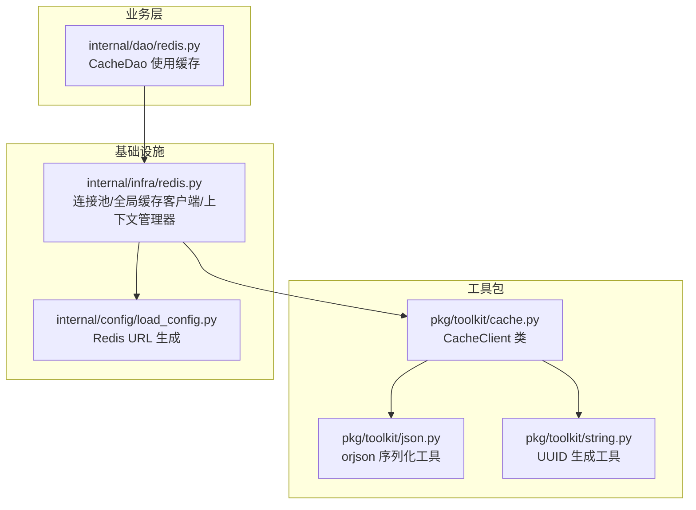
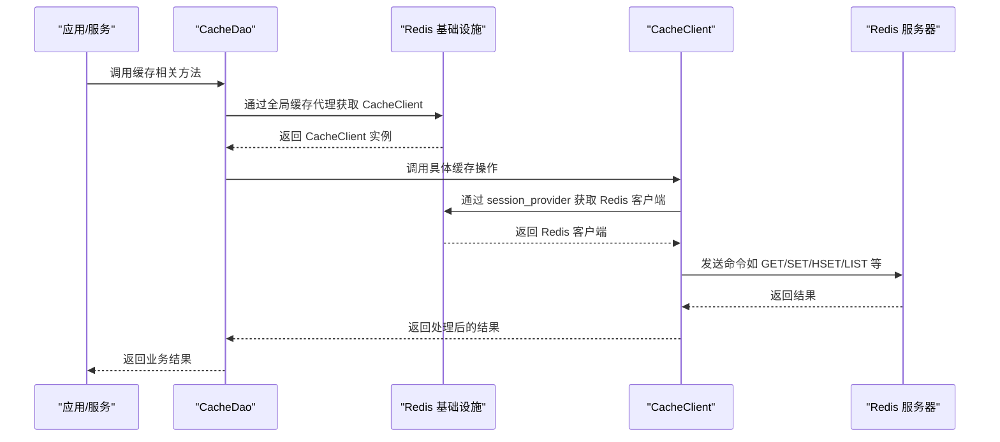
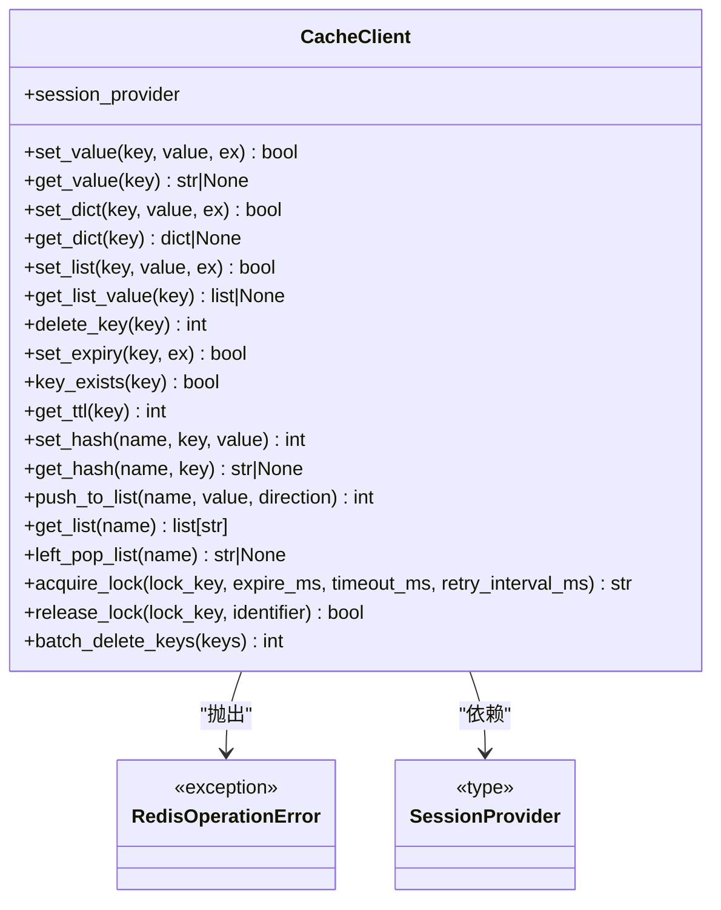
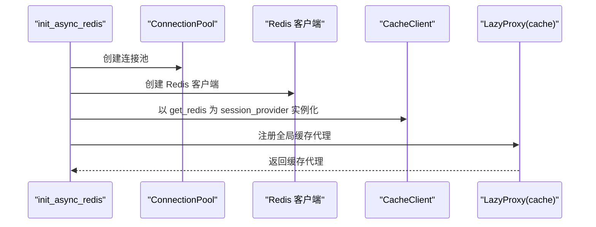
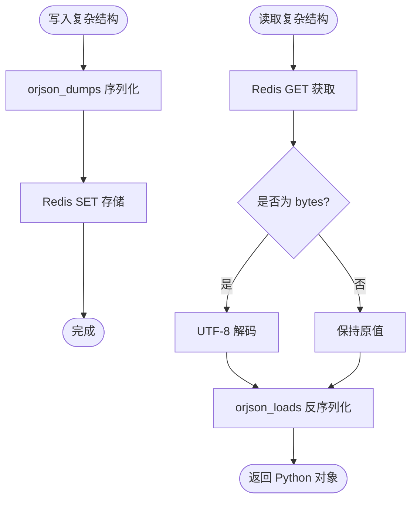
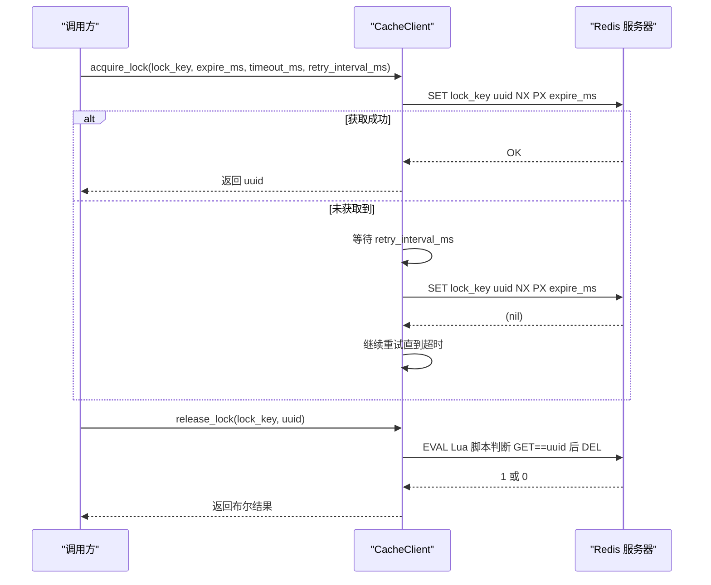
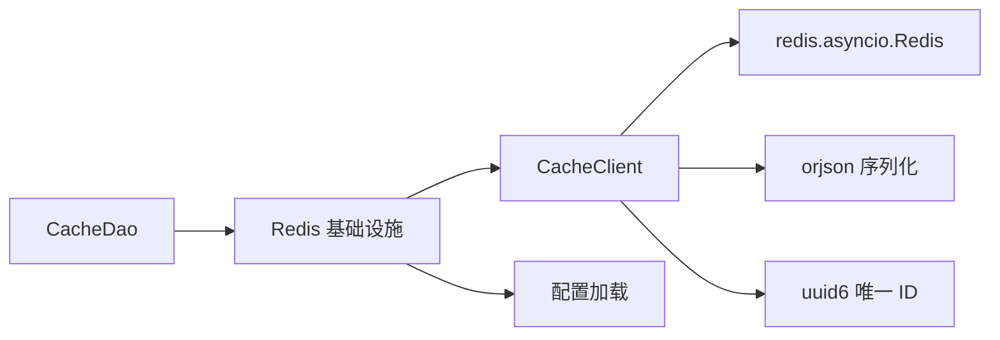

# 缓存客户端

<cite>
**本文档引用的文件**
- [pkg/toolkit/cache.py](file://pkg/toolkit/cache.py)
- [internal/infra/redis.py](file://internal/infra/redis.py)
- [pkg/toolkit/json.py](file://pkg/toolkit/json.py)
- [pkg/toolkit/string.py](file://pkg/toolkit/string.py)
- [internal/dao/redis.py](file://internal/dao/redis.py)
- [internal/config/load_config.py](file://internal/config/load_config.py)
- [internal/constants/__init__.py](file://internal/constants/__init__.py)
</cite>

## 目录
1. [简介](#简介)
2. [项目结构](#项目结构)
3. [核心组件](#核心组件)
4. [架构总览](#架构总览)
5. [详细组件分析](#详细组件分析)
6. [依赖关系分析](#依赖关系分析)
7. [性能考量](#性能考量)
8. [故障排查指南](#故障排查指南)
9. [结论](#结论)
10. [附录](#附录)

## 简介
本文件系统性地文档化了缓存客户端的设计与实现，重点围绕 CacheClient 类展开，涵盖：
- 初始化流程与 session_provider 参数的作用
- 缓存操作接口（get、set、delete、exists 等）
- 键值对存储格式与序列化机制
- 过期时间设置与 TTL 管理策略
- 列表、哈希等复合数据结构操作
- 分布式锁的获取与释放
- 批量删除与事务/管道执行的建议
- 性能监控与命中率统计的建议方案
- 最佳实践与常见问题解决方案

## 项目结构
缓存客户端位于工具包模块中，通过 Redis 异步客户端进行交互；基础设施层负责连接池与全局缓存客户端实例的创建与管理；DAO 层通过全局缓存代理使用缓存能力。

图表来源
- [pkg/toolkit/cache.py](file://pkg/toolkit/cache.py#L1-L249)
- [internal/infra/redis.py](file://internal/infra/redis.py#L1-L98)
- [pkg/toolkit/json.py](file://pkg/toolkit/json.py#L1-L108)
- [pkg/toolkit/string.py](file://pkg/toolkit/string.py#L1-L111)
- [internal/dao/redis.py](file://internal/dao/redis.py#L1-L36)
- [internal/config/load_config.py](file://internal/config/load_config.py#L160-L173)

章节来源
- [pkg/toolkit/cache.py](file://pkg/toolkit/cache.py#L1-L249)
- [internal/infra/redis.py](file://internal/infra/redis.py#L1-L98)
- [internal/dao/redis.py](file://internal/dao/redis.py#L1-L36)

## 核心组件
- CacheClient：异步 Redis 缓存客户端，提供键值、字典、列表、哈希、过期时间、TTL、分布式锁、批量删除等能力。
- SessionProvider：会话提供器类型，用于注入 Redis 客户端的获取方式。
- RedisOperationError：统一的 Redis 操作异常类型，便于上层捕获与处理。
- Redis 上下文管理器：由基础设施层提供，保证连接生命周期与异常处理。
- orjson 序列化工具：高性能 JSON 序列化/反序列化，用于复杂数据结构的持久化。
- UUID 工具：用于分布式锁标识符生成。

章节来源
- [pkg/toolkit/cache.py](file://pkg/toolkit/cache.py#L14-L21)
- [pkg/toolkit/cache.py](file://pkg/toolkit/cache.py#L41-L45)
- [pkg/toolkit/json.py](file://pkg/toolkit/json.py#L69-L108)
- [pkg/toolkit/string.py](file://pkg/toolkit/string.py#L13-L17)
- [internal/infra/redis.py](file://internal/infra/redis.py#L70-L84)

## 架构总览
CacheClient 通过 session_provider 注入的 Redis 客户端执行操作；基础设施层负责连接池与全局缓存客户端实例的创建；DAO 层通过全局缓存代理使用缓存能力。

图表来源
- [internal/dao/redis.py](file://internal/dao/redis.py#L19-L33)
- [internal/infra/redis.py](file://internal/infra/redis.py#L87-L97)
- [pkg/toolkit/cache.py](file://pkg/toolkit/cache.py#L47-L52)

## 详细组件分析

### CacheClient 类设计与实现
- 设计要点
  - 采用异步 Redis 客户端，所有操作均为协程方法。
  - 通过 session_provider 注入 Redis 客户端获取方式，便于测试与替换。
  - 使用装饰器统一捕获并包装 Redis 操作异常，提升错误信息可读性。
  - 对复杂数据结构（dict/list）提供自动 JSON 序列化/反序列化。
  - 提供分布式锁获取与释放能力，基于 Redis 原生 SET NX PX 命令与 Lua 脚本。
  - 提供列表、哈希等复合数据结构的常用操作。

图表来源
- [pkg/toolkit/cache.py](file://pkg/toolkit/cache.py#L41-L249)

章节来源
- [pkg/toolkit/cache.py](file://pkg/toolkit/cache.py#L41-L249)

### 初始化与 session_provider 参数
- 初始化流程
  - 基础设施层创建连接池与 Redis 客户端实例。
  - 将 CacheClient 实例化并注入 get_redis 上下文管理器作为 session_provider。
  - 通过 LazyProxy 暴露全局缓存代理，避免循环导入与初始化时为 None 的问题。
- session_provider 的作用
  - 作为 Redis 客户端的稳定引用，使 CacheClient 在运行时按需获取连接。
  - 便于替换为测试替身或不同连接策略，提高可测试性与灵活性。

图表来源
- [internal/infra/redis.py](file://internal/infra/redis.py#L18-L45)
- [internal/infra/redis.py](file://internal/infra/redis.py#L70-L97)

章节来源
- [internal/infra/redis.py](file://internal/infra/redis.py#L18-L45)
- [internal/infra/redis.py](file://internal/infra/redis.py#L70-L97)

### 缓存操作接口
- 键值对基础操作
  - set_value/get_value：支持任意可序列化值，内部自动处理 bytes 解码。
  - delete_key：删除单键，返回删除数量。
  - key_exists：检查键是否存在。
  - set_expiry/get_ttl：设置与查询键的过期时间（秒）。
- 复杂数据结构
  - set_dict/get_dict：字典类型自动 JSON 序列化/反序列化。
  - set_list/get_list_value：列表类型自动 JSON 序列化/反序列化。
  - set_hash/get_hash：哈希表字段设置与获取。
  - push_to_list/get_list/left_pop_list：列表的两端插入与左弹出。
- 批量操作
  - batch_delete_keys：批量删除多个键，返回成功删除数量。

章节来源
- [pkg/toolkit/cache.py](file://pkg/toolkit/cache.py#L47-L122)
- [pkg/toolkit/cache.py](file://pkg/toolkit/cache.py#L124-L170)
- [pkg/toolkit/cache.py](file://pkg/toolkit/cache.py#L242-L249)

### 键值对存储格式与序列化机制
- 存储格式
  - 字符串键值：直接存储为 Redis 字符串。
  - 复杂结构：通过 orjson_dumps 序列化为字符串后存储。
- 序列化策略
  - 使用 orjson 的高性能序列化，支持多种类型与优化选项。
  - 自动处理 bytes、Decimal、集合、timedelta 等类型。
  - 反序列化时通过 orjson_loads 还原为 Python 对象。
- 字节处理
  - get_value 对 bytes 结果进行 UTF-8 解码，确保返回字符串。

图表来源
- [pkg/toolkit/cache.py](file://pkg/toolkit/cache.py#L67-L98)
- [pkg/toolkit/json.py](file://pkg/toolkit/json.py#L69-L108)

章节来源
- [pkg/toolkit/cache.py](file://pkg/toolkit/cache.py#L67-L98)
- [pkg/toolkit/json.py](file://pkg/toolkit/json.py#L69-L108)

### 过期时间设置与 TTL 管理策略
- 设置过期
  - set_value 支持 ex 参数设置秒级过期。
  - set_expiry 专门设置已有键的过期时间。
- 查询 TTL
  - get_ttl 返回剩余秒数：-1 表示永不过期，-2 表示不存在。
- 策略建议
  - 对热点数据设置较短 TTL，降低陈旧风险。
  - 对冷数据设置较长 TTL，减少频繁重建。
  - 使用 TTL 监控缓存命中率与淘汰情况，动态调整策略。

章节来源
- [pkg/toolkit/cache.py](file://pkg/toolkit/cache.py#L47-L52)
- [pkg/toolkit/cache.py](file://pkg/toolkit/cache.py#L106-L122)

### 列表与哈希操作
- 列表
  - push_to_list：支持左右插入，返回当前长度。
  - get_list：返回字符串列表，统一 bytes 解码。
  - left_pop_list：从左侧弹出元素。
- 哈希
  - set_hash：设置哈希字段，返回新增/更新状态。
  - get_hash：获取指定字段值，统一 bytes 解码。

章节来源
- [pkg/toolkit/cache.py](file://pkg/toolkit/cache.py#L140-L170)

### 分布式锁
- 获取锁
  - acquire_lock：使用 Redis 原生 SET NX PX 命令，带超时与重试间隔。
  - 返回唯一标识符，用于后续释放。
- 释放锁
  - release_lock：Lua 脚本判断锁值与标识符一致性后删除，避免误删。
- 前缀常量
  - REDIS_KEY_LOCK_PREFIX：锁键前缀常量，便于命名空间隔离。

图表来源
- [pkg/toolkit/cache.py](file://pkg/toolkit/cache.py#L199-L240)
- [pkg/toolkit/cache.py](file://pkg/toolkit/cache.py#L171-L197)
- [pkg/toolkit/string.py](file://pkg/toolkit/string.py#L13-L17)
- [internal/constants/__init__.py](file://internal/constants/__init__.py#L1)

章节来源
- [pkg/toolkit/cache.py](file://pkg/toolkit/cache.py#L171-L240)
- [pkg/toolkit/string.py](file://pkg/toolkit/string.py#L13-L17)
- [internal/constants/__init__.py](file://internal/constants/__init__.py#L1)

### 批量操作与事务/管道执行
- 批量删除
  - batch_delete_keys：传入键列表，使用 Redis DELETE 批量删除，返回成功数量。
- 事务/管道建议
  - 当前实现未提供内置事务/管道方法。建议在需要强一致性的场景下：
    - 使用 Redis MULTI/EXEC 包裹一组命令（可通过 eval 或原生命令实现）。
    - 或在业务层使用 asyncio.gather 并发执行多个独立命令，结合错误处理。

章节来源
- [pkg/toolkit/cache.py](file://pkg/toolkit/cache.py#L242-L249)

### 性能监控与命中率统计
- 当前实现
  - CacheClient 未内置命中率统计与性能指标采集。
- 建议方案
  - 在基础设施层或业务层增加埋点：记录 get/set/delete 次数与耗时。
  - 结合 Redis INFO 命令或慢查询日志分析热点与瓶颈。
  - 使用 TTL 与键空间事件监控缓存淘汰与过期分布。

章节来源
- [pkg/toolkit/cache.py](file://pkg/toolkit/cache.py#L47-L122)

### 使用示例与最佳实践
- 使用示例
  - DAO 层通过全局缓存代理使用缓存：参考 CacheDao 的实现。
- 最佳实践
  - 键命名规范：使用命名空间前缀，避免冲突。
  - TTL 设计：根据数据更新频率与一致性要求合理设置。
  - 序列化选择：优先使用 orjson，确保跨语言与前端兼容。
  - 锁策略：短锁、重试间隔与超时需权衡吞吐与死锁风险。
  - 批量操作：尽量合并请求，减少网络往返。

章节来源
- [internal/dao/redis.py](file://internal/dao/redis.py#L19-L33)

## 依赖关系分析
- 模块耦合
  - CacheClient 依赖 Redis 异步客户端与 orjson 工具。
  - 基础设施层提供 Redis 客户端与全局缓存代理，解耦业务层。
  - DAO 层通过全局代理使用缓存，避免直接依赖 Redis。
- 外部依赖
  - redis.asyncio：异步 Redis 客户端。
  - orjson：高性能 JSON 序列化库。
  - uuid6：生成唯一锁标识符。

图表来源
- [pkg/toolkit/cache.py](file://pkg/toolkit/cache.py#L9-L12)
- [pkg/toolkit/json.py](file://pkg/toolkit/json.py#L6)
- [pkg/toolkit/string.py](file://pkg/toolkit/string.py#L9)
- [internal/infra/redis.py](file://internal/infra/redis.py#L1-L98)
- [internal/config/load_config.py](file://internal/config/load_config.py#L160-L173)
- [internal/dao/redis.py](file://internal/dao/redis.py#L1-L36)

章节来源
- [pkg/toolkit/cache.py](file://pkg/toolkit/cache.py#L9-L12)
- [pkg/toolkit/json.py](file://pkg/toolkit/json.py#L6)
- [pkg/toolkit/string.py](file://pkg/toolkit/string.py#L9)
- [internal/infra/redis.py](file://internal/infra/redis.py#L1-L98)
- [internal/config/load_config.py](file://internal/config/load_config.py#L160-L173)
- [internal/dao/redis.py](file://internal/dao/redis.py#L1-L36)

## 性能考量
- 序列化性能
  - orjson 提供高性能序列化/反序列化，适合高频缓存场景。
- 连接管理
  - 基础设施层使用连接池，避免频繁创建连接带来的开销。
- 异步 I/O
  - 所有操作为异步，适合高并发场景，注意避免阻塞操作。
- 建议
  - 对于大批量写入，考虑使用 pipeline 或批量命令减少 RTT。
  - 对热点键设置合理的 TTL，避免内存膨胀。

[本节为通用性能建议，无需特定文件来源]

## 故障排查指南
- 常见异常
  - RedisOperationError：统一包装 Redis 操作异常，包含方法名与参数信息，便于定位。
- 排查步骤
  - 检查 Redis 连接池与 URL 配置是否正确。
  - 确认 session_provider 是否已初始化并可用。
  - 查看异常堆栈中的方法名与参数，确认调用是否符合预期。
- 锁相关问题
  - 若释放锁失败，检查标识符是否与获取时一致。
  - 超时获取锁时，适当增大超时与重试间隔。

章节来源
- [pkg/toolkit/cache.py](file://pkg/toolkit/cache.py#L17-L38)
- [pkg/toolkit/cache.py](file://pkg/toolkit/cache.py#L171-L197)
- [pkg/toolkit/cache.py](file://pkg/toolkit/cache.py#L199-L240)

## 结论
CacheClient 提供了完善的异步 Redis 缓存能力，具备良好的扩展性与可测试性。通过 session_provider 注入与基础设施层的连接池管理，实现了灵活的部署与维护。配合 orjson 序列化与分布式锁能力，能够满足大多数缓存场景的需求。建议在生产环境中结合监控与 TTL 策略，持续优化缓存命中率与性能表现。

[本节为总结性内容，无需特定文件来源]

## 附录
- 配置项
  - Redis URL 由配置加载模块生成，包含主机、端口、密码与数据库索引。
- 命名空间
  - 锁键前缀常量用于隔离分布式锁键空间。

章节来源
- [internal/config/load_config.py](file://internal/config/load_config.py#L160-L173)
- [internal/constants/__init__.py](file://internal/constants/__init__.py#L1)