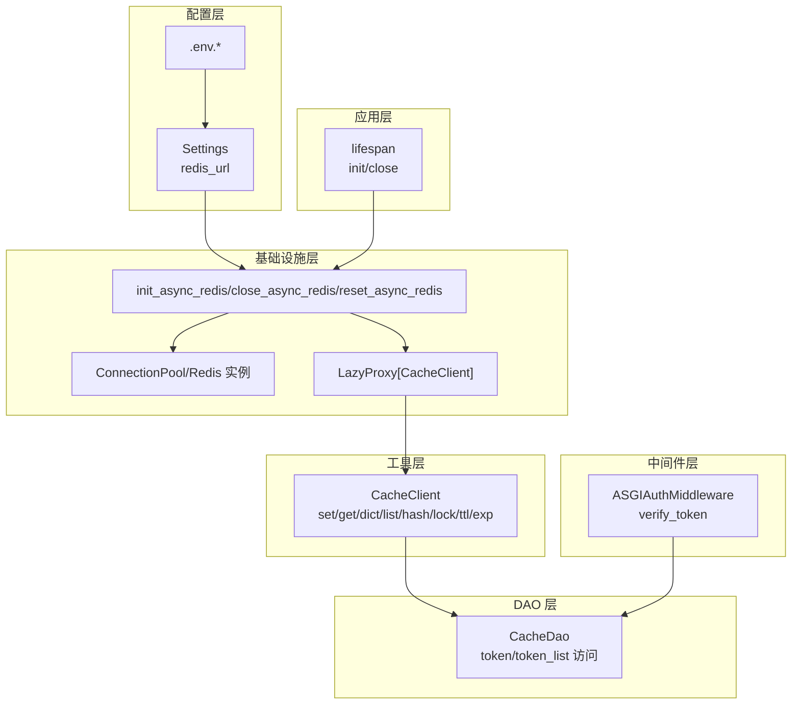
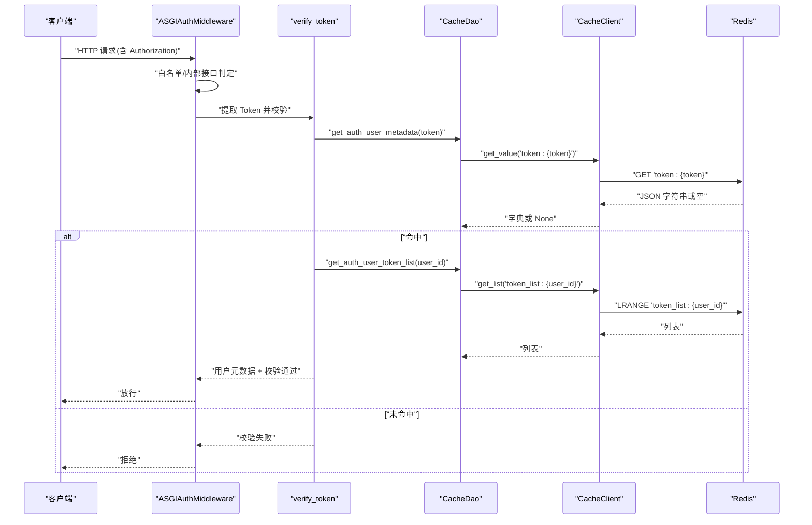
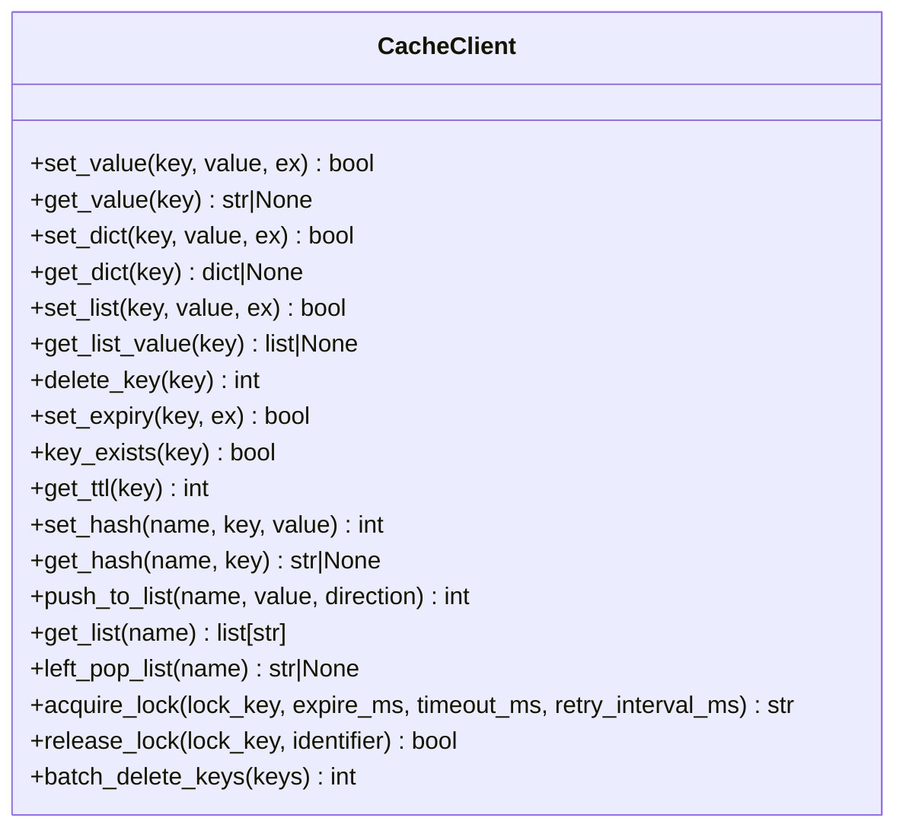
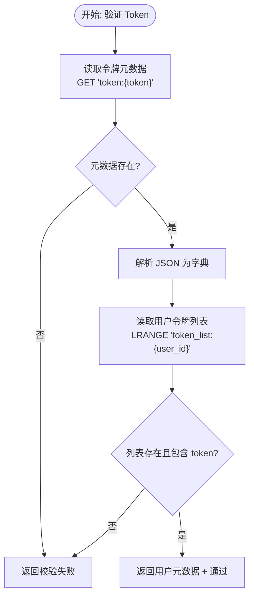
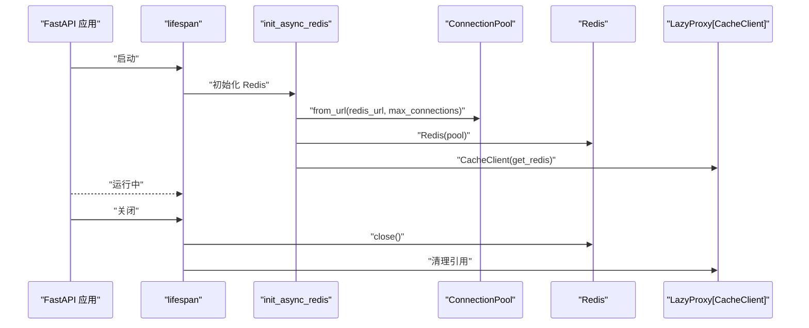
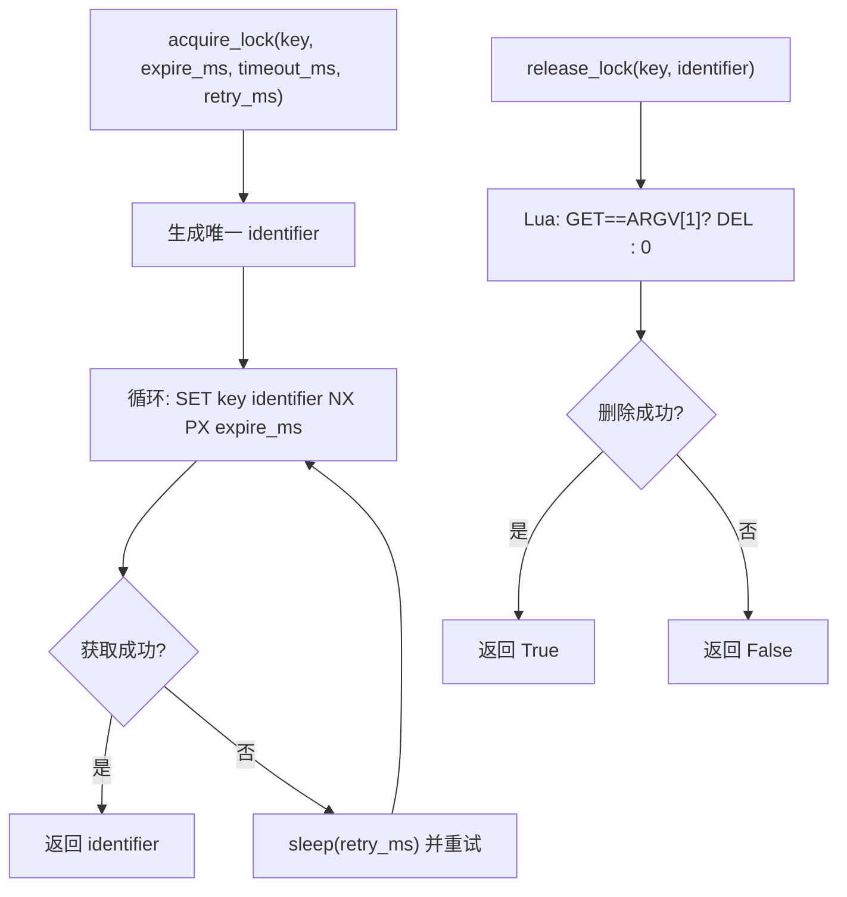
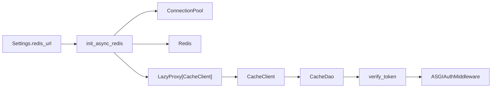

# 缓存系统

<cite>
**本文档引用的文件**
- [internal/infra/redis.py](file://internal/infra/redis.py)
- [pkg/toolkit/cache.py](file://pkg/toolkit/cache.py)
- [internal/dao/redis.py](file://internal/dao/redis.py)
- [internal/core/auth.py](file://internal/core/auth.py)
- [internal/middlewares/auth.py](file://internal/middlewares/auth.py)
- [internal/app.py](file://internal/app.py)
- [internal/config/load_config.py](file://internal/config/load_config.py)
- [configs/.env.dev](file://configs/.env.dev)
- [pkg/toolkit/json.py](file://pkg/toolkit/json.py)
- [internal/constants/__init__.py](file://internal/constants/__init__.py)
</cite>

## 目录
1. [简介](#简介)
2. [项目结构](#项目结构)
3. [核心组件](#核心组件)
4. [架构总览](#架构总览)
5. [详细组件分析](#详细组件分析)
6. [依赖关系分析](#依赖关系分析)
7. [性能考量](#性能考量)
8. [故障排查指南](#故障排查指南)
9. [结论](#结论)
10. [附录](#附录)

## 简介
本文件系统性地文档化本项目的缓存体系，重点涵盖：
- Redis 集成与生命周期管理
- 缓存客户端能力与数据结构操作
- 会话与认证流程中的缓存使用
- 缓存配置、过期与失效机制
- 缓存穿透与缓存雪崩的防护思路
- 与 DAO 层的集成关系与缓存更新策略
- 监控、统计与故障处理建议
- 常见问题与性能优化技巧

## 项目结构
缓存系统围绕以下模块协同工作：
- 配置层：从环境变量加载 Redis 连接参数
- 基础设施层：初始化/关闭 Redis 连接池与缓存客户端
- 工具层：提供统一的缓存客户端与异常处理
- DAO 层：面向认证场景的缓存访问对象
- 中间件层：在认证流程中使用缓存进行令牌校验
- 应用层：在应用生命周期内完成 Redis 初始化与关闭

**图表来源**
- [internal/config/load_config.py](file://internal/config/load_config.py#L162-L173)
- [internal/infra/redis.py](file://internal/infra/redis.py#L18-L97)
- [pkg/toolkit/cache.py](file://pkg/toolkit/cache.py#L41-L249)
- [internal/dao/redis.py](file://internal/dao/redis.py#L6-L36)
- [internal/middlewares/auth.py](file://internal/middlewares/auth.py#L88-L150)
- [internal/app.py](file://internal/app.py#L84-L109)

**章节来源**
- [internal/config/load_config.py](file://internal/config/load_config.py#L74-L84)
- [internal/infra/redis.py](file://internal/infra/redis.py#L18-L97)
- [pkg/toolkit/cache.py](file://pkg/toolkit/cache.py#L41-L249)
- [internal/dao/redis.py](file://internal/dao/redis.py#L6-L36)
- [internal/middlewares/auth.py](file://internal/middlewares/auth.py#L88-L150)
- [internal/app.py](file://internal/app.py#L84-L109)

## 核心组件
- 配置与连接
  - 通过 Settings 生成 redis_url，支持密码、主机、端口、DB 索引
  - 在应用生命周期内初始化 Redis 连接池与缓存客户端
- 缓存客户端
  - 提供键值、字典、列表、哈希、过期、TTL、分布式锁等常用操作
  - 统一异常包装与日志记录
- 缓存 DAO
  - 面向认证场景的键命名规范与访问方法
  - 提供令牌元数据与用户令牌列表的缓存读取
- 中间件与认证
  - ASGIAuthMiddleware 在请求进入业务逻辑前进行认证
  - verify_token 通过缓存 DAO 读取令牌与用户令牌列表进行校验

**章节来源**
- [internal/config/load_config.py](file://internal/config/load_config.py#L162-L173)
- [internal/infra/redis.py](file://internal/infra/redis.py#L18-L97)
- [pkg/toolkit/cache.py](file://pkg/toolkit/cache.py#L41-L249)
- [internal/dao/redis.py](file://internal/dao/redis.py#L6-L36)
- [internal/core/auth.py](file://internal/core/auth.py#L5-L19)
- [internal/middlewares/auth.py](file://internal/middlewares/auth.py#L132-L149)

## 架构总览
下图展示了缓存系统在认证链路中的交互：

**图表来源**
- [internal/middlewares/auth.py](file://internal/middlewares/auth.py#L132-L149)
- [internal/core/auth.py](file://internal/core/auth.py#L5-L19)
- [internal/dao/redis.py](file://internal/dao/redis.py#L19-L33)
- [pkg/toolkit/cache.py](file://pkg/toolkit/cache.py#L54-L98)
- [internal/infra/redis.py](file://internal/infra/redis.py#L70-L84)

## 详细组件分析

### 缓存客户端 CacheClient
- 能力概览
  - 键值：set_value/get_value
  - 结构体：set_dict/get_dict、set_list/get_list_value、push_to_list/get_list/left_pop_list
  - 哈希：set_hash/get_hash
  - TTL：set_expiry/key_exists/get_ttl
  - 分布式锁：acquire_lock/release_lock
  - 批量：batch_delete_keys
- 设计要点
  - 通过 session_provider 获取 Redis 会话，确保连接复用与生命周期管理
  - 统一异常包装为 RedisOperationError，便于上层捕获与降级
  - 使用 orjson 进行高性能序列化/反序列化
- 复杂度与性能
  - 基本操作为 O(1)，列表操作为 O(n)（n 为列表长度）
  - 分布式锁采用 SET NX PX 原语，避免 Lua 脚本开销

**图表来源**
- [pkg/toolkit/cache.py](file://pkg/toolkit/cache.py#L41-L249)

**章节来源**
- [pkg/toolkit/cache.py](file://pkg/toolkit/cache.py#L41-L249)
- [pkg/toolkit/json.py](file://pkg/toolkit/json.py#L69-L107)

### 缓存 DAO 与认证键空间
- 键命名规范
  - 用户令牌元数据：token:{token}
  - 用户令牌列表：token_list:{user_id}
- 功能
  - 读取令牌元数据（JSON 字符串 -> dict）
  - 读取用户令牌列表（字符串列表）
- 与中间件协作
  - 中间件在鉴权阶段调用 verify_token，进而使用 CacheDao 完成校验

**图表来源**
- [internal/dao/redis.py](file://internal/dao/redis.py#L19-L33)
- [internal/core/auth.py](file://internal/core/auth.py#L5-L19)

**章节来源**
- [internal/dao/redis.py](file://internal/dao/redis.py#L6-L36)
- [internal/core/auth.py](file://internal/core/auth.py#L5-L19)

### Redis 初始化与生命周期
- 初始化
  - 从 settings.redis_url 构建连接池
  - 创建 Redis 实例与 CacheClient
  - 通过 LazyProxy 暴露全局缓存客户端
- 关闭与重置
  - 正常关闭时释放连接
  - 重置用于 Celery 等场景下的事件循环切换
- 应用生命周期
  - 在 lifespan 中统一初始化与关闭

**图表来源**
- [internal/infra/redis.py](file://internal/infra/redis.py#L18-L97)
- [internal/app.py](file://internal/app.py#L84-L109)

**章节来源**
- [internal/infra/redis.py](file://internal/infra/redis.py#L18-L97)
- [internal/app.py](file://internal/app.py#L84-L109)

### 分布式锁与并发控制
- 获取锁
  - 使用 SET key identifier NX PX expire_ms 原语，避免脚本开销
  - 循环重试，支持超时与间隔
- 释放锁
  - 使用 Lua 脚本判断锁值一致性后再删除，避免误删他人锁
- 使用建议
  - 为不同资源设定独立的锁键，必要时加前缀区分
  - 锁过期时间应短于业务执行时间，避免长时间阻塞

**图表来源**
- [pkg/toolkit/cache.py](file://pkg/toolkit/cache.py#L199-L241)
- [pkg/toolkit/cache.py](file://pkg/toolkit/cache.py#L171-L198)
- [internal/constants/__init__.py](file://internal/constants/__init__.py#L1)

**章节来源**
- [pkg/toolkit/cache.py](file://pkg/toolkit/cache.py#L171-L241)
- [internal/constants/__init__.py](file://internal/constants/__init__.py#L1)

## 依赖关系分析
- 组件耦合
  - CacheClient 通过 session_provider 与 Redis 解耦
  - CacheDao 依赖全局 cache（LazyProxy[CacheClient]）
  - 中间件依赖 verify_token，verify_token 依赖 CacheDao
- 外部依赖
  - redis.asyncio 提供异步连接池与命令执行
  - orjson 提供高性能序列化
- 潜在风险
  - 直接 import cache 可能在初始化前导致 None
  - 通过 LazyProxy 与工厂函数规避初始化时序问题

**图表来源**
- [internal/config/load_config.py](file://internal/config/load_config.py#L162-L173)
- [internal/infra/redis.py](file://internal/infra/redis.py#L18-L97)
- [pkg/toolkit/cache.py](file://pkg/toolkit/cache.py#L41-L98)
- [internal/dao/redis.py](file://internal/dao/redis.py#L6-L36)
- [internal/core/auth.py](file://internal/core/auth.py#L5-L19)
- [internal/middlewares/auth.py](file://internal/middlewares/auth.py#L132-L149)

**章节来源**
- [internal/config/load_config.py](file://internal/config/load_config.py#L162-L173)
- [internal/infra/redis.py](file://internal/infra/redis.py#L18-L97)
- [pkg/toolkit/cache.py](file://pkg/toolkit/cache.py#L41-L98)
- [internal/dao/redis.py](file://internal/dao/redis.py#L6-L36)
- [internal/core/auth.py](file://internal/core/auth.py#L5-L19)
- [internal/middlewares/auth.py](file://internal/middlewares/auth.py#L132-L149)

## 性能考量
- 连接与序列化
  - 使用连接池与 LazyProxy，避免重复初始化
  - 使用 orjson 进行高性能序列化/反序列化
- 操作选择
  - 读多写少场景优先使用 GET/LRANGE/HGET 等 O(1)/O(n) 命令
  - 列表操作注意 n 值，必要时分页或限制长度
- 锁与并发
  - 使用原语 SET NX PX，减少脚本开销
  - 合理设置锁过期时间，避免长时间阻塞
- 监控与告警
  - 建议埋点统计 Redis 命中率、慢查询与异常次数
  - 结合应用日志与指标系统进行告警

[本节为通用指导，无需列出具体文件来源]

## 故障排查指南
- 常见问题
  - Redis 未初始化：调用前检查 lifespan 是否执行
  - 键不存在：确认键命名与过期策略
  - 反序列化失败：检查存储值是否为有效 JSON
  - 分布式锁误释放：确保 identifier 一致
- 定位步骤
  - 查看应用日志中 Redis 初始化与异常记录
  - 在中间件与认证流程中增加关键路径日志
  - 使用 get_ttl/key_exists 辅助定位过期与存在性问题
- 降级策略
  - Redis 操作异常时快速失败并记录
  - 对读多写少场景可允许短暂降级读取数据库

**章节来源**
- [internal/infra/redis.py](file://internal/infra/redis.py#L70-L84)
- [pkg/toolkit/cache.py](file://pkg/toolkit/cache.py#L23-L38)
- [pkg/toolkit/cache.py](file://pkg/toolkit/cache.py#L118-L122)

## 结论
本项目的缓存系统以 Redis 为核心，结合统一的缓存客户端与懒加载代理，实现了认证链路中的高效令牌校验。通过合理的键命名、TTL 策略与分布式锁，系统在并发与可靠性方面具备良好基础。建议后续补充缓存穿透与雪崩的主动防护策略（如布隆过滤器、互斥锁与随机过期），并完善监控与告警体系。

[本节为总结性内容，无需列出具体文件来源]

## 附录

### 缓存配置与环境变量
- 关键配置项
  - REDIS_HOST、REDIS_PORT、REDIS_PASSWORD、REDIS_DB
  - ACCESS_TOKEN_EXPIRE_MINUTES（用于令牌过期时间）
- 环境示例
  - 开发环境示例文件包含上述配置项

**章节来源**
- [internal/config/load_config.py](file://internal/config/load_config.py#L74-L79)
- [configs/.env.dev](file://configs/.env.dev#L14-L19)

### 过期时间与失效机制
- TTL 查询与设置
  - get_ttl：获取剩余过期时间
  - set_expiry：设置过期时间（秒）
- 失效策略
  - 令牌过期：通过设置 ex 参数或单独调用 expire
  - 列表与哈希：按键维度分别管理过期

**章节来源**
- [pkg/toolkit/cache.py](file://pkg/toolkit/cache.py#L107-L122)

### 缓存穿透与缓存雪崩的防护思路
- 缓存穿透
  - 对空结果设置短 TTL 的占位键
  - 使用布隆过滤器在进入缓存前拦截无效查询
- 缓存雪崩
  - 对热点键设置随机过期抖动
  - 采用互斥锁只让一个请求重建缓存
  - 多级缓存（本地缓存 + Redis）降低单一节点压力

[本节为概念性指导，无需列出具体文件来源]

### 与 DAO 层的集成与更新策略
- 集成方式
  - CacheDao 通过全局 cache（LazyProxy[CacheClient]）访问 Redis
  - 认证中间件在请求入口调用 verify_token，间接使用 CacheDao
- 更新策略
  - 登录成功后写入 token:{token} 与 token_list:{user_id}
  - 退出登录或变更令牌时删除对应键或缩短 TTL
  - 列表维护采用 LPUSH/LREM 等原子操作

**章节来源**
- [internal/dao/redis.py](file://internal/dao/redis.py#L6-L36)
- [internal/middlewares/auth.py](file://internal/middlewares/auth.py#L132-L149)
- [pkg/toolkit/cache.py](file://pkg/toolkit/cache.py#L141-L170)