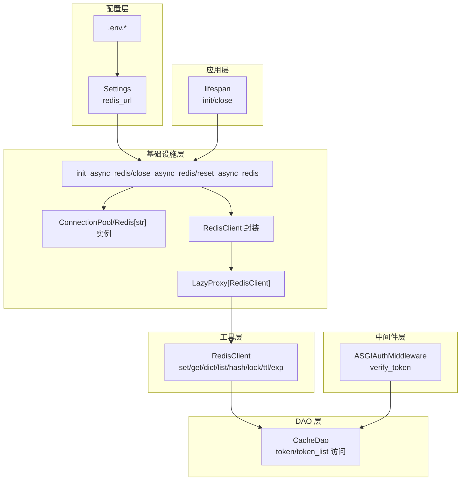
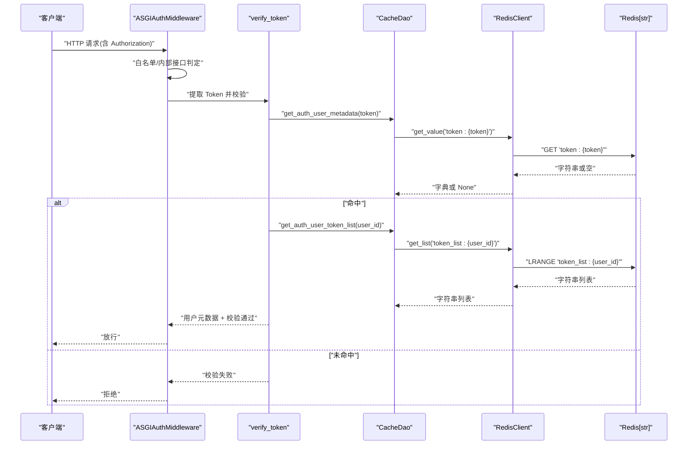
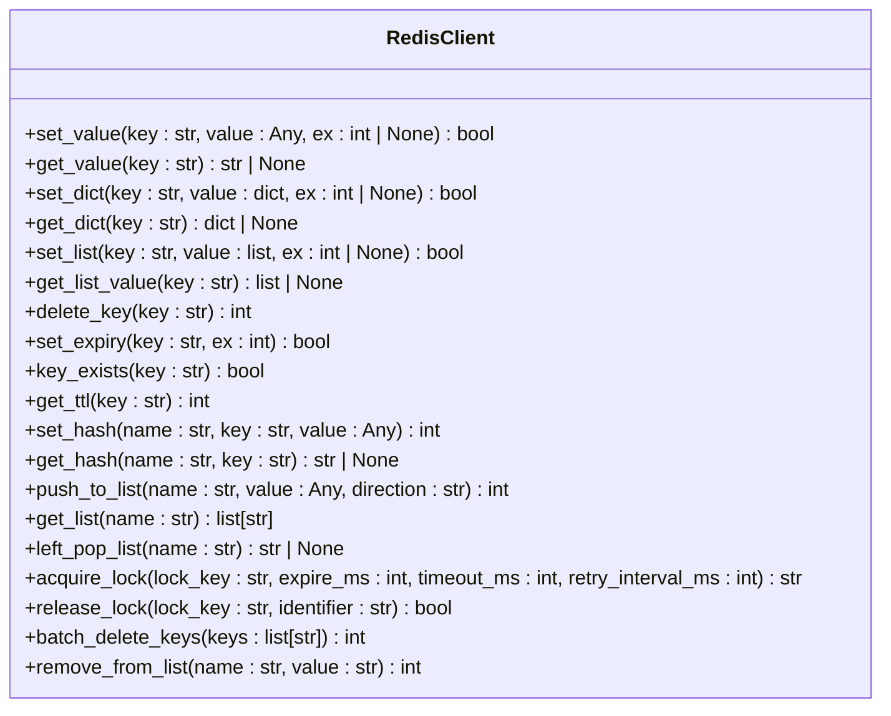
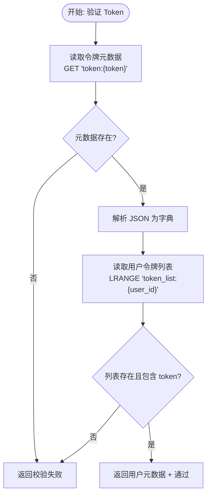
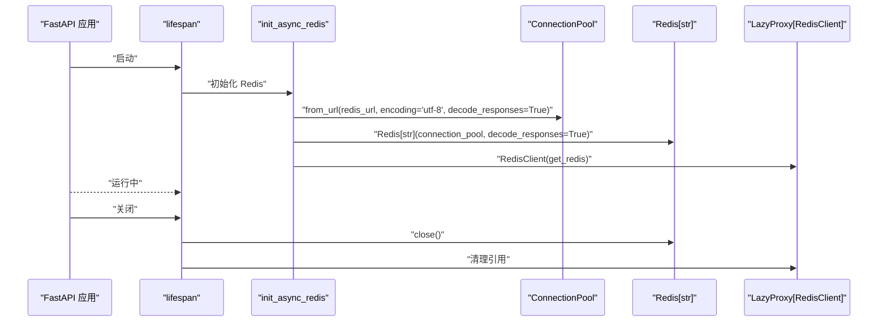
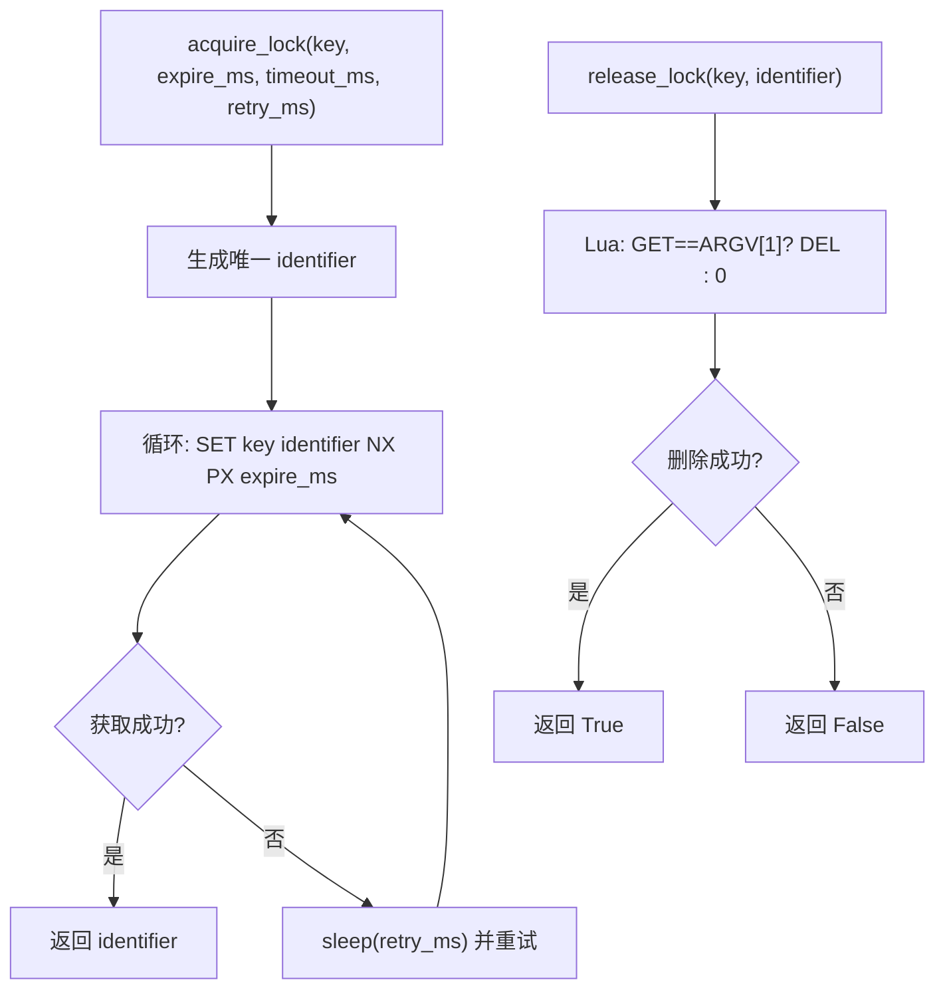
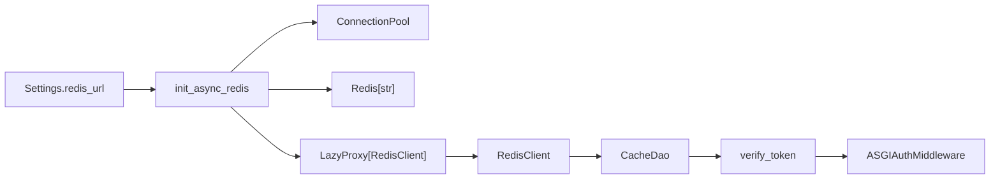

# 缓存系统

<cite>
**本文档引用的文件**
- [internal/infra/redis/connection.py](file://internal/infra/redis/connection.py)
- [internal/infra/redis/dao.py](file://internal/infra/redis/dao.py)
- [pkg/toolkit/redis_client.py](file://pkg/toolkit/redis_client.py)
- [internal/core/auth.py](file://internal/core/auth.py)
- [internal/middlewares/auth.py](file://internal/middlewares/auth.py)
- [internal/app.py](file://internal/app.py)
- [internal/config/settings.py](file://internal/config/settings.py)
- [configs/.env.dev](file://configs/.env.dev)
- [pkg/toolkit/json.py](file://pkg/toolkit/json.py)
- [pkg/toolkit/types.py](file://pkg/toolkit/types.py)
- [internal/utils/types/__init__.py](file://internal/utils/types/__init__.py)
</cite>

## 更新摘要
**所做更改**
- 更新了Redis客户端类型注解改进：将Redis客户端类型从通用类型更新为字符串专用类型（`Redis[str]`），增强类型安全性
- 更新了响应解码配置：在连接池和Redis客户端中都设置了`decode_responses=True`，改善开发者体验
- 调整了相关章节的代码示例和类型注解说明
- 增强了类型安全性和开发者体验的文档说明

## 目录
1. [简介](#简介)
2. [项目结构](#项目结构)
3. [核心组件](#核心组件)
4. [架构总览](#架构总览)
5. [详细组件分析](#详细组件分析)
6. [依赖关系分析](#依赖关系分析)
7. [性能考量](#性能考量)
8. [故障排查指南](#故障排查指南)
9. [结论](#结论)
10. [附录](#附录)

## 简介
本文件系统性地文档化本项目的缓存体系，重点涵盖：
- Redis 集成与生命周期管理
- 缓存客户端能力与数据结构操作
- 会话与认证流程中的缓存使用
- 缓存配置、过期与失效机制
- 缓存穿透与缓存雪崩的防护思路
- 与 DAO 层的集成关系与缓存更新策略
- 监控、统计与故障处理建议
- 常见问题与性能优化技巧

## 项目结构
缓存系统围绕以下模块协同工作：
- 配置层：从环境变量加载 Redis 连接参数
- 基础设施层：初始化/关闭 Redis 连接池与缓存客户端
- 工具层：提供统一的 Redis 客户端与异常处理
- DAO 层：面向认证场景的缓存访问对象
- 中间件层：在认证流程中使用缓存进行令牌校验
- 应用层：在应用生命周期内完成 Redis 初始化与关闭

```mermaid
graph TB
subgraph "配置层"
CFG["Settings<br/>redis_url"]
ENV[".env.*"]
end
subgraph "基础设施层"
INF["init_async_redis/close_async_redis/reset_async_redis"]
POOL["ConnectionPool/Redis[str] 实例"]
REDIS_CLIENT["RedisClient 封装"]
CACHE_PROXY["LazyProxy[RedisClient]"]
end
subgraph "工具层"
RC["RedisClient<br/>set/get/dict/list/hash/lock/ttl/exp"]
end
subgraph "DAO 层"
CDAO["CacheDao<br/>token/token_list 访问"]
end
subgraph "中间件层"
AUTHMW["ASGIAuthMiddleware<br/>verify_token"]
end
subgraph "应用层"
LIFE["lifespan<br/>init/close"]
end
ENV --> CFG
CFG --> INF
INF --> POOL
INF --> REDIS_CLIENT
REDIS_CLIENT --> CACHE_PROXY
CACHE_PROXY --> RC
RC --> CDAO
AUTHMW --> CDAO
LIFE --> INF
```

**图表来源**
- [internal/config/settings.py](file://internal/config/settings.py)
- [internal/infra/redis/connection.py](file://internal/infra/redis/connection.py#L32-L58)
- [pkg/toolkit/redis_client.py](file://pkg/toolkit/redis_client.py#L41-L261)
- [internal/infra/redis/dao.py](file://internal/infra/redis/dao.py#L9-L68)
- [internal/middlewares/auth.py](file://internal/middlewares/auth.py#L130-L148)
- [internal/app.py](file://internal/app.py#L80-L107)

**章节来源**
- [internal/config/settings.py](file://internal/config/settings.py)
- [internal/infra/redis/connection.py](file://internal/infra/redis/connection.py#L32-L58)
- [pkg/toolkit/redis_client.py](file://pkg/toolkit/redis_client.py#L41-L261)
- [internal/infra/redis/dao.py](file://internal/infra/redis/dao.py#L9-L68)
- [internal/middlewares/auth.py](file://internal/middlewares/auth.py#L130-L148)
- [internal/app.py](file://internal/app.py#L80-L107)

## 核心组件
- 配置与连接
  - 通过 Settings 生成 redis_url，支持密码、主机、端口、DB 索引
  - 在应用生命周期内初始化 Redis 连接池与缓存客户端
  - 使用 `Redis[str]` 类型注解确保字符串专用的类型安全性
- Redis 客户端
  - 提供键值、字典、列表、哈希、过期、TTL、分布式锁等常用操作
  - 统一异常包装与日志记录
  - 支持异步上下文管理器模式
  - 通过 `decode_responses=True` 配置改善开发者体验
- 缓存 DAO
  - 面向认证场景的键命名规范与访问方法
  - 提供令牌元数据与用户令牌列表的缓存读取
- 中间件与认证
  - ASGIAuthMiddleware 在请求进入业务逻辑前进行认证
  - verify_token 通过缓存 DAO 读取令牌与用户令牌列表进行校验

**章节来源**
- [internal/config/settings.py](file://internal/config/settings.py)
- [internal/infra/redis/connection.py](file://internal/infra/redis/connection.py#L32-L58)
- [pkg/toolkit/redis_client.py](file://pkg/toolkit/redis_client.py#L41-L261)
- [internal/infra/redis/dao.py](file://internal/infra/redis/dao.py#L9-L68)
- [internal/core/auth.py](file://internal/core/auth.py#L5-L24)
- [internal/middlewares/auth.py](file://internal/middlewares/auth.py#L130-L148)

## 架构总览
下图展示了缓存系统在认证链路中的交互：

```mermaid
sequenceDiagram
participant Client as "客户端"
participant MW as "ASGIAuthMiddleware"
participant AUTH as "verify_token"
participant CDAO as "CacheDao"
participant RC as "RedisClient"
participant R as "Redis[str]"
Client->>MW : "HTTP 请求(含 Authorization)"
MW->>MW : "白名单/内部接口判定"
MW->>AUTH : "提取 Token 并校验"
AUTH->>CDAO : "get_auth_user_metadata(token)"
CDAO->>RC : "get_value('token : {token}')"
RC->>R : "GET 'token : {token}'"
R-->>RC : "字符串或空"
RC-->>CDAO : "字典或 None"
alt "命中"
AUTH->>CDAO : "get_auth_user_token_list(user_id)"
CDAO->>RC : "get_list('token_list : {user_id}')"
RC->>R : "LRANGE 'token_list : {user_id}'"
R-->>RC : "字符串列表"
RC-->>CDAO : "字符串列表"
AUTH-->>MW : "用户元数据 + 校验通过"
MW-->>Client : "放行"
else "未命中"
AUTH-->>MW : "校验失败"
MW-->>Client : "拒绝"
end
```

**图表来源**
- [internal/middlewares/auth.py](file://internal/middlewares/auth.py#L130-L148)
- [internal/core/auth.py](file://internal/core/auth.py#L5-L24)
- [internal/infra/redis/dao.py](file://internal/infra/redis/dao.py#L29-L43)
- [pkg/toolkit/redis_client.py](file://pkg/toolkit/redis_client.py#L56-L99)
- [internal/infra/redis/connection.py](file://internal/infra/redis/connection.py#L32-L58)

## 详细组件分析

### Redis 客户端 RedisClient
**更新** 从pkg/toolkit/cache.py重构为pkg/toolkit/redis_client.py，提供更清晰的Redis客户端封装

- 能力概览
  - 键值：set_value/get_value
  - 结构体：set_dict/get_dict、set_list/get_list_value、push_to_list/get_list/left_pop_list
  - 哈希：set_hash/get_hash
  - TTL：set_expiry/key_exists/get_ttl
  - 分布式锁：acquire_lock/release_lock
  - 批量：batch_delete_keys、remove_from_list
- 设计要点
  - 通过 session_provider 获取 Redis[str] 会话，确保字符串专用的类型安全性
  - 统一异常包装为 RedisOperationError，便于上层捕获与降级
  - 使用 orjson 进行高性能序列化/反序列化
  - 支持异步上下文管理器模式，自动处理连接生命周期
  - 通过 `decode_responses=True` 配置，返回字符串而非字节，改善开发者体验
- 复杂度与性能
  - 基本操作为 O(1)，列表操作为 O(n)（n 为列表长度）
  - 分布式锁采用 SET NX PX 原语，避免 Lua 脚本开销

```mermaid
classDiagram
class RedisClient {
+set_value(key : str, value : Any, ex : int | None) bool
+get_value(key : str) str | None
+set_dict(key : str, value : dict, ex : int | None) bool
+get_dict(key : str) dict | None
+set_list(key : str, value : list, ex : int | None) bool
+get_list_value(key : str) list | None
+delete_key(key : str) int
+set_expiry(key : str, ex : int) bool
+key_exists(key : str) bool
+get_ttl(key : str) int
+set_hash(name : str, key : str, value : Any) int
+get_hash(name : str, key : str) str | None
+push_to_list(name : str, value : Any, direction : str) int
+get_list(name : str) list[str]
+left_pop_list(name : str) str | None
+acquire_lock(lock_key : str, expire_ms : int, timeout_ms : int, retry_interval_ms : int) str
+release_lock(lock_key : str, identifier : str) bool
+batch_delete_keys(keys : list[str]) int
+remove_from_list(name : str, value : str) int
}
```

**图表来源**
- [pkg/toolkit/redis_client.py](file://pkg/toolkit/redis_client.py#L41-L261)

**章节来源**
- [pkg/toolkit/redis_client.py](file://pkg/toolkit/redis_client.py#L41-L261)
- [pkg/toolkit/json.py](file://pkg/toolkit/json.py#L69-L107)

### 缓存 DAO 与认证键空间
- 键命名规范
  - 用户令牌元数据：token:{token}
  - 用户令牌列表：token_list:{user_id}
- 功能
  - 读取令牌元数据（JSON 字符串 -> dict）
  - 读取用户令牌列表（字符串列表）
  - 设置用户元数据（JSON 序列化）
  - 列表操作：push_to_list/remove_from_list/delete_key/set_dict
- 与中间件协作
  - 中间件在鉴权阶段调用 verify_token，进而使用 CacheDao 完成校验

```mermaid
flowchart TD
Start(["开始: 验证 Token"]) --> GetMeta["读取令牌元数据<br/>GET 'token:{token}'"]
GetMeta --> MetaFound{"元数据存在?"}
MetaFound -- 否 --> Fail["返回校验失败"]
MetaFound -- 是 --> Parse["解析 JSON 为字典"]
Parse --> GetList["读取用户令牌列表<br/>LRANGE 'token_list:{user_id}'"]
GetList --> ListFound{"列表存在且包含 token?"}
ListFound -- 否 --> Fail
ListFound -- 是 --> Success["返回用户元数据 + 通过"]
```

**图表来源**
- [internal/infra/redis/dao.py](file://internal/infra/redis/dao.py#L29-L43)
- [internal/core/auth.py](file://internal/core/auth.py#L5-L24)

**章节来源**
- [internal/infra/redis/dao.py](file://internal/infra/redis/dao.py#L9-L68)
- [internal/core/auth.py](file://internal/core/auth.py#L5-L24)

### Redis 初始化与生命周期
- 初始化
  - 从 settings.redis_url 构建连接池，设置 `encoding="utf-8"` 和 `decode_responses=True`
  - 创建 `Redis[str]` 实例，确保字符串专用的类型安全性
  - 通过 LazyProxy 暴露全局缓存客户端
- 关闭与重置
  - 正常关闭时释放连接
  - 重置用于 Celery 等场景下的事件循环切换
- 应用生命周期
  - 在 lifespan 中统一初始化与关闭

```mermaid
sequenceDiagram
participant App as "FastAPI 应用"
participant Life as "lifespan"
participant Infra as "init_async_redis"
participant Pool as "ConnectionPool"
participant Client as "Redis[str]"
participant Proxy as "LazyProxy[RedisClient]"
App->>Life : "启动"
Life->>Infra : "初始化 Redis"
Infra->>Pool : "from_url(redis_url, encoding='utf-8', decode_responses=True)"
Infra->>Client : "Redis[str](connection_pool, decode_responses=True)"
Infra->>Proxy : "RedisClient(get_redis)"
App-->>Life : "运行中"
App->>Life : "关闭"
Life->>Client : "close()"
Life->>Proxy : "清理引用"
```

**图表来源**
- [internal/infra/redis/connection.py](file://internal/infra/redis/connection.py#L32-L73)
- [internal/app.py](file://internal/app.py#L80-L107)

**章节来源**
- [internal/infra/redis/connection.py](file://internal/infra/redis/connection.py#L32-L73)
- [internal/app.py](file://internal/app.py#L80-L107)

### 分布式锁与并发控制
- 获取锁
  - 使用 SET key identifier NX PX expire_ms 原语，避免脚本开销
  - 循环重试，支持超时与间隔
- 释放锁
  - 使用 Lua 脚本判断锁值一致性后再删除，避免误删他人锁
- 使用建议
  - 为不同资源设定独立的锁键，必要时加前缀区分
  - 锁过期时间应短于业务执行时间，避免长时间阻塞

```mermaid
flowchart TD
A["acquire_lock(key, expire_ms, timeout_ms, retry_ms)"] --> B["生成唯一 identifier"]
B --> C["循环: SET key identifier NX PX expire_ms"]
C --> D{"获取成功?"}
D -- 是 --> E["返回 identifier"]
D -- 否 --> F["sleep(retry_ms) 并重试"]
F --> C
G["release_lock(key, identifier)"] --> H["Lua: GET==ARGV[1]? DEL : 0"]
H --> I{"删除成功?"}
I -- 是 --> J["返回 True"]
I -- 否 --> K["返回 False"]
```

**图表来源**
- [pkg/toolkit/redis_client.py](file://pkg/toolkit/redis_client.py#L200-L242)
- [pkg/toolkit/redis_client.py](file://pkg/toolkit/redis_client.py#L172-L199)
- [internal/utils/types/__init__.py](file://internal/utils/types/__init__.py)

**章节来源**
- [pkg/toolkit/redis_client.py](file://pkg/toolkit/redis_client.py#L172-L242)
- [internal/utils/types/__init__.py](file://internal/utils/types/__init__.py)

## 依赖关系分析
- 组件耦合
  - RedisClient 通过 session_provider 与 Redis[str] 解耦
  - CacheDao 依赖全局 redis_client（LazyProxy[RedisClient]）
  - 中间件依赖 verify_token，verify_token 依赖 CacheDao
- 外部依赖
  - redis.asyncio 提供异步连接池与命令执行
  - orjson 提供高性能序列化
- 潜在风险
  - 直接 import redis_client 可能在初始化前导致 None
  - 通过 LazyProxy 与工厂函数规避初始化时序问题

```mermaid
graph LR
Settings["Settings.redis_url"] --> Infra["init_async_redis"]
Infra --> Pool["ConnectionPool"]
Infra --> Redis["Redis[str]"]
Infra --> Proxy["LazyProxy[RedisClient]"]
Proxy --> Client["RedisClient"]
Client --> Dao["CacheDao"]
Dao --> Auth["verify_token"]
Auth --> MW["ASGIAuthMiddleware"]
```

**图表来源**
- [internal/config/settings.py](file://internal/config/settings.py)
- [internal/infra/redis/connection.py](file://internal/infra/redis/connection.py#L32-L58)
- [pkg/toolkit/redis_client.py](file://pkg/toolkit/redis_client.py#L41-L99)
- [internal/infra/redis/dao.py](file://internal/infra/redis/dao.py#L9-L68)
- [internal/core/auth.py](file://internal/core/auth.py#L5-L24)
- [internal/middlewares/auth.py](file://internal/middlewares/auth.py#L130-L148)

**章节来源**
- [internal/config/settings.py](file://internal/config/settings.py)
- [internal/infra/redis/connection.py](file://internal/infra/redis/connection.py#L32-L58)
- [pkg/toolkit/redis_client.py](file://pkg/toolkit/redis_client.py#L41-L99)
- [internal/infra/redis/dao.py](file://internal/infra/redis/dao.py#L9-L68)
- [internal/core/auth.py](file://internal/core/auth.py#L5-L24)
- [internal/middlewares/auth.py](file://internal/middlewares/auth.py#L130-L148)

## 性能考量
- 连接与序列化
  - 使用连接池与 LazyProxy，避免重复初始化
  - 使用 orjson 进行高性能序列化/反序列化
  - 通过 `decode_responses=True` 配置，返回字符串而非字节，减少额外解码开销
- 操作选择
  - 读多写少场景优先使用 GET/LRANGE/HGET 等 O(1)/O(n) 命令
  - 列表操作注意 n 值，必要时分页或限制长度
- 锁与并发
  - 使用原语 SET NX PX，减少脚本开销
  - 合理设置锁过期时间，避免长时间阻塞
- 监控与告警
  - 建议埋点统计 Redis 命中率、慢查询与异常次数
  - 结合应用日志与指标系统进行告警

## 故障排查指南
- 常见问题
  - Redis 未初始化：调用前检查 lifespan 是否执行
  - 键不存在：确认键命名与过期策略
  - 反序列化失败：检查存储值是否为有效 JSON
  - 分布式锁误释放：确保 identifier 一致
- 定位步骤
  - 查看应用日志中 Redis 初始化与异常记录
  - 在中间件与认证流程中增加关键路径日志
  - 使用 get_ttl/key_exists 辅助定位过期与存在性问题
- 降级策略
  - Redis 操作异常时快速失败并记录
  - 对读多写少场景可允许短暂降级读取数据库

**章节来源**
- [internal/infra/redis/connection.py](file://internal/infra/redis/connection.py#L83-L92)
- [pkg/toolkit/redis_client.py](file://pkg/toolkit/redis_client.py#L23-L39)
- [pkg/toolkit/redis_client.py](file://pkg/toolkit/redis_client.py#L119-L124)

## 结论
本项目的缓存系统以 Redis 为核心，经过重构后采用pkg/toolkit/redis_client.py提供了更清晰的客户端封装，结合统一的缓存客户端与懒加载代理，实现了认证链路中的高效令牌校验。通过合理的键命名、TTL 策略与分布式锁，系统在并发与可靠性方面具备良好基础。

**更新** 最新的类型注解改进包括：
- **Redis[str] 类型注解**：将Redis客户端类型从通用类型更新为字符串专用类型，增强类型安全性
- **decode_responses=True 配置**：在连接池和Redis客户端中都设置了响应解码，改善开发者体验

建议后续补充缓存穿透与雪崩的主动防护策略（如布隆过滤器、互斥锁与随机过期），并完善监控与告警体系。

## 附录

### 缓存配置与环境变量
- 关键配置项
  - REDIS_HOST、REDIS_PORT、REDIS_PASSWORD、REDIS_DB
  - ACCESS_TOKEN_EXPIRE_MINUTES（用于令牌过期时间）
  - REDIS_MAX_CONNECTIONS（连接池最大连接数）
- 环境示例
  - 开发环境示例文件包含上述配置项

**章节来源**
- [internal/config/settings.py](file://internal/config/settings.py)
- [configs/.env.dev](file://configs/.env.dev#L14-L19)

### 过期时间与失效机制
- TTL 查询与设置
  - get_ttl：获取剩余过期时间
  - set_expiry：设置过期时间（秒）
- 失效策略
  - 令牌过期：通过设置 ex 参数或单独调用 expire
  - 列表与哈希：按键维度分别管理过期

**章节来源**
- [pkg/toolkit/redis_client.py](file://pkg/toolkit/redis_client.py#L107-L124)

### 缓存穿透与缓存雪崩的防护思路
- 缓存穿透
  - 对空结果设置短 TTL 的占位键
  - 使用布隆过滤器在进入缓存前拦截无效查询
- 缓存雪崩
  - 对热点键设置随机过期抖动
  - 采用互斥锁只让一个请求重建缓存
  - 多级缓存（本地缓存 + Redis）降低单一节点压力

### 与 DAO 层的集成与更新策略
- 集成方式
  - CacheDao 通过全局 redis_client（LazyProxy[RedisClient]）访问 Redis[str]
  - 认证中间件在请求入口调用 verify_token，间接使用 CacheDao
- 更新策略
  - 登录成功后写入 token:{token} 与 token_list:{user_id}
  - 退出登录或变更令牌时删除对应键或缩短 TTL
  - 列表维护采用 LPUSH/LREM 等原子操作

**章节来源**
- [internal/infra/redis/dao.py](file://internal/infra/redis/dao.py#L9-L68)
- [internal/middlewares/auth.py](file://internal/middlewares/auth.py#L130-L148)
- [pkg/toolkit/redis_client.py](file://pkg/toolkit/redis_client.py#L142-L171)

### 类型注解改进详情
**更新** 本项目在类型注解方面进行了重要改进：

- **Redis[str] 类型注解**
  - 在连接池创建时设置 `encoding="utf-8"`
  - 在Redis客户端创建时使用 `Redis[str]` 类型
  - 确保所有字符串键值操作的类型安全性
  - 避免字节串与字符串的混淆

- **decode_responses=True 配置**
  - 在连接池创建时设置 `decode_responses=True`
  - 在Redis客户端创建时再次设置 `decode_responses=True`
  - 自动将字节响应解码为字符串，改善开发者体验
  - 减少手动解码的需要，提高代码可读性

这些改进显著提升了代码的类型安全性，减少了运行时错误的可能性，同时改善了开发者的编码体验。

**章节来源**
- [internal/infra/redis/connection.py](file://internal/infra/redis/connection.py#L43-L52)
- [pkg/toolkit/types.py](file://pkg/toolkit/types.py#L216-L278)