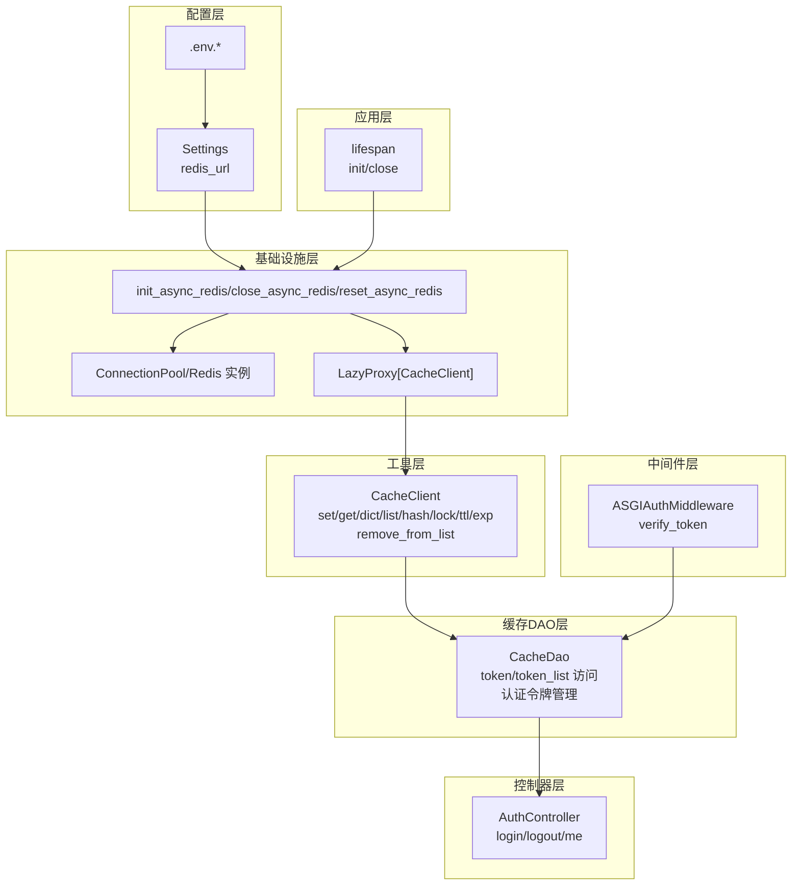
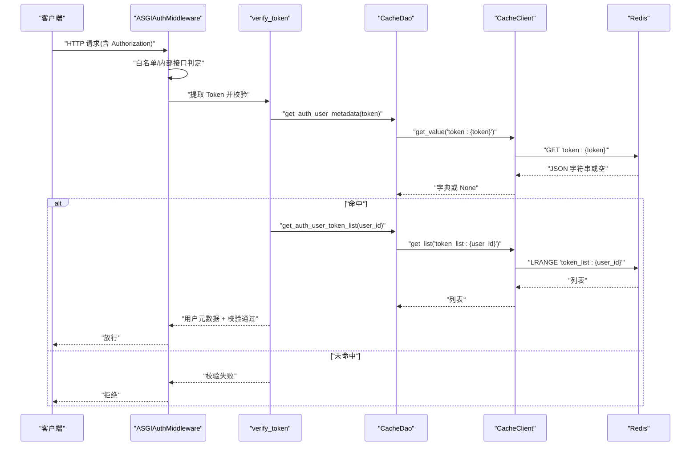
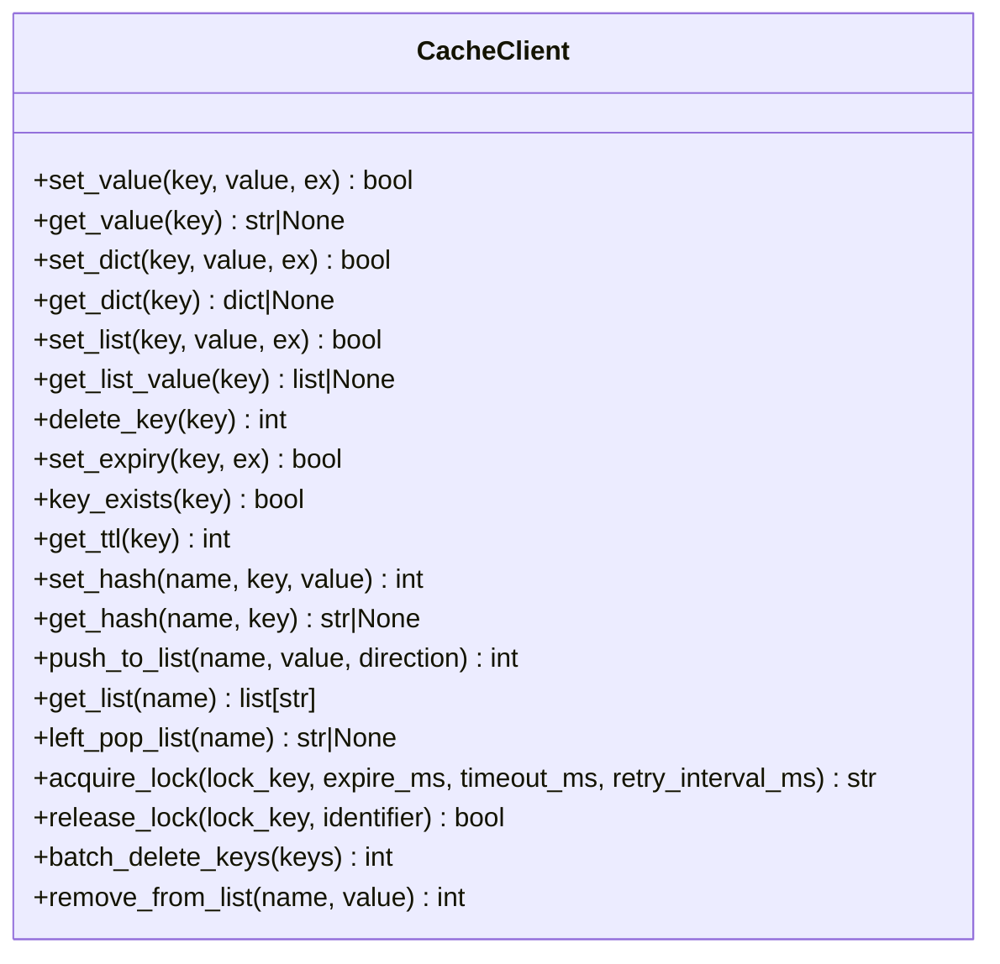
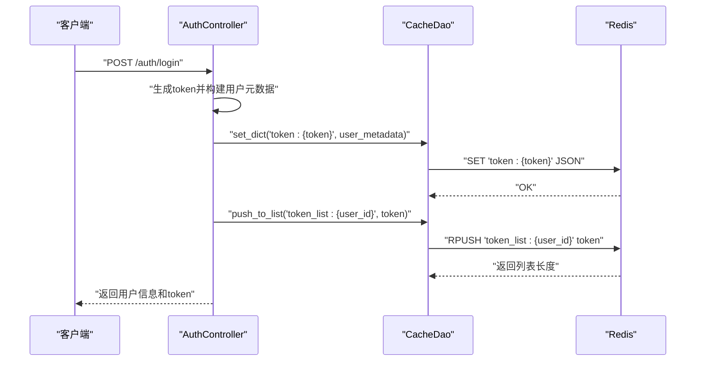
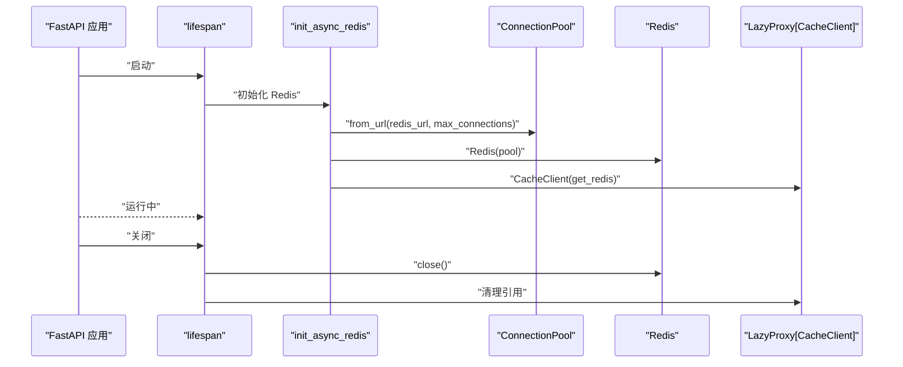
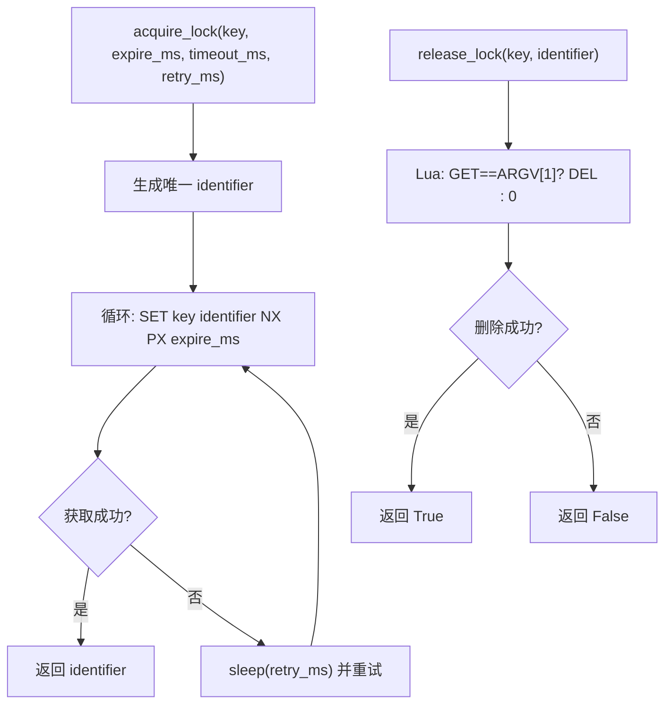
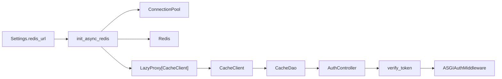

# 缓存系统

<cite>
**本文档引用的文件**
- [internal/infra/redis.py](file://internal/infra/redis.py)
- [pkg/toolkit/cache.py](file://pkg/toolkit/cache.py)
- [internal/cache/redis.py](file://internal/cache/redis.py)
- [internal/core/auth.py](file://internal/core/auth.py)
- [internal/middlewares/auth.py](file://internal/middlewares/auth.py)
- [internal/controllers/api/auth.py](file://internal/controllers/api/auth.py)
- [internal/app.py](file://internal/app.py)
- [internal/config/settings.py](file://internal/config/settings.py)
- [configs/.env.dev](file://configs/.env.dev)
- [pkg/toolkit/json.py](file://pkg/toolkit/json.py)
- [internal/constants/__init__.py](file://internal/constants/__init__.py)
</cite>

## 更新摘要
**变更内容**
- 新增专门的认证缓存DAO层，提供令牌管理和用户令牌列表管理
- 增强Redis列表操作能力，支持从列表中移除元素
- 完善认证令牌管理的完整生命周期（登录、登出、校验）
- 新增Redis列表操作的认证应用场景

## 目录
1. [简介](#简介)
2. [项目结构](#项目结构)
3. [核心组件](#核心组件)
4. [架构总览](#架构总览)
5. [详细组件分析](#详细组件分析)
6. [依赖关系分析](#依赖关系分析)
7. [性能考量](#性能考量)
8. [故障排查指南](#故障排查指南)
9. [结论](#结论)
10. [附录](#附录)

## 简介
本文件系统性地文档化本项目的缓存体系，重点涵盖：
- Redis 集成与生命周期管理
- 缓存客户端能力与数据结构操作
- 会话与认证流程中的缓存使用
- 缓存配置、过期与失效机制
- 缓存穿透与缓存雪崩的防护思路
- 与 DAO 层的集成关系与缓存更新策略
- 监控、统计与故障处理建议
- 常见问题与性能优化技巧

**更新** 本版本新增了专门的认证缓存DAO层，增强了Redis列表操作能力，完善了认证令牌的全生命周期管理。

## 项目结构
缓存系统围绕以下模块协同工作：
- 配置层：从环境变量加载 Redis 连接参数
- 基础设施层：初始化/关闭 Redis 连接池与缓存客户端
- 工具层：提供统一的缓存客户端与异常处理
- 缓存DAO层：专门处理认证相关的缓存操作
- 控制器层：在认证流程中使用缓存进行令牌管理
- 中间件层：在认证流程中使用缓存进行令牌校验
- 应用层：在应用生命周期内完成 Redis 初始化与关闭

```mermaid
graph TB
subgraph "配置层"
CFG["Settings<br/>redis_url"]
ENV[".env.*"]
end
subgraph "基础设施层"
INF["init_async_redis/close_async_redis/reset_async_redis"]
POOL["ConnectionPool/Redis 实例"]
CACHE_PROXY["LazyProxy[CacheClient]"]
end
subgraph "工具层"
CC["CacheClient<br/>set/get/dict/list/hash/lock/ttl/exp<br/>remove_from_list"]
end
subgraph "缓存DAO层"
CDAO["CacheDao<br/>token/token_list 访问<br/>认证令牌管理"]
end
subgraph "控制器层"
AUTHCTRL["AuthController<br/>login/logout/me"]
end
subgraph "中间件层"
AUTHMW["ASGIAuthMiddleware<br/>verify_token"]
end
subgraph "应用层"
LIFE["lifespan<br/>init/close"]
end
ENV --> CFG
CFG --> INF
INF --> POOL
INF --> CACHE_PROXY
CACHE_PROXY --> CC
CC --> CDAO
CDAO --> AUTHCTRL
AUTHMW --> CDAO
LIFE --> INF
```

**图表来源**
- [internal/config/settings.py](file://internal/config/settings.py#L215-L227)
- [internal/infra/redis.py](file://internal/infra/redis.py#L18-L97)
- [pkg/toolkit/cache.py](file://pkg/toolkit/cache.py#L41-L261)
- [internal/cache/redis.py](file://internal/cache/redis.py#L6-L41)
- [internal/controllers/api/auth.py](file://internal/controllers/api/auth.py#L47-L214)
- [internal/middlewares/auth.py](file://internal/middlewares/auth.py#L84-L147)
- [internal/app.py](file://internal/app.py#L84-L109)

**章节来源**
- [internal/config/settings.py](file://internal/config/settings.py#L67-L72)
- [internal/infra/redis.py](file://internal/infra/redis.py#L18-L97)
- [pkg/toolkit/cache.py](file://pkg/toolkit/cache.py#L41-L261)
- [internal/cache/redis.py](file://internal/cache/redis.py#L6-L41)
- [internal/controllers/api/auth.py](file://internal/controllers/api/auth.py#L47-L214)
- [internal/middlewares/auth.py](file://internal/middlewares/auth.py#L84-L147)
- [internal/app.py](file://internal/app.py#L84-L109)

## 核心组件
- 配置与连接
  - 通过 Settings 生成 redis_url，支持密码、主机、端口、DB 索引
  - 在应用生命周期内初始化 Redis 连接池与缓存客户端
- 缓存客户端
  - 提供键值、字典、列表、哈希、过期、TTL、分布式锁等常用操作
  - 统一异常包装与日志记录
  - **新增** 支持从列表中移除元素的 `remove_from_list` 操作
- 缓存DAO层
  - **新增** 专门处理认证场景的缓存访问对象
  - 提供令牌元数据与用户令牌列表的缓存读取与管理
  - 支持令牌的增删改查与列表操作
- 控制器与认证
  - **更新** 认证控制器使用缓存DAO进行完整的令牌生命周期管理
  - 支持登录时写入令牌、登出时移除令牌、查询用户信息
- 中间件与认证
  - ASGIAuthMiddleware 在请求进入业务逻辑前进行认证
  - verify_token 通过缓存DAO读取令牌与用户令牌列表进行校验

**章节来源**
- [internal/config/settings.py](file://internal/config/settings.py#L215-L227)
- [internal/infra/redis.py](file://internal/infra/redis.py#L18-L97)
- [pkg/toolkit/cache.py](file://pkg/toolkit/cache.py#L41-L261)
- [internal/cache/redis.py](file://internal/cache/redis.py#L6-L41)
- [internal/controllers/api/auth.py](file://internal/controllers/api/auth.py#L47-L214)
- [internal/core/auth.py](file://internal/core/auth.py#L5-L24)
- [internal/middlewares/auth.py](file://internal/middlewares/auth.py#L128-L146)

## 架构总览
下图展示了缓存系统在认证链路中的交互，包括新增的令牌管理流程：

```mermaid
sequenceDiagram
participant Client as "客户端"
participant MW as "ASGIAuthMiddleware"
participant AUTH as "verify_token"
participant CDAO as "CacheDao"
participant CC as "CacheClient"
participant R as "Redis"
Client->>MW : "HTTP 请求(含 Authorization)"
MW->>MW : "白名单/内部接口判定"
MW->>AUTH : "提取 Token 并校验"
AUTH->>CDAO : "get_auth_user_metadata(token)"
CDAO->>CC : "get_value('token : {token}')"
CC->>R : "GET 'token : {token}'"
R-->>CC : "JSON 字符串或空"
CC-->>CDAO : "字典或 None"
alt "命中"
AUTH->>CDAO : "get_auth_user_token_list(user_id)"
CDAO->>CC : "get_list('token_list : {user_id}')"
CC->>R : "LRANGE 'token_list : {user_id}'"
R-->>CC : "列表"
CC-->>CDAO : "列表"
AUTH-->>MW : "用户元数据 + 校验通过"
MW-->>Client : "放行"
else "未命中"
AUTH-->>MW : "校验失败"
MW-->>Client : "拒绝"
end
```

**图表来源**
- [internal/middlewares/auth.py](file://internal/middlewares/auth.py#L128-L146)
- [internal/core/auth.py](file://internal/core/auth.py#L5-L24)
- [internal/cache/redis.py](file://internal/cache/redis.py#L19-L33)
- [pkg/toolkit/cache.py](file://pkg/toolkit/cache.py#L54-L98)
- [internal/infra/redis.py](file://internal/infra/redis.py#L70-L84)

## 详细组件分析

### 缓存客户端 CacheClient
- 能力概览
  - 键值：set_value/get_value
  - 结构体：set_dict/get_dict、set_list/get_list_value、push_to_list/get_list/left_pop_list
  - 哈希：set_hash/get_hash
  - TTL：set_expiry/key_exists/get_ttl
  - 分布式锁：acquire_lock/release_lock
  - 批量：batch_delete_keys
  - **新增** 列表操作：remove_from_list（从列表中移除指定元素）
- 设计要点
  - 通过 session_provider 获取 Redis 会话，确保连接复用与生命周期管理
  - 统一异常包装为 RedisOperationError，便于上层捕获与降级
  - 使用 orjson 进行高性能序列化/反序列化
- 复杂度与性能
  - 基本操作为 O(1)，列表操作为 O(n)（n 为列表长度）
  - 分布式锁采用 SET NX PX 原语，避免 Lua 脚本开销
  - **新增** remove_from_list 使用 LREM 命令，复杂度为 O(n)

```mermaid
classDiagram
class CacheClient {
+set_value(key, value, ex) bool
+get_value(key) str|None
+set_dict(key, value, ex) bool
+get_dict(key) dict|None
+set_list(key, value, ex) bool
+get_list_value(key) list|None
+delete_key(key) int
+set_expiry(key, ex) bool
+key_exists(key) bool
+get_ttl(key) int
+set_hash(name, key, value) int
+get_hash(name, key) str|None
+push_to_list(name, value, direction) int
+get_list(name) list[str]
+left_pop_list(name) str|None
+acquire_lock(lock_key, expire_ms, timeout_ms, retry_interval_ms) str
+release_lock(lock_key, identifier) bool
+batch_delete_keys(keys) int
+remove_from_list(name, value) int
}
```

**图表来源**
- [pkg/toolkit/cache.py](file://pkg/toolkit/cache.py#L41-L261)

**章节来源**
- [pkg/toolkit/cache.py](file://pkg/toolkit/cache.py#L41-L261)
- [pkg/toolkit/json.py](file://pkg/toolkit/json.py#L69-L107)

### 专门的认证缓存DAO层
- **新增** CacheDao 类提供专门的认证缓存操作
- 键命名规范
  - 用户令牌元数据：token:{token}
  - 用户令牌列表：token_list:{user_id}
- 功能特性
  - 读取令牌元数据（JSON 字符串 -> dict）
  - 读取用户令牌列表（字符串列表）
  - **新增** 从列表中移除元素的操作
  - **新增** 令牌管理的辅助方法
- 与控制器协作
  - 认证控制器在登录时写入令牌元数据和用户令牌列表
  - 登出时从Redis中删除令牌并从用户令牌列表中移除
  - 中间件在鉴权阶段调用 verify_token，进而使用 CacheDao 完成校验

```mermaid
flowchart TD
Start(["开始: 验证 Token"]) --> GetMeta["读取令牌元数据<br/>GET 'token:{token}'"]
GetMeta --> MetaFound{"元数据存在?"}
MetaFound -- 否 --> Fail["返回校验失败"]
MetaFound -- 是 --> Parse["解析 JSON 为字典"]
Parse --> GetList["读取用户令牌列表<br/>LRANGE 'token_list:{user_id}'"]
GetList --> ListFound{"列表存在且包含 token?"}
ListFound -- 否 --> Fail
ListFound -- 是 --> Success["返回用户元数据 + 通过"]
```

**图表来源**
- [internal/cache/redis.py](file://internal/cache/redis.py#L19-L33)
- [internal/core/auth.py](file://internal/core/auth.py#L5-L24)

**章节来源**
- [internal/cache/redis.py](file://internal/cache/redis.py#L6-L41)
- [internal/core/auth.py](file://internal/core/auth.py#L5-L24)

### 认证控制器中的令牌管理
- **更新** 认证控制器使用缓存DAO进行完整的令牌生命周期管理
- 登录流程
  - 生成安全的随机token
  - 构建用户元数据并存储到Redis（键：token:{token}）
  - 将token添加到用户的令牌列表中（键：token_list:{user_id}）
- 登出流程
  - 从Redis中删除令牌键
  - 从用户的令牌列表中移除该token
- 用户信息查询
  - 从上下文中获取用户ID（由认证中间件设置）
  - 当前实现返回基本用户信息，可扩展为从数据库或缓存获取完整信息

```mermaid
sequenceDiagram
participant Client as "客户端"
participant Ctrl as "AuthController"
participant Cache as "CacheDao"
participant Redis as "Redis"
Client->>Ctrl : "POST /auth/login"
Ctrl->>Ctrl : "生成token并构建用户元数据"
Ctrl->>Cache : "set_dict('token : {token}', user_metadata)"
Cache->>Redis : "SET 'token : {token}' JSON"
Redis-->>Cache : "OK"
Ctrl->>Cache : "push_to_list('token_list : {user_id}', token)"
Cache->>Redis : "RPUSH 'token_list : {user_id}' token"
Redis-->>Cache : "返回列表长度"
Ctrl-->>Client : "返回用户信息和token"
```

**图表来源**
- [internal/controllers/api/auth.py](file://internal/controllers/api/auth.py#L47-L93)
- [internal/cache/redis.py](file://internal/cache/redis.py#L19-L33)

**章节来源**
- [internal/controllers/api/auth.py](file://internal/controllers/api/auth.py#L47-L214)
- [internal/cache/redis.py](file://internal/cache/redis.py#L6-L41)

### Redis 初始化与生命周期
- 初始化
  - 从 settings.redis_url 构建连接池
  - 创建 Redis 实例与 CacheClient
  - 通过 LazyProxy 暴露全局缓存客户端
- 关闭与重置
  - 正常关闭时释放连接
  - 重置用于 Celery 等场景下的事件循环切换
- 应用生命周期
  - 在 lifespan 中统一初始化与关闭

```mermaid
sequenceDiagram
participant App as "FastAPI 应用"
participant Life as "lifespan"
participant Infra as "init_async_redis"
participant Pool as "ConnectionPool"
participant Client as "Redis"
participant Proxy as "LazyProxy[CacheClient]"
App->>Life : "启动"
Life->>Infra : "初始化 Redis"
Infra->>Pool : "from_url(redis_url, max_connections)"
Infra->>Client : "Redis(pool)"
Infra->>Proxy : "CacheClient(get_redis)"
App-->>Life : "运行中"
App->>Life : "关闭"
Life->>Client : "close()"
Life->>Proxy : "清理引用"
```

**图表来源**
- [internal/infra/redis.py](file://internal/infra/redis.py#L18-L97)
- [internal/app.py](file://internal/app.py#L84-L109)

**章节来源**
- [internal/infra/redis.py](file://internal/infra/redis.py#L18-L97)
- [internal/app.py](file://internal/app.py#L84-L109)

### 分布式锁与并发控制
- 获取锁
  - 使用 SET key identifier NX PX expire_ms 原语，避免脚本开销
  - 循环重试，支持超时与间隔
- 释放锁
  - 使用 Lua 脚本判断锁值一致性后再删除，避免误删他人锁
- 使用建议
  - 为不同资源设定独立的锁键，必要时加前缀区分
  - 锁过期时间应短于业务执行时间，避免长时间阻塞

```mermaid
flowchart TD
A["acquire_lock(key, expire_ms, timeout_ms, retry_ms)"] --> B["生成唯一 identifier"]
B --> C["循环: SET key identifier NX PX expire_ms"]
C --> D{"获取成功?"}
D -- 是 --> E["返回 identifier"]
D -- 否 --> F["sleep(retry_ms) 并重试"]
F --> C
G["release_lock(key, identifier)"] --> H["Lua: GET==ARGV[1]? DEL : 0"]
H --> I{"删除成功?"}
I -- 是 --> J["返回 True"]
I -- 否 --> K["返回 False"]
```

**图表来源**
- [pkg/toolkit/cache.py](file://pkg/toolkit/cache.py#L200-L241)
- [pkg/toolkit/cache.py](file://pkg/toolkit/cache.py#L172-L199)
- [internal/constants/__init__.py](file://internal/constants/__init__.py#L1)

**章节来源**
- [pkg/toolkit/cache.py](file://pkg/toolkit/cache.py#L172-L241)
- [internal/constants/__init__.py](file://internal/constants/__init__.py#L1)

## 依赖关系分析
- 组件耦合
  - CacheClient 通过 session_provider 与 Redis 解耦
  - **新增** CacheDao 依赖全局 cache（LazyProxy[CacheClient]）
  - **更新** 认证控制器直接依赖 CacheDao
  - 中间件依赖 verify_token，verify_token 依赖 CacheDao
- 外部依赖
  - redis.asyncio 提供异步连接池与命令执行
  - orjson 提供高性能序列化
- 潜在风险
  - 直接 import cache 可能在初始化前导致 None
  - 通过 LazyProxy 与工厂函数规避初始化时序问题
  - **新增** CacheDao 的方法调用需要确保 Redis 已正确初始化

```mermaid
graph LR
Settings["Settings.redis_url"] --> Infra["init_async_redis"]
Infra --> Pool["ConnectionPool"]
Infra --> Redis["Redis"]
Infra --> Proxy["LazyProxy[CacheClient]"]
Proxy --> Cache["CacheClient"]
Cache --> Dao["CacheDao"]
Dao --> AuthCtrl["AuthController"]
AuthCtrl --> Auth["verify_token"]
Auth --> MW["ASGIAuthMiddleware"]
```

**图表来源**
- [internal/config/settings.py](file://internal/config/settings.py#L215-L227)
- [internal/infra/redis.py](file://internal/infra/redis.py#L18-L97)
- [pkg/toolkit/cache.py](file://pkg/toolkit/cache.py#L41-L98)
- [internal/cache/redis.py](file://internal/cache/redis.py#L6-L41)
- [internal/controllers/api/auth.py](file://internal/controllers/api/auth.py#L9-L19)
- [internal/core/auth.py](file://internal/core/auth.py#L5-L24)
- [internal/middlewares/auth.py](file://internal/middlewares/auth.py#L128-L146)

**章节来源**
- [internal/config/settings.py](file://internal/config/settings.py#L215-L227)
- [internal/infra/redis.py](file://internal/infra/redis.py#L18-L97)
- [pkg/toolkit/cache.py](file://pkg/toolkit/cache.py#L41-L98)
- [internal/cache/redis.py](file://internal/cache/redis.py#L6-L41)
- [internal/controllers/api/auth.py](file://internal/controllers/api/auth.py#L9-L19)
- [internal/core/auth.py](file://internal/core/auth.py#L5-L24)
- [internal/middlewares/auth.py](file://internal/middlewares/auth.py#L128-L146)

## 性能考量
- 连接与序列化
  - 使用连接池与 LazyProxy，避免重复初始化
  - 使用 orjson 进行高性能序列化/反序列化
- 操作选择
  - 读多写少场景优先使用 GET/LRANGE/HGET 等 O(1)/O(n) 命令
  - 列表操作注意 n 值，必要时分页或限制长度
  - **新增** remove_from_list 使用 LREM 命令，复杂度为 O(n)，适用于令牌移除场景
- 锁与并发
  - 使用原语 SET NX PX，减少脚本开销
  - 合理设置锁过期时间，避免长时间阻塞
- 监控与告警
  - 建议埋点统计 Redis 命中率、慢查询与异常次数
  - 结合应用日志与指标系统进行告警

## 故障排查指南
- 常见问题
  - Redis 未初始化：调用前检查 lifespan 是否执行
  - 键不存在：确认键命名与过期策略
  - 反序列化失败：检查存储值是否为有效 JSON
  - 分布式锁误释放：确保 identifier 一致
  - **新增** 列表操作失败：检查列表键是否存在，确认使用正确的方向参数
- 定位步骤
  - 查看应用日志中 Redis 初始化与异常记录
  - 在中间件与认证流程中增加关键路径日志
  - 使用 get_ttl/key_exists 辅助定位过期与存在性问题
  - **新增** 使用 get_list 检查用户令牌列表的内容和格式
- 降级策略
  - Redis 操作异常时快速失败并记录
  - 对读多写少场景可允许短暂降级读取数据库

**章节来源**
- [internal/infra/redis.py](file://internal/infra/redis.py#L70-L84)
- [pkg/toolkit/cache.py](file://pkg/toolkit/cache.py#L23-L38)
- [pkg/toolkit/cache.py](file://pkg/toolkit/cache.py#L118-L122)

## 结论
本项目的缓存系统以 Redis 为核心，结合统一的缓存客户端与懒加载代理，实现了认证链路中的高效令牌校验。通过合理的键命名、TTL 策略与分布式锁，系统在并发与可靠性方面具备良好基础。

**更新** 新版本新增了专门的认证缓存DAO层，增强了Redis列表操作能力，完善了认证令牌的全生命周期管理。系统现在能够更好地支持多令牌管理、令牌撤销和用户令牌列表维护等高级功能。

建议后续补充缓存穿透与雪崩的主动防护策略（如布隆过滤器、互斥锁与随机过期），并完善监控与告警体系。

## 附录

### 缓存配置与环境变量
- 关键配置项
  - REDIS_HOST、REDIS_PORT、REDIS_PASSWORD、REDIS_DB
  - ACCESS_TOKEN_EXPIRE_MINUTES（用于令牌过期时间）
- 环境示例
  - 开发环境示例文件包含上述配置项

**章节来源**
- [internal/config/settings.py](file://internal/config/settings.py#L67-L72)
- [configs/.env.dev](file://configs/.env.dev#L16-L21)

### 过期时间与失效机制
- TTL 查询与设置
  - get_ttl：获取剩余过期时间
  - set_expiry：设置过期时间（秒）
- 失效策略
  - 令牌过期：通过设置 ex 参数或单独调用 expire
  - 列表与哈希：按键维度分别管理过期

**章节来源**
- [pkg/toolkit/cache.py](file://pkg/toolkit/cache.py#L107-L122)

### 缓存穿透与缓存雪崩的防护思路
- 缓存穿透
  - 对空结果设置短 TTL 的占位键
  - 使用布隆过滤器在进入缓存前拦截无效查询
- 缓存雪崩
  - 对热点键设置随机过期抖动
  - 采用互斥锁只让一个请求重建缓存
  - 多级缓存（本地缓存 + Redis）降低单一节点压力

### 与DAO层的集成与更新策略
- 集成方式
  - **更新** CacheDao 通过全局 cache（LazyProxy[CacheClient]）访问 Redis
  - **新增** 认证控制器直接依赖 CacheDao 进行令牌管理
  - 中间件在请求入口调用 verify_token，间接使用 CacheDao
- 更新策略
  - 登录成功后写入 token:{token} 与 token_list:{user_id}
  - 退出登录或变更令牌时删除对应键或缩短 TTL
  - **新增** 使用 remove_from_list 从用户令牌列表中移除令牌
  - 列表维护采用 LPUSH/LREM 等原子操作

**章节来源**
- [internal/cache/redis.py](file://internal/cache/redis.py#L6-L41)
- [internal/controllers/api/auth.py](file://internal/controllers/api/auth.py#L47-L214)
- [internal/middlewares/auth.py](file://internal/middlewares/auth.py#L128-L146)
- [pkg/toolkit/cache.py](file://pkg/toolkit/cache.py#L141-L170)
- [pkg/toolkit/cache.py](file://pkg/toolkit/cache.py#L251-L261)

### Redis列表操作的认证应用场景
- **新增** 用户令牌列表管理
  - 每个用户维护一个令牌列表，用于令牌撤销和批量管理
  - 支持向列表添加新令牌和从列表移除旧令牌
  - 支持查询用户的所有有效令牌
- **新增** 令牌撤销机制
  - 登出时从Redis中删除令牌键
  - 从用户令牌列表中移除该令牌
  - 确保令牌无法再次使用
- **新增** 令牌校验流程
  - 首先检查令牌元数据是否存在
  - 然后检查令牌是否在用户令牌列表中
  - 双重校验确保令牌有效性

**章节来源**
- [internal/cache/redis.py](file://internal/cache/redis.py#L19-L33)
- [internal/controllers/api/auth.py](file://internal/controllers/api/auth.py#L96-L130)
- [internal/core/auth.py](file://internal/core/auth.py#L5-L24)