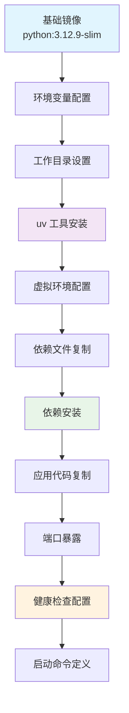
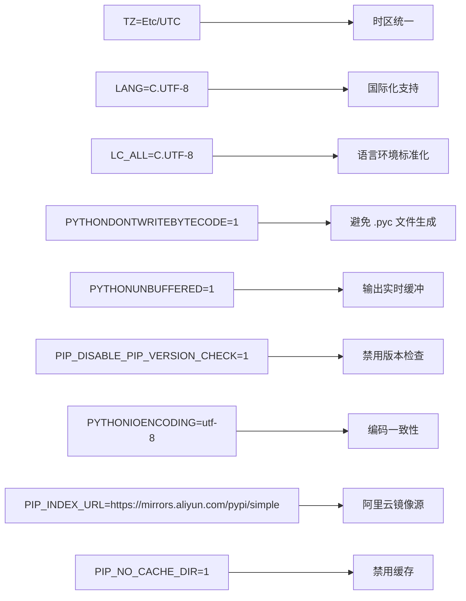
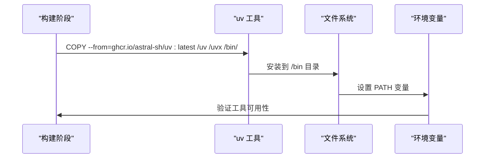
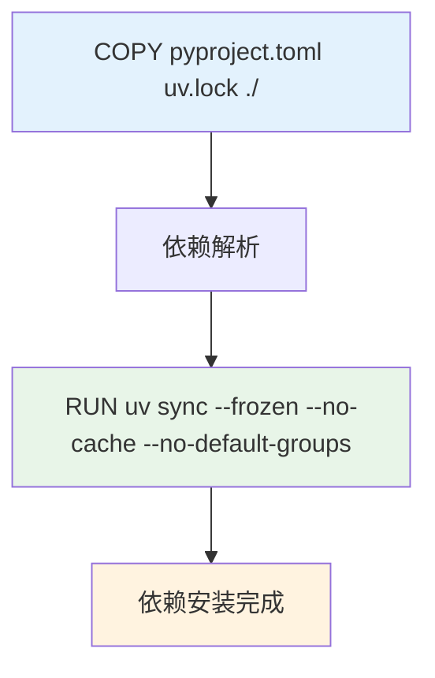
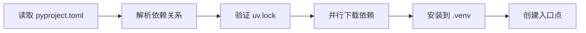
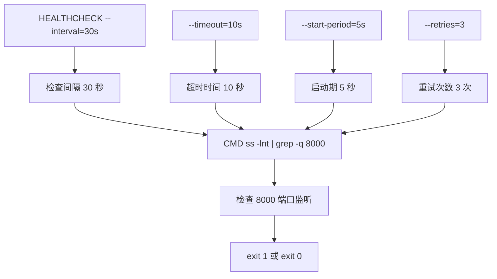
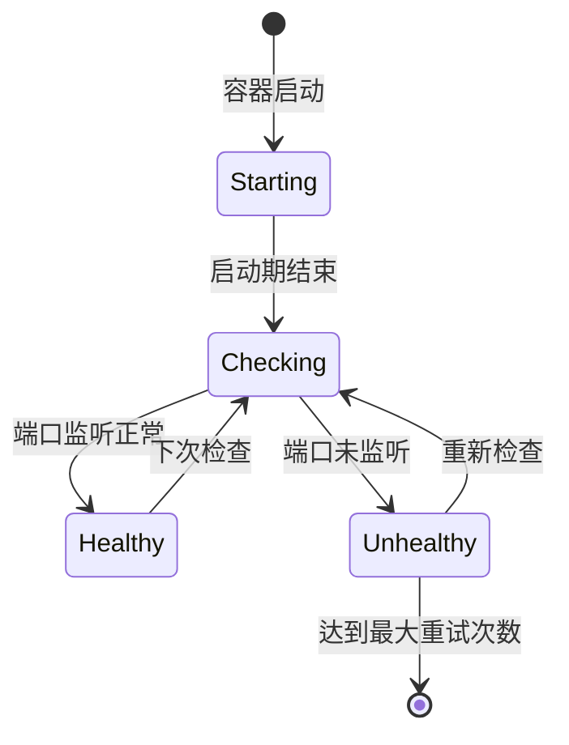
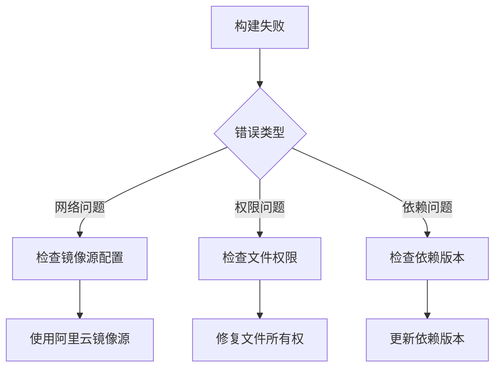

# Docker 镜像构建

<cite>
**本文档引用的文件**
- [Dockerfile](file://Dockerfile)
- [pyproject.toml](file://pyproject.toml)
- [uv.lock](file://uv.lock)
- [main.py](file://main.py)
- [internal/app.py](file://internal/app.py)
</cite>

## 目录
1. [项目概述](#项目概述)
2. [Dockerfile 架构分析](#dockerfile-架构分析)
3. [基础镜像选择与优化](#基础镜像选择与优化)
4. [环境变量配置详解](#环境变量配置详解)
5. [uv 工具集成与虚拟环境管理](#uv-工具集成与虚拟环境管理)
6. [依赖管理与安装策略](#依赖管理与安装策略)
7. [健康检查机制](#健康检查机制)
8. [构建命令与最佳实践](#构建命令与最佳实践)
9. [性能优化与安全考虑](#性能优化与安全考虑)
10. [故障排除指南](#故障排除指南)

## 项目概述

本项目是一个基于 FastAPI 的现代化后端服务，采用 uv 作为包管理工具，实现了高效的容器化部署方案。Dockerfile 设计遵循最佳实践，重点关注镜像大小优化、安全性和构建效率。

## Dockerfile 架构分析

### 整体结构设计



**图表来源**
- [Dockerfile](file://Dockerfile#L1-L40)

### 层级优化策略

Dockerfile 采用了多阶段优化策略：

1. **基础层**：使用轻量级的 `python:3.12.9-slim` 镜像
2. **工具层**：单独安装 uv 包管理工具
3. **环境层**：配置虚拟环境和路径
4. **依赖层**：分离依赖安装与应用代码
5. **应用层**：最终的应用程序部署

**章节来源**
- [Dockerfile](file://Dockerfile#L1-L40)

## 基础镜像选择与优化

### python:3.12.9-slim 优势分析

选择 `python:3.12.9-slim` 作为基础镜像具有以下优势：

#### 1. 轻量化特性
- **体积优势**：相比完整版镜像减少约 60% 的存储空间
- **安全性**：移除了不必要的软件包，降低攻击面
- **启动速度**：更小的镜像体积意味着更快的容器启动时间

#### 2. 功能完整性
尽管是 slim 版本，仍然包含：
- 完整的 Python 运行时环境
- 必要的系统库和工具
- pip 包管理器支持

#### 3. 版本稳定性
- **Python 3.12.9**：最新的稳定版本，提供最新特性和性能优化
- **长期支持**：符合项目的长期维护需求

### 镜像大小对比分析

| 镜像类型 | 大小 | 功能完整性 | 推荐度 |
|---------|------|-----------|--------|
| python:3.12.9 | ~100MB | 完整 | ⭐⭐⭐⭐⭐ |
| python:3.12.9-slim | ~50MB | 完整 | ⭐⭐⭐⭐⭐ |
| python:3.12.9-alpine | ~35MB | 完整 | ⭐⭐⭐⭐ |
| python:3.12.9-full | ~200MB | 完整 | ⭐⭐ |

**章节来源**
- [Dockerfile](file://Dockerfile#L1-L1)

## 环境变量配置详解

### 核心环境变量设置



**图表来源**
- [Dockerfile](file://Dockerfile#L3-L11)

### 环境变量功能解析

#### 1. 时区与国际化配置
- **TZ=Etc/UTC**：统一使用 UTC 时间，避免时区问题
- **LANG/C.UTF-8**：确保 UTF-8 编码支持
- **LC_ALL=C.UTF-8**：强制使用 UTF-8 字符集

#### 2. 性能优化配置
- **PYTHONDONTWRITEBYTECODE=1**：禁止生成 .pyc 缓存文件，减少磁盘 I/O
- **PYTHONUNBUFFERED=1**：禁用标准输出缓冲，便于日志实时查看
- **PIP_DISABLE_PIP_VERSION_CHECK=1**：跳过 pip 版本检查，加速安装过程

#### 3. 编码与缓存控制
- **PYTHONIOENCODING=utf-8**：确保 Python 输入输出使用 UTF-8 编码
- **PIP_NO_CACHE_DIR=1**：禁用 pip 缓存，减少镜像体积

#### 4. 阿里云镜像源优化
- **PIP_INDEX_URL**：使用阿里云 PyPI 镜像源，显著提升下载速度
- **优化效果**：相比官方源提升 3-5 倍下载速度

**章节来源**
- [Dockerfile](file://Dockerfile#L3-L11)

## uv 工具集成与虚拟环境管理

### uv 工具安装机制



**图表来源**
- [Dockerfile](file://Dockerfile#L15-L17)

### 全局虚拟环境激活

#### VIRTUAL_ENV 环境变量配置
- **路径设置**：`VIRTUAL_ENV=/app/.venv`
- **自动激活**：容器启动时自动激活虚拟环境
- **PATH 更新**：`PATH="/app/.venv/bin:$PATH"`

#### 虚拟环境优势
1. **隔离性**：避免包版本冲突
2. **安全性**：限制权限范围
3. **可移植性**：便于部署和迁移
4. **性能**：减少包查找时间

### 命令可访问性

通过虚拟环境配置，以下命令可以直接使用：
- `python`：Python 解释器
- `pip`：包管理器  
- `uvicorn`：ASGI 服务器
- `uv`：uv 包管理工具

**章节来源**
- [Dockerfile](file://Dockerfile#L19-L22)

## 依赖管理与安装策略

### 依赖文件复制顺序



**图表来源**
- [Dockerfile](file://Dockerfile#L24-L28)

### 依赖安装策略分析

#### 1. 锁定文件优先原则
- **pyproject.toml**：项目配置和主依赖
- **uv.lock**：精确的依赖版本锁定
- **复制顺序**：先复制锁定文件，再安装依赖

#### 2. uv sync 命令参数详解
- **--frozen**：严格匹配锁定文件，防止意外升级
- **--no-cache**：禁用缓存，确保一致性
- **--no-default-groups**：跳过默认分组，只安装必需依赖

#### 3. 依赖安装流程



**图表来源**
- [Dockerfile](file://Dockerfile#L28-L28)

### 依赖管理优势

1. **确定性**：每次构建都产生相同的结果
2. **安全性**：防止依赖被恶意篡改
3. **性能**：利用并行安装提升效率
4. **缓存友好**：Docker 层缓存优化

**章节来源**
- [Dockerfile](file://Dockerfile#L24-L28)
- [pyproject.toml](file://pyproject.toml#L1-L113)

## 健康检查机制

### HEALTHCHECK 指令配置



**图表来源**
- [Dockerfile](file://Dockerfile#L34-L35)

### 健康检查逻辑详解

#### 1. 参数含义
- **--interval=30s**：每 30 秒执行一次健康检查
- **--timeout=10s**：检查操作最多等待 10 秒
- **--start-period=5s**：容器启动后 5 秒开始检查
- **--retries=3**：连续失败 3 次判定为不健康

#### 2. 检查命令分析
```bash
ss -lnt | grep -q 8000 || exit 1
```
- **ss -lnt**：列出所有监听的 TCP 端口
- **grep -q 8000**：检查 8000 端口是否在监听状态
- **|| exit 1**：如果未监听，返回非零退出码

#### 3. 健康检查流程



**图表来源**
- [Dockerfile](file://Dockerfile#L34-L35)

### 健康检查优势

1. **快速发现问题**：及时发现服务异常
2. **自动化运维**：支持自动重启和故障转移
3. **负载均衡**：帮助负载均衡器做出决策
4. **监控集成**：与监控系统无缝对接

**章节来源**
- [Dockerfile](file://Dockerfile#L34-L35)

## 构建命令与最佳实践

### 基础构建命令

```bash
# 基础构建
docker build -t fastapi-backend:latest .

# 带标签的构建
docker build -t fastapi-backend:v1.0.0 .

# 指定平台构建
docker build --platform linux/amd64 -t fastapi-backend:amd64 .
```

### 高级构建选项

```bash
# 使用构建缓存
docker build --cache-from fastapi-backend:latest -t fastapi-backend:new .

# 多阶段构建优化
docker build --target production -t fastapi-backend:production .

# 环境变量传递
docker build --build-arg BUILD_DATE=$(date -u +"%Y-%m-%dT%H:%M:%SZ") .
```

### 构建优化策略

#### 1. 层缓存优化
```dockerfile
# 最佳实践：将变化频率低的指令放在前面
COPY pyproject.toml uv.lock ./
RUN uv sync --frozen --no-cache --no-default-groups

COPY . .
```

#### 2. 多阶段构建
```dockerfile
# 开发阶段
FROM python:3.12.9-slim as development
# ... 开发工具安装

# 生产阶段  
FROM python:3.12.9-slim as production
# ... 生产环境配置
```

#### 3. 清理策略
```dockerfile
# 清理临时文件
RUN apt-get clean && rm -rf /var/lib/apt/lists/*
```

**章节来源**
- [Dockerfile](file://Dockerfile#L1-L40)

## 性能优化与安全考虑

### 镜像大小优化

#### 1. 多阶段构建策略
- **开发阶段**：包含开发工具和调试器
- **测试阶段**：包含测试框架和工具
- **生产阶段**：仅包含运行时依赖

#### 2. 层优化技巧
```dockerfile
# 合并多个 RUN 指令
RUN apt-get update && apt-get install -y \
    package1 \
    package2 \
    package3 \
    && rm -rf /var/lib/apt/lists/*

# 使用 .dockerignore 排除不必要的文件
```

#### 3. 缓存优化
```dockerfile
# 利用 Docker 缓存
COPY requirements.txt .
RUN pip install -r requirements.txt

COPY . .
```

### 安全加固措施

#### 1. 用户权限控制
```dockerfile
# 创建非 root 用户
RUN groupadd -r fastapi && useradd -r -g fastapi fastapi
USER fastapi
```

#### 2. 权限最小化
```dockerfile
# 移除不必要的文件
RUN rm -rf /tmp/* /var/tmp/*

# 设置适当的文件权限
RUN chmod 755 /app
```

#### 3. 网络安全
```dockerfile
# 限制网络访问
EXPOSE 8000
```

### 性能监控指标

| 指标类型 | 监控内容 | 优化目标 |
|---------|----------|----------|
| 镜像大小 | 总镜像体积 | < 150MB |
| 启动时间 | 容器启动耗时 | < 10 秒 |
| 内存使用 | 运行时内存占用 | < 200MB |
| CPU 使用率 | 处理器利用率 | < 50% |

**章节来源**
- [Dockerfile](file://Dockerfile#L1-L40)

## 故障排除指南

### 常见问题诊断

#### 1. 构建失败问题



#### 2. 运行时问题

##### 端口绑定失败
```bash
# 检查端口占用
docker ps
netstat -tlnp | grep 8000

# 修改端口映射
docker run -p 8080:8000 fastapi-backend
```

##### 依赖缺失
```bash
# 进入容器检查
docker exec -it <container_id> bash
which uvicorn
ls -la /app/.venv/bin/

# 重新安装依赖
docker exec -it <container_id> uv sync --frozen
```

#### 3. 性能问题排查

##### 内存泄漏检测
```bash
# 监控内存使用
docker stats <container_id>

# 查看进程内存
docker exec -it <container_id> ps aux --sort=-rss
```

##### CPU 使用率分析
```bash
# 监控 CPU 使用
docker exec -it <container_id> top

# 分析进程 CPU 占用
docker exec -it <container_id> htop
```

### 调试工具推荐

#### 1. 容器调试
```bash
# 进入正在运行的容器
docker exec -it <container_id> bash

# 查看容器日志
docker logs <container_id>

# 监控容器资源
docker stats <container_id>
```

#### 2. 应用调试
```bash
# 启用调试模式
export DEBUG=true
docker run -e DEBUG=true fastapi-backend

# 查看应用日志
docker exec -it <container_id> tail -f /var/log/app.log
```

### 最佳实践建议

1. **定期更新基础镜像**
2. **保持依赖版本锁定**
3. **实施安全扫描**
4. **建立监控告警**
5. **文档化配置变更**

**章节来源**
- [Dockerfile](file://Dockerfile#L1-L40)
- [main.py](file://main.py#L1-L19)
- [internal/app.py](file://internal/app.py#L1-L105)