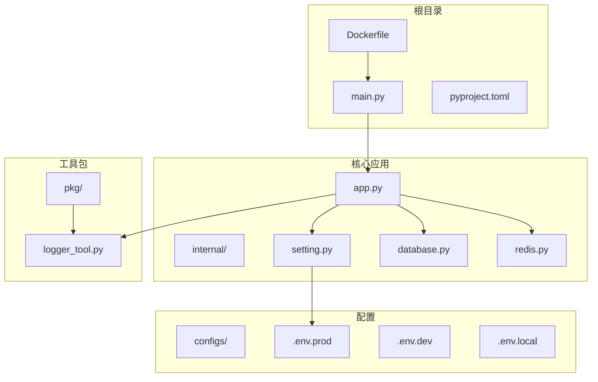
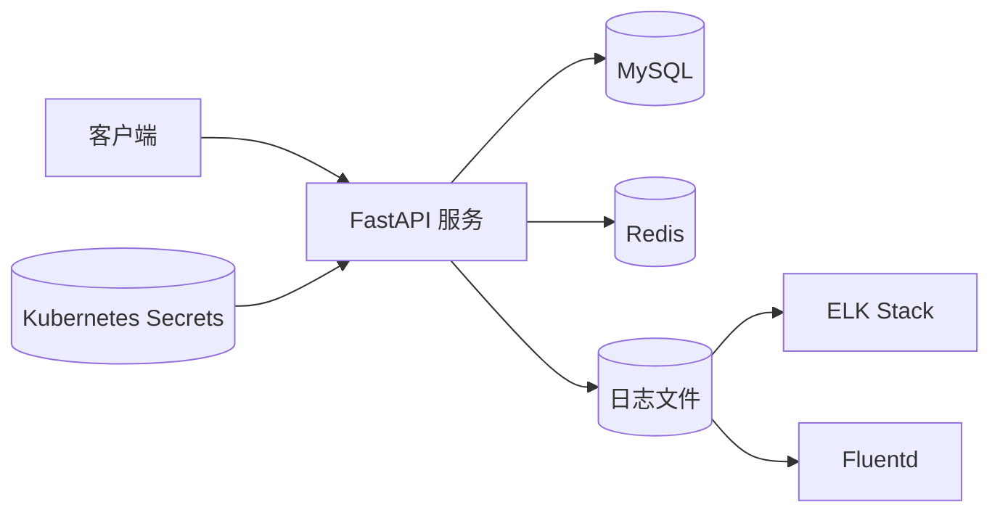
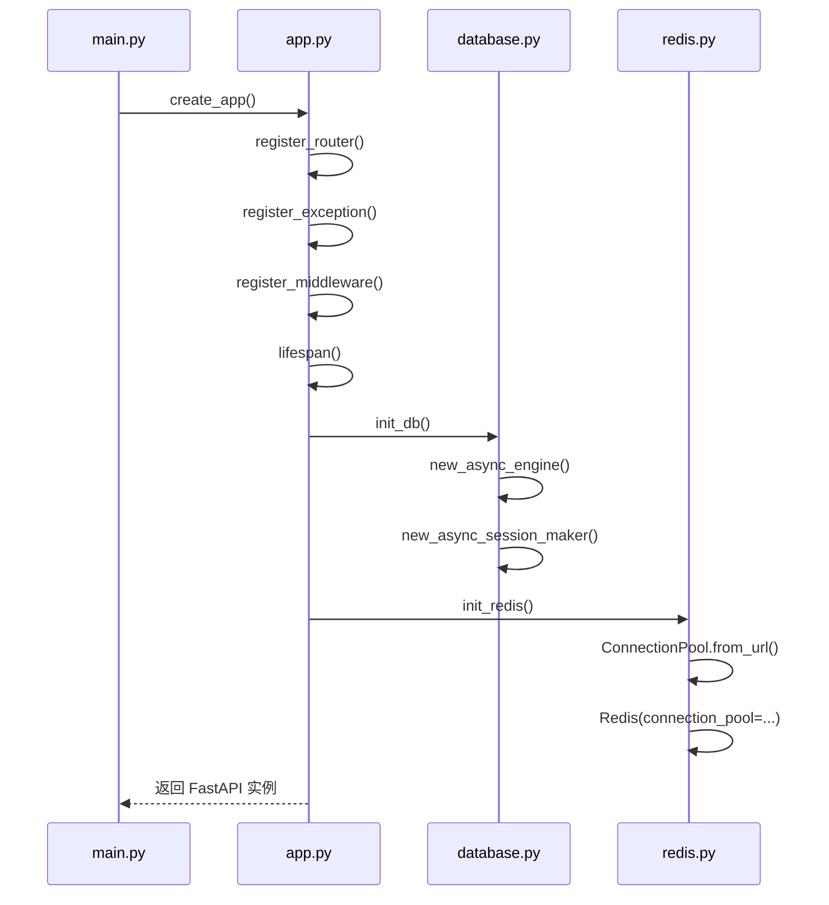
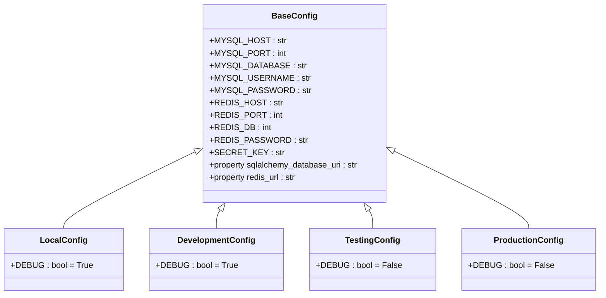
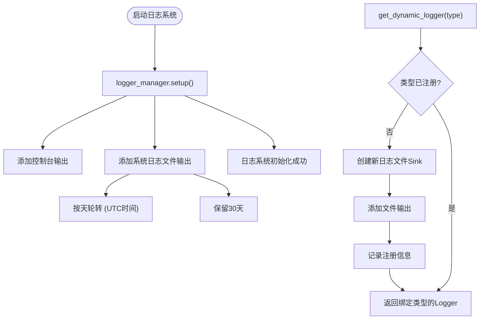
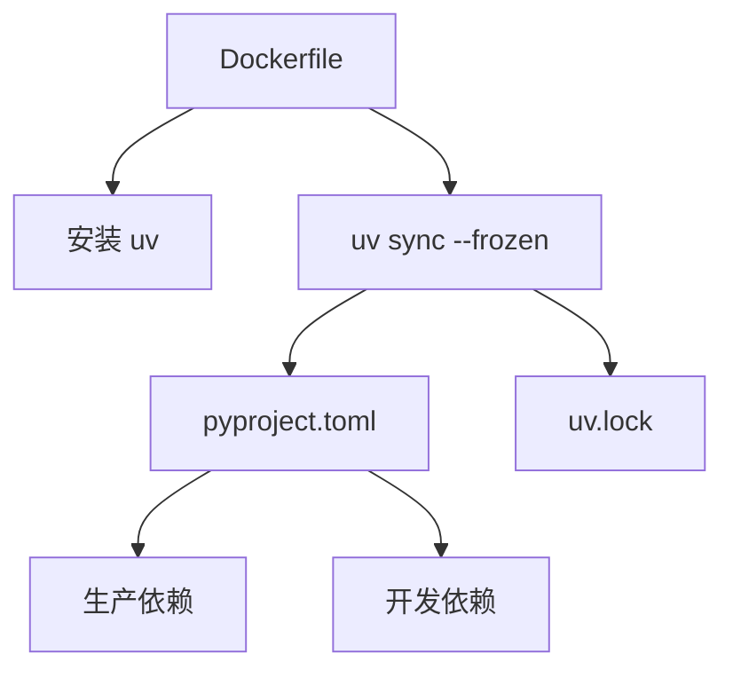

# 容器化部署

<cite>
**本文档中引用的文件**  
- [Dockerfile](file://Dockerfile)
- [main.py](file://main.py)
- [internal/app.py](file://internal/app.py)
- [internal/config/setting.py](file://internal/config/setting.py)
- [configs/.env.prod](file://configs/.env.prod)
- [internal/infra/database.py](file://internal/infra/database.py)
- [internal/infra/redis.py](file://internal/infra/redis.py)
- [pkg/logger_tool.py](file://pkg/logger_tool.py)
- [pyproject.toml](file://pyproject.toml)
</cite>

## 目录
1. [简介](#简介)
2. [项目结构](#项目结构)
3. [核心组件](#核心组件)
4. [架构概述](#架构概述)
5. [详细组件分析](#详细组件分析)
6. [依赖分析](#依赖分析)
7. [性能考虑](#性能考虑)
8. [故障排除指南](#故障排除指南)
9. [结论](#结论)

## 简介
本文档提供完整的容器化部署指南，涵盖如何运行已构建的 Docker 镜像、使用环境变量或配置文件注入生产环境配置、端口映射与容器命名等运行时选项。同时提供 `docker-compose.yml` 示例配置，并介绍在 Kubernetes 中部署该 FastAPI 应用的方法，包括资源限制、健康检查探针、日志收集和 Secret 管理。

## 项目结构

本项目采用模块化分层结构，主要目录包括：

- `configs/`：存放不同环境的 `.env` 配置文件
- `internal/`：核心业务逻辑，包含配置、控制器、数据访问对象（DAO）、模型、服务等
- `pkg/`：通用工具包，如日志、数据库连接、缓存、JWT 等
- 根目录包含 `Dockerfile`、`pyproject.toml`、`main.py` 等关键部署与启动文件

**Diagram sources**  
- [Dockerfile](file://Dockerfile#L1-L40)
- [main.py](file://main.py#L1-L19)
- [internal/app.py](file://internal/app.py#L1-L105)
- [internal/config/setting.py](file://internal/config/setting.py#L1-L59)

**Section sources**  
- [Dockerfile](file://Dockerfile#L1-L40)
- [main.py](file://main.py#L1-L19)
- [internal/app.py](file://internal/app.py#L1-L105)

## 核心组件

项目核心由 FastAPI 框架驱动，通过 `main.py` 启动应用，调用 `internal/app.py` 中的 `create_app()` 函数初始化应用实例。应用生命周期（lifespan）管理数据库和 Redis 连接的初始化与关闭。配置系统基于 Pydantic 的 `BaseSettings` 实现，支持多环境配置加载（dev、test、prod、local），并通过 `.env` 文件注入敏感信息。

环境变量 `SYS_ENV` 决定当前运行环境，进而加载对应的 `.env.{env}` 文件。日志系统使用 `loguru` 并封装为 `LoggerManager`，支持按类型动态创建日志文件，且默认以 UTC 时间轮转。

**Section sources**  
- [main.py](file://main.py#L1-L19)
- [internal/app.py](file://internal/app.py#L1-L105)
- [internal/config/setting.py](file://internal/config/setting.py#L1-L59)
- [pkg/logger_tool.py](file://pkg/logger_tool.py#L1-L275)

## 架构概述

系统采用典型的 FastAPI 微服务架构，前端通过 API 网关或直接访问后端服务。后端服务容器化部署，依赖外部 MySQL 和 Redis 服务。日志输出到本地文件并可对接 ELK 或 Fluentd。Kubernetes 部署时通过 Secrets 管理数据库凭证等敏感信息。

**Diagram sources**  
- [internal/infra/database.py](file://internal/infra/database.py#L1-L140)
- [internal/infra/redis.py](file://internal/infra/redis.py#L1-L86)
- [pkg/logger_tool.py](file://pkg/logger_tool.py#L1-L275)

## 详细组件分析

### 应用初始化分析

应用通过 `create_app()` 函数创建 FastAPI 实例，并注册路由、异常处理器和中间件。`lifespan` 事件处理器确保在应用启动时初始化数据库和 Redis 连接池，并在关闭时正确释放资源。

**Diagram sources**  
- [main.py](file://main.py#L1-L19)
- [internal/app.py](file://internal/app.py#L1-L105)
- [internal/infra/database.py](file://internal/infra/database.py#L1-L140)
- [internal/infra/redis.py](file://internal/infra/redis.py#L1-L86)

**Section sources**  
- [internal/app.py](file://internal/app.py#L1-L105)
- [internal/infra/database.py](file://internal/infra/database.py#L1-L140)
- [internal/infra/redis.py](file://internal/infra/redis.py#L1-L86)

### 配置系统分析

配置系统采用策略模式，根据 `SYS_ENV` 环境变量选择对应的配置类（`LocalConfig`, `DevelopmentConfig`, `ProductionConfig` 等）。每个配置类通过 `Config` 内部类指定对应的 `.env` 文件路径。

**Diagram sources**  
- [internal/config/setting.py](file://internal/config/setting.py#L1-L59)
- [internal/config/__init__.py](file://internal/config/__init__.py#L44-L86)

**Section sources**  
- [internal/config/setting.py](file://internal/config/setting.py#L1-L59)

### 日志系统分析

日志系统基于 `loguru` 封装，支持控制台和文件双输出，文件按天轮转并保留30天。支持动态创建按类型划分的日志记录器，并可选择是否以 JSON 格式输出。

**Diagram sources**  
- [pkg/logger_tool.py](file://pkg/logger_tool.py#L1-L275)

**Section sources**  
- [pkg/logger_tool.py](file://pkg/logger_tool.py#L1-L275)

## 依赖分析

项目依赖通过 `pyproject.toml` 管理，使用 `uv` 工具进行依赖安装。生产依赖包括 FastAPI、SQLAlchemy、Redis、Celery、APScheduler、loguru 等。开发依赖包含 pytest、ruff、black 等代码质量工具。

Docker 镜像构建时从 `pyproject.toml` 和 `uv.lock` 安装依赖，确保环境一致性。

**Diagram sources**  
- [Dockerfile](file://Dockerfile#L1-L40)
- [pyproject.toml](file://pyproject.toml#L1-L113)

**Section sources**  
- [pyproject.toml](file://pyproject.toml#L1-L113)
- [Dockerfile](file://Dockerfile#L1-L40)

## 性能考虑

- **数据库连接池**：使用 SQLAlchemy 异步引擎，配置 `pool_size=10`, `max_overflow=20`，避免连接风暴。
- **Redis 连接**：使用连接池，`max_connections` 可通过配置调整。
- **日志性能**：使用 `enqueue=True` 启用异步日志写入，避免阻塞主线程。
- **序列化优化**：使用 `orjson` 替代标准 `json`，提升序列化性能。
- **HTTP 服务器**：使用 `uvicorn` 配合 `uvloop` 和 `httptools`，最大化异步性能。

## 故障排除指南

### 常见问题

1. **容器启动失败**
   - 检查 `SYS_ENV` 是否正确设置（local, dev, test, prod）
   - 确认 `.env.{env}` 文件存在且路径正确
   - 检查数据库和 Redis 服务是否可达

2. **健康检查失败**
   - 确保应用监听 `0.0.0.0:8000`
   - 检查 `HEALTHCHECK` 命令是否能正确执行 `ss -lnt | grep -q 8000`

3. **日志未输出**
   - 检查容器内 `/app/logs` 目录权限
   - 确认 `logger_manager.setup()` 已调用

4. **数据库连接超时**
   - 检查 `MYSQL_HOST` 是否为容器网络内可访问地址
   - 验证用户名密码正确性

**Section sources**  
- [Dockerfile](file://Dockerfile#L34-L35)
- [internal/app.py](file://internal/app.py#L84-L85)
- [internal/infra/database.py](file://internal/infra/database.py#L37-L47)
- [pkg/logger_tool.py](file://pkg/logger_tool.py#L76-L127)

## 结论

本项目已具备完整的容器化部署能力。通过 `Dockerfile` 构建镜像，支持通过环境变量或 `.env` 文件注入配置。推荐在生产环境中使用 Kubernetes 部署，结合 Secrets 管理敏感信息，配置合理的资源限制与健康探针，并通过 Fluentd 或 Filebeat 将日志发送至集中式日志系统（如 ELK）进行分析与监控。