# 部署与运维

<cite>
**本文档中引用的文件**
- [Dockerfile](file://Dockerfile)
- [pyproject.toml](file://pyproject.toml)
- [scripts/run_celery_worker.py](file://scripts/run_celery_worker.py)
- [configs/.env.prod](file://configs/.env.prod)
- [internal/app.py](file://internal/app.py)
- [internal/infra/celery.py](file://internal/infra/celery.py)
- [internal/config/setting.py](file://internal/config/setting.py)
- [internal/config/__init__.py](file://internal/config/__init__.py)
- [main.py](file://main.py)
- [pkg/logger_tool.py](file://pkg/logger_tool.py)
</cite>

## 目录
1. [概述](#概述)
2. [Docker 镜像构建](#docker-镜像构建)
3. [应用服务部署](#应用服务部署)
4. [Celery Worker 部署](#celery-worker-部署)
5. [Kubernetes 部署配置](#kubernetes-部署配置)
6. [环境变量与配置管理](#环境变量与配置管理)
7. [健康检查与监控](#健康检查与监控)
8. [日志收集与管理](#日志收集与管理)
9. [Secret 管理](#secret-管理)
10. [故障排除指南](#故障排除指南)

## 概述

本项目采用现代化的微服务架构，包含 FastAPI Web 服务和 Celery 异步任务处理系统。部署方案支持 Docker 容器化和 Kubernetes 编排，提供完整的生产环境部署解决方案。

### 技术栈特点
- **Web 服务**: FastAPI + Uvicorn + uvloop + httptools
- **异步任务**: Celery + Redis + APScheduler
- **数据库**: MySQL + SQLAlchemy
- **缓存**: Redis
- **容器化**: Docker + Docker Compose
- **编排**: Kubernetes 支持

## Docker 镜像构建

### Dockerfile 层级分析

项目使用分层构建策略，优化镜像大小和构建性能：

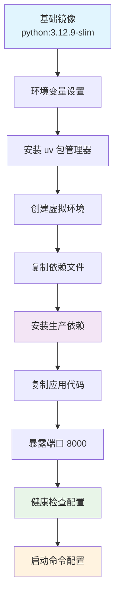

**图表来源**
- [Dockerfile](file://Dockerfile#L1-L40)

#### 1. 基础镜像层
- **镜像选择**: `python:3.12.9-slim` 提供最小化的基础环境
- **优势**: 减少镜像大小，降低安全风险
- **适用场景**: 生产环境部署

#### 2. 环境变量配置层
- **时区设置**: `TZ=Etc/UTC` 统一时间标准
- **编码配置**: `LANG=C.UTF-8` 和 `LC_ALL=C.UTF-8` 确保字符编码一致性
- **Python 优化**: `PYTHONDONTWRITEBYTECODE=1` 和 `PYTHONUNBUFFERED=1` 提升性能

#### 3. 包管理器安装层
- **uv 工具**: 从 `ghcr.io/astral-sh/uv:latest` 复制 uv 和 uvx 工具
- **优势**: 高性能的 Python 包管理器，替代传统 pip

#### 4. 虚拟环境配置层
- **全局激活**: 设置 `VIRTUAL_ENV` 和 `PATH` 环境变量
- **自动检测**: uv 会自动检测虚拟环境位置

#### 5. 依赖安装层
- **冻结安装**: 使用 `--frozen --no-cache --no-default-groups` 参数
- **优势**: 确保依赖版本一致性，避免缓存问题

#### 6. 应用代码层
- **完整复制**: 将整个项目目录复制到容器中
- **工作目录**: `/app` 作为应用的工作目录

#### 7. 端口与健康检查层
- **端口暴露**: `EXPOSE 8000` 暴露 Web 服务端口
- **健康检查**: 使用 `ss -lnt | grep -q 8000` 检查端口监听状态

#### 8. 启动命令层
- **高性能配置**: 启用 `uvloop` 和 `httptools`
- **访问日志**: 启用详细的访问日志记录

**章节来源**
- [Dockerfile](file://Dockerfile#L1-L40)

### 镜像构建流程

```bash
# 构建生产环境镜像
docker build -t fastapi-backend:prod .

# 构建并标记最新版本
docker build -t fastapi-backend:latest .

# 指定构建上下文
docker build -t fastapi-backend:prod .

# 查看镜像详情
docker inspect fastapi-backend:prod
```

### 容器运行配置

```bash
# 运行生产环境容器
docker run -d \
  --name fastapi-backend-prod \
  -p 8000:8000 \
  -v /path/to/prod/env:/app/configs/.env.prod \
  -v /path/to/logs:/app/logs \
  -v /path/to/data:/app/data \
  --restart unless-stopped \
  fastapi-backend:prod
```

## 应用服务部署

### 启动流程分析

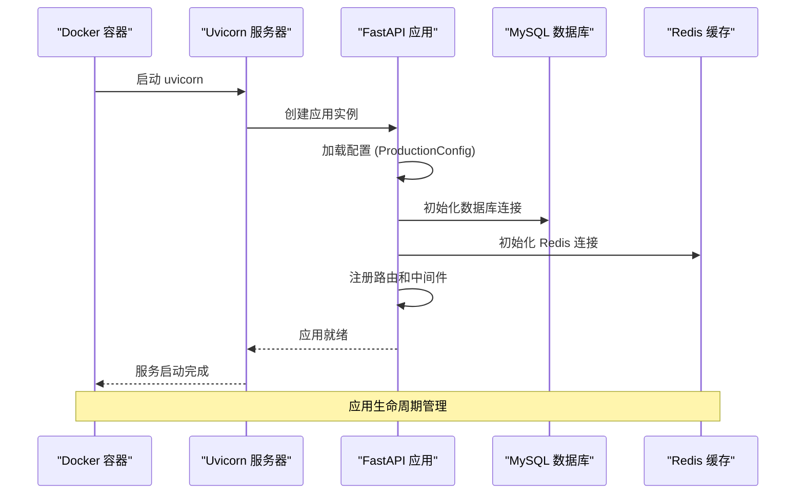

**图表来源**
- [main.py](file://main.py#L1-L19)
- [internal/app.py](file://internal/app.py#L17-L30)

### 配置加载机制

应用根据环境变量 `SYS_ENV` 自动加载对应的配置：

| 环境 | 配置文件 | 环境变量 |
|------|----------|----------|
| 本地开发 | `.env.local` | `SYS_ENV=local` |
| 开发环境 | `.env.dev` | `SYS_ENV=dev` |
| 测试环境 | `.env.test` | `SYS_ENV=test` |
| 生产环境 | `.env.prod` | `SYS_ENV=prod` |

**章节来源**
- [internal/config/setting.py](file://internal/config/setting.py#L9-L58)
- [internal/config/__init__.py](file://internal/config/__init__.py#L10-L87)

### 中间件配置

应用集成了多个中间件组件：


**图表来源**
- [internal/app.py](file://internal/app.py#L54-L77)

## Celery Worker 部署

### Worker 启动脚本

项目提供了专门的 Celery Worker 启动脚本，支持灵活的配置和扩展：

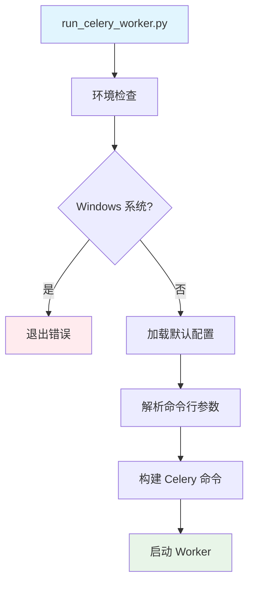

**图表来源**
- [scripts/run_celery_worker.py](file://scripts/run_celery_worker.py#L6-L38)

### Worker 配置参数

| 参数 | 默认值 | 描述 |
|------|--------|------|
| `queues` | `default_queue` | 任务队列名称 |
| `loglevel` | `"debug"` | 日志级别 |
| `pool` | `"prefork"` | 进程池类型 |
| `concurrency` | `"4"` | 并发进程数 |
| `extra_cli_args` | `[]` | 额外命令行参数 |

### Worker 生命周期管理

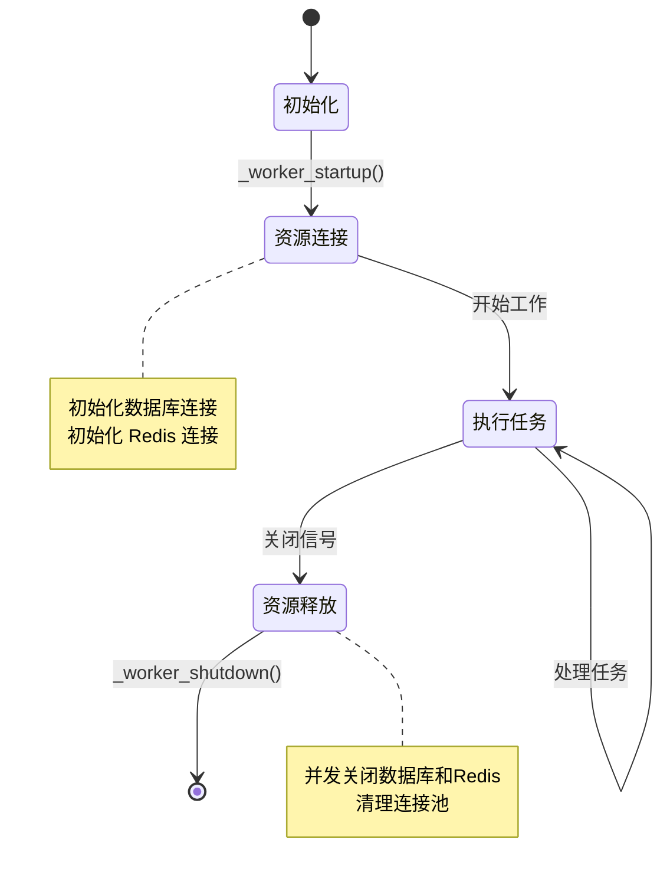

**图表来源**
- [internal/infra/celery.py](file://internal/infra/celery.py#L57-L86)

### 独立部署方式

#### 1. 直接运行脚本
```bash
# 基本启动
python scripts/run_celery_worker.py

# 自定义配置
python scripts/run_celery_worker.py --logfile=worker.log --concurrency=8

# 指定队列
python scripts/run_celery_worker.py -Q video_queue,cron_queue
```

#### 2. Celery CLI 命令
```bash
# 启动 Worker
celery -A internal.infra.celery.celery_app worker -l info

# 启动 Beat（定时任务调度器）
celery -A internal.infra.celery.celery_app beat -l info
```

**章节来源**
- [scripts/run_celery_worker.py](file://scripts/run_celery_worker.py#L1-L38)
- [internal/infra/celery.py](file://internal/infra/celery.py#L147-L152)

## Kubernetes 部署配置

### Deployment 配置示例

```yaml
apiVersion: apps/v1
kind: Deployment
metadata:
  name: fastapi-backend
  namespace: production
spec:
  replicas: 3
  selector:
    matchLabels:
      app: fastapi-backend
  template:
    metadata:
      labels:
        app: fastapi-backend
    spec:
      containers:
      - name: fastapi-backend
        image: fastapi-backend:prod
        ports:
        - containerPort: 8000
          name: http
        env:
        - name: SYS_ENV
          value: "prod"
        - name: SYS_NAMESPACE
          value: "prod"
        resources:
          requests:
            memory: "256Mi"
            cpu: "100m"
          limits:
            memory: "512Mi"
            cpu: "500m"
        livenessProbe:
          httpGet:
            path: /health
            port: 8000
          initialDelaySeconds: 30
          periodSeconds: 30
        readinessProbe:
          httpGet:
            path: /ready
            port: 8000
          initialDelaySeconds: 5
          periodSeconds: 10
        volumeMounts:
        - name: config-volume
          mountPath: /app/configs/.env.prod
          subPath: .env.prod
        - name: logs-volume
          mountPath: /app/logs
        - name: data-volume
          mountPath: /app/data
      volumes:
      - name: config-volume
        configMap:
          name: fastapi-config
      - name: logs-volume
        emptyDir: {}
      - name: data-volume
        persistentVolumeClaim:
          claimName: fastapi-data
```

### Service 配置

```yaml
apiVersion: v1
kind: Service
metadata:
  name: fastapi-backend-service
  namespace: production
spec:
  selector:
    app: fastapi-backend
  ports:
  - protocol: TCP
    port: 80
    targetPort: 8000
  type: LoadBalancer
```

### ConfigMap 配置

```yaml
apiVersion: v1
kind: ConfigMap
metadata:
  name: fastapi-config
  namespace: production
data:
  .env.prod: |
    BACKEND_CORS_ORIGINS=["*"]
    MYSQL_USERNAME=root
    MYSQL_PASSWORD=${MYSQL_PASSWORD}
    MYSQL_HOST=mysql-service
    MYSQL_DATABASE=fastapi_prod
    REDIS_HOST=redis-service
    REDIS_PASSWORD=${REDIS_PASSWORD}
    REDIS_DB=0
    REDIS_PORT=6379
    SECRET_KEY=${SECRET_KEY}
```

### Worker Deployment

```yaml
apiVersion: apps/v1
kind: Deployment
metadata:
  name: fastapi-celery-worker
  namespace: production
spec:
  replicas: 2
  selector:
    matchLabels:
      app: fastapi-celery-worker
  template:
    metadata:
      labels:
        app: fastapi-celery-worker
    spec:
      containers:
      - name: celery-worker
        image: fastapi-backend:prod
        command: ["python", "scripts/run_celery_worker.py"]
        env:
        - name: SYS_ENV
          value: "prod"
        - name: SYS_NAMESPACE
          value: "prod"
        resources:
          requests:
            memory: "128Mi"
            cpu: "50m"
          limits:
            memory: "256Mi"
            cpu: "200m"
        volumeMounts:
        - name: config-volume
          mountPath: /app/configs/.env.prod
          subPath: .env.prod
      volumes:
      - name: config-volume
        configMap:
          name: fastapi-config
```

## 环境变量与配置管理

### 生产环境配置

生产环境配置文件位于 `configs/.env.prod`，包含以下关键配置：

| 配置项 | 描述 | 示例值 |
|--------|------|--------|
| `BACKEND_CORS_ORIGINS` | CORS 允许的域名列表 | `["*"]` |
| `MYSQL_USERNAME` | MySQL 用户名 | `root` |
| `MYSQL_PASSWORD` | MySQL 密码 | `123456` |
| `MYSQL_HOST` | MySQL 主机地址 | `127.0.0.1` |
| `MYSQL_DATABASE` | 数据库名称 | `xxx_db_prod` |
| `REDIS_HOST` | Redis 主机地址 | `127.0.0.1` |
| `REDIS_PASSWORD` | Redis 密码 | `""` |
| `SECRET_KEY` | 应用密钥 | `prod-SECRET_KEY` |

### 环境变量优先级

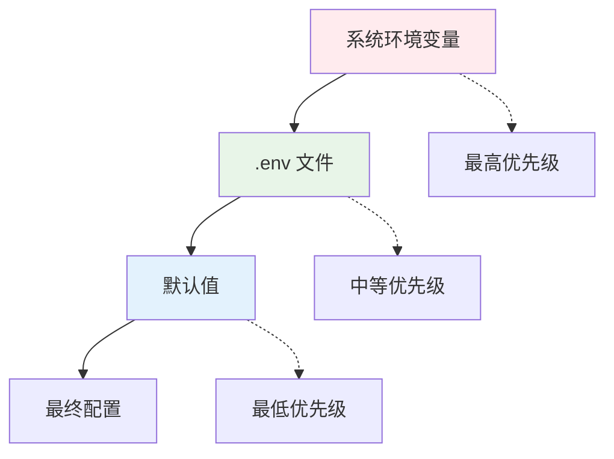

**图表来源**
- [internal/config/__init__.py](file://internal/config/__init__.py#L10-L87)

### 配置验证机制

应用启动时会进行配置验证：

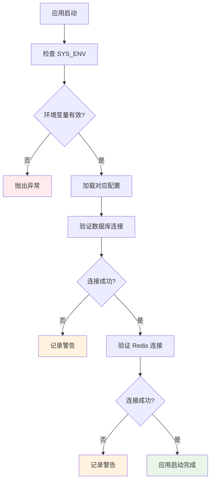

**图表来源**
- [internal/app.py](file://internal/app.py#L80-L105)

**章节来源**
- [configs/.env.prod](file://configs/.env.prod#L1-L13)
- [internal/config/setting.py](file://internal/config/setting.py#L9-L58)

## 健康检查与监控

### 健康检查配置

Dockerfile 中配置了健康检查：

```dockerfile
HEALTHCHECK --interval=30s --timeout=10s --start-period=5s --retries=3 \
    CMD ss -lnt | grep -q 8000 || exit 1
```

### 健康检查指标

| 指标 | 检查方式 | 频率 | 超时 |
|------|----------|------|------|
| 端口监听 | `ss -lnt \| grep -q 8000` | 30秒 | 10秒 |
| 初始延迟 | - | 5秒 | - |
| 重试次数 | - | 3次 | - |

### 应用级健康检查

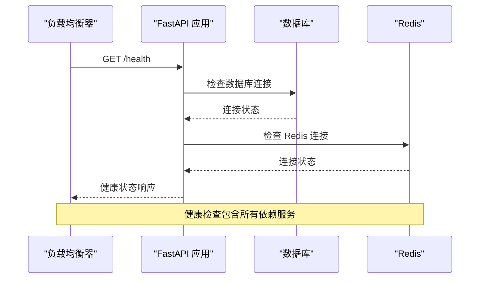

### 监控指标

应用提供以下监控指标：

| 指标类型 | 指标名称 | 描述 |
|----------|----------|------|
| 应用指标 | 请求响应时间 | HTTP 请求处理时间 |
| 应用指标 | 错误率 | 5xx 错误请求比例 |
| 资源指标 | CPU 使用率 | 容器 CPU 占用 |
| 资源指标 | 内存使用率 | 容器内存占用 |
| 业务指标 | 活跃用户数 | 当前在线用户 |
| 业务指标 | 任务队列长度 | Celery 任务积压 |

**章节来源**
- [Dockerfile](file://Dockerfile#L32-L36)

## 日志收集与管理

### 日志系统架构

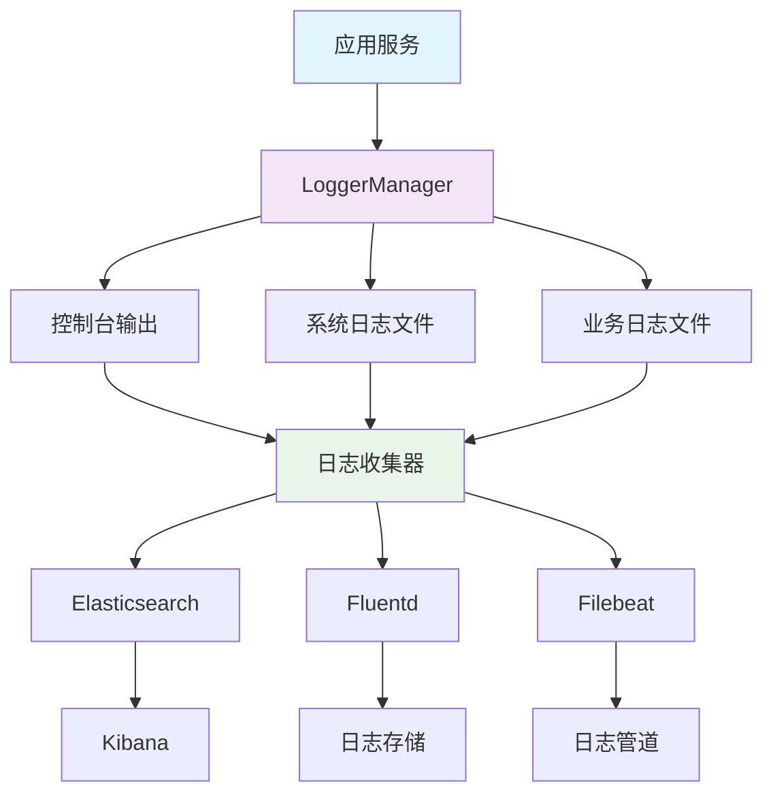

**图表来源**
- [pkg/logger_tool.py](file://pkg/logger_tool.py#L15-L275)

### 日志配置参数

| 参数 | 默认值 | 描述 |
|------|--------|------|
| `level` | `"INFO"` | 日志级别 |
| `rotation` | `time(0, 0, 0)` | 日志轮转时间（UTC） |
| `retention` | `timedelta(days=30)` | 日志保留天数 |
| `use_utc` | `true` | 使用 UTC 时间 |
| `enqueue` | `true` | 多进程安全队列 |

### 日志轮转策略

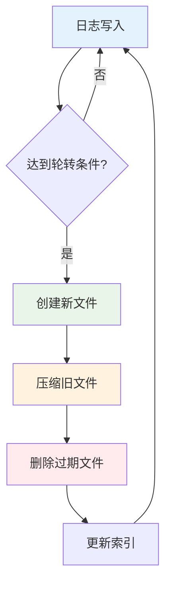

### 日志格式化

应用支持多种日志格式：

#### 控制台格式
```
<green>2024-01-15 10:30:45.123</green> | <level>INFO    </level> | <cyan>app:main:15</cyan> | <magenta>-</magenta> | <yellow>system</yellow> - Application started
```

#### 文件格式
```
2024-01-15 10:30:45.123 | INFO     | app:main:15 | - | system - Application started
```

#### JSON 格式
```json
{
  "time": "2024-01-15 10:30:45.123",
  "level": "INFO",
  "name": "app",
  "function": "main",
  "line": 15,
  "message": "Application started",
  "type": "system"
}
```

**章节来源**
- [pkg/logger_tool.py](file://pkg/logger_tool.py#L188-L252)

## Secret 管理

### Secret 管理策略

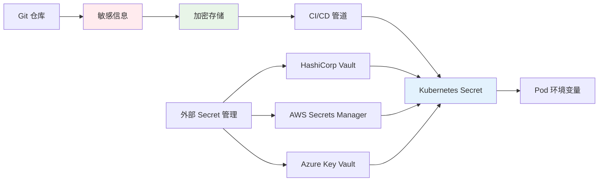

### Kubernetes Secret 配置

```yaml
apiVersion: v1
kind: Secret
metadata:
  name: fastapi-secrets
  namespace: production
type: Opaque
data:
  mysql-password: <base64-encoded-password>
  redis-password: <base64-encoded-password>
  secret-key: <base64-encoded-secret-key>
```

### 环境变量映射

```yaml
env:
- name: MYSQL_PASSWORD
  valueFrom:
    secretKeyRef:
      name: fastapi-secrets
      key: mysql-password
- name: REDIS_PASSWORD
  valueFrom:
    secretKeyRef:
      name: fastapi-secrets
      key: redis-password
- name: SECRET_KEY
  valueFrom:
    secretKeyRef:
      name: fastapi-secrets
      key: secret-key
```

### Secret 更新流程

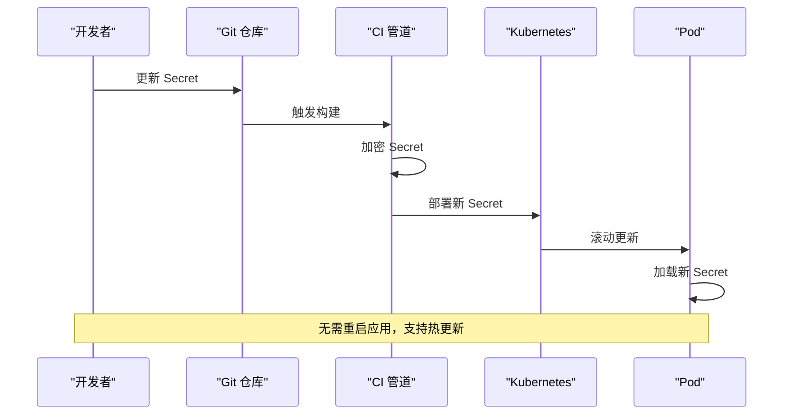

## 故障排除指南

### 常见问题诊断

#### 1. 应用启动失败

**症状**: 容器启动后立即退出

**排查步骤**:
```bash
# 查看容器日志
docker logs fastapi-backend-prod

# 检查配置文件
docker exec -it fastapi-backend-prod cat /app/configs/.env.prod

# 验证环境变量
docker exec -it fastapi-backend-prod env | grep SYS_ENV

# 检查端口占用
docker exec -it fastapi-backend-prod ss -lnt
```

#### 2. 数据库连接失败

**症状**: 应用启动时报数据库连接错误

**排查步骤**:
```bash
# 检查数据库服务状态
docker exec -it fastapi-backend-prod nc -zv $MYSQL_HOST $MYSQL_PORT

# 验证连接字符串
docker exec -it fastapi-backend-prod python -c "
from internal.config.setting import setting
print(setting.sqlalchemy_database_uri)
"

# 测试连接
docker exec -it fastapi-backend-prod python -c "
from internal.infra.database import init_db
import asyncio
asyncio.run(init_db())
print('Database connection successful')
"
```

#### 3. Redis 连接问题

**症状**: Celery Worker 启动失败或任务无法执行

**排查步骤**:
```bash
# 检查 Redis 服务
docker exec -it fastapi-backend-prod redis-cli -h $REDIS_HOST ping

# 验证连接配置
docker exec -it fastapi-backend-prod python -c "
from internal.config.setting import setting
print(setting.redis_url)
"

# 测试连接
docker exec -it fastapi-backend-prod python -c "
from internal.infra.redis import init_redis
import asyncio
asyncio.run(init_redis())
print('Redis connection successful')
"
```

#### 4. 健康检查失败

**症状**: 服务被负载均衡器移除

**排查步骤**:
```bash
# 手动执行健康检查
docker exec -it fastapi-backend-prod ss -lnt | grep 8000

# 检查应用状态
curl http://localhost:8000/health

# 查看应用日志
docker exec -it fastapi-backend-prod tail -f /app/logs/system/$(date +%Y-%m-%d).log
```

### 性能优化建议

#### 1. 资源配置优化

| 组件 | 推荐配置 | 说明 |
|------|----------|------|
| CPU | 500m-1000m | 根据并发需求调整 |
| 内存 | 512Mi-1Gi | 包含应用和缓存需求 |
| Worker 数量 | CPU 核心数 × 2 | 基于任务类型调整 |

#### 2. 数据库优化

```sql
-- MySQL 性能优化配置
[mysqld]
innodb_buffer_pool_size = 1G
innodb_log_file_size = 256M
max_connections = 200
query_cache_size = 64M
```

#### 3. Redis 优化

```yaml
# Redis 配置优化
maxmemory: 512mb
maxmemory-policy: allkeys-lru
save: 900 1 300 10 60 10000
```

### 监控告警配置

#### 关键指标告警

| 指标 | 告警阈值 | 处理建议 |
|------|----------|----------|
| CPU 使用率 | >80% | 增加副本或升级资源配置 |
| 内存使用率 | >85% | 检查内存泄漏或增加内存 |
| 数据库连接数 | >80% | 优化查询或增加连接池 |
| 任务队列长度 | >1000 | 增加 Worker 或优化任务 |

#### 告警通知配置

```yaml
alertmanager.yml:
  receivers:
  - name: 'email-notifications'
    email_configs:
    - to: 'ops-team@example.com'
      from: 'alertmanager@example.com'
      smarthost: smtp.example.com:587
      auth_username: alertmanager
      auth_password: ${SMTP_PASSWORD}
```

**章节来源**
- [internal/app.py](file://internal/app.py#L80-L105)
- [pkg/logger_tool.py](file://pkg/logger_tool.py#L15-L275)