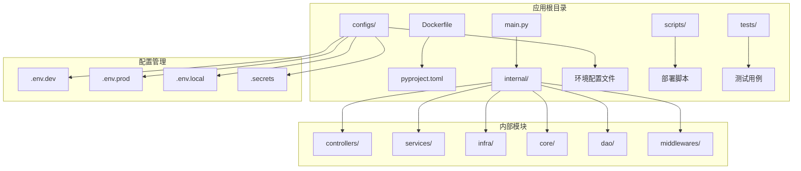
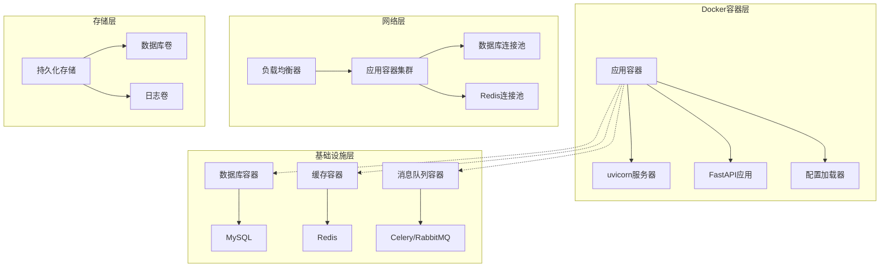
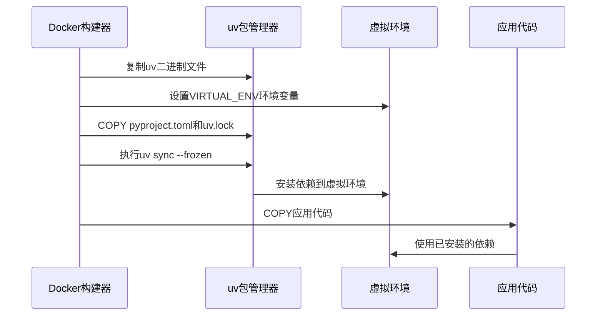
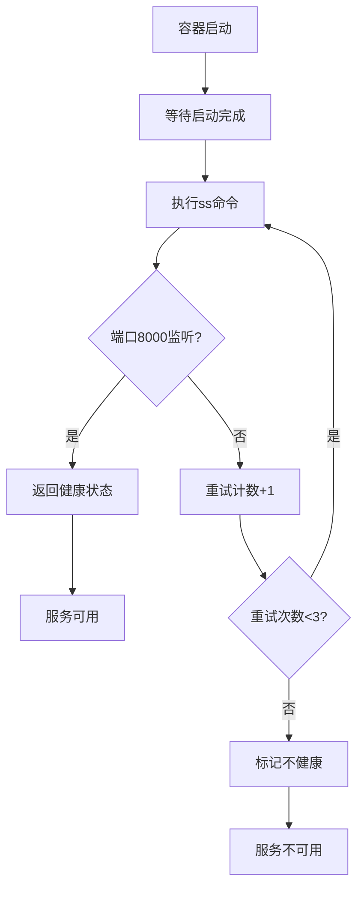
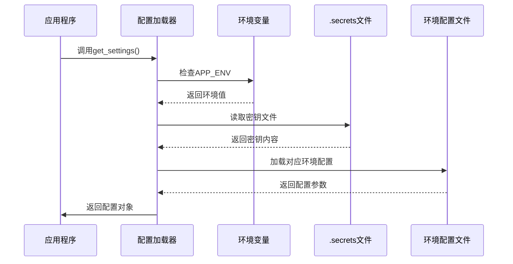
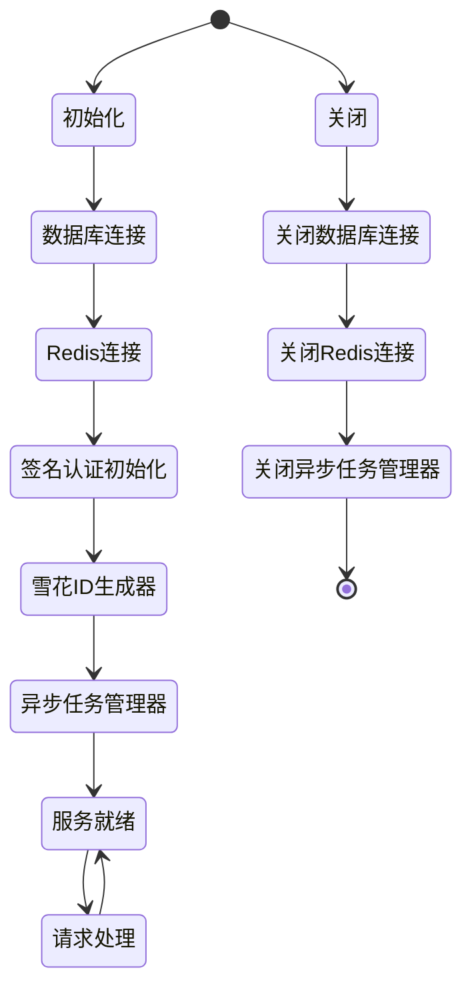
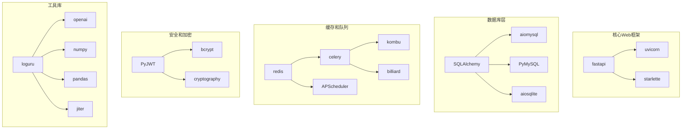

# Docker容器化部署

<cite>
**本文档引用的文件**
- [Dockerfile](file://Dockerfile)
- [pyproject.toml](file://pyproject.toml)
- [main.py](file://main.py)
- [internal/app.py](file://internal/app.py)
- [internal/config/load_config.py](file://internal/config/load_config.py)
- [.env.prod](file://configs/.env.prod)
- [.env.dev](file://configs/.env.dev)
- [.env.local](file://configs/.env.local)
- [.secrets.example](file://configs/.secrets.example)
</cite>

## 目录
1. [简介](#简介)
2. [项目结构](#项目结构)
3. [核心组件](#核心组件)
4. [架构概览](#架构概览)
5. [详细组件分析](#详细组件分析)
6. [依赖关系分析](#依赖关系分析)
7. [性能考虑](#性能考虑)
8. [故障排除指南](#故障排除指南)
9. [结论](#结论)

## 简介

本文档提供了FastAPI后端服务的完整Docker容器化部署指南。该应用是一个基于Python 3.12的高性能Web服务，使用FastAPI框架构建，集成了数据库连接、Redis缓存、任务队列等企业级功能。文档涵盖了Dockerfile构建过程、环境配置、健康检查、容器运行参数以及容器编排最佳实践。

## 项目结构

该项目采用模块化的FastAPI架构设计，主要包含以下核心目录结构：



**图表来源**
- [Dockerfile](file://Dockerfile#L1-L38)
- [pyproject.toml](file://pyproject.toml#L1-L155)
- [main.py](file://main.py#L1-L18)

**章节来源**
- [Dockerfile](file://Dockerfile#L1-L38)
- [pyproject.toml](file://pyproject.toml#L1-L155)
- [main.py](file://main.py#L1-L18)

## 核心组件

### Docker镜像构建配置

该Dockerfile采用了现代化的多阶段构建策略，使用uv作为包管理器来优化构建性能和镜像大小。

**构建流程概述：**
1. **基础镜像选择**：使用python:3.12.9-slim精简镜像
2. **环境变量配置**：设置时区、语言环境、Python行为参数
3. **uv包管理器集成**：使用官方uv二进制文件进行快速依赖安装
4. **虚拟环境管理**：通过VIRTUAL_ENV环境变量管理隔离的Python环境
5. **健康检查**：基于端口监听的健康检查机制

### 依赖管理策略

项目使用pyproject.toml进行依赖管理，采用分组依赖策略：

**生产环境依赖**（70个核心包）：
- Web框架：fastapi、uvicorn、starlette
- 数据库：SQLAlchemy、aiomysql、PyMySQL
- 缓存：redis、celery、APScheduler
- 安全：PyJWT、bcrypt、cryptography
- 工具库：loguru、openai、numpy、pandas

**开发环境依赖**（20个开发工具）：
- 测试框架：pytest、pytest-asyncio
- 代码质量：black、ruff、mypy
- 类型支持：各种stubs包

**章节来源**
- [Dockerfile](file://Dockerfile#L1-L38)
- [pyproject.toml](file://pyproject.toml#L8-L70)
- [pyproject.toml](file://pyproject.toml#L73-L93)

## 架构概览

### 容器化架构设计



**图表来源**
- [Dockerfile](file://Dockerfile#L31-L37)
- [internal/app.py](file://internal/app.py#L17-L30)
- [internal/config/load_config.py](file://internal/config/load_config.py#L46-L84)

### 配置管理系统

应用采用分层配置管理策略：

```mermaid
flowchart TD
A[启动] --> B{检查APP_ENV}
B --> |存在| C[读取系统环境变量]
B --> |不存在| D[读取.secrets文件]
C --> E{验证环境文件}
D --> E
E --> |存在| F[加载.env.{环境}]
E --> |不存在| G[错误：配置缺失]
F --> H[合并配置文件]
H --> I[初始化应用]
I --> J[启动服务]
```

**图表来源**
- [internal/config/load_config.py](file://internal/config/load_config.py#L192-L214)

**章节来源**
- [internal/config/load_config.py](file://internal/config/load_config.py#L179-L242)

## 详细组件分析

### Dockerfile构建流程

#### 基础镜像和环境配置

Dockerfile采用以下优化策略：

**基础镜像选择**：
- 使用python:3.12.9-slim作为基础镜像，减少镜像体积
- 配置TZ、LANG、LC_ALL等环境变量确保国际化支持

**Python环境优化**：
- 设置PYTHONDONTWRITEBYTECODE=1避免.pyc文件生成
- 设置PYTHONUNBUFFERED=1确保日志实时输出
- 配置PIP_*环境变量优化pip行为

#### uv包管理器集成



**图表来源**
- [Dockerfile](file://Dockerfile#L15-L27)

#### 健康检查机制

健康检查采用端口监听方式：



**图表来源**
- [Dockerfile](file://Dockerfile#L33-L34)

**章节来源**
- [Dockerfile](file://Dockerfile#L1-L38)

### 应用配置管理

#### 环境配置文件

项目提供多环境配置支持：

**开发环境配置**（.env.dev）：
- DEBUG=true启用调试模式
- 数据库连接指向本地或开发数据库
- Redis连接配置

**生产环境配置**（.env.prod）：
- DEBUG=false关闭调试模式
- 安全性更高的配置设置
- 生产数据库连接参数

**密钥管理**（.secrets）：
- APP_ENV环境标识
- AES_SECRET用于加密配置解密
- JWT_SECRET用于JWT令牌签名

#### 配置加载流程



**图表来源**
- [internal/config/load_config.py](file://internal/config/load_config.py#L192-L222)

**章节来源**
- [internal/config/load_config.py](file://internal/config/load_config.py#L46-L84)
- [internal/config/load_config.py](file://internal/config/load_config.py#L179-L242)

### 应用启动和生命周期管理

#### Uvicorn服务器配置

应用使用uvicorn作为ASGI服务器，配置特点：

**性能优化**：
- 使用uvloop事件循环提升异步性能
- httptools作为HTTP解析器提高吞吐量
- 启用访问日志便于监控

**网络配置**：
- 绑定到0.0.0.0允许外部访问
- 监听8000端口
- 禁用自动重载模式

#### FastAPI应用生命周期

应用采用lifespan事件处理器管理资源：



**图表来源**
- [internal/app.py](file://internal/app.py#L85-L109)

**章节来源**
- [main.py](file://main.py#L10-L17)
- [internal/app.py](file://internal/app.py#L17-L30)

## 依赖关系分析

### 包依赖图谱



**图表来源**
- [pyproject.toml](file://pyproject.toml#L8-L70)

### 运行时依赖分析

应用的运行时依赖具有以下特征：

**必需依赖**（70个包）：
- Web框架和服务器：fastapi、uvicorn、starlette
- 数据库抽象层：SQLAlchemy及其驱动
- 缓存和消息队列：redis、celery、APScheduler
- 安全相关：PyJWT、bcrypt、cryptography
- 性能优化：uvloop、httptools、async-lru

**开发依赖**（20个包）：
- 测试框架：pytest系列
- 代码质量：black、ruff、mypy
- 类型支持：各种stubs包

**章节来源**
- [pyproject.toml](file://pyproject.toml#L8-L70)
- [pyproject.toml](file://pyproject.toml#L73-L93)

## 性能考虑

### 镜像优化策略

#### 多阶段构建优化

虽然当前Dockerfile相对简洁，但仍采用了以下优化措施：

**依赖安装优化**：
- 使用uv sync替代pip install，显著提升安装速度
- 通过--frozen参数确保依赖版本锁定
- 禁用缓存避免不必要的层缓存

**运行时优化**：
- slim基础镜像减少镜像大小
- 禁用字节码生成避免磁盘I/O
- 实时日志输出便于容器监控

#### 启动性能调优

**异步性能提升**：
- uvloop事件循环提供更好的异步性能
- httptools HTTP解析器优化请求处理
- async-lru缓存装饰器减少重复计算

**内存使用优化**：
- 虚拟环境隔离避免包冲突
- 按需加载中间件减少启动时间
- 连接池管理数据库和Redis连接

### 运行时性能监控

建议实施以下监控指标：

**应用层面**：
- 请求延迟分布
- 错误率统计
- 并发连接数
- 内存使用情况

**基础设施层面**：
- 数据库连接池利用率
- Redis缓存命中率
- Celery任务处理时间

## 故障排除指南

### 常见部署问题及解决方案

#### 配置加载失败

**问题症状**：
- 应用启动时报错"CRITICAL: Config load failed"
- 环境变量未正确加载

**排查步骤**：
1. 检查APP_ENV环境变量设置
2. 验证.secrets文件完整性
3. 确认对应环境配置文件存在
4. 检查敏感信息解密密钥

**解决方案**：
```bash
# 验证配置文件
ls -la configs/
cat configs/.secrets
cat configs/.env.prod

# 检查环境变量
echo $APP_ENV
echo $AES_SECRET
echo $JWT_SECRET
```

#### 数据库连接问题

**问题症状**：
- 应用启动时数据库连接失败
- 连接超时或认证失败

**排查步骤**：
1. 检查数据库服务状态
2. 验证连接参数配置
3. 确认网络连通性
4. 检查防火墙设置

**解决方案**：
```bash
# 测试数据库连接
telnet $DB_HOST $DB_PORT
mysql -h $DB_HOST -P $DB_PORT -u $DB_USERNAME -p$DB_PASSWORD

# 检查Redis连接
redis-cli -h $REDIS_HOST -p $REDIS_PORT -a $REDIS_PASSWORD
```

#### 健康检查失败

**问题症状**：
- 容器被标记为不健康
- 服务无法通过负载均衡

**排查步骤**：
1. 检查端口8000是否正确暴露
2. 验证应用是否正常启动
3. 查看应用日志
4. 检查网络配置

**解决方案**：
```bash
# 检查容器端口映射
docker port <container_id>

# 查看应用日志
docker logs <container_id>

# 测试端口连通性
docker exec <container_id> ss -lnt
```

#### 性能问题诊断

**问题症状**：
- 请求响应时间过长
- 内存使用过高
- CPU使用率异常

**诊断工具**：
```bash
# 监控容器资源使用
docker stats <container_id>

# 查看应用性能指标
docker exec <container_id> top

# 检查网络连接
docker exec <container_id> netstat -tulpn
```

**章节来源**
- [internal/config/load_config.py](file://internal/config/load_config.py#L187-L214)
- [Dockerfile](file://Dockerfile#L33-L34)

## 结论

本Docker容器化部署方案提供了高效、可靠的FastAPI应用运行环境。通过采用现代化的构建工具（uv）、优化的镜像配置和完善的健康检查机制，确保了应用的稳定性和性能。

**关键优势**：
- 基于uv的快速依赖安装
- slim基础镜像的体积优化
- 完善的配置管理和环境隔离
- 可靠的健康检查机制
- 灵活的容器编排支持

**建议的后续改进**：
- 添加多阶段构建以进一步优化镜像大小
- 实施更详细的性能监控和日志聚合
- 配置资源限制和自动扩缩容策略
- 添加容器安全扫描和漏洞检测

该部署方案为生产环境提供了坚实的基础，可以根据具体需求进行扩展和定制。