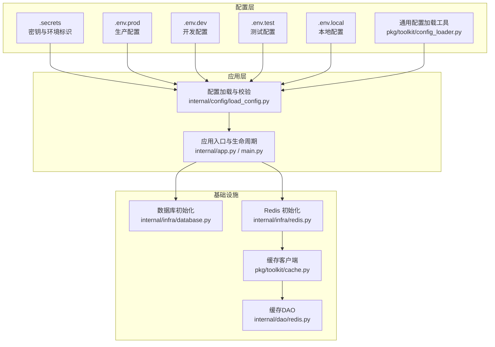
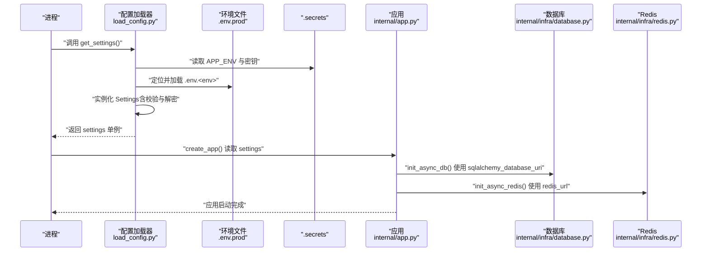
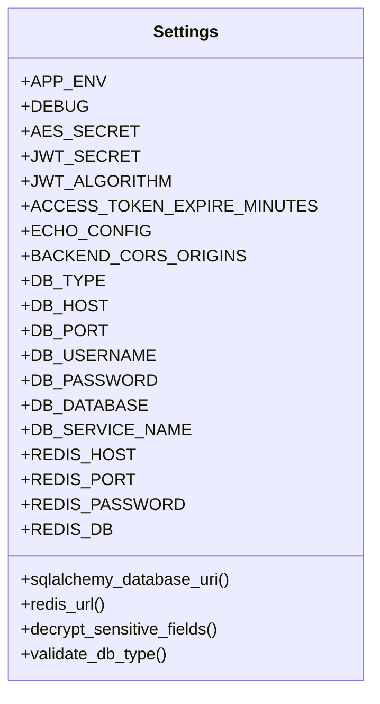
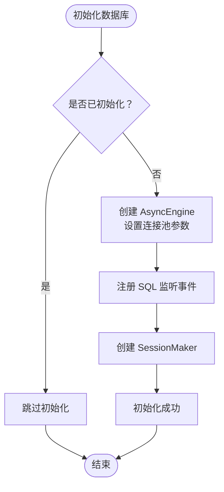
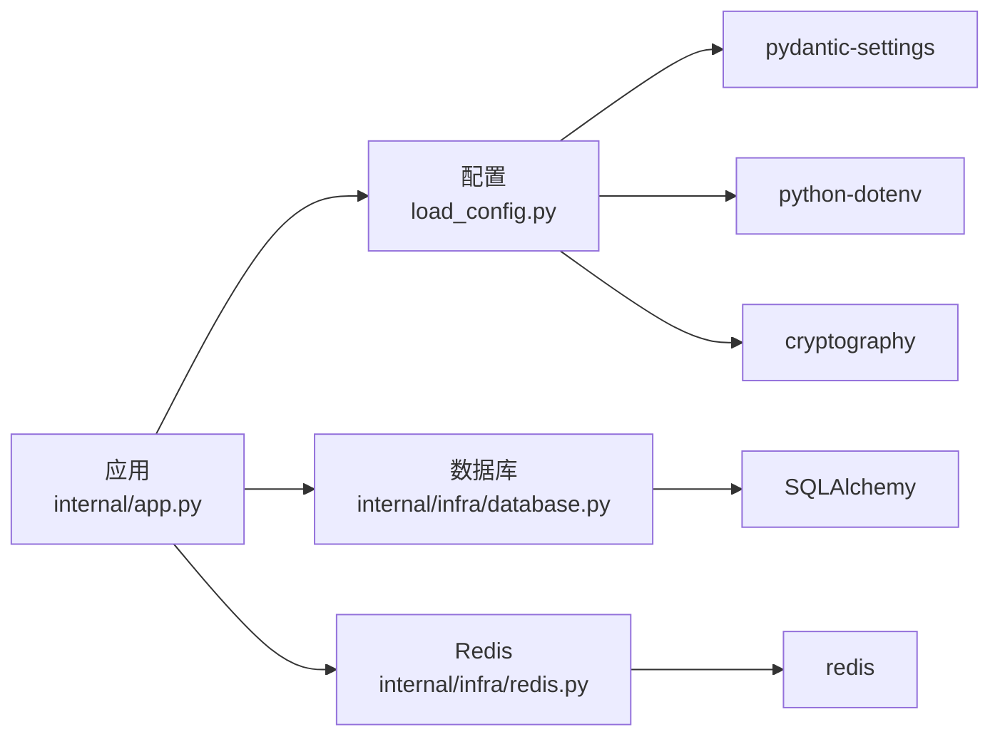

# 生产环境配置

<cite>
**本文引用的文件**
- [configs/.env.prod](file://configs/.env.prod)
- [configs/.env.dev](file://configs/.env.dev)
- [configs/.env.local](file://configs/.env.local)
- [configs/.env.test](file://configs/.env.test)
- [configs/.secrets.example](file://configs/.secrets.example)
- [internal/config/load_config.py](file://internal/config/load_config.py)
- [pkg/toolkit/config_loader.py](file://pkg/toolkit/config_loader.py)
- [internal/infra/database.py](file://internal/infra/database.py)
- [internal/infra/redis.py](file://internal/infra/redis.py)
- [internal/dao/redis.py](file://internal/dao/redis.py)
- [pkg/toolkit/cache.py](file://pkg/toolkit/cache.py)
- [pkg/crypter/aes.py](file://pkg/crypter/aes.py)
- [internal/app.py](file://internal/app.py)
- [main.py](file://main.py)
- [pyproject.toml](file://pyproject.toml)
</cite>

## 目录
1. [简介](#简介)
2. [项目结构](#项目结构)
3. [核心组件](#核心组件)
4. [架构总览](#架构总览)
5. [详细组件分析](#详细组件分析)
6. [依赖分析](#依赖分析)
7. [性能考虑](#性能考虑)
8. [故障排查指南](#故障排查指南)
9. [结论](#结论)
10. [附录](#附录)

## 简介
本文件面向生产环境配置管理，系统化说明 .env.prod 与多环境配置策略、配置文件与密钥管理、数据库与缓存连接、API 密钥与安全配置、配置验证与环境隔离、以及配置热更新与审计建议。文档同时给出配置模板与示例路径，帮助团队建立标准化、可审计、可维护的配置体系。

## 项目结构
本项目采用“配置文件 + 运行时加载 + 类型校验”的方式组织配置，核心位置如下：
- 环境配置文件：configs/.env.{local|dev|test|prod}
- 密钥与环境标识：configs/.secrets（示例：configs/.secrets.example）
- 配置加载与校验：internal/config/load_config.py
- 通用配置加载工具：pkg/toolkit/config_loader.py
- 数据库与缓存初始化：internal/infra/database.py、internal/infra/redis.py
- 缓存访问封装：pkg/toolkit/cache.py、internal/dao/redis.py
- 应用生命周期与中间件：internal/app.py、main.py
- 依赖声明：pyproject.toml

图表来源
- [internal/config/load_config.py](file://internal/config/load_config.py#L179-L240)
- [pkg/toolkit/config_loader.py](file://pkg/toolkit/config_loader.py#L24-L140)
- [internal/infra/database.py](file://internal/infra/database.py#L26-L56)
- [internal/infra/redis.py](file://internal/infra/redis.py#L18-L45)
- [internal/dao/redis.py](file://internal/dao/redis.py#L6-L36)
- [pkg/toolkit/cache.py](file://pkg/toolkit/cache.py#L41-L249)
- [internal/app.py](file://internal/app.py#L17-L30)

章节来源
- [configs/.env.prod](file://configs/.env.prod#L1-L20)
- [configs/.env.dev](file://configs/.env.dev#L1-L20)
- [configs/.env.local](file://configs/.env.local#L1-L20)
- [configs/.env.test](file://configs/.env.test#L1-L20)
- [configs/.secrets.example](file://configs/.secrets.example#L1-L17)
- [internal/config/load_config.py](file://internal/config/load_config.py#L179-L240)
- [pkg/toolkit/config_loader.py](file://pkg/toolkit/config_loader.py#L24-L140)
- [internal/infra/database.py](file://internal/infra/database.py#L26-L56)
- [internal/infra/redis.py](file://internal/infra/redis.py#L18-L45)
- [internal/dao/redis.py](file://internal/dao/redis.py#L6-L36)
- [pkg/toolkit/cache.py](file://pkg/toolkit/cache.py#L41-L249)
- [internal/app.py](file://internal/app.py#L17-L30)
- [main.py](file://main.py#L1-L18)
- [pyproject.toml](file://pyproject.toml#L1-L155)

## 核心组件
- 配置模型与加载
  - 通过 Pydantic Settings 定义配置模型，支持类型校验、敏感字段解密、动态 DSN 生成。
  - 通过 dotenv 与系统环境变量加载，支持 .env 与 .secrets 的组合覆盖。
- 数据库连接
  - 动态生成 SQLAlchemy DSN，支持 mysql、postgresql、oracle。
  - 连接池参数与 SQL 监控集成。
- Redis 缓存
  - 通过 RedisDsn 构建连接 URL，连接池与缓存客户端封装。
  - 提供键值、字典、列表、哈希、分布式锁等常用操作。
- 安全与密钥
  - AES 对称加密工具，支持 ENC(...) 格式的密文字段解密。
  - JWT 密钥与算法、调试开关、敏感信息打印控制。
- 应用生命周期
  - 在 lifespan 中统一初始化数据库与 Redis，保证服务启动与关闭的一致性。

章节来源
- [internal/config/load_config.py](file://internal/config/load_config.py#L46-L174)
- [internal/infra/database.py](file://internal/infra/database.py#L26-L56)
- [internal/infra/redis.py](file://internal/infra/redis.py#L18-L45)
- [pkg/toolkit/cache.py](file://pkg/toolkit/cache.py#L41-L249)
- [pkg/crypter/aes.py](file://pkg/crypter/aes.py#L6-L59)
- [internal/app.py](file://internal/app.py#L84-L109)

## 架构总览
下图展示生产环境配置加载与应用初始化的关键流程：

图表来源
- [internal/config/load_config.py](file://internal/config/load_config.py#L179-L240)
- [internal/infra/database.py](file://internal/infra/database.py#L38-L56)
- [internal/infra/redis.py](file://internal/infra/redis.py#L27-L44)
- [internal/app.py](file://internal/app.py#L84-L109)

## 详细组件分析

### 配置模型与加载（Settings）
- 环境与调试
  - APP_ENV：决定加载哪个 .env 文件（local/dev/test/prod）。
  - DEBUG：控制 FastAPI 文档路由与 SQL 日志级别。
- 密钥与安全
  - AES_SECRET：用于解密 ENC(...) 格式的敏感字段。
  - JWT_SECRET/JWT_ALGORITHM：JWT 签名密钥与算法。
  - ACCESS_TOKEN_EXPIRE_MINUTES：令牌过期分钟数。
  - ECHO_CONFIG：调试时输出完整配置（含敏感值）。
- 数据库
  - DB_TYPE：mysql/postgresql/oracle。
  - DB_HOST/PORT/USERNAME/PASSWORD/DATABASE/SERVICE_NAME：数据库连接参数。
  - 自动生成 SQLAlchemy DSN，支持 mysql+aiomysql、postgresql+asyncpg、oracle+oracledb。
- Redis
  - REDIS_HOST/PORT/PASSWORD/DB：Redis 连接参数。
  - 自动生成 RedisDsn，支持密码与 DB 选择。
- 校验与解密
  - 字段校验：DB_TYPE 必填且在允许集合内。
  - 敏感字段解密：对 DB_PASSWORD 与 REDIS_PASSWORD 尝试解密 ENC(...) 形式。

图表来源
- [internal/config/load_config.py](file://internal/config/load_config.py#L46-L174)

章节来源
- [internal/config/load_config.py](file://internal/config/load_config.py#L46-L174)

### 多环境配置策略与文件管理
- 环境文件命名规范
  - .env.local、.env.dev、.env.test、.env.prod 分别对应本地、开发、测试、生产。
- 加载顺序与覆盖
  - 通过 load_files 顺序加载：先环境文件，后 .secrets；后者覆盖前者同名键。
- 环境标识优先级
  - 优先从系统环境变量 APP_ENV 读取；若未设置，则从 .secrets 中读取。
- 最佳实践
  - 将敏感信息放入 .secrets 并通过 ENC(...) 存储密文。
  - 仅在 .env 文件中放置非敏感配置；不同环境仅变更必要差异项。
  - 使用 ECHO_CONFIG 仅在本地/CI 调试阶段开启，避免泄露。

章节来源
- [internal/config/load_config.py](file://internal/config/load_config.py#L192-L218)
- [configs/.env.prod](file://configs/.env.prod#L1-L20)
- [configs/.env.dev](file://configs/.env.dev#L1-L20)
- [configs/.env.local](file://configs/.env.local#L1-L20)
- [configs/.env.test](file://configs/.env.test#L1-L20)
- [configs/.secrets.example](file://configs/.secrets.example#L6-L16)

### 数据库连接配置
- 连接参数
  - DB_TYPE、DB_HOST、DB_PORT、DB_USERNAME、DB_PASSWORD、DB_DATABASE、DB_SERVICE_NAME（Oracle）。
- DSN 生成
  - 根据 DB_TYPE 动态构建 DSN；mysql 默认追加 charset 参数；oracle 使用 service_name。
- 连接池与监控
  - 连接池参数：pool_pre_ping、pool_size、max_overflow、pool_timeout、pool_recycle。
  - SQL 监控：基于 SQLAlchemy 事件监听，慢查询阈值可由配置项控制。

图表来源
- [internal/infra/database.py](file://internal/infra/database.py#L26-L56)

章节来源
- [internal/infra/database.py](file://internal/infra/database.py#L26-L56)
- [internal/config/load_config.py](file://internal/config/load_config.py#L118-L159)

### 缓存设置与 API 密钥管理
- Redis 连接
  - 通过 settings.redis_url 构建连接 URL，使用连接池与缓存客户端封装。
  - 支持最大连接数等扩展配置项。
- 缓存客户端能力
  - 键值、字典、列表、哈希、TTL、分布式锁、批量删除等。
- API 密钥与安全
  - JWT_SECRET/JWT_ALGORITHM 控制令牌签发与校验。
  - AES_SECRET 用于解密 ENC(...) 密文，避免明文存储敏感值。
  - ECHO_CONFIG 控制敏感配置输出，生产环境应关闭。

章节来源
- [internal/infra/redis.py](file://internal/infra/redis.py#L18-L45)
- [pkg/toolkit/cache.py](file://pkg/toolkit/cache.py#L41-L249)
- [pkg/crypter/aes.py](file://pkg/crypter/aes.py#L6-L59)
- [internal/config/load_config.py](file://internal/config/load_config.py#L56-L78)

### 配置验证、环境隔离与热更新
- 配置验证
  - DB_TYPE 校验、敏感字段解密失败即报错、缺失 .secrets 或环境文件直接终止。
- 环境隔离
  - 通过 APP_ENV 严格区分 .env 文件；.secrets 作为密钥与环境标识的唯一来源。
- 配置热更新
  - 当前实现为一次性加载并缓存；如需热更新，可在上层引入定时重载或信号触发重新加载逻辑（建议配合配置中心）。

章节来源
- [internal/config/load_config.py](file://internal/config/load_config.py#L86-L116)
- [internal/config/load_config.py](file://internal/config/load_config.py#L184-L214)

### 配置模板与示例
- 生产配置模板
  - 参考：configs/.env.prod
  - 包含：DEBUG、JWT_ALGORITHM、DB_*、REDIS_*、ACCESS_TOKEN_EXPIRE_MINUTES
- 密钥与环境模板
  - 参考：configs/.secrets.example
  - 包含：APP_ENV、AES_SECRET、JWT_SECRET、ECHO_CONFIG
- 通用配置加载工具
  - 支持 JSON/YAML/TOML/INI/ENV 多格式，便于扩展其他配置源。

章节来源
- [configs/.env.prod](file://configs/.env.prod#L1-L20)
- [configs/.secrets.example](file://configs/.secrets.example#L1-L17)
- [pkg/toolkit/config_loader.py](file://pkg/toolkit/config_loader.py#L24-L140)

### 配置安全性、敏感信息保护与审计
- 敏感信息保护
  - 所有敏感值使用 ENC(...) 包裹，运行时通过 AES_SECRET 解密。
  - .secrets 与 .env.* 均不纳入版本控制，使用 .gitignore 管理。
- 安全配置
  - 生产环境关闭 DEBUG，隐藏文档路由；JWT 算法与密钥独立管理。
- 审计方法
  - 通过 ECHO_CONFIG 输出配置（仅限调试），结合日志系统记录配置加载结果与错误。
  - 建议在 CI 中增加配置校验步骤，确保 .env 与 .secrets 结构正确。

章节来源
- [internal/config/load_config.py](file://internal/config/load_config.py#L97-L116)
- [internal/config/load_config.py](file://internal/config/load_config.py#L224-L235)
- [configs/.secrets.example](file://configs/.secrets.example#L6-L16)

### 配置冲突与环境差异问题
- 冲突来源
  - 系统环境变量与 .env 文件键冲突；.secrets 与 .env 同键覆盖关系。
- 解决方案
  - 明确优先级：系统环境变量 > .env 文件 > .secrets。
  - 统一通过 APP_ENV 选择环境文件，避免手动拼接路径。
  - 对关键键（如 DB_*、REDIS_*）进行显式校验与日志提示。

章节来源
- [internal/config/load_config.py](file://internal/config/load_config.py#L192-L218)

## 依赖分析
- 运行时依赖
  - FastAPI、Uvicorn、SQLAlchemy、aiomysql、redis、pydantic-settings、cryptography、PyJWT 等。
- 配置相关依赖
  - python-dotenv：.env 加载。
  - pydantic-settings：配置模型与校验。
  - cryptography：AES 加密与解密。
- 开发与测试
  - pytest、ruff、black、mypy 等工具链。

图表来源
- [internal/app.py](file://internal/app.py#L1-L30)
- [internal/config/load_config.py](file://internal/config/load_config.py#L1-L12)
- [pyproject.toml](file://pyproject.toml#L9-L70)

章节来源
- [pyproject.toml](file://pyproject.toml#L9-L70)
- [internal/app.py](file://internal/app.py#L1-L30)
- [internal/config/load_config.py](file://internal/config/load_config.py#L1-L12)

## 性能考虑
- 数据库连接池
  - 合理设置 pool_size、max_overflow、pool_timeout、pool_recycle，避免连接泄漏与抖动。
  - 使用 pool_pre_ping 降低连接失效导致的重试成本。
- Redis 连接池
  - 通过 REDIS_MAX_CONNECTIONS 控制最大连接数，避免资源耗尽。
- 日志与监控
  - SQL 慢查询阈值与 DEBUG 级别联动，避免生产环境过度日志开销。
- 启动顺序
  - 在 lifespan 中统一初始化数据库与 Redis，减少请求处理时的首次延迟。

章节来源
- [internal/infra/database.py](file://internal/infra/database.py#L38-L56)
- [internal/infra/redis.py](file://internal/infra/redis.py#L27-L44)
- [internal/infra/database.py](file://internal/infra/database.py#L133-L142)

## 故障排查指南
- 配置加载失败
  - 现象：启动时报“缺少 .secrets”“APP_ENV 未找到”“环境文件缺失”。
  - 处理：确认 .secrets 存在且包含有效 APP_ENV；确保 .env.<env> 与 .secrets 同目录。
- 敏感字段解密失败
  - 现象：DB_PASSWORD/REDIS_PASSWORD 为 ENC(...) 且解密报错。
  - 处理：核对 AES_SECRET 是否正确；确认 ENC(...) 内容完整。
- 数据库连接异常
  - 现象：连接池耗尽、超时或 SQL 报错。
  - 处理：检查 DB_* 参数、网络连通性；调整连接池参数；查看慢查询日志。
- Redis 连接异常
  - 现象：连接失败、命令执行异常。
  - 处理：检查 REDIS_* 参数、密码与 DB；确认 Redis 服务状态。
- 配置输出泄露风险
  - 现象：ECHO_CONFIG=true 导致敏感信息打印。
  - 处理：生产环境务必关闭 ECHO_CONFIG。

章节来源
- [internal/config/load_config.py](file://internal/config/load_config.py#L184-L214)
- [internal/config/load_config.py](file://internal/config/load_config.py#L97-L116)
- [internal/infra/database.py](file://internal/infra/database.py#L133-L154)
- [internal/infra/redis.py](file://internal/infra/redis.py#L48-L84)

## 结论
本项目通过“环境文件 + .secrets + Pydantic 校验 + AES 解密”的组合，实现了生产环境的强约束配置管理。建议在现有基础上完善以下方面：
- 引入配置中心与热更新机制，支持运行时刷新关键配置。
- 在 CI 中加入配置校验与密钥有效性检查。
- 对敏感配置进行最小暴露原则与权限控制。
- 建立配置变更审计与回滚流程。

## 附录
- 环境文件示例路径
  - 生产：configs/.env.prod
  - 开发：configs/.env.dev
  - 本地：configs/.env.local
  - 测试：configs/.env.test
  - 密钥与环境：configs/.secrets.example
- 应用启动入口
  - main.py：提供端口参数与 Uvicorn 启动逻辑。
- 依赖清单
  - 运行时依赖与开发依赖见 pyproject.toml。

章节来源
- [configs/.env.prod](file://configs/.env.prod#L1-L20)
- [configs/.env.dev](file://configs/.env.dev#L1-L20)
- [configs/.env.local](file://configs/.env.local#L1-L20)
- [configs/.env.test](file://configs/.env.test#L1-L20)
- [configs/.secrets.example](file://configs/.secrets.example#L1-L17)
- [main.py](file://main.py#L1-L18)
- [pyproject.toml](file://pyproject.toml#L1-L155)