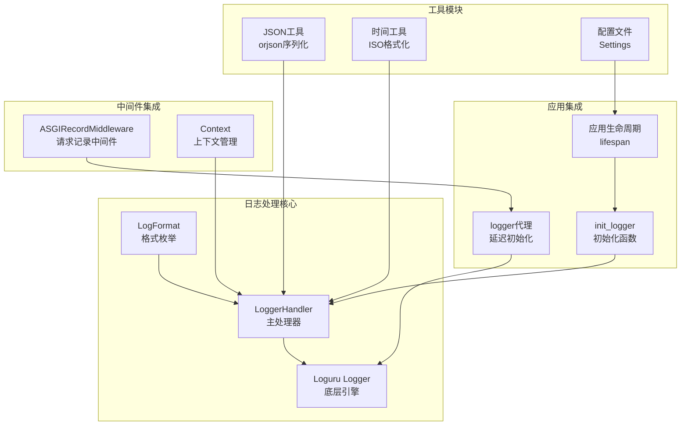
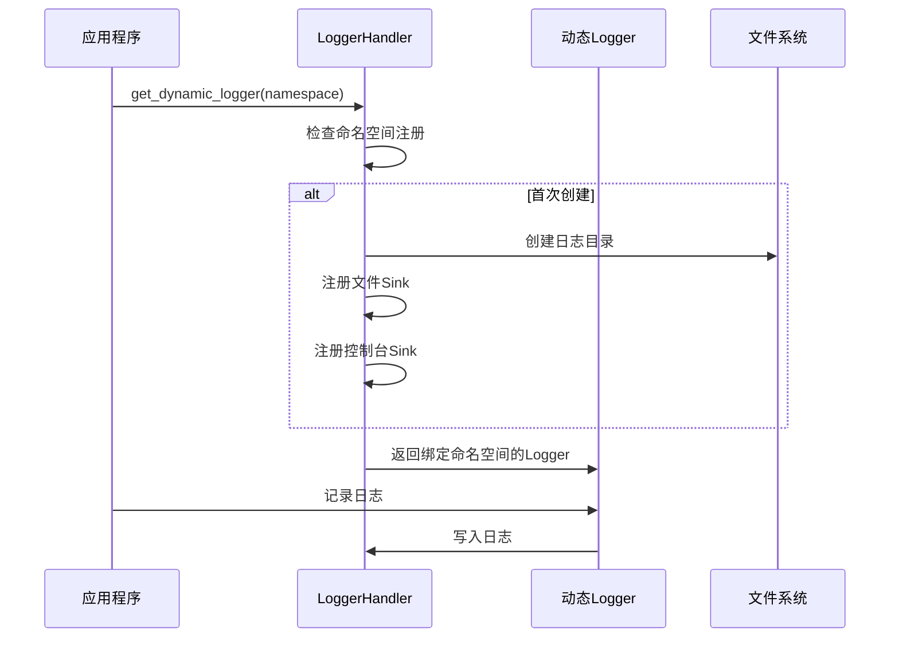
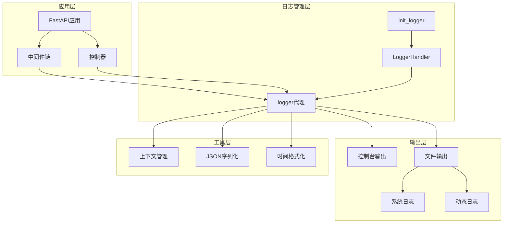
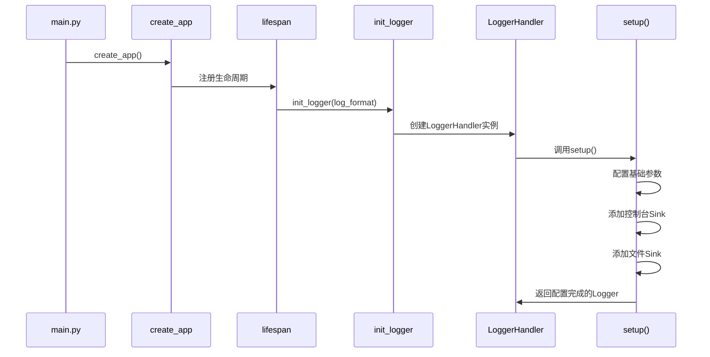
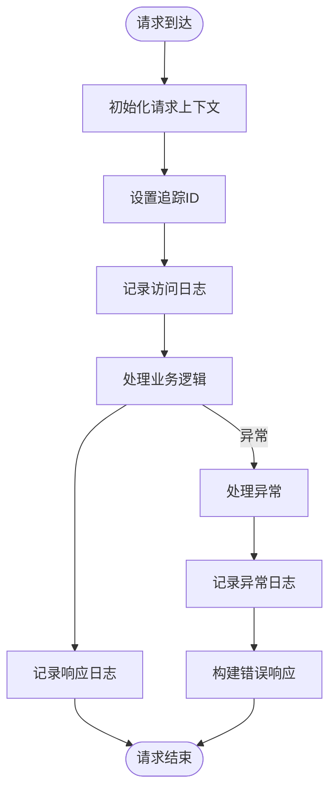
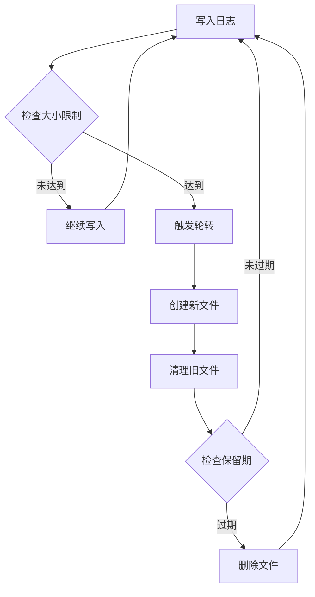
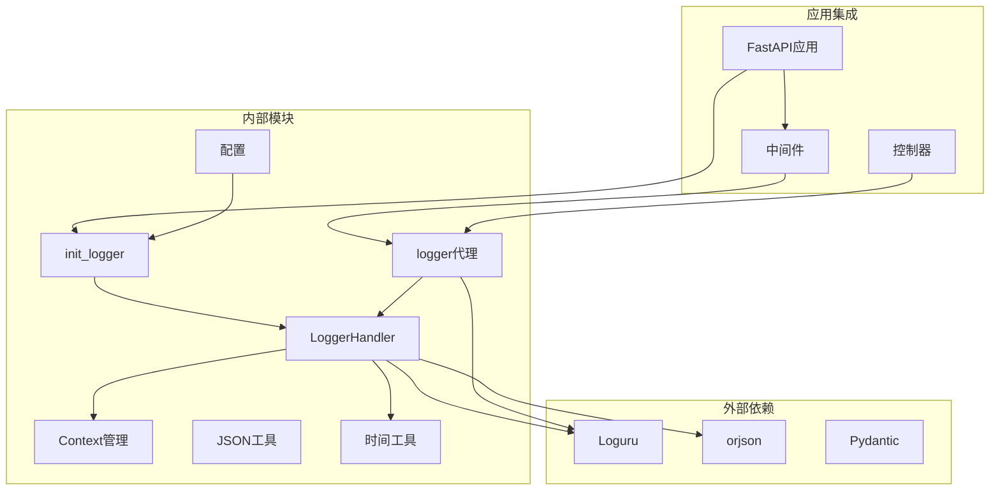

# 日志处理器

<cite>
**本文档引用的文件**
- [pkg/logger/handler.py](file://pkg/logger/handler.py)
- [pkg/logger/__init__.py](file://pkg/logger/__init__.py)
- [internal/middlewares/recorder.py](file://internal/middlewares/recorder.py)
- [internal/app.py](file://internal/app.py)
- [pkg/toolkit/context.py](file://pkg/toolkit/context.py)
- [pkg/toolkit/json.py](file://pkg/toolkit/json.py)
- [pkg/toolkit/timer.py](file://pkg/toolkit/timer.py)
- [internal/config/settings.py](file://internal/config/settings.py)
- [tests/logger/test_logger.py](file://tests/logger/test_logger.py)
- [tests/logger/test_logger_rotation.py](file://tests/logger/test_logger_rotation.py)
</cite>

## 目录
1. [简介](#简介)
2. [项目结构](#项目结构)
3. [核心组件](#核心组件)
4. [架构概览](#架构概览)
5. [详细组件分析](#详细组件分析)
6. [依赖关系分析](#依赖关系分析)
7. [性能考虑](#性能考虑)
8. [故障排除指南](#故障排除指南)
9. [结论](#结论)

## 简介

本项目采用基于 Loguru 的现代化日志处理方案，提供了灵活、高性能的日志管理能力。日志处理器支持多种输出格式（文本和JSON）、动态命名空间、自动轮转和保留策略，以及完整的追踪ID集成。

主要特性包括：
- **多格式支持**：文本格式和JSON Lines格式
- **动态命名空间**：支持按业务模块创建独立的日志命名空间
- **智能轮转**：基于时间、大小的灵活轮转策略
- **追踪集成**：与分布式追踪系统无缝集成
- **多输出源**：同时支持控制台和文件输出
- **UTC时间支持**：统一的UTC时间标准

## 项目结构

日志处理相关的核心文件组织如下：

**图表来源**
- [pkg/logger/handler.py](file://pkg/logger/handler.py#L28-L337)
- [pkg/logger/__init__.py](file://pkg/logger/__init__.py#L45-L116)
- [internal/middlewares/recorder.py](file://internal/middlewares/recorder.py#L68-L148)

**章节来源**
- [pkg/logger/handler.py](file://pkg/logger/handler.py#L1-L337)
- [pkg/logger/__init__.py](file://pkg/logger/__init__.py#L1-L116)

## 核心组件

### LoggerHandler 主处理器

LoggerHandler是日志系统的核心控制器，负责配置和管理所有日志输出。

**主要功能**：
- 配置日志级别、输出格式、轮转策略
- 管理多个命名空间的日志输出
- 提供动态日志记录器创建
- 处理UTC时间和格式化

**关键配置参数**：
- `level`：日志级别（INFO、DEBUG等）
- `base_log_dir`：日志根目录
- `system_subdir`：系统日志子目录
- `rotation`：轮转策略（时间或大小）
- `retention`：保留策略（天数）
- `log_format`：输出格式（TEXT或JSON）

**章节来源**
- [pkg/logger/handler.py](file://pkg/logger/handler.py#L28-L90)

### 日志格式系统

系统支持两种日志格式：

**文本格式（TEXT）**：
- 人类可读的格式
- 包含时间戳、级别、位置信息
- 支持彩色输出
- 适合开发和调试环境

**JSON格式（JSON）**：
- 结构化的JSON Lines格式
- 便于机器解析和分析
- 包含完整的技术信息
- 适合生产环境和监控系统

**章节来源**
- [pkg/logger/handler.py](file://pkg/logger/handler.py#L21-L26)
- [pkg/logger/handler.py](file://pkg/logger/handler.py#L227-L301)

### 动态命名空间系统

系统支持按业务模块创建独立的日志命名空间：

**图表来源**
- [pkg/logger/handler.py](file://pkg/logger/handler.py#L151-L224)

**章节来源**
- [pkg/logger/handler.py](file://pkg/logger/handler.py#L151-L224)

## 架构概览

日志系统的整体架构设计如下：

**图表来源**
- [internal/app.py](file://internal/app.py#L83-L109)
- [pkg/logger/__init__.py](file://pkg/logger/__init__.py#L45-L90)
- [pkg/logger/handler.py](file://pkg/logger/handler.py#L91-L149)

**章节来源**
- [internal/app.py](file://internal/app.py#L83-L109)
- [pkg/logger/__init__.py](file://pkg/logger/__init__.py#L45-L90)

## 详细组件分析

### 初始化流程

应用启动时的日志初始化流程：

**图表来源**
- [main.py](file://main.py#L1-L4)
- [internal/app.py](file://internal/app.py#L83-L109)
- [pkg/logger/__init__.py](file://pkg/logger/__init__.py#L45-L90)
- [pkg/logger/handler.py](file://pkg/logger/handler.py#L91-L149)

**章节来源**
- [main.py](file://main.py#L1-L4)
- [internal/app.py](file://internal/app.py#L83-L109)
- [pkg/logger/__init__.py](file://pkg/logger/__init__.py#L45-L90)

### 中间件集成

请求记录中间件与日志系统的集成：

**图表来源**
- [internal/middlewares/recorder.py](file://internal/middlewares/recorder.py#L105-L148)

**章节来源**
- [internal/middlewares/recorder.py](file://internal/middlewares/recorder.py#L68-L148)

### 日志格式化器

系统提供三种格式化器：

**控制台格式化器**：
- 彩色输出
- 包含时间戳、级别、位置信息
- 支持追踪ID显示

**文件格式化器**：
- 标准文本格式
- 包含完整技术信息
- 支持JSON内容序列化

**JSON格式化器**：
- 结构化JSON Lines
- 标准化的字段结构
- 完整的元数据包含

**章节来源**
- [pkg/logger/handler.py](file://pkg/logger/handler.py#L227-L301)

### 轮转和保留机制

日志轮转和保留策略：

**图表来源**
- [pkg/logger/handler.py](file://pkg/logger/handler.py#L126-L140)
- [tests/logger/test_logger_rotation.py](file://tests/logger/test_logger_rotation.py#L10-L60)

**章节来源**
- [pkg/logger/handler.py](file://pkg/logger/handler.py#L126-L140)
- [tests/logger/test_logger_rotation.py](file://tests/logger/test_logger_rotation.py#L10-L60)

## 依赖关系分析

日志处理系统的依赖关系图：

**图表来源**
- [pkg/logger/handler.py](file://pkg/logger/handler.py#L1-L12)
- [pkg/logger/__init__.py](file://pkg/logger/__init__.py#L16-L25)
- [internal/config/settings.py](file://internal/config/settings.py#L37-L37)

**章节来源**
- [pkg/logger/handler.py](file://pkg/logger/handler.py#L1-L12)
- [pkg/logger/__init__.py](file://pkg/logger/__init__.py#L16-L25)
- [internal/config/settings.py](file://internal/config/settings.py#L37-L37)

## 性能考虑

### 序列化优化

系统采用orjson进行高性能JSON序列化，具有以下优势：
- **原生支持**：支持NumPy数组、UUID、Decimal等类型
- **UTC统一**：强制使用UTC时区，统一时间标准
- **微秒省略**：减少输出体积
- **安全范围**：对浮点数范围进行安全检查

### 多进程支持

- **队列写入**：支持多进程安全的队列写入
- **异步处理**：Loguru内置异步处理能力
- **内存管理**：合理的内存使用和垃圾回收

### 缓存策略

- **格式化缓存**：格式化器结果缓存
- **路径缓存**：文件路径解析缓存
- **追踪ID缓存**：上下文追踪ID快速获取

## 故障排除指南

### 常见问题诊断

**日志文件未创建**：
1. 检查base_log_dir目录权限
2. 验证系统子目录创建权限
3. 确认文件系统空间充足

**格式化错误**：
1. 检查json_content类型是否为允许的类型
2. 验证追踪ID格式正确性
3. 确认时间格式化器正常工作

**轮转不生效**：
1. 检查rotation配置参数
2. 验证文件权限和磁盘空间
3. 确认系统时钟同步

**章节来源**
- [tests/logger/test_logger.py](file://tests/logger/test_logger.py#L111-L150)
- [tests/logger/test_logger_rotation.py](file://tests/logger/test_logger_rotation.py#L10-L60)

### 调试技巧

**启用调试模式**：
- 设置日志级别为DEBUG
- 启用详细诊断信息
- 检查格式化器输出

**性能监控**：
- 监控磁盘使用率
- 检查文件句柄数量
- 监控内存使用情况

**故障恢复**：
- 实现自动降级到系统日志
- 处理文件权限错误
- 确保优雅关闭

## 结论

本日志处理器系统提供了现代化、高性能的日志管理解决方案。通过合理的设计和实现，系统具备了以下特点：

**技术优势**：
- 基于Loguru的成熟框架，功能完善
- 支持多种输出格式，适应不同场景需求
- 动态命名空间设计，便于模块化管理
- 完善的轮转和保留机制，保证长期稳定运行

**架构特点**：
- 清晰的分层设计，职责明确
- 良好的扩展性，易于功能增强
- 完善的错误处理和恢复机制
- 与应用生命周期深度集成

**最佳实践建议**：
- 生产环境推荐使用JSON格式
- 合理配置轮转和保留策略
- 建立完善的监控和告警机制
- 定期审查日志策略和性能指标

该系统为FastAPI应用提供了可靠、高效的日志管理基础设施，能够满足从开发调试到生产监控的全方位需求。