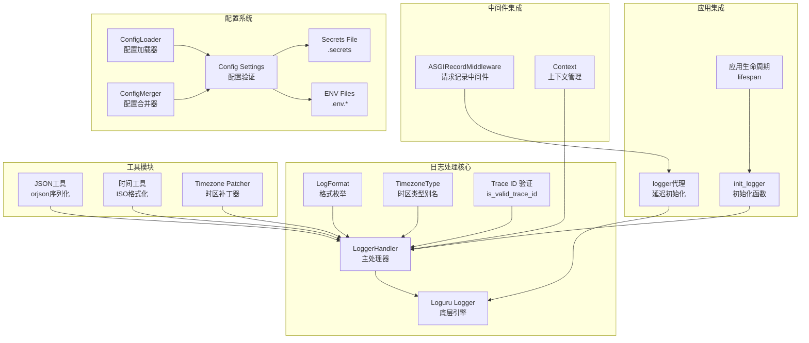
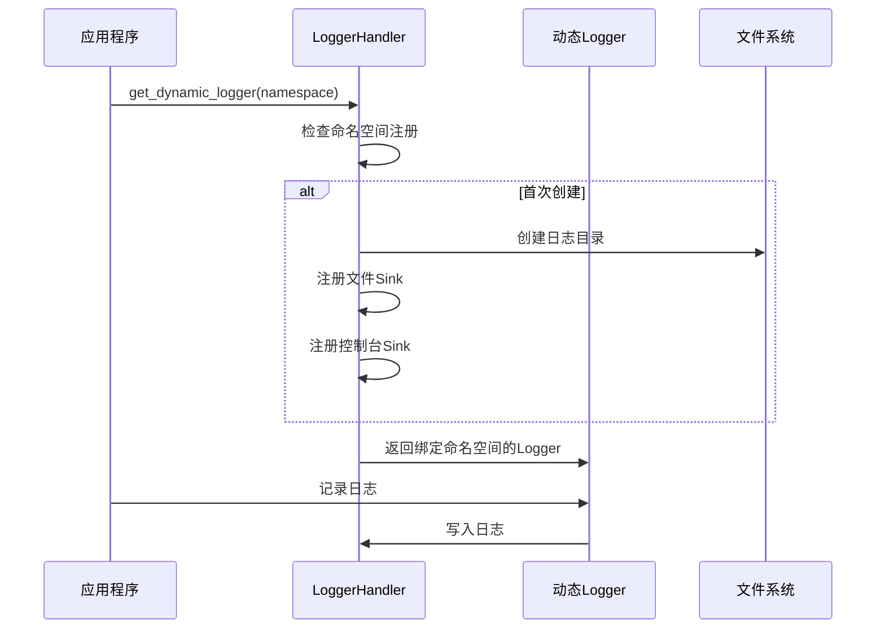
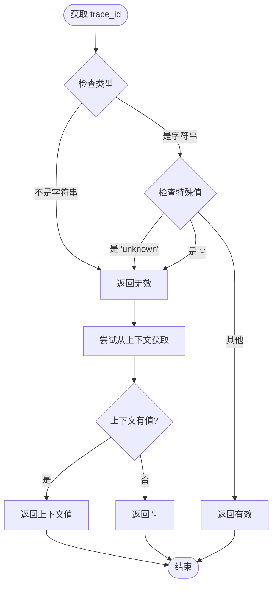
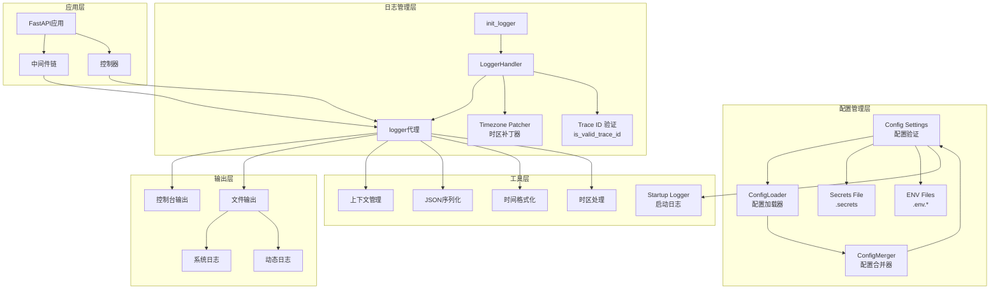
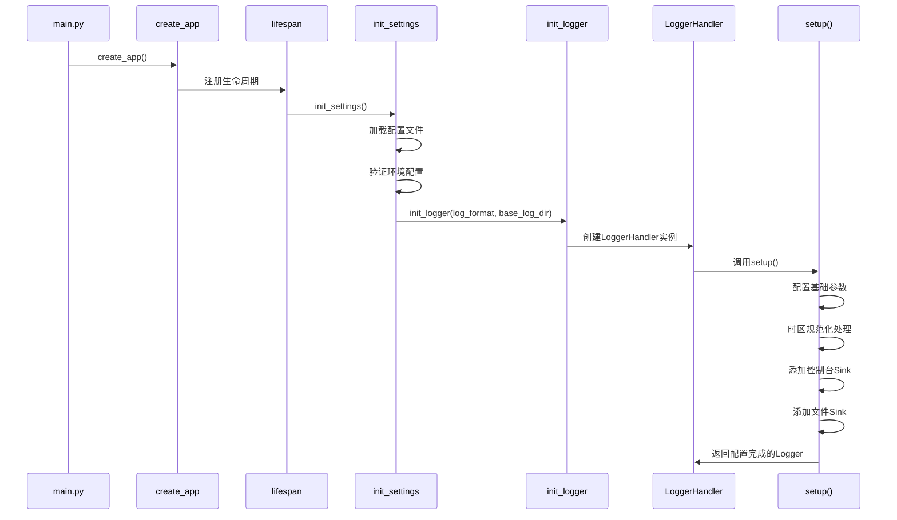
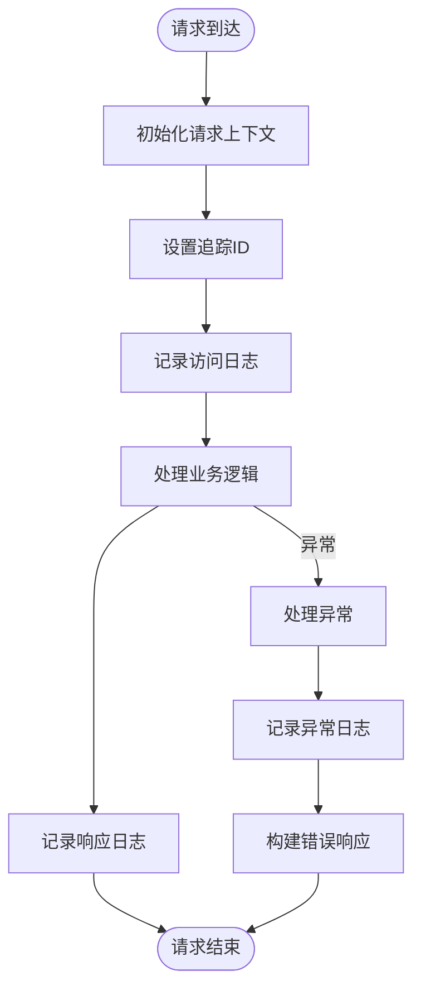
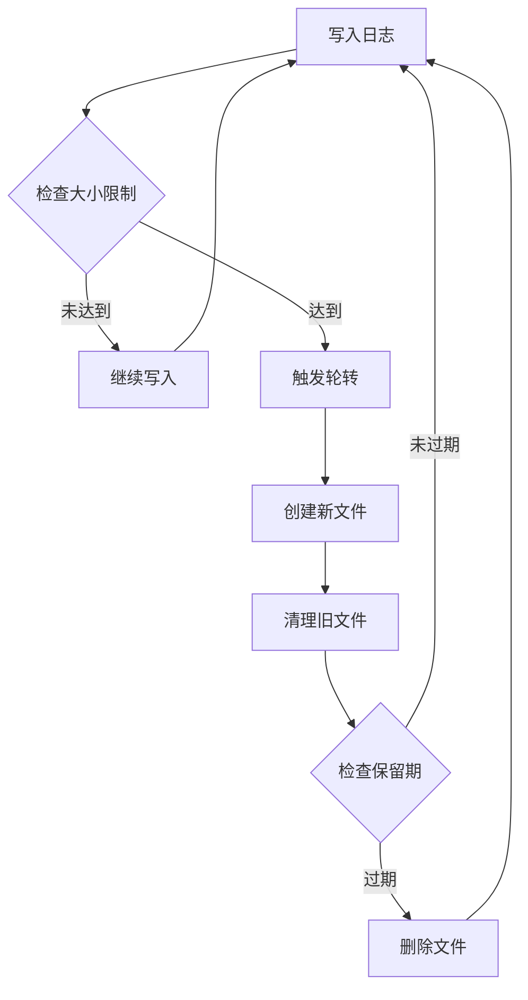
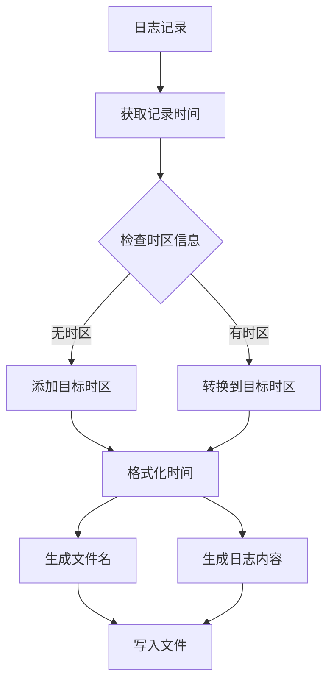
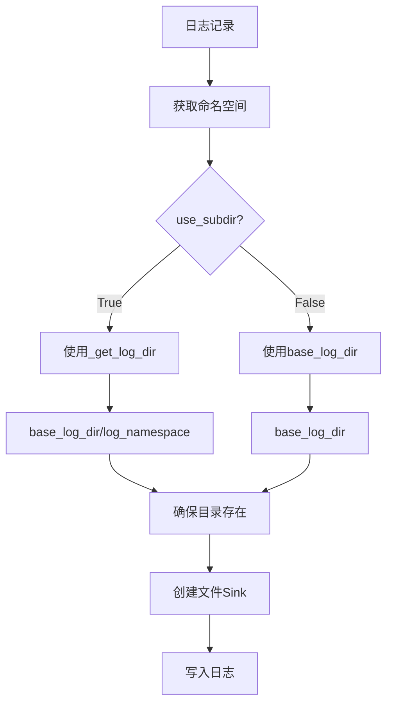
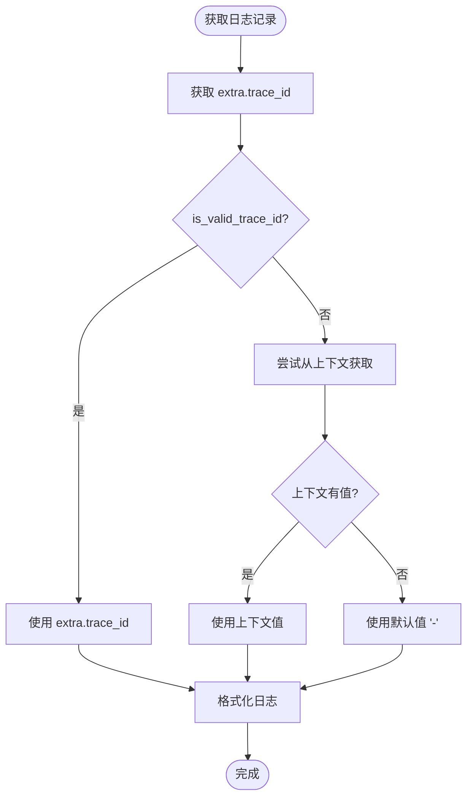

# 日志处理器

<cite>
**本文档引用的文件**
- [pkg/logger/handler.py](file://pkg/logger/handler.py)
- [pkg/logger/__init__.py](file://pkg/logger/__init__.py)
- [internal/middlewares/recorder.py](file://internal/middlewares/recorder.py)
- [internal/app.py](file://internal/app.py)
- [internal/config.py](file://internal/config.py)
- [pkg/toolkit/context.py](file://pkg/toolkit/context.py)
- [pkg/toolkit/json.py](file://pkg/toolkit/json.py)
- [pkg/toolkit/timer.py](file://pkg/toolkit/timer.py)
- [pkg/toolkit/config_loader.py](file://pkg/toolkit/config_loader.py)
- [configs/.env.dev](file://configs/.env.dev)
- [configs/.env.prod](file://configs/.env.prod)
- [configs/.env.test](file://configs/.env.test)
- [configs/.env.local](file://configs/.env.local)
- [configs/.secrets](file://configs/.secrets)
- [tests/logger/test_logger.py](file://tests/logger/test_logger.py)
- [tests/logger/test_logger_rotation.py](file://tests/logger/test_logger_rotation.py)
- [tests/toolkit/test_context.py](file://tests/toolkit/test_context.py)
- [main.py](file://main.py)
</cite>

## 更新摘要
**变更内容**
- **更新**：重构配置系统以反映配置加载流程和环境检测机制的更新
- **更新**：startup日志记录器配置已相应调整，支持新的配置加载流程
- **更新**：新增配置加载器工具，提供统一的配置文件加载和合并功能
- **更新**：改进环境检测机制，从.env文件读取APP_ENV并验证配置文件存在性
- **更新**：增强配置验证和错误处理，提供更详细的启动日志记录

## 目录
1. [简介](#简介)
2. [项目结构](#项目结构)
3. [核心组件](#核心组件)
4. [架构概览](#架构概览)
5. [详细组件分析](#详细组件分析)
6. [依赖关系分析](#依赖关系分析)
7. [性能考虑](#性能考虑)
8. [故障排除指南](#故障排除指南)
9. [结论](#结论)

## 简介

本项目采用基于 Loguru 的现代化日志处理方案，提供了灵活、高性能的日志管理能力。日志处理器支持多种输出格式（文本和JSON）、动态命名空间、自动轮转和保留策略，以及完整的追踪ID集成。

**主要特性包括**：
- **多格式支持**：文本格式和JSON Lines格式
- **动态命名空间**：支持按业务模块创建独立的日志命名空间
- **智能轮转**：基于时间、大小的灵活轮转策略
- **追踪集成**：与分布式追踪系统无缝集成
- **多输出源**：同时支持控制台和文件输出
- **完整时区支持**：支持UTC和本地时区，严格的一致性检查
- **ISO 8601格式化**：标准化的时间格式输出
- **灵活的目录组织**：支持子目录和扁平目录结构
- **增强的追踪ID验证**：使用 is_valid_trace_id 函数进行严格验证，支持 'unknown' 和 '-' 值处理
- **维护性改进**：移除了不必要的属性赋值，提升了代码质量
- **配置系统重构**：支持.env文件加载、环境检测和配置验证
- **启动日志记录**：提供详细的启动阶段日志记录和错误报告

## 项目结构

日志处理相关的核心文件组织如下：

```mermaid
graph TB
subgraph "日志处理核心"
LH[LoggerHandler<br/>主处理器]
LF[LogFormat<br/>格式枚举]
LT[Loguru Logger<br/>底层引擎]
TZ[TimezoneType<br/>时区类型别名]
TV[Trace ID 验证<br/>is_valid_trace_id]
end
subgraph "应用集成"
IL[init_logger<br/>初始化函数]
LP[logger代理<br/>延迟初始化]
AM[应用生命周期<br/>lifespan]
end
subgraph "中间件集成"
RM[ASGIRecordMiddleware<br/>请求记录中间件]
CTX[Context<br/>上下文管理]
end
subgraph "配置系统"
CL[ConfigLoader<br/>配置加载器]
CM[ConfigMerger<br/>配置合并器]
CS[Config Settings<br/>配置验证]
SE[Secrets File<br/>.secrets]
ENV[ENV Files<br/>.env.*]
end
subgraph "工具模块"
TJ[JSON工具<br/>orjson序列化]
TT[时间工具<br/>ISO格式化]
TP[Timezone Patcher<br/>时区补丁器]
end
LH --> LT
LF --> LH
TZ --> LH
TV --> LH
IL --> LH
LP --> LT
AM --> IL
RM --> LP
CTX --> LH
CL --> CS
CM --> CS
CS --> SE
CS --> ENV
TJ --> LH
TT --> LH
TP --> LH
```

**图表来源**
- [pkg/logger/handler.py](file://pkg/logger/handler.py#L28-L461)
- [pkg/logger/__init__.py](file://pkg/logger/__init__.py#L45-L116)
- [internal/middlewares/recorder.py](file://internal/middlewares/recorder.py#L68-L148)
- [internal/config.py](file://internal/config.py#L242-L361)
- [pkg/toolkit/config_loader.py](file://pkg/toolkit/config_loader.py#L24-L215)

**章节来源**
- [pkg/logger/handler.py](file://pkg/logger/handler.py#L1-L461)
- [pkg/logger/__init__.py](file://pkg/logger/__init__.py#L1-L118)
- [internal/config.py](file://internal/config.py#L1-L401)

## 核心组件

### LoggerHandler 主处理器

LoggerHandler是日志系统的核心控制器，负责配置和管理所有日志输出。

**主要功能**：
- 配置日志级别、输出格式、轮转策略
- 管理多个命名空间的日志输出
- 提供动态日志记录器创建
- **新增**：完整的时区支持和规范化处理
- **新增**：ISO 8601时间格式化
- **更新**：灵活的目录组织和命名空间管理
- **更新**：增强的追踪ID验证机制
- **维护性改进**：移除了不必要的 _is_utc 属性赋值，提升了代码质量和可维护性

**关键配置参数**：
- `level`：日志级别（INFO、DEBUG等）
- `base_log_dir`：日志根目录
- `use_subdir`：是否使用子目录分隔日志，True则按log_namespace创建子目录，False则所有日志存放在base_log_dir下
- `rotation`：轮转策略（时间或大小）
- `retention`：保留策略（天数）
- `log_format`：输出格式（TEXT或JSON）
- **新增**：`timezone`：日志时区，支持字符串、ZoneInfo对象或datetime.timezone
- **新增**：`enqueue`：多进程安全队列写入

**更新**：重构的命名空间系统
- 默认命名空间从 'system' 更改为 'default'
- 支持灵活的目录组织策略
- 新增 `_get_log_dir` 方法处理目录解析

**更新**：增强的追踪ID验证机制
- 使用 `context.is_valid_trace_id()` 替代简单的 None 检查
- 支持对 'unknown' 和 '-' 值的严格验证
- 提供更好的错误报告和调试信息

**维护性改进**：移除不必要的属性赋值
- 移除了 LoggerHandler.__init__ 中的 `_is_utc` 属性赋值
- 这是一个维护性改进，不影响外部功能
- 提升了代码的简洁性和可维护性

**章节来源**
- [pkg/logger/handler.py](file://pkg/logger/handler.py#L28-L90)

### 日志格式系统

系统支持两种日志格式：

**文本格式（TEXT）**：
- 人类可读的格式
- 包含时间戳、级别、位置信息
- 支持彩色输出
- 适合开发和调试环境

**JSON格式（JSON）**：
- 结构化的JSON Lines格式
- 便于机器解析和分析
- 包含完整的技术信息
- 适合生产环境和监控系统

**章节来源**
- [pkg/logger/handler.py](file://pkg/logger/handler.py#L21-L26)
- [pkg/logger/handler.py](file://pkg/logger/handler.py#L227-L301)

### 动态命名空间系统

系统支持按业务模块创建独立的日志命名空间：

```mermaid
sequenceDiagram
participant App as 应用程序
participant LH as LoggerHandler
participant DL as 动态Logger
participant FS as 文件系统
App->>LH : get_dynamic_logger(namespace)
LH->>LH : 检查命名空间注册
alt 首次创建
LH->>FS : 创建日志目录
LH->>LH : 注册文件Sink
LH->>LH : 注册控制台Sink
end
LH->>DL : 返回绑定命名空间的Logger
App->>DL : 记录日志
DL->>LH : 写入日志
```

**图表来源**
- [pkg/logger/handler.py](file://pkg/logger/handler.py#L151-L224)

**更新**：重构的目录组织
- 使用 `_get_log_dir` 方法统一处理目录解析
- 支持子目录和扁平目录两种模式
- 默认命名空间为 'default'

**章节来源**
- [pkg/logger/handler.py](file://pkg/logger/handler.py#L151-L224)

### 时区管理系统

**新增**：完整的时区支持系统

系统提供灵活的时区配置和严格的时区一致性检查：

**时区类型支持**：
- 字符串格式：如 "UTC"、"Asia/Shanghai"、"America/New_York"
- ZoneInfo对象：来自zoneinfo模块的标准时区对象
- datetime.timezone对象：仅支持UTC时区

**时区规范化处理**：
- 自动转换为ZoneInfo对象
- 严格检查时区一致性
- 支持轮转时间的时区自动匹配

**章节来源**
- [pkg/logger/handler.py](file://pkg/logger/handler.py#L19-L20)
- [pkg/logger/handler.py](file://pkg/logger/handler.py#L91-L121)
- [pkg/logger/handler.py](file://pkg/logger/handler.py#L122-L155)

### 追踪ID验证系统

**更新**：增强的追踪ID验证机制

系统现在使用 `is_valid_trace_id` 函数进行更严格的追踪ID验证：

**验证规则**：
- 必须是字符串类型
- 不能是 'unknown' 值
- 不能是 '-' 值
- 支持 None 值回退到上下文获取

**验证流程**：

```mermaid
flowchart TD
Start([获取 trace_id]) --> CheckType{检查类型}
CheckType --> |不是字符串| Invalid[返回无效]
CheckType --> |是字符串| CheckValue{检查特殊值}
CheckValue --> |是 'unknown'| Invalid
CheckValue --> |是 '-'| Invalid
CheckValue --> |其他| Valid[返回有效]
Invalid --> TryContext[尝试从上下文获取]
TryContext --> HasContext{上下文有值?}
HasContext --> |是| ReturnContext[返回上下文值]
HasContext --> |否| Default[返回 '-']
ReturnContext --> End([结束])
Default --> End
Valid --> End
```

**图表来源**
- [pkg/logger/handler.py](file://pkg/logger/handler.py#L440-L461)
- [pkg/toolkit/context.py](file://pkg/toolkit/context.py#L108-L121)

**章节来源**
- [pkg/logger/handler.py](file://pkg/logger/handler.py#L440-L461)
- [pkg/toolkit/context.py](file://pkg/toolkit/context.py#L108-L121)

### 配置系统重构

**新增**：完整的配置系统重构

系统现在支持基于.env文件的配置加载和环境检测：

**配置加载流程**：
1. 验证 .secrets 文件并获取 APP_ENV
2. 检查对应环境配置文件是否存在
3. 加载配置文件 (.env.{env} 和 .secrets)
4. 初始化 Settings 实例

**环境检测机制**：
- 从 .secrets 文件读取 APP_ENV
- 支持的环境：local、dev、test、prod
- 自动验证配置文件的存在性

**启动日志记录**：
- 提供详细的配置加载进度
- 记录环境检测结果
- 输出配置验证状态

**章节来源**
- [internal/config.py](file://internal/config.py#L242-L361)
- [pkg/toolkit/config_loader.py](file://pkg/toolkit/config_loader.py#L24-L215)

## 架构概览

日志系统的整体架构设计如下：

```mermaid
graph TB
subgraph "应用层"
FA[FastAPI应用]
MW[中间件链]
CTRL[控制器]
end
subgraph "配置管理层"
CS[Config Settings<br/>配置验证]
CL[ConfigLoader<br/>配置加载器]
CM[ConfigMerger<br/>配置合并器]
SE[Secrets File<br/>.secrets]
ENV[ENV Files<br/>.env.*]
end
subgraph "日志管理层"
IL[init_logger]
LH[LoggerHandler]
LP[logger代理]
TZP[Timezone Patcher<br/>时区补丁器]
TV[Trace ID 验证<br/>is_valid_trace_id]
end
subgraph "输出层"
CON[控制台输出]
FILE[文件输出]
SYS[系统日志]
DYN[动态日志]
end
subgraph "工具层"
CTX[上下文管理]
JSON[JSON序列化]
TIME[时间格式化]
TZ[时区处理]
START[Startup Logger<br/>启动日志]
end
FA --> MW
FA --> CTRL
MW --> LP
CTRL --> LP
CS --> CL
CL --> CM
CM --> CS
CS --> SE
CS --> ENV
IL --> LH
LH --> LP
LP --> CON
LP --> FILE
FILE --> SYS
FILE --> DYN
LP --> CTX
LP --> JSON
LP --> TIME
LP --> TZ
LH --> TZP
LH --> TV
CS --> START
```

**图表来源**
- [internal/app.py](file://internal/app.py#L83-L109)
- [pkg/logger/__init__.py](file://pkg/logger/__init__.py#L45-L90)
- [pkg/logger/handler.py](file://pkg/logger/handler.py#L91-L149)
- [internal/config.py](file://internal/config.py#L242-L361)

**章节来源**
- [internal/app.py](file://internal/app.py#L83-L109)
- [pkg/logger/__init__.py](file://pkg/logger/__init__.py#L45-L90)
- [internal/config.py](file://internal/config.py#L1-L401)

## 详细组件分析

### 初始化流程

应用启动时的日志初始化流程：

```mermaid
sequenceDiagram
participant Main as main.py
participant App as create_app
participant Lifespan as lifespan
participant Config as init_settings
participant Logger as init_logger
participant Handler as LoggerHandler
participant Setup as setup()
Main->>App : create_app()
App->>Lifespan : 注册生命周期
Lifespan->>Config : init_settings()
Config->>Config : 加载配置文件
Config->>Config : 验证环境配置
Config->>Logger : init_logger(log_format, base_log_dir)
Logger->>Handler : 创建LoggerHandler实例
Handler->>Setup : 调用setup()
Setup->>Setup : 配置基础参数
Setup->>Setup : 时区规范化处理
Setup->>Setup : 添加控制台Sink
Setup->>Setup : 添加文件Sink
Setup->>Handler : 返回配置完成的Logger
```

**图表来源**
- [main.py](file://main.py#L1-L4)
- [internal/app.py](file://internal/app.py#L83-L109)
- [internal/config.py](file://internal/config.py#L368-L386)
- [pkg/logger/__init__.py](file://pkg/logger/__init__.py#L45-L90)
- [pkg/logger/handler.py](file://pkg/logger/handler.py#L91-L149)

**章节来源**
- [main.py](file://main.py#L1-L4)
- [internal/app.py](file://internal/app.py#L83-L109)
- [internal/config.py](file://internal/config.py#L368-L386)
- [pkg/logger/__init__.py](file://pkg/logger/__init__.py#L45-L90)

### 中间件集成

请求记录中间件与日志系统的集成：

```mermaid
flowchart TD
Start([请求到达]) --> InitCtx[初始化请求上下文]
InitCtx --> SetTrace[设置追踪ID]
SetTrace --> LogAccess[记录访问日志]
LogAccess --> Process[处理业务逻辑]
Process --> LogResponse[记录响应日志]
Process --> |异常| HandleErr[处理异常]
HandleErr --> LogException[记录异常日志]
LogException --> BuildResp[构建错误响应]
LogResponse --> End([请求结束])
BuildResp --> End
```

**图表来源**
- [internal/middlewares/recorder.py](file://internal/middlewares/recorder.py#L105-L148)

**章节来源**
- [internal/middlewares/recorder.py](file://internal/middlewares/recorder.py#L68-L148)

### 日志格式化器

系统提供三种格式化器：

**控制台格式化器**：
- 彩色输出
- 包含时间戳、级别、位置信息
- 支持追踪ID显示
- **新增**：支持时区转换的时间格式化
- **更新**：使用增强的追踪ID验证机制

**文件格式化器**：
- 标准文本格式
- 包含完整技术信息
- 支持JSON内容序列化
- **新增**：ISO 8601格式化的时间戳
- **更新**：使用增强的追踪ID验证机制

**JSON格式化器**：
- 结构化JSON Lines
- 标准化的字段结构
- 完整的元数据包含
- **新增**：统一的ISO 8601时间格式
- **更新**：使用增强的追踪ID验证机制

**章节来源**
- [pkg/logger/handler.py](file://pkg/logger/handler.py#L227-L301)

### 轮转和保留机制

日志轮转和保留策略：

```mermaid
flowchart TD
Write[写入日志] --> CheckSize{检查大小限制}
CheckSize --> |未达到| Continue[继续写入]
CheckSize --> |达到| Rotate[触发轮转]
Rotate --> CreateNew[创建新文件]
CreateNew --> Cleanup[清理旧文件]
Continue --> Write
Cleanup --> CheckRetention{检查保留期}
CheckRetention --> |过期| Delete[删除文件]
CheckRetention --> |未过期| Write
Delete --> Write
```

**图表来源**
- [pkg/logger/handler.py](file://pkg/logger/handler.py#L126-L140)
- [tests/logger/test_logger_rotation.py](file://tests/logger/test_logger_rotation.py#L10-L60)

**章节来源**
- [pkg/logger/handler.py](file://pkg/logger/handler.py#L126-L140)
- [tests/logger/test_logger_rotation.py](file://tests/logger/test_logger_rotation.py#L10-L60)

### 时区补丁器

**新增**：时区补丁器功能

时区补丁器确保日志文件名和日志内容使用相同的时区：

```mermaid
flowchart TD
Start[日志记录] --> GetTime[获取记录时间]
GetTime --> CheckTz{检查时区信息}
CheckTz --> |无时区| AddTz[添加目标时区]
CheckTz --> |有时区| ConvertTz[转换到目标时区]
AddTz --> FormatTime[格式化时间]
ConvertTz --> FormatTime
FormatTime --> FileName[生成文件名]
FormatTime --> LogContent[生成日志内容]
FileName --> WriteFile[写入文件]
LogContent --> WriteFile
```

**图表来源**
- [pkg/logger/handler.py](file://pkg/logger/handler.py#L412-L429)

**章节来源**
- [pkg/logger/handler.py](file://pkg/logger/handler.py#L412-L429)

### 目录组织和命名空间管理

**更新**：重构的目录组织系统

系统提供灵活的目录组织策略：

```mermaid
flowchart TD
Start[日志记录] --> GetNS[获取命名空间]
GetNS --> CheckSubdir{use_subdir?}
CheckSubdir --> |True| GetDir[使用_get_log_dir]
CheckSubdir --> |False| FlatDir[使用base_log_dir]
GetDir --> SubDir[base_log_dir/log_namespace]
FlatDir --> BaseDir[base_log_dir]
SubDir --> EnsureDir[确保目录存在]
BaseDir --> EnsureDir
EnsureDir --> CreateSink[创建文件Sink]
CreateSink --> WriteLog[写入日志]
```

**图表来源**
- [pkg/logger/handler.py](file://pkg/logger/handler.py#L157-L171)
- [pkg/logger/handler.py](file://pkg/logger/handler.py#L436-L439)

**更新**：命名空间重构
- 默认命名空间从 'system' 更改为 'default'
- 新增 `DEFAULT_LOG_NAMESPACE` 常量
- 支持灵活的命名空间配置

**章节来源**
- [pkg/logger/handler.py](file://pkg/logger/handler.py#L157-L171)
- [pkg/logger/handler.py](file://pkg/logger/handler.py#L436-L439)

### 追踪ID验证流程

**更新**：增强的追踪ID验证流程

系统现在使用更严格的追踪ID验证机制：

```mermaid
flowchart TD
Start([获取日志记录]) --> GetExtra[获取 extra.trace_id]
GetExtra --> CheckValid{is_valid_trace_id?}
CheckValid --> |是| UseExtra[使用 extra.trace_id]
CheckValid --> |否| TryContext[尝试从上下文获取]
TryContext --> HasContext{上下文有值?}
HasContext --> |是| UseContext[使用上下文值]
HasContext --> |否| UseDefault[使用默认值 '-']
UseExtra --> FormatLog[格式化日志]
UseContext --> FormatLog
UseDefault --> FormatLog
FormatLog --> End([完成])
```

**图表来源**
- [pkg/logger/handler.py](file://pkg/logger/handler.py#L440-L461)

**章节来源**
- [pkg/logger/handler.py](file://pkg/logger/handler.py#L440-L461)

### 配置加载流程

**新增**：完整的配置加载流程

系统现在支持基于.env文件的配置加载和环境检测：

```mermaid
flowchart TD
Start[应用启动] --> LoadSecrets[加载 .secrets 文件]
LoadSecrets --> DetectEnv[检测 APP_ENV]
DetectEnv --> CheckEnvFile{检查 .env.{env} 文件}
CheckEnvFile --> |存在| LoadEnv[加载环境配置]
CheckEnvFile --> |不存在| Error[抛出错误]
LoadEnv --> MergeConfigs[合并配置]
MergeConfigs --> InitSettings[初始化 Settings]
InitSettings --> InitLogger[初始化日志系统]
InitLogger --> Ready[应用就绪]
Error --> End[启动失败]
Ready --> End
```

**图表来源**
- [internal/config.py](file://internal/config.py#L309-L361)
- [internal/config.py](file://internal/config.py#L257-L278)

**章节来源**
- [internal/config.py](file://internal/config.py#L309-L361)
- [internal/config.py](file://internal/config.py#L257-L278)

### 启动日志记录器

**新增**：专门的启动日志记录器

系统提供独立的启动日志记录器，用于记录配置加载和应用启动过程：

**启动日志特性**：
- 独立的日志文件：logs/startup.log
- 1天轮转策略
- 7天保留策略
- INFO级别日志
- UTF-8编码

**启动日志内容**：
- 配置文件加载进度
- 环境检测结果
- 配置验证状态
- 应用启动完成通知

**章节来源**
- [internal/config.py](file://internal/config.py#L242-L254)

## 依赖关系分析

日志处理系统的依赖关系图：

```mermaid
graph TB
subgraph "外部依赖"
LOGURU[Loguru]
ORJSON[orjson]
PYDANTIC[Pydantic]
ZONEINFO[zoneinfo]
DATETIME[datetime]
DOTENV[python-dotenv]
END
subgraph "内部模块"
HANDLER[LoggerHandler]
INIT[init_logger]
LOGGER[logger代理]
CONTEXT[Context管理]
JSONUTIL[JSON工具]
TIMER[时间工具]
CONFIG[Config Settings]
CONFIG_LOADER[ConfigLoader]
CONFIG_MERGER[ConfigMerger]
SECRETS[Secrets File]
ENV_FILES[ENV Files]
TZTYPE[TimezoneType]
TV[Trace ID 验证]
START_LOGGER[Startup Logger]
end
subgraph "应用集成"
APP[FastAPI应用]
MIDDLEWARE[中间件]
CONTROLLERS[控制器]
end
HANDLER --> LOGURU
HANDLER --> ORJSON
HANDLER --> TIMER
HANDLER --> CONTEXT
HANDLER --> ZONEINFO
HANDLER --> DATETIME
INIT --> HANDLER
LOGGER --> LOGURU
LOGGER --> HANDLER
APP --> INIT
APP --> MIDDLEWARE
MIDDLEWARE --> LOGGER
CONTROLLERS --> LOGGER
CONFIG --> INIT
CONFIG --> CONFIG_LOADER
CONFIG_LOADER --> DOTENV
CONFIG --> CONFIG_MERGER
CONFIG_MERGER --> CONFIG_LOADER
CONFIG --> SECRETS
CONFIG --> ENV_FILES
TZTYPE --> HANDLER
TV --> CONTEXT
CONFIG --> START_LOGGER
```

**图表来源**
- [pkg/logger/handler.py](file://pkg/logger/handler.py#L1-L12)
- [pkg/logger/__init__.py](file://pkg/logger/__init__.py#L16-L25)
- [internal/config.py](file://internal/config.py#L9-L17)
- [pkg/toolkit/config_loader.py](file://pkg/toolkit/config_loader.py#L12-L21)

**章节来源**
- [pkg/logger/handler.py](file://pkg/logger/handler.py#L1-L12)
- [pkg/logger/__init__.py](file://pkg/logger/__init__.py#L16-L25)
- [internal/config.py](file://internal/config.py#L9-L17)
- [pkg/toolkit/config_loader.py](file://pkg/toolkit/config_loader.py#L12-L21)

## 性能考虑

### 序列化优化

系统采用orjson进行高性能JSON序列化，具有以下优势：
- **原生支持**：支持NumPy数组、UUID、Decimal等类型
- **UTC统一**：强制使用UTC时区，统一时间标准
- **微秒省略**：减少输出体积
- **安全范围**：对浮点数范围进行安全检查

### 多进程支持

- **队列写入**：支持多进程安全的队列写入
- **异步处理**：Loguru内置异步处理能力
- **内存管理**：合理的内存使用和垃圾回收

### 缓存策略

- **格式化缓存**：格式化器结果缓存
- **路径缓存**：文件路径解析缓存
- **追踪ID缓存**：上下文追踪ID快速获取

### 时区处理优化

**新增**：时区处理性能优化

- **时区缓存**：ZoneInfo对象缓存
- **格式化优化**：ISO 8601格式化缓存
- **补丁器复用**：时区补丁器对象复用

### 目录操作优化

**更新**：改进的目录操作性能
- 使用 `_ensure_dir` 方法进行递归目录创建
- 支持 `parents=True, exist_ok=True` 参数
- 减少文件系统调用次数

### 追踪ID验证优化

**更新**：增强的追踪ID验证性能优化
- 使用 `is_valid_trace_id` 函数进行快速类型检查
- 支持 'unknown' 和 '-' 值的快速排除
- 减少不必要的上下文查询

### 维护性改进

**新增**：代码维护性优化
- 移除了 LoggerHandler.__init__ 中不必要的 `_is_utc` 属性赋值
- 提升了代码的简洁性和可维护性
- 这是一个维护性改进，不影响外部功能

### 配置系统性能优化

**新增**：配置系统性能优化
- **配置文件缓存**：.env文件内容缓存
- **环境检测优化**：一次性读取和验证
- **启动日志异步写入**：使用enqueue参数
- **配置合并优化**：深度合并算法优化

### 目录组织性能优化

**更新**：改进的目录组织性能
- 使用 `_ensure_dir` 方法进行递归目录创建
- 支持 `parents=True, exist_ok=True` 参数
- 减少文件系统调用次数

### 追踪ID问题排查

**更新**：追踪ID问题专门排查指南

**追踪ID验证失败**：
1. 检查追踪ID是否为字符串类型
2. 验证是否包含 'unknown' 或 '-' 值
3. 确认中间件正确设置追踪ID

**上下文获取失败**：
1. 检查中间件是否正确初始化上下文
2. 验证追踪ID是否在请求头中传递
3. 确认上下文管理器正常工作

**格式化器追踪ID显示问题**：
1. 检查日志记录中是否正确传递trace_id
2. 验证contextualize函数的使用
3. 确认追踪ID验证函数正常工作

### 维护性问题排查

**新增**：维护性问题专门排查指南

**初始化参数兼容性**：
1. 检查是否使用新的timezone参数
2. 确认不再使用旧的use_utc参数
3. 验证LoggerHandler.__init__的参数列表

**代码清理影响**：
1. 确认移除了不必要的属性赋值
2. 验证初始化流程不受影响
3. 检查外部接口的兼容性

### 配置系统问题排查

**新增**：配置系统问题专门排查指南

**配置文件加载失败**：
1. 检查 .secrets 文件是否存在
2. 验证 APP_ENV 值是否正确
3. 确认对应的 .env.{env} 文件存在

**环境检测错误**：
1. 检查 .secrets 文件权限
2. 验证dotenv_values函数是否正常工作
3. 确认APP_ENV键值对格式正确

**配置验证失败**：
1. 检查Settings模型字段定义
2. 验证敏感字段解密逻辑
3. 确认配置合并顺序正确

**启动日志记录器问题**：
1. 检查logs目录权限
2. 验证startup.log文件写入权限
3. 确认轮转和保留策略配置正确

**章节来源**
- [tests/logger/test_logger_rotation.py](file://tests/logger/test_logger_rotation.py#L123-L143)
- [pkg/logger/handler.py](file://pkg/logger/handler.py#L440-L461)
- [pkg/toolkit/context.py](file://pkg/toolkit/context.py#L108-L121)
- [internal/config.py](file://internal/config.py#L242-L254)

## 结论

本日志处理器系统提供了现代化、高性能的日志管理解决方案。通过合理的设计和实现，系统具备了以下特点：

**技术优势**：
- 基于Loguru的成熟框架，功能完善
- 支持多种输出格式，适应不同场景需求
- 动态命名空间设计，便于模块化管理
- 完善的轮转和保留机制，保证长期稳定运行
- **新增**：完整的时区支持系统，替代原有use_utc参数
- **新增**：ISO 8601标准化时间格式输出
- **更新**：重构的目录组织系统，提供更灵活的命名空间管理
- **更新**：增强的追踪ID验证机制，使用 is_valid_trace_id 函数进行严格验证
- **维护性改进**：移除了 LoggerHandler.__init__ 中不必要的 _is_utc 属性赋值，提升了代码质量和可维护性
- **新增**：完整的配置系统重构，支持.env文件加载和环境检测
- **新增**：专门的启动日志记录器，提供详细的启动阶段日志

**架构特点**：
- 清晰的分层设计，职责明确
- 良好的扩展性，易于功能增强
- 完善的错误处理和恢复机制
- 与应用生命周期深度集成
- **新增**：严格的时区一致性检查机制
- **更新**：灵活的目录组织策略
- **更新**：增强的追踪ID验证系统
- **维护性改进**：简洁的初始化流程，提升代码质量
- **新增**：基于.env文件的配置加载机制
- **新增**：环境检测和配置验证系统

**最佳实践建议**：
- 生产环境推荐使用JSON格式
- 合理配置轮转和保留策略
- 建立完善的监控和告警机制
- 定期审查日志策略和性能指标
- **新增**：根据业务需求选择合适的时区配置
- **新增**：确保rotation和timezone的时区一致性
- **更新**：使用 'default' 作为默认命名空间
- **更新**：根据需要配置use_subdir参数
- **更新**：确保追踪ID不使用 'unknown' 或 '-' 值
- **更新**：正确设置中间件以传递追踪ID
- **维护性改进**：关注代码清理带来的简洁性提升
- **新增**：合理配置.env文件和.secrets文件
- **新增**：建立配置验证和错误处理机制
- **新增**：利用启动日志记录器进行故障诊断

该系统为FastAPI应用提供了可靠、高效的日志管理基础设施，能够满足从开发调试到生产监控的全方位需求。新增的时区支持系统、重构的目录组织系统、增强的追踪ID验证系统以及完整的配置系统重构进一步增强了系统的国际化能力、灵活性、可靠性、可维护性和可配置性，为用户提供更好的日志管理体验。维护性的改进使得代码更加简洁易懂，提升了长期维护的便利性。配置系统的重构为应用提供了更加灵活和可靠的配置管理能力，支持多环境部署和动态配置更新。