# 日志系统增强

<cite>
**本文档引用的文件**
- [pkg/logger/__init__.py](file://pkg/logger/__init__.py)
- [pkg/logger/handler.py](file://pkg/logger/handler.py)
- [pkg/toolkit/logger.py](file://pkg/toolkit/logger.py)
- [internal/middlewares/recorder.py](file://internal/middlewares/recorder.py)
- [internal/app.py](file://internal/app.py)
- [internal/config.py](file://internal/config.py)
- [configs/.env.dev](file://configs/.env.dev)
- [configs/.env.prod](file://configs/.env.prod)
- [pkg/toolkit/context.py](file://pkg/toolkit/context.py)
- [tests/logger/test_logger.py](file://tests/logger/test_logger.py)
- [tests/logger/test_logger_rotation.py](file://tests/logger/test_logger_rotation.py)
</cite>

## 更新摘要
**变更内容**
- 新增 `use_subdir` 参数支持子目录组织日志文件
- 增强 `timezone` 参数支持多种时区类型
- 新增 `trace_id` 验证和降级机制
- 改进动态日志命名空间管理
- 增强错误处理和降级逻辑

## 目录
1. [简介](#简介)
2. [项目结构](#项目结构)
3. [核心组件](#核心组件)
4. [架构概览](#架构概览)
5. [详细组件分析](#详细组件分析)
6. [依赖关系分析](#依赖关系分析)
7. [性能考虑](#性能考虑)
8. [故障排除指南](#故障排除指南)
9. [结论](#结论)

## 简介

本项目实现了完整的日志系统增强功能，基于 Loguru 库构建了一个灵活、可配置的日志管理解决方案。系统支持多种日志格式、动态命名空间、时区处理、文件轮转和保留策略等功能。

**更新** 新增了子目录组织、增强的时区支持和 trace ID 验证等关键功能。

主要特性包括：
- 统一的日志管理接口
- 支持 JSON 和文本两种日志格式
- 动态日志命名空间管理
- 多进程安全的日志写入
- 智能的时区处理和文件轮转
- 完善的测试覆盖
- **新增** 子目录组织日志文件
- **新增** 增强的 trace ID 验证机制

## 项目结构

日志系统主要分布在以下目录和文件中：

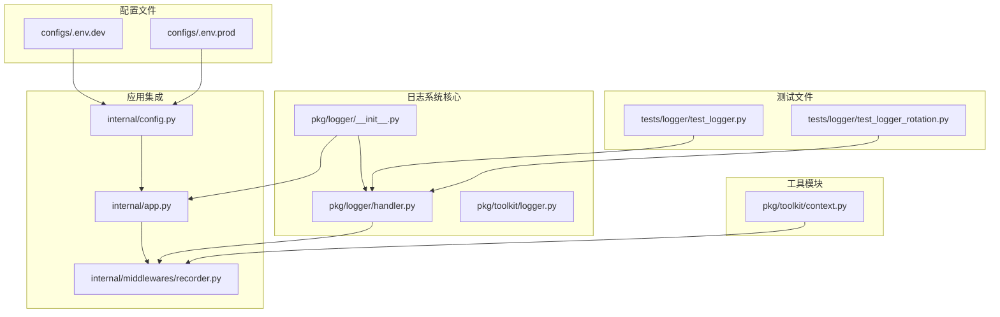

**图表来源**
- [pkg/logger/__init__.py](file://pkg/logger/__init__.py#L1-L118)
- [pkg/logger/handler.py](file://pkg/logger/handler.py#L1-L461)
- [internal/app.py](file://internal/app.py#L1-L111)

**章节来源**
- [pkg/logger/__init__.py](file://pkg/logger/__init__.py#L1-L118)
- [pkg/logger/handler.py](file://pkg/logger/handler.py#L1-L461)
- [internal/app.py](file://internal/app.py#L1-L111)

## 核心组件

### LoggerHandler 类

LoggerHandler 是日志系统的核心管理器，负责配置和管理所有日志相关的功能。

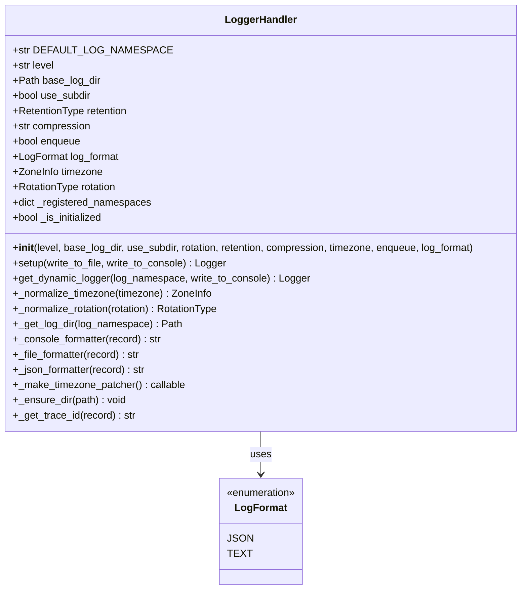

**图表来源**
- [pkg/logger/handler.py](file://pkg/logger/handler.py#L30-L461)

### 日志初始化器

提供了简单易用的日志初始化接口，支持延迟初始化和代理模式。

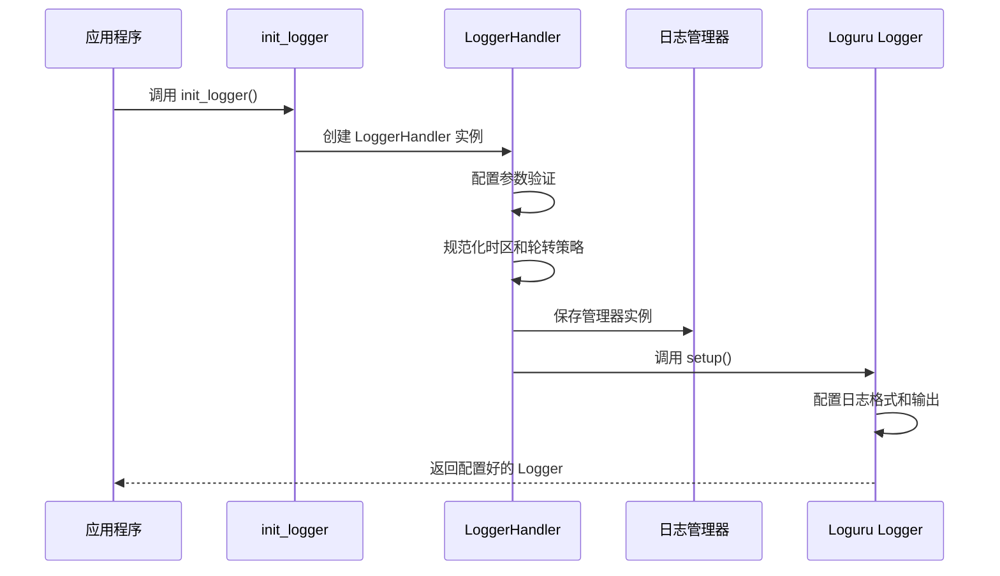

**图表来源**
- [pkg/logger/__init__.py](file://pkg/logger/__init__.py#L46-L91)
- [pkg/logger/handler.py](file://pkg/logger/handler.py#L171-L231)

**章节来源**
- [pkg/logger/handler.py](file://pkg/logger/handler.py#L30-L461)
- [pkg/logger/__init__.py](file://pkg/logger/__init__.py#L46-L91)

## 架构概览

日志系统采用分层架构设计，确保了良好的可扩展性和维护性：

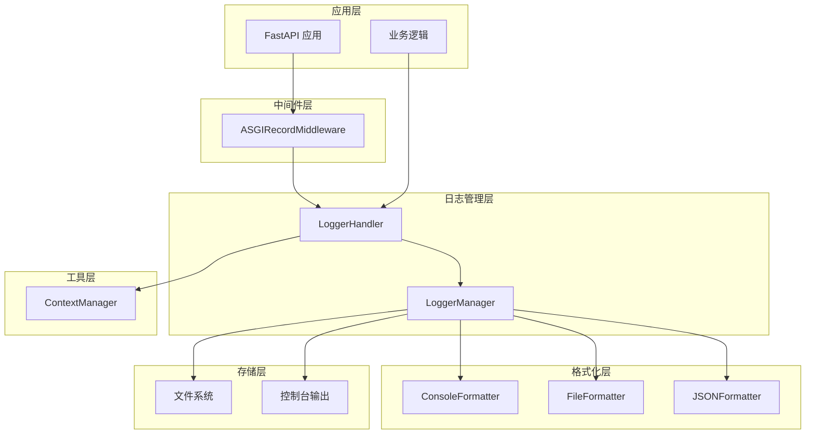

**图表来源**
- [internal/middlewares/recorder.py](file://internal/middlewares/recorder.py#L68-L148)
- [pkg/logger/handler.py](file://pkg/logger/handler.py#L30-L461)
- [pkg/toolkit/context.py](file://pkg/toolkit/context.py#L1-L122)

## 详细组件分析

### 子目录组织机制

**新增** 系统现在支持通过 `use_subdir` 参数控制日志文件的组织方式：

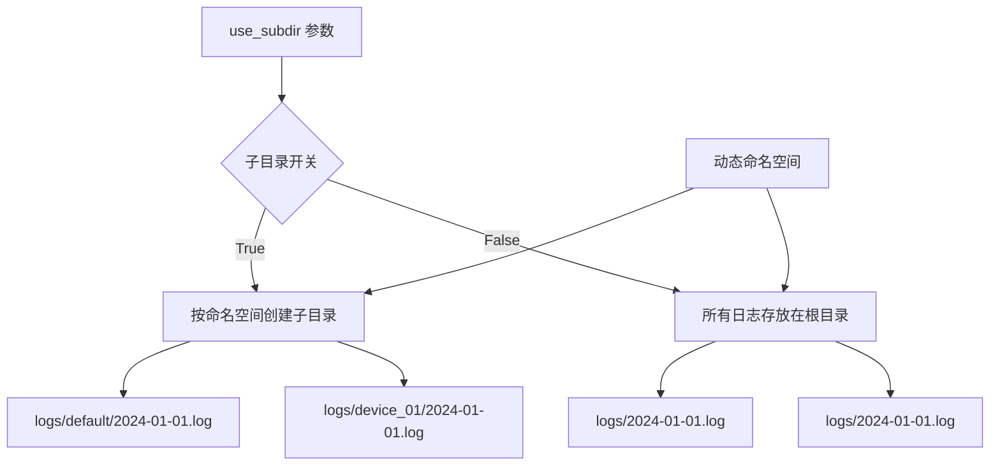

**图表来源**
- [pkg/logger/handler.py](file://pkg/logger/handler.py#L156-L169)
- [tests/logger/test_logger_rotation.py](file://tests/logger/test_logger_rotation.py#L159-L227)

### 增强的时区处理机制

系统实现了智能的时区处理机制，确保日志时间和文件名的一致性：

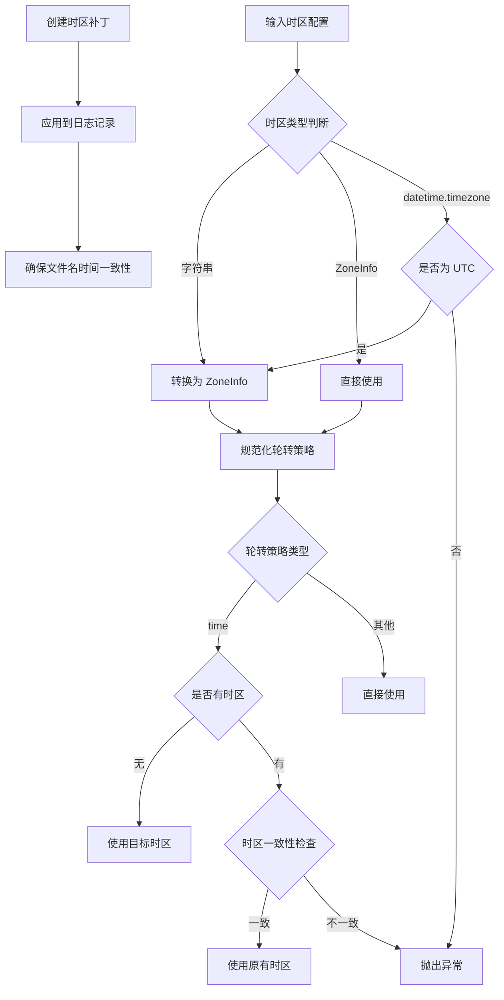

**图表来源**
- [pkg/logger/handler.py](file://pkg/logger/handler.py#L90-L154)
- [pkg/logger/handler.py](file://pkg/logger/handler.py#L411-L428)

### 动态日志命名空间

系统支持动态创建和管理多个日志命名空间：

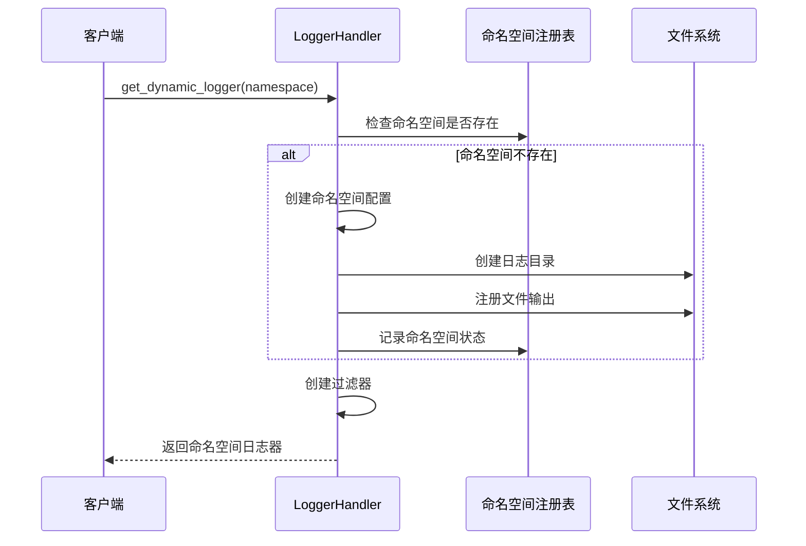

**图表来源**
- [pkg/logger/handler.py](file://pkg/logger/handler.py#L233-L306)

### Trace ID 验证和降级机制

**新增** 系统实现了智能的 trace ID 验证和降级机制：

```mermaid
flowchart TD
A[获取 trace_id] --> B{extra[trace_id] 存在?}
B --> |是| C{是否有效?}
B --> |否| D[从上下文获取]
C --> |是| E[使用有效 trace_id]
C --> |否| F[从上下文获取]
D --> G{是否获取成功?}
F --> G
G --> |是| H[使用上下文 trace_id]
G --> |否| I[使用默认值 "-" ]
E --> J[返回 trace_id]
H --> J
I --> J
```

**图表来源**
- [pkg/logger/handler.py](file://pkg/logger/handler.py#L439-L460)
- [pkg/toolkit/context.py](file://pkg/toolkit/context.py#L89-L122)

### 错误处理和降级机制

系统实现了完善的错误处理和降级机制：

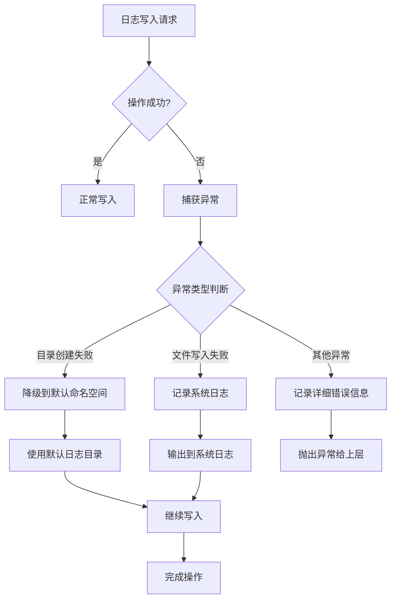

**图表来源**
- [pkg/logger/handler.py](file://pkg/logger/handler.py#L287-L289)

**章节来源**
- [pkg/logger/handler.py](file://pkg/logger/handler.py#L90-L154)
- [pkg/logger/handler.py](file://pkg/logger/handler.py#L156-L169)
- [pkg/logger/handler.py](file://pkg/logger/handler.py#L233-L306)
- [pkg/logger/handler.py](file://pkg/logger/handler.py#L439-L460)
- [pkg/logger/handler.py](file://pkg/logger/handler.py#L287-L289)

### 中间件集成

ASGIRecordMiddleware 集成了完整的请求日志记录功能：

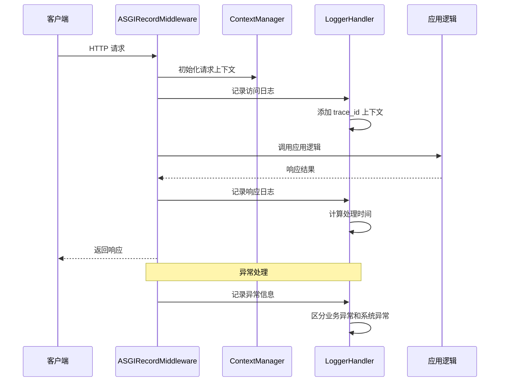

**图表来源**
- [internal/middlewares/recorder.py](file://internal/middlewares/recorder.py#L105-L148)
- [internal/middlewares/recorder.py](file://internal/middlewares/recorder.py#L73-L86)

**章节来源**
- [internal/middlewares/recorder.py](file://internal/middlewares/recorder.py#L68-L148)

### 配置管理系统

系统支持多环境配置，通过环境变量控制日志格式：

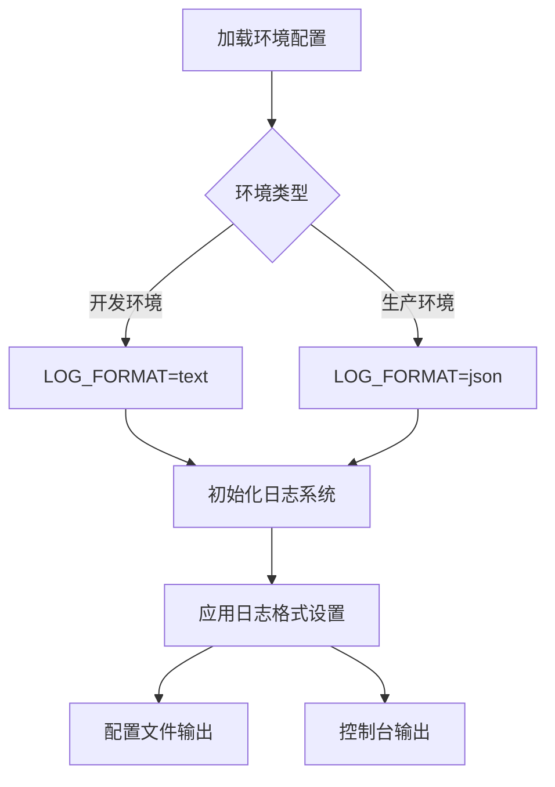

**图表来源**
- [configs/.env.dev](file://configs/.env.dev#L1-L22)
- [configs/.env.prod](file://configs/.env.prod#L1-L22)
- [internal/config.py](file://internal/config.py#L43-L44)

**章节来源**
- [internal/config.py](file://internal/config.py#L43-L44)
- [configs/.env.dev](file://configs/.env.dev#L1-L22)
- [configs/.env.prod](file://configs/.env.prod#L1-L22)

## 依赖关系分析

日志系统的关键依赖关系如下：

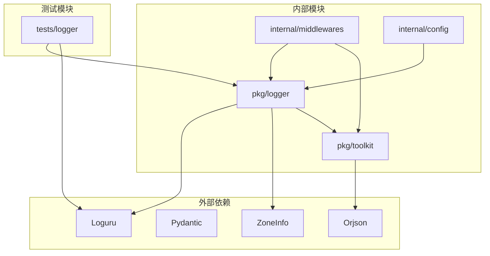

**图表来源**
- [pkg/logger/__init__.py](file://pkg/logger/__init__.py#L17-L22)
- [pkg/logger/handler.py](file://pkg/logger/handler.py#L1-L13)
- [internal/middlewares/recorder.py](file://internal/middlewares/recorder.py#L9-L14)

**章节来源**
- [pkg/logger/__init__.py](file://pkg/logger/__init__.py#L17-L22)
- [pkg/logger/handler.py](file://pkg/logger/handler.py#L1-L13)
- [internal/middlewares/recorder.py](file://internal/middlewares/recorder.py#L9-L14)

## 性能考虑

日志系统在设计时充分考虑了性能优化：

### 多进程安全
- 使用 `enqueue=True` 确保多进程环境下的日志写入安全
- 通过队列机制避免并发写入冲突

### 内存优化
- 使用惰性初始化减少启动时的内存占用
- 动态命名空间按需创建，避免不必要的资源消耗

### I/O 优化
- 文件轮转采用 Loguru 内置机制，减少额外的 I/O 操作
- JSON 序列化使用高性能的 Orjson 库

### 缓存策略
- 日志命名空间注册表缓存已创建的命名空间
- 时区补丁函数只创建一次并复用

### **新增** 子目录组织优化
- **新增** 子目录组织减少了单个目录中的文件数量
- **新增** 提高了文件系统的性能表现
- **新增** 便于按模块或功能分类管理日志

## 故障排除指南

### 常见问题及解决方案

#### 1. 日志文件无法创建
**症状**: 日志写入失败，出现权限错误
**原因**: 目标目录权限不足或不存在
**解决方案**: 
- 检查日志目录权限
- 确保父目录存在
- 使用管理员权限运行

#### 2. 时区配置错误
**症状**: 日志时间与预期不符
**原因**: 时区配置不一致
**解决方案**:
- 确保 `rotation` 和 `timezone` 配置一致
- 使用 `ZoneInfo` 对象而不是 `datetime.timezone`

#### 3. 日志格式异常
**症状**: JSON 格式日志解析失败
**原因**: JSON 序列化过程中出现异常类型
**解决方案**:
- 检查 `json_content` 的数据类型
- 确保只传递可序列化对象

#### 4. 性能问题
**症状**: 应用响应变慢
**原因**: 日志写入阻塞
**解决方案**:
- 启用 `enqueue` 参数
- 调整日志级别
- 优化日志格式

#### 5. **新增** 子目录组织问题
**症状**: 日志文件未按预期组织
**原因**: `use_subdir` 配置错误或权限问题
**解决方案**:
- 检查 `use_subdir` 参数设置
- 确认日志目录写入权限
- 验证命名空间名称的有效性

#### 6. **新增** Trace ID 验证失败
**症状**: 日志中 trace_id 显示为 "-"
**原因**: trace_id 无效或未正确设置
**解决方案**:
- 检查请求头中的 X-Trace-ID
- 验证 trace_id 格式和有效性
- 确保中间件正确初始化上下文

**章节来源**
- [tests/logger/test_logger.py](file://tests/logger/test_logger.py#L111-L149)
- [tests/logger/test_logger_rotation.py](file://tests/logger/test_logger_rotation.py#L123-L143)

## 结论

本日志系统增强了 FastAPI 应用的可观测性和可维护性，具有以下优势：

1. **灵活性**: 支持多种日志格式和动态命名空间
2. **可靠性**: 完善的错误处理和降级机制
3. **性能**: 多进程安全和优化的 I/O 操作
4. **易用性**: 简洁的 API 接口和配置管理
5. **可测试性**: 全面的单元测试覆盖
6. **可扩展性**: **新增** 支持子目录组织，便于大规模应用管理
7. **稳定性**: **新增** 增强的 trace ID 验证机制，确保日志追踪准确性

通过合理的架构设计和实现，该日志系统能够满足从开发到生产的各种需求，为应用程序提供强大的日志记录能力。