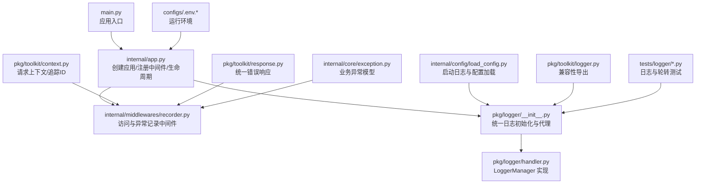
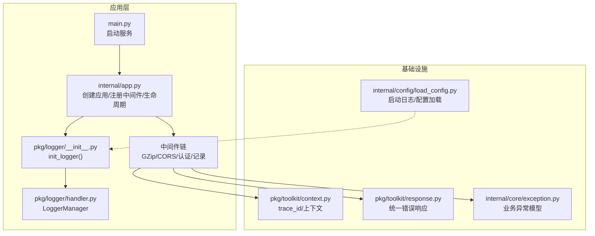
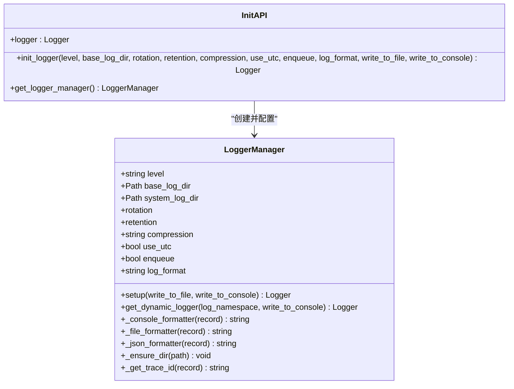
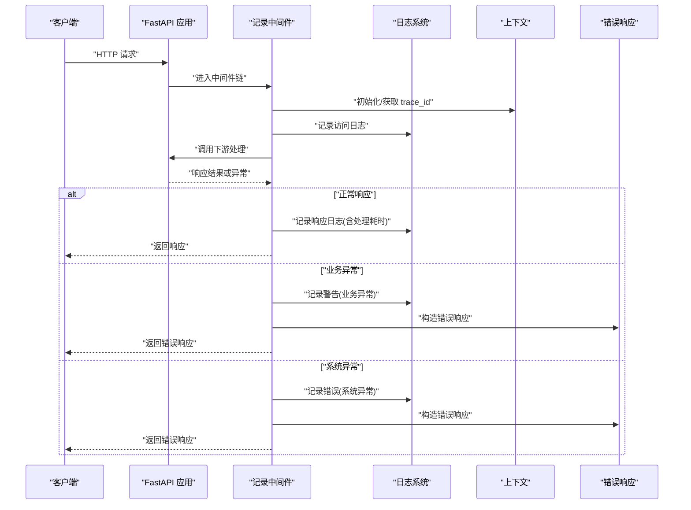
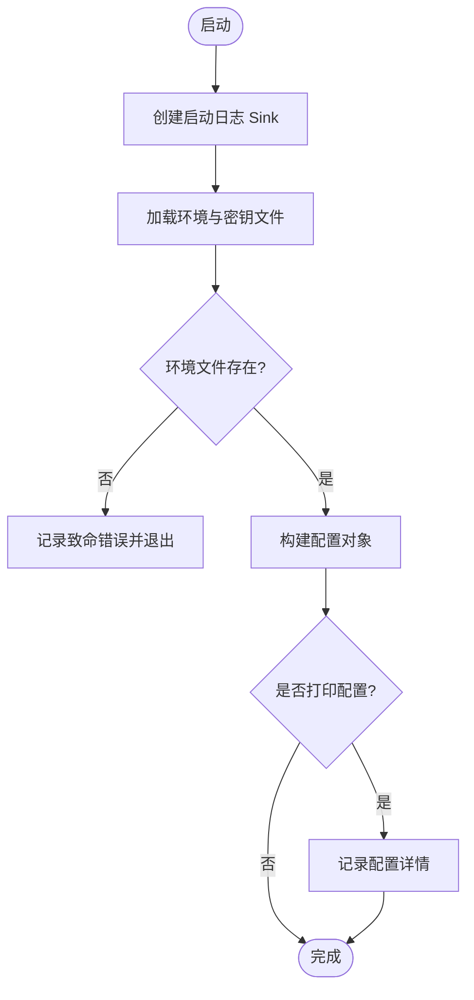
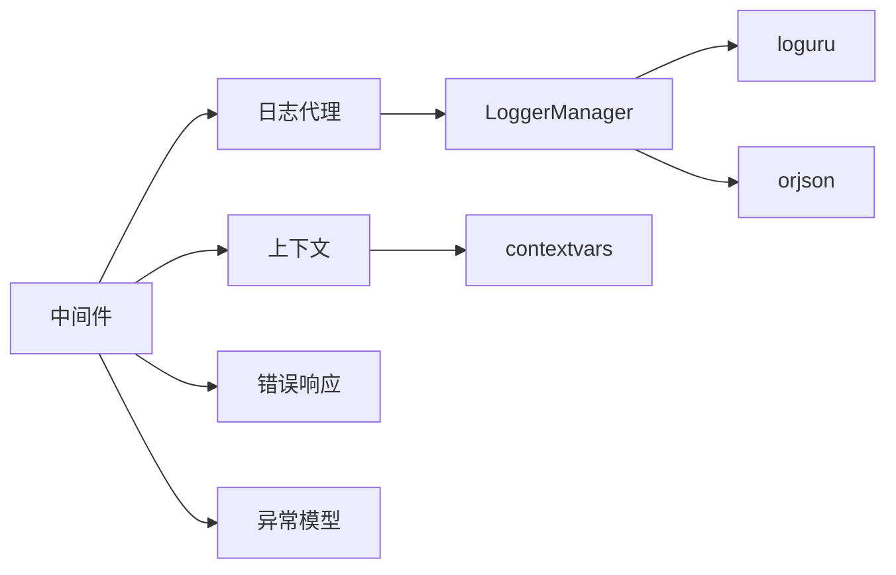

# 监控与日志管理

<cite>
**本文引用的文件**
- [main.py](file://main.py)
- [internal/app.py](file://internal/app.py)
- [internal/middlewares/recorder.py](file://internal/middlewares/recorder.py)
- [internal/config/load_config.py](file://internal/config/load_config.py)
- [pkg/logger/__init__.py](file://pkg/logger/__init__.py)
- [pkg/logger/handler.py](file://pkg/logger/handler.py)
- [pkg/toolkit/logger.py](file://pkg/toolkit/logger.py)
- [pkg/toolkit/context.py](file://pkg/toolkit/context.py)
- [pkg/toolkit/response.py](file://pkg/toolkit/response.py)
- [internal/core/exception.py](file://internal/core/exception.py)
- [tests/logger/test_logger.py](file://tests/logger/test_logger.py)
- [tests/logger/test_logger_rotation.py](file://tests/logger/test_logger_rotation.py)
- [configs/.env.dev](file://configs/.env.dev)
- [configs/.env.prod](file://configs/.env.prod)
</cite>

## 目录
1. [简介](#简介)
2. [项目结构](#项目结构)
3. [核心组件](#核心组件)
4. [架构总览](#架构总览)
5. [组件详解](#组件详解)
6. [依赖关系分析](#依赖关系分析)
7. [性能与监控](#性能与监控)
8. [故障排查指南](#故障排查指南)
9. [结论](#结论)
10. [附录](#附录)

## 简介
本文件面向监控与日志管理，系统化梳理本项目的日志记录机制、日志级别与格式、日志轮转与保留策略、性能监控指标与健康检查思路、日志聚合与实时监控建议、告警配置与仪表板设置要点，以及日志搜索、故障诊断与性能分析方法。文档同时给出与现有代码实现相契合的实践方案与可视化图示。

## 项目结构
围绕监控与日志的关键文件分布如下：
- 应用入口与生命周期：main.py、internal/app.py
- 日志初始化与统一入口：pkg/logger/__init__.py、pkg/logger/handler.py
- 访问与异常记录中间件：internal/middlewares/recorder.py
- 启动阶段日志与配置加载：internal/config/load_config.py
- 上下文与追踪：pkg/toolkit/context.py
- 错误响应与异常模型：pkg/toolkit/response.py、internal/core/exception.py
- 兼容性导出模块：pkg/toolkit/logger.py
- 测试用例：tests/logger/test_logger.py、tests/logger/test_logger_rotation.py
- 环境配置样例：configs/.env.dev、configs/.env.prod

图表来源
- [main.py](file://main.py#L1-L18)
- [internal/app.py](file://internal/app.py#L1-L109)
- [internal/middlewares/recorder.py](file://internal/middlewares/recorder.py#L1-L123)
- [internal/config/load_config.py](file://internal/config/load_config.py#L1-L243)
- [pkg/logger/__init__.py](file://pkg/logger/__init__.py#L1-L113)
- [pkg/logger/handler.py](file://pkg/logger/handler.py#L1-L332)
- [pkg/toolkit/context.py](file://pkg/toolkit/context.py#L1-L107)
- [pkg/toolkit/response.py](file://pkg/toolkit/response.py#L1-L233)
- [internal/core/exception.py](file://internal/core/exception.py#L1-L38)
- [pkg/toolkit/logger.py](file://pkg/toolkit/logger.py#L1-L32)
- [tests/logger/test_logger.py](file://tests/logger/test_logger.py#L1-L150)
- [tests/logger/test_logger_rotation.py](file://tests/logger/test_logger_rotation.py#L1-L112)
- [configs/.env.dev](file://configs/.env.dev#L1-L20)
- [configs/.env.prod](file://configs/.env.prod#L1-L20)

章节来源
- [main.py](file://main.py#L1-L18)
- [internal/app.py](file://internal/app.py#L1-L109)
- [internal/middlewares/recorder.py](file://internal/middlewares/recorder.py#L1-L123)
- [internal/config/load_config.py](file://internal/config/load_config.py#L1-L243)
- [pkg/logger/__init__.py](file://pkg/logger/__init__.py#L1-L113)
- [pkg/logger/handler.py](file://pkg/logger/handler.py#L1-L332)
- [pkg/toolkit/context.py](file://pkg/toolkit/context.py#L1-L107)
- [pkg/toolkit/response.py](file://pkg/toolkit/response.py#L1-L233)
- [internal/core/exception.py](file://internal/core/exception.py#L1-L38)
- [pkg/toolkit/logger.py](file://pkg/toolkit/logger.py#L1-L32)
- [tests/logger/test_logger.py](file://tests/logger/test_logger.py#L1-L150)
- [tests/logger/test_logger_rotation.py](file://tests/logger/test_logger_rotation.py#L1-L112)
- [configs/.env.dev](file://configs/.env.dev#L1-L20)
- [configs/.env.prod](file://configs/.env.prod#L1-L20)

## 核心组件
- 日志统一入口与代理
  - 通过统一初始化函数完成日志器配置与延迟代理，支持控制台与文件输出、轮转与保留策略、UTC 时区与 JSON/文本格式等。
- LoggerManager 实现
  - 提供系统日志与动态命名空间日志的注册能力；支持按命名空间隔离日志输出；内置多种格式化器与过滤器；具备目录创建与降级策略。
- 访问与异常记录中间件
  - 记录请求与响应日志，注入处理耗时与追踪ID；区分业务异常与系统异常，统一错误响应；在生命周期内记录应用启停状态。
- 启动阶段日志
  - 在配置加载前使用 loguru 记录启动日志，便于早期问题定位。
- 请求上下文与追踪
  - 通过 context 管理 trace_id，贯穿日志与中间件，便于跨组件关联。
- 错误响应与异常模型
  - 统一错误响应结构，配合中间件进行异常分级与记录。

章节来源
- [pkg/logger/__init__.py](file://pkg/logger/__init__.py#L1-L113)
- [pkg/logger/handler.py](file://pkg/logger/handler.py#L1-L332)
- [internal/middlewares/recorder.py](file://internal/middlewares/recorder.py#L1-L123)
- [internal/config/load_config.py](file://internal/config/load_config.py#L1-L243)
- [pkg/toolkit/context.py](file://pkg/toolkit/context.py#L1-L107)
- [pkg/toolkit/response.py](file://pkg/toolkit/response.py#L1-L233)
- [internal/core/exception.py](file://internal/core/exception.py#L1-L38)

## 架构总览
下图展示日志与监控在系统中的位置与交互：

图表来源
- [main.py](file://main.py#L1-L18)
- [internal/app.py](file://internal/app.py#L1-L109)
- [internal/middlewares/recorder.py](file://internal/middlewares/recorder.py#L1-L123)
- [internal/config/load_config.py](file://internal/config/load_config.py#L1-L243)
- [pkg/logger/__init__.py](file://pkg/logger/__init__.py#L1-L113)
- [pkg/logger/handler.py](file://pkg/logger/handler.py#L1-L332)
- [pkg/toolkit/context.py](file://pkg/toolkit/context.py#L1-L107)
- [pkg/toolkit/response.py](file://pkg/toolkit/response.py#L1-L233)
- [internal/core/exception.py](file://internal/core/exception.py#L1-L38)

## 组件详解

### 日志初始化与统一入口
- 初始化流程
  - 应用生命周期中调用初始化函数，创建 LoggerManager 并配置控制台与文件输出；支持 JSON/文本两种格式；可启用 UTC 时区与多进程队列。
  - 控制台格式化器输出时间、级别、位置、追踪ID与命名空间；文件格式化器输出文本日志并支持附加 JSON 内容。
- 动态命名空间日志
  - 为不同模块或设备创建独立命名空间日志，自动注册文件 Sink；若目录创建失败则降级到系统日志并记录错误。
- 兼容性导出
  - 旧模块保留向后兼容，提示迁移到新模块。

图表来源
- [pkg/logger/handler.py](file://pkg/logger/handler.py#L21-L332)
- [pkg/logger/__init__.py](file://pkg/logger/__init__.py#L45-L113)

章节来源
- [pkg/logger/__init__.py](file://pkg/logger/__init__.py#L1-L113)
- [pkg/logger/handler.py](file://pkg/logger/handler.py#L1-L332)
- [pkg/toolkit/logger.py](file://pkg/toolkit/logger.py#L1-L32)

### 访问与异常记录中间件
- 记录内容
  - 访问日志：客户端IP、方法、路径、查询参数与追踪ID；响应日志：处理耗时。
  - 区分业务异常与系统异常，分别记录为警告与错误；若尚未发送响应头则返回统一错误响应。
- 追踪与上下文
  - 从请求头提取或生成追踪ID，注入响应头与日志；通过上下文传递追踪ID，供日志格式化器读取。
- 生命周期
  - 在应用启动与关闭时记录关键状态，便于运维观测。

图表来源
- [internal/middlewares/recorder.py](file://internal/middlewares/recorder.py#L66-L123)
- [pkg/toolkit/context.py](file://pkg/toolkit/context.py#L1-L107)
- [pkg/toolkit/response.py](file://pkg/toolkit/response.py#L181-L233)
- [internal/core/exception.py](file://internal/core/exception.py#L1-L38)

章节来源
- [internal/middlewares/recorder.py](file://internal/middlewares/recorder.py#L1-L123)
- [pkg/toolkit/context.py](file://pkg/toolkit/context.py#L1-L107)
- [pkg/toolkit/response.py](file://pkg/toolkit/response.py#L1-L233)
- [internal/core/exception.py](file://internal/core/exception.py#L1-L38)

### 启动阶段日志与配置加载
- 启动日志
  - 在配置加载前使用 loguru 记录启动阶段日志，包含轮转与保留策略配置，便于早期问题定位。
- 配置加载
  - 通过环境文件与密钥文件加载配置，支持多环境切换；加载成功后可选择打印配置详情。

图表来源
- [internal/config/load_config.py](file://internal/config/load_config.py#L17-L243)

章节来源
- [internal/config/load_config.py](file://internal/config/load_config.py#L1-L243)

### 日志格式、轮转与保留策略
- 日志格式
  - 控制台：彩色输出，包含时间、级别、位置、追踪ID、命名空间与消息；可选附加 JSON 内容。
  - 文件：文本格式，包含时间、级别、位置、追踪ID、命名空间与消息；支持附加 JSON 内容。
  - JSON Lines：结构化输出，包含时间、级别、追踪ID、位置、消息与扩展字段。
- 轮转策略
  - 支持按大小、时间或自定义条件轮转；默认按 UTC 时间每日 00:00 轮转；可配置压缩与多进程队列。
- 保留策略
  - 支持按天数保留；轮转时触发清理旧文件。
- 目录与降级
  - 若动态命名空间目录创建失败，自动降级到系统日志并记录错误。

章节来源
- [pkg/logger/handler.py](file://pkg/logger/handler.py#L220-L332)
- [tests/logger/test_logger.py](file://tests/logger/test_logger.py#L69-L150)
- [tests/logger/test_logger_rotation.py](file://tests/logger/test_logger_rotation.py#L10-L112)

### 性能监控指标与健康检查
- 指标来源
  - 请求处理耗时：中间件计算并记录响应日志，可用于统计 P50/P95/P99。
  - 异常级别：业务异常与系统异常分别计数，辅助 SLO/SLA 监控。
  - 应用启停：生命周期事件记录，便于观察可用性。
- 健康检查
  - 可基于中间件记录的访问与响应日志，结合外部探针定期探测服务端口与路由，形成健康检查闭环。
- 建议
  - 将处理耗时与异常计数接入指标系统（如 Prometheus），并设置阈值告警。

章节来源
- [internal/middlewares/recorder.py](file://internal/middlewares/recorder.py#L36-L102)
- [internal/app.py](file://internal/app.py#L85-L109)

### 日志聚合、实时监控与告警
- 日志聚合
  - 将系统日志与动态命名空间日志统一收集至同一日志平台；按命名空间与追踪ID建立索引。
- 实时监控
  - 基于日志中的处理耗时与异常级别，构建仪表板；设置阈值告警与趋势分析。
- 告警配置
  - 建议针对异常级别、处理耗时、错误率与服务可用性设置多级告警。

章节来源
- [pkg/logger/handler.py](file://pkg/logger/handler.py#L146-L218)
- [internal/middlewares/recorder.py](file://internal/middlewares/recorder.py#L92-L111)

### 监控仪表板与关键指标分析
- 仪表板建议
  - 请求量与错误率、P50/P95/P99 处理耗时、业务异常与系统异常占比、应用启停事件。
- 分析方法
  - 使用日志中的追踪ID进行跨组件关联分析；结合异常堆栈与上下文信息定位根因。

章节来源
- [pkg/toolkit/context.py](file://pkg/toolkit/context.py#L1-L107)
- [pkg/toolkit/response.py](file://pkg/toolkit/response.py#L181-L233)

### 日志搜索、故障诊断与性能分析
- 日志搜索
  - 基于追踪ID、命名空间、时间范围与关键字进行检索；JSON Lines 格式便于结构化查询。
- 故障诊断
  - 优先查看异常级别日志与错误响应；结合追踪ID串联请求链路；定位异常发生位置。
- 性能分析
  - 统计处理耗时分布，识别慢请求与异常波动；结合业务场景设定性能基线。

章节来源
- [pkg/logger/handler.py](file://pkg/logger/handler.py#L270-L296)
- [internal/middlewares/recorder.py](file://internal/middlewares/recorder.py#L92-L111)

### 监控工具集成与自定义指标
- 工具集成
  - 将日志系统对接日志平台（如 ELK、Loki）与指标平台（如 Prometheus/Grafana）。
- 自定义指标
  - 基于日志中的处理耗时与异常计数，编写采集器或解析规则，生成自定义指标。

章节来源
- [pkg/logger/__init__.py](file://pkg/logger/__init__.py#L45-L90)
- [pkg/logger/handler.py](file://pkg/logger/handler.py#L146-L218)

## 依赖关系分析
- 组件耦合
  - 中间件依赖日志代理与上下文；日志系统依赖 LoggerManager；错误响应与异常模型为中间件提供统一错误处理。
- 外部依赖
  - 使用 loguru 作为底层日志框架；使用 orjson 进行高性能序列化；使用 contextvars 管理请求上下文。

图表来源
- [internal/middlewares/recorder.py](file://internal/middlewares/recorder.py#L1-L123)
- [pkg/logger/__init__.py](file://pkg/logger/__init__.py#L1-L113)
- [pkg/logger/handler.py](file://pkg/logger/handler.py#L1-L332)
- [pkg/toolkit/context.py](file://pkg/toolkit/context.py#L1-L107)
- [pkg/toolkit/response.py](file://pkg/toolkit/response.py#L1-L233)
- [internal/core/exception.py](file://internal/core/exception.py#L1-L38)

章节来源
- [internal/middlewares/recorder.py](file://internal/middlewares/recorder.py#L1-L123)
- [pkg/logger/__init__.py](file://pkg/logger/__init__.py#L1-L113)
- [pkg/logger/handler.py](file://pkg/logger/handler.py#L1-L332)
- [pkg/toolkit/context.py](file://pkg/toolkit/context.py#L1-L107)
- [pkg/toolkit/response.py](file://pkg/toolkit/response.py#L1-L233)
- [internal/core/exception.py](file://internal/core/exception.py#L1-L38)

## 性能与监控
- 性能特性
  - 控制台与文件输出均支持多进程队列；JSON Lines 格式减少解析成本；UTC 时区确保跨时区一致性。
- 监控建议
  - 将处理耗时与异常计数接入指标系统；设置阈值告警；结合日志平台进行实时检索与分析。

章节来源
- [pkg/logger/handler.py](file://pkg/logger/handler.py#L104-L144)
- [internal/middlewares/recorder.py](file://internal/middlewares/recorder.py#L92-L111)

## 故障排查指南
- 常见问题
  - 日志目录不可写：动态命名空间日志会降级到系统日志并记录错误；检查权限与磁盘配额。
  - 轮转未生效：确认轮转策略与保留策略配置；检查系统时间与时区设置。
  - 追踪ID缺失：检查请求头与中间件上下文初始化；确保在异常处理前正确设置。
- 定位步骤
  - 使用追踪ID在日志中定位请求链路；查看异常级别与错误响应；核对配置文件与环境变量。

章节来源
- [tests/logger/test_logger.py](file://tests/logger/test_logger.py#L111-L150)
- [tests/logger/test_logger_rotation.py](file://tests/logger/test_logger_rotation.py#L10-L112)
- [pkg/toolkit/context.py](file://pkg/toolkit/context.py#L89-L106)
- [internal/middlewares/recorder.py](file://internal/middlewares/recorder.py#L30-L63)

## 结论
本项目通过统一的日志入口与中间件实现了完善的访问与异常记录，结合灵活的轮转与保留策略，满足生产环境的可观测性需求。建议在此基础上进一步对接日志与指标平台，完善实时监控与告警体系，并持续优化日志格式与检索策略以提升故障诊断效率。

## 附录
- 环境配置
  - 开发与生产环境通过环境文件控制运行参数与行为；注意区分 DEBUG 与日志级别设置。
- 版本与兼容性
  - 旧模块提供兼容性导出，建议逐步迁移至新模块以获得更好的维护性。

章节来源
- [configs/.env.dev](file://configs/.env.dev#L1-L20)
- [configs/.env.prod](file://configs/.env.prod#L1-L20)
- [pkg/toolkit/logger.py](file://pkg/toolkit/logger.py#L1-L32)