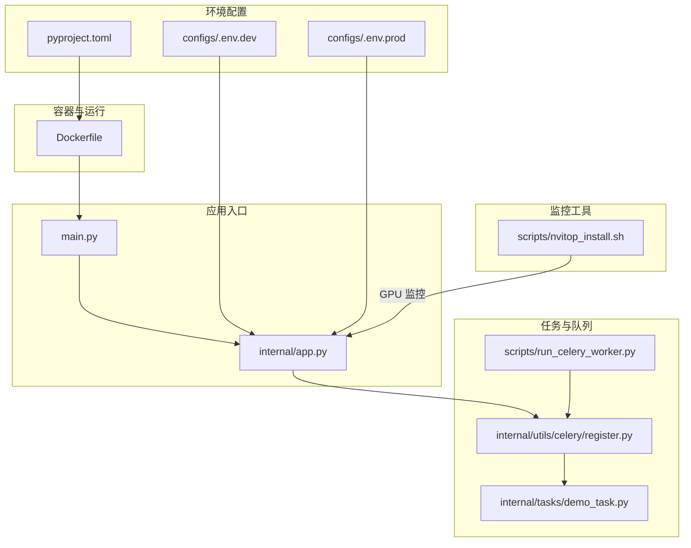
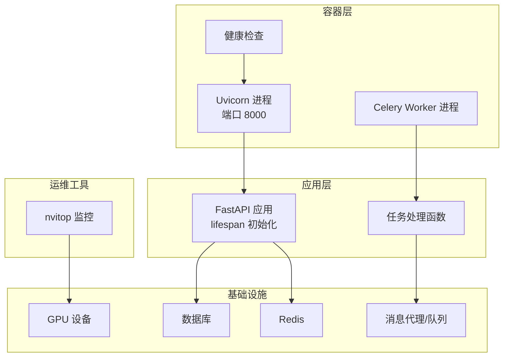
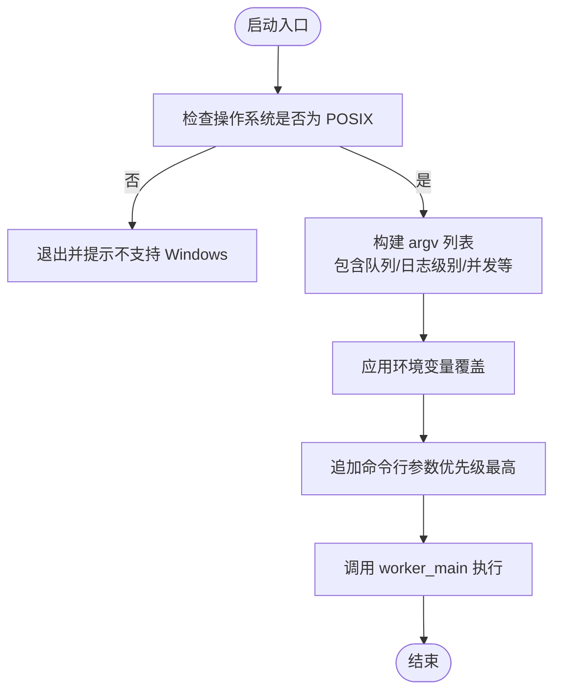
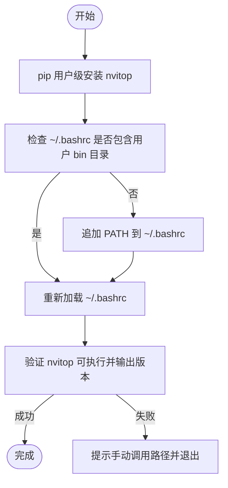
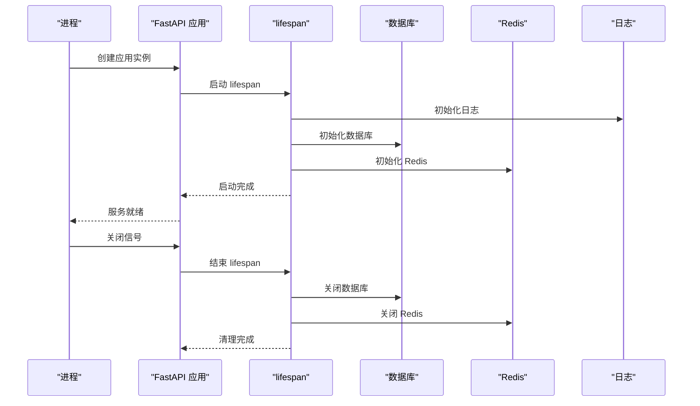
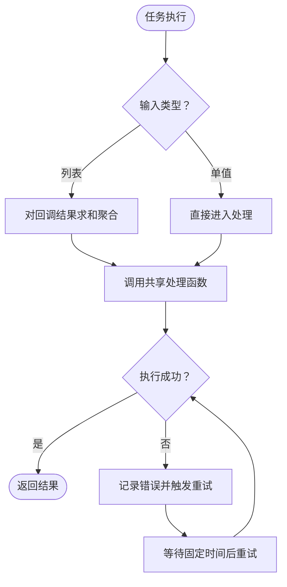
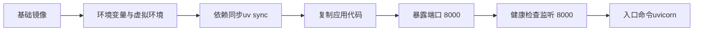
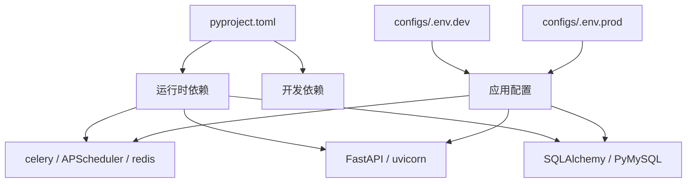

# 部署脚本与自动化

<cite>
**本文引用的文件**
- [scripts/run_celery_worker.py](file://scripts/run_celery_worker.py)
- [scripts/nvitop_install.sh](file://scripts/nvitop_install.sh)
- [Dockerfile](file://Dockerfile)
- [main.py](file://main.py)
- [internal/app.py](file://internal/app.py)
- [internal/tasks/demo_task.py](file://internal/tasks/demo_task.py)
- [internal/utils/celery/register.py](file://internal/utils/celery/register.py)
- [configs/.env.dev](file://configs/.env.dev)
- [configs/.env.prod](file://configs/.env.prod)
- [pyproject.toml](file://pyproject.toml)
</cite>

## 目录
1. [简介](#简介)
2. [项目结构](#项目结构)
3. [核心组件](#核心组件)
4. [架构总览](#架构总览)
5. [详细组件分析](#详细组件分析)
6. [依赖关系分析](#依赖关系分析)
7. [性能考虑](#性能考虑)
8. [故障排查指南](#故障排查指南)
9. [结论](#结论)
10. [附录](#附录)

## 简介
本文件面向部署工程师与运维人员，系统性说明项目的部署脚本与自动化运维方案，重点覆盖以下内容：
- run_celery_worker.py：Celery worker 启动流程、参数覆盖机制、任务处理与重试策略
- nvitop_install.sh：GPU 监控工具 nvitop 的安装与验证流程
- 容器化与健康检查：基于 Dockerfile 的镜像构建、健康检查与入口命令
- 部署流水线与 CI/CD 集成：从构建到发布的端到端流程建议
- 自动化部署脚本、服务重启与回滚策略
- 部署前检查、部署后验证与监控告警配置
- 最佳实践与常见问题解决方案

## 项目结构
项目采用“分层+功能模块”组织方式，部署相关的关键文件集中在 scripts、Dockerfile、configs 与内部基础设施模块中。

图表来源
- [main.py](file://main.py#L1-L18)
- [internal/app.py](file://internal/app.py#L1-L109)
- [Dockerfile](file://Dockerfile#L1-L38)
- [scripts/run_celery_worker.py](file://scripts/run_celery_worker.py#L1-L38)
- [internal/utils/celery/register.py](file://internal/utils/celery/register.py#L1-L29)
- [internal/tasks/demo_task.py](file://internal/tasks/demo_task.py#L1-L20)
- [configs/.env.dev](file://configs/.env.dev#L1-L20)
- [configs/.env.prod](file://configs/.env.prod#L1-L20)
- [pyproject.toml](file://pyproject.toml#L1-L155)
- [scripts/nvitop_install.sh](file://scripts/nvitop_install.sh#L1-L39)

章节来源
- [main.py](file://main.py#L1-L18)
- [internal/app.py](file://internal/app.py#L1-L109)
- [Dockerfile](file://Dockerfile#L1-L38)
- [pyproject.toml](file://pyproject.toml#L1-L155)

## 核心组件
- 应用入口与生命周期管理：通过应用工厂创建 FastAPI 实例，并在 lifespan 中完成数据库、Redis、签名认证、雪花 ID、AnyIO 任务等初始化与收尾。
- 容器化运行：基于 uvicorn 在 8000 端口提供服务，容器内置健康检查，确保端口监听正常。
- Celery 任务体系：定义可复用的任务处理函数，并通过装饰器注册为 Celery 任务；支持 Chord 回调聚合与自动重试。
- GPU 监控工具：提供一键安装 nvitop 的脚本，自动写入 PATH 并验证可用性。
- 环境配置：开发与生产环境变量分离，便于不同环境下的连接参数与行为控制。

章节来源
- [internal/app.py](file://internal/app.py#L17-L109)
- [Dockerfile](file://Dockerfile#L33-L37)
- [internal/utils/celery/register.py](file://internal/utils/celery/register.py#L8-L29)
- [internal/tasks/demo_task.py](file://internal/tasks/demo_task.py#L9-L20)
- [scripts/nvitop_install.sh](file://scripts/nvitop_install.sh#L1-L39)
- [configs/.env.dev](file://configs/.env.dev#L1-L20)
- [configs/.env.prod](file://configs/.env.prod#L1-L20)

## 架构总览
下图展示部署与运行的整体架构：容器承载应用与 Celery worker；任务通过队列调度；监控工具用于观测 GPU 使用情况。

图表来源
- [Dockerfile](file://Dockerfile#L33-L37)
- [internal/app.py](file://internal/app.py#L84-L109)
- [internal/utils/celery/register.py](file://internal/utils/celery/register.py#L8-L29)
- [scripts/nvitop_install.sh](file://scripts/nvitop_install.sh#L1-L39)

## 详细组件分析

### Celery Worker 启动脚本 run_celery_worker.py
- 功能概述
  - 限制仅在 POSIX 系统运行，Windows 不支持。
  - 默认日志级别、队列、并发池与并发数可通过环境变量覆盖。
  - 支持通过命令行追加额外参数，优先级最高。
  - 使用 worker_main 启动，避免 Click 对命令名解析的问题。
- 关键参数与默认值
  - 队列：默认队列名称由 Celery 客户端提供。
  - 日志级别：默认为调试级别。
  - 并发池类型：prefork。
  - 并发数：默认 4。
- 参数覆盖顺序
  - 环境变量覆盖默认值
  - 命令行追加参数覆盖所有默认与环境变量
- 任务处理
  - 通过 Celery 客户端注册的任务进行消费与执行。
  - 任务失败时具备重试策略与错误日志记录。

图表来源
- [scripts/run_celery_worker.py](file://scripts/run_celery_worker.py#L6-L34)

章节来源
- [scripts/run_celery_worker.py](file://scripts/run_celery_worker.py#L1-L38)

### GPU 监控工具 nvitop 安装脚本 nvitop_install.sh
- 功能概述
  - 使用用户级 pip 安装 nvitop。
  - 自动将用户二进制目录写入 PATH 并 source ~/.bashrc。
  - 验证 nvitop 是否可执行并输出版本信息。
  - 若安装失败，给出手动调用路径的提示。
- 安装步骤
  1) 安装 nvitop
  2) 检查并写入 PATH 至 ~/.bashrc
  3) 强制重新加载 bash 配置
  4) 验证安装与 PATH 生效
  5) 输出提示信息
- 注意事项
  - 需要确保用户目录与 PATH 设置正确。
  - 如 PATH 未生效，可参考脚本中的手动调用提示。

图表来源
- [scripts/nvitop_install.sh](file://scripts/nvitop_install.sh#L11-L36)

章节来源
- [scripts/nvitop_install.sh](file://scripts/nvitop_install.sh#L1-L39)

### 应用生命周期与服务启动
- 应用工厂与中间件
  - 应用在创建时根据配置决定调试模式与文档路由开关。
  - 注册异常处理、GZip 压缩、CORS、日志记录等中间件。
- 生命周期事件
  - 启动阶段：初始化日志、数据库、Redis、签名认证、雪花 ID、AnyIO 任务管理器。
  - 关闭阶段：关闭数据库、Redis、AnyIO 任务管理器。
- 服务启动
  - 通过 uvicorn 在 0.0.0.0:8000 提供服务，使用 uvloop 与 httptools 提升性能。

图表来源
- [internal/app.py](file://internal/app.py#L17-L109)
- [main.py](file://main.py#L10-L17)

章节来源
- [internal/app.py](file://internal/app.py#L17-L109)
- [main.py](file://main.py#L1-L18)

### Celery 任务与重试机制
- 任务定义
  - 通过装饰器注册任务，支持单值与 Chord 回调列表两种输入形态。
  - 任务内部调用共享的异步处理函数，实现逻辑复用。
- 错误处理与重试
  - 捕获异常并记录错误日志。
  - 使用固定延迟与最大重试次数的策略进行自动重试。

图表来源
- [internal/utils/celery/register.py](file://internal/utils/celery/register.py#L8-L29)
- [internal/tasks/demo_task.py](file://internal/tasks/demo_task.py#L9-L20)

章节来源
- [internal/utils/celery/register.py](file://internal/utils/celery/register.py#L1-L29)
- [internal/tasks/demo_task.py](file://internal/tasks/demo_task.py#L1-L20)

### 容器化与健康检查
- 基础镜像与环境
  - 使用 slim 基础镜像，设置时区、语言与 uv 索引源。
  - 全局激活虚拟环境，使用 uv 同步依赖。
- 健康检查
  - 通过检查 8000 端口监听状态判断容器健康。
- 入口命令
  - 使用 uvicorn 启动服务，绑定 0.0.0.0:8000，启用 uvloop 与 httptools。

图表来源
- [Dockerfile](file://Dockerfile#L1-L38)

章节来源
- [Dockerfile](file://Dockerfile#L1-L38)

## 依赖关系分析
- 运行时依赖
  - FastAPI、uvicorn、celery、APScheduler、redis、SQLAlchemy、PyJWT、PyMySQL、numpy、pandas、openai 等。
- 构建与开发依赖
  - pytest、ruff、black、mypy、grpcio、oss2、boto3 等。
- 环境变量
  - 开发与生产环境分别定义数据库、Redis、JWT 等参数，便于切换。

图表来源
- [pyproject.toml](file://pyproject.toml#L8-L70)
- [configs/.env.dev](file://configs/.env.dev#L1-L20)
- [configs/.env.prod](file://configs/.env.prod#L1-L20)

章节来源
- [pyproject.toml](file://pyproject.toml#L1-L155)
- [configs/.env.dev](file://configs/.env.dev#L1-L20)
- [configs/.env.prod](file://configs/.env.prod#L1-L20)

## 性能考虑
- 服务器性能
  - 使用 uvloop 与 httptools 提升异步 I/O 与 HTTP 处理性能。
  - GZip 压缩中间件降低传输体积。
- 任务并发
  - Celery worker 默认 prefork 池与并发数可在脚本中调整，结合 CPU/GPU 资源合理配置。
- 数据库与缓存
  - 初始化阶段完成连接池准备，减少请求时开销。
- 健康检查
  - 容器健康检查确保服务可用性，便于编排系统快速发现故障。

## 故障排查指南
- Windows 不支持
  - run_celery_worker.py 明确禁止在 Windows 上运行，请使用 Linux 或 macOS。
- PATH 未生效导致 nvitop 无法调用
  - 按脚本提示重新加载 bash 配置，或参考脚本中的手动调用路径。
- 端口占用或健康检查失败
  - 检查容器端口映射与防火墙设置，确认 8000 端口监听正常。
- 任务失败与重试
  - 查看任务日志，确认重试次数与延迟策略是否符合预期；必要时调整重试参数。
- 环境变量不一致
  - 确认当前使用的 .env 文件与目标环境匹配，避免数据库或缓存连接错误。

章节来源
- [scripts/run_celery_worker.py](file://scripts/run_celery_worker.py#L8-L10)
- [scripts/nvitop_install.sh](file://scripts/nvitop_install.sh#L22-L36)
- [Dockerfile](file://Dockerfile#L33-L37)
- [internal/utils/celery/register.py](file://internal/utils/celery/register.py#L25-L28)

## 结论
本文件提供了从部署脚本到自动化运维的完整说明，涵盖 Celery worker 的启动与任务处理、GPU 监控工具安装、容器化与健康检查、以及部署前后检查与监控告警建议。建议在实际环境中结合 CI/CD 系统实现自动化构建、测试与发布，并配套完善的回滚与告警策略，确保系统稳定与可维护性。

## 附录

### 部署流水线与 CI/CD 集成建议
- 构建阶段
  - 使用容器镜像构建，确保依赖同步与健康检查通过。
- 测试阶段
  - 运行单元测试与集成测试，必要时启动 Redis、Celery worker 与数据库。
- 发布阶段
  - 推送镜像至镜像仓库，更新编排配置并滚动更新。
- 回滚策略
  - 保留最近几个版本镜像，出现异常时快速回退至上一稳定版本。
- 监控与告警
  - 结合容器健康检查、应用日志与指标上报，设置阈值告警与自动恢复。

### 部署前检查清单
- 环境变量文件正确性（开发/生产）
- 数据库与 Redis 连通性
- 队列服务可用性（Broker）
- GPU 监控工具可用性（如需）

### 部署后验证清单
- 容器健康检查通过
- 服务端口监听正常
- 任务队列消费与重试行为符合预期
- 日志与指标采集正常