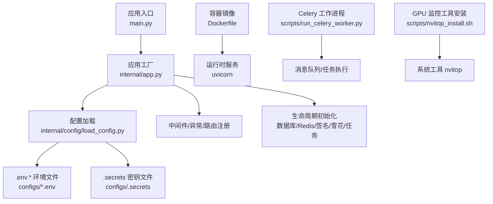
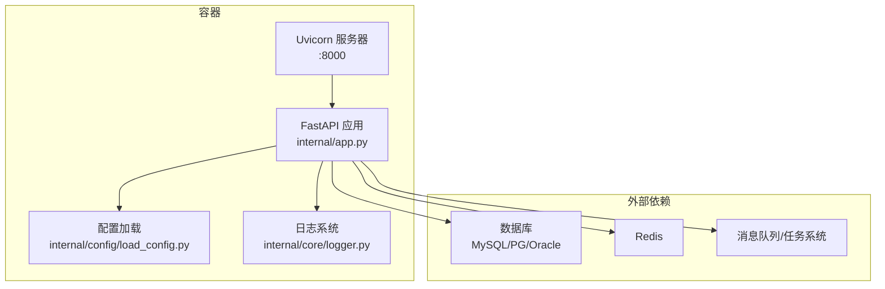
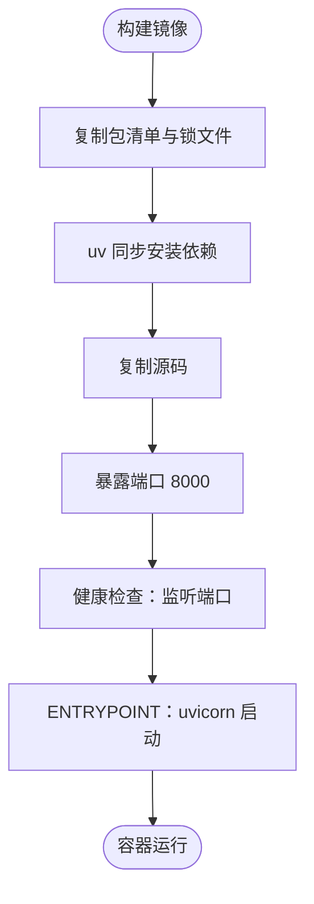
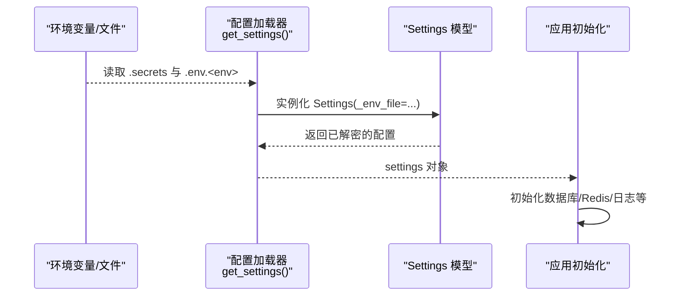
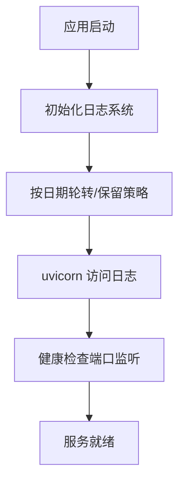
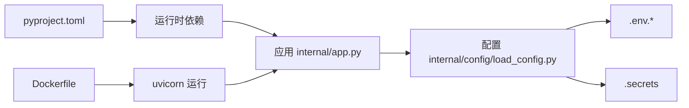

# 部署运维

<cite>
**本文引用的文件**
- [Dockerfile](file://Dockerfile)
- [.env.prod](file://configs/.env.prod)
- [.env.dev](file://configs/.env.dev)
- [.env.local](file://configs/.env.local)
- [.env.test](file://configs/.env.test)
- [.secrets.example](file://configs/.secrets.example)
- [pyproject.toml](file://pyproject.toml)
- [internal/app.py](file://internal/app.py)
- [internal/config/load_config.py](file://internal/config/load_config.py)
- [main.py](file://main.py)
- [internal/core/logger.py](file://internal/core/logger.py)
- [scripts/run_celery_worker.py](file://scripts/run_celery_worker.py)
- [scripts/nvitop_install.sh](file://scripts/nvitop_install.sh)
</cite>

## 目录
1. [简介](#简介)
2. [项目结构](#项目结构)
3. [核心组件](#核心组件)
4. [架构总览](#架构总览)
5. [详细组件分析](#详细组件分析)
6. [依赖关系分析](#依赖关系分析)
7. [性能与资源优化](#性能与资源优化)
8. [故障排查指南](#故障排查指南)
9. [结论](#结论)
10. [附录](#附录)

## 简介
本文件面向部署与运维团队，系统化阐述该 FastAPI 后端项目的容器化部署、生产环境配置与运行、监控与日志管理、安全加固、备份与灾备策略，以及常见问题排查。内容基于仓库中的实际配置与实现，涵盖 Docker 镜像构建、环境变量与密钥管理、健康检查、日志轮转、任务队列工作进程、GPU 监控工具安装等主题。

## 项目结构
该项目采用“应用层 + 配置层 + 基础设施层”的组织方式：
- 应用入口与路由注册位于 internal/app.py，通过 create_app 构建 FastAPI 实例，并在 lifespan 生命周期中初始化数据库、Redis、签名认证、雪花 ID 生成器与异步任务管理器。
- 配置加载位于 internal/config/load_config.py，支持多环境配置文件（.env.local/.dev/.test/.prod）、密钥解密（AES）、日志初始化与启动日志输出。
- 运行入口 main.py 提供本地开发服务器启动能力；生产运行由容器入口 uvicorn 执行。
- Dockerfile 定义镜像基础、依赖安装、暴露端口、健康检查与启动命令。
- scripts 目录提供 Celery 工作进程启动脚本与 GPU 监控工具安装脚本。

**图表来源**
- [main.py](file://main.py#L1-L18)
- [internal/app.py](file://internal/app.py#L1-L109)
- [internal/config/load_config.py](file://internal/config/load_config.py#L1-L243)
- [Dockerfile](file://Dockerfile#L1-L38)
- [scripts/run_celery_worker.py](file://scripts/run_celery_worker.py#L1-L38)
- [scripts/nvitop_install.sh](file://scripts/nvitop_install.sh#L1-L39)

**章节来源**
- [main.py](file://main.py#L1-L18)
- [internal/app.py](file://internal/app.py#L1-L109)
- [internal/config/load_config.py](file://internal/config/load_config.py#L1-L243)
- [Dockerfile](file://Dockerfile#L1-L38)
- [pyproject.toml](file://pyproject.toml#L1-L155)

## 核心组件
- 应用工厂与生命周期
  - create_app 创建 FastAPI 实例，按 DEBUG 控制开放文档路径；lifespan 在启动时初始化日志、数据库、Redis、签名认证、雪花 ID 与异步任务管理器，在关闭时进行资源回收。
- 配置加载与密钥解密
  - 通过 get_settings 读取 .secrets 获取 APP_ENV，随后加载对应 .env.<env>，并对 ENC(...) 包裹的敏感字段进行 AES 解密。
- 日志系统
  - init_logger 使用 LoggerManager 统一配置日志级别、轮转与保留策略；内部还提供启动阶段的日志输出。
- 容器与运行
  - Dockerfile 使用 uv 作为包管理器，预装依赖并暴露 8000 端口；健康检查通过监听端口判断存活；ENTRYPOINT 使用 uvicorn 并开启 access-log。
- 任务与监控
  - scripts/run_celery_worker.py 提供 Celery 工作进程启动参数与扩展 CLI 参数能力；scripts/nvitop_install.sh 提供 nvitop 安装与 PATH 注入。

**章节来源**
- [internal/app.py](file://internal/app.py#L17-L109)
- [internal/config/load_config.py](file://internal/config/load_config.py#L46-L243)
- [internal/core/logger.py](file://internal/core/logger.py#L31-L59)
- [Dockerfile](file://Dockerfile#L33-L38)
- [scripts/run_celery_worker.py](file://scripts/run_celery_worker.py#L1-L38)
- [scripts/nvitop_install.sh](file://scripts/nvitop_install.sh#L1-L39)

## 架构总览
下图展示生产运行时的整体交互：容器内的 uvicorn 作为 HTTP 服务器承载 FastAPI 应用；应用通过配置加载器读取环境变量与密钥；数据库与 Redis 作为外部依赖；Celery 工作进程独立于 Web 进程执行后台任务；日志由应用与系统共同维护。

**图表来源**
- [internal/app.py](file://internal/app.py#L17-L109)
- [internal/config/load_config.py](file://internal/config/load_config.py#L46-L243)
- [internal/core/logger.py](file://internal/core/logger.py#L31-L59)
- [Dockerfile](file://Dockerfile#L31-L38)

## 详细组件分析

### Docker 配置与最佳实践
- 基础镜像与环境变量
  - 使用精简基础镜像，设置时区、语言、Python 缓冲与 pip 行为，加速依赖安装与减少镜像体积。
- 依赖安装
  - 通过 uv 一次性锁定并安装依赖，结合只读缓存与冻结安装，提升一致性与安全性。
- 运行时参数
  - 暴露 8000 端口，使用 uvicorn 的高性能事件循环与 HTTP 解析器；开启 access-log 便于生产审计。
- 健康检查
  - 通过监听端口判断容器是否处于可接受请求状态，适合编排平台进行滚动更新与自愈。
- 最佳实践建议
  - 使用只读根文件系统与最小权限用户运行；分离日志输出至标准输出以便容器平台采集；将敏感配置置于外部挂载或密钥管理服务；对镜像进行漏洞扫描与基线合规检查。

**图表来源**
- [Dockerfile](file://Dockerfile#L1-L38)

**章节来源**
- [Dockerfile](file://Dockerfile#L1-L38)

### 生产环境配置与环境变量管理
- 环境标识与密钥
  - 通过 .secrets 指定 APP_ENV（local/dev/test/prod），并在运行时加载对应 .env.<env>；敏感字段支持 ENC(...) 包裹并通过 AES_SECRET 解密。
- 数据库与缓存
  - 支持 MySQL、PostgreSQL、Oracle 三类数据库；Redis 连接参数独立配置；数据库连接 URI 与 Redis URL 动态生成。
- CORS 与调试
  - CORS 来源列表可配置；DEBUG 控制文档路径开放与部分行为差异。
- 配置加载流程
  - 严格校验 APP_ENV 存在性与环境配置文件存在性；加载完成后可选择打印配置详情用于调试。

**图表来源**
- [internal/config/load_config.py](file://internal/config/load_config.py#L179-L243)
- [.env.prod](file://configs/.env.prod#L1-L20)
- [.secrets.example](file://configs/.secrets.example#L1-L17)

**章节来源**
- [internal/config/load_config.py](file://internal/config/load_config.py#L46-L243)
- [.env.prod](file://configs/.env.prod#L1-L20)
- [.env.dev](file://configs/.env.dev#L1-L20)
- [.env.local](file://configs/.env.local#L1-L20)
- [.env.test](file://configs/.env.test#L1-L20)
- [.secrets.example](file://configs/.secrets.example#L1-L17)

### 监控与日志管理
- 应用日志
  - init_logger 提供统一的日志管理器，支持按 UTC 时间轮转、保留期配置与异步写入；应用启动阶段的日志输出到 logs/startup.log。
- 访问日志
  - Dockerfile 中 uvicorn 启动参数开启 access-log，便于容器平台采集与分析。
- 健康检查
  - 健康检查命令通过端口监听判断存活，适合编排平台进行探活与滚动更新。
- 建议
  - 将日志输出重定向至 stdout/stderr，配合容器平台集中采集；对敏感字段脱敏；建立日志索引与告警阈值。

**图表来源**
- [internal/core/logger.py](file://internal/core/logger.py#L31-L59)
- [Dockerfile](file://Dockerfile#L33-L38)

**章节来源**
- [internal/core/logger.py](file://internal/core/logger.py#L31-L59)
- [Dockerfile](file://Dockerfile#L33-L38)

### 负载均衡、健康检查与故障恢复
- 负载均衡
  - 建议在容器编排平台（如 Kubernetes）中使用服务暴露 8000 端口，并通过副本数横向扩展；结合就绪探针与存活探针保障流量切换安全。
- 健康检查
  - Dockerfile 已内置健康检查命令；建议在编排平台同时配置就绪探针（例如 GET /health）以区分“可接受请求”与“已完成初始化”。
- 故障恢复
  - 利用编排平台的重启策略与滚动更新；结合日志与指标监控快速定位问题；对关键依赖（数据库、Redis）实施高可用与主从切换演练。

**章节来源**
- [Dockerfile](file://Dockerfile#L33-L38)
- [internal/app.py](file://internal/app.py#L85-L109)

### 部署脚本与运维命令示例
- 本地开发运行
  - main.py 支持通过命令行指定端口启动本地服务器，适用于开发联调。
- Celery 工作进程
  - scripts/run_celery_worker.py 提供默认并发、池类型与队列参数，支持通过命令行追加更多参数；Windows 环境不支持。
- GPU 监控工具安装
  - scripts/nvitop_install.sh 自动安装 nvitop 并注入 PATH，便于查看 GPU 使用情况。

**章节来源**
- [main.py](file://main.py#L10-L18)
- [scripts/run_celery_worker.py](file://scripts/run_celery_worker.py#L1-L38)
- [scripts/nvitop_install.sh](file://scripts/nvitop_install.sh#L1-L39)

### 安全加固、备份与灾备
- 安全加固
  - 使用 .secrets 管理密钥与环境标识，敏感字段采用 ENC(...) 包裹并通过 AES_SECRET 解密；生产环境关闭 DEBUG；限制 CORS 来源；对镜像进行漏洞扫描。
- 备份策略
  - 数据库与 Redis 均应制定定期快照与增量备份策略；备份数据加密存储并异地容灾。
- 灾难恢复
  - 制定 RTO/RPO 指标与演练计划；确保容器编排平台具备自动扩缩容与故障转移能力；对关键依赖实施高可用架构。

**章节来源**
- [internal/config/load_config.py](file://internal/config/load_config.py#L97-L116)
- [.secrets.example](file://configs/.secrets.example#L1-L17)
- [pyproject.toml](file://pyproject.toml#L8-L70)

## 依赖关系分析
- 应用与配置
  - internal/app.py 依赖 internal/config/load_config.py 提供的 settings；settings 由 .env.<env> 与 .secrets 组合加载。
- 运行时依赖
  - pyproject.toml 定义生产运行时依赖，包括 FastAPI、uvicorn、SQLAlchemy、Celery、Redis、日志与加密库等。
- 容器与运行
  - Dockerfile 通过 uv 安装依赖并以 uvicorn 启动应用；健康检查依赖端口监听。

**图表来源**
- [pyproject.toml](file://pyproject.toml#L8-L70)
- [internal/app.py](file://internal/app.py#L1-L109)
- [internal/config/load_config.py](file://internal/config/load_config.py#L179-L243)
- [Dockerfile](file://Dockerfile#L1-L38)

**章节来源**
- [pyproject.toml](file://pyproject.toml#L8-L70)
- [internal/app.py](file://internal/app.py#L1-L109)
- [internal/config/load_config.py](file://internal/config/load_config.py#L179-L243)
- [Dockerfile](file://Dockerfile#L1-L38)

## 性能与资源优化
- 事件循环与 HTTP 解析器
  - Dockerfile 使用 uvloop 与 httptools 提升网络 I/O 性能，适合高并发场景。
- 日志与轮转
  - 启用异步写入与按日期轮转，降低磁盘 IO 压力并控制日志体积。
- 依赖安装
  - 使用 uv 的冻结安装与缓存策略，缩短构建时间并保证依赖一致性。
- 建议
  - 结合容器平台的资源配额与 HPA 策略；对数据库连接池与 Redis 连接池进行容量评估与压测；对静态资源与缓存策略进行优化。

**章节来源**
- [Dockerfile](file://Dockerfile#L31-L38)
- [internal/core/logger.py](file://internal/core/logger.py#L31-L59)
- [pyproject.toml](file://pyproject.toml#L8-L70)

## 故障排查指南
- 配置加载失败
  - 症状：启动时报错提示缺少 .secrets 或 .env.<env> 文件，或 APP_ENV 未找到。
  - 排查：确认 .secrets 中 APP_ENV 设置正确；确保对应 .env.<env> 文件存在；若启用 ECHO_CONFIG，可在日志中查看解析后的配置。
- 敏感字段解密失败
  - 症状：ENC(...) 字段无法解密导致配置校验失败。
  - 排查：核对 AES_SECRET 是否与加密时一致；确认密文格式正确。
- 数据库连接异常
  - 症状：应用启动即报数据库连接错误。
  - 排查：核对 DB_TYPE、DB_HOST、DB_PORT、DB_USERNAME、DB_PASSWORD 与 DB_DATABASE；确认数据库可达与凭据正确。
- Redis 连接异常
  - 症状：Redis 初始化失败。
  - 排查：核对 REDIS_HOST、REDIS_PORT、REDIS_PASSWORD 与 REDIS_DB；确认 Redis 可达与认证正确。
- 健康检查失败
  - 症状：容器被反复重启或编排平台标记为不健康。
  - 排查：确认端口 8000 已正确暴露；检查应用初始化耗时与依赖加载顺序；必要时增加 start-period。
- 日志为空或缺失
  - 症状：容器日志中无应用日志。
  - 排查：确认 uvicorn 启动参数开启 access-log；检查日志轮转与保留策略；确认日志目录挂载与权限。
- Celery 工作进程不可用
  - 症状：后台任务无法执行。
  - 排查：确认消息队列可用；核对队列名称与并发参数；Windows 环境不支持该脚本。

**章节来源**
- [internal/config/load_config.py](file://internal/config/load_config.py#L179-L243)
- [Dockerfile](file://Dockerfile#L33-L38)
- [internal/core/logger.py](file://internal/core/logger.py#L31-L59)
- [scripts/run_celery_worker.py](file://scripts/run_celery_worker.py#L1-L38)

## 结论
本项目提供了清晰的容器化部署基线：以 uv 为包管理器、严格的配置与密钥管理、完善的日志与健康检查机制。结合生产环境的配置文件与密钥示例，可快速落地到容器编排平台。建议在此基础上完善监控与告警、备份与灾备、安全加固与合规审计，形成闭环的运维体系。

## 附录
- 环境变量与密钥参考
  - .env.local/.dev/.test/.prod：数据库与 Redis 连接参数、CORS 来源、JWT 算法与过期时间等。
  - .secrets：APP_ENV、AES_SECRET、JWT_SECRET、ECHO_CONFIG。
- 运行与扩展
  - 通过 Dockerfile 的 HEALTHCHECK 与 EXPOSE 端口，配合编排平台实现弹性伸缩与滚动更新。
- 工具与脚本
  - scripts/run_celery_worker.py：Celery 工作进程启动与参数扩展。
  - scripts/nvitop_install.sh：GPU 监控工具 nvitop 的安装与 PATH 注入。

**章节来源**
- [.env.prod](file://configs/.env.prod#L1-L20)
- [.env.dev](file://configs/.env.dev#L1-L20)
- [.env.local](file://configs/.env.local#L1-L20)
- [.env.test](file://configs/.env.test#L1-L20)
- [.secrets.example](file://configs/.secrets.example#L1-L17)
- [Dockerfile](file://Dockerfile#L1-L38)
- [scripts/run_celery_worker.py](file://scripts/run_celery_worker.py#L1-L38)
- [scripts/nvitop_install.sh](file://scripts/nvitop_install.sh#L1-L39)