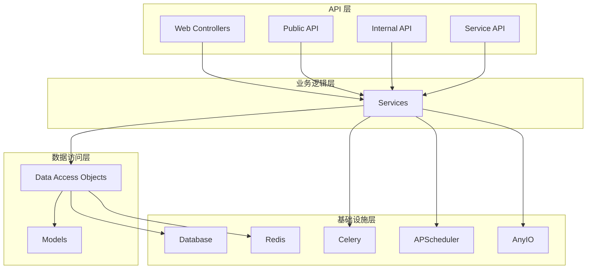
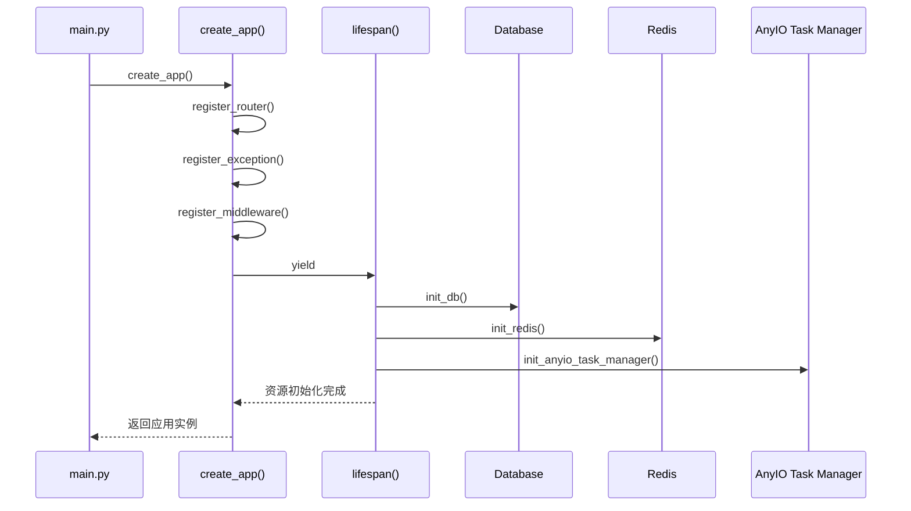
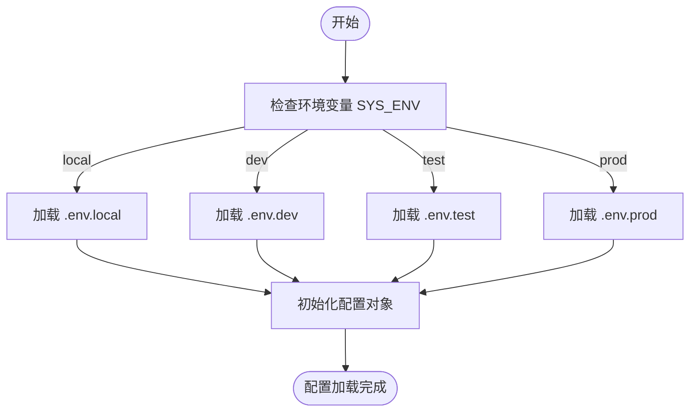

# 项目概述

<cite>
**本文档引用的文件**  
- [main.py](file://main.py)
- [internal/app.py](file://internal/app.py)
- [pyproject.toml](file://pyproject.toml)
- [Dockerfile](file://Dockerfile)
- [internal/config/setting.py](file://internal/config/setting.py)
- [internal/infra/database.py](file://internal/infra/database.py)
- [internal/infra/redis.py](file://internal/infra/redis.py)
- [internal/infra/celery.py](file://internal/infra/celery.py)
- [internal/infra/apscheduler.py](file://internal/infra/apscheduler.py)
- [internal/infra/anyio_task.py](file://internal/infra/anyio_task.py)
- [pkg/openai_client.py](file://pkg/openai_client.py)
- [internal/controllers/web/user.py](file://internal/controllers/web/user.py)
- [internal/services/user.py](file://internal/services/user.py)
</cite>

## 目录
1. [项目简介](#项目简介)
2. [架构风格与分层设计](#架构风格与分层设计)
3. [核心功能特性](#核心功能特性)
4. [依赖管理与构建部署](#依赖管理与构建部署)
5. [应用启动流程](#应用启动流程)
6. [环境配置机制](#环境配置机制)
7. [系统设计权衡](#系统设计权衡)

## 项目简介

fastapi-backend 是一个基于 FastAPI 框架构建的现代化后端服务项目，旨在提供高性能、可扩展且易于维护的 API 服务。该项目采用分层架构设计，实现了高内聚低耦合的软件工程原则。系统支持用户管理、JWT 认证、Redis 缓存、Celery 与 APScheduler 任务调度、AnyIO 异步任务处理以及 OpenAI 集成等关键功能。项目使用 pyproject.toml 进行依赖管理，并通过 uv 和 Docker 实现高效的构建与容器化部署。

**Section sources**
- [main.py](file://main.py#L1-L19)
- [internal/app.py](file://internal/app.py#L1-L105)

## 架构风格与分层设计

本项目采用清晰的分层架构，将系统划分为多个职责明确的层次，包括 API 层、业务逻辑层和数据访问层。这种设计模式确保了各层之间的松耦合，提高了代码的可测试性和可维护性。

**Diagram sources**
- [internal/controllers/web/user.py](file://internal/controllers/web/user.py#L1-L13)
- [internal/services/user.py](file://internal/services/user.py#L1-L17)
- [internal/infra/database.py](file://internal/infra/database.py#L1-L140)
- [internal/infra/redis.py](file://internal/infra/redis.py#L1-L86)

## 核心功能特性

### 用户管理与 JWT 认证
项目实现了完整的用户管理体系，通过 JWT（JSON Web Token）进行身份验证和授权。认证中间件负责校验 Token 的有效性，确保只有合法用户才能访问受保护的 API 接口。

### Redis 缓存
系统集成了 Redis 作为缓存层，用于存储频繁访问的数据，减少数据库查询压力，提高响应速度。缓存客户端提供了统一的接口，便于在业务逻辑中使用。

### 任务调度
项目支持两种任务调度机制：Celery 和 APScheduler。Celery 用于处理分布式任务队列，适用于耗时较长的任务；APScheduler 则用于定时任务的调度，如每日报告生成等。

### AnyIO 异步任务处理
通过 AnyIO 任务管理器，系统能够高效地处理异步任务，充分利用现代 CPU 的多核能力，提升整体性能。

### OpenAI 集成
项目集成了 OpenAI 客户端，支持与 OpenAI 模型进行交互，实现自然语言处理、文本生成等功能。提供了流式和非流式两种响应模式，满足不同场景的需求。

**Section sources**
- [internal/infra/celery.py](file://internal/infra/celery.py#L1-L152)
- [internal/infra/apscheduler.py](file://internal/infra/apscheduler.py#L1-L21)
- [internal/infra/anyio_task.py](file://internal/infra/anyio_task.py#L1-L29)
- [pkg/openai_client.py](file://pkg/openai_client.py#L1-L166)

## 依赖管理与构建部署

项目使用 pyproject.toml 文件进行依赖管理，定义了生产运行时依赖和开发环境依赖。通过 uv 工具实现快速依赖同步和构建，结合 Docker 容器化技术，实现了高效、一致的部署流程。

**Diagram sources**
- [pyproject.toml](file://pyproject.toml#L1-L113)
- [Dockerfile](file://Dockerfile#L1-L40)

## 应用启动流程

应用的启动流程从 main.py 文件开始，通过 create_app 函数创建 FastAPI 应用实例，并在 lifespan 事件处理器中初始化各种资源。

**Diagram sources**
- [main.py](file://main.py#L1-L19)
- [internal/app.py](file://internal/app.py#L1-L105)

## 环境配置机制

项目通过环境变量和配置文件实现不同环境（dev/test/prod）的配置加载。配置类采用策略模式，根据当前环境选择相应的配置类，并从对应的 .env 文件中加载配置。

**Diagram sources**
- [internal/config/setting.py](file://internal/config/setting.py#L1-L59)

## 系统设计权衡

在系统设计过程中，团队进行了多项权衡决策。例如，选择 uv 作为构建工具而非传统的 pip，以获得更快的依赖解析速度；采用 AnyIO 而非 asyncio 直接管理异步任务，以提供更高级别的抽象和更好的兼容性。此外，通过全局单例模式管理数据库连接池和 Redis 客户端，既保证了资源的高效利用，又避免了频繁创建和销毁连接的开销。

**Section sources**
- [internal/infra/database.py](file://internal/infra/database.py#L1-L140)
- [internal/infra/redis.py](file://internal/infra/redis.py#L1-L86)
- [pyproject.toml](file://pyproject.toml#L1-L113)