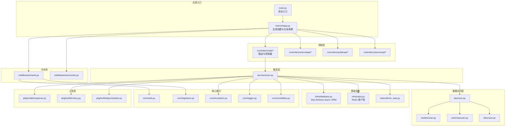
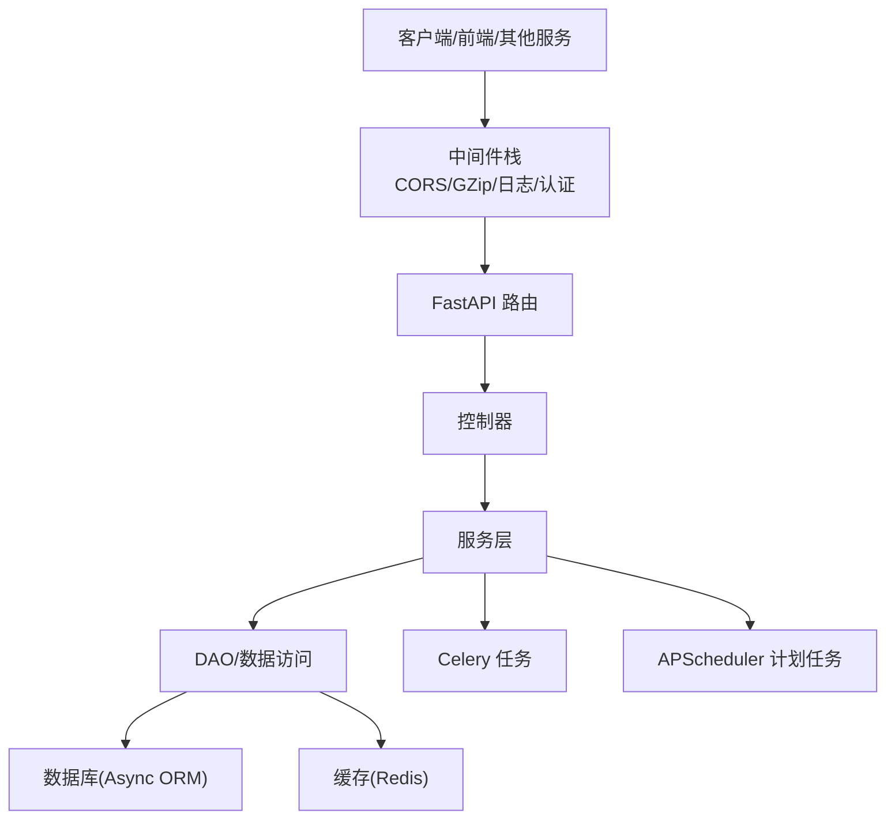
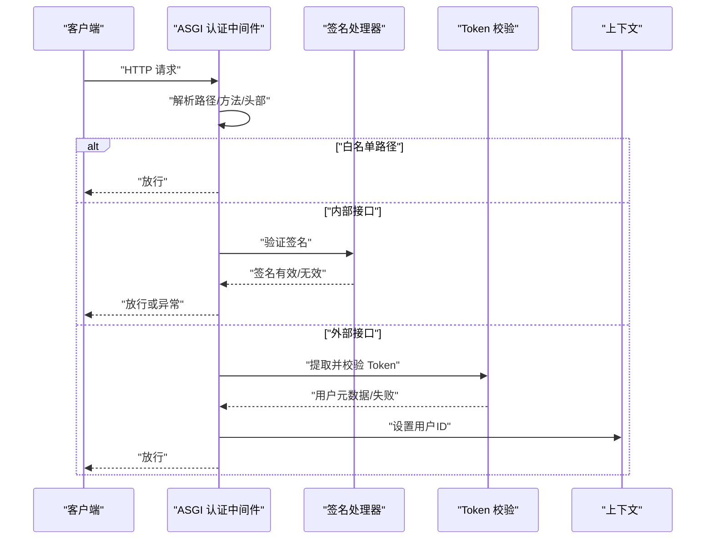
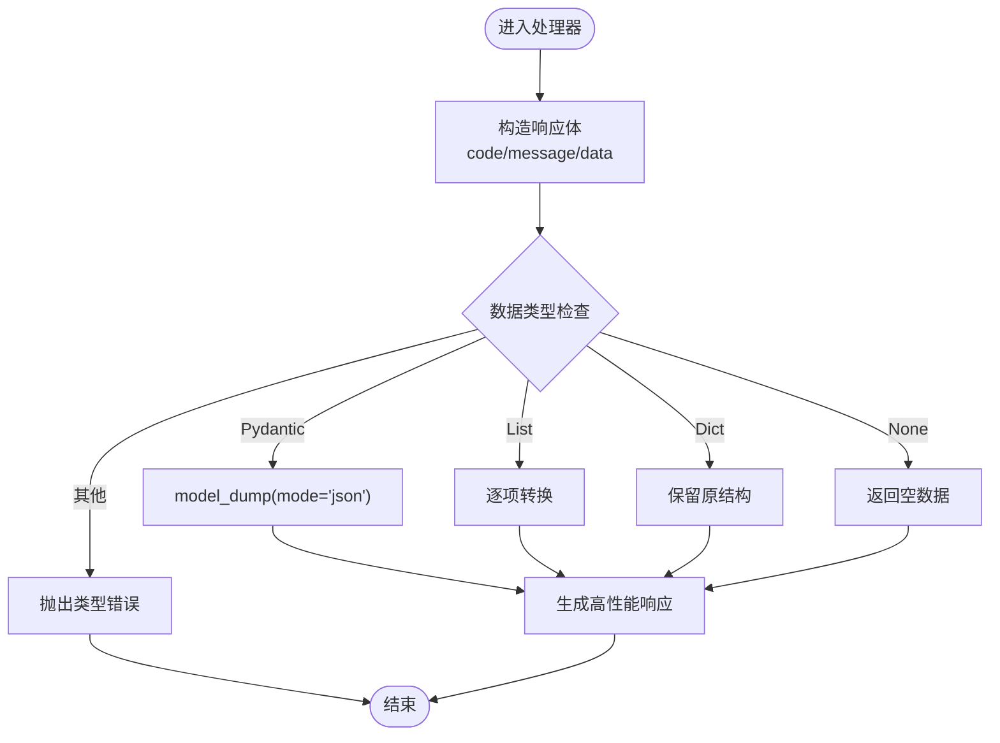
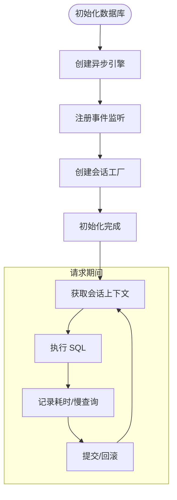
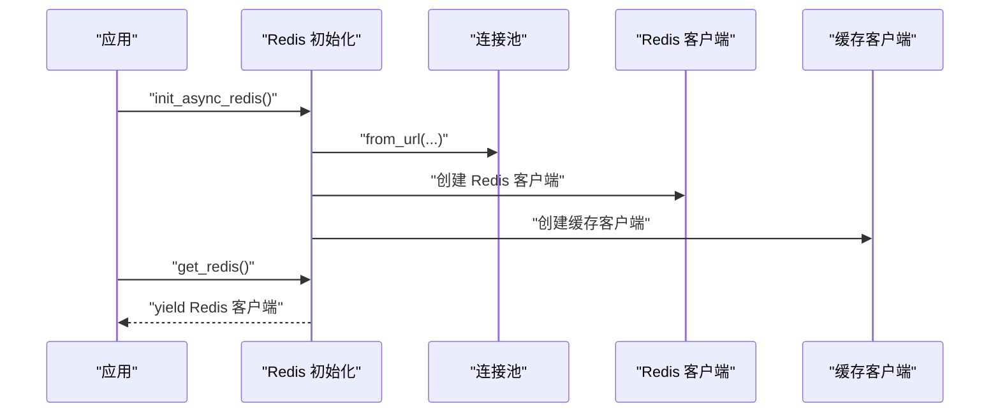
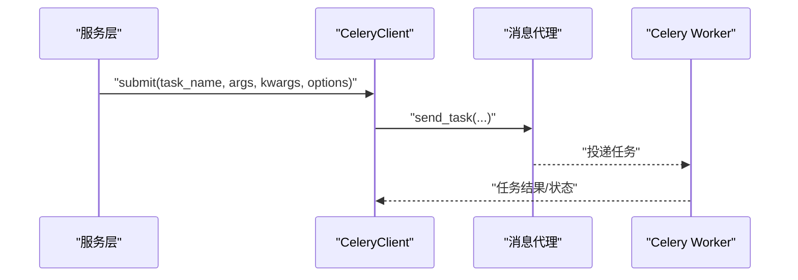
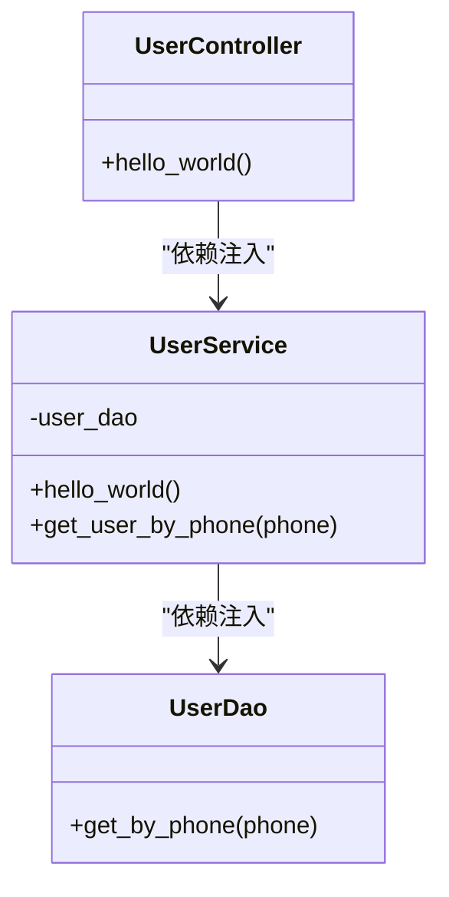
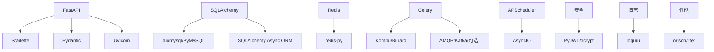

# 项目概述

<cite>
**本文档引用的文件**
- [README.md](file://README.md)
- [main.py](file://main.py)
- [internal/app.py](file://internal/app.py)
- [pyproject.toml](file://pyproject.toml)
- [configs/.env.dev](file://configs/.env.dev)
- [internal/core/auth.py](file://internal/core/auth.py)
- [internal/middlewares/auth.py](file://internal/middlewares/auth.py)
- [pkg/toolkit/response.py](file://pkg/toolkit/response.py)
- [internal/infra/database.py](file://internal/infra/database.py)
- [internal/infra/redis.py](file://internal/infra/redis.py)
- [internal/controllers/web/user.py](file://internal/controllers/web/user.py)
- [internal/services/user.py](file://internal/services/user.py)
- [internal/tasks/demo_task.py](file://internal/tasks/demo_task.py)
- [pkg/toolkit/celery.py](file://pkg/toolkit/celery.py)
- [pkg/toolkit/apscheduler.py](file://pkg/toolkit/apscheduler.py)
</cite>

## 目录
1. [简介](#简介)
2. [项目结构](#项目结构)
3. [核心组件](#核心组件)
4. [架构总览](#架构总览)
5. [详细组件分析](#详细组件分析)
6. [依赖关系分析](#依赖关系分析)
7. [性能考量](#性能考量)
8. [故障排查指南](#故障排查指南)
9. [结论](#结论)
10. [附录](#附录)

## 简介
本项目是一个基于 FastAPI 的高性能异步后端工程骨架，面向企业级应用，强调可扩展性、可观测性与一致性。项目目标包括：
- 提供统一的高性能异步 Web 服务能力
- 构建企业级认证与鉴权体系（Token 与签名双重校验）
- 统一响应格式与错误模型，提升前后端协作效率
- 集成分布式任务处理（Celery）与计划任务（APScheduler）
- 集成缓存系统（Redis）与数据库（SQLAlchemy Async ORM）

项目通过清晰的分层架构、依赖注入与工厂模式，实现控制层、服务层、数据访问层与基础设施层的解耦，便于单元测试与集成测试。

## 项目结构
项目采用“功能域+分层”的组织方式，主要目录与职责如下：
- configs：环境配置与密钥示例
- internal：核心业务与基础设施
  - app：应用入口与生命周期管理
  - controllers：路由与控制器（web/internal/public/service）
  - services：业务服务层
  - dao/models/schemas/dtos：数据访问、领域模型与数据传输对象
  - infra：数据库、Redis、任务调度等基础设施
  - core：认证、加密、异常、日志、签名、雪花 ID 等核心能力
  - middlewares：认证、日志、CORS、GZip 等中间件
  - tasks：可复用的任务逻辑
- pkg：通用工具库（缓存、Celery、APScheduler、响应、JWT、日志等）
- scripts：运维脚本（如 Celery Worker 启动）
- tests：单元与集成测试
- docs：使用指南

图表来源
- [main.py](file://main.py#L1-L18)
- [internal/app.py](file://internal/app.py#L17-L109)
- [internal/controllers/web/user.py](file://internal/controllers/web/user.py#L1-L17)
- [internal/services/user.py](file://internal/services/user.py#L1-L21)
- [internal/infra/database.py](file://internal/infra/database.py#L26-L154)
- [internal/infra/redis.py](file://internal/infra/redis.py#L18-L98)
- [internal/middlewares/auth.py](file://internal/middlewares/auth.py#L88-L150)
- [internal/core/auth.py](file://internal/core/auth.py#L5-L20)
- [pkg/toolkit/response.py](file://pkg/toolkit/response.py#L181-L233)
- [pkg/toolkit/celery.py](file://pkg/toolkit/celery.py#L15-L198)
- [pkg/toolkit/apscheduler.py](file://pkg/toolkit/apscheduler.py#L14-L255)

章节来源
- [main.py](file://main.py#L1-L18)
- [internal/app.py](file://internal/app.py#L17-L109)

## 核心组件
- 应用入口与生命周期
  - 通过应用工厂函数创建 FastAPI 实例，注册路由、异常处理与中间件，并在 lifespan 中完成日志、数据库、Redis、签名认证、雪花 ID、AnyIO 任务管理的初始化与关闭。
- 认证与鉴权
  - ASGI 认证中间件支持白名单放行、内部接口签名认证与外部接口 Token 校验；Token 校验通过缓存 DAO 读取用户元数据与令牌列表，确保安全与幂等。
- 统一响应与错误模型
  - 基于 orjson 的高性能响应类，统一封装 code/message/data 结构，支持 Pydantic 模型序列化、分页列表与 SSE 数据包装。
- 数据库与缓存
  - SQLAlchemy Async ORM 提供异步连接池与 SQL 监控；Redis 提供连接池与缓存客户端封装，支持上下文管理与延迟初始化。
- 分布式任务与计划任务
  - Celery 工具类封装任务提交、编排与生命周期钩子；APScheduler 封装异步调度器，支持 Cron/Interval/Date 触发器与全局默认参数。
- 依赖注入与工厂
  - 控制器通过依赖注入函数获取服务实例，服务层通过工厂函数注入 DAO，DAO 通过基础设施模块初始化，形成清晰的依赖链。

章节来源
- [internal/app.py](file://internal/app.py#L17-L109)
- [internal/middlewares/auth.py](file://internal/middlewares/auth.py#L88-L150)
- [internal/core/auth.py](file://internal/core/auth.py#L5-L20)
- [pkg/toolkit/response.py](file://pkg/toolkit/response.py#L181-L233)
- [internal/infra/database.py](file://internal/infra/database.py#L26-L154)
- [internal/infra/redis.py](file://internal/infra/redis.py#L18-L98)
- [pkg/toolkit/celery.py](file://pkg/toolkit/celery.py#L15-L198)
- [pkg/toolkit/apscheduler.py](file://pkg/toolkit/apscheduler.py#L14-L255)

## 架构总览
项目采用分层架构与中间件模式，结合依赖注入与工厂模式，实现高内聚低耦合：
- 表现层：FastAPI 路由与控制器，负责请求接入与响应输出
- 领域服务层：业务逻辑集中，依赖注入 DAO 与基础设施
- 数据访问层：DAO 封装数据库与缓存操作
- 基础设施层：数据库连接池、Redis 连接池、任务与调度器
- 核心能力层：认证、签名、日志、异常、雪花 ID 等横切关注点

图表来源
- [internal/app.py](file://internal/app.py#L55-L82)
- [internal/middlewares/auth.py](file://internal/middlewares/auth.py#L88-L150)
- [internal/controllers/web/user.py](file://internal/controllers/web/user.py#L1-L17)
- [internal/services/user.py](file://internal/services/user.py#L1-L21)
- [internal/infra/database.py](file://internal/infra/database.py#L26-L154)
- [internal/infra/redis.py](file://internal/infra/redis.py#L18-L98)
- [pkg/toolkit/celery.py](file://pkg/toolkit/celery.py#L15-L198)
- [pkg/toolkit/apscheduler.py](file://pkg/toolkit/apscheduler.py#L14-L255)

## 详细组件分析

### 认证中间件流程
认证中间件在请求进入时进行白名单放行、内部接口签名校验与外部 Token 校验，校验失败统一抛出应用异常，最终将用户上下文写入线程/异步上下文。

图表来源
- [internal/middlewares/auth.py](file://internal/middlewares/auth.py#L88-L150)
- [internal/core/auth.py](file://internal/core/auth.py#L5-L20)

章节来源
- [internal/middlewares/auth.py](file://internal/middlewares/auth.py#L88-L150)
- [internal/core/auth.py](file://internal/core/auth.py#L5-L20)

### 统一响应与错误模型
统一响应体包含 code/message/data，支持 Pydantic 模型自动序列化、分页列表与 SSE 包装；错误模型通过全局状态码对象与错误类组合，保证前后端一致的错误语义。

图表来源
- [pkg/toolkit/response.py](file://pkg/toolkit/response.py#L88-L170)

章节来源
- [pkg/toolkit/response.py](file://pkg/toolkit/response.py#L181-L233)

### 数据库连接与 SQL 监控
数据库初始化建立异步引擎与会话工厂，注册 SQL 执行前后事件监听，按配置输出慢查询日志；提供上下文管理器以安全获取与回收会话。

图表来源
- [internal/infra/database.py](file://internal/infra/database.py#L26-L154)

章节来源
- [internal/infra/database.py](file://internal/infra/database.py#L26-L154)

### Redis 缓存与上下文获取
Redis 初始化建立连接池与缓存客户端，提供上下文管理器以安全获取 Redis 客户端；通过惰性代理封装全局缓存实例，避免导入时未初始化问题。

图表来源
- [internal/infra/redis.py](file://internal/infra/redis.py#L18-L98)

章节来源
- [internal/infra/redis.py](file://internal/infra/redis.py#L18-L98)

### 分布式任务与计划任务
- Celery 工具类封装任务提交、编排（chain/group/chord）、状态查询与生命周期钩子，支持队列、优先级、延时执行等参数合并策略。
- APScheduler 封装异步调度器，支持延迟启动、全局默认参数与多种触发器，提供便捷注册方法与运行期管理。

图表来源
- [pkg/toolkit/celery.py](file://pkg/toolkit/celery.py#L75-L108)
- [internal/tasks/demo_task.py](file://internal/tasks/demo_task.py#L9-L20)

章节来源
- [pkg/toolkit/celery.py](file://pkg/toolkit/celery.py#L15-L198)
- [pkg/toolkit/apscheduler.py](file://pkg/toolkit/apscheduler.py#L14-L255)
- [internal/tasks/demo_task.py](file://internal/tasks/demo_task.py#L1-L20)

### 控制器与依赖注入示例
控制器通过依赖注入函数获取服务实例，服务层再注入 DAO，形成清晰的依赖链，便于测试与替换。

图表来源
- [internal/controllers/web/user.py](file://internal/controllers/web/user.py#L1-L17)
- [internal/services/user.py](file://internal/services/user.py#L1-L21)

章节来源
- [internal/controllers/web/user.py](file://internal/controllers/web/user.py#L1-L17)
- [internal/services/user.py](file://internal/services/user.py#L1-L21)

## 依赖关系分析
项目依赖以 pyproject.toml 为准，核心依赖包括：
- Web 框架与运行时：FastAPI、Uvicorn、Starlette、Pydantic
- 异步数据库：SQLAlchemy、aiomysql/PyMySQL
- 缓存与消息：Redis、Celery、APScheduler、Kombu、Billiard
- 工具与安全：PyJWT、bcrypt、cryptography、loguru、orjson、jiter、shortuuid、snowflake-id
- gRPC 与云存储：grpcio、oss2、boto3
- 开发与质量：pytest、ruff、black、mypy、types-* 等

图表来源
- [pyproject.toml](file://pyproject.toml#L9-L70)

章节来源
- [pyproject.toml](file://pyproject.toml#L1-L155)

## 性能考量
- 异步与事件循环
  - 使用 uvloop（非 Windows）与 httptools 提升事件循环性能；AnyIO 任务管理器用于后台任务与资源清理。
- 序列化与网络
  - 使用 orjson 进行高性能 JSON 序列化与反序列化，统一 Web 与任务侧序列化策略；GZip 中间件减少传输体积。
- 数据库与缓存
  - 异步连接池与 pre_ping 降低连接失效风险；慢 SQL 监控与阈值配置帮助定位性能瓶颈；Redis 连接池与惰性代理避免未初始化问题。
- 任务与调度
  - Celery 支持队列、优先级与延时执行；APScheduler 支持抖动与合并执行，缓解整点压力。

[本节为通用性能建议，不直接分析具体文件]

## 故障排查指南
- 认证失败
  - 检查白名单路径配置、签名头（X-Signature/X-Timestamp/X-Nonce）与 Token 前缀（Bearer）；确认缓存中是否存在用户元数据与令牌列表。
- 数据库连接问题
  - 确认初始化顺序与 lifespan 生命周期；检查连接池大小、超时与 recycle 配置；查看慢查询日志定位热点 SQL。
- Redis 连接问题
  - 确认连接 URL 与最大连接数；检查上下文管理器是否正确获取客户端；注意重置与关闭时机。
- 任务执行异常
  - 查看 Celery Worker 日志与生命周期钩子；确认任务名称与参数；使用状态查询与结果获取接口定位失败原因。
- 响应格式异常
  - 确认返回数据类型符合要求（dict/list/Pydantic 模型/None）；检查统一响应工厂的使用方式。

章节来源
- [internal/middlewares/auth.py](file://internal/middlewares/auth.py#L119-L149)
- [internal/infra/database.py](file://internal/infra/database.py#L116-L154)
- [internal/infra/redis.py](file://internal/infra/redis.py#L70-L98)
- [pkg/toolkit/celery.py](file://pkg/toolkit/celery.py#L159-L198)
- [pkg/toolkit/response.py](file://pkg/toolkit/response.py#L101-L133)

## 结论
本项目以 FastAPI 为核心，结合 SQLAlchemy Async ORM、Redis、Celery 与 APScheduler，构建了具备高性能、可扩展与可观测性的企业级后端骨架。通过分层架构、依赖注入与工厂模式，以及统一的认证、响应与任务体系，能够快速支撑复杂业务场景。建议在实际落地时，结合环境变量与部署实践完善配置与监控告警。

[本节为总结性内容，不直接分析具体文件]

## 附录
- 环境变量示例
  - 开发环境示例展示了调试开关、JWT 算法、数据库与 Redis 连接信息、Token 过期时间等关键配置项。
- 使用场景示例
  - Web 控制器示例：通过依赖注入获取服务实例，返回统一响应。
  - 任务示例：可被 Celery 与 APScheduler 复用的纯逻辑任务函数。
  - 认证示例：中间件对白名单、内部接口签名与外部 Token 的差异化处理。

章节来源
- [configs/.env.dev](file://configs/.env.dev#L1-L20)
- [internal/controllers/web/user.py](file://internal/controllers/web/user.py#L1-L17)
- [internal/tasks/demo_task.py](file://internal/tasks/demo_task.py#L1-L20)